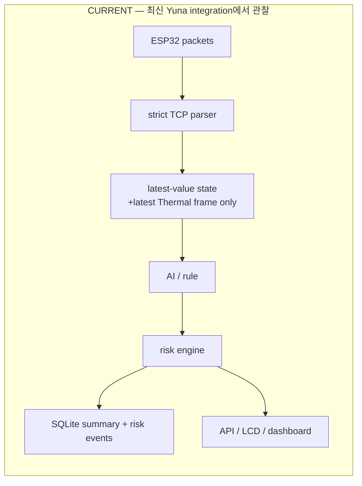
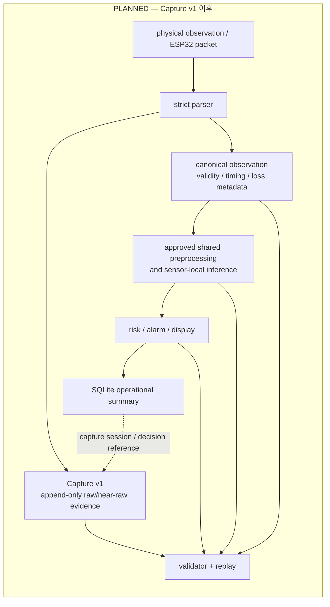

# SafeNest Raspberry Pi 멀티센서 통합·증거 수집 로드맵

- 문서 버전: `01`
- 기준일: `2026-08-14`
- 상태: `PROPOSED_ROADMAP — implementation not authorized by this document`
- 범위: Raspberry Pi 수신·Capture·replay·AI 연결·운영 기록·실기기 검증의 단계별 계획
- 비범위: ESP32 firmware, 센서 취득 코드, AI 재학습·모델 교체, risk threshold, 공개 shared contract, LCD/dashboard 동작 변경

## 1. 요약

현재 최신 통합 구현은 ESP32 TCP 패킷을 Raspberry Pi에서 검증하고, 최신 센서 상태를 메모리에 유지한 뒤 AI·risk·웹 대시보드로 연결한다. 또한 SQLite에는 센서 상태 요약과 위험 전환 이벤트를 남긴다. 이는 운영자가 현재 상태와 경보 이력을 보는 데 유용하다.

그러나 SQLite 요약 행은 모델 재학습 또는 정확한 재생을 위한 원본 증거가 아니다. 예를 들어, 62×80 열화상 픽셀 전체와 mmWave 연속 파형은 요약 행에서 복원할 수 없으며, 현재 수신 계약에는 mmWave 모델 입력과 CO₂ 모델 입력 일부가 없다. 따라서 이 로드맵은 기존 SQLite를 없애는 계획이 아니라, 수신 직후의 원본/근원 데이터와 판단 계보를 별도로 보존하는 **Capture v1**을 추가하는 계획이다.

핵심 원칙은 다음과 같다.

> 운영 요약 로그와 모델 검증용 Capture는 서로 다른 책임이며, 어느 한쪽이 다른 쪽을 대체하지 않는다.

## 2. 범위와 비목표

이 문서는 Pi가 실제 장치 패킷을 받아 `Capture → canonical observation → approved preprocessing → sensor-local inference → risk → alarm/display → operational summary`로 연결되는 과정을 설계한다. 이후에 실제 장치 데이터의 품질을 검토하고, 동의·라벨·개인정보 검토를 거쳐서만 별도 데이터셋 입장과 재학습이 가능하도록 경계를 둔다.

이 문서는 다음을 승인하지 않는다.

- TFLite 파일만으로 Raspberry Pi 또는 실센서 준비가 끝났다고 주장하는 일
- MR60의 호흡수 scalar가 mmWave 분류기 입력과 동일하다고 가정하는 일
- `thermal_max_c` 또는 SQLite 요약 행으로 전체 열화상 프레임을 복원할 수 있다고 보는 일
- Thermal 자세/`LYING` proxy를 실제 낙상 사건 검증으로 표현하는 일
- mock/E2E 성공을 실하드웨어 검증 성공으로 표현하는 일
- Capture한 실센서 데이터를 자동으로 학습 데이터셋에 편입하는 일

## 3. 감사 기준과 증거 등급

### 3.1 검사한 저장소 기준선

| 저장소 | 원격 기준 SHA | 검사 범위 | 지침 |
|---|---|---|---|
| 팀 `jinsu1011/safenest-embedded-competition` `main` | `fdf34b804f35e5868356f0ed6f804a248aa69131` | 팀의 현재 병합 runtime, device 파일, 열린 통합 PR | `ondevice_ai/AGENTS.md` |
| Yuna `yuname121/integration` `main` | `4ac5bfb3b8fcf2ba99c9f28b19c1ddbc33e046c5` | 최신 standalone Pi 통합 구현과 실행·저장·AI 경로 | `sources/ondevice_ai/AGENTS.md` |
| standalone `sheepmeat/test` `main` | `4260119cb5274d6cffacf1a40934bc81f86c46ee` | 승인된 AI 입력/출력 계약과 멀티센서 상위 roadmap | root `AGENTS.md` |

위 SHA는 2026-08-14에 각 `origin/main`을 fetch한 뒤 기록했다. `archive/`와 historical snapshot은 현재 runtime 근거로 사용하지 않았다.

### 3.2 증거 표기

- `CODE_VERIFIED`: 해당 SHA의 실행 경로 또는 실제 import를 읽어 확인함.
- `TEST_VERIFIED`: 코드에 자동 테스트가 있고 그 검증 범위가 문서/테스트로 확인됨. 이 표기는 실하드웨어 성공을 뜻하지 않는다.
- `DOCUMENTED_ONLY`: 문서에만 있는 설명으로, 이번 감사에서 실행을 재현하지 않음.
- `INFERRED`: 코드 경계에서 합리적으로 도출했지만 실제 장치에서 아직 측정하지 않음.
- `PLANNED` / `BLOCKED_HARDWARE`: 아직 구현 또는 실제 장치 계약이 필요한 미래 상태.

## 4. 현재 Raspberry Pi 구조

### 4.1 관찰된 최신 후보 runtime

Yuna integration의 Pi 실행 진입점은 `deployment/run_pi.sh`와 `backend/run_backend.py`이며, 주요 경로는 다음과 같다.

| 구성 요소 | 경로 | 현재 역할과 입출력 | 보존/폐기 상태 | 증거 |
|---|---|---|---|---|
| TCP receiver | `gateway/receiver.py`, `gateway/protocol.py` | TCP 9000에서 `safenest.telemetry.v1` JSON과 type-2 Thermal U16 BE packet을 길이·schema·sequence·frame min/max 기준으로 검사 | packet은 callback 뒤 장기 저장하지 않음 | `CODE_VERIFIED` |
| state manager | `state/manager.py` | packet을 센서별 최신값, monotonic freshness, stale/invalid/disconnect 상태로 변환 | scalar 최신값과 최신 Thermal frame 1개만 메모리에 유지; 이전 packet/frame은 교체되어 사라짐 | `CODE_VERIFIED` |
| AI boundary | `ai/pipeline.py`, `ai/runtime.py` | 현재 state와 최신 Thermal frame을 읽고 model adapter를 지연 로드 | mmWave/CO₂ 입력 부족 시 추론하지 않고 unavailable을 반환 | `CODE_VERIFIED` |
| risk | `risk/engine.py` | AI/rule 결과를 frozen V4 설정에 따라 risk, reason, emergency로 변환 | publication에 결과는 남지만 raw input은 보존하지 않음 | `CODE_VERIFIED` |
| 운영 persistence | `backend/store.py`, `database/store.py`, `database/schema.sql` | 매 publication과 risk event를 SQLite에 transaction으로 기록, API history 제공 | summary/risk event는 보존; full frame, raw packet, preprocessing trace는 미보존 | `CODE_VERIFIED` |
| API/dashboard | `backend/app.py`, `backend/views.py`, `web/dashboard/` | latest/history/events를 dashboard에 공개 | 운영 표시용; Capture source 아님 | `CODE_VERIFIED` |
| 기존 LCD path | 팀 `display-test/server.py`, Yuna `sources/display-test2/raspberry_pi_lcd/server.py` | 최신값·`state.json`을 LCD 화면에 제공 | `state.json`은 화면 상태용이며 sensor history가 아님 | `CODE_VERIFIED` |

`SafeNestRuntime`은 receiver thread와 1초 evaluation thread를 사용한다. receiver는 reconnect/packet framing 오류를 분리해 처리하고, state manager는 wall time과 monotonic time을 구분해 stale을 판단한다. 이는 Capture v1이 반드시 보존해야 하는 좋은 기존 경계다.

### 4.2 현재와 목표의 차이





Capture와 runtime 판단은 parser 뒤에서 분기한다. Capture writer의 장애가 정상 데이터처럼 보이지 않아야 하며, raw payload를 SQLite BLOB에 넣어 운영 DB를 대체하지 않는다.

## 5. 현재 센서 계약과 AI 입력 비교

| 센서 | Pi가 현재 받는 값 | Pi가 현재 장기 저장하는 값 | standalone/통합 AI가 실제 요구하는 값 | 지금 replay 가능 여부 | 누락 계약과 현재 blocker |
|---|---|---|---|---|---|
| mmWave | respiration rate, heart rate, validity, shared sequence/uptime; presence는 state에서 `None` | SQLite respiration/heart summary와 risk 결과 | `resp_phase_unwrapped_clutter_removed`, 10 Hz × 30 s = 300 finite sample, shape `[1,300,1]`; approved BPF/Z-score/INT8 contract | `NOT_CURRENTLY_REPLAYABLE` | 연속 phase, sampling/timing, signal quality, presence/distance, raw/near-raw UART evidence 없음. `MISSING_UPSTREAM_FIELDS`, inference blocker. |
| CO₂ | ppm, validity, shared sequence/uptime | SQLite CO₂ ppm summary와 risk 결과 | 현재 active legacy runtime: `[CO2_slope, Humidity, CO2]`; standalone C-B5 candidate metadata: `[CO2, Temperature, Humidity, CO2_slope]` | `NOT_CURRENTLY_REPLAYABLE` | humidity, temperature, measurement timing/history, warm-up, I²C/reconnect/delay 상태 없음. active runtime와 C-B5 feature-order 차이도 reconcile 필요. `MISSING_UPSTREAM_FIELDS`, inference blocker. |
| Thermal | full 62×80 big-endian `uint16` frame, frame sequence, device uptime, raw min/max | 최신 frame 1개만 메모리; SQLite는 raw min/max, AI state/probability summary만 저장 | current integration: `(62,80)` frame을 per-frame min-max로 처리; standalone Thermal-44 driver/interpreter도 `(62,80)` float frame 기대 | `PARTIALLY_REPLAYABLE_NOW` — transport 검증과 live inference 가능하나 과거 frame이 보존되지 않음 | raw physical unit/temperature calibration, orientation, invalid-pixel policy, model/device identity reconcile 필요. full frame capture 미구현은 evidence blocker. |
| PIR | boolean motion | SQLite motion summary, risk event | 별도 AI model 없음; rule/supporting evidence | `PARTIALLY_REPLAYABLE_NOW` — summary 수준만 | transition timing, debounce/config, packet loss/reboot provenance 미보존. AI blocker는 아니나 capture gap. |

### 5.1 mmWave 판정

`config/mmwave_input_contract.yaml`과 `inference/mmwave_interpreter.py`는 10 Hz, 30초, 300 sample, `[1,300,1]` 입력과 finite sample 검사를 요구한다. 반면 최신 integration protocol은 respiration/heart scalar만 decode하고 state manager도 phase window를 만들지 않는다. 그러므로 현재 MR60 scalar telemetry는 standalone classifier와 **직접 호환되지 않는다**. 이것은 모델 실패가 아니라 입력 계약 미충족이며, Pi가 값을 추정하거나 zero-fill하여 정상 추론처럼 보이게 해서는 안 된다. 증거: `CODE_VERIFIED`.

### 5.2 CO₂ 판정

현재 Yuna AI pipeline은 ppm history를 메모리 `deque`에만 보관하고 slope를 계산하려 하지만, humidity가 없으면 fail-closed한다. 그리고 standalone의 현재 active legacy manifest/interpreter는 3 feature를 쓰는 반면, C-B5 final candidate metadata는 Temperature를 포함한 4 feature를 명시한다. 어떤 artifact와 adapter가 Pi runtime의 공식 후보인지 먼저 결정하지 않으면 feature order/scaler가 달라질 수 있다. CO₂ 농도 safety rule, occupancy model, sensor health, multisensor risk는 별도 계보로 기록해야 한다. 증거: `CODE_VERIFIED`; C-B5 device-domain validation은 `NOT_YET_COMPLETE`.

### 5.3 Thermal 판정

최신 Yuna integration은 이전 팀 PR의 scalar-only 상태와 달리 type-2 packet으로 full 62×80 frame을 수신하고 현재 frame으로 AI를 호출한다. 다만 frame은 다음 frame이 오면 메모리에서 교체되고 SQLite에는 full payload가 저장되지 않는다. 현재 transport의 픽셀은 big-endian `uint16` raw value이며, Yuna 문서는 temperature calibration을 하지 않는다고 명시한다. 따라서 `thermal_max_c` 같은 display summary와 full frame AI input을 동일시할 수 없다. Thermal Phase A 완료는 재현 가능한 data foundation이지 새 fall model의 device deployment 승인도 아니다. 증거: `CODE_VERIFIED` 및 부분 `DOCUMENTED_ONLY`.

## 6. 현재 persistence와 중복 runtime 위험

SQLite `sensor_snapshots`/`risk_events`는 publication revision, sensor status, 일부 scalar, thermal raw min/max, AI summary, risk reasons를 기록한다. WAL과 transaction, restart baseline 복원, API history는 이미 설계되어 있다. 이는 유지한다. 반면 다음은 현재 저장되지 않는다: packet bytes, decode failure payload/metadata, sequence gap별 event, full Thermal frame, mmWave phase window, CO₂ raw history, preprocessing trace, exact model checksum과 source SHA의 decision-level link.

팀 `main`에는 legacy `display-test/` 및 `ondevice_ai/integrated_node/`가 있고, 아직 열려 있는 PR #12 (`feature/esp32-lcd-integration`)와 PR #11 (`agent/add-competition-package`)도 별도 Pi/LCD path를 추가한다. 최신 Yuna integration은 이보다 넓은 `gateway/`, `state/`, `backend/`, `database/`, `ai/`, `risk/` runtime을 가진 별도 standalone repository다.

따라서 현재 authoritative team Pi runtime은 `BLOCKED_OWNER_DECISION`이다. 최신 기능 참조 후보는 Yuna integration이지만, 팀 `main`에 무단 복사하거나 PR #11/#12와 병렬 실행 경로를 모두 남기는 것은 금지한다. 다음 phase에서 팀 lead, Pi integration owner, device owner, `ondevice_ai` owner가 단일 authoritative runtime과 migration/retirement 결정을 내려야 한다.

추가로 Yuna README는 standalone repository root 실행을 안내하지만 `deployment/run_pi.sh`는 parent directory로 이동한 뒤 상대 경로 `backend/run_backend.py`를 실행한다. standalone clone에서의 실제 실행 경로가 문서와 다를 가능성이 있으므로, RP-0에서 Pi preflight와 deployment command를 실측해 고정해야 한다. 이는 `P1`, `CODE_VERIFIED` path discrepancy이며 실행 성공 여부는 미검증이다.

## 7. Capture v1 설계

### 7.1 두 저장 층의 책임

| 층 | 목적 | 저장 대상 | 저장하지 않을 것 |
|---|---|---|---|
| Capture v1 | replay, sensor/device-domain 검증, 오류 진단, 추후 dataset 후보 선별 | raw/near-raw packet evidence, timing/loss/validity, full Thermal payload, canonical observation, decision linkage | 화면 편의를 위한 임의 값 치환, Git에 raw human/environment payload |
| SQLite 운영 요약 | 운영 화면, 경보 이력, 빠른 history query | current state summary, risk/alarm transition, operator-oriented summary | 대형 raw frame/packet 전체, 학습 데이터셋 본문 |

### 7.2 제안 session 구조

`captures/`는 future runtime data root이며 Git ignored로 관리한다. Git에는 schema, validator, fixture, manifest format, checksum summary만 둔다.

```text
captures/<session_id>/
├── session_manifest.json
├── events.jsonl
├── observations.jsonl
├── decisions.jsonl
├── thermal/
│   ├── frames-000001.npz
│   └── frames-000001.index.jsonl
├── checksums.sha256
└── closure.json
```

- `events.jsonl`: 연결, parser reject, reboot inference, sequence gap, stale, writer error, session lifecycle 같은 append-only 사건.
- `observations.jsonl`: packet을 정상화한 scalar observation과 raw payload reference. CSV export는 여기에서 만들며 source of truth가 아니다.
- `thermal/*.npz`: 동일 dtype/shape frame 묶음을 losslessly 저장하는 후보 형식이다. NPZ가 Pi CPU/latency 기준을 통과하지 못하면 deterministic chunked binary array를 비교해 선정한다.
- `decisions.jsonl`: exact input evidence reference, preprocessing/model identity, prediction, risk/display/alarm 결과.
- `closure.json`: writer counts, lost count, checksum coverage, partial/corrupt 여부, end reason을 포함한다.

### 7.3 공통 provenance envelope

모든 raw event, observation, decision은 schema version과 아래 의미가 분리된 필드를 가져야 한다.

| 필드 | 의미 |
|---|---|
| `schema_version`, `session_id`, `sensor_type`, `device_id` | 어떤 contract/session/sensor가 만든 record인지 식별 |
| `boot_id`, `sequence`, `device_uptime_ms` | ESP32 재부팅과 packet 순서·손실을 재구성. 현재 `boot_id`는 upstream dependency임 |
| `pi_receive_wall_time`, `pi_receive_monotonic_time` | wall-clock 기록과 clock 변경에 영향받지 않는 freshness 시간을 분리 |
| `parse_valid`, `sensor_valid`, `stale`, `missing_packet_count` | 수신·파싱·센서 유효성·freshness를 혼동하지 않음 |
| `error_code`, `error_reason` | malformed packet, capture failure, AI failure 등을 machine-readable하게 분리 |
| `raw_payload_reference`, `payload_sha256` | scalar/thermal evidence가 어디에 있으며 손상되지 않았는지 연결 |

`timestamp` 하나로 device time, Pi receive time, inference time, display time을 합치지 않는다. Pi wall-clock을 UTC로 기록하려면 NTP/clock status를 session manifest에 기록한다. 시간대가 검증되지 않은 source timestamp에 자동으로 UTC `Z`를 붙이지 않는다. 결측/오류 값은 `null`, `valid=false`, 명시적 reason으로 남기며 0 같은 그럴듯한 수치로 대체하지 않는다.

### 7.4 writer reliability 원칙

Capture writer는 receiver와 분리된 bounded queue/worker를 사용하되, queue overflow·disk full·permission·checksum·flush 오류를 `CAPTURE_FAILURE` event로 즉시 노출해야 한다. packet reception/LCD loop를 무기한 block하지 않으면서도 "기록 중"이라는 허위 상태를 만들지 않는 것이 목표다.

- append-only record, session/size/time rotation, atomic manifest/closure write를 사용한다.
- full Thermal frame은 payload write 성공 뒤 reference record를 commit한다.
- power loss 후 validator가 truncated JSONL, missing payload, checksum 불일치, unclosed session을 검출해야 한다.
- 장기 운영 전 disk budget, retention, secure export/backup 방식과 SQLite WAL backup 절차를 확정한다.

## 8. ESP32 계약 의존성

아래는 Pi가 필요한 사실을 기록한 것이며 firmware 변경 지시가 아니다. 실제 변경은 device owner와 public-contract reviewer의 별도 승인 후에만 가능하다.

| dependency | Pi가 지금 구현 가능 | 현재 received field | 필요한 future field | Pi가 필요한 이유 | inference/evidence 영향 | owner/reviewer |
|---|---:|---|---|---|---|---|
| mmWave phase window/source samples | 아니오 | respiration/heart scalar | 10 Hz phase sample 또는 deterministic near-raw stream, sample timing | 300-sample model input과 replay 구성 | inference `BLOCKING` | mmWave device owner + AI owner |
| mmWave quality/presence | 일부 | validity only; presence unavailable | presence, distance, signal quality, source error | stale/low-SNR와 model failure를 구분 | evidence `BLOCKING`, risk quality `P1` | mmWave device owner + Pi owner |
| CO₂ humidity/temperature | 아니오 | ppm | humidity, temperature, measurement timestamp | active/C-B5 feature contract and slope lineage | inference `BLOCKING` | CO₂ device owner + AI owner |
| CO₂ health details | 일부 | `valid.co2` | warm-up, I²C error, reconnect, measurement age | false normal 방지와 quality audit | evidence `P1` | CO₂ device owner + Pi owner |
| boot identity | 일부 | sequence, uptime | boot ID or explicit reboot event | connection-reset sequence reset을 재부팅과 구분 | evidence `P1` | ESP32 owner + Pi owner |
| Thermal full frame | 예 | 62×80 U16 BE full frame | 없음 for payload; unit/orientation/calibration metadata remain unresolved | lossless frame capture/replay | capture `P0` | Thermal device owner + Pi owner |
| PIR configuration | 일부 | motion boolean | debounce/config revision, device health | transition reproducibility | evidence `P2` | PIR/device owner |

## 9. 단계별 Raspberry Pi 통합 로드맵

기존 master roadmap의 `I-*`는 공용 integration inventory/fusion 흐름에 이미 사용되므로, 이 문서는 충돌을 피하기 위해 Raspberry Pi 전용 `RP-*`를 사용한다. 각 phase는 이전 phase의 evidence gate 없이는 다음 phase의 성공으로 해석하지 않는다.

### RP-0 — Runtime·계약 freeze와 단일 runtime 결정

- **목표/이유:** 팀 main, PR #11/#12, Yuna integration, standalone AI의 어느 runtime/contract를 기준으로 이관할지 고정한다. 두 Pi runtime이 동시에 active이면 packet semantics와 data location이 갈라진다.
- **선행조건:** 원격 SHA fetch, AGENTS read, 팀 lead/owner availability.
- **범위/비범위:** entry point·imports·SQLite·protocol·model resolution audit과 migration decision만 포함한다. firmware/AI/risk/dashboard 변경은 제외한다.
- **입력·예상 구현:** frozen audit manifest, runtime ownership decision, deployment preflight probe. Yuna `run_pi.sh` path discrepancy도 실제 Pi 환경에서 확인한다.
- **산출물:** runtime inventory, migration/retirement matrix, source/base SHA record, contract freeze document.
- **검증·수용 기준:** one authoritative runtime candidate, one documented migration path, no unreviewed duplicate server; all current packet types/entry points accounted for.
- **차단/증거/검토:** owner decision 없으면 `BLOCKED_OWNER_DECISION`; evidence is CODE/command audit; reviewers are team lead, Pi owner, device owners, AI owner.
- **다음 authorization:** `RP-1` schema design only.

### RP-1 — Capture v1 schema와 session contract

- **목표/이유:** 서로 다른 sensor packet을 재생 가능한 한 session으로 묶고, invalid/stale/loss 상태를 normal value와 구별한다.
- **선행조건:** RP-0 contract freeze.
- **범위/비범위:** JSON Schema/dataclass, error taxonomy, timestamp semantics, session open/close contract. ESP32 field 추가나 runtime writer 구현은 제외한다.
- **입력·예상 구현:** current protocol/AI contract를 읽어 raw event, observation, decision envelope와 payload-reference contract를 정의한다.
- **산출물:** versioned schema, example fixtures, explicit `ESP32_CONTRACT_DEPENDENCY` registry.
- **검증·수용 기준:** valid/invalid/null cases, timing meanings, sequence/boot/loss semantics, path rules가 schema test로 확인된다.
- **차단/증거/검토:** boot ID/feature gaps are documented blockers, not silent defaults; reviewers are Pi, device, AI, privacy owners.
- **다음 authorization:** generic writer implementation (`RP-2`).

### RP-2 — Generic Pi Capture writer와 session lifecycle

- **목표/이유:** packet 수신 직후 evidence를 append-only로 기록하고 capture failure도 observable하게 만든다.
- **선행조건:** RP-1 schema approved; authoritative runtime branch chosen.
- **범위/비범위:** queue, JSONL writer, rotation, manifest, checksum, closure, recovery. Sensor protocol/model changes와 dashboard 기능은 제외한다.
- **입력·예상 구현:** strict parser output and receiver errors are converted to Capture v1 records before destructive latest-value replacement.
- **산출물:** writer module, lifecycle CLI/API, ignored capture root, validator, small non-human fixtures.
- **검증·수용 기준:** append order, atomic closure, writer queue overflow, disk-full simulation, partial session detection, no absolute path in tracked metadata.
- **차단/증거/검토:** unmeasured Pi write latency remains hardware blocker; reviewers are Pi owner and storage/privacy reviewer.
- **다음 authorization:** scalar sensor capture (`RP-3`) and Thermal persistence (`RP-4`) may proceed in parallel.

### RP-3 — Scalar sensor canonical capture: mmWave, CO₂, PIR

- **목표/이유:** current scalar values, validity, packet loss, freshness, restart events를 보존해 rule/debug evidence를 만든다.
- **선행조건:** RP-2 writer pass.
- **범위/비범위:** current fields capture, canonical observation adapter, PIR transition capture. Missing features의 추정이나 model training은 제외한다.
- **입력·예상 구현:** telemetry v1 decoder/state manager outputs and explicit unavailable conditions.
- **산출물:** scalar observation profile, sequence-loss/reboot accounting, sensor-specific capture reports.
- **검증·수용 기준:** missing/invalid/stale value is never written as normal numeric data; observed sequence gaps and parse errors have events.
- **차단/증거/검토:** mmWave phase and CO₂ humidity/temperature remain `ESP32_CONTRACT_DEPENDENCY`; reviewers are respective device owners and AI owner.
- **다음 authorization:** only evidence capture; `RP-5` AI replay for those sensors waits for their input contracts.

### RP-4 — Thermal full-frame persistence

- **목표/이유:** live Thermal inference가 받은 same 62×80 raw frame을 later replay 가능한 payload로 보존한다.
- **선행조건:** RP-2 pass and current frame protocol maintained.
- **범위/비범위:** lossless payload chunks, frame index, checksum, valid-pixel/min/max metadata. temperature calibration or thermal model retraining은 제외한다.
- **입력·예상 구현:** type-2 U16 BE frame, shape 62×80, frame/device sequence and receive time.
- **산출물:** frame archive profile, payload/index validator, corruption/partial-frame registry.
- **검증·수용 기준:** byte/shape/dtype/endianness/metadata and checksum replay correctly; frame write failure cannot be reported as captured success.
- **차단/증거/검토:** orientation, physical unit, calibration and invalid-pixel policy require Thermal owner review; live Pi throughput is `BLOCKED_HARDWARE` until measured.
- **다음 authorization:** Thermal replay path in RP-5.

### RP-5 — Canonicalization, replay, input-contract verification

- **목표/이유:** captured evidence가 runtime와 다른 ad-hoc preprocessing을 만들지 않고 original decision을 설명할 수 있게 한다.
- **선행조건:** RP-3/RP-4 applicable capture validators pass; model/adapter identity frozen.
- **범위/비범위:** capture reader, canonical adapter, shared preprocessing invocation, runtime-versus-replay comparison. retraining/threshold tuning은 제외한다.
- **입력·예상 구현:** raw capture + approved standalone preprocessing/interpreter; replay mode must be clearly separate from live mode.
- **산출물:** replay CLI, deterministic comparison report, mismatch registry.
- **검증·수용 기준:** same valid capture/model/preprocess produces same model-ready input and prediction within explicit numeric tolerance; malformed/stale capture fails closed.
- **차단/증거/검토:** mmWave and CO₂ replay remain blocked until upstream required inputs arrive; reviewers are AI owner and Pi owner.
- **다음 authorization:** RP-6 provenance linkage.

### RP-6 — Runtime AI provenance와 SQLite alignment

- **목표/이유:** 한 alert가 어떤 input/model/preprocess/risk/display chain에서 나왔는지 연결한다.
- **선행조건:** RP-5 at least for available sensors.
- **범위/비범위:** decision record and SQLite reference linkage. raw payload duplication into SQLite, risk threshold changes, dashboard redesign은 제외한다.
- **입력·예상 구현:** decision JSONL records model ID/version/SHA-256, model format, input dtype/shape, preprocessing profile, class map, validation result, prediction, risk reasons, alarm/display state, runtime source SHA.
- **산출물:** decision provenance schema and SQLite-to-capture reference migration.
- **검증·수용 기준:** a history row can locate its capture session/decision, and a decision can locate its source evidence without a local absolute path.
- **차단/증거/검토:** model manifest ambiguity must be resolved; reviewers are AI, risk, dashboard, Pi owners.
- **다음 authorization:** fault injection (`RP-7`).

### RP-7 — Fail-closed fault injection and recovery

- **목표/이유:** sensor failure, capture failure and display failure가 서로를 정상으로 위장하지 않는지 확인한다.
- **선행조건:** RP-2 and RP-6 implementation.
- **범위/비범위:** synthetic protocol faults and controlled storage/runtime faults. physical sensor retuning is excluded.
- **입력·예상 구현:** malformed packet, packet gap, reboot, stale, NaN, invalid frame, missing model, checksum mismatch, writer failure, disk full, AI/risk/LCD exception fixtures.
- **산출물:** fault matrix, regression tests, recovery evidence.
- **검증·수용 기준:** every scenario emits the right `SENSOR_FAILURE`, `CAPTURE_FAILURE`, `AI_FAILURE`, `RISK_ENGINE_FAILURE`, or `DISPLAY_FAILURE`; no silent normal state.
- **차단/증거/검토:** physical power-loss proof waits for Pi test; reviewers are Pi/device/AI/risk owners.
- **다음 authorization:** RP-8 long-run measurement.

### RP-8 — Raspberry Pi long-run resource validation

- **목표/이유:** Capture와 inference가 실제 Pi에서 지속적으로 동작하는지 측정한다.
- **선행조건:** RP-7 pass and hardware access.
- **범위/비범위:** multi-hour run, latency, CPU/RAM, disk growth/throughput, queue depth/loss, temperature, restart recovery. model quality comparison은 제외한다.
- **입력·예상 구현:** repeatable workload/session plan and metrics collector.
- **산출물:** hardware report, capacity/retention recommendation, exception registry.
- **검증·수용 기준:** planned duration completed with explicit counts and no unaccounted capture loss; all failures are reported rather than hidden.
- **차단/증거/검토:** `BLOCKED_HARDWARE` until target Pi measurements exist; reviewers are Pi owner and team lead.
- **다음 authorization:** controlled real-device sessions (`RP-9`).

### RP-9 — Real-device validation and dataset admission

- **목표/이유:** actual MR60/SCD40/Thermal/PIR data가 offline contract와 맞는지 확인하고, 재학습 후보를 무분별하게 섞지 않는다.
- **선행조건:** capture/replay/long-run gates and relevant upstream contract dependencies resolved.
- **범위/비범위:** planned scenario, device-domain comparison, synchronization review, consent/label/quality/dataset admission. training and locked-test selection are separate existing AI-roadmap work.
- **입력·예상 구현:** immutable capture sessions and scenario metadata.
- **산출물:** sensor-domain reports, dataset-admission decisions, evidence checksums.
- **검증·수용 기준:** raw source, timing, units, quality, labels and exclusions are accountable; device input mismatch is documented before any retraining.
- **차단/증거/검토:** human/physical data consent and sensor owner approval required; reviewers include device, AI, privacy, team lead.
- **다음 authorization:** deployment gate assessment only, not automatic release.

### RP-10 — Final deployment reproduction gate

- **목표/이유:** a reviewed build can be installed/restarted and explain its decisions without depending on memory or screenshots.
- **선행조건:** required RP-0…RP-9 gates and sensor-local roadmap gates are explicitly passed.
- **범위/비범위:** deployment manifest, source/model checksum closure, rollback procedure, operator handoff. new model training, firmware changes and threshold tuning remain excluded.
- **입력·예상 구현:** approved runtime, capture schema, model manifests, hardware validation reports.
- **산출물:** release checklist, rollback instructions, final evidence closure.
- **검증·수용 기준:** source/model/input contract/checksum/runtime configuration are reproducible; unverified sensors remain unavailable rather than implicitly approved.
- **차단/증거/검토:** requires team lead and all component owners; no claim of clinical or safety certification.
- **다음 authorization:** separately reviewed field deployment decision.

## 10. Validation and ownership matrix

| Area | Future validation | Current status | Primary reviewer |
|---|---|---|---|
| parser/protocol | malformed payload, schema, sequence gap, reconnect, reboot | parser tests exist; capture-specific tests planned | Pi + ESP32 owner |
| capture writer | session lifecycle, rotation, checksum, corruption, queue loss, disk full | `PLANNED` | Pi + storage reviewer |
| mmWave | phase continuity, 10 Hz/300 window, quality/presence, runtime/replay parity | upstream input missing | mmWave + AI owner |
| CO₂ | ppm/humidity/temperature history, elapsed-time slope, warm-up/reconnect | upstream inputs missing; artifact/feature order reconcile needed | CO₂ + AI owner |
| Thermal | U16 BE frame continuity, 62×80 shape, unit/orientation, payload checksum, runtime/replay parity | full-frame transport exists; persistence/physical reconciliation planned | Thermal + Pi + AI owner |
| PIR | motion transitions, debounce/config, stale/reboot | scalar runtime exists; provenance planned | PIR + Pi owner |
| AI | model SHA, feature order, shape/dtype/unit, scaler/preprocess identity, quantization parity | partial model hash checks exist; decision-level provenance planned | AI owner |
| risk/display | risk reasons, alarm/LCD/dashboard state linkage, failure isolation | operational events exist; capture linkage planned | risk + dashboard + Pi owner |
| Pi hardware | latency, CPU, memory, disk, temperature, multi-hour stability, recovery | `BLOCKED_HARDWARE` | Pi owner |
| real device | MR60, SCD40, Thermal, synchronized multisensor session | `BLOCKED_HARDWARE` | device owners + AI owner |

## 11. Integration readiness gates

| Gate | Objective criteria | Current state |
|---|---|---|
| `CAPTURE_CONTRACT_READY` | RP-0 owner decision and RP-1 schemas/dependencies reviewed | `NOT_STARTED` |
| `PI_CAPTURE_READY` | append-only writer, closure validator, visible failure behavior pass | `NOT_STARTED` |
| `SENSOR_INPUT_CONTRACT_READY` | actual Pi observations satisfy each intended model's exact required inputs | Thermal partial; mmWave/CO₂ blocked |
| `REPLAY_READY` | capture validator and runtime-equivalent replay pass | `NOT_STARTED` |
| `AI_RUNTIME_READY` | model identity/input contract resolved; unavailable inputs fail closed | Thermal partial; mmWave/CO₂ unavailable by design |
| `RISK_PROVENANCE_READY` | decision links evidence → model → risk → displayed/alarm state | `NOT_STARTED` |
| `PI_LONG_RUN_READY` | target hardware multi-hour resource/closure evidence passes | `BLOCKED_HARDWARE` |
| `REAL_DEVICE_VALIDATION_READY` | sensor domain and synchronized session protocol approved | `BLOCKED_HARDWARE` |
| `FINAL_DEPLOYMENT_READY` | all applicable gates, rollback, ownership review completed | `NOT_STARTED` |

## 12. Privacy, dataset admission, and deferred work

Raw captures are not automatically training data. The required order is: capture → quality review → scenario/consent metadata → labeling → privacy review → dataset admission → canonicalization → training under the existing M/C/T roadmap → locked evaluation → separately reviewed deployment. Raw human/environment data, network credentials, hardware bundles, local databases and capture payloads are never committed to Git.

Deferred until evidence and ownership exist: ESP32 packet redesign, model/adapter selection reconciliation, model retraining, learned multisensor fusion optimization, thermal calibration changes, sensor thresholds, medical/clinical claims, and final field deployment.

## 13. Risk register

| Priority | Finding | Evidence | Required response |
|---|---|---|---|
| `P0` | mmWave runtime lacks the 300-sample phase input required by the standalone classifier | `CODE_VERIFIED` | preserve explicit unavailable state; obtain/reconcile upstream contract before model invocation |
| `P0` | CO₂ runtime lacks humidity and timing context; active legacy and C-B5 feature contracts differ | `CODE_VERIFIED` | freeze the intended artifact/adapter and obtain required source fields before inference |
| `P1` | Thermal full frames are live-only and cannot be replayed after replacement | `CODE_VERIFIED` | implement RP-4 lossless frame capture before device-domain conclusions |
| `P1` | No single team-authoritative Pi runtime is currently selected | `CODE_VERIFIED` | RP-0 owner migration/retirement decision; do not leave parallel runtimes active |
| `P1` | Capture failure is not yet distinct from normal runtime operation | `INFERRED` from absence of Capture writer | implement visible Capture v1 health/fault states |
| `P2` | SQLite operational history cannot reproduce raw model input or preprocessing | `CODE_VERIFIED` | retain SQLite, add Capture and decision provenance linkage |
| `P2` | Yuna standalone deployment script path conflicts with its README standalone invocation | `CODE_VERIFIED` | execute and fix/document only after RP-0 authorization |
| `P3` | PIR configuration/debounce provenance is incomplete | `CODE_VERIFIED` | include in scalar capture contract |

## 14. Definition of done

This roadmap is complete when the team can implement it phase by phase without confusing current and planned behavior. The implementation program is complete only when a future engineer can answer, from preserved evidence: what the device sent, whether Pi received it intact, whether it was stale, what preprocessing and exact model were used, what the model/risk/alarm/display did, and whether the same event can be replayed.

### SAFENEST RASPBERRY PI INTEGRATION ROADMAP AUDIT

```text
Repository state
- Team main SHA: fdf34b804f35e5868356f0ed6f804a248aa69131
- Yuna integration SHA: 4ac5bfb3b8fcf2ba99c9f28b19c1ddbc33e046c5
- Standalone SHA: 4260119cb5274d6cffacf1a40934bc81f86c46ee
- Audit branch: codex/raspberry-pi-integration-roadmap
- Files modified: docs/20260814_SafeNest_Raspberry_Pi_Multisensor_Integration_Roadmap_01.md

Current authoritative Pi runtime
- Candidate: Yuna integration is the newest implementation reference.
- Evidence: gateway/state/ai/risk/backend/database runtime inspected.
- Competing runtimes: team main display-test + integrated_node; open team PR #11/#12.
- Owner decision required: YES — one team-authoritative runtime and migration path.

Current persistence
- SQLite: operational snapshots/risk events implemented.
- state.json: legacy LCD display state, not sensor-history capture.
- Raw capture: not implemented.
- Thermal full-frame persistence: live frame only; not persisted for replay.
- Replay support: not implemented.

Sensor contract readiness
- mmWave: blocked by phase/timing/quality upstream fields.
- CO2: blocked by humidity/temperature/timing/health fields and artifact-contract reconciliation.
- Thermal: full frame transport observed; persistence/calibration/orientation reconciliation pending.
- PIR: scalar/rule path observed; provenance expansion pending.

Major blockers
- P0: mmWave and CO2 model-input contracts are not met by current Pi telemetry.
- P1: no Capture v1 and no single team-authoritative Pi runtime.
- P2: SQLite lacks raw/replay/provenance linkage; deployment path discrepancy.
- P3: PIR configuration provenance.

Roadmap
- Document path: docs/20260814_SafeNest_Raspberry_Pi_Multisensor_Integration_Roadmap_01.md
- Number of phases: 11 (RP-0 through RP-10)
- First implementation phase: RP-0 runtime/contract freeze and owner decision.
- ESP32 dependencies: explicitly registered in Section 8; not authorized here.
- Standalone AI dependencies: exact model/adapter/artifact and preprocessing contract freeze.
- Hardware-only gates: RP-8 and RP-9.

Decision
- Roadmap status: REVIEWED_PROPOSAL
- Pi integration implementation authorized: NO
- ESP32 modification authorized: NO
- AI retraining authorized: NO
- Next recommended action: approve RP-0 ownership and authoritative-runtime decision, then review Capture v1 schema.
```
