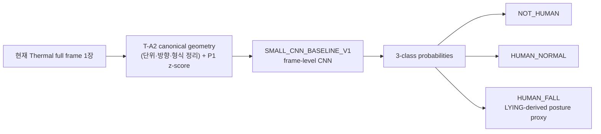
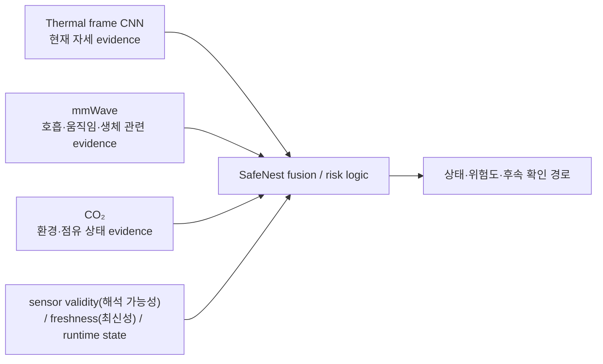
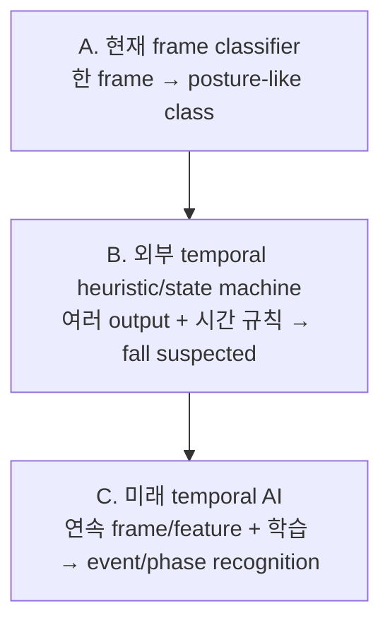
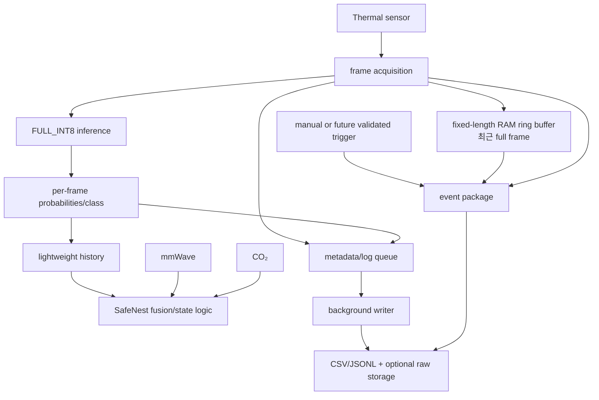
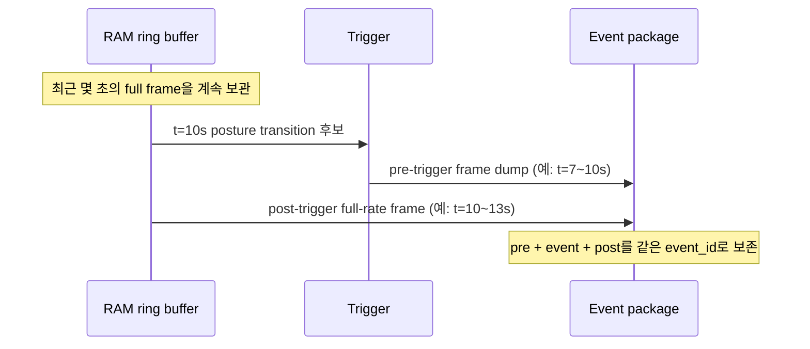
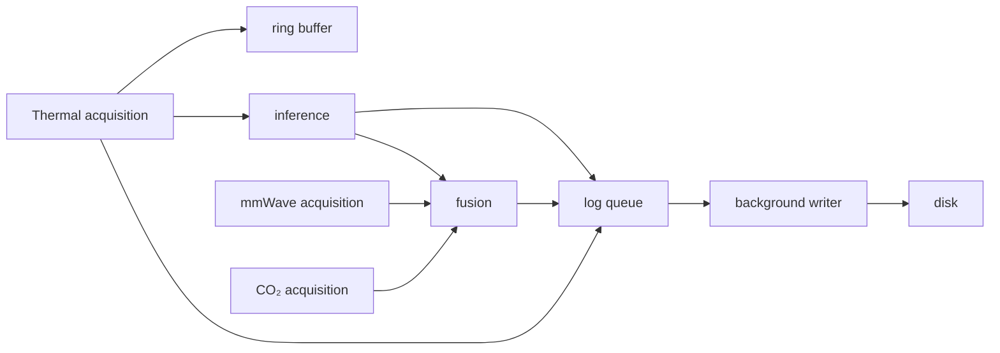
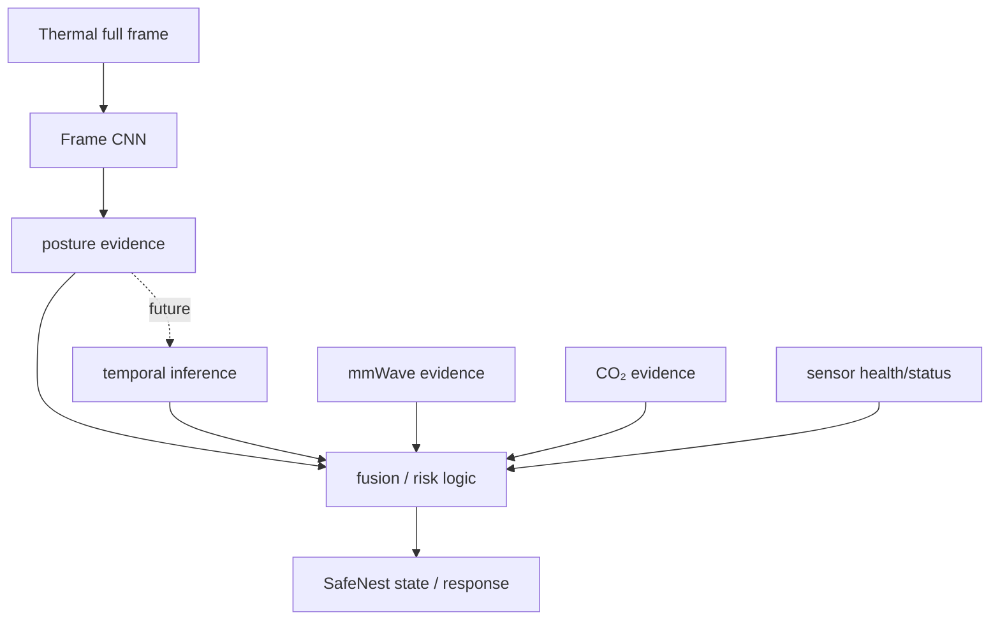

# SafeNest Thermal AI 실시간 활용·Temporal Fall 인수인계

문서 상태: **문서 전용 인수인계 문서**
대상: Thermal 모델을 Raspberry Pi와 SafeNest 멀티센서 흐름에 연결할 팀원
범위: 현재 모델이 실제로 판단하는 범위, 시간 누적을 둘러싼 올바른 해석, 향후 runtime/temporal 모델 설계 방향

> 이 문서는 runtime 코드, 모델, 임계값, 센서 펌웨어를 변경하지 않는다. 아래의 ring buffer(최근 frame을 고정 크기로 돌려 보관하는 저장소), event dump(사건 전후 frame 묶음 저장), 비동기 writer(별도 저장 작업), temporal heuristic(기존 출력에 시간 규칙을 적용하는 방식)은 **향후 설계 제안**이다. 현재 구현과 제안은 표에서 별도로 구분한다.

## 1. 이 문서의 목적

SafeNest Thermal 개발은 A-stage의 데이터·표현·라벨·그룹 정책과 B-stage의 오프라인 모델 비교를 마쳤다. 다음 담당자가 가장 먼저 이해해야 할 핵심은 두 가지다.

1. 현재 모델은 한 장의 Thermal frame을 보고 자세/존재에 가까운 세 클래스를 출력한다.
2. 여러 frame의 결과를 시간순으로 모으는 것은 가능하지만, 그것만으로 현재 CNN(이미지 형태·패턴을 찾는 신경망)이 낙상 과정을 학습했다는 뜻은 아니다.

따라서 이 문서는 다음 질문에 답한다.

- 현재 모델의 입력과 출력은 무엇인가?
- `HUMAN_FALL`은 실제 낙상인가, 누워 있는 자세인가?
- Raspberry Pi에서 frame과 예측 이력을 어떻게 보존할 수 있는가?
- CSV/JSONL과 raw full frame은 각각 무엇을 보존해야 하는가?
- 왜 고정 길이 RAM ring buffer가 필요한가?
- Thermal, mmWave, CO₂를 SafeNest fusion에 어떻게 연결할 수 있는가?
- T-C와 이후 temporal 모델 개발에 무엇이 남아 있는가?

## 처음 읽는 사람을 위한 5분 요약

### 지금 Thermal AI가 하는 일

```text
열화상 한 장
    ↓
현재 frame-level AI
    ↓
사람 없음 / 앉거나 서 있는 비-lying 자세 / 누워 있는 자세와 비슷함
```

여기서 **frame(프레임)**은 열화상 센서가 특정 순간에 만든 한 장의 열 분포 영상이다. 일반 동영상이 사진 여러 장을 빠르게 이어 붙인 것이라면, Thermal stream은 열화상 frame 여러 장이 시간순으로 들어오는 흐름이다. 현재 모델은 그중 한 장씩 독립적으로 판단한다.

### 지금 하지 못하는 일

현재 AI만으로 사람이 실제로 넘어지는 과정, 넘어지는 속도, 넘어지기 전후의 원인을 확인할 수 없다. `HUMAN_FALL`이라는 이름도 실제 낙상 확정이 아니라 `LYING`에서 유도한 자세 proxy다.

### Raspberry Pi에서 추가로 할 수 있는 일

Pi 소프트웨어는 여러 frame의 결과를 시간순으로 기억할 수 있다.

```text
HUMAN_NORMAL
      ↓
LYING-like 결과가 반복됨
      ↓
외부 상태 로직이 낙상 의심 상태를 만들 수 있음
```

이것은 AI가 낙상 과정을 새로 학습했다는 뜻이 아니다. 이미 학습된 모델의 여러 결과를 Pi 소프트웨어가 시간 규칙으로 해석하는 것이다.

### 왜 raw frame을 저장하는가

현재 모델의 세 class 출력만 저장하면 그때 센서가 실제로 본 열 분포는 복구할 수 없다. 원본 또는 검증된 native full frame을 남겨야 나중에 오판 원인 분석, 실제 센서와의 차이 확인, 전처리 재검토, temporal AI 개발을 할 수 있다.

### 다음 단계

```text
B-stage = offline model 비교·후보 고정 완료
T-C      = 실제 Thermal-44와 Raspberry Pi에서 device/domain 검증
향후    = 실제 연속 event data가 충분할 때 temporal AI 검토
```

이 요약의 뒤에서 나오는 `[현재 구현]`, `[현재 evidence]`, `[설계 제안]`, `[향후 개발]`, `[아직 미검증]` 표시는 무엇이 이미 존재하고 무엇이 아직 아이디어인지 구분하기 위한 것이다.

## 2. 현재 Thermal 개발 상태

T-A0~T-A6는 SDT 기반 frame-level source의 identity, reader, geometry, temporal evidence, label semantics, grouping/split, real conversion을 고정했다. T-B0~T-B5는 그 계약을 상속해 preprocessing(모델 입력 전 숫자를 정리하는 과정), architecture, seed stability, TFLite(가벼운 edge 실행 형식)/INT8 equivalence, robustness(입력 변화에 견디는 성질), Mac latency(한 번 계산하는 데 걸리는 시간), offline candidate lock을 수행했다.

현재 상태는 다음처럼 읽어야 한다.

```text
현재 상태 = OFFLINE FRAME-LEVEL CANDIDATE
다음 공식 단계 = T-C Thermal-44 device/domain(센서·환경 특성 묶음) validation
Pi 실시간 성능 = 아직 측정하지 않음
Thermal-44 물리 계약 = 아직 검증하지 않음
실제 낙상 사건 성능 = 주장할 수 없음
```

### 2.1 현재 고정 상태

| 항목 | 현재 고정 값 | 의미 |
|---|---|---|
| B-stage release | `thermal-b-stage-complete-2026-08-15` (`37de26cc8397d05a074b16748fea3ab5ddee41ee`) | T-B5까지의 문서·evidence 기준점 |
| preprocessing | `P1_TRAIN_FITTED_GLOBAL_ZSCORE` | TRAIN에서만 fit한 평균/표준편차를 후속 role에 그대로 적용 |
| architecture | `SMALL_CNN_BASELINE_V1` | frame-level CNN |
| primary seed | `20260813` | B-stage 재현성 기준 seed |
| 선택 후보 | `FULL_INT8` | 오프라인 INT8 후보, T-C 전용 입력 후보 |
| 후보 SHA-256 | `fa9730c29535477a3994c11e664474a0ca0116afaaa172889f47446ab2ac46be` | 외부 SSD에 보관된 artifact identity |
| 후보 크기 | `318,280` bytes | 파일 크기만으로 기기 적합성을 증명하지 않음 |
| 입력/출력 | `[1,62,80,1]` → `[1,3]` | 한 frame 입력, 세 클래스 출력 |
| 클래스 순서 | `NOT_HUMAN`, `HUMAN_NORMAL`, `HUMAN_FALL` | 출력 index의 의미 |
| REAL role | `REAL_EVAL_DEVELOPMENT` | 선택·fit·잠금 테스트에 사용하지 않은 개발 진단 role |
| 잠금 테스트 | 없음 | pristine `LOCKED_TEST`가 존재하지 않음 |
| 주요 제한 | TRAIN↔VALIDATION near-duplicate 14,514쌍, synthetic→real gap, posture proxy | 성능을 실제 안전성으로 해석하지 않게 하는 경계 |

#### 숫자를 모델에 넣기 전: P1과 z-score

센서에서 얻은 온도 숫자를 그대로 AI에 넣는 것이 아니라, 학습할 때 정한 평균과 표준편차를 기준으로 숫자의 범위를 맞춘다. 이 전처리 규칙을 프로젝트에서는 `P1_TRAIN_FITTED_GLOBAL_ZSCORE`라고 부른다.

```text
실제 입력값
    ↓
TRAIN 데이터에서 정한 평균·표준편차 적용
    ↓
모델이 학습할 때 보던 숫자 범위와 맞춘 MODEL INPUT
```

`TRAIN-fitted`는 **[현재 evidence]** 중요한 보호 장치다. VALIDATION이나 REAL을 보고 평균·표준편차를 다시 계산하면 평가 자료의 정보가 학습/선택 과정에 섞일 수 있다. 이런 정보 유입을 `data leakage(데이터 누수)`라고 하며, 성능이 실제보다 좋아 보일 수 있다. 따라서 P1 기준값은 TRAIN에서만 만들고 후속 role에 그대로 적용한다.

#### 입력·출력 모양을 쉽게 읽기

`[1,62,80,1]`은 **[현재 evidence]** 모델이 한 번에 받는 입력 tensor의 모양이다. 쉽게 말하면 다음과 같다.

```text
1개 frame × 세로 62 pixel × 가로 80 pixel × 1개 Thermal channel
```

이것은 모델 입력 geometry이지, 실제 Thermal-44 센서의 native 해상도가 검증됐다는 뜻은 아니다. native shape·dtype·unit은 T-C에서 따로 확인해야 한다.

`[1,3]`은 한 frame에 대해 세 class의 score/probability를 출력한다는 뜻이다. 예를 들어:

```text
NOT_HUMAN     0.02
HUMAN_NORMAL  0.06
HUMAN_FALL    0.92
```

이면 이 한 frame에서 세 후보 중 `HUMAN_FALL` 쪽 모델 출력이 가장 높다는 뜻이다. **92% 확률로 실제 사람이 넘어졌다는 뜻은 아니다.** 모델 출력은 class 간 상대적인 판단 근거이며, 안전 사건 확률로 사용하려면 별도 calibration과 real-world validation이 필요하다.

정확한 artifact/정책의 세부 값은 [T-B5 candidate lock](../datasets/thermal/manifests/T-B5_robustness_latency_candidate_lock/candidate_lock.json), [T-B5 artifact registry](../datasets/thermal/manifests/T-B5_robustness_latency_candidate_lock/artifact_registry.json), [T-B5 validation result](../datasets/thermal/manifests/T-B5_robustness_latency_candidate_lock/validation_result.json)에 있다. Float Keras, true TFLite FP32, diagnostic-only dynamic-range artifact의 identity와 parity는 [T-B4 report](reports/20260814_Codex_Thermal_T-B4_Float_TFLite_INT8_Equivalence_01.md)에 있다.

현재 artifact identity를 한곳에 모으면 다음과 같다. Keras checkpoint와 TFLite binaries는 Git에 넣지 않고 외부 SSD에 보관한다.

```text
FLOAT_KERAS
  T-B1/checkpoints/P1_TRAIN_FITTED_GLOBAL_ZSCORE.weights.h5
  SHA-256 7aba32fe8d0e241546429bdc3e8cd059b10d4d8f548e9e12c4085abeba308a75

TFLITE_FP32 (true unquantized)
  T-B4/artifacts/SMALL_CNN_BASELINE_V1_P1_float32.tflite
  SHA-256 fbe891520f07e0534b1a7074dc819d8ed44bca58b27e35c78916c3ddae73a779
  1,252,048 bytes

FULL_INT8 (selected offline candidate)
  T-B4/artifacts/SMALL_CNN_BASELINE_V1_P1_full_int8.tflite
  SHA-256 fa9730c29535477a3994c11e664474a0ca0116afaaa172889f47446ab2ac46be
  318,280 bytes

TFLITE_DYNAMIC_RANGE (diagnostic only; not selected)
  T-B4/artifacts/SMALL_CNN_BASELINE_V1_P1_dynamic_range.tflite
  SHA-256 297de231e26ecf2d4cd4010bd10c08d4df3b6b0a531c69693daea353afb8127d
  317,344 bytes
```

여기서 **artifact(아티팩트)**는 학습·변환 과정에서 만들어진 모델 파일이나 검증 결과물이다. **SHA-256**은 그런 파일의 지문처럼 사용한다. 파일 내용이 한 byte라도 달라지면 일반적으로 다른 SHA-256이 나오므로, “지금 사용하는 모델이 B-stage에서 고정한 바로 그 모델인가?”를 확인할 수 있다. SHA-256은 AI의 예측값이 아니라 파일 무결성(identity) 확인값이다.

현재 후보의 exact hash는 표에 보존하지만, 독자가 hash 숫자를 외울 필요는 없다. 실행 전에 registry의 경로·크기·SHA-256을 함께 대조하면 된다.

#### TFLite, FP32, INT8을 쉽게 읽기

**TFLite(TensorFlow Lite)**는 학습이 끝난 AI 모델을 Raspberry Pi 같은 edge device에서 비교적 가볍게 실행하도록 변환한 파일 형식이다.

```text
개발/학습 환경의 모델
        ↓ 변환
TFLite 모델 파일
        ↓
Pi에서 inference
```

이 문서에서 `FP32`는 대부분의 계산 숫자를 32-bit 부동소수점으로 표현하는 모델을 뜻하고, `INT8`은 많은 계산 숫자를 8-bit 정수로 표현하도록 **quantization(양자화)**한 모델을 뜻한다. 양자화는 아주 세밀한 눈금을 조금 더 거친 눈금으로 바꾸는 것과 비슷하다. 모델 크기·메모리·연산량을 줄일 가능성이 있지만 일부 숫자는 근사값이 되므로 Float 모델과 출력이 완전히 같지 않을 수 있다. 모든 장치에서 INT8이 항상 더 빠르다고 가정하지는 않는다.

그래서 T-B4에서는 다음 세 단계를 비교했다.

```text
Float Keras
    ↕
true unquantized TFLite FP32
    ↕
full INT8 TFLite
```

**[현재 evidence]** `TFLITE_DYNAMIC_RANGE`는 예전의 진단용 dynamic-range artifact이며 공식 FP32 후보가 아니다. 이 구분을 하지 않으면 float 입출력만 보고 “진짜 FP32”라고 잘못 판단할 수 있다.

**[현재 evidence]** `offline candidate`는 실제 센서에 최종 배포가 승인된 모델이라는 뜻이 아니다. 기존 데이터와 개발 환경에서 모델·전처리·변환·강건성을 점검한 뒤 다음 장치 검증 단계에 넘길 후보를 고정했다는 뜻이다.

```text
offline candidate
        ↓
T-C 실제 Thermal-44/Pi 검증
        ↓
deployment suitability 판단
```

### 2.2 성능 숫자를 읽는 법

고정 P1의 synthetic `VALIDATION` Macro F1은 약 `0.99513`이었고, 같은 winner의 `REAL_EVAL_DEVELOPMENT` Macro F1은 약 `0.59393`이었다. 이 차이는 현재 모델이 실제 Thermal-44 환경에서 낙상을 잘 검출한다는 근거가 아니라, synthetic SDT와 real/deployment domain 사이의 큰 차이를 보여 주는 개발 진단이다. `REAL_EVAL_DEVELOPMENT`는 `LOCKED_TEST`가 아니며, 실제 사건 ground truth도 아니다.

T-B5의 Mac latency도 Raspberry Pi latency나 sensor-to-alarm latency가 아니다. Pi 처리시간, 수집·전송·디코드·추론·fusion·disk write를 합친 end-to-end 시간은 T-C 또는 별도 integration 검증에서 실제로 측정해야 한다.

#### Domain과 domain gap

**Domain**은 데이터가 만들어지는 환경과 특성의 묶음이다. 예를 들면 SDT dataset domain에는 그 dataset의 센서, 촬영 환경, 사람과 센서의 거리, 자세, 온도 범위, preprocessing 특성이 들어간다. SafeNest Thermal-44 domain에는 실제 SafeNest 센서, 설치 각도, 현장 배경, 통신 경로, 센서 노이즈가 들어간다.

**Domain gap**은 학습·평가에 사용한 환경과 실제 사용 환경이 달라서 생기는 차이다. synthetic `VALIDATION` Macro F1이 높아도 실제 센서의 온도 분포·가림·거리·orientation이 다르면 field 성능이 낮을 수 있다. 현재 약 `0.99513` 대 약 `0.59393`이라는 차이는 이 가능성을 보여 주는 개발 진단이지, 실제 낙상 성능의 증명이 아니다.

#### TRAIN, VALIDATION, REAL, LOCKED_TEST

| 용어 | 쉬운 의미 | 이 문서에서의 용도 |
|---|---|---|
| `TRAIN` | AI를 학습시키는 자료 | weight와 P1 기준값을 fit |
| `VALIDATION` | 개발 중 후보를 비교하는 자료 | 모델·설계·강건성 비교 |
| `REAL_EVAL_DEVELOPMENT` | 실제 데이터 쪽 특성을 보는 개발 자료 | domain 진단, 반복 열람 가능 |
| `LOCKED_TEST` | 최종 결정을 내릴 때까지 보지 않는 시험 자료 | 편향이 적은 최종 평가 |

`REAL_EVAL_DEVELOPMENT ≠ LOCKED_TEST`다. REAL 자료를 반복해서 보고 판단에 사용하면 pristine test로 남아 있지 않기 때문이다. 현재는 pristine `LOCKED_TEST`가 없으며, REAL은 선택·fit·최종 무편향 평가에 사용되지 않은 개발 진단 role로만 기록한다.

#### near-duplicate 제한

**Near-duplicate**는 완전히 같은 파일은 아니지만 내용이 매우 비슷한 frame 쌍이다. 예를 들어 같은 자세와 같은 장면에서 연속으로 찍힌 거의 같은 이미지가 TRAIN과 VALIDATION 양쪽에 있으면 validation 성능이 새로운 사람·환경에 대한 성능보다 좋아 보일 수 있다. 현재 14,514개의 TRAIN↔VALIDATION near-duplicate 쌍이 보고되어 있으므로 숫자를 실제 일반화 성능으로 과대해석하지 않는다. 이 역사적 split을 문서만 보고 임의로 삭제하거나 다시 만들지는 않았다.

## 3. 현재 Thermal AI는 무엇을 판단하는가

현재 모델의 흐름은 매우 단순하다.



한 번의 inference는 한 frame의 현재 상태를 요약한다. 현재 CNN에는 다음 정보가 기본 입력으로 들어가지 않는다.

여기서 **inference(추론)**는 학습이 끝난 AI 모델에 실제 입력을 넣어 결과를 계산하는 과정이다. `Training`은 모델 내부 weight를 학습시키는 과정이고, Raspberry Pi의 평상시 동작은 training이 아니라 inference다. **CNN(Convolutional Neural Network)**은 이미지의 위치·형태·패턴을 찾아 분류하는 데 주로 쓰는 신경망이며, 현재 Thermal CNN은 한 장의 열 분포와 자세 형태가 세 class 중 어느 쪽에 가까운지 계산한다.

- 이전 frame과 다음 frame
- frame 간 시간 간격이나 검증된 FPS
- sequence/session/event identity
- 사람이 어느 방향으로 얼마나 빠르게 움직였는지
- 의도적으로 누운 것인지, 실제로 넘어져 누운 것인지
- 넘어지기 전 standing/imbalance/transition과 그 경계

즉, 현재 모델은 `현재 frame → 현재 class/probability`를 수행한다. 모델 output을 나중에 시간순으로 저장하는 것과 CNN이 sequence를 학습한 것은 서로 다른 일이다.

### 3.1 `NOT_HUMAN`

원래 SDT의 `EMPTY_ROOM`에 근거한 frame-scoped presence equivalence다. 의미는 다음 정도로 제한한다.

> 현재 frame이 표현된 범위에서 annotated human이 없는 공간에 가까운 형태로 보인다.

이 class를 모든 조명·가림·거리·배경에서의 일반적인 사람 검출기라고 부르지 않는다. `EMPTY_ROOM`이 없다고 해서 모든 비어 있지 않은 경우를 포괄한다고 추론하지도 않는다.

### 3.2 `HUMAN_NORMAL`

원래 `SITTING`과 `STANDING`을 호환 layer에서 합친 non-lying posture proxy다. 현재 세 클래스 출력에서는 앉기와 서기를 구분하지 않는다. 따라서 `HUMAN_NORMAL`은 “정상적인 모든 행동” 또는 “낙상이 아님”의 ground truth가 아니다.

### 3.3 `HUMAN_FALL`

이 이름은 SafeNest 호환 출력 이름이지만, 현재 source semantics는 `LYING`이다. 정확한 표현은 다음이다.

> `HUMAN_FALL` = 사람이 누워 있는 자세와 유사하게 보이는 frame에 대한 **LYING-derived posture proxy**.

**Proxy(대체 지표)**는 우리가 정말 알고 싶은 현상을 직접 측정한 값이 아니라, 그 현상과 관련된 관찰을 간접적으로 나타내는 값이다. 따라서 `LYING → HUMAN_FALL compatibility proxy`는 누워 있는 자세를 낙상 가능성과 관련된 posture evidence로 활용하는 것이지, 실제로 언제·왜 넘어졌는지를 직접 관측한 것이 아니다.

현재 source에는 fall onset, impact, end, pre-event context, post-event duration이 검증되어 있지 않다. 따라서 이 output 하나를 “실제 낙상 확정” 또는 “응급 상황 확정”으로 해석하지 않는다.

예를 들면:

```text
일부러 안전하게 눕기        → HUMAN_FALL이 나올 수 있음
실제로 넘어져 누운 뒤        → HUMAN_FALL이 나올 수 있음
가림/각도/도메인 차이로 오판 → HUMAN_FALL이 아닐 수도 있음
```

두 첫 사례는 한 장의 자세가 비슷할 수 있지만, 사건의 원인과 transition은 다르다. 이것이 현재 label을 `fall-event ground truth`라고 부르지 않는 이유다. 이 의미는 [T-A4 label semantics report](reports/20260810_Codex_T-A4_Thermal_Label_Semantics_Proxy_Mapping_Ambiguity_01.md)와 [T-A3 temporal policy report](reports/20260810_Codex_T-A3_Thermal_Sequence_Window_Event_Evidence_Policy_01.md)에 고정되어 있다.

## 4. SafeNest에서 Thermal의 역할

Thermal은 SafeNest에 다음과 같은 시각·자세 evidence를 제공한다.

```text
Thermal frame
  → 현재 frame의 사람 없음/비-lying 자세/lying 유사 자세 evidence
```

다른 센서와 함께 쓰면 의미가 넓어진다.



**Fusion**은 여러 센서의 정보를 한곳에서 함께 해석하는 과정이다. 예를 들어 다음처럼 각 센서가 서로 다른 관찰을 제공할 수 있다.

```text
Thermal: 사람이 누워 있는 형태
mmWave: 호흡/움직임 이상 evidence
CO₂: 환경 상태 evidence
        ↓
SafeNest: 각 신호와 validity/freshness를 함께 고려
```

이 구조에서 Thermal만으로 응급 여부를 결정한다고 쓰지 않는다. 센서 validity, stale/error, 다른 센서의 현재 상태, 시간 이력, 향후 검증된 event policy가 함께 고려되어야 한다. Thermal의 역할은 “혼자 모든 안전 문제를 해결하는 AI”가 아니라 multisensor fusion에 한 종류의 evidence를 공급하는 것이다.

## 5. 현재 모델로 시간 누적 판단이 가능한가

가능하다. 단, 누적하는 주체는 현재 CNN이 아니라 **runtime의 외부 history/state logic**다.

**Temporal**은 한 순간의 모습이 아니라 시간에 따른 변화 순서를 본다는 뜻이다.

```text
Frame model:     현재 한 장만 봄
Temporal model:  t-3, t-2, t-1, t의 변화까지 봄
```

예를 들어 `서 있음 → 기울어짐 → 내려감 → 누워 있음`이라는 순서와 `누워 있는 한 장`은 같은 정보가 아니다.

예를 들어 runtime이 다음 결과를 보관할 수 있다.

```text
t0  HUMAN_NORMAL
t1  HUMAN_NORMAL
t2  HUMAN_NORMAL
t3  HUMAN_FALL
t4  HUMAN_FALL
t5  HUMAN_FALL
```

이 history는 단일 `t5`보다 유용하다. 나중의 state machine은 다음과 같은 변화를 관찰할 수 있다.

```text
이전에는 NORMAL-like
        ↓
LYING-like로 전환
        ↓
LYING-like 상태가 계속됨
        ↓
FALL_SUSPECTED 같은 의심 상태로 전달 가능
```

하지만 이것은 “현재 CNN이 낙상의 물리적 과정을 이해한다”는 뜻이 아니다. 여러 독립 frame prediction을 기반으로 만든 temporal aggregation/state machine이며, 아직 안전 임계값과 실제 사건 성능이 검증된 temporal fall detector도 아니다.

**Temporal heuristic**은 새로운 AI가 아니라 여러 frame의 기존 AI 결과를 사람이 정한 시간 규칙으로 해석하는 방법이다. 예를 들어 `NORMAL, NORMAL, FALL-like, FALL-like, FALL-like`가 이어지면 “상태 변화가 있었고 LYING-like 상태가 지속된다”는 의심 신호를 만들 수 있다.

**State machine(상태 기계)**은 시스템이 현재 어느 상태인지 기억하고, 조건이 맞으면 다음 상태로 넘어가는 제어 구조다. `NORMAL → SUSPECTED → POSSIBLE_FALL → POST_FALL` 같은 흐름은 CNN 바깥의 runtime software에 둘 수 있다. 실제 threshold와 지속시간은 아직 검증되지 않았으므로 이 문서는 값이나 production rule을 정하지 않는다.

#### 왜 `NORMAL → FALL`만으로는 충분하지 않은가

두 상황의 마지막 frame은 비슷할 수 있다.

```text
의도적인 안전한 lying
STANDING → 천천히 앉음 → 안전하게 누움 → LYING

fall-like transition
STANDING → 빠른 자세 붕괴 → 하강 → LYING
```

현재 frame model은 두 경우 모두 결국 `HUMAN_FALL`을 출력할 수 있다. 둘을 구분하려면 transition의 속도·순서·전후 context를 실제 frame과 timestamp로 봐야 하며, 이것이 future temporal data가 필요한 핵심 이유다.

### 5.1 임의의 production threshold를 만들지 않는다

개념적으로 `NORMAL → SUSPECTED → POSSIBLE_FALL → POST_FALL` 같은 상태를 설명할 수는 있다. 그러나 현재 근거가 없는 다음과 같은 값을 문서에서 정하지 않는다.

```text
fall_prob > 0.7 for 1.5 seconds
```

실제 threshold, 지속시간, sensor confirmation 조건은 T-C에서 실제 device/domain 자료를 얻고, 이후 안전한 evaluation contract로 검증한 뒤 별도 동결해야 한다.

## 6. Frame classifier, temporal heuristic, temporal AI의 차이



| 구분 | 입력 | 현재 상태 | 할 수 있는 말 |
|---|---|---|---|
| A. Frame classifier | 한 frame | **있음** | 현재 frame의 세 class evidence |
| B. Temporal heuristic | frame output history, runtime clock/state | **가능하지만 미검증** | 자세 전환·지속을 규칙으로 누적할 수 있음 |
| C. Learned temporal AI | 실제 연속 frame/feature와 event label | **없음** | real temporal data가 쌓인 뒤 별도 개발 가능 |

T-A3는 SDT archive에서 sequence, timestamp, session, event, FPS를 검증하지 못했기 때문에 sequence/event/window training을 만들지 않았다. 파일 index나 이웃 filename은 temporal order가 아니다. 향후 C를 만들려면 실제 수집 계약이 보존하는 frame counter, timestamp, subject/session/event, phase range가 필요하다.

## 7. Raspberry Pi에서 추천하는 실시간 구조

아래는 **[설계 제안]**이며 현재 repository에 구현되어 있지 않다.



권장 원칙은 다음과 같다.

1. 수신한 frame을 가능한 한 빨리 bounded RAM ring buffer에 넣는다.
2. 현재 frozen `FULL_INT8` 후보로 frame-level inference를 수행한다.
3. probabilities, predicted class, timestamps, validity를 가벼운 history/log로 남긴다.
4. Thermal evidence를 mmWave·CO₂와 함께 SafeNest fusion에 전달한다.
5. 느린 disk write가 sensor acquisition path를 막지 않게 한다.
6. trigger가 생기면 ring buffer의 pre-trigger frame과 post-trigger full-rate frame을 하나의 event package로 보존한다.

`FULL_INT8`는 현재 T-C에 넘길 오프라인 후보다. 위의 Pi graph는 이 artifact가 실제 device input contract와 맞는다는 뜻이 아니며, T-C에서 shape/dtype/unit/transport와 end-to-end latency를 확인해야 한다.

## 8. Ring buffer가 필요한 이유

**Ring buffer(고리형 버퍼)**는 최근 N초의 full frame만 RAM에 유지하는 고정 길이 임시 저장소다. 자동차 블랙박스가 사고 버튼을 누른 뒤의 영상만 저장하는 것이 아니라 메모리에 갖고 있던 사고 직전 영상까지 남기는 것과 비슷하다.

```text
최근 N초 frame
→ RAM에서 계속 순환 보관

새 frame 도착
→ 가장 오래된 frame 제거

event 발생
→ 이미 RAM에 있는 직전 frame도 함께 저장
```

```text
F100 → F101 → F102 → ... → F199
새 frame F200 도착
가장 오래된 F100 제거, F200 삽입
```

버퍼의 최대 크기는 미리 정한 frame 수로 제한된다. 따라서 시간이 계속 흐른다고 RAM이 무한히 증가하지 않는다. `fixed-length ring buffer`, `rolling buffer`, `pre-trigger buffer`는 이 같은 bounded 구조를 뜻한다.

RAM은 빠르지만 전원이 꺼지면 사라지는 임시 작업 공간이고, disk/SSD/SD card는 상대적으로 느리지만 파일을 장기 보관하는 저장 공간이다. 그래서 최근 frame은 먼저 RAM에서 빠르게 순환시키고, 필요한 사건만 disk에 묶어 저장하는 방식을 고려한다. 실제 buffer 크기와 device throughput은 T-C/integration에서 측정해야 하며, 현재는 **[아직 미검증]**이다.

### 8.1 Pre-trigger가 중요한 이유

event가 감지된 뒤부터 저장하면 중요한 전환이 빠질 수 있다.



버퍼가 없으면 `t=10s` 이후의 `10s, 11s, 12s`만 남을 수 있다. 버퍼가 있으면 다음을 함께 검토할 수 있다.

```text
7s standing
8s imbalance-like
9s transition candidate
10s trigger
11~13s post-trigger state
```

여기서도 `imbalance-like` 또는 `transition candidate`는 실제 fall event라고 자동 확정되는 것이 아니다. frame을 보존해 나중에 안전하고 검증된 annotation을 붙일 수 있게 하는 것이 목적이다.

## 9. CSV/JSONL과 raw full frame의 역할

데이터를 세 층으로 나누어 생각하면 혼동이 줄어든다.

```text
RAW
센서에서 실제로 얻은 원본 값
    ↓ 검증된 변환
CANONICAL
단위·방향·geometry를 프로젝트 규칙에 맞춰 정리한 값
    ↓ 모델 전처리
MODEL INPUT
P1 같은 preprocessing까지 적용되어 AI에 실제로 들어가는 값
```

일상적인 비유로는 `RAW = 카메라가 처음 저장한 원본`, `CANONICAL = 방향·단위·형식을 통일한 표준 자료`, `MODEL INPUT = 특정 AI가 먹을 수 있는 크기와 숫자 범위로 만든 입력`이다. 실제 Thermal-44 RAW를 CANONICAL로 바꾸는 규칙은 아직 T-C에서 검증해야 하며, SDT 변환을 실센서에 맹목적으로 적용하지 않는다.

CSV/JSONL은 시간축의 **가벼운 metadata와 prediction log**에 적합하다.

```text
timestamp
frame_id
predicted_class
NOT_HUMAN probability
HUMAN_NORMAL probability
HUMAN_FALL probability
thermal_max_c (실제 단위가 검증된 경우에만)
sensor validity/freshness
mmWave evidence
CO₂ evidence
SafeNest runtime/risk state
```

반면 raw/full frame은 센서가 실제로 본 **수치·공간 정보**를 보존한다.

```text
CSV / JSONL
→ 그 시점에 어떤 판단과 상태가 기록되었는가

native raw / binary / NPY / 적절한 lossless frame format
→ 센서가 실제로 어떤 full frame을 만들었는가
```

> CSV는 “그 시점에 무슨 판단이 나왔는지”를 기록하는 용도이고, raw/full frame은 “센서가 실제로 무엇을 봤는지”를 보존하는 용도다.

full frame 행렬을 거대한 CSV 한 장에 계속 append하는 방식은 권장하지 않는다. 파일 크기, parsing 비용, dtype 보존, partial write 복구가 불리하다. 실제 raw 형식은 T-C에서 물리 encoding과 transport를 확인한 뒤 정한다.

**Checksum**은 저장한 raw frame이나 metadata가 나중에 바뀌거나 손상되지 않았는지 확인하는 값이다. `SHA-256`은 checksum을 만드는 대표적인 방법이고, AI probability와 달리 예측 정확도가 아니라 파일 integrity를 확인한다.

### 9.1 예측만으로는 복구할 수 없는 정보

```text
full frame
     ↓
CNN
     ↓
[NOT_HUMAN=0.01, NORMAL=0.08, FALL=0.91]
```

세 확률만 남기고 full frame을 버리면 다음 정보는 다시 만들 수 없다.

- body shape와 spatial distribution
- orientation과 위치
- partial occlusion
- 열원의 위치·형태
- preprocessing/geometry가 잘못된 원인
- 다음 모델이 필요한 hard case

따라서 `prediction history`는 현재 runtime 판단용으로 유용하고, `raw/full-frame history`는 오류 분석·새 preprocessing·temporal 학습을 위해 필요하다.

현재 모델이 이미 있어도 raw frame을 버리면 안 되는 이유는 명확하다.

1. 현재 모델의 오판 원인을 다시 볼 수 있다.
2. preprocessing이나 geometry가 잘못됐는지 확인할 수 있다.
3. 실제 Thermal-44 domain 차이를 분석할 수 있다.
4. 개선된 모델로 과거 frame을 다시 inference할 수 있다.
5. 충분한 계보가 남아 있으면 future temporal model의 sequence 자료가 된다.

## 10. 평상시 저장과 event 저장

### 10.1 평상시

권장 개념은 다음과 같다.

```text
full Thermal frame
→ 최근 N초는 RAM ring buffer에 full-rate로 보관

inference/sensor metadata
→ 가벼운 구조화 log로 계속 기록

raw/full frame
→ 필요하면 낮은 background rate로 별도 저장
```

background raw 저장 간격은 아직 고정하지 않는다. 실제 sensor FPS, storage capacity, queue backlog, event 빈도를 T-C/runtime characterization에서 측정한 뒤 `BACKGROUND_SAMPLE_INTERVAL` 같은 설정값으로 동결해야 한다. “정확히 1초에 한 장” 같은 임의 숫자는 이 문서에서 정하지 않는다.

**Full-rate**는 센서에서 실제로 들어오는 유효 frame 흐름을 의도적으로 낮은 주기로 sampling하지 않고 가능한 원래 시간 해상도로 보존한다는 뜻이다. 정확한 FPS를 아직 모르므로 여기서 특정 수치를 full-rate라고 부르지 않는다.

저장 간격을 너무 낮추면 전환 정보가 사라질 수 있다.

```text
실제 sequence: 0.0s standing → 0.2s leaning → 0.4s descending
               → 0.6s transition → 0.8s near floor → 1.0s lying

2초에 한 장만 disk에 저장: 0s standing → 2s lying
```

따라서 `disk = 저빈도 background`, `RAM = 최근 full-rate`, `event = pre/event/post full-rate dump`라는 혼합 구조를 제안한다. RAM ring buffer가 없고 disk 저빈도 저장만 하면 중요한 전환 frame을 영구히 놓칠 수 있다.

### 10.2 Trigger 시

Thermal transition, mmWave abnormal evidence, multisensor risk state, 또는 controlled collection의 manual marker가 trigger가 될 수 있다. 특히 dataset collection에서는 검증되지 않은 모델 threshold보다 manual event marker가 안전하고 해석하기 쉽다.

**Manual trigger**는 실험자가 event 시작/발생을 표시하는 것이다. 수집 단계에서는 아직 검증되지 않은 AI threshold에 dataset collection을 의존하지 않아도 된다는 장점이 있다. **Automatic trigger**는 향후 검증된 model/state logic이 event 저장을 시작하는 방식이며, 현재 구현되어 있지 않다.

trigger가 오면 다음을 한 묶음으로 보존하는 설계를 권장한다.

```text
pre-event full-rate frames
+ event interval full-rate frames
+ post-event full-rate frames
+ synchronized Thermal/mmWave/CO₂/runtime metadata
+ event annotations and checksums
```

다음은 **CONCEPTUAL / RECOMMENDED LAYOUT**일 뿐, 현재 repository의 canonical runtime layout이 아니다.

```text
events/
└── event_0001/
    ├── event.json
    ├── thermal_raw/
    │   ├── frame_000001.*
    │   ├── frame_000002.*
    │   └── ...
    ├── thermal_inference.csv
    ├── mmwave.csv
    ├── co2.csv
    └── checksums.sha256
```

실제 collection은 [Thermal Real-World Acquisition Contract v1](20260814_Codex_Thermal_Real_Data_Acquisition_Contract_EN_01.md)의 `collection_id/subject_id/session_id/recording_id/sequence_id/event_id/frame_id/sequence_index`와 raw/decoded-native/manifest/checksum 계보를 우선한다. 새 runtime event layout은 그 계약과 충돌하지 않게 별도 승인해야 한다.

## 11. 다른 센서와 동시에 처리할 때의 RAM/I/O 고려

### 11.1 RAM 계산은 예시일 뿐이다

실제 Thermal-44 native shape, dtype, bytes-per-pixel은 T-C 전까지 확정하지 않는다. 개념적인 raw frame payload 계산은 다음과 같다.

```text
memory = width × height × bytes_per_pixel × buffered_frames
```

예를 들어 **검증되지 않은 illustrative example**로 `80×62 uint16`을 사용하면:

```text
80 × 62 × 2 bytes ≈ 9.9 KB/frame
10 FPS × 10 seconds = 100 frames
raw payload만 약 0.99 MB
```

이는 Thermal-44 물리 계약이나 Pi5 보장치가 아니다. 실제 계산에는 frame header, Python/object overhead, copy 횟수, queue, 다른 sensor buffer, filesystem cache를 포함해야 한다. T-C에서 native shape/dtype/FPS를 측정한 뒤 buffer duration과 queue capacity를 정한다.

ring buffer 자체는 최근 frame을 고정 개수만 보관하므로 시간이 흐른다고 계속 커지지 않는다. 따라서 메모리 영향은 사전에 계산하고 제한할 수 있을 것으로 기대하지만, 실제 Pi에서 다른 센서와 함께 측정하기 전까지 “영향이 무시할 만하다”고 단정하지 않는다. integration에서 확인할 대상은 RAM뿐 아니라 copy 시간, queue backlog, disk write, 다른 센서 freshness다.

### 11.2 실제 병목은 RAM보다 I/O일 수 있다

가능한 병목은 다음과 같다.

- blocking disk I/O
- 같은 frame의 불필요한 복사
- synchronous logging/flush
- queue backlog
- sensor acquisition thread가 writer를 기다리는 구조

나쁜 예는 다음과 같다.

```text
Thermal 수신
  ↓
추론
  ↓
파일 write/flush가 끝날 때까지 대기
  ↓
다음 Thermal/mmWave/CO₂ 처리
```

이 구조는 disk가 느릴 때 다른 센서의 timestamp, freshness, sequence 처리를 지연시킬 수 있다. 단순히 RAM을 늘리는 것만으로 해결되지 않는다.

**Blocking I/O**는 파일 저장이 끝날 때까지 그 작업 흐름이 기다리는 구조다. 예를 들어 Thermal frame을 받자마자 같은 thread에서 disk flush를 하고 100 ms를 기다리면, 그동안 다음 Thermal frame뿐 아니라 mmWave·CO₂ 처리도 늦어질 수 있다.

**Queue**는 처리할 데이터를 순서대로 잠시 쌓아두는 대기열이고, **queue backlog**는 들어오는 속도가 처리 속도보다 빨라 대기열이 계속 쌓이는 상태다. 초당 10 frame이 들어오는데 writer가 초당 5 frame만 저장할 수 있다면 backlog가 증가한다. 이 상황은 RAM이 충분한지만 보고 판단할 수 없으며 T-C/integration에서 실제 Pi throughput과 drop/backpressure policy를 측정해야 한다.

## 12. 권장 비동기 writer 구조

**Async writer(비동기 저장기)**는 센서 수신 코드가 직접 disk 저장이 끝나기를 기다리지 않고, 저장할 내용을 queue에 넘긴 뒤 별도의 작업이 파일을 쓰도록 하는 구조다. 비유하면 센서 수신은 주문을 받는 직원, queue는 주문표, writer는 실제로 음식을 만드는 주방이다. 아래는 **[설계 제안]**이며 현재 구현이 아니다.

향후 runtime은 다음과 같은 분리를 검토한다.



핵심은 acquisition path가 느린 disk write를 직접 기다리지 않는 것이다. queue가 가득 찼을 때 무엇을 버리고 무엇을 보존할지, raw frame을 drop할 경우 어떤 validity/error를 남길지는 실제 T-C/runtime contract에서 정해야 한다. 조용히 frame을 삭제하거나 뒤의 frame 번호를 당겨 쓰면 안 된다.

### 12.1 validity와 freshness

**Validity**는 지금 들어온 데이터가 정상적으로 해석 가능한 값인지다. packet 손상, decode 실패, NaN, invalid pixel이 있으면 validity가 나빠질 수 있다. **Freshness**는 데이터 자체는 정상이어도 너무 오래된 값이 아닌지를 뜻한다. 예를 들어 CO₂ 값이 숫자로 정상이어도 마지막 업데이트가 오래 전이면 현재 상태로 그대로 믿으면 안 된다.

멀티센서 fusion은 `validity`와 `freshness`를 함께 확인해야 한다. 누락·손상·stale 데이터를 임의의 정상값으로 바꾸지 않고, 해당 sensor evidence를 unavailable/degraded로 전달하는 것이 fail-closed 방향이다.

## 13. 현재 모델로 지금 가능한 기능

현재 frozen frame model을 전제로, runtime 구현이 별도 승인되면 다음은 가능하다.

- frame-by-frame posture-like classification
- per-frame probability/class logging
- prediction-history accumulation
- ring-buffer trigger signal의 입력
- Thermal evidence를 multisensor fusion에 전달
- event trigger 전후의 raw evidence 보존을 위한 runtime 입력 제공

이 목록은 현재 repository에 위 기능이 구현·실기기 검증되었다는 뜻이 아니다. 특히 ring buffer, event writer, state machine은 이 문서에서 구현하지 않았다.

## 14. 현재 모델만으로 불가능한 기능

현재 모델만으로 다음을 주장할 수 없다.

- 검증된 fall transition recognition
- 의도적인 lying과 실제 fall의 구분
- temporal fall phase (`PRE_EVENT`, `FALL_TRANSITION`, `POST_FALL_LYING`, `RECOVERY`) 인식
- subject-independent real-device fall validation
- Thermal-44 deployment safety
- Pi real-time/end-to-end latency
- clinical reliability 또는 emergency-response accuracy

이 항목은 “모델이 약하다”는 단순한 평이 아니라, 현재 source label과 temporal provenance가 그 질문에 답할 수 없다는 계약상의 한계다.

## 15. 향후 temporal fall AI로 확장하는 방법

미래 모델은 plausible한 여러 형태 중 controlled comparison으로 선택해야 한다. 한 가지 예시는 다음과 같다.

```text
Thermal frame
    ↓
CNN feature extractor
    ↓
feature_(t-N) ... feature_t
    ↓
TCN / GRU / LSTM / other temporal model
    ↓
NORMAL / FALL_TRANSITION / POST_FALL / RECOVERY
```

TCN·GRU·LSTM 중 어느 하나도 현재 최종 아키텍처로 선택된 것이 아니다. Pi5 배포를 고려하면 가벼운 temporal architecture가 유리할 수 있지만, 실제 선택에는 sequence length, FPS, memory, latency, missing-frame policy, subject/session/event(사람·연속 촬영·사건 구간) split, event-level metric이 필요하다.

**FPS(Frames Per Second)**는 센서가 1초에 몇 장의 frame을 생성하거나 처리하는지다. 10 FPS에서 10 frame은 약 1초지만, 2 FPS에서 10 frame은 약 5초다. 따라서 FPS나 timestamp가 없으면 “10 frame 동안 지속됐다”를 고정된 시간으로 해석할 수 없다.

**Timestamp**는 “언제 발생했는가”를 기록하는 시간값이고, **clock domain**은 어느 장치의 시계를 기준으로 그 시간이 만들어졌는지를 뜻한다. sensor clock, ESP32 clock, Raspberry Pi monotonic clock, wall clock은 서로 다를 수 있으므로 숫자만 보고 직접 비교하면 안 된다. 실제 수집에서는 시간의 단위와 clock source를 함께 기록해야 한다.

미래 temporal split에서 쓰는 단위도 구분한다.

```text
subject = 실험 참여자 한 명
session = 한 번의 연속 촬영/실험 단위
event   = 그 session 안의 특정 행동·사건 구간
frame   = event/session 안의 한 시점 열화상
```

```text
Subject S001
└─ Session 001
   ├─ Event E001
   │  ├─ Frame 0001
   │  ├─ Frame 0002
   │  └─ ...
   └─ Event E002
```

**Data leakage(데이터 누수)**는 평가용으로 남겨둔 정보가 학습이나 후보 선택 과정에 들어가 성능이 실제보다 좋아 보이는 문제다. 같은 사람의 거의 같은 연속 frame을 TRAIN과 VALIDATION에 나누면 새로운 사람에게 일반화한 것처럼 보일 수 있다. 그래서 미래 real data는 가능한 강한 단위인 subject → session → event 순으로 group split하고, 같은 그룹이 여러 role에 섞이지 않게 해야 한다.

### 15.1 temporal 모델에 필요한 데이터

실제 temporal 자료는 최소한 다음 계보를 보존해야 한다.

```text
subject_id / session_id / recording_id / sequence_id / event_id
frame_id / sequence_index
sensor/device/host timestamps와 clock domain
effective FPS와 gap/loss evidence
PRE_EVENT
FALL_TRANSITION
POST_FALL_LYING
RECOVERY (가능한 경우)
```

같은 `LYING` frame이 여러 장 있다는 사실만으로 sequence나 event를 만들면 안 된다. [T-A3 temporal policy](reports/20260810_Codex_T-A3_Thermal_Sequence_Window_Event_Evidence_Policy_01.md)는 SDT에서 sequence/event/window를 검증할 수 없다고 명시한다. 새로운 실제 수집 계약은 이 결손을 보완하도록 설계되었다.

## 16. 실데이터 수집 계약과 연결

[실측 수집 계약 v1](20260814_Codex_Thermal_Real_Data_Acquisition_Contract_EN_01.md)은 단순한 이미지 폴더가 아니라 다음 계보를 요구한다.

```text
physical native frame
  → capture identity/timing
  → annotation provenance
  → verified T-C decoder
  → canonical representation
  → separately authorized model input
```

특히 보존해야 하는 것은 다음이다.

- raw packet/frame bytes와 가능한 decoded native frame
- frame counter와 `sequence_index`
- sensor/device/host timestamp와 clock domain
- subject/session/recording/sequence/event ID
- annotation method, annotator, confidence, revision
- packet loss, CRC, decode failure, invalid frame status
- raw/decoded-native/manifest 전체의 checksum

`LYING`은 여전히 관찰된 누운 자세다. 안전하고 승인된 transition capture가 있을 때에만 `event_id`와 비중첩 phase ranges를 붙여 `PRE_EVENT → FALL_TRANSITION → POST_FALL_LYING → RECOVERY`를 검증할 수 있다. 보호되지 않은 자유 낙상 실험을 만들거나 요구하지 않는다.

## 17. T-C에서 확인해야 할 것

**T-C**는 지금까지 만든 offline candidate를 실제 SafeNest Thermal-44 센서와 Raspberry Pi 환경에서 검증하는 단계다. 예를 들어 실제 frame 크기·데이터형·온도 단위·방향·FPS·전송 손실·Pi latency·model input 호환성을 측정한다. T-C가 끝나야 offline 숫자를 실제 장치 성능으로 해석할 수 있다.

T-C가 현재 문서 제안보다 먼저 답해야 할 실제 장치 질문은 다음이다.

```text
native width/height
native dtype와 bit depth
raw encoding과 physical unit
orientation / frame ordering
calibration과 invalid-pixel 표현
effective FPS, frame counter, timestamp clock
transport framing, CRC, packet loss, reconnect
sensor → ESP32 → Pi end-to-end behavior
Pi preprocessing/inference/queue/write latency
field-of-view, distance, mount geometry, background distribution
```

현재 코드에 80×62, big-endian uint16, raw/100.0 같은 경로가 보이더라도 그것은 코드 경로 관찰이지 T-C에서 검증된 물리 계약이 아니다. 따라서 다음 설정은 T-C 측정 전까지 configurable 상태로 둔다.

- ring buffer duration
- background raw sampling interval
- queue capacity
- post-trigger duration
- frame-drop/backpressure policy
- event trigger condition

## 18. T-D 및 향후 temporal 모델 개발 조건

**T-D**는 T-C에서 실제 환경 차이가 크거나 기존 자료가 부족하다는 사실이 확인되었을 때, 실제 데이터를 추가해 dataset/model을 개선하는 후속 단계다. T-C 결과가 좋다고 해서 T-D가 자동으로 필요한 것은 아니다. T-D/후속 temporal track은 다음과 같은 근거가 T-C에서 확인될 때만 검토한다.

- SDT와 실제 Thermal-44 domain gap이 실제 frame에서 큰 경우
- 현재 posture model이 실제 device hard case에서 충분하지 않은 경우
- 가림·거리·orientation·ambient 조건이 추가로 필요한 경우
- 안전한 real sequence/event annotation이 충분히 쌓인 경우
- subject/session/event leakage를 막는 split을 만들 수 있는 경우

공식 흐름은 다음과 같다.

```text
B-stage
frame model frozen
    ↓
T-C real device/domain validation
    ↓
real temporal event data accumulation
    ↓
gap와 데이터 근거가 충분한 경우
    ↓
T-D 또는 roadmap가 정한 후속 temporal-model phase
    ↓
new candidate → validation → quantization → device verification
```

T-C 결과가 좋지 않다고 해서 즉시 threshold를 조정하거나 모델을 재학습하지 않는다. 먼저 어떤 물리·표현·라벨·domain gap인지 분리하고, 별도의 T-D authorization을 받아야 한다.

## 19. SafeNest 장기 구조를 한눈에 보기



Thermal은 posture evidence를 제공하고, temporal inference가 도입되면 event context를 보탤 수 있다. mmWave와 CO₂는 각각 다른 domain의 evidence를 제공한다. 어느 한 센서의 output만으로 전체 안전 문제를 해결한다고 표현하지 않는다.

## 20. 구현 완료 vs 향후 제안

| 항목 | 현재 상태 | 의미 |
|---|---|---|
| Frame-level Thermal CNN | **[현재 구현] IMPLEMENTED / B-stage frozen** | 한 frame의 posture-like 세 class 출력 |
| `FULL_INT8` candidate | **[현재 evidence] LOCKED OFFLINE WITH LIMITATIONS** | T-C에 넘길 오프라인 후보, Thermal-44/Pi 검증 아님 |
| Thermal-44 verification | **[아직 미검증] NOT YET** | T-C에서 물리·domain·transport를 검증해야 함 |
| Pi ring buffer | **[설계 제안] PROPOSED** | bounded RAM pre-trigger 구조 제안, 미구현 |
| Continuous inference log | **[설계 제안] PROPOSED** | 현재 model output을 runtime에서 기록하는 방향, 미구현 |
| Event-centered raw dump | **[설계 제안] PROPOSED** | pre/event/post full-rate 보존 방향, 미구현 |
| Async writer | **[설계 제안] PROPOSED** | acquisition과 disk I/O 분리 방향, 미구현 |
| Temporal heuristic | **[향후 개발] POSSIBLE / NOT VALIDATED** | output history로 구현 가능하지만 fall detector 검증 아님 |
| Learned temporal AI | **[향후 개발] NOT IMPLEMENTED** | real temporal sequence와 별도 개발 필요 |
| Real fall-event ground truth | **[아직 미검증] NOT YET SUFFICIENT** | 현재 SDT의 `LYING`은 posture proxy |
| Pi latency / emergency accuracy | **[아직 미검증] NOT MEASURED** | T-C/integration 이후에만 평가 가능 |

## 21. 지금 팀원이 할 수 있는 일과 하지 말아야 할 일

### 지금 가능한 일

1. 현재 `FULL_INT8` artifact와 output contract를 오프라인 후보로 확인한다.
2. runtime 설계에서 frame마다 probability/class와 validity를 기록할 위치를 정한다.
3. bounded ring buffer와 event package의 요구사항을 수집 계약에 맞춰 설계한다.
4. mmWave·CO₂와 공통 timestamp/freshness/runtime 상태를 어떻게 정렬할지 문서화한다.
5. T-C에 필요한 native raw, unit, orientation, FPS, transport evidence를 준비한다.

### 지금 하지 말아야 할 일

- 현재 `HUMAN_FALL`을 verified fall이라고 부르기
- output history만으로 temporal AI가 되었다고 부르기
- 임의의 확률/시간 threshold를 production safety rule로 고정하기
- T-C 전 native shape/dtype/unit/FPS를 추정해 ring buffer 크기를 확정하기
- CSV만 보존하고 raw/full frame을 버리기
- Pi latency나 Thermal-44 safety를 Mac/offline 결과로 대체하기
- T-C/T-D를 이 문서에서 시작하기

## 한 가지 상황을 처음부터 끝까지 따라보기

아래는 현재 frame model과 향후 runtime 설계가 한 사건에서 어떻게 연결될 수 있는지를 보여 주는 **[설계 제안] 시나리오**다. 실제 event trigger나 저장 코드는 아직 없다.

```text
1. 작업자가 서 있다.
   [현재 입력] Thermal frame들이 계속 Pi로 들어온다.

2. 현재 FULL_INT8 model이 매 frame의 output을 계산한다.
   [현재 구현] HUMAN_NORMAL 쪽 class가 반복될 수 있다.

3. 최근 raw full frame은 고정 길이 RAM ring buffer에 남는다.
   [설계 제안] 전원이 꺼지면 사라지는 임시 pre-trigger 보관이다.

4. 어느 시점부터 HUMAN_FALL 쪽 output이 증가한다.
   [현재 구현] 이것은 각 frame의 LYING-like posture evidence다.

5. 외부 temporal heuristic이 상태 변화와 지속을 trigger 후보로 본다.
   [설계 제안] 실제 낙상 확정이 아니라 FALL_SUSPECTED 후보다.

6. event trigger가 발생하면 RAM에 있던 event 직전 full frame을 disk에 저장한다.
   [설계 제안] pre-trigger dump다.

7. event 이후 일정 구간의 full-rate frame도 계속 저장한다.
   [설계 제안] post-trigger 구간이며 실제 시간 길이는 T-C 이후 동결한다.

8. 같은 시간의 mmWave·CO₂·runtime metadata를 event package에 묶는다.
   [설계 제안] timestamp, validity, freshness, checksum을 함께 보존한다.

9. 나중에 사람이 실제 event label과 phase를 검토한다.
   [향후 개발] 안전하고 승인된 annotation이 있어야 temporal evidence가 된다.

10. 충분한 real sequence/event data가 쌓이면 future temporal model을 비교할 수 있다.
    [향후 개발] 새 학습·split·검증 phase가 필요하며 현재 모델이 자동으로 바뀌지 않는다.
```

이 흐름에서 `HUMAN_FALL`은 현재 model output이고, `FALL_SUSPECTED`는 향후 software 상태 이름의 예시다. 둘을 같은 의미로 취급하지 않는다.

## 22. 명시적 비주장(Non-claim)

이 문서와 현재 B-stage evidence는 다음을 증명하지 않는다.

```text
true fall detection
temporal fall classification
Thermal-44 deployment safety
Raspberry Pi real-time performance
clinical reliability
emergency-response accuracy
```

이 항목들은 실제 device/domain, provenance, temporal event, runtime latency, 안전한 평가 데이터가 추가로 검증된 뒤에만 별도로 주장할 수 있다.

## 23. 팀원 인수인계 체크리스트

다음 항목을 확인하면 현재 경계를 유지한 채 다음 단계로 넘길 수 있다.

```text
[현재 모델]
[ ] 입력은 한 frame [1,62,80,1]임을 확인
[ ] 세 class와 class order를 확인
[ ] HUMAN_FALL = LYING-derived posture proxy임을 확인
[ ] FULL_INT8는 offline candidate이며 Pi/Thermal-44 검증이 아님을 확인

[시간 정보]
[ ] frame prediction history와 learned temporal AI를 구분
[ ] T-A3의 SDT sequence/event/FPS 불가를 확인
[ ] 임의 threshold를 추가하지 않음

[저장]
[ ] prediction/metadata는 CSV 또는 JSONL로 기록
[ ] raw/full frame은 별도 lossless 표현으로 보존
[ ] fixed-length ring buffer가 bounded임을 확인
[ ] trigger 전후 pre/event/post frame 정책을 구분
[ ] bad/missing/late frame을 조용히 삭제하지 않음

[멀티센서]
[ ] Thermal/mmWave/CO₂ validity와 timestamp/freshness를 같이 전달
[ ] disk write가 acquisition path를 막지 않는 구조를 검토

[다음 단계]
[ ] T-C에서 native shape/dtype/unit/orientation/FPS/transport를 측정
[ ] Pi end-to-end latency를 별도로 측정
[ ] real event 자료가 쌓인 뒤에만 temporal model을 검토
```

## 용어 빠른 찾아보기

| 용어 | 한 줄 뜻 | 이 프로젝트에서 의미 |
|---|---|---|
| Frame | 특정 순간의 한 장 | 한 장씩 현재 자세 evidence를 계산 |
| Training | 모델 weight를 학습하는 과정 | B-stage에서 offline 수행 |
| Inference | 학습된 모델로 결과를 계산하는 과정 | Pi runtime의 기본 AI 작업 |
| CNN | 이미지 형태·위치를 찾는 신경망 | 현재 frame classifier |
| TFLite | edge device용 변환 모델 형식 | Pi 후보 artifact 형식 |
| FP32 | 32-bit 부동소수점 표현 | Float 기준과 true FP32 후보 |
| INT8 | 8-bit 정수 표현 | 선택된 offline 후보의 양자화 표현 |
| Quantization | 작은 숫자 표현으로 근사하는 변환 | T-B4에서 Float와 parity 비교 |
| Preprocessing | 모델 전에 입력 숫자를 정리하는 과정 | P1 z-score 포함 |
| P1 / z-score | TRAIN 평균·표준편차로 범위를 맞춤 | TRAIN에서만 기준값 fit |
| RAW | 센서가 만든 원본 값 | 미래 분석을 위해 보존해야 함 |
| Canonical | 단위·방향·geometry를 정리한 표현 | 실제 센서 contract 확인 후 생성 |
| Model input | AI에 실제로 들어가는 파생 입력 | P1 이후 `[1,62,80,1]` |
| Artifact | 모델 파일·검증 결과물 | registry와 SHA로 identity 확인 |
| SHA-256 | 파일의 지문 같은 checksum | 같은 artifact인지 확인 |
| Offline candidate | 장치 배포 전 고정한 개발 후보 | `FULL_INT8`, T-C로 전달 |
| Domain | 데이터가 만들어진 환경 묶음 | SDT와 Thermal-44는 다른 domain |
| Domain gap | 두 domain 사이의 차이 | synthetic→REAL 성능 차이의 한 원인 |
| Posture proxy | 직접 사건 대신 자세를 나타내는 지표 | `LYING → HUMAN_FALL` |
| Temporal | 시간에 따른 변화 순서 | 현재 model에는 학습되어 있지 않음 |
| Temporal heuristic | 기존 결과를 시간 규칙으로 해석 | 향후 외부 state logic |
| State machine | 상태를 기억하고 전이하는 제어 구조 | CNN 바깥의 제안 |
| Ring buffer | 최근 N초를 고정 크기로 순환 보관 | pre-trigger RAM 저장소 제안 |
| Pre-trigger | trigger 이전에 이미 보관된 구간 | event 직전 frame 보존 |
| RAM | 빠르지만 휘발성인 작업 공간 | 최근 frame 임시 보관 |
| Blocking I/O | 저장이 끝날 때까지 흐름이 대기 | 다른 센서 지연 가능 |
| Async writer | queue를 받아 별도로 저장하는 작업 | disk 병목 완화 제안 |
| Queue/backlog | 처리 대기열/대기열 누적 | Pi throughput 측정 필요 |
| Validity/freshness | 해석 가능성/최신성 | fusion에서 둘 다 확인 |
| Fusion | 여러 센서 evidence를 함께 해석 | Thermal·mmWave·CO₂ 관계 |
| FPS/timestamp | 초당 frame 수/발생 시각 | temporal 시간 단위에 필요 |
| Subject/session/event | 사람/연속 촬영/사건 구간 | leakage-safe grouping 단위 |
| Data leakage | 평가 정보가 학습에 섞이는 문제 | subject/session/event split으로 방지 |
| `LOCKED_TEST` | 최종까지 보지 않는 시험 role | 현재는 없음 |

## 문서를 읽은 뒤 반드시 구분해야 하는 다섯 가지

1. **`HUMAN_FALL` ≠ verified fall event**: 현재는 `LYING` 자세 proxy다.
2. **prediction history ≠ learned temporal AI**: 여러 출력의 시간 누적은 CNN이 sequence를 학습했다는 뜻이 아니다.
3. **offline candidate ≠ Thermal-44 deployment validation**: `FULL_INT8`는 T-C에 넘길 후보일 뿐이다.
4. **CSV prediction log ≠ raw Thermal evidence**: CSV는 판단 기록이고 raw는 센서가 본 원본 정보다.
5. **ring buffer/runtime architecture ≠ 현재 구현 코드**: 이 문서의 Pi 저장·trigger·writer는 설계 제안이다.

## 24. 한 페이지 요약

```text
현재 모델은?
= 열화상 frame 한 장을 받아 사람 없음 / 앉거나 서 있는 비-lying 자세 / 누워 있는 자세와 비슷한지를 세 class로 계산한다.

HUMAN_FALL은?
= 실제 낙상 사건이 아니라 LYING-derived posture proxy다. 누워 있는 한 장과 넘어지는 과정은 다르다.

Pi에서는?
= 현재 `FULL_INT8`(계산 숫자를 8-bit 정수로 바꾼 offline 모델)의 inference 결과를 frame마다 기록하고, 결과 history를 시간순으로 외부 상태 로직에 전달할 수 있다.

ring buffer란?
= 최근 full-rate frame만 RAM에 고정 개수로 순환 보관하는 임시 저장소다. event가 생기면 직전 frame도 함께 disk에 저장할 수 있다.

CSV/JSONL과 raw는?
= CSV/JSONL(가벼운 텍스트 로그)은 timestamp·예측·센서 상태 기록이고, raw/full frame(원본 열화상)은 센서가 실제로 본 열 분포와 공간 정보를 보존한다.

다른 센서에는 어떤 영향이 있나?
= Thermal 저장이 blocking disk I/O(저장이 끝날 때까지 기다리는 작업)나 queue backlog(처리 대기열 누적)를 만들면 mmWave·CO₂ 처리와 freshness가 늦어질 수 있다. async writer(비동기 저장)가 제안되지만 Pi에서 아직 검증되지 않았다.

현재 어디까지 구현됐나?
= frame-level offline candidate와 B-stage evidence까지다. ring buffer, event trigger, state machine, temporal AI, Pi latency는 구현·검증되지 않았다.

다음 단계는?
= T-C(실제 Thermal-44/Pi 검증 단계)에서 frame 형식·단위·FPS·전송·latency를 확인한다. 이후 실제 시간순 사건 자료가 충분할 때만 temporal model(여러 시점의 변화를 학습하는 모델)을 별도 검토한다.
```

## 25. 문서 경계

이 문서 작성으로 다음 작업은 시작되지 않았다.

- ring buffer 구현
- CSV/JSONL writer 구현
- event trigger/state machine 구현
- temporal model 학습
- 새 threshold 또는 risk rule 추가
- Thermal-44 하드웨어 연결·검증
- Pi latency 측정
- T-D dataset expansion 또는 retraining

위 작업은 각각 승인된 후속 phase와 해당 evidence/validator를 통해 진행해야 한다.
