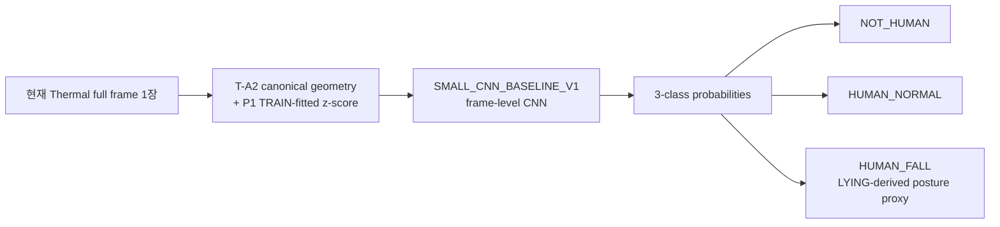
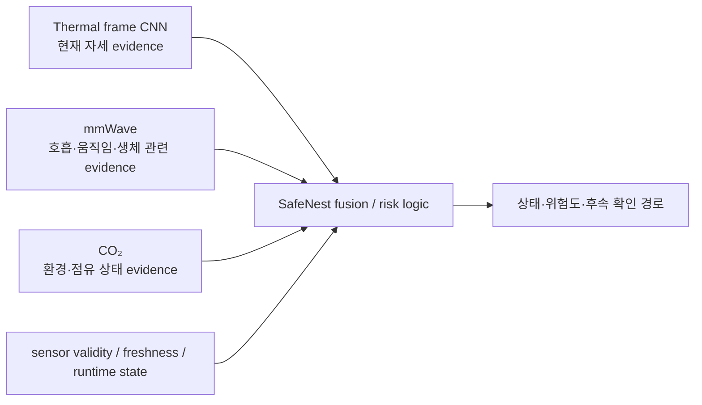
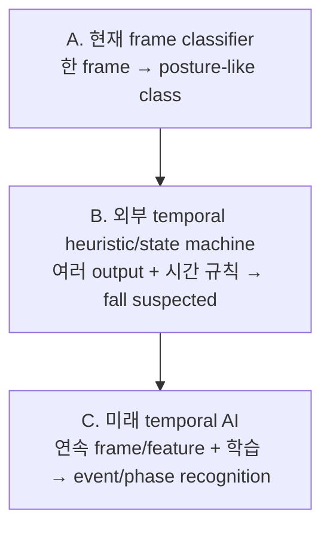
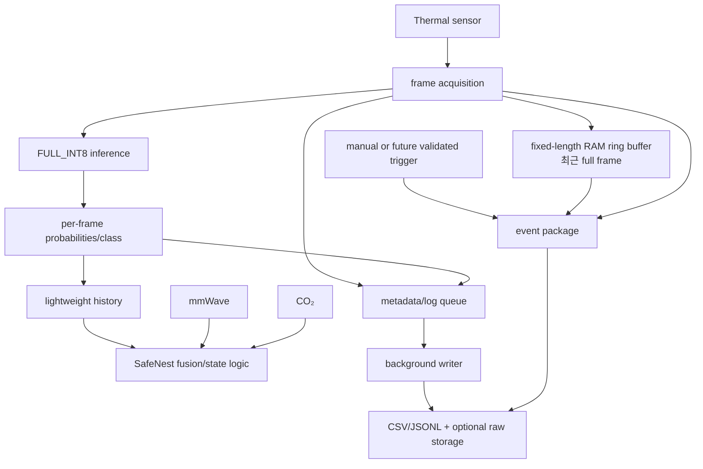
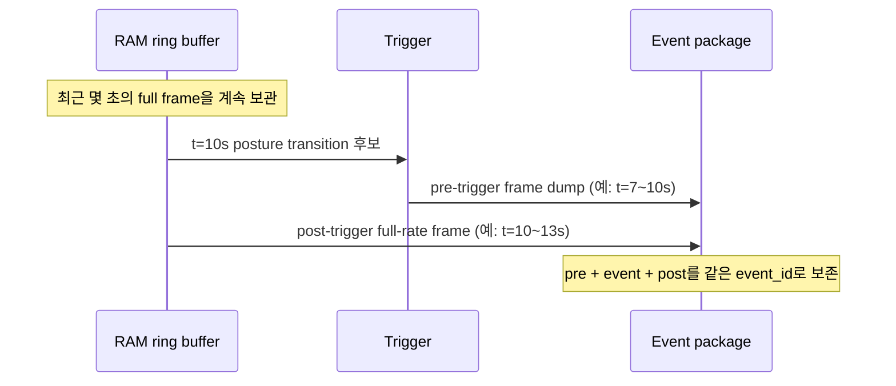
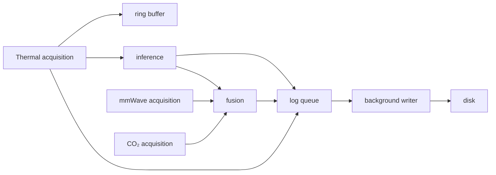
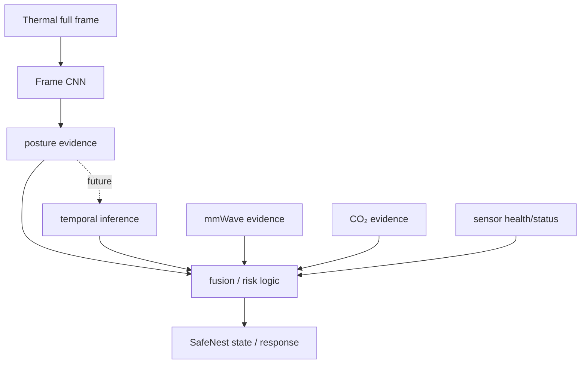

# SafeNest Thermal AI 실시간 활용·Temporal Fall 인수인계

문서 상태: **문서 전용 인수인계 문서**
대상: Thermal 모델을 Raspberry Pi와 SafeNest 멀티센서 흐름에 연결할 팀원
범위: 현재 모델이 실제로 판단하는 범위, 시간 누적을 둘러싼 올바른 해석, 향후 runtime/temporal 모델 설계 방향

> 이 문서는 runtime 코드, 모델, 임계값, 센서 펌웨어를 변경하지 않는다. 아래의 ring buffer, event dump, 비동기 writer, temporal heuristic은 **향후 설계 제안**이다. 현재 구현과 제안은 표에서 별도로 구분한다.

## 1. 이 문서의 목적

SafeNest Thermal 개발은 A-stage의 데이터·표현·라벨·그룹 정책과 B-stage의 오프라인 모델 비교를 마쳤다. 다음 담당자가 가장 먼저 이해해야 할 핵심은 두 가지다.

1. 현재 모델은 한 장의 Thermal frame을 보고 자세/존재에 가까운 세 클래스를 출력한다.
2. 여러 frame의 결과를 시간순으로 모으는 것은 가능하지만, 그것만으로 현재 CNN이 낙상 과정을 학습했다는 뜻은 아니다.

따라서 이 문서는 다음 질문에 답한다.

- 현재 모델의 입력과 출력은 무엇인가?
- `HUMAN_FALL`은 실제 낙상인가, 누워 있는 자세인가?
- Raspberry Pi에서 frame과 예측 이력을 어떻게 보존할 수 있는가?
- CSV/JSONL과 raw full frame은 각각 무엇을 보존해야 하는가?
- 왜 고정 길이 RAM ring buffer가 필요한가?
- Thermal, mmWave, CO₂를 SafeNest fusion에 어떻게 연결할 수 있는가?
- T-C와 이후 temporal 모델 개발에 무엇이 남아 있는가?

## 2. 현재 Thermal 개발 상태

T-A0~T-A6는 SDT 기반 frame-level source의 identity, reader, geometry, temporal evidence, label semantics, grouping/split, real conversion을 고정했다. T-B0~T-B5는 그 계약을 상속해 preprocessing, architecture, seed stability, TFLite/INT8 equivalence, robustness, Mac latency, offline candidate lock을 수행했다.

현재 상태는 다음처럼 읽어야 한다.

```text
현재 상태 = OFFLINE FRAME-LEVEL CANDIDATE
다음 공식 단계 = T-C Thermal-44 device/domain validation
Pi 실시간 성능 = 아직 측정하지 않음
Thermal-44 물리 계약 = 아직 검증하지 않음
실제 낙상 사건 성능 = 주장할 수 없음
```

### 2.1 현재 고정 상태

| 항목 | 현재 고정 값 | 의미 |
|---|---|---|
| B-stage release | `thermal-b-stage-complete-2026-08-15` (`37de26cc8397d05a074b16748fea3ab5ddee41ee`) | T-B5까지의 문서·evidence 기준점 |
| preprocessing | `P1_TRAIN_FITTED_GLOBAL_ZSCORE` | TRAIN에서만 fit한 평균/표준편차를 후속 role에 그대로 적용 |
| architecture | `SMALL_CNN_BASELINE_V1` | frame-level CNN |
| primary seed | `20260813` | B-stage 재현성 기준 seed |
| 선택 후보 | `FULL_INT8` | 오프라인 INT8 후보, T-C 전용 입력 후보 |
| 후보 SHA-256 | `fa9730c29535477a3994c11e664474a0ca0116afaaa172889f47446ab2ac46be` | 외부 SSD에 보관된 artifact identity |
| 후보 크기 | `318,280` bytes | 파일 크기만으로 기기 적합성을 증명하지 않음 |
| 입력/출력 | `[1,62,80,1]` → `[1,3]` | 한 frame 입력, 세 클래스 출력 |
| 클래스 순서 | `NOT_HUMAN`, `HUMAN_NORMAL`, `HUMAN_FALL` | 출력 index의 의미 |
| REAL role | `REAL_EVAL_DEVELOPMENT` | 선택·fit·잠금 테스트에 사용하지 않은 개발 진단 role |
| 잠금 테스트 | 없음 | pristine `LOCKED_TEST`가 존재하지 않음 |
| 주요 제한 | TRAIN↔VALIDATION near-duplicate 14,514쌍, synthetic→real gap, posture proxy | 성능을 실제 안전성으로 해석하지 않게 하는 경계 |

정확한 artifact/정책의 세부 값은 [T-B5 candidate lock](../datasets/thermal/manifests/T-B5_robustness_latency_candidate_lock/candidate_lock.json), [T-B5 artifact registry](../datasets/thermal/manifests/T-B5_robustness_latency_candidate_lock/artifact_registry.json), [T-B5 validation result](../datasets/thermal/manifests/T-B5_robustness_latency_candidate_lock/validation_result.json)에 있다. Float Keras, true TFLite FP32, diagnostic-only dynamic-range artifact의 identity와 parity는 [T-B4 report](reports/20260814_Codex_Thermal_T-B4_Float_TFLite_INT8_Equivalence_01.md)에 있다.

현재 artifact identity를 한곳에 모으면 다음과 같다. Keras checkpoint와 TFLite binaries는 Git에 넣지 않고 외부 SSD에 보관한다.

```text
FLOAT_KERAS
  T-B1/checkpoints/P1_TRAIN_FITTED_GLOBAL_ZSCORE.weights.h5
  SHA-256 7aba32fe8d0e241546429bdc3e8cd059b10d4d8f548e9e12c4085abeba308a75

TFLITE_FP32 (true unquantized)
  T-B4/artifacts/SMALL_CNN_BASELINE_V1_P1_float32.tflite
  SHA-256 fbe891520f07e0534b1a7074dc819d8ed44bca58b27e35c78916c3ddae73a779
  1,252,048 bytes

FULL_INT8 (selected offline candidate)
  T-B4/artifacts/SMALL_CNN_BASELINE_V1_P1_full_int8.tflite
  SHA-256 fa9730c29535477a3994c11e664474a0ca0116afaaa172889f47446ab2ac46be
  318,280 bytes

TFLITE_DYNAMIC_RANGE (diagnostic only; not selected)
  T-B4/artifacts/SMALL_CNN_BASELINE_V1_P1_dynamic_range.tflite
  SHA-256 297de231e26ecf2d4cd4010bd10c08d4df3b6b0a531c69693daea353afb8127d
  317,344 bytes
```

### 2.2 성능 숫자를 읽는 법

고정 P1의 synthetic `VALIDATION` Macro F1은 약 `0.99513`이었고, 같은 winner의 `REAL_EVAL_DEVELOPMENT` Macro F1은 약 `0.59393`이었다. 이 차이는 현재 모델이 실제 Thermal-44 환경에서 낙상을 잘 검출한다는 근거가 아니라, synthetic SDT와 real/deployment domain 사이의 큰 차이를 보여 주는 개발 진단이다. `REAL_EVAL_DEVELOPMENT`는 `LOCKED_TEST`가 아니며, 실제 사건 ground truth도 아니다.

T-B5의 Mac latency도 Raspberry Pi latency나 sensor-to-alarm latency가 아니다. Pi 처리시간, 수집·전송·디코드·추론·fusion·disk write를 합친 end-to-end 시간은 T-C 또는 별도 integration 검증에서 실제로 측정해야 한다.

## 3. 현재 Thermal AI는 무엇을 판단하는가

현재 모델의 흐름은 매우 단순하다.



한 번의 inference는 한 frame의 현재 상태를 요약한다. 현재 CNN에는 다음 정보가 기본 입력으로 들어가지 않는다.

- 이전 frame과 다음 frame
- frame 간 시간 간격이나 검증된 FPS
- sequence/session/event identity
- 사람이 어느 방향으로 얼마나 빠르게 움직였는지
- 의도적으로 누운 것인지, 실제로 넘어져 누운 것인지
- 넘어지기 전 standing/imbalance/transition과 그 경계

즉, 현재 모델은 `현재 frame → 현재 class/probability`를 수행한다. 모델 output을 나중에 시간순으로 저장하는 것과 CNN이 sequence를 학습한 것은 서로 다른 일이다.

### 3.1 `NOT_HUMAN`

원래 SDT의 `EMPTY_ROOM`에 근거한 frame-scoped presence equivalence다. 의미는 다음 정도로 제한한다.

> 현재 frame이 표현된 범위에서 annotated human이 없는 공간에 가까운 형태로 보인다.

이 class를 모든 조명·가림·거리·배경에서의 일반적인 사람 검출기라고 부르지 않는다. `EMPTY_ROOM`이 없다고 해서 모든 비어 있지 않은 경우를 포괄한다고 추론하지도 않는다.

### 3.2 `HUMAN_NORMAL`

원래 `SITTING`과 `STANDING`을 호환 layer에서 합친 non-lying posture proxy다. 현재 세 클래스 출력에서는 앉기와 서기를 구분하지 않는다. 따라서 `HUMAN_NORMAL`은 “정상적인 모든 행동” 또는 “낙상이 아님”의 ground truth가 아니다.

### 3.3 `HUMAN_FALL`

이 이름은 SafeNest 호환 출력 이름이지만, 현재 source semantics는 `LYING`이다. 정확한 표현은 다음이다.

> `HUMAN_FALL` = 사람이 누워 있는 자세와 유사하게 보이는 frame에 대한 **LYING-derived posture proxy**.

현재 source에는 fall onset, impact, end, pre-event context, post-event duration이 검증되어 있지 않다. 따라서 이 output 하나를 “실제 낙상 확정” 또는 “응급 상황 확정”으로 해석하지 않는다.

예를 들면:

```text
일부러 안전하게 눕기        → HUMAN_FALL이 나올 수 있음
실제로 넘어져 누운 뒤        → HUMAN_FALL이 나올 수 있음
가림/각도/도메인 차이로 오판 → HUMAN_FALL이 아닐 수도 있음
```

두 첫 사례는 한 장의 자세가 비슷할 수 있지만, 사건의 원인과 transition은 다르다. 이것이 현재 label을 `fall-event ground truth`라고 부르지 않는 이유다. 이 의미는 [T-A4 label semantics report](reports/20260810_Codex_T-A4_Thermal_Label_Semantics_Proxy_Mapping_Ambiguity_01.md)와 [T-A3 temporal policy report](reports/20260810_Codex_T-A3_Thermal_Sequence_Window_Event_Evidence_Policy_01.md)에 고정되어 있다.

## 4. SafeNest에서 Thermal의 역할

Thermal은 SafeNest에 다음과 같은 시각·자세 evidence를 제공한다.

```text
Thermal frame
  → 현재 frame의 사람 없음/비-lying 자세/lying 유사 자세 evidence
```

다른 센서와 함께 쓰면 의미가 넓어진다.



이 구조에서 Thermal만으로 응급 여부를 결정한다고 쓰지 않는다. 센서 validity, stale/error, 다른 센서의 현재 상태, 시간 이력, 향후 검증된 event policy가 함께 고려되어야 한다. Thermal의 역할은 “혼자 모든 안전 문제를 해결하는 AI”가 아니라 multisensor fusion에 한 종류의 evidence를 공급하는 것이다.

## 5. 현재 모델로 시간 누적 판단이 가능한가

가능하다. 단, 누적하는 주체는 현재 CNN이 아니라 **runtime의 외부 history/state logic**다.

예를 들어 runtime이 다음 결과를 보관할 수 있다.

```text
t0  HUMAN_NORMAL
t1  HUMAN_NORMAL
t2  HUMAN_NORMAL
t3  HUMAN_FALL
t4  HUMAN_FALL
t5  HUMAN_FALL
```

이 history는 단일 `t5`보다 유용하다. 나중의 state machine은 다음과 같은 변화를 관찰할 수 있다.

```text
이전에는 NORMAL-like
        ↓
LYING-like로 전환
        ↓
LYING-like 상태가 계속됨
        ↓
FALL_SUSPECTED 같은 의심 상태로 전달 가능
```

하지만 이것은 “현재 CNN이 낙상의 물리적 과정을 이해한다”는 뜻이 아니다. 여러 독립 frame prediction을 기반으로 만든 temporal aggregation/state machine이며, 아직 안전 임계값과 실제 사건 성능이 검증된 temporal fall detector도 아니다.

### 5.1 임의의 production threshold를 만들지 않는다

개념적으로 `NORMAL → SUSPECTED → POSSIBLE_FALL → POST_FALL` 같은 상태를 설명할 수는 있다. 그러나 현재 근거가 없는 다음과 같은 값을 문서에서 정하지 않는다.

```text
fall_prob > 0.7 for 1.5 seconds
```

실제 threshold, 지속시간, sensor confirmation 조건은 T-C에서 실제 device/domain 자료를 얻고, 이후 안전한 evaluation contract로 검증한 뒤 별도 동결해야 한다.

## 6. Frame classifier, temporal heuristic, temporal AI의 차이



| 구분 | 입력 | 현재 상태 | 할 수 있는 말 |
|---|---|---|---|
| A. Frame classifier | 한 frame | **있음** | 현재 frame의 세 class evidence |
| B. Temporal heuristic | frame output history, runtime clock/state | **가능하지만 미검증** | 자세 전환·지속을 규칙으로 누적할 수 있음 |
| C. Learned temporal AI | 실제 연속 frame/feature와 event label | **없음** | real temporal data가 쌓인 뒤 별도 개발 가능 |

T-A3는 SDT archive에서 sequence, timestamp, session, event, FPS를 검증하지 못했기 때문에 sequence/event/window training을 만들지 않았다. 파일 index나 이웃 filename은 temporal order가 아니다. 향후 C를 만들려면 실제 수집 계약이 보존하는 frame counter, timestamp, subject/session/event, phase range가 필요하다.

## 7. Raspberry Pi에서 추천하는 실시간 구조

아래는 **설계 제안**이며 현재 repository에 구현되어 있지 않다.



권장 원칙은 다음과 같다.

1. 수신한 frame을 가능한 한 빨리 bounded RAM ring buffer에 넣는다.
2. 현재 frozen `FULL_INT8` 후보로 frame-level inference를 수행한다.
3. probabilities, predicted class, timestamps, validity를 가벼운 history/log로 남긴다.
4. Thermal evidence를 mmWave·CO₂와 함께 SafeNest fusion에 전달한다.
5. 느린 disk write가 sensor acquisition path를 막지 않게 한다.
6. trigger가 생기면 ring buffer의 pre-trigger frame과 post-trigger full-rate frame을 하나의 event package로 보존한다.

`FULL_INT8`는 현재 T-C에 넘길 오프라인 후보다. 위의 Pi graph는 이 artifact가 실제 device input contract와 맞는다는 뜻이 아니며, T-C에서 shape/dtype/unit/transport와 end-to-end latency를 확인해야 한다.

## 8. Ring buffer가 필요한 이유

고정 길이 ring buffer는 최근 N초의 full frame만 RAM에 유지하는 rolling buffer다.

```text
F100 → F101 → F102 → ... → F199
새 frame F200 도착
가장 오래된 F100 제거, F200 삽입
```

버퍼의 최대 크기는 미리 정한 frame 수로 제한된다. 따라서 시간이 계속 흐른다고 RAM이 무한히 증가하지 않는다. `fixed-length ring buffer`, `rolling buffer`, `pre-trigger buffer`는 이 같은 bounded 구조를 뜻한다.

### 8.1 Pre-trigger가 중요한 이유

event가 감지된 뒤부터 저장하면 중요한 전환이 빠질 수 있다.



버퍼가 없으면 `t=10s` 이후의 `10s, 11s, 12s`만 남을 수 있다. 버퍼가 있으면 다음을 함께 검토할 수 있다.

```text
7s standing
8s imbalance-like
9s transition candidate
10s trigger
11~13s post-trigger state
```

여기서도 `imbalance-like` 또는 `transition candidate`는 실제 fall event라고 자동 확정되는 것이 아니다. frame을 보존해 나중에 안전하고 검증된 annotation을 붙일 수 있게 하는 것이 목적이다.

## 9. CSV/JSONL과 raw full frame의 역할

CSV/JSONL은 시간축의 **가벼운 metadata와 prediction log**에 적합하다.

```text
timestamp
frame_id
predicted_class
NOT_HUMAN probability
HUMAN_NORMAL probability
HUMAN_FALL probability
thermal_max_c (실제 단위가 검증된 경우에만)
sensor validity/freshness
mmWave evidence
CO₂ evidence
SafeNest runtime/risk state
```

반면 raw/full frame은 센서가 실제로 본 **수치·공간 정보**를 보존한다.

```text
CSV / JSONL
→ 그 시점에 어떤 판단과 상태가 기록되었는가

native raw / binary / NPY / 적절한 lossless frame format
→ 센서가 실제로 어떤 full frame을 만들었는가
```

> CSV는 “그 시점에 무슨 판단이 나왔는지”를 기록하는 용도이고, raw/full frame은 “센서가 실제로 무엇을 봤는지”를 보존하는 용도다.

full frame 행렬을 거대한 CSV 한 장에 계속 append하는 방식은 권장하지 않는다. 파일 크기, parsing 비용, dtype 보존, partial write 복구가 불리하다. 실제 raw 형식은 T-C에서 물리 encoding과 transport를 확인한 뒤 정한다.

### 9.1 예측만으로는 복구할 수 없는 정보

```text
full frame
     ↓
CNN
     ↓
[NOT_HUMAN=0.01, NORMAL=0.08, FALL=0.91]
```

세 확률만 남기고 full frame을 버리면 다음 정보는 다시 만들 수 없다.

- body shape와 spatial distribution
- orientation과 위치
- partial occlusion
- 열원의 위치·형태
- preprocessing/geometry가 잘못된 원인
- 다음 모델이 필요한 hard case

따라서 `prediction history`는 현재 runtime 판단용으로 유용하고, `raw/full-frame history`는 오류 분석·새 preprocessing·temporal 학습을 위해 필요하다.

## 10. 평상시 저장과 event 저장

### 10.1 평상시

권장 개념은 다음과 같다.

```text
full Thermal frame
→ 최근 N초는 RAM ring buffer에 full-rate로 보관

inference/sensor metadata
→ 가벼운 구조화 log로 계속 기록

raw/full frame
→ 필요하면 낮은 background rate로 별도 저장
```

background raw 저장 간격은 아직 고정하지 않는다. 실제 sensor FPS, storage capacity, queue backlog, event 빈도를 T-C/runtime characterization에서 측정한 뒤 `BACKGROUND_SAMPLE_INTERVAL` 같은 설정값으로 동결해야 한다. “정확히 1초에 한 장” 같은 임의 숫자는 이 문서에서 정하지 않는다.

### 10.2 Trigger 시

Thermal transition, mmWave abnormal evidence, multisensor risk state, 또는 controlled collection의 manual marker가 trigger가 될 수 있다. 특히 dataset collection에서는 검증되지 않은 모델 threshold보다 manual event marker가 안전하고 해석하기 쉽다.

trigger가 오면 다음을 한 묶음으로 보존하는 설계를 권장한다.

```text
pre-event full-rate frames
+ event interval full-rate frames
+ post-event full-rate frames
+ synchronized Thermal/mmWave/CO₂/runtime metadata
+ event annotations and checksums
```

다음은 **CONCEPTUAL / RECOMMENDED LAYOUT**일 뿐, 현재 repository의 canonical runtime layout이 아니다.

```text
events/
└── event_0001/
    ├── event.json
    ├── thermal_raw/
    │   ├── frame_000001.*
    │   ├── frame_000002.*
    │   └── ...
    ├── thermal_inference.csv
    ├── mmwave.csv
    ├── co2.csv
    └── checksums.sha256
```

실제 collection은 [Thermal Real-World Acquisition Contract v1](20260814_Codex_Thermal_Real_Data_Acquisition_Contract_EN_01.md)의 `collection_id/subject_id/session_id/recording_id/sequence_id/event_id/frame_id/sequence_index`와 raw/decoded-native/manifest/checksum 계보를 우선한다. 새 runtime event layout은 그 계약과 충돌하지 않게 별도 승인해야 한다.

## 11. 다른 센서와 동시에 처리할 때의 RAM/I/O 고려

### 11.1 RAM 계산은 예시일 뿐이다

실제 Thermal-44 native shape, dtype, bytes-per-pixel은 T-C 전까지 확정하지 않는다. 개념적인 raw frame payload 계산은 다음과 같다.

```text
memory = width × height × bytes_per_pixel × buffered_frames
```

예를 들어 **검증되지 않은 illustrative example**로 `80×62 uint16`을 사용하면:

```text
80 × 62 × 2 bytes ≈ 9.9 KB/frame
10 FPS × 10 seconds = 100 frames
raw payload만 약 0.99 MB
```

이는 Thermal-44 물리 계약이나 Pi5 보장치가 아니다. 실제 계산에는 frame header, Python/object overhead, copy 횟수, queue, 다른 sensor buffer, filesystem cache를 포함해야 한다. T-C에서 native shape/dtype/FPS를 측정한 뒤 buffer duration과 queue capacity를 정한다.

### 11.2 실제 병목은 RAM보다 I/O일 수 있다

가능한 병목은 다음과 같다.

- blocking disk I/O
- 같은 frame의 불필요한 복사
- synchronous logging/flush
- queue backlog
- sensor acquisition thread가 writer를 기다리는 구조

나쁜 예는 다음과 같다.

```text
Thermal 수신
  ↓
추론
  ↓
파일 write/flush가 끝날 때까지 대기
  ↓
다음 Thermal/mmWave/CO₂ 처리
```

이 구조는 disk가 느릴 때 다른 센서의 timestamp, freshness, sequence 처리를 지연시킬 수 있다. 단순히 RAM을 늘리는 것만으로 해결되지 않는다.

## 12. 권장 비동기 writer 구조

향후 runtime은 다음과 같은 분리를 검토한다.



핵심은 acquisition path가 느린 disk write를 직접 기다리지 않는 것이다. queue가 가득 찼을 때 무엇을 버리고 무엇을 보존할지, raw frame을 drop할 경우 어떤 validity/error를 남길지는 실제 T-C/runtime contract에서 정해야 한다. 조용히 frame을 삭제하거나 뒤의 frame 번호를 당겨 쓰면 안 된다.

## 13. 현재 모델로 지금 가능한 기능

현재 frozen frame model을 전제로, runtime 구현이 별도 승인되면 다음은 가능하다.

- frame-by-frame posture-like classification
- per-frame probability/class logging
- prediction-history accumulation
- ring-buffer trigger signal의 입력
- Thermal evidence를 multisensor fusion에 전달
- event trigger 전후의 raw evidence 보존을 위한 runtime 입력 제공

이 목록은 현재 repository에 위 기능이 구현·실기기 검증되었다는 뜻이 아니다. 특히 ring buffer, event writer, state machine은 이 문서에서 구현하지 않았다.

## 14. 현재 모델만으로 불가능한 기능

현재 모델만으로 다음을 주장할 수 없다.

- 검증된 fall transition recognition
- 의도적인 lying과 실제 fall의 구분
- temporal fall phase (`PRE_EVENT`, `FALL_TRANSITION`, `POST_FALL_LYING`, `RECOVERY`) 인식
- subject-independent real-device fall validation
- Thermal-44 deployment safety
- Pi real-time/end-to-end latency
- clinical reliability 또는 emergency-response accuracy

이 항목은 “모델이 약하다”는 단순한 평이 아니라, 현재 source label과 temporal provenance가 그 질문에 답할 수 없다는 계약상의 한계다.

## 15. 향후 temporal fall AI로 확장하는 방법

미래 모델은 plausible한 여러 형태 중 controlled comparison으로 선택해야 한다. 한 가지 예시는 다음과 같다.

```text
Thermal frame
    ↓
CNN feature extractor
    ↓
feature_(t-N) ... feature_t
    ↓
TCN / GRU / LSTM / other temporal model
    ↓
NORMAL / FALL_TRANSITION / POST_FALL / RECOVERY
```

TCN·GRU·LSTM 중 어느 하나도 현재 최종 아키텍처로 선택된 것이 아니다. Pi5 배포를 고려하면 가벼운 temporal architecture가 유리할 수 있지만, 실제 선택에는 sequence length, FPS, memory, latency, missing-frame policy, subject/session/event split, event-level metric이 필요하다.

### 15.1 temporal 모델에 필요한 데이터

실제 temporal 자료는 최소한 다음 계보를 보존해야 한다.

```text
subject_id / session_id / recording_id / sequence_id / event_id
frame_id / sequence_index
sensor/device/host timestamps와 clock domain
effective FPS와 gap/loss evidence
PRE_EVENT
FALL_TRANSITION
POST_FALL_LYING
RECOVERY (가능한 경우)
```

같은 `LYING` frame이 여러 장 있다는 사실만으로 sequence나 event를 만들면 안 된다. [T-A3 temporal policy](reports/20260810_Codex_T-A3_Thermal_Sequence_Window_Event_Evidence_Policy_01.md)는 SDT에서 sequence/event/window를 검증할 수 없다고 명시한다. 새로운 실제 수집 계약은 이 결손을 보완하도록 설계되었다.

## 16. 실데이터 수집 계약과 연결

[실측 수집 계약 v1](20260814_Codex_Thermal_Real_Data_Acquisition_Contract_EN_01.md)은 단순한 이미지 폴더가 아니라 다음 계보를 요구한다.

```text
physical native frame
  → capture identity/timing
  → annotation provenance
  → verified T-C decoder
  → canonical representation
  → separately authorized model input
```

특히 보존해야 하는 것은 다음이다.

- raw packet/frame bytes와 가능한 decoded native frame
- frame counter와 `sequence_index`
- sensor/device/host timestamp와 clock domain
- subject/session/recording/sequence/event ID
- annotation method, annotator, confidence, revision
- packet loss, CRC, decode failure, invalid frame status
- raw/decoded-native/manifest 전체의 checksum

`LYING`은 여전히 관찰된 누운 자세다. 안전하고 승인된 transition capture가 있을 때에만 `event_id`와 비중첩 phase ranges를 붙여 `PRE_EVENT → FALL_TRANSITION → POST_FALL_LYING → RECOVERY`를 검증할 수 있다. 보호되지 않은 자유 낙상 실험을 만들거나 요구하지 않는다.

## 17. T-C에서 확인해야 할 것

T-C가 현재 문서 제안보다 먼저 답해야 할 실제 장치 질문은 다음이다.

```text
native width/height
native dtype와 bit depth
raw encoding과 physical unit
orientation / frame ordering
calibration과 invalid-pixel 표현
effective FPS, frame counter, timestamp clock
transport framing, CRC, packet loss, reconnect
sensor → ESP32 → Pi end-to-end behavior
Pi preprocessing/inference/queue/write latency
field-of-view, distance, mount geometry, background distribution
```

현재 코드에 80×62, big-endian uint16, raw/100.0 같은 경로가 보이더라도 그것은 코드 경로 관찰이지 T-C에서 검증된 물리 계약이 아니다. 따라서 다음 설정은 T-C 측정 전까지 configurable 상태로 둔다.

- ring buffer duration
- background raw sampling interval
- queue capacity
- post-trigger duration
- frame-drop/backpressure policy
- event trigger condition

## 18. T-D 및 향후 temporal 모델 개발 조건

T-D/후속 temporal track은 자동으로 시작되지 않는다. 다음과 같은 근거가 T-C에서 확인될 때 검토한다.

- SDT와 실제 Thermal-44 domain gap이 실제 frame에서 큰 경우
- 현재 posture model이 실제 device hard case에서 충분하지 않은 경우
- 가림·거리·orientation·ambient 조건이 추가로 필요한 경우
- 안전한 real sequence/event annotation이 충분히 쌓인 경우
- subject/session/event leakage를 막는 split을 만들 수 있는 경우

공식 흐름은 다음과 같다.

```text
B-stage
frame model frozen
    ↓
T-C real device/domain validation
    ↓
real temporal event data accumulation
    ↓
gap와 데이터 근거가 충분한 경우
    ↓
T-D 또는 roadmap가 정한 후속 temporal-model phase
    ↓
new candidate → validation → quantization → device verification
```

T-C 결과가 좋지 않다고 해서 즉시 threshold를 조정하거나 모델을 재학습하지 않는다. 먼저 어떤 물리·표현·라벨·domain gap인지 분리하고, 별도의 T-D authorization을 받아야 한다.

## 19. SafeNest 장기 구조를 한눈에 보기



Thermal은 posture evidence를 제공하고, temporal inference가 도입되면 event context를 보탤 수 있다. mmWave와 CO₂는 각각 다른 domain의 evidence를 제공한다. 어느 한 센서의 output만으로 전체 안전 문제를 해결한다고 표현하지 않는다.

## 20. 구현 완료 vs 향후 제안

| 항목 | 현재 상태 | 의미 |
|---|---|---|
| Frame-level Thermal CNN | **IMPLEMENTED / B-stage frozen** | 한 frame의 posture-like 세 class 출력 |
| `FULL_INT8` candidate | **LOCKED OFFLINE WITH LIMITATIONS** | T-C에 넘길 오프라인 후보, Thermal-44/Pi 검증 아님 |
| Thermal-44 verification | **NOT YET** | T-C에서 물리·domain·transport를 검증해야 함 |
| Pi ring buffer | **PROPOSED** | bounded RAM pre-trigger 구조 제안, 미구현 |
| Continuous inference log | **PROPOSED** | 현재 model output을 runtime에서 기록하는 방향, 미구현 |
| Event-centered raw dump | **PROPOSED** | pre/event/post full-rate 보존 방향, 미구현 |
| Async writer | **PROPOSED** | acquisition과 disk I/O 분리 방향, 미구현 |
| Temporal heuristic | **POSSIBLE / NOT VALIDATED** | output history로 구현 가능하지만 fall detector 검증 아님 |
| Learned temporal AI | **NOT IMPLEMENTED** | real temporal sequence와 별도 개발 필요 |
| Real fall-event ground truth | **NOT YET SUFFICIENT** | 현재 SDT의 `LYING`은 posture proxy |
| Pi latency / emergency accuracy | **NOT MEASURED** | T-C/integration 이후에만 평가 가능 |

## 21. 지금 팀원이 할 수 있는 일과 하지 말아야 할 일

### 지금 가능한 일

1. 현재 `FULL_INT8` artifact와 output contract를 오프라인 후보로 확인한다.
2. runtime 설계에서 frame마다 probability/class와 validity를 기록할 위치를 정한다.
3. bounded ring buffer와 event package의 요구사항을 수집 계약에 맞춰 설계한다.
4. mmWave·CO₂와 공통 timestamp/freshness/runtime 상태를 어떻게 정렬할지 문서화한다.
5. T-C에 필요한 native raw, unit, orientation, FPS, transport evidence를 준비한다.

### 지금 하지 말아야 할 일

- 현재 `HUMAN_FALL`을 verified fall이라고 부르기
- output history만으로 temporal AI가 되었다고 부르기
- 임의의 확률/시간 threshold를 production safety rule로 고정하기
- T-C 전 native shape/dtype/unit/FPS를 추정해 ring buffer 크기를 확정하기
- CSV만 보존하고 raw/full frame을 버리기
- Pi latency나 Thermal-44 safety를 Mac/offline 결과로 대체하기
- T-C/T-D를 이 문서에서 시작하기

## 22. 명시적 비주장(Non-claim)

이 문서와 현재 B-stage evidence는 다음을 증명하지 않는다.

```text
true fall detection
temporal fall classification
Thermal-44 deployment safety
Raspberry Pi real-time performance
clinical reliability
emergency-response accuracy
```

이 항목들은 실제 device/domain, provenance, temporal event, runtime latency, 안전한 평가 데이터가 추가로 검증된 뒤에만 별도로 주장할 수 있다.

## 23. 팀원 인수인계 체크리스트

다음 항목을 확인하면 현재 경계를 유지한 채 다음 단계로 넘길 수 있다.

```text
[현재 모델]
[ ] 입력은 한 frame [1,62,80,1]임을 확인
[ ] 세 class와 class order를 확인
[ ] HUMAN_FALL = LYING-derived posture proxy임을 확인
[ ] FULL_INT8는 offline candidate이며 Pi/Thermal-44 검증이 아님을 확인

[시간 정보]
[ ] frame prediction history와 learned temporal AI를 구분
[ ] T-A3의 SDT sequence/event/FPS 불가를 확인
[ ] 임의 threshold를 추가하지 않음

[저장]
[ ] prediction/metadata는 CSV 또는 JSONL로 기록
[ ] raw/full frame은 별도 lossless 표현으로 보존
[ ] fixed-length ring buffer가 bounded임을 확인
[ ] trigger 전후 pre/event/post frame 정책을 구분
[ ] bad/missing/late frame을 조용히 삭제하지 않음

[멀티센서]
[ ] Thermal/mmWave/CO₂ validity와 timestamp/freshness를 같이 전달
[ ] disk write가 acquisition path를 막지 않는 구조를 검토

[다음 단계]
[ ] T-C에서 native shape/dtype/unit/orientation/FPS/transport를 측정
[ ] Pi end-to-end latency를 별도로 측정
[ ] real event 자료가 쌓인 뒤에만 temporal model을 검토
```

## 24. 한 페이지 요약

```text
현재 Thermal AI
= 한 frame씩 보고 사람 없음 / 앉거나 서 있는 비-lying 자세 / 누워 있는 자세를 판단

HUMAN_FALL
= 실제 낙상 사건이 아니라 LYING-derived posture proxy

현재 모델 output
= 시간순으로 누적해 Pi state machine/heuristic의 입력으로 쓸 수 있음

하지만
= 현재 CNN 자체가 낙상 과정을 학습한 temporal AI는 아님

추천 미래 Pi 구조
= 최근 full frames를 bounded RAM ring buffer에 보관
+ continuous lightweight inference/sensor log
+ low-rate background raw storage(측정 후 interval 동결)
+ event 시 pre/event/post full-rate dump
+ disk는 비동기 writer로 처리

CSV/JSONL
= 시간·예측·센서 상태·fusion metadata

RAW/full frame
= 센서가 실제로 본 수치와 공간 정보

주의할 runtime 병목
= RAM보다 blocking disk I/O, 불필요한 copy, queue backlog일 수 있음

향후
= 검증된 real temporal event data가 쌓이고 T-C가 끝난 뒤 temporal model 개발 가능

다음 공식 단계
= T-C actual device/domain validation
```

## 25. 문서 경계

이 문서 작성으로 다음 작업은 시작되지 않았다.

- ring buffer 구현
- CSV/JSONL writer 구현
- event trigger/state machine 구현
- temporal model 학습
- 새 threshold 또는 risk rule 추가
- Thermal-44 하드웨어 연결·검증
- Pi latency 측정
- T-D dataset expansion 또는 retraining

위 작업은 각각 승인된 후속 phase와 해당 evidence/validator를 통해 진행해야 한다.
