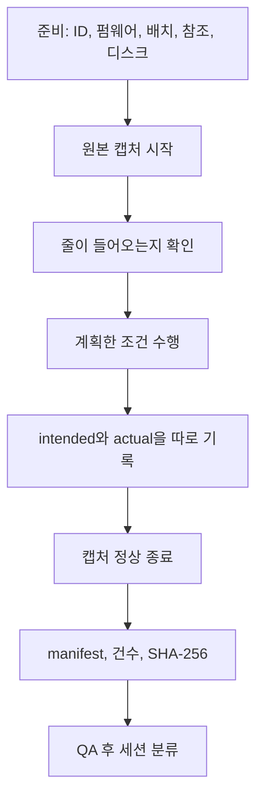

# SafeNest mmWave 실측 안내서

문서 상태: **PRE-M-C1 MEASUREMENT GUIDE**
대상: 나중에 MR60BHA2를 들고 물리 데이터를 쌓을 현장 측정자
언어: 한국어 (현장용)

이 문서는 **M-C1 최종 측정 규약을 동결하는 문서가 아니다.** 지금 있는 근거로 앞으로의 실측을 덜 망가뜨리기 위한 준비 문서다.

> 자세한 캡처 조건은 standalone M-C0가 MR60 신호와 Phase-B 입력의 의미·시간 대응을 확인한 뒤에 더 정밀해질 수 있다.

기록 강도는 이렇게 읽는다.

| 표시 | 뜻 |
| --- | --- |
| **반드시 기록** | 없으면 그 세션으로 정식 주장을 하기 어렵다 |
| **권장 기록** | 나중에 원인 분석·재현에 크게 도움이 된다 |
| **선택 기록** | 있으면 좋지만 없어도 세션 자체가 무효는 아니다 |

두 문서의 역할:

| 문서 | 역할 |
| --- | --- |
| [기술 인수인계서](20260815_SafeNest_mmWave_Technical_Handoff_01.md) | 무엇을 만들었고, 왜 여기서 멈춰 있고, 다음 단계가 무엇인가 |
| **이 실측 안내서** | 오늘 센서를 들고 무엇을 준비하고, 무엇을 같이 남기고, 실패하면 어떻게 하는가 |

기존 데이터 *평가*는 이 안내서가 아니다. 이미 찍힌 로그가 무엇을 말하는지 보려면 [한글 평가 설명](reports/20260814_SafeNest_mmWave_Team_MR60_Data_Evaluation_KR_01.md)을 본다.

---

## 이 문서는 언제 쓰는가?

이 문서는 향후 MR60BHA2 실측 데이터를 **새로 쌓을 때** 현장 측정자가 사용하는 안내서다.

다음이 **아니다.**

- 모델 학습 안내서
- 펌웨어 개발 안내서
- 현재 모델이 MR60에서 검증됐다는 결과 보고
- 최종 M-C1 승인 / 지금 측정을 시작하라는 허가
- 임상 실험 프로토콜

왜 조심해서 찍어야 하는가.

나중에 AI를 다시 학습하거나 실제센서 성능을 평가하려면, 신호 파일만 많이 모으는 것으로는 부족하다. **누가, 어떤 조건에서, 실제로 어떤 상태였으며, 센서가 그 순간 정상적으로 새 데이터를 내고 있었는지**가 함께 남아야 한다.

철학은 한 줄이다.

> 풍부하게 기록하고, 정답 라벨은 근거가 있을 때만 보수적으로 붙인다.

많이 찍는 것이 목표가 아니다.

---

## 현재 상태 (작성 시점)

현재는 offline 모델까지 고정되어 있고 실제 MR60 측정 데이터도 존재하지만, MR60의 `breath_phase`가 frozen model의 입력 계약과 충분히 대응하는지는 **standalone M-C0에서 아직 확인되지 않았다.**

따라서 이 안내서는 미래 실측을 더 재현 가능하게 만들기 위한 준비 문서이며, **M-C1 측정을 지금 즉시 시작하라는 승인 문서가 아니다.**

| 단계 | 상태 |
| --- | --- |
| Phase B offline 후보 | 고정됨 (인수인계서 참고) |
| 기존 팀 실측 / Pilot | 존재함. 교훈 자료 |
| M-C0 | 미시작 |
| M-C1 | 미시작 |
| M-C2 | 미시작 |
| M-D | 미허가 |
| Team PR #18 | OPEN draft, head `62eb0d867cfa02295c9a1d023b813134c434b8eb` |

---

## 목차

1. [5분 요약](#1-5분-요약)
2. [우리가 모으려는 데이터](#2-우리가-모으려는-데이터)
3. [주요 값 이해하기](#3-주요-값-이해하기)
4. [기존 실측에서 배운 점](#4-기존-실측에서-배운-점)
5. [측정 전에 준비할 것](#5-측정-전에-준비할-것)
6. [사람과 세션 ID](#6-사람과-세션-id)
7. [센서 배치와 환경](#7-센서-배치와-환경)
8. [한 번의 측정을 처음부터 끝까지](#8-한-번의-측정을-처음부터-끝까지)
9. [지시한 조건과 실제 정답](#9-지시한-조건과-실제-정답)
10. [측정 중 freshness와 오류](#10-측정-중-freshness와-오류)
11. [측정 직후 확인](#11-측정-직후-확인)
12. [정상 / 제한 / 실패 분류](#12-정상--제한--실패-분류)
13. [원본과 파생물](#13-원본과-파생물)
14. [데이터를 쌓을 때 원칙](#14-데이터를-쌓을-때-원칙)
15. [향후 모델과의 관계](#15-향후-모델과의-관계)
16. [M-C0 이후 확정해야 할 항목](#16-m-c0-이후-확정해야-할-항목)
17. [현장용 1페이지 체크리스트](#17-현장용-1페이지-체크리스트)
18. [예시 세션](#18-예시-세션-example-only)
19. [실패 세션 예시](#19-실패-세션-예시)
20. [하지 말 것](#20-하지-말-것)
21. [용어](#21-용어)
22. [기술 근거 문서](#22-기술-근거-문서)

---

## 1. 5분 요약

비담당 팀원이 측정 철학만 먼저 잡기 위한 장이다.

1. 우리는 MR60에서 **호흡과 관련된 물리 증거**를 모은다.
2. 파일이 많다고 좋은 데이터가 아니다.
3. 신호 + 시각 + 사람/세션 정체 + 물리 조건 + 믿을 수 있는 참조 + freshness + 펌웨어/캡처 identity가 같이 있어야 한다.
4. “12번에 맞춰 숨 쉬세요”라고 말했다고 실제로 12번 쉰 것은 아니다.
5. paced rpm을 NORMAL / RAPID / APNEA로 자동 변환하지 않는다.
6. 실패한 세션은 지울 데이터가 아니라 **실패 증거**로 남긴다.
7. 실명은 파일에 쓰지 말고, 가명 subject ID는 한 사람에게 일관되게 유지한다.
8. 가능하면 원본 telemetry를 그대로 보존한다.
9. 컴퓨터가 초당 열 줄을 썼다고 해서 레이더가 초당 열 개의 **새로운 위상 값**을 준 것은 아니다.
10. 데이터가 생겼다고 모델을 돌리거나 재학습하지 않는다.

---

## 2. 우리가 모으려는 데이터

“MR60 데이터셋”이라고만 말하면 부족하다. 쓸 수 있는 한 번의 측정은 아래가 같이 남은 세션이다.

```text
센서 신호
+ 시간
+ 사람/세션 정체
+ 물리 조건
+ 실제 참조 / 정답 (가능한 경우)
+ 센서 건강 / freshness
+ 펌웨어·캡처 identity
= 쓸 수 있는 물리 증거
```

| 조각 | 무엇을 해야 하나 | 왜 해야 하나 | 실제로 어떻게 | 제대로 됐는지 |
| --- | --- | --- | --- | --- |
| 센서 신호 | `breath_phase` 등 producer가 낸 값을 남긴다 | 나중에 모델 입력 후보를 재구성하려면 원신호가 필요하다 | verbatim JSON/로그를 먼저 켠다 | 파일이 열리고 필수 필드가 파싱된다 |
| 시간 | 각 줄의 timestamp를 보존한다 | 순서·간격·freeze를 나중에 볼 수 있다 | `ts_monotonic_ms`를 버리지 않는다 | 역행/큰 구멍이 없거나, 있으면 메모된다 |
| 사람/세션 | 가명 ID를 세션마다 적는다 | 같은 사람이 TRAIN/TEST에 섞이면 점수가 과장된다 | `S001`처럼 유지한다 | 한 사람이 한 ID, 다른 사람이 다른 ID |
| 물리 조건 | 거리·자세·방향·움직임을 적는다 | 신호 이상이 모델 문제인지 배치 문제인지 가린다 | 줄자로 재고 사진/메모를 남긴다 | manifest에 숫자가 있다 |
| 참조/정답 | 가능한 독립 참조를 남긴다 | 지시만으로는 실제 호흡을 증명하지 못한다 | 승인된 참조가 있으면 같이 켠다 | intended와 actual이 따로 적혀 있다 |
| freshness | `phase_age_ms` 등을 남긴다 | 같은 값을 반복 출력했을 수 있다 | 필드를 버리지 않는다 | 통계가 있고, 임계 단정은 하지 않는다 |
| 소프트웨어 identity | 펌웨어/config/캡처 SHA를 적는다 | 다른 버전 로그를 한 덩어리로 합치면 안 된다 | 측정 전에 적는다 | 모르면 `UNKNOWN_NOT_REPORTED` |

---

## 3. 주요 값 이해하기

저장하라고 하기 전에, 숫자가 무엇을 뜻하는지 먼저 나눈다.

### `breath_phase`

MR60에서 노출되는 호흡 관련 **phase-like intermediate signal**이며, 향후 Phase-B waveform correspondence를 조사할 핵심 후보 신호다.

확인된 ADC, IQ, range-bin, raw rFFT가 **아니다.** CSV의 `resp_phase`는 보통 이 값을 그대로 둔 것이다.

### `breath_rate_raw`

MR60 **vendor 알고리즘**이 계산해서 내보내는 호흡수 값이다.

현재 3-class AI 모델이 먹는 30초 파형이 **아니다.** 이 숫자만 모아서 모델을 평가했다고 말하지 않는다.

### 팀이 계산한 호흡수

ESP나 host가 `breath_phase`를 다시 분석해 만든 값이다. vendor 호흡수도, 모델 입력도 아니다. 파생 산출물로 따로 표시한다.

### `phase_age_ms`

현재 telemetry에 들어 있는 `breath_phase` 값이 마지막으로 새 phase update를 받은 뒤 얼마나 시간이 지났는지 판단하는 데 도움이 되는 값이다.

freshness 증거이지만, 모든 `0x0A13` frame 도착 시각을 완전 재구성하지는 않는다.

### 줄 속도와 새로운 위상은 다르다

ESP가 0.1초마다 JSON 한 줄을 보내면 초당 약 10줄이 쌓인다. 그 10줄의 `breath_phase`가 모두 새로 측정된 값이라는 뜻은 아니다. 마지막 값을 반복해 보낼 수 있다.

모델은 약 30초, 명목 10 Hz, 300 sample을 기대하므로, **300줄이 있다고 300개의 새 샘플이라고 보지 않는다.**

같은 phase 숫자가 연속이라고 stale이라고 단정하지도 않는다. 공식 `phase_age_ms` 임계값이 아직 없으므로, 통계를 보고하고 임계 분류는 `NOT_DEFINED`로 둔다.

---

## 4. 기존 실측에서 배운 점

옛 절차를 그대로 복사하지 않는다. 다음에 남길 교훈만 가져온다.

| 구분 | 내용 |
| --- | --- |
| 잘된 점 | timestamp와 `breath_phase` / `breath_rate_raw`를 나란히 남겼다. 실패한 12 rpm, 얕은 호흡, D15 lock-loss를 지우지 않았다. 거리 0.6 / 0.9 / 1.2 / 1.5 m를 시도했다. 약 31분 로그가 있어 장시간 안정성을 볼 수 있다. PR #18 Pilot은 schema 1.2 JSONL과 firmware/config hash를 같이 남겼다. |
| 실패한 점 | 명목 12 rpm 세션의 실제 위상은 약 **6.06 rpm**이었다. D12는 presence drop, D15는 vitals/phase freeze가 있었다. 전달 CSV 기준 식별 가능한 사람은 `S001`뿐이라 사람 다양성이 부족하다. |
| 애매했던 점 | 메트로놈 지시와 실제 호흡을 같은 정답으로 읽기 쉬웠다. 줄 속도 ≈ 10 Hz를 곧 새로운 위상 10 Hz로 읽기 쉬웠다. D15를 “거리 분산 0”으로 요약하기 쉬웠다(실제 거리 표본 표준편차는 약 2.94 cm). |
| 다음에 기록할 것 | intended와 actual을 따로. `phase_age_ms`를 버리지 말 것. 실패 이유를 세션에 적을 것. 사람 ID를 여러 명으로 확장할 것. 펌웨어와 캡처 프로그램을 측정 전에 적을 것. |

알려진 거리 출발점 (동결된 규약 거리가 **아님**):

| 기존 조건 | 대략 거리 | 현장에서 기억할 점 |
| --- | --- | --- |
| D06 / D09 | 0.6 m / 0.9 m | 점유 세션으로 비교적 쓸 만한 **실무 출발점**으로 쓰였다 |
| D12 | 1.2 m | presence drop이 관찰됨 |
| D15 | 1.5 m | vitals/phase freeze가 관찰됨 |

```text
KNOWN PRACTICAL STARTING POINT  ≠  FROZEN PROTOCOL REQUIREMENT
```

항상 X cm에서 재라고 이 문서가 정하지 않는다. 최종 거리는 M-C0 / M-C1 동결을 기다린다.

---

## 5. 측정 전에 준비할 것

### 하드웨어

| 강도 | 항목 |
| --- | --- |
| 반드시 | MR60BHA2, 현재 사용하는 ESP32/producer 노드, 안정 전원, 데이터 케이블, 센서 고정 방법, 거리 측정 수단(줄자 등) |
| 권장 | 캡처용 Raspberry Pi 또는 노트북, 삼각대/마운트, 주변 사람을 통제할 수 있는 공간 |
| 선택 | 프로젝트에서 승인한 독립 호흡 참조 장치 |

이 안내서가 특정 제품을 구매하라고 정하지 않는다. **최종 M-C1 독립 참조 하드웨어는 승인된 M-C1 규약이 고른다.**

### 소프트웨어 identity — 측정 전에 적기

**반드시:**

- 팀 저장소 commit (`team_repo_commit`)
- ESP 앱/펌웨어 문자열 (`firmware_version`, 예: `safenest-mr60-esp/1.2.0`)
- `config_hash`
- 캡처 프로그램 이름과 commit/SHA
- telemetry schema version

MR60 **모듈** vendor firmware를 모르면 추측하지 말고 `UNKNOWN_NOT_REPORTED`로 적는다.

두 펌웨어는 다른 것이다.

| 구분 | 뜻 |
| --- | --- |
| ESP application firmware | ESP32에서 돌아가는 SafeNest 앱 버전. 예: `safenest-mr60-esp/1.2.0` |
| MR60 vendor module firmware | 레이더 모듈 자체 펌웨어. 모르면 `UNKNOWN_NOT_REPORTED` |

Pilot에서 ESP는 `safenest-mr60-esp/1.2.0`인데 모듈 버전이 `UNKNOWN_NOT_REPORTED`인 경우가 이미 있다. 빈칸을 추측으로 채우지 않은 것이 맞다.

Team PR #18의 `live_mr60_monitor.py`는 USB JSON을 그대로 받아 쓰는 **팀 쪽 예시**이지, 동결된 M-C1 도구가 아니다. 당일 승인된 캡처 프로그램을 쓰고, 그 이름과 commit을 적는다. standalone 저장소에 동결된 현장 캡처 CLI가 아직 없으면, 없는 명령을 지어내지 않는다.

### 저장과 시계

**반드시:** 저장 경로, 남은 디스크, 파일이 실제로 쓰이는지, 시계 소스.

ESP monotonic `ts_monotonic_ms`와 노트북 벽시계를 이름만 섞어 쓰지 않는다. 어떤 시계인지 적는다.

---

## 6. 사람과 세션 ID

왜 사람 ID가 필요한가.

같은 사람의 데이터가 나중에 TRAIN과 TEST 양쪽에 섞이면 모델의 실제 일반화 능력을 과대평가할 수 있기 때문에, subject identity를 **처음부터** 유지해야 한다.

측정 현장에서 train / val / test를 나누지 않는다. 그 배정은 나중 규약이 한다.

| 규칙 | 내용 |
| --- | --- |
| 가명 | `S001`, `S002`, `S003`처럼 기존 delivery 관례를 따른다 |
| 실명 금지 | 이름, 학번, 연락처를 파일명이나 manifest에 넣지 않는다 |
| 한 사람 한 ID | 세션이 달라도 과학적으로 같은 사람이면 같은 ID |
| ID 재사용 금지 | 다른 사람에게 같은 ID를 쓰지 않는다 |
| 쪼개지 않기 | 한 사람을 이유 없이 여러 ID로 나누지 않는다 |
| 세션은 별도 | 사람과 시도는 다른 칸이다 |

세션 ID 체계가 이미 둘 있다. 예: `S001_NORMAL_D09`, `M-C0-PILOT-DESKWORK-001`. **새 경쟁 체계를 만들지 말고**, 한 캠페인 안에서는 한 규칙을 끝까지 쓴다.

세션 manifest만 보고 아래를 알 수 있어야 한다.

- 사람
- 세션 / 트라이얼
- 시작 / 종료
- 의도 조건
- 실제 / 참조 조건
- 하드웨어·소프트웨어 identity

권장 최소 구성: `subject_id` + `session_id` + `trial_id` + 시작/종료 시각과 시간대.

---

## 7. 센서 배치와 환경

레이더는 거리·방향·자세·움직임에 따라 신호 품질이 달라질 수 있다. 나중에 결과가 이상할 때 **모델 문제인지, 측정 배치 문제인지** 구분하려면 이 조건을 함께 남겨야 한다.

| 필드 | 강도 | 왜 |
| --- | --- | --- |
| 센서-대상 거리 | 반드시 | 기존에 거리만 바꿔도 presence/lock이 달라졌다 |
| 자세 (앉음/누움/섬 등) | 반드시 | 흉부 움직임이 레이더에 보이는 방식이 달라진다 |
| 레이더 기준 몸 방향 | 반드시 | 정면/측면/등지면 반사가 다를 수 있다 |
| 센서 높이·부착 | 반드시 | 나중에 같은 설치인지 재현하려면 필요하다 |
| 대상 위치 | 반드시 | 시야 가장자리와 중앙이 다를 수 있다 |
| 범위 안의 다른 사람 | 반드시 | 다른 사람의 움직임이 섞일 수 있다 |
| 큰 가림막 | 권장 | 가구·벽이 신호를 가릴 수 있다 |
| 움직임 조건 | 반드시 | 정지와 팔 움직임은 다른 증거다 |

거리를 이 문서가 하나의 공식 값으로 동결하지 않는다. 4절 표의 D06/D09는 **알려진 실무 출발점**일 뿐이다.

---

## 8. 한 번의 측정을 처음부터 끝까지

인쇄하거나 휴대폰으로 보기 위한 순서다.



### A. 준비

1. subject / session / trial ID를 정하고 종이나 체크리스트에 적는다.
2. 펌웨어, config hash, 캡처 프로그램을 확인한다.
3. 거리·자세·방향을 맞추고 적는다.
4. 독립 참조가 필요한 세션이면 참조 장치가 **실제로 기록 중인지** 확인한다.
5. 저장 경로와 디스크를 확인한다.
6. 시각 소스를 확인한다.

### B. 캡처 시작

1. 원본/verbatim 캡처를 **먼저** 시작한다.
2. 줄이 실제로 들어오는지 본다.
3. `breath_phase`, `breath_rate_raw`, `ts_monotonic_ms`, 가능하면 `phase_age_ms`가 있는지 본다.
4. 명백한 freeze, 파싱 실패, 전원 이상을 본다.
5. 데이터가 들어오는 것이 확인된 뒤에야 계획한 호흡/자세 조건을 시작한다.

### C. 조건 수행

1. 지시한 조건을 적는다 (intended).
2. 실제로 보인 상태와 참조 결과를 따로 적는다 (actual).
3. 데이터가 마음에 안 든다고 나중에 조건을 고쳐 쓰지 않는다.

### D. 종료

1. 조건을 끝낸다.
2. 캡처를 정상 종료한다.
3. 세션 전체를 보존한다.
4. manifest와 SHA-256, 바이트 수, 레코드 수를 남긴다.
5. QA를 돌리거나 최소한 [11절](#11-측정-직후-확인)을 한다.
6. 세션을 분류한다.

---

## 9. 지시한 조건과 실제 정답

이 안내서에서 가장 강한 규칙 중 하나다.

> “12 bpm에 맞춰 호흡해 주세요”는 **intended condition**이다.

> 실제 사람이 12 bpm로 호흡했다는 것은 별도의 reference로 확인해야 하는 **actual condition**이다.

```text
METRONOME CUE  ≠  GROUND TRUTH
```

기존에 파일명이 12 rpm인 세션에서 위상은 약 6.06 rpm으로 나온 기록이 있다. 메트로놈은 12에 가깝고 가슴 움직임은 약 6이었다. 그래서 메트로놈 큐만으로 정답을 붙이지 않는다.

### Ground truth란

Ground truth는 나중에 모델의 예측이 맞았는지 틀렸는지 비교할 수 있는 **신뢰 가능한 실제 정답**이다.

정식 성능 평가를 하려면, 평가 대상인 MR60 출력과 충분히 독립된 참조가 필요하다. Phase A에서 RAPID 정답은 Movesense chest accelerometer 참조와 frozen source-label contract로 만들어졌다. 그것이 미래 M-C1의 **유일한 장치**라는 뜻은 아니다.

```text
Independent-reference hardware for final M-C1 must be selected/frozen by the
authorized M-C1 protocol.
```

### 자동 라벨을 붙이지 말 것

아래를 자동으로 쓰지 않는다. 나중에 동결된 라벨 규약이 따로 말하기 전에는 금지다.

- 12 rpm = NORMAL
- 15 rpm = NORMAL
- 20 rpm = RAPID
- 25 rpm = RAPID
- 숨 참기 = APNEA

Phase-A의 25 bpm 규칙은 당시 **독립 Movesense 참조**로 RAPID 정답을 만든 과거 계약이다. 향후 MR60 `breath_rate_raw >= 25`를 자동 RAPID로 쓰는 권한이 **아니다.**

### 숨 참기 / apnea-like 조건

자발적 숨 참기는 실험적 **proxy 증거**이지 임상 apnea가 아니다. 참가자를 의학적으로 무호흡이라고 적지 않는다.

정식 캡처 전에 승인된 참여 기준과 중단 규칙을 따른다. 이 문서는 의료 절차를 정하지 않는다. 실험 조건은 승인된 프로젝트 규약과 참가자 편안함/안전 안에 둔다. 참가자가 불편을 말하거나 멈추고 싶으면 실험 조건을 중단한다.

---

## 10. 측정 중 freshness와 오류

건강한 세션은 초당 줄 수만으로 판단하지 않는다.

있으면 본다.

- telemetry timestamp
- `seq`
- `phase_age_ms`
- error / degraded
- 빠진 필드
- 시간 간격
- 중복 / 역행 timestamp

하지 말 것:

- 줄 속도만으로 fresh `0x0A13` cadence를 주장하기
- 같은 phase가 연속이라고 stale이라고 단정하기
- 이 문서가 `phase_age_ms` 임계값을 만들기

임계값이 없으면 **기술 통계를 남기고**, 임계 분류는 `NOT_DEFINED`로 둔다.

약 31분 로그는 줄이 약 10 Hz로 찍히면서도 `phase_age_ms`가 매우 커질 수 있음을 보여 준다. 장시간 세션에서는 특히 이 점을 메모한다.

---

## 11. 측정 직후 확인

```text
[ ] 파일이 만들어졌다
[ ] session ID가 맞다
[ ] timestamp가 있다
[ ] JSON/CSV가 파싱된다
[ ] 명백한 역행 timestamp가 없다
[ ] breath_phase, breath_rate_raw가 있다
[ ] 해당 스택에서 기대되면 phase_age_ms가 있다
[ ] error/degraded를 훑었다
[ ] 메타데이터가 비어 있지 않다
[ ] 레코드 수를 적었다
[ ] SHA-256을 만들었다
[ ] 원본을 수정하지 않고 보존했다
```

팀 쪽 도구가 있으면 그 결과를 붙인다. standalone에 동결된 현장 캡처 스크립트가 아직 없으므로, 없는 명령을 지어내지 않는다.

체크섬을 만든 뒤에는 raw를 고치지 않는다. 수정이 필요하면 계보가 있는 파생 파일을 만든다.

세션마다 가능하면 남긴다: filename/path, byte count, record count, SHA-256, session ID, capture identity, QA 결과. 나중에 파일이 바뀌었는지 보려면 당시 원본 identity가 필요하다.

---

## 12. 정상 / 제한 / 실패 분류

아래 이름은 이 안내서의 **권장 분류**다. M-C1이 다른 공식 토큰을 동결하면 그것을 따른다.

| 분류 | 쉽게 말하면 | 나중에 |
| --- | --- | --- |
| REFERENCE_QUALITY | 의도한 조건을 수행했고, 필수 필드가 있으며, 참조가 필요하면 참조도 남았고, 명백한 freeze/파싱 실패가 없다 | 정식 성능 후보로 검토 가능 |
| USABLE_WITH_LIMITATIONS | 신호는 남았지만 높이 미측정, 주변인, 짧은 중단 등 제한이 있다 | 버리지 말고 한계를 적는다 |
| ROBUSTNESS_CONDITION | 얕은 호흡, 작은 움직임처럼 일부러 어렵게 한 조건 | 깨끗한 성능 샘플이 아니라 강건성 증거 |
| FAILURE_MODE | lock-loss, 긴 stale, presence drop, 잘못된 호흡 수행 | 삭제하지 않는다. 그 주장에는 쓰지 않는다 |
| INVALID_CAPTURE | 캡처가 안 열렸거나 필수 필드·시각이 없다 | 원본 자동 삭제가 아니다. 그 주장에 쓰지 말라는 뜻 |

얕은/깊은 호흡, 움직임, 일시적 lock-loss, stale, 저진폭, 거리 실패는 다음 증거가 될 수 있다.

```text
ROBUSTNESS_EVIDENCE
FAILURE_MODE_EVIDENCE
QUALITY_GATING_EVIDENCE
```

QA에 실패했다고 지우지 않는다. `INVALID_CAPTURE`도 “지우라”가 아니라 “그 주장에 쓰지 말라”다.

### 언제 재측정하나

- 캡처가 시작되지 않음
- 필수 필드 없음
- timestamp 스트림이 무효
- 정식 참조가 필요한데 참조 실패
- subject/session을 방어 가능하게 복구 불가
- 규약이 요구하는 하드웨어 identity 부재

재측정해도 실패 시도를 지우지 않는다.

```text
FAILED_ATTEMPT  +  REPEAT_ATTEMPT
```

다른 세션 ID와 계보로 둘 다 남긴다.

### 언제 측정을 중단하나

기술: 전원 불안정, 지속 파싱 실패, 캡처 중단, 잘못된 사람/세션 설정, 필수 참조 장치 실패.

참가자: 불편하거나 멈추고 싶으면 멈춘다. 승인된 규약 밖의 호흡 조작을 강요하지 않는다.

### 파일 이름만 보고 의미를 추측하지 말 것

파일명에 `NORMAL`, `12RPM`, `APNEA`가 있어도 그것만으로 정답이 아니다. 의미는 manifest와 참조 증거에서 온다. 나중에 실수로 가짜 라벨을 붙이지 않기 위한 규칙이다.

---

## 13. 원본과 파생물

### 원본 / verbatim

producer/캡처 경로가 실제로 남긴 telemetry다.

현재 스택이 만들면 **버리지 말 것:**

- verbatim sensor/ESP telemetry
- `ts_monotonic_ms`
- `seq`
- `breath_phase`
- `phase_age_ms`
- `breath_rate_raw`
- 있는 경우 distance / presence / motion
- lock / degraded / error
- `firmware_version`
- `config_hash`
- schema version

producer 필드를 조용히 버리지 않는다. 정확한 기계 스키마는 당일 producer 증거를 확인한다.

### 파생물

CSV보내기, 보간, 필터, BPF_ZSCORE 창, 호흡수 추정, QA 요약, TFLite 입력, 예측.

파생물이 원본을 덮어쓰지 않는다.

```text
raw source  →  transformation  →  derived artifact
```

모델이 10 Hz를 기대한다고 raw timestamp를 버리고 바로 10 Hz 격자로 바꾸지 않는다. 보간이 필요하면 출처, 방법, 파라미터, 이유, 결과 identity를 적는다. M-C0 대응 결과가 나오기 전에는 특히 그렇다.

### 신호와 같이 둘 메타데이터

| 필드 | 강도 |
| --- | --- |
| subject_id | 반드시 |
| session_id | 반드시 |
| trial_id | 권장 |
| operator | 권장 |
| 캡처 날짜/시각 | 반드시 |
| intended condition | 반드시 |
| actual / reference condition | 반드시 (없으면 `not_collected`와 이유를 적는다) |
| 거리 | 반드시 |
| 자세 / 방향 / 센서 배치 | 반드시 |
| 움직임 조건 | 반드시 |
| 다른 사람 존재 | 반드시 |
| 참조 장치/방법 | 권장 |
| firmware / config identity | 반드시 |
| 캡처 프로그램 identity | 반드시 |
| notes | 권장 |

불필요한 개인정보는 모으지 않는다.

---

## 14. 데이터를 쌓을 때 원칙

많이 찍으면 된다는 생각이 가장 위험하다.

좋은 축적에는 아래가 같이 있어야 한다.

```text
참가자 다양성
+ 조건 다양성
+ 반복 측정
+ 믿을 수 있는 라벨/참조
+ 좋은 provenance
```

한 사람을 천 창 찍은 것은 여러 사람 데이터가 아니다. 나중에 모델을 사람 단위로 나눠 평가하려면, 처음부터 여러 사람의 ID가 갈라져 있어야 한다.

최종 인원 수·세션 수는 이 문서가 정하지 않는다.

```text
TO_BE_FROZEN_IN_M-C1
```

설계 원칙만 말한다: 여러 사람, 여러 세션, 물리적으로 의미 있는 여러 조건, 반복, 나중에 subject-wise로 나눌 수 있을 것.

### 무엇을 반복 측정하면 좋은가

승인된 규약 안에서 나중에 넣을 수 있는 **후보 차원**이다. 지금 공식 모델 라벨이 아니다. 검증되지 않은 클래스 실험을 강제하지 않는다.

| 후보 프로토콜 차원 | 현재 공식 모델 라벨인가 |
| --- | --- |
| 사람 차이 | 아님. 일반화를 보기 위한 차원 |
| 거리 | 아님. 품질/lock에 영향 |
| 자세 | 아님 |
| 방향 | 아님 |
| 조용한 자연 호흡 | 아님. 가장 기본적인 물리 조건 |
| 자연 변동 | 아님 |
| 움직임 간섭 | 아님. 강건성 증거 |
| 얕은/깊은 호흡 | 아님. 강건성 증거 |
| 장시간 안정성 | 아님 |
| 출입 / presence 전이 | 해당되면 후보. 자체 클래스가 아님 |

---

## 15. 향후 모델과의 관계

향후 새 모델을 만들려면 신호만 필요한 것이 아니라, 어떤 target을 학습할 것인지에 따라 정답 정보가 함께 있어야 한다.

| 향후 가능성 | 같이 있어야 하는 정답 | 지금 허가인가 |
| --- | --- | --- |
| 3-class 지도학습 분류기 | 창마다 믿을 수 있는 클래스 정답 | 아님 |
| 호흡수 회귀 | 믿을 수 있는 연속/참조 호흡수 | 아님 |
| 신호 품질 모델 | 품질/실패 주석 | 아님 |
| 이상 탐지 | 라벨 요구가 다를 수 있음 | 아님 |

```text
FUTURE DEVELOPMENT POSSIBILITY
NOT CURRENT TRAINING AUTHORIZATION
```

그래서 측정할 때는 raw / context / reference를 풍부하게 남기고, 정답 label은 근거가 충분한 경우에만 붙인다.

```text
collect rich evidence
+ avoid aggressive pseudo-labeling
```

지금 3-class뿐 아니라 나중에 호흡수 회귀, 품질 판정, anomaly, 시간 모델에도 같은 실측을 재활용할 수 있다.

---

## 16. M-C0 이후 확정해야 할 항목

현재 공식 흐름:

```text
Phase A
→ Phase B frozen candidate
→ Team legacy / Pilot evidence
→ standalone M-C0 correspondence audit
→ independent review
→ M-C1 protocolized acquisition
→ M-C2 frozen-model evaluation
→ M-D only if separately authorized
```

이 안내서는 M-C1을 대신하지 않는다. 아래는 지금 답을 만들지 않는다.

- Phase-B와 같은 뜻의 신호 정의
- fresh phase cadence 계약
- 재샘플 / 보간 정책
- 최종 M-C1 통제 조건과 거리
- 독립 참조 하드웨어
- 최종 표본 수
- 정식 ground-truth 매핑
- `phase_age_ms` 임계값

M-C0는 지금 가진 실측이 frozen 모델에 넣어도 되는지 확인하는 단계다. 아직 시작하지 않았다. M-C1은 그 결과에 맞춰 검증용으로 새로 측정하는 단계다. M-C2는 얼린 모델을 바꾸지 않고 실제 MR60에서 정식 평가하는 단계다. M-D는 차이가 측정되고 따로 승인될 때만이다.

---

## 17. 현장용 1페이지 체크리스트

### 시작 전

```text
[ ] Subject ID
[ ] Session / trial ID
[ ] ESP firmware / config_hash
[ ] 캡처 프로그램 이름·commit
[ ] 모듈 firmware 또는 UNKNOWN_NOT_REPORTED
[ ] 거리·자세·방향
[ ] 의도 조건
[ ] 참조 장치가 필요하면 준비됨
[ ] 저장 경로·디스크
```

### 측정 중

```text
[ ] 캡처가 돌아가고 줄이 들어온다
[ ] 필수 필드가 보인다
[ ] 명백한 freeze/파싱 실패가 없다
[ ] 참조가 필요하면 같이 기록 중이다
[ ] 예상 밖 사건을 메모한다
```

### 끝난 뒤

```text
[ ] 실제 조건/참조를 적었다
[ ] 파일이 정상 종료됐다
[ ] QA 또는 직후 확인을 했다
[ ] 레코드 수·바이트 수
[ ] SHA-256
[ ] 실패/제한을 분류했다
[ ] 원본을 고치지 않고 보존했다
```

---

## 18. 예시 세션 (EXAMPLE ONLY)

가상 예시이며 실제 참가자 정보가 아니다. 필드만 연습용이다.

```text
example_only: true
subject_id: S003
session_id: S003_QUIET_SEATED_001
trial_id: 1
operator_id: OP-LOCAL
intended_condition: quiet natural breathing
actual_reference: not_collected
distance_cm: 90
posture: seated
orientation: facing_radar
movement: stationary
other_people_present: false
firmware_version: safenest-mr60-esp/1.2.0
sensor_firmware_version: UNKNOWN_NOT_REPORTED
config_hash: (측정 당일 값)
capture_program: (당일 승인 프로그램)
qa_status: USABLE_WITH_LIMITATIONS
notes: PRE-M-C1 practice metadata; not a formal M-C2 sample
```

90 cm는 D09 근처의 **연습용 숫자**일 뿐, 동결된 공식 거리가 아니다.

---

## 19. 실패 세션 예시

측정 중 어느 시점 이후 `phase_age_ms`가 비정상적으로 커지고 phase가 사실상 갱신되지 않는 상태가 관찰됐다고 하자. **정확한 초 임계값은 이 문서가 정하지 않는다.**

할 일:

- raw를 남긴다
- `FAILURE_MODE` 또는 `INVALID_CAPTURE`로 한계를 적는다
- 깨끗한 정식 성능 데이터로 쓰지 않는다
- stale/freeze QA 연구에는 쓸 수 있다
- 필요하면 새 세션 ID로 반복한다
- 실패 파일을 지우지 않는다

기존 D15는 vitals/phase freeze가 있었고 거리 표본 표준편차는 0이 아니라 약 2.94 cm였다. 실패를 “거리 분산 0”으로 요약하지 말고, **무엇이 멈췄는지**를 적는다.

---

## 20. 하지 말 것

- raw 파일을 임의로 수정하지 않는다.
- 파일명만 보고 class label을 붙이지 않는다.
- metronome cue를 실제 ground truth로 가정하지 않는다.
- `breath_rate_raw`를 현재 AI waveform input으로 착각하지 않는다.
- telemetry 10 Hz를 fresh phase 10 Hz라고 단정하지 않는다.
- 실패 세션을 지우지 않는다.
- 같은 사람을 다른 subject ID로 무분별하게 나누지 않는다.
- 서로 다른 사람을 같은 subject ID로 합치지 않는다.
- 측정 후 결과가 마음에 안 든다고 metadata를 바꾸지 않는다.
- M-C0 전에 임의 전처리를 frozen contract처럼 선언하지 않는다.
- 측정 데이터가 생겼다고 자동으로 retraining하지 않는다.
- 이 안내서를 M-C1 시작 승인으로 읽지 않는다.

---

## 21. 용어

| 말 | 쉬운 뜻 |
| --- | --- |
| Ground truth | 나중에 채점할 수 있는 믿을 수 있는 정답 |
| Proxy | 직접 사건 대신 쓰는 대리지표. 자발적 숨 참기는 임상 apnea가 아니다 |
| Freshness | 값이 얼마나 최근에 갱신됐는지 |
| Cadence | 초당 몇 번 나오는지. 줄 속도와 새 phase 속도는 다를 수 있다 |
| Correspondence | 실센서 신호가 학습 입력과 같은 뜻·시간인지 |
| Provenance | 데이터가 어디서 어떻게 왔는지의 계보 |
| Subject-wise split | 한 사람을 학습과 시험에 동시에 넣지 않는 것 |
| Intended condition | 측정자가 지시한 조건 |
| Actual condition | 실제로 관찰/참조된 상태 |

---

## 22. 기술 근거 문서

모델 identity, SHA, 금지 게이트가 필요하면 인수인계서를 연다. 이 안내서는 그 표를 복사하지 않는다.

- 기술 인수인계: [docs/20260815_SafeNest_mmWave_Technical_Handoff_01.md](20260815_SafeNest_mmWave_Technical_Handoff_01.md)
- 영문 기존 실측 평가: [docs/reports/20260814_SafeNest_mmWave_Existing_Team_MR60_Data_Evaluation_01.md](reports/20260814_SafeNest_mmWave_Existing_Team_MR60_Data_Evaluation_01.md)
- 한글 평가 설명: [docs/reports/20260814_SafeNest_mmWave_Team_MR60_Data_Evaluation_KR_01.md](reports/20260814_SafeNest_mmWave_Team_MR60_Data_Evaluation_KR_01.md)
- mmWave 실행 순서: [docs/20260806_ChatGPT_SafeNest_mmWave_Execution_Sequence_01.md](20260806_ChatGPT_SafeNest_mmWave_Execution_Sequence_01.md)
- master roadmap: [docs/20260810_ChatGPT_SafeNest_Multisensor_Parallel_Execution_Roadmap_01.md](20260810_ChatGPT_SafeNest_Multisensor_Parallel_Execution_Roadmap_01.md)
- Phase B lock: [docs/reports/20260813_Cursor_M-B12_mmWave_Phase_B_Offline_Final_Report_01.md](reports/20260813_Cursor_M-B12_mmWave_Phase_B_Offline_Final_Report_01.md)

문서 구조의 현장 가독성 참고(열화상 전용 조건을 mmWave에 복사하지 않음): [docs/20260814_Codex_Thermal_Real_Data_Acquisition_Guide_KO_01.md](20260814_Codex_Thermal_Real_Data_Acquisition_Guide_KO_01.md)
