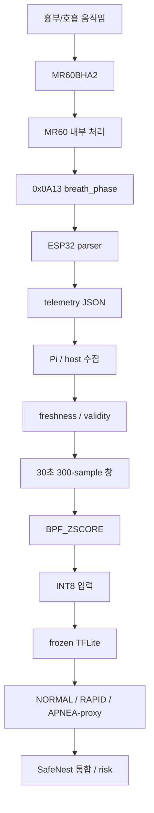
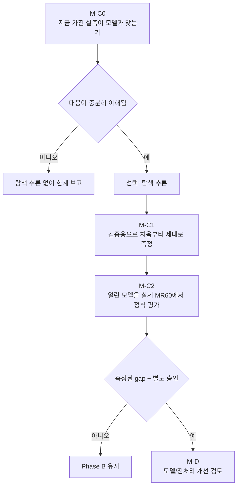

# SafeNest mmWave Technical Handoff

문서 상태: **문서 전용 인수인계 문서** (기술 권위 + 사람용 설명)
대상: mmWave 구현자가 아닌 팀 리드·임베디드/통합 엔지니어·측정 담당, 그리고 이어서 작업할 엔지니어·AI agent
범위: 현재 모델이 무엇을 판단하는지, 실센서 데이터가 어떻게 처리되어야 하는지, Phase A/B 고정 상태, 기존 팀 MR60 실측의 의미, Team PR #18, standalone `M-C0` 경계, 이후 가능한 개발 방향

> 이 문서는 모델, 데이터셋, 펌웨어, 전처리, 임계값, 로드맵 본문을 변경하지 않는다. 새 측정을 하지 않고, `M-C0`를 실행하지 않으며, 추론·재학습을 하지 않는다. `[현재 evidence]`, `[현재 구현]`, `[계획/미검증]`, `[향후 방향]` 표시는 이미 있는 것과 아이디어를 구분한다.

읽는 방법:

```text
사람(팀원/리드)     → 목차 1~8, 표, mermaid, 「쉽게 말하면」
기술 agent/리뷰어   → 「기술적 계약 / 근거」, SHA, 보고서 경로, 게이트 문구
```

작성 시점 identity:

```text
standalone origin/main     2d427bd95ca86ef43d77490194dd5d649835fa5e
이 핸드오프 최초 병합     PR #84 / c9e3ac9ec549dd285e9017aad8c2b838414af012
team main                  3d86bf2a7a4e527d7aba2dfabcb087201ffeb46e
team PR #18                OPEN, DRAFT, not merged
PR #18 head                62eb0d867cfa02295c9a1d023b813134c434b8eb
PR #18 base                5947334d3d0f6c6f7d6100c7ea6af219e5b4c5d5
```

기존 팀 실측 평가 보고서가 사용한 팀 `main`은 `fdf34b804f35e5868356f0ed6f804a248aa69131`이다.
그 이후 팀 `main`은 ESP32 LCD(PR #12)와 문서 PR #17을 병합했다. PR #18 head는 2026-08-14 이후 새 커밋이 없다.

---

## 목차

1. [5분 만에 이해하는 SafeNest mmWave 트랙](#1-5분-만에-이해하는-safenest-mmwave-트랙)
2. [SafeNest 전체에서 mmWave는 무슨 역할인가](#2-safenest-전체에서-mmwave는-무슨-역할인가)
3. [현재 mmWave AI 모델은 무엇을 판단하는가](#3-현재-mmwave-ai-모델은-무엇을-판단하는가)
4. [모델이 실제로 보는 데이터는 무엇인가](#4-모델이-실제로-보는-데이터는-무엇인가)
5. [실센서부터 AI 판단까지 데이터가 어떻게 처리되는가](#5-실센서부터-ai-판단까지-데이터가-어떻게-처리되는가)
6. [현재 구현 vs 목표 구조](#6-현재-구현-vs-목표-구조)
7. [현재 개발 상태 한눈에 보기](#7-현재-개발-상태-한눈에-보기)
8. [Phase A — 학습 데이터와 정답을 고정한 단계](#8-phase-a--학습-데이터와-정답을-고정한-단계)
9. [Phase B — 전처리와 모델을 고르고 얼린 단계](#9-phase-b--전처리와-모델을-고르고-얼린-단계)
10. [offline 평가 결과와 한계](#10-offline-평가-결과와-한계)
11. [지금 팀이 실제로 측정해 둔 MR60 데이터](#11-지금-팀이-실제로-측정해-둔-mr60-데이터)
12. [지금 실측으로 할 수 있는 것 / 아직 못 하는 것](#12-지금-실측으로-할-수-있는-것--아직-못-하는-것)
13. [Team PR #18은 무엇을 추가했는가](#13-team-pr-18은-무엇을-추가했는가)
14. [620/620 APNEA 관측을 어떻게 읽어야 하는가](#14-620620-apnea-관측을-어떻게-읽어야-하는가)
15. [로그 10 Hz와 신선한 phase 10 Hz는 다르다](#15-로그-10-hz와-신선한-phase-10-hz는-다르다)
16. [standalone M-C0는 왜 있고, 왜 아직 시작하지 않았는가](#16-standalone-m-c0는-왜-있고-왜-아직-시작하지-않았는가)
17. [M-C1 / M-C2 / M-D 게이트](#17-m-c1--m-c2--m-d-게이트)
18. [현재 모델 이후 어떤 기능을 추가 개발할 수 있는가](#18-현재-모델-이후-어떤-기능을-추가-개발할-수-있는가)
19. [다음 담당자가 할 일](#19-다음-담당자가-할-일)
20. [하지 말 것](#20-하지-말-것)
21. [용어 빠른 찾아보기](#21-용어-빠른-찾아보기)
22. [핵심 증거·문서 색인](#22-핵심-증거문서-색인)
23. [현재 미해결 한계](#23-현재-미해결-한계)
24. [한 페이지 요약](#24-한-페이지-요약)
25. [문서 경계](#25-문서-경계)

---

## 1. 5분 만에 이해하는 SafeNest mmWave 트랙

### 왜 mmWave를 쓰는가

SafeNest는 한 센서만으로 안전을 판단하지 않는다. 열화상은 사람/자세, CO₂는 환경/재실 보조, mmWave는 **비접촉으로 흉부 미세 움직임과 호흡 관련 증거**를 보는 쪽에 강점이 있다.

쉽게 말하면: 카메라를 얼굴에 들이대지 않고도, 레이더로 “숨이 규칙적인지 / 너무 빠르거나 이상한지 / 거의 멈춘 것처럼 보이는지”를 보조 증거로 쓰려는 것이다.

### 지금 AI가 예측하는 것

현재 모델은 대략 **30초 호흡 관련 파형**을 보고 세 가지 중 하나로 분류한다.

```text
NORMAL               학습 데이터 기준 정상 호흡에 가까움
RAPID_OR_ABNORMAL    너무 빠르거나 비정상 호흡에 가까움
APNEA                실험적으로 정의한 무호흡 유사 상태 (proxy)
```

이것은 병원 진단이 아니다. 살아 있는지/죽었는지를 판정하는 모델도 아니고, SafeNest 전체 위험 상태를 혼자 결정하는 모델도 아니다.

### 모델이 필요로 하는 입력

모델은 `"호흡수 18 rpm"` 같은 **숫자 하나**를 먹지 않는다.
30초 동안의 파형(명목 10 Hz → 300개 숫자)을, 호흡 대역만 남기고 정규화한 뒤 넣는다.

### 이미 끝난 일 (offline)

공개 radar 데이터로 학습 데이터·정답·사람 단위 분할을 고정했고, 전처리와 모델 후보를 비교해 **offline 후보 하나와 INT8 파일을 얼렸다.**
학습 자체는 실제 사람 기록이 들어 있는 데이터로 끝났다.

### 왜 실제 MR60을 꽂는다고 바로 검증이 아닌가

학습에 쓴 신호와, 지금 팀이 가진 MR60이 내보내는 `breath_phase`가 **같은 종류의 입력인지** 아직 증명하지 않았다.

비유하면: 둘 다 ‘호흡 신호’라고 불러도, 서로 다른 마이크로 녹음한 음성은 같은 입력이 아닐 수 있다.

### 지금 팀 실측이 쓸모 있는 이유

버릴 데이터가 아니다. 실제 필드가 어떻게 들어오는지, 로그가 얼마나 자주 찍히는지, 값이 오래되면 어떻게 보이는지, 거리/호흡 실패가 어떻게 남는지를 볼 수 있다.
다만 그 로그로 지금 Accuracy/F1을 발표하거나 바로 재학습하면 안 된다.

### 아직 안 끝난 일

- 실제 MR60 신호가 frozen 모델 입력과 같은 뜻인지
- 로그 10 Hz가 “새로운 위상 값 10 Hz”인 것인지
- 정식 장치 성능
- Raspberry Pi 배포 latency

### 다음은

```text
M-C0  지금 가진 실측이 모델에 넣어도 되는 데이터인지 확인   ← 아직 시작 안 함
M-C1  검증용으로 처음부터 제대로 측정
M-C2  얼린 모델을 실제 MR60에서 정식 평가
M-D   문제가 측정되고 따로 승인될 때만 모델/전처리 검토
```

상세 근거는 [§7](#7-현재-개발-상태-한눈에-보기) 이후를 본다.

---

## 2. SafeNest 전체에서 mmWave는 무슨 역할인가

### 쉽게 말하면

mmWave는 **만능 안전 센서가 아니다.** 호흡/미세 움직임 증거를 담당하는 한 조각이다.

| 센서 | 강점으로 보는 것 | 혼자 맡기면 안 되는 것 |
|---|---|---|
| Thermal | 사람 존재·자세·열 분포 | 호흡수 정밀 진단 |
| CO₂ | 환경 변화·재실 보조 | 개인 호흡 파형 |
| mmWave | 비접촉 흉부 미세 움직임·호흡 관련 증거 | 전체 위험 상태의 단독 판결 |

여러 센서가 함께 있어야, 한 센서의 오판이나 결측을 다른 증거가 보완할 수 있다. 지금 그 융합을 학습으로 최적화하는 단계는 아니다.

### 기술적 계약 / 근거

Master roadmap `docs/20260810_ChatGPT_SafeNest_Multisensor_Parallel_Execution_Roadmap_01.md`:
센서별 A/B lock 뒤에 C(장치 domain), 측정된 gap만 D, 융합은 `I` 트랙.
`I-3` fusion 최적화는 M/C/T validation contract가 고정된 뒤다.
standalone `integrated_node/` mock·fail-closed wiring은 존재하나, 실센서 통합 검증과 learned fusion은 완료가 아니다.

`[향후 방향]` 융합 스케치:

```text
mmWave 호흡 상태
+ Thermal 자세/사람 증거
+ CO₂ 재실/환경 증거
→ 통합 risk state
```

현재 risk 임계값을 이 문서가 바꾸지 않는다.

---

## 3. 현재 mmWave AI 모델은 무엇을 판단하는가

### 쉽게 말하면

현재 모델은 사람의 **30초 정도 호흡 관련 파형**을 보고, 그 구간이 학습 데이터 기준으로

- 정상 호흡에 가까운지,
- 빠르거나 비정상적인 호흡에 가까운지,
- 또는 실험적으로 정의한 무호흡 유사 상태에 가까운지

를 분류한다.

하지 않는 일:

- 임상 수면무호흡 진단
- 생존/사망 판정
- 작업자 안전 상태의 단독 확정
- vendor 호흡수 숫자 하나를 그대로 성적표로 출력

SafeNest 안의 **센서 하나짜리 추론 부품**이다.

### 기술적 계약 / 근거

클래스 순서 (frozen):

| index | 이름 | Phase A에서 뜻하는 것 |
|---:|---|---|
| 0 | `NORMAL` | Movesense chest-acc 호흡수가 약 10–25 bpm이고, non-breathing overlap이 없는 휴식 조건 proxy |
| 1 | `RAPID_OR_ABNORMAL` | 같은 참조에서 `< 10 bpm` 또는 `>= 25 bpm` |
| 2 | `APNEA` | **자발적 breath-hold 창의 SafeNest proxy**. 임상 apnea가 아니다 |

근거: `datasets/mmwave/manifests/a4_label_pilot/label_mapping_profile.json`
(`MMWAVE_LABEL_MAPPING_PROFILE_001`), `AGENTS.md`.

```text
rapid_min_rr_bpm: 25.0
reference_sensor: MOVESENSE_CHEST_ACC
```

이것은 **과거 Phase-A 학습 라벨 정의**다.

```text
이것이 아닌 것:
미래 MR60 breath_rate_raw >= 25  →  자동 RAPID
paced 20 rpm cue                →  자동 RAPID_OR_ABNORMAL
```

`AMBIGUOUS` 창은 순수 클래스 학습에서 제외하고 provenance/전이 분석용으로 남긴다.

---

## 4. 모델이 실제로 보는 데이터는 무엇인가

### 쉽게 말하면

모델은 `"호흡수 18"`을 보지 않는다. **30초짜리 출렁이는 파형**을 본다.

같은 ‘호흡’이라도 종류가 다르다.

| 값 | 쉽게 말하면 | 누가 만드나 | 현재 AI 입력인가? |
|---|---|---|---|
| `breath_phase` | 레이더가 밖으로 내보내는 호흡 관련 phase-like 신호 | MR60 (`0x0A13`) | **후보 원천 신호** |
| `breath_rate_raw` | vendor가 계산한 호흡수 | MR60 vendor (`0x0A14`) | 아니오 |
| 팀 필터 호흡수 | ESP/팀이 phase로 다시 계산한 호흡수 | 팀 firmware/host | 아니오 |
| 300-sample `BPF_ZSCORE` window | 호흡 대역만 남기고 정규화한 30초 파형 | SafeNest 전처리 | **예** |

`breath_phase`를 확인된 ADC, IQ, range-bin, raw rFFT라고 부르지 않는다.
정직한 이름:

```text
MR60-exposed phase-like intermediate signal
```

쉽게 말하면: 레이더 칩이 밖으로 내주는 **중간 단계 출렁임**이지, 칩 안의 가장 원본 IQ 녹음이 확인된 것은 아니다.

### 기술적 계약 / 근거

Parser 권위: **[팀 저장소]** `devices/mmwave/firmware/src/main.cpp`.

```text
0x0A13  →  totalPhase, breathPhase, heartPhase   →  JSON breath_phase
0x0A14  →  breathRaw                             →  JSON breath_rate_raw
CSV resp_phase  = breath_phase 그대로 (스케일/Z-score/평활/재샘플 없음)
```

분류:

| 분류 | 해당 |
|---|---|
| `SENSOR_LOWEST_EXPOSED_PHASE_LIKE_SIGNAL` / `PHYSICAL_INTERMEDIATE_SIGNAL` | `breath_phase` |
| `VENDOR_DERIVED_OUTPUT` | `breath_rate_raw` |
| `TEAM_DERIVED_OUTPUT` | `breath_rate_filtered` 등 |
| `MODEL_READY_OR_PROCESSED` | BPF_ZSCORE 이후 tensor |
| `TRUE_RADAR_RAW_SIGNAL` | **확인되지 않음** |

schema 1.2는 `breath_rate_raw_trusted: false`를 남긴다.

왜 vendor RPM을 모델에 넣지 않는가:
Phase B는 파형 분류기다. 호흡수 스칼라는 다른 계보다. 15 rpm cue에서 phase 주기 ≈ 15.01, vendor median ≈ 19.0인 대비가 이미 있다 ([§11](#11-지금-팀이-실제로-측정해-둔-mr60-데이터)).

---

## 5. 실센서부터 AI 판단까지 데이터가 어떻게 처리되는가

### 쉽게 말하면

사람이 숨 쉬면 레이더가 움직임을 보고, ESP가 JSON을 만들고, 나중에 Pi가 30초 창을 모아 전처리한 뒤 얼린 모델에 넣는 **것이 목표 구조**다.
지금 그 전체가 검증된 것은 아니다. 단계마다 상태가 다르다.



| 단계 | 상태 |
|---|---|
| 사람 움직임 → MR60 → ESP JSON `breath_phase` | **[현재 evidence]** 물리적으로 시연됨 (팀 로그·PR #18 Pilot) |
| JSON 줄 속도 ≈ 10 Hz | **[현재 evidence]** 다수 세션에서 측정됨 |
| 각 줄 = 새로운 `0x0A13` | **[아직 미검증]** |
| ESP JSON `breath_phase` → Phase-B와 같은 300-sample 입력 | **[아직 미검증]** correspondence |
| frozen TFLite 파일 | **[현재 구현]** offline lock |
| 정식 실장치 Accuracy/F1 | **[아직 미검증]** `M-C2` |
| Pi 배포 latency | **[아직 미검증]** Mac/M2만 측정 |
| 멀티센서 risk 융합 | **[계획/미검증]** mock wiring은 있음, learned fusion 아님 |

offline 모델이란:

> 학습은 실제 사람이 포함된 공개 radar 데이터로 끝났다.
> 그러나 그 학습 표현과 현재 MR60 `breath_phase`가 완전히 같은지는 아직 증명하지 않았다.

### 기술적 계약 / 근거

목표 입력:

```text
명목 10 Hz × 30 s = 300 sample
창 평균 제거
Butterworth bandpass 0.1–0.5 Hz, order 4, filtfilt
TRAIN-only z-score  mean 0.0031162832173884064  std 2.955399434649939
clip [-5, 5]
INT8 scale 0.041720833629369736  zero_point -3
tensor [1, 300, 1]
```

계약 ID: `M-B10B_SELECTED_REAL_CANDIDATE_BPF_ZSCORE_V1` /
프로파일 `M-B1_D0_B1_Z1` / `BPF_ZSCORE`.

펌웨어는 phase frame마다 JSON을 찍지 않는다.
`kTelemetryIntervalMs = 100`마다 **마지막에 저장된** `breathPhase`를 다시 쓴다.
갱신은 `0x0A13`뿐. `phase_age_ms`가 그 나이를 기록한다.

300개 숫자를 `[1,300,1]`로 reshape하는 것만으로는 Phase-B 입력이 성립하지 않는다.

---

## 6. 현재 구현 vs 목표 구조

| 구성 | 현재 상태 | 최종적으로 원하는 상태 |
|---|---|---|
| MR60 물리 캡처 | 팀 로그·Pilot 있음 | 규약 있는 `M-C1` 수집 |
| `breath_phase` 기록 | 있음 | freshness를 같이 기록·채점 |
| Phase-B offline 모델 | frozen INT8 | 장치에서 평가된 후보 |
| MR60 → 모델 대응 | `NOT_YET_ESTABLISHED` | 정식 특성화 |
| 실장치 정식 metric | 없음 | `M-C2`에서 측정 |
| Pi end-to-end | 미측정 | 측정된 runtime |
| 멀티센서 risk | 별도 I 트랙; mock wiring | 검증된 통합 runtime |

팀 ESP32 LCD 경로(팀 PR #12)는 4센서 수집·Pi/LCD 전달의 **통합 쪽 증거**다.
그것을 mmWave Phase-B 입력 대응 또는 `M-C2`로 읽지 않는다.
Thermal scalar telemetry를 Thermal frame 모델 입력과 동일시하지 않는 것과 같은 원칙이다.

---

## 7. 현재 개발 상태 한눈에 보기

```text
현재 상태              = REAL_DATA_OFFLINE_CANDIDATE
다음 공식 단계         = standalone M-C0 (NOT_STARTED)
Team PR #18            = 외부 의존성. standalone M-C0 완료가 아님
Pi / MR60 정식 검증    = 아직 수행하지 않음
임상 apnea             = 주장할 수 없음
재학습                 = 허가되지 않음
```

근거: `datasets/mmwave/manifests/M-B12_phase_b_offline_final/claim_boundary.json`,
`device_domain_handoff.json` (`m_c_started: false`).

| 항목 | 현재 고정 값 | 쉽게 말하면 |
|---|---|---|
| A-stage | A0–A6 `PASS_WITH_WARNINGS` | 학습 데이터 정규화 완료 |
| 원본 archive identity | `datasets/raw_archives/external_datasets/db_records.zip` | SHA-256 `f0bcfdac94f88b43bb34d3da8e8f071a787291f86c97798059b8dbf4d4be08b0`. Git-tracked payload가 아니라 A6/M-B12 identity. `.gitignore`가 `/datasets/raw_archives/`를 제외한다 |
| 인구 | 110 subject / 440 recording | 사람 단위로 train/test 나눔 |
| canonical | `datasets/mmwave/processed/mmwave_canonical_real_v1.npy` | `[530, 300]` float64, SHA-256 `c2e2cd1615c7af0f0e21700f291ee12ac0347a9f7fc6ccc9f337433c16868f0e` |
| 전처리 | `BPF_ZSCORE` | 호흡 대역 + TRAIN 정규화 |
| 후보 | `M-B3_CONV1D_GAP_BASELINE_seed42_M-B5_CAL_CLASS_BALANCED_120` | 지금 평가 대상 모델 |
| INT8 SHA-256 | `6dff6aaa72c79d76715d40cf7e32bb1e6cd9b2c2e3ac78eaf2fda737561430c5` | M-B12 `locked_candidate_summary.json`; 22,080 bytes |
| 입력 | `[1, 300, 1]` int8 | 30초 파형 하나 |
| 출력 | `[1, 3]` int8 | 세 클래스 |
| 최종 offline 평가 | Acc `0.56`, Macro F1 `0.494836` | **비-pristine** LOCKED_TEST 재사용 |
| M-C | `m_c_started: false` | 실센서 공식 단계는 아직 |

두 저장소를 섞지 않는다.

| 저장소 | 역할 |
|---|---|
| standalone `https://github.com/sheepmeat/test.git` | canonical AI·evidence |
| team `https://github.com/jinsu1011/safenest-embedded-competition` | 임베디드·물리 증거 |

```text
팀 구버전 ondevice_ai/  ≠  standalone frozen Phase-B candidate
팀 폴더 이름 M-C0       ≠  standalone M-C0 완료
```

mmWave 작업 브랜치에 CO₂ / Thermal / Integration 변경을 섞지 않는다.

---

## 8. Phase A — 학습 데이터와 정답을 고정한 단계

```text
Phase A 한 줄 요약:
학습 데이터가 어디서 왔고, 각 샘플의 정답이 무엇이며,
누가 어느 split에 들어가는지를 고정한 단계.
```

상태: **COMPLETE** (`PASS_WITH_WARNINGS`).

### 쉽게 말하면

Phase A 원본은 팀 MR60이 아니다. 공개 radar recording이다.
같은 사람의 데이터가 학습과 시험에 동시에 들어가면, 모델이 **그 사람을 외운 것**을 일반화 성능으로 착각할 수 있어서 사람 단위로 나눈다.

`LOCKED_TEST`는 “마지막까지 보지 않는 시험지”다. 모델 고를 때 쓰면 안 된다. 이후 거버넌스 이슈는 [§10](#10-offline-평가-결과와-한계).

### 기술적 계약 / 근거

- `docs/reports/20260808_Antigravity_A5_Subject_Split_Provenance_01.md`
- `docs/reports/20260808_Antigravity_A6_Full_Conversion_Integrity_Audit_01.md`

경로 `datasets/raw_archives/external_datasets/db_records.zip`은 A6/M-B12 identity이며 raw archive는 Git에서 제외된다.

- 110명, 각 4 recording, 총 440
- canonical window 530개, 각 300 sample
- NORMAL 149 / RAPID_OR_ABNORMAL 119 / APNEA 213 / AMBIGUOUS 49
- 구조적 split window: TRAIN 358 / VALIDATION 84 / LOCKED_TEST 88
- 순수 클래스 평가 가능: TRAIN 327 / VALIDATION 79 / LOCKED_TEST 75
- LOCKED_TEST 제외 AMBIGUOUS/비적격: 13

A5 seed `20260808`. subject TRAIN 77 / VALIDATION 17 / LOCKED_TEST 16.
교차 split overlap = 0.
`datasets/mmwave/splits/mmwave_real_subject_split_v1.json`
SHA-256 `a1996ea00a1d5066eae6d25f022d04137085434d4768e27cbebcdad4e0385baa`.

DOI 10.5281/zenodo.18599983 v1.1.

---

## 9. Phase B — 전처리와 모델을 고르고 얼린 단계

```text
Phase B 한 줄 요약:
Phase A에서 고정한 데이터를 사용해 전처리와 모델 후보를 비교하고,
최종 offline 후보를 하나 고정한 단계.
```

```text
Phase B가 끝났다는 뜻
    ≠
MR60 실센서 검증이 끝났다는 뜻
```

상태: **FROZEN** as `REAL_DATA_OFFLINE_CANDIDATE`.
배포 완료, MR60 검증, Pi 검증이 아니다.

### 쉽게 말하면

여러 전처리·구조·seed를 비교한 뒤 **지금 단계에서 쓸 하나**를 골랐다.
실센서에서 점수가 나쁘다고 바로 바꾸면, “센서가 달라서인지 / 모델을 바꿔서인지”를 구분할 수 없다. 그래서 얼린다.

| Frozen item | 현재 의미 | 왜 함부로 바꾸면 안 되나 |
|---|---|---|
| label semantics | 학습/평가 기준 | 기준을 바꾸면 과거 결과와 비교 불가 |
| subject split | train/val/test 경계 | 데이터 누수 방지 |
| preprocessing | `BPF_ZSCORE` | 실센서 적합성 평가 중 기준 변경 방지 |
| model candidate | 선택된 Phase-B 후보 | domain gap과 모델 변경 효과를 분리 |
| INT8 artifact | 배포 후보 파일 | 실기기 평가 대상을 고정 |

### 기술적 계약 / 근거

- `docs/reports/20260813_Cursor_M-B11_mmWave_Offline_Candidate_Artifact_Lock_01.md`
- `docs/reports/20260813_Cursor_M-B12_mmWave_Phase_B_Offline_Final_Report_01.md`
- `datasets/mmwave/manifests/M-B12_phase_b_offline_final/`

```text
M-B1  BPF_ZSCORE
M-B2  unweighted CE
M-B3  CONV1D_GAP_BASELINE
M-B4  seed 42 (VAL Macro F1 0.663708; seed44는 0.329107)
M-B5  CAL_CLASS_BALANCED_120
M-B6  strict INT8
```

```text
authority:
  docs/reports/20260813_Cursor_M-B12_mmWave_Phase_B_Offline_Final_Report_01.md
  datasets/mmwave/manifests/M-B12_phase_b_offline_final/locked_candidate_summary.json

path:
  models/mmwave/experiments/M-B6_stage_equivalence/M-B3_CONV1D_GAP_BASELINE_seed42_M-B5_CAL_CLASS_BALANCED_120_int8.tflite

sha256:
  6dff6aaa72c79d76715d40cf7e32bb1e6cd9b2c2e3ac78eaf2fda737561430c5

bytes: 22080
runtime_model_id: M-B3_CONV1D_GAP_BASELINE_seed42_M-B6_STRICT_INT8
```

이후 본문의 `6dff6aaa…`는 이 전체 해시와 같은 객체다. 교체는 이 문서가 허가하지 않는다.

이것은 **완료된 비교에서 고른/얼린 offline 후보**이지, 검증된 최종 제품 모델이 아니다.

---

## 10. offline 평가 결과와 한계

숫자: `datasets/mmwave/manifests/M-B12_phase_b_offline_final/final_evaluation_summary.json`.

### 결과 → 해석 → 제한

| 결과 | 해석 | 제한 |
|---|---|---|
| Accuracy 0.56 | 대략 맞은 비율 | 클래스 불균형·비-pristine 시험 |
| Macro F1 0.494836 | 세 클래스를 균형 있게 맞히는 능력은 높다고 보기 어려움 | 배포 성능이 아님 |
| NORMAL recall 0.20 | 정상 구간을 많이 놓침 | 잠긴 한계 |
| RAPID recall 0.421053 | 중간 | 잠긴 한계 |
| APNEA-proxy recall 0.935484 | 숨 참기 proxy는 잘 잡음 | 임상 apnea 아님 |
| APNEA-proxy FPR 0.522727 | 정상이 아닌데 APNEA로 부르는 비율이 큼 | 오경보 우려 |
| worst-subject Macro F1 0.095238 | 사람마다 편차가 큼 | 한 사람 실측으로 일반화 금지 |
| seed42 VAL 0.663708 vs seed44 0.329107 | 초기값에 민감 | 숨기지 않고 lock |

class collapse = false: 세 클래스 예측은 나온다. 잘한다는 뜻은 아니다.

```text
REUSED_LOCKED_TEST_AFTER_PREINFERENCE_STRUCTURAL_ABORT
result_not_pristine = true
PRISTINE_LOCKED_TEST = false
```

### LOCKED_TEST 거버넌스

쉽게 말하면: 시험지를 한 번 본 뒤에는, 그 시험지로 다시 공부하면 안 된다.

M-B10B는 구조 window 88개와 평가 가능 75개를 혼동한 pretest 때문에 **추론 전에 abort**했다.
이후 제한적 recovery에서 75개를 평가했다. 두 번째 깨끗한 최종 시험이 아니다.

근거: `docs/reports/20260812_Codex_M-B10B_One_Time_Locked_Test_Final_Evaluation_01.md`,
`claim_boundary.json` (`locked_test_reopen_allowed: false`).

```text
M-C는 이 offline locked test를 다시 열거나 그것으로 튜닝하지 않는다.
장치 domain 평가는 별도의 평가 domain이다.
```

M-B8 Mac/M2 latency, M-B9 mock runtime은 Pi/실센서가 아니다.
이 한계는 즉시 B-series를 다시 돌리는 결함이 아니다 (`scientific_limitations.json`).

---

## 11. 지금 팀이 실제로 측정해 둔 MR60 데이터

권위 보고서:

- 영문: `docs/reports/20260814_SafeNest_mmWave_Existing_Team_MR60_Data_Evaluation_01.md`
- 한글: `docs/reports/20260814_SafeNest_mmWave_Team_MR60_Data_Evaluation_KR_01.md`

경로는 **[팀 저장소]** 기준이다. “데이터셋 두 개”가 아니다.

### A. 짧은 legacy 실측 (2026-07 delivery)

```text
devices/mmwave/firmware/csv/2026-07-26_han_junwoo_delivery_v2/
```

| Session | 역할 |
|---|---|
| `S001_NORMAL_D06` / `D09` | 점유 거리, preferred |
| `S001_NORMAL_D12` | 거리 한계 / presence drop |
| `S001_NORMAL_D15` | lock-loss / vitals freeze |
| `S001_BREATH_PACED_12_01` | 실패한 12 rpm (실제 ≈ 6.06 rpm) |
| `S001_BREATH_PACED_12_02` | 유효 12 rpm |
| `S001_BREATH_PACED_15_03` | 15 rpm |
| `S001_BREATH_PACED_20_04` / `20_05` | 얕은 / 깊은 20 rpm |

잘하는 것: timestamp, `breath_phase`와 vendor 호흡수를 나란히 보존, 실패 세션을 삭제하지 않음, 거리·paced 조건.
부족한 것: 식별 가능한 사람은 `S001`, 독립 호흡 벨트 없음, 정답 클래스가 Phase-B와 다름, fresh-phase 미증명.

`subject_id`는 exporter가 `S001`로 고정한다. 파일이 여러 개여도 사람이 여러 명이 아니다.

paced cue는 메트로놈 목표다.

```text
intended paced cue  ≠  actual performed respiration  ≠  Phase-B 클래스
```

| 조건 | phase 주기 | vendor median |
|---|---:|---:|
| 유효 12 rpm | 12.34 | 14.0 |
| 15 rpm (07-26 / 07-28) | 15.00 / 15.01 | 19.0 |
| 20 rpm deep | 20.00 | 23.0 |
| 실패한 “12 rpm” 파일 | ≈ 6.06 | 4.0 |

“MR60 신호 자체가 ~20 rpm”은 폐기한다. 문서화된 ~19 rpm은 주로 **vendor `breath_rate_raw`**. 보편 `+N rpm` 보정은 없다.

D15: `distance std ≈ 0`을 반복하지 않는다. distance sample std ≈ **2.94 cm**. vitals/phase는 freeze. lock-loss는 맞다.

### B. 장시간 실측 (~31분)

```text
devices/mmwave/firmware/logs/final/2026-08-01_occupied_d09_v120_31min_attempt02.jsonl
SHA-256 7f9e9ac65377c6dc217af92f9dee2401b6162540e2245fce97acf2ed49368a34
firmware safenest-mr60-esp/1.2.0
telemetry 9.986 Hz, max row gap 103 ms
phase_age_ms max 288,530 ms;  >30 s 인 packet 2,585
```

잘하는 것: 장시간 안정성, stale/freeze/dropout, C++/Python 재현.
부족한 것: 정식 모델 정확도가 아님. 줄은 10 Hz로 찍혀도 위상이 수 분 반복될 수 있음.

### C. Team PR #18 Pilot (~180초)

| Session | 조건 | records |
|---|---|---:|
| `M-C0-PILOT-DESKWORK-001` | 책상 작업, 작은 팔 움직임 | 1,799 |
| `M-C0-PILOT-STATIONARY-001` | 정지 | 1,799 |

ESP `firmware_version` / `config_hash`:

```text
safenest-mr60-esp/1.2.0
b817e8bfd5e52b18275626f7b6a9bd60098ea4b108428a5aaf63600dbc987834
```

`sensor.sensor_firmware_version` = `UNKNOWN_NOT_REPORTED`:
ESP JSON이 **모듈 vendor firmware 문자열을 안 넣었다**는 메타다.
ESP 앱 버전 `1.2.0`이 없다는 뜻이 아니다.

펌웨어 의미는 레거시와 같으나 캡처 도구·세션 메타가 다르므로 조용히 합치지 않는다.

```text
PRE_PR18_LEGACY_LOGS
PR18_PILOT_CAPTURE
```

---

## 12. 지금 실측으로 할 수 있는 것 / 아직 못 하는 것

| 지금 할 수 있음 | 아직 하면 안 됨 |
|---|---|
| 실제 필드가 어떻게 들어오는지 확인 | 정식 Accuracy/F1 계산 |
| cadence / freshness 분석 | 임상 apnea 검증 |
| freeze / dropout 분석 | 12/15/20 rpm cue를 정답 label로 사용 |
| Phase-B 신호와 대응 가능성 조사 | 바로 재학습 |
| preprocessing 전후 분포 비교 | 한 명 데이터로 일반화 주장 |
| `M-C1` 측정 계획 설계 | `M-D` 자동 시작 |
| 대응이 방어 가능할 때만 탐색 추론 | PR #18 TFLite를 `M-C2`로 승격 |

이유: 독립 호흡 정답 부족, `S001` 중심, 신호 대응 미확정, fresh-phase 시간 대응 미확정.

---

## 13. Team PR #18은 무엇을 추가했는가

> PR #18은 새로운 MR60 AI 모델을 만든 PR이 아니다.
> 기존 MR60 펌웨어의 신호 의미를 바꾼 것도 아니다.
> 기존 실측을 정리하고, 새 Pilot을 추가하고, 수집/QA 및 탐색적 모델 실행을 추가한 작업이다.

작성 시점:

```text
https://github.com/jinsu1011/safenest-embedded-competition/pull/18
state          OPEN
draft          true
merged         false
head           62eb0d867cfa02295c9a1d023b813134c434b8eb
corrective refinements    NOT committed
```

```text
팀 PR 디렉터리/작업명이 M-C0
    ≠
standalone canonical M-C0 완료
```

쉽게 말하면: PR #18은 **증거를 모으고 도구를 만든 쪽**이고, standalone `M-C0`는 그 증거가 frozen 입력과 **실제로 같은지 독립 감사하는 쪽**이다.

펌웨어/`0x0A13`/`0x0A14` parser는 바뀌지 않았다 (`SIGNAL_SEMANTICS_UNCHANGED`).
레거시 바이트 의미는 그대로다. 캡처 도구는 버전 태그가 필요하다.

아직 head에 남은 이슈 (head 불변이므로 여전히 pending):

1. QA가 telemetry row cadence와 fresh-phase를 구분하지 않음
2. `existing_evidence_audit.md`가 D15 `distance std=0`을 반복 (standalone는 ≈2.94 cm)
3. 620/620 APNEA를 정식 성능처럼 읽히지 않게 할 것
4. `.gitignore` `*.jsonl` vs force-add된 Pilot raw, “gitignore”라는 보고서 문장 모순

이 이슈가 열려 있어도 오래된 로그 바이트의 의미는 바뀌지 않는다.

---

## 14. 620/620 APNEA 관측을 어떻게 읽어야 하는가

```text
기존 MR60 CSV
        ↓
명목 10 Hz interpolation
        ↓
BPF_ZSCORE
        ↓
frozen INT8 SHA 6dff6aaa…
        ↓
620개 모두 APNEA
```

의미하는 것: 그 변환 경로에서는 출력이 한 클래스로 붕괴했다.

아직 의미하지 않는 것:

```text
실제 MR60 Accuracy = 0
모델이 완전히 실패했다
사람들이 모두 APNEA였다
M-C2 / 재학습 티켓
```

```text
EXPLORATORY_PRE_CORRESPONDENCE_INFERENCE
PIPELINE_CORRESPONDENCE_WARNING
DEVICE_DOMAIN_MISMATCH_WARNING
```

쉽게 말하면: **입력이 정말 같은 종류인지 확인하기 전에 시험 삼아 돌려본 결과**다.
보고서는 그래서 Accuracy/F1을 계산하지 않았다. 원인(보간, 단위, stale 창, 진짜 domain gap 등)은 correspondence가 끝나기 전에 확정하지 않는다.

이 결과는 correspondence-first 규칙을 **지지**한다.

---

## 15. 로그 10 Hz와 신선한 phase 10 Hz는 다르다

### 쉽게 말하면

컴퓨터가 0.1초마다 로그를 쓴다고 하자.

```text
10.0 s : phase = 1.23
10.1 s : phase = 1.23
10.2 s : phase = 1.23
```

이것만으로는 구분할 수 없다.

```text
A. 레이더가 새 프레임 3개를 줬는데 값이 같았음
B. 레이더가 한 번 주고, 로그가 저장된 값을 세 번 찍음
```

```text
로그 10 Hz  ≠  fresh radar phase 10 Hz 증명
```

`phase_age_ms`는 “마지막 진짜 갱신이 얼마나 오래됐는지”를 보여 줘서 B를 잡는 데 도움이 된다.
그렇다고 모든 `0x0A13` 도착 시각을 완전 재구성하지는 않는다.
연속된 같은 숫자만으로 stale이라고 단정하지도 않는다. 실제 위상이 비슷할 수도 있다.

31분 로그가 반례다: row 9.986 Hz, `phase_age_ms` 최대 288,530 ms.

### 기술적 계약 / 근거

```text
TELEMETRY / LOG ROW CADENCE          VERIFIED ≈ 9.99 Hz
FRESH 0x0A13 PHASE-FRAME CADENCE     NOT YET ESTABLISHED / PARTIAL
30 s / 300 TELEMETRY ROW             YES
30 s / 300 FRESH breath_phase        NOT YET ESTABLISHED
Phase-B temporal correspondence      NOT YET ESTABLISHED
```

delivery 세션 row cadence는 평가 보고서 §5.1 (예: `S001_NORMAL_D06` 9.994964 Hz).

---

## 16. standalone M-C0는 왜 있고, 왜 아직 시작하지 않았는가

```text
M-C0 한 줄 요약:
지금 MR60에서 얻은 데이터를 기존 frozen AI 모델에 넣어도 되는 데이터인지
먼저 확인하는 단계.
```

```text
M-C0:     NOT_STARTED
M-C0A:    NOT_STARTED
M-C0B:    NOT_STARTED (지금은 허가되지 않음)
```

하드웨어가 없어서 막힌 단계가 아니다. 기존 로그로 forensic을 할 수 있다.
시작하지 않은 이유: standalone 실행 승인과 산출물 계약이 아직 열리지 않았고, Team PR #18을 완료로 복사하지 않기로 했기 때문이다.
하드웨어 부재는 `M-C1`만 `BLOCKED_HARDWARE`다.

독립 PR #18 리뷰는 `M-C0` 실행이 아니다.

시작하면 먼저:

| # | 기술 질문 | 쉽게 말하면 |
|---|---|---|
| 1 | `breath_phase`가 학습 신호와 의미적으로 같은가 | 같은 종류의 파형인가 |
| 2 | 필요한 속도로 **새로운** 샘플이 오는가 | 로그 속도와 혼동하지 않았는가 |
| 3 | 방어 가능한 30 s / 300 창을 만들 수 있는가 | 빈 칸을 채워 만든 창이 아닌가 |
| 4 | interpolation이 신호를 크게 바꾸는가 | 보간이 모양을 왜곡하는가 |
| 5 | `BPF_ZSCORE` 후 분포가 Phase B와 비슷한가 | 전처리 후에도 같은 세계인가 |
| 6 | INT8 입력이 합리적인가 | 양자화가 입력을 깨는가 |
| 7 | APNEA collapse는 어느 단계에서 생기는가 | 변환 문제인가 모델 문제인가 |
| 8 | 어떤 세션이 비교에 적합한가 | 실패/freeze 세션을 정답처럼 쓰지 말 것 |
| 9 | 독립 ground truth가 있는 세션은 무엇인가 | 메트로놈만 있는 세션은 정답이 약함 |

C0A 결정: `AUTHORIZED_FOR_EXPLORATORY_INFERENCE` 또는 `BLOCKED_PENDING_SIGNAL_CORRESPONDENCE`.
예측 없이 끝나는 것도 성공일 수 있다.

계획된 산출물(이 문서가 생성하지 않음): `existing_measurement_inventory.json`, `offline_contract_correspondence.json`, `m_c0_summary.json` 등.

---

## 17. M-C1 / M-C2 / M-D 게이트



```text
M-D is NOT automatically next.
```

`M-C1`은 신규 수집이다. 정식 성능을 말하려면 측정 시점에 기록된 독립 호흡 참조가 필요하다.
보존할 필드: verbatim JSON, `ts_monotonic_ms`, `seq`, `phase_age_ms`, `breath_phase`, `breath_rate_raw`, firmware/config/capture identity, session/subject, 거리/자세, intended vs actual, lock/error.
이 문서가 새 클래스 임계값을 만들지 않는다.

`M-C2`만 정식 metric이다. PR #18 host invoke가 아니다.

```text
poor device behavior  ≠  authorization to modify Phase B
```

`M-D`는 gap-driven 적응이다. 620/620 APNEA나 “점수가 나빠 보임”만으로 열리지 않는다.

---

## 18. 현재 모델 이후 어떤 기능을 추가 개발할 수 있는가

아래는 **`POSSIBLE FUTURE DIRECTION`** 이다. **`CURRENTLY AUTHORIZED WORK`가 아니다.**
지금 `M-C0`를 건너뛰거나 모델을 바꾸라는 뜻이 아니다.

### A. 연속 호흡수 추정

파형 → 추정 rpm/추세. vendor `breath_rate_raw` 교차검증, 급변 탐지에 쓸 수 있다. 독립 참조가 필요하다.

### B. 신호 품질 / 신뢰도

사용 가능 vs 움직임 오염 vs stale/frozen vs 저진폭.
건강 상태 분류기 **앞에** 두면 유용할 수 있다. 팀 펌웨어의 amplitude gate는 힌트일 뿐, 검증된 QA 모델이 아니다.

### C. 재실 / 움직임 / 거리 맥락

MR60의 presence·distance·motion을 분류 결과 해석에 쓰는 것. 현재 필드가 그 모델의 정답은 아니다.

### D. 시간/사건 모델

30초 독립 분류 대신 `NORMAL → 이상 전이 → 지속` 같은 사건. 별도 데이터와 승인이 필요하다. 현재 Conv1D는 sequence 사건을 학습하지 않았다.

### E. 개인/배치 보정

사람·거리·자세·환경 차이. 연구 후보일 뿐.

### F. 멀티센서 융합

[§2](#2-safenest-전체에서-mmwave는-무슨-역할인가). 임계값 변경 없음.

---

## 19. 다음 담당자가 할 일

```text
[권한]
[ ] standalone sheepmeat/test 인지
[ ] origin/main에서 mmWave 전용 브랜치인지
[ ] CO₂/Thermal/Integration을 섞지 않는지

[고정 후보]
[ ] INT8 SHA 6dff6aaa72c79d76715d40cf7e32bb1e6cd9b2c2e3ac78eaf2fda737561430c5
[ ] 입력 [1,300,1] / BPF_ZSCORE / 클래스 순서
[ ] APNEA = breath-hold proxy
[ ] LOCKED_TEST reopen 금지

[실측 해석]
[ ] breath_phase ≠ breath_rate_raw
[ ] telemetry 10 Hz ≠ fresh 0x0A13 10 Hz
[ ] paced cue ≠ Phase-B 클래스
[ ] D15 distance std≈2.94 cm vs vitals freeze
[ ] 31분 로그 phase_age_ms 반례

[PR #18]
[ ] GitHub에서 draft/head를 다시 확인
[ ] standalone M-C0 완료로 복사하지 않음
[ ] 620/620을 M-C2로 쓰지 않음
[ ] legacy vs Pilot 버전 태그

[M-C0 권한이 생긴 뒤에만]
[ ] forensic inventory
[ ] telemetry vs fresh vs stale 분리
[ ] C0A JSON 결정
[ ] 허가될 때만 exploratory inference
```

---

## 20. 하지 말 것

```text
DO NOT retrain during M-C0.
DO NOT change the frozen Phase-B candidate because device-domain
      performance looks poor.
DO NOT map paced 12/15/20 rpm directly to Phase-B NORMAL/RAPID/APNEA.
DO NOT treat breath_rate_raw as the AI waveform.
DO NOT treat telemetry 10 Hz as proven fresh phase 10 Hz.
DO NOT access/reuse Phase-B LOCKED_TEST for M-C work.
DO NOT mix CO2/Thermal/Integration feature branches into mmWave work.
DO NOT use M-D adaptation unless separately authorized.
DO NOT treat Team PR #18 as standalone M-C0 completion.
DO NOT describe APNEA-proxy as clinical apnea.
DO NOT claim MR60 or Raspberry Pi validation without those measurements.
DO NOT silently pool PRE_PR18_LEGACY_LOGS with PR18_PILOT_CAPTURE.
DO NOT present future model ideas as currently authorized work.
```

---

## 21. 용어 빠른 찾아보기

| 용어 | 한 줄 |
|---|---|
| raw | 센서가 만든 원본에 가까운 값. 확인된 ADC/IQ는 아직 없음 |
| phase-like signal | 호흡에 따라 출렁이는 중간 신호. `breath_phase` |
| vendor-derived | 칩/벤더 알고리즘이 만든 파생값. `breath_rate_raw` |
| telemetry | 주기적으로 내보내는 로그 줄 |
| freshness | 값이 얼마나 최근 갱신인지 |
| cadence | 초당 몇 번 나오는지. 줄 cadence와 갱신 cadence를 구분 |
| window | 고정 길이 구간. 여기선 30초 300 sample |
| BPF | 특정 주파수 대역만 남기는 필터. 호흡 0.1–0.5 Hz |
| z-score | TRAIN 평균·표준편차로 숫자 범위를 맞춤 |
| INT8 | 8-bit 정수로 근사. 작은 기기용 |
| TFLite | edge에서 돌리는 모델 형식 |
| ground truth | 믿을 수 있는 정답. paced cue는 약한 참조 |
| proxy label | 직접 사건이 아니라 대신 쓰는 라벨. APNEA=숨 참기 |
| subject-wise split | 한 사람을 train/test에 동시에 넣지 않음 |
| `LOCKED_TEST` | 선택에 쓰지 않는 최종 시험 역할. 이미 제한적으로 소비됨 |
| correspondence | 실센서 신호가 학습 입력과 같은 뜻인지 |
| domain mismatch | 학습 환경과 실제 장치 환경의 차이 |
| frozen candidate | 지금은 바꾸지 않기로 한 모델 파일 |

---

## 22. 핵심 증거·문서 색인

이 문서는 로드맵·평가 보고서의 대체본이 아니다. **이어서 작업하기 위한 현재 상태 핸드오프**다.

| 문서 | 역할 |
|---|---|
| `docs/20260810_ChatGPT_SafeNest_Multisensor_Parallel_Execution_Roadmap_01.md` | master roadmap |
| `docs/20260806_ChatGPT_SafeNest_mmWave_Execution_Sequence_01.md` | mmWave A–E 상세 |
| `docs/MMWAVE_PHASE_B_OVERVIEW.md` | Phase B 개요 |
| `docs/reports/20260814_SafeNest_mmWave_Existing_Team_MR60_Data_Evaluation_01.md` | 기존 실측 기술 평가 |
| `docs/reports/20260814_SafeNest_mmWave_Team_MR60_Data_Evaluation_KR_01.md` | 팀 한글 가이드 |
| `docs/reports/20260813_Cursor_M-B12_mmWave_Phase_B_Offline_Final_Report_01.md` | Phase B 종료 |
| `docs/reports/20260813_Cursor_M-B11_mmWave_Offline_Candidate_Artifact_Lock_01.md` | artifact lock |
| `docs/reports/20260812_Codex_M-B10B_One_Time_Locked_Test_Final_Evaluation_01.md` | LOCKED_TEST incident |
| `docs/reports/20260808_Antigravity_A6_Full_Conversion_Integrity_Audit_01.md` | A6 |
| `docs/reports/20260808_Antigravity_A5_Subject_Split_Provenance_01.md` | A5 |
| `AGENTS.md` | canonical root / proxy apnea / subject split |

```text
datasets/mmwave/manifests/M-B12_phase_b_offline_final/locked_candidate_summary.json
datasets/mmwave/manifests/M-B12_phase_b_offline_final/final_evaluation_summary.json
datasets/mmwave/manifests/M-B12_phase_b_offline_final/claim_boundary.json
datasets/mmwave/manifests/M-B12_phase_b_offline_final/device_domain_handoff.json
datasets/mmwave/manifests/M-B12_phase_b_offline_final/scientific_limitations.json
datasets/mmwave/manifests/a4_label_pilot/label_mapping_profile.json
datasets/mmwave/splits/mmwave_real_subject_split_v1.json
```

팀 물리 증거:

```text
devices/mmwave/firmware/src/main.cpp
devices/mmwave/firmware/include/mmwave_config.h
devices/mmwave/firmware/csv/2026-07-26_han_junwoo_delivery_v2/
devices/mmwave/firmware/logs/final/
devices/mmwave/device_measurements/     (PR #18, draft)
```

---

## 23. 현재 미해결 한계

- `breath_phase` ↔ Zenodo canonical phase 신호-의미 대응
- fresh `0x0A13` cadence가 명목 10 Hz인지
- 30 s / 300 **fresh** sample 창
- interpolation의 물질적 영향
- BPF_ZSCORE/INT8 이후 장치 분포
- 620/620 collapse의 단계별 원인
- 독립 호흡 참조가 있는 세션
- 다피험자 device-domain 일반화
- Raspberry Pi / ESP 배포 latency
- Team PR #18 교정·병합 (작성 시점: 미병합 draft)
- Pilot `sensor_firmware_version`: manifest에 `UNKNOWN_NOT_REPORTED`. ESP `firmware_version` `safenest-mr60-esp/1.2.0`과 혼동하지 않는다

추측으로 채우지 않는다.

---

## 문서를 읽은 뒤 반드시 구분해야 하는 여덟 가지

1. **`breath_phase` ≠ `breath_rate_raw`**
2. **telemetry 10 Hz ≠ fresh phase 10 Hz**
3. **paced cue ≠ Phase-B 클래스**
4. **APNEA-proxy ≠ clinical apnea**
5. **offline candidate ≠ MR60/Pi validation**
6. **Team PR #18 ≠ standalone M-C0**
7. **620/620 APNEA ≠ M-C2**
8. **device 성능 나쁨 ≠ Phase B 수정 허가**

---

## 24. 한 페이지 요약

```text
지금 모델은?
= 30초 호흡 관련 파형(300 sample)을 BPF_ZSCORE 후 INT8 Conv1D로
  NORMAL / RAPID_OR_ABNORMAL / APNEA-proxy로 분류한다.
  호흡수 숫자 하나를 먹지 않고, 임상 진단도 아니다.

무엇이 얼려 있나?
= M-B3_CONV1D_GAP_BASELINE_seed42_M-B5_CAL_CLASS_BALANCED_120
  INT8 SHA 6dff6aaa72c79d76715d40cf7e32bb1e6cd9b2c2e3ac78eaf2fda737561430c5

offline 숫자는?
= 재사용된 LOCKED_TEST Acc 0.56, Macro F1 0.495.
  세 클래스를 균형 있게 잘한다고 보기 어렵고, MR60 성능이 아니다.

팀 실측은?
= 가치 있는 장치 증거. 필드/cadence/실패 모드를 보는 데 쓴다.
  정식 검증셋·재학습셋이 아니다.

핵심 함정은?
= 로그가 초당 10줄이어도 위상이 오래될 수 있다.
  벤더 호흡수가 ~19여도 위상 파형은 15 rpm cue를 따라갈 수 있다.

PR #18은?
= 같은 펌웨어의 Pilot + QA. 새 모델/parser가 아니다. 아직 OPEN DRAFT.

다음 공식 단계는?
= standalone M-C0.
  그 전에 재학습·모델 변경·M-C1/M-C2/M-D를 시작하지 않는다.

나중에 만들 수 있는 것?
= 호흡수 추정, 신호 품질 QA, 시간 사건, 멀티센서 융합 등.
  지금은 허가된 작업이 아니다.
```

---

## 25. 문서 경계

이 개정으로 다음 작업은 시작되지 않았다.

- standalone `M-C0` 실행
- Team PR #18 수정
- 새 물리 측정
- frozen 모델 추론
- 재학습 / 전처리 변경 / INT8 재교정
- 로드맵 본문 재설계
- `M-C1` / `M-C2` / `M-D`
- LOCKED_TEST 재개방
- 향후 모델 아이디어의 구현

위 작업은 각각 명시적 승인 후에만 진행한다.
