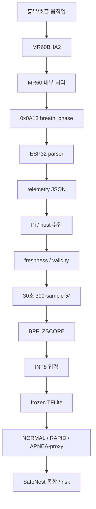
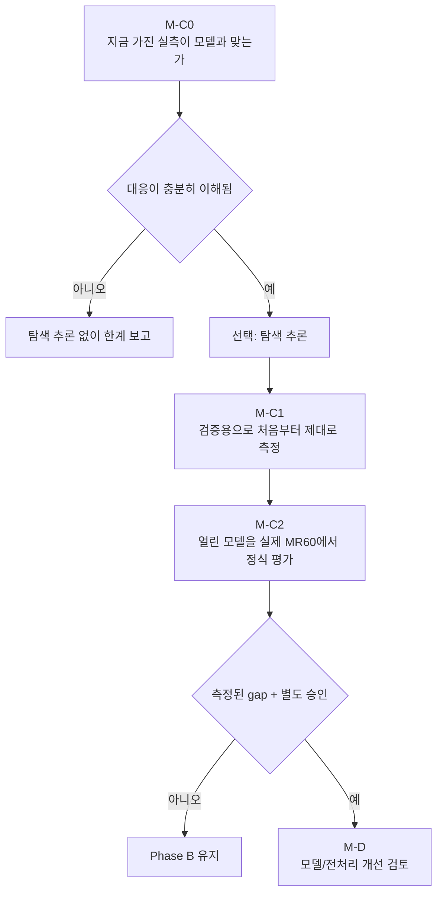

# SafeNest mmWave Technical Handoff

이 문서는 mmWave 트랙을 직접 구현하지 않은 사람이 읽어도, 무엇을 만들었고 왜 만들었으며 지금 어디까지 되고 무엇이 남았는지를 따라갈 수 있게 쓰기 위한 인수인계다. 동시에 다음 엔지니어나 AI agent가 모델 SHA, 라벨 계약, 실측 경계, 다음 단계 금지를 그대로 재현할 수 있는 기술 기준 문서이기도 하다.

이 문서는 모델, 데이터셋, 펌웨어, 전처리, 임계값, 로드맵 본문을 바꾸지 않는다. 새 측정을 하지 않고, standalone M-C0를 실행하지 않으며, 추론이나 재학습도 하지 않는다. 아래에서 `[현재 evidence]`, `[현재 구현]`, `[계획/미검증]`, `[향후 방향]`은 이미 있는 것과 아직 아이디어인 것을 구분하기 위한 표시다.

### 누구에게 어떤 부분을 권하는가

팀장이나 mmWave를 맡지 않은 팀원은 1절부터 8절, 그리고 16절(현재 한 문단)까지 읽으면 된다. 측정 담당은 11절부터 15절을 더 본다. mmWave 담당자와 기술 리뷰어는 전체를 읽고, 뒤쪽 증거 표와 SHA를 기준으로 작업을 이어가면 된다.

작성 시점의 저장소 identity는 다음과 같다. standalone `origin/main`은 `bf6cdd34385f7ec2bebc2f3a58b038775633ea71`이고, 이 핸드오프의 최초 병합은 PR #84, 사람용 1차 개정은 PR #86이다. 팀 저장소 `main`은 `3d86bf2a7a4e527d7aba2dfabcb087201ffeb46e`이다. Team PR #18은 여전히 OPEN draft이며 병합되지 않았고, head는 `62eb0d867cfa02295c9a1d023b813134c434b8eb`, base는 `5947334d3d0f6c6f7d6100c7ea6af219e5b4c5d5`이다. 기존 실측 평가 보고서가 사용한 팀 `main`은 `fdf34b804f35e5868356f0ed6f804a248aa69131`이며, 그 이후 팀 `main`은 ESP32 LCD(PR #12)와 문서 PR #17을 병합했다. PR #18 head에는 2026-08-14 이후 새 커밋이 없다.

---

## 목차

1. [이 문서는 왜 필요한가](#1-이-문서는-왜-필요한가)
2. [5분 만에 이해하는 SafeNest mmWave 트랙](#2-5분-만에-이해하는-safenest-mmwave-트랙)
3. [SafeNest에서 mmWave가 맡는 역할](#3-safenest에서-mmwave가-맡는-역할)
4. [현재 우리가 실제로 만들어 놓은 것](#4-현재-우리가-실제로-만들어-놓은-것)
5. [현재 개발된 모델은 무엇을 판단할 수 있는가](#5-현재-개발된-모델은-무엇을-판단할-수-있는가)
6. [모델은 실제로 어떤 숫자를 입력으로 받는가](#6-모델은-실제로-어떤-숫자를-입력으로-받는가)
7. [한 사람의 데이터가 모델까지 가는 과정](#7-한-사람의-데이터가-모델까지-가는-과정)
8. [현재 어디까지 구현·검증됐는가](#8-현재-어디까지-구현검증됐는가)
9. [Phase A를 왜 했고 무엇이 끝났는가](#9-phase-a를-왜-했고-무엇이-끝났는가)
10. [Phase B를 왜 했고 무엇이 고정됐는가](#10-phase-b를-왜-했고-무엇이-고정됐는가)
11. [offline 평가 결과와 한계](#11-offline-평가-결과와-한계)
12. [왜 이 모델을 지금 유지하는가](#12-왜-이-모델을-지금-유지하는가)
13. [지금 확보한 실제 MR60 데이터](#13-지금-확보한-실제-mr60-데이터)
14. [현재 실측으로 할 수 있는 것과 없는 것](#14-현재-실측으로-할-수-있는-것과-없는-것)
15. [Team PR #18은 무엇인가](#15-team-pr-18은-무엇인가)
16. [620/620 APNEA를 어떻게 해석해야 하는가](#16-620620-apnea를-어떻게-해석해야-하는가)
17. [왜 standalone M-C0가 필요한가](#17-왜-standalone-m-c0가-필요한가)
18. [M-C0 이후 M-C1, M-C2, M-D](#18-m-c0-이후-m-c1-m-c2-m-d)
19. [SafeNest 통합에서 mmWave 결과의 역할](#19-safenest-통합에서-mmwave-결과의-역할)
20. [앞으로 가능한 추가 모델과 기능](#20-앞으로-가능한-추가-모델과-기능)
21. [현재 상태를 한 문장으로 말하면](#21-현재-상태를-한-문장으로-말하면)
22. [다음 담당자가 해야 할 일](#22-다음-담당자가-해야-할-일)
23. [절대로 하면 안 되는 일](#23-절대로-하면-안-되는-일)
24. [용어 빠른 찾아보기](#24-용어-빠른-찾아보기)
25. [핵심 증거·문서 색인](#25-핵심-증거문서-색인)
26. [현재 미해결 한계](#26-현재-미해결-한계)
27. [문서 경계](#27-문서-경계)

---

## 1. 이 문서는 왜 필요한가

mmWave 트랙은 공개 radar 데이터로 호흡 상태 분류 후보를 만들고, 그 후보가 팀이 실제로 쓰는 MR60BHA2 레이더와 같은 종류의 입력을 보는지 확인하는 작업이다. 이 과정에는 학습 데이터 고정, 모델 선정, 팀 실측 해석, 아직 시작하지 않은 실센서 대응 감사가 겹쳐 있다. 구현에 참여하지 않은 사람이 채팅 기록 없이 이 맥락을 복원하려면, 상태 토큰만 나열된 계약서보다 “왜 이 단계가 생겼는가”를 먼저 설명하는 문서가 필요하다.

그래서 이 문서는 먼저 이야기로 설명하고, 그다음에 표와 정확한 경로·SHA를 둔다. 표만 보면 빨라 보이지만, 표는 이미 이해한 내용을 요약하는 용도로 읽어야 한다.

---

## 2. 5분 만에 이해하는 SafeNest mmWave 트랙

SafeNest는 작업자가 오래 앉아 있거나 거의 움직이지 않는 상황에서도, 카메라에 얼굴을 들이대지 않고 호흡과 관련된 미세 움직임 증거를 남기려 한다. 열화상은 사람이나 자세를 보는 데 강하고, CO₂는 실내 공기와 재실 보조 정보에 강하다. mmWave 레이더는 그 둘과 다른 물리량을 본다. 흉부 쪽의 아주 작은 움직임에서 호흡과 관련된 신호를 뽑을 수 있다는 점이 SafeNest가 mmWave를 쓰는 이유다. 그렇다고 mmWave가 병원 진단기이거나, 혼자 모든 위험을 판결하는 센서라는 뜻은 아니다.

현재 우리가 손에 쥐고 있는 것은 두 갈래다. 한쪽에는 실제 사람 기록으로 학습하고 고른 뒤, Raspberry Pi 같은 작은 기기에서 돌리기 쉽게 INT8 TFLite 파일까지 고정한 호흡 상태 분류 후보가 있다. 다른 한쪽에는 팀이 MR60으로 실제로 찍어 둔 JSONL/CSV 실측이 있다. 둘 다 가치가 있다. 다만 두 갈래가 이미 “같은 입력”으로 이어졌다고 말할 수는 없다.

현재 모델은 한 순간의 호흡수 숫자 하나가 아니라, 대략 30초 동안의 호흡 관련 파형을 보고 세 가지 중 어디에 가까운지 고른다. 학습 데이터 기준으로 정상 호흡에 가까우면 NORMAL, 너무 빠르거나 비정상에 가까우면 RAPID_OR_ABNORMAL, 실험적으로 정의한 무호흡 유사 상태에 가까우면 APNEA다. 여기서 APNEA는 임상 수면무호흡 진단이 아니라, 학습할 때 숨 참기 구간을 대리지표로 쓴 클래스다.

팀이 이미 가진 실측은 버릴 데이터가 아니다. 실제 필드가 어떻게 들어오는지, 로그가 얼마나 자주 찍히는지, 값이 오래되면 어떻게 보이는지, 거리나 호흡 지시가 실패하면 무엇이 남는지를 보여 준다. 그 로그로 지금 모델 성적표를 내거나 바로 재학습하면 안 되는 이유는, 정답이 Phase-B 세 클래스와 같지 않고, 로그 한 줄이 항상 새로운 레이더 측정이라고 아직 증명하지 못했기 때문이다.

그래서 다음 공식 단계는 모델을 새로 만드는 일이 아니라, 지금 가진 MR60 데이터가 얼려 둔 모델에 넣어도 되는 데이터인지 확인하는 standalone M-C0다. 이 단계는 아직 시작하지 않았다.

---

## 3. SafeNest에서 mmWave가 맡는 역할

작업 현장에서는 사람이 쓰러지지 않은 채 오래 앉아 있거나, 숨이 얕아지거나, 움직임이 거의 없는 상태가 생길 수 있다. 그런 상태를 카메라나 열화상만으로 모두 설명하기는 어렵다. 열화상은 사람 존재와 자세·열 분포를 보는 데 유리하고, CO₂는 방이 비었는지 공기가 어떻게 변하는지를 보조한다. mmWave는 비접촉으로 흉부 미세 움직임과 호흡 관련 증거를 남기는 쪽에 자리가 있다.

각각의 센서는 잘 보는 것이 다르다. 한 센서에서 애매한 상황을 다른 센서가 보완하는 것이 SafeNest 멀티센서 설계의 의도다. 따라서 mmWave 모델 출력은 SafeNest 전체 위험판정 자체가 아니라, 나중에 다른 센서 근거와 함께 쓸 수 있는 하나의 조각이다. 지금 그 융합을 학습으로 최적화하는 단계는 아니다.

| 센서 | 강점으로 보는 것 | 혼자 맡기면 안 되는 것 |
|---|---|---|
| Thermal | 사람 존재·자세·열 분포 | 호흡수 정밀 진단 |
| CO₂ | 환경 변화·재실 보조 | 개인 호흡 파형 |
| mmWave | 비접촉 흉부 미세 움직임·호흡 관련 증거 | 전체 위험 상태의 단독 판결 |

기술적 근거는 master roadmap `docs/20260810_ChatGPT_SafeNest_Multisensor_Parallel_Execution_Roadmap_01.md`다. 센서별 A/B lock 뒤에 장치 domain 검증(C)이 오고, 측정된 차이만 별도 승인 후 D에서 보완하며, 융합은 I 트랙이다. I-3 fusion 최적화는 M/C/T validation contract가 고정된 뒤에 시작한다. standalone `integrated_node/`에는 mock과 fail-closed wiring이 있지만, 실센서 통합 검증과 learned fusion은 완료가 아니다.

---

## 4. 현재 우리가 실제로 만들어 놓은 것

비담당자가 가장 헷갈리기 쉬운 지점은, 지금 있는 것이 완성 제품인지 실험 코드인지 모델인지 파이프라인인지다. 답은 조합이다.

현재 SafeNest에는 실제 사람 데이터로 학습·선정되고 INT8 TFLite 형태까지 고정된 mmWave 호흡상태 분류 후보 모델이 존재한다. 그와 별도로, 팀이 사용하는 MR60BHA2에서 `breath_phase`를 ESP32 JSON으로 남긴 실제 측정도 존재한다. 수집 도구와 짧은 Pilot도 Team PR #18에 추가되어 있다.

다만 이 모델이 현재 팀이 사용하는 MR60BHA2의 `breath_phase`를 입력으로 받아도, 학습 당시와 같은 의미의 데이터를 보게 되는지는 아직 정식으로 검증되지 않았다. 이 한 문장이 현재 mmWave 트랙의 핵심 경계다. 모델이 없다는 뜻이 아니고, 실센서 파이프가 전혀 없다는 뜻도 아니다. 두 개가 아직 같은 시험지로 이어지지 않았다는 뜻이다.

저장소도 둘이다. 학습과 모델 lock의 권위는 standalone `https://github.com/sheepmeat/test.git`에 있고, 펌웨어와 물리 로그의 권위는 팀 `https://github.com/jinsu1011/safenest-embedded-competition`에 있다. 팀 저장소의 구버전 `ondevice_ai/`는 이 frozen 후보의 검증이 아니다. 팀 폴더 이름이 M-C0여도 standalone M-C0가 끝난 것이 아니다. mmWave 작업 브랜치에 CO₂, Thermal, Integration 변경을 섞지 않는다.

현재 공식 상태 이름은 `REAL_DATA_OFFLINE_CANDIDATE`다. 쉽게 말하면, 실제 사람 데이터로 고른 offline 후보이며 아직 MR60 배포 검증 모델이 아니라는 뜻이다. `REAL_DATA`는 학습·평가 계보가 실제 사람 측정 데이터를 썼다는 뜻이고, `OFFLINE`은 그 평가가 준비된 데이터셋에서 이루어졌지 지금 MR60 배포에서 이루어진 것이 아니라는 뜻이며, `CANDIDATE`는 이후 장치 domain 검증의 기준점으로 고른 대상이라는 뜻이다. 이 이름이 `MR60-VALIDATED PRODUCTION MODEL`을 뜻하지는 않는다.

근거는 `datasets/mmwave/manifests/M-B12_phase_b_offline_final/claim_boundary.json`과 `device_domain_handoff.json`의 `m_c_started: false`다.

---

## 5. 현재 개발된 모델은 무엇을 판단할 수 있는가

이 모델은 사람의 호흡 관련 신호 약 30초 구간을 하나의 입력으로 보고, 그 구간의 패턴이 학습 데이터 기준으로 정상 호흡, 빠르거나 비정상적인 호흡, 또는 실험적으로 정의한 무호흡 유사 상태 가운데 어디에 가장 가까운지를 분류한다. 특정 순간의 “지금 18번 쉰다”를 읽는 계산기가 아니라, 시간이 지나며 파형이 어떤 모양으로 변하는지를 보는 분류기다.

세 클래스의 뜻은 다음과 같다. NORMAL은 학습 당시 독립 참조 센서 기준으로 휴식 상태의 정상 호흡 구간에 가깝다는 뜻이다. RAPID_OR_ABNORMAL은 같은 참조에서 너무 느리거나 너무 빠른 호흡으로 표시된 구간에 가깝다는 뜻이다. APNEA는 병원에서 수면무호흡을 진단한 결과가 아니라, 학습 데이터에서 자발적으로 숨을 참은 구간을 SafeNest가 대리지표로 쓴 클래스다. 대리지표라는 말은, 진짜 임상 사건을 직접 측정하지 않고 그와 비슷한 실험 조건을 정답처럼 사용했다는 뜻이다.

이 모델이 하지 않는 일도 분명하다. 임상적 수면무호흡 진단을 하지 않고, 생사를 판정하지 않으며, 작업자의 전체 위험도를 혼자 확정하지 않는다. 낙상 여부, CO₂ 위험, 사람 존재 여부 전체를 이 모델 하나로 판단하지 않는다. 모델 결과는 SafeNest 전체 판단에서 사용할 수 있는 하나의 센서 근거이지, SafeNest의 최종 위험판정 자체가 아니다.

학습 데이터에서 RAPID라는 정답은 당시 독립적인 Movesense chest accelerometer reference를 기준으로 정의됐다. 따라서 25 bpm이라는 숫자는 Phase-A 학습 데이터의 정답을 구성할 때 사용한 과거의 frozen label contract다. 이것은 향후 MR60의 `breath_rate_raw`가 25 bpm 이상이면 자동으로 RAPID라고 판정한다는 의미가 아니다. 두 숫자가 비슷해 보여도, 한쪽은 학습 데이터 정답을 만들 때 쓴 참조 센서 규칙이고, 다른 쪽은 지금 레이더 칩이 계산한 호흡수이기 때문이다. paced 20 rpm 지시 역시 RAPID_OR_ABNORMAL로 자동 변환되지 않는다.

| index | 이름 | Phase A에서 뜻하는 것 |
|---:|---|---|
| 0 | `NORMAL` | Movesense chest-acc 호흡수가 약 10–25 bpm이고, non-breathing overlap이 없는 휴식 조건 proxy |
| 1 | `RAPID_OR_ABNORMAL` | 같은 참조에서 10 bpm 미만 또는 25 bpm 이상 |
| 2 | `APNEA` | 자발적 breath-hold 창의 SafeNest proxy. 임상 apnea가 아니다 |

근거는 `datasets/mmwave/manifests/a4_label_pilot/label_mapping_profile.json` (`MMWAVE_LABEL_MAPPING_PROFILE_001`)과 `AGENTS.md`다. `AMBIGUOUS` 창은 순수 클래스 학습에서 제외하고, 출처와 전이 분석용으로 남긴다.

---

## 6. 모델은 실제로 어떤 숫자를 입력으로 받는가

AI 모델에 “현재 호흡수 18 bpm”이라는 숫자 하나를 넣는 구조가 아니다. 모델은 명목상 초당 10개씩 약 30초 동안 모은 300개의 연속적인 호흡 관련 값을 하나의 window로 사용한다. 즉 특정 순간의 호흡수보다, 시간이 지나면서 호흡 신호가 어떤 모양으로 변하는지를 본다.

그 300개를 센서에서 나온 그대로 넣지도 않는다. 먼저 호흡과 관련된 주파수 대역을 강조하는 대역통과 필터(BPF)를 적용한다. BPF는 모델이 관심 있는 호흡 주파수, 여기서는 약 0.1–0.5 Hz를 남기고 그 밖의 흔들림을 줄이는 과정이다. 그다음 z-score로 값의 크기 차이를 맞춘다. z-score는 학습할 때 TRAIN 분할에서만 계산한 평균과 표준편차로 숫자를 정규화하는 것이다. VALIDATION이나 시험 데이터를 보고 평균을 다시 계산하면 시험 정보가 학습에 섞일 수 있기 때문에, 이 기준값은 TRAIN에서만 만든다. 마지막으로 INT8로 양자화한다. INT8은 32비트 실수를 8비트 정수로 근사해 Raspberry Pi 같은 edge 기기에서 더 가볍게 돌리기 위한 표현이다. 이렇게 만든 입력이 TFLite 모델로 들어간다. TFLite는 작은 기기에서 쓰는 모델 파일 형식이다.

이 전처리 묶음의 이름은 `BPF_ZSCORE`다. 실행 계약 ID는 `M-B10B_SELECTED_REAL_CANDIDATE_BPF_ZSCORE_V1`이고, 프로파일은 `M-B1_D0_B1_Z1`이다. TRAIN z-score 평균은 `0.0031162832173884064`, 표준편차는 `2.955399434649939`이다. 입력 tensor 모양은 `[1, 300, 1]`, dtype은 int8, scale은 `0.041720833629369736`, zero-point는 `-3`이다. 출력은 `[1, 3]` int8이다. 300개의 숫자를 모양만 `[1,300,1]`로 바꾸는 것으로는 부족하다. 그 300개가 실제로 새로운 위상 관측이어야 하고, 전처리 의미가 Phase B와 같아야 한다.

현장과 학습 사이에는 호흡처럼 보이는 값이 여러 개 있다. 이름이 비슷하다고 같은 입력이 아니다. `breath_phase`는 MR60이 밖으로 내보내는 호흡 관련 phase-like 변화량이다. 확인된 ADC, IQ, range-bin, raw rFFT가 아니며, 정직한 이름은 MR60-exposed phase-like intermediate signal이다. 쉽게 말하면 레이더 칩이 밖으로 내주는 중간 단계 출렁임이지, 칩 안의 가장 원본 녹음이 확인된 것은 아니다. `breath_rate_raw`는 MR60 내부 vendor 알고리즘이 계산한 호흡수다. 팀 코드가 phase를 다시 분석해 만든 호흡수도 있다. 모델이 실제로 먹는 것은 그 어느 스칼라도 아니고, SafeNest 파이프라인이 만든 30초 `BPF_ZSCORE` 파형이다.

이 값들을 섞으면 평가가 무효가 된다. vendor 호흡수가 15 rpm cue에서 약 19에 모여도, 위상 파형의 주기는 15에 가까울 수 있다. 그때 vendor 숫자를 모델 입력처럼 넣으면, 모델이 본 적 없는 종류의 값을 보고 점수를 내게 된다.

| 값 | 사람이 이해하기 쉽게 | 생성 주체 | AI 모델과 관계 |
|---|---|---|---|
| `breath_phase` | 레이더가 노출하는 호흡 관련 phase-like 변화량 | MR60 (`0x0A13`) | 현재 실센서 입력 후보 |
| `breath_rate_raw` | MR60 내부 알고리즘이 계산한 호흡수 | Vendor (`0x0A14`) | 현재 3-class 모델 waveform 입력이 아님 |
| 팀 파생 호흡수 | 팀 코드가 phase를 분석해 계산한 호흡수 | ESP/host | 별도 파생값 |
| `BPF_ZSCORE` 300-sample window | 모델 계약에 맞게 만든 30초 신호 | SafeNest pipeline | 실제 모델 입력 |

Parser 권위는 팀 저장소 `devices/mmwave/firmware/src/main.cpp`다. CSV `resp_phase`는 `breath_phase`를 그대로 두며 스케일, Z-score, 평활, 재샘플을 하지 않는다. schema 1.2는 `breath_rate_raw_trusted: false`를 남긴다.

---

## 7. 한 사람의 데이터가 모델까지 가는 과정

작업자가 MR60 앞에 서 있거나 앉아 있다고 가정하자. 작업자의 호흡으로 흉부가 미세하게 움직이면 MR60 내부 radar processing을 거쳐 phase 관련 정보가 생성된다. 현재 펌웨어는 그중 `breath_phase`를 ESP32에서 해석하여 telemetry JSON으로 내보낸다. telemetry는 센서가 일정 간격으로 내보내는 상태 로그다. Raspberry Pi 쪽에서는 이 값을 시간 순서대로 받아야 하며, 단순히 300줄을 모으는 것이 아니라 각 값이 실제로 새로 들어온 값인지도 확인해야 한다. 충분히 신뢰할 수 있는 30초 구간이 만들어지면 Phase B에서 고정한 BPF와 z-score 전처리를 적용하고, INT8 tensor로 변환해 TFLite 모델에 넣는다. 모델은 세 클래스 중 하나의 출력을 생성한다.

이 결과는 그 자체로 최종 사고 경보가 아니라, 향후 SafeNest 통합 로직에서 다른 센서 결과와 함께 사용할 mmWave evidence가 된다. 지금 이 전체 경로가 한 번에 검증된 것은 아니다. 아래 그림은 목표 흐름이고, 각 화살표의 검증 상태는 다음 절에 적는다.

펌웨어는 radar phase frame마다 JSON을 찍지 않는다. `kTelemetryIntervalMs = 100`마다 마지막에 저장된 `breathPhase`를 다시 쓴다. 값을 새로 고치는 것은 `0x0A13` frame뿐이다. `phase_age_ms`는 그 마지막 갱신이 telemetry 시각 기준으로 얼마나 오래된지를 기록한다.

---

## 8. 현재 어디까지 구현·검증됐는가

이미 시연된 것이 있다. MR60이 ESP32 telemetry JSON을 내보내고, 그 안에 실제 `breath_phase`가 물리적으로 기록되며, offline TFLite 아티팩트가 만들어져 SHA로 고정되어 있다. 다수 세션에서 JSON 줄 속도가 약 10 Hz인 것도 측정되어 있다.

구현은 되어 있으나 처음부터 끝까지 정식 검증되지 않은 것도 있다. 실제 MR60 측정에서 Phase-B와 같은 의미의 300-sample 모델 입력을 만드는 과정이 그것이다. 각 JSON 줄이 새로운 `0x0A13`인지도 여기에 속한다. 상태 이름으로는 `NOT_YET_ESTABLISHED`다. 쉽게 말하면, 아직 같은 종류의 입력인지 확정하지 못했다는 뜻이다.

아직 미래이거나 통합 트랙에 남아 있는 일도 있다. 정식 장치 성능 평가(M-C2), Raspberry Pi 배포 latency 측정, 검증된 멀티센서 risk fusion이 그렇다. 팀 ESP32 LCD 경로(팀 PR #12)는 4센서 수집과 Pi/LCD 전달의 통합 쪽 증거다. 그것을 mmWave Phase-B 입력 대응이나 M-C2로 읽으면 안 된다.

왜 10 Hz가 지금 문제인가. ESP32가 0.1초마다 JSON 한 줄을 보내면 컴퓨터에서는 1초에 약 10줄이 기록된다. 하지만 그 10줄 안의 `breath_phase`가 모두 MR60에서 새롭게 측정된 값이라는 뜻은 아니다. MR60에서 새 phase frame이 오지 않은 동안 ESP32가 마지막 값을 계속 포함해 보낼 수도 있기 때문이다.

예를 들어 10.0초, 10.1초, 10.2초에 phase가 모두 1.23이면 두 가지 해석이 가능하다. 레이더가 새 프레임 세 개를 줬는데 값이 같았을 수도 있고, 레이더가 한 번 주고 로그가 저장된 값을 세 번 찍었을 수도 있다. 모델은 30초 동안 300개의 연속 신호를 기대하므로, JSON이 300줄 있다는 이유만으로 300개의 fresh sensor sample이라고 볼 수 없다. `phase_age_ms`는 마지막 진짜 갱신이 얼마나 오래됐는지를 보여 줘서 반복 출력 쪽을 잡는 데 도움이 된다. 그렇다고 모든 `0x0A13` 도착 시각을 완전 재구성하지는 않는다. 값이 같다고 stale이라고 단정할 수도 없다. 실제 위상이 잠시 비슷할 수도 있다.

약 31분 로그가 이 함정의 직접 예다. 줄 속도는 9.986 Hz인데 `phase_age_ms` 최대는 288,530 ms이고, 30초를 넘는 packet이 2,585개다. 컴퓨터는 계속 줄을 쓰는데, 위상 값은 오래도록 그대로일 수 있다.

| 구성 | 현재 상태 | 최종적으로 원하는 상태 |
|---|---|---|
| MR60 물리 캡처 | 팀 로그·Pilot 있음 | 규약 있는 M-C1 수집 |
| `breath_phase` 기록 | 있음 | freshness를 같이 기록·채점 |
| Phase-B offline 모델 | frozen INT8 | 장치에서 평가된 후보 |
| MR60 → 모델 대응 | 아직 미확정 | 정식 특성화 |
| 실장치 정식 metric | 없음 | M-C2에서 측정 |
| Pi end-to-end | 미측정 | 측정된 runtime |
| 멀티센서 risk | 별도 I 트랙, mock wiring | 검증된 통합 runtime |

줄 속도 측정값의 상세는 평가 보고서 §5.1에 있다. 예: `S001_NORMAL_D06`는 9.994964 Hz다. 상태로는 telemetry/log-row cadence는 검증되었고, fresh `0x0A13` cadence는 아직 부분적이며 확정되지 않았다.

---

## 9. Phase A를 왜 했고 무엇이 끝났는가

Phase A는 모델을 만드는 단계라기보다, “모델이 어떤 데이터를 어떤 정답으로 배우는가”를 믿을 수 있게 만드는 단계였다. 원본이 어디 파일인지, 각 30초 창의 정답이 무엇인지, 한 사람의 기록이 학습과 시험에 동시에 섞이지 않는지를 먼저 고정하지 않으면, 나중에 점수가 좋아 보여도 그 점수를 믿을 수 없다.

원본은 팀 MR60이 아니라 공개 radar recording archive다. 출처 identity, 라벨 계약, 참조 센서, canonical window, 사람 단위 그룹, 불변 TRAIN/VALIDATION/LOCKED_TEST 분할이 여기서 정해졌다. LOCKED_TEST는 모델 고를 때 보지 않기로 한 최종 시험 역할이다. 같은 사람의 데이터가 TRAIN과 TEST에 동시에 들어가면 모델이 호흡 패턴을 일반화한 것이 아니라 그 사람의 특징을 외운 것인데도 성능이 좋아 보일 수 있다. 그래서 subject-wise split을 고정했다.

상태: COMPLETE, `PASS_WITH_WARNINGS`. 근거는 `docs/reports/20260808_Antigravity_A5_Subject_Split_Provenance_01.md`와 `docs/reports/20260808_Antigravity_A6_Full_Conversion_Integrity_Audit_01.md`다. 경로 `datasets/raw_archives/external_datasets/db_records.zip`은 A6/M-B12가 기록한 identity이며, `.gitignore`가 `/datasets/raw_archives/`를 제외하므로 Git-tracked payload가 아니다. SHA-256은 `f0bcfdac94f88b43bb34d3da8e8f071a787291f86c97798059b8dbf4d4be08b0`이다. DOI는 10.5281/zenodo.18599983 v1.1이다.

110명, 각 4 recording, 총 440 recording이다. canonical window는 530개, 각 300 sample이다. 클래스 합계는 NORMAL 149, RAPID_OR_ABNORMAL 119, APNEA 213, AMBIGUOUS 49다. 구조적 split window는 TRAIN 358, VALIDATION 84, LOCKED_TEST 88이고, 순수 클래스 평가 가능은 TRAIN 327, VALIDATION 79, LOCKED_TEST 75다. LOCKED_TEST에서 제외된 AMBIGUOUS/비적격은 13이다. A5 seed는 `20260808`이고 subject 배정은 TRAIN 77, VALIDATION 17, LOCKED_TEST 16이다. 교차 split overlap은 0이다. split 파일은 `datasets/mmwave/splits/mmwave_real_subject_split_v1.json`, SHA-256 `a1996ea00a1d5066eae6d25f022d04137085434d4768e27cbebcdad4e0385baa`이다. canonical npy는 `datasets/mmwave/processed/mmwave_canonical_real_v1.npy`, 모양 `[530, 300]` float64, SHA-256 `c2e2cd1615c7af0f0e21700f291ee12ac0347a9f7fc6ccc9f337433c16868f0e`이다.

---

## 10. Phase B를 왜 했고 무엇이 고정됐는가

Phase B의 목적은 Phase A에서 신뢰성을 확보한 데이터를 이용해 “어떤 전처리와 어떤 모델을 기준 모델로 삼을 것인가”를 결정하는 것이었다. 여러 전처리, 클래스 불균형 전략, 구조, seed, 보정, 양자화를 비교한 뒤 하나를 골랐다.

Phase B에서는 Phase A에서 고정한 실제 데이터셋을 사용하여 여러 전처리와 모델 후보를 비교했고, 그중 하나를 앞으로 실센서 검증의 기준점으로 사용하기 위해 고정했다. 여기서 frozen은 모델이 완벽하다는 뜻이 아니라, 실센서에서 문제가 발견됐을 때 기준 모델까지 동시에 바뀌어 원인 분석이 불가능해지는 것을 막기 위해 더 이상 임의로 수정하지 않는다는 뜻이다. 모델을 얼려 둔 이유는 완벽해서가 아니라, 실제센서 검증을 시작한 뒤 결과가 마음에 들지 않는다고 기준 모델을 계속 바꾸면 무엇이 문제였는지 알 수 없기 때문이다.

따라서 Phase B가 끝났다는 뜻이 MR60 실센서 검증이 끝났다는 뜻은 아니다. 상태 이름은 `REAL_DATA_OFFLINE_CANDIDATE`이며, 배포 완료나 Pi 검증 완료가 아니다.

| Frozen item | 현재 의미 | 왜 함부로 바꾸면 안 되나 |
|---|---|---|
| label semantics | 학습/평가 기준 | 기준을 바꾸면 과거 결과와 비교 불가 |
| subject split | train/val/test 경계 | 데이터 누수 방지 |
| preprocessing | `BPF_ZSCORE` | 실센서 적합성 평가 중 기준 변경 방지 |
| model candidate | 선택된 Phase-B 후보 | domain gap과 모델 변경 효과를 분리 |
| INT8 artifact | 배포 후보 파일 | 실기기 평가 대상을 고정 |

권위 문서는 `docs/reports/20260813_Cursor_M-B11_mmWave_Offline_Candidate_Artifact_Lock_01.md`, `docs/reports/20260813_Cursor_M-B12_mmWave_Phase_B_Offline_Final_Report_01.md`, `datasets/mmwave/manifests/M-B12_phase_b_offline_final/`이다.

선택 경로는 M-B1 `BPF_ZSCORE`, M-B2 unweighted CE, M-B3 `CONV1D_GAP_BASELINE`, M-B4 seed 42(VALIDATION Macro F1 0.663708, seed44는 0.329107), M-B5 `CAL_CLASS_BALANCED_120`, M-B6 strict INT8이다.

아티팩트 권위는 `datasets/mmwave/manifests/M-B12_phase_b_offline_final/locked_candidate_summary.json`과 M-B12 보고서다. 경로는 `models/mmwave/experiments/M-B6_stage_equivalence/M-B3_CONV1D_GAP_BASELINE_seed42_M-B5_CAL_CLASS_BALANCED_120_int8.tflite`이다. SHA-256은 `6dff6aaa72c79d76715d40cf7e32bb1e6cd9b2c2e3ac78eaf2fda737561430c5`이다. 크기는 22,080 bytes, runtime ID는 `M-B3_CONV1D_GAP_BASELINE_seed42_M-B6_STRICT_INT8`이다. 이후 짧은 `6dff6aaa…` 표기는 이 전체 해시와 같은 객체다. 이 SHA를 바꾸거나 파일을 교체하는 것은 이 문서가 허가하지 않는다.

이것은 완료된 비교에서 고른 offline 후보지, 검증된 최종 제품 모델이 아니다.

---

## 11. offline 평가 결과와 한계

숫자는 `datasets/mmwave/manifests/M-B12_phase_b_offline_final/final_evaluation_summary.json`에 있다. 이 숫자는 준비된 데이터셋에서, 이미 한 번 거버넌스 이슈를 겪은 LOCKED_TEST를 제한적으로 재사용해 얻은 결과다. Raspberry Pi나 MR60 실기기 점수가 아니다.

Accuracy 0.56은 대략 맞은 비율이다. 클래스가 고르지 않고 시험이 pristine하지 않으므로, 이 숫자만으로 제품을 논할 수 없다. Macro F1 0.494836은 세 클래스를 균형 있게 맞히는 능력이다. 충분히 높다고 보기는 어렵다. NORMAL recall 0.20은 정상 구간을 많이 놓친다는 뜻이다. RAPID recall 0.421053은 중간이다. APNEA-proxy recall 0.935484는 숨 참기 구간을 잘 잡는 편이다. 그러나 APNEA-proxy 거짓 양성 비율 0.522727은 정상이 아닌 구간을 APNEA로 부르는 경우가 많다는 뜻이다. APNEA를 놓치지 않는 비율이 높은 것은 긍정적으로 보일 수 있지만, 정상 상태까지 APNEA라고 과하게 판단하면 실제 시스템에서는 잦은 오경보로 이어질 수 있다. worst-subject Macro F1 0.095238은 사람마다 편차가 크다는 뜻이라, 한 사람 실측으로 일반화를 주장하면 안 된다. seed42 VALIDATION Macro F1 0.663708과 seed44 0.329107의 차이는 초기값에 민감하다는 잠긴 사실이다. class collapse는 false다. 세 클래스 예측은 나오지만, 잘한다는 뜻은 아니다.

이 모델을 단순히 좋다 나쁘다로 한 줄 평가하지 않는다. 완료된 비교에서 고른 frozen offline 후보이며, 검증된 최종 생산 모델이 아니다.

LOCKED_TEST 거버넌스도 한계의 일부다. 쉽게 말하면 시험지를 한 번 본 뒤에는 그 시험지로 다시 공부하면 안 된다. M-B10B는 구조 window 88개와 평가 가능 75개를 혼동한 pretest 때문에 추론 전에 중단됐다. 이후 제한적 recovery에서 75개를 평가했다. 두 번째 깨끗한 최종 시험이 아니다. 결과 지정은 `REUSED_LOCKED_TEST_AFTER_PREINFERENCE_STRUCTURAL_ABORT`이며 `result_not_pristine = true`, `PRISTINE_LOCKED_TEST = false`다. 근거는 `docs/reports/20260812_Codex_M-B10B_One_Time_Locked_Test_Final_Evaluation_01.md`와 `claim_boundary.json`의 `locked_test_reopen_allowed: false`다. M-C는 이 offline locked test를 다시 열거나 그것으로 튜닝하지 않는다. 장치 domain 평가는 별도의 평가 domain이다. M-B8 Mac/M2 latency와 M-B9 mock runtime은 Pi/실센서가 아니다. 이 한계는 즉시 B-series를 다시 돌리는 결함이 아니며 `scientific_limitations.json`에 잠겨 있다.

---

## 12. 왜 이 모델을 지금 유지하는가

성능 한계도 있고 실센서 대응도 미확정인데 왜 이 모델을 계속 쓰느냐는 질문이 자연스럽다. 현재 frozen model은 최종 제품이라고 선언된 모델이 아니라, 실제센서 domain gap을 측정하기 위한 고정된 기준점이다. domain gap은 학습할 때 쓰인 데이터 세계와 지금 장치·환경 세계가 다르다는 뜻이다.

실센서에서 점수가 나쁘다고 바로 모델을 바꾸면, 센서 데이터가 달라서 문제인지와 모델을 바꿔서 좋아진 것인지를 구분할 수 없게 된다. 그래서 지금은 기준점을 유지한 채 연결고리를 검사한다. 연결이 방어 가능해진 뒤에야, 그리고 장치 평가에서 차이가 측정되고 별도 승인이 있을 때에만 모델이나 전처리 변경을 검토한다.

---

## 13. 지금 확보한 실제 MR60 데이터

모델을 고정한 뒤 다음 질문은 “우리 팀이 실제로 사용하는 MR60에서 얻은 값이 학습 데이터와 같은 방식으로 모델에 들어갈 수 있는가?”였다. 이를 확인하기 위해 팀 저장소에 이미 존재하던 여러 실제 측정 기록을 조사했다. 물리 증거는 데이터셋 두 개가 아니라, 짧은 세션들, 장시간 로그, PR #18 Pilot처럼 묶음이 다르다.

Ground truth는 모델이 맞았는지 틀렸는지를 비교할 수 있는 신뢰 가능한 실제 정답이다. “12 bpm으로 호흡하세요”는 반드시 ground truth가 아니다. 사람에게 12 bpm으로 호흡하라고 지시했더라도 실제 사람이 정확히 그렇게 호흡했다는 보장은 없다. 실패한 12 rpm 파일이 그 예다. 파일명과 메트로놈은 12 rpm인데, 위상으로 다시 보면 약 6.06 rpm이다. 지시와 실제 수행이 달랐다. 따라서 메트로놈 설정값과 실제 생리 상태를 같은 것으로 취급하면 안 된다. 호흡 벨트나 스파이로미터 같은 독립 참조가 있을 때 정답의 신뢰가 올라간다. 현재 팀 MR60 증거에는 그런 독립 호흡 참조가 없다.

짧은 legacy 세션은 거리 조건, paced 호흡, 실패와 약한 조건, 얕은/깊은 호흡을 남겨 두었다는 점에서 유용하다. 성공만 남기면 센서가 언제 깨지는지를 볼 수 없다. 장시간 약 31분 로그는 클래스 정답이 없어도, 값이 오래되거나 멈추거나 빠지는 행동을 보는 데 특히 가치가 있다. PR #18 Pilot은 같은 펌웨어로 새로 찍은 약 180초 캡처와 수집 도구를 더한다. 그것이 대응 문제를 자동으로 해결하지는 않는다.

권위 보고서는 `docs/reports/20260814_SafeNest_mmWave_Existing_Team_MR60_Data_Evaluation_01.md`와 한글 `docs/reports/20260814_SafeNest_mmWave_Team_MR60_Data_Evaluation_KR_01.md`다. 아래 경로는 팀 저장소 기준이다.

짧은 delivery 묶음은 `devices/mmwave/firmware/csv/2026-07-26_han_junwoo_delivery_v2/`다. `S001_NORMAL_D06`와 `D09`는 점유 거리 preferred, `D12`는 거리 한계와 presence drop, `D15`는 lock-loss와 vitals freeze, `S001_BREATH_PACED_12_01`은 실패한 12 rpm(실제 약 6.06 rpm), `12_02`는 유효 12 rpm, `15_03`은 15 rpm, `20_04`와 `20_05`는 얕은/깊은 20 rpm이다. `subject_id`는 exporter가 `S001`로 고정한다. 파일이 여러 개여도 사람이 여러 명이 아니다. intended paced cue는 실제 수행 호흡이 아니고, Phase-B 클래스도 아니다.

유효 12 rpm에서 phase 주기는 12.34, vendor median은 14.0이다. 15 rpm에서는 phase가 15.00 또는 15.01, vendor median은 19.0이다. 20 rpm deep에서 phase는 20.00, vendor median은 23.0이다. “MR60 신호 자체가 원래 약 20 rpm”이라는 문장은 쓰지 않는다. 문서화된 약 19 rpm 행동은 주로 vendor `breath_rate_raw`다. 보편 +N rpm 보정은 없다. D15에서 `distance std ≈ 0`을 반복하지 않는다. distance sample std는 약 2.94 cm이고, phase와 vendor vitals는 freeze다. lock-loss는 맞다.

장시간 로그는 `devices/mmwave/firmware/logs/final/2026-08-01_occupied_d09_v120_31min_attempt02.jsonl`이다. SHA-256은 `7f9e9ac65377c6dc217af92f9dee2401b6162540e2245fce97acf2ed49368a34`이다. firmware 문자열은 `safenest-mr60-esp/1.2.0`, telemetry는 9.986 Hz, 최대 row gap은 103 ms다.

PR #18 Pilot은 `M-C0-PILOT-DESKWORK-001`(책상 작업, 1,799 records)와 `M-C0-PILOT-STATIONARY-001`(정지, 1,799 records)다. ESP `firmware_version`은 `safenest-mr60-esp/1.2.0`, config hash는 `b817e8bfd5e52b18275626f7b6a9bd60098ea4b108428a5aaf63600dbc987834`다. 같은 manifest의 `sensor.sensor_firmware_version`은 `UNKNOWN_NOT_REPORTED`다. 이것은 ESP JSON이 MR60 모듈 vendor firmware 문자열을 넣지 않았다는 세션 메타다. ESP 앱 버전 1.2.0이 없다는 뜻이 아니다. 레거시와 Pilot은 펌웨어 의미가 같아도 캡처 도구와 세션 메타가 다르므로 `PRE_PR18_LEGACY_LOGS`와 `PR18_PILOT_CAPTURE`로 구분한다.

---

## 14. 현재 실측으로 할 수 있는 것과 없는 것

현재 데이터가 부족하다고 해서 쓸모가 없는 것은 아니다. 오히려 현재 단계에서는 모델 점수보다 센서가 어떤 데이터를 실제로 내보내는지, 신호가 얼마나 안정적인지, 어떤 조건에서 깨지는지를 확인하는 데 매우 가치가 있다. 즉 현재 실측은 정식 시험지라기보다, 실제 센서가 모델의 시험지가 될 수 있는지 확인하는 재료에 가깝다.

| 지금 할 수 있음 | 아직 하면 안 됨 |
|---|---|
| 실제 필드가 어떻게 들어오는지 확인 | 정식 Accuracy/F1 계산 |
| cadence와 freshness 분석 | 임상 apnea 검증 |
| freeze와 dropout 분석 | 12/15/20 rpm cue를 정답 label로 사용 |
| Phase-B 신호와 대응 가능성 조사 | 바로 재학습 |
| preprocessing 전후 분포 비교 | 한 명 데이터로 일반화 주장 |
| M-C1 측정 계획 설계 | M-D 자동 시작 |
| 대응이 방어 가능할 때만 탐색 추론 | PR #18 TFLite를 M-C2로 승격 |

이유는 독립 호흡 정답 부족, 식별 가능한 참가자 `S001` 중심, 신호 대응 미확정, fresh-phase 시간 대응 미확정이다.

---

## 15. Team PR #18은 무엇인가

Team PR #18은 새로운 AI 모델을 개발한 작업이 아니다. 기존 MR60 producer semantics를 바꾼 것도 아니다. 실제센서 증거를 더 체계적으로 수집하고 확인하기 위한 도구와 Pilot 데이터를 추가한 작업이다. USB JSON을 그대로 받아 쓰는 캡처 도구, 180초 Pilot 두 개, QA, 세션 manifest, 기존 로그 감사, 그리고 레거시 CSV를 frozen 모델 형식으로 넣어 본 탐색 실행이 들어 있다.

팀 PR 안의 디렉터리나 작업명이 M-C0라고 되어 있다고 해서, standalone canonical M-C0가 완료된 것은 아니다. Team PR #18은 증거를 모으고 도구를 만든 쪽이고, standalone M-C0는 그 증거가 frozen Phase-B 입력과 실제로 대응하는지 독립적으로 감사하는 쪽이다.

작성 시점 URL은 https://github.com/jinsu1011/safenest-embedded-competition/pull/18 이다. 상태는 OPEN draft, 미병합, head `62eb0d867cfa02295c9a1d023b813134c434b8eb`이다. 교정 커밋은 없다. 펌웨어와 `0x0A13`/`0x0A14` parser는 바뀌지 않았다. 신호 의미는 `SIGNAL_SEMANTICS_UNCHANGED`다. 쉽게 말하면 레이더가 내보내는 값의 뜻이 이 PR 때문에 바뀌지 않았다는 뜻이다. 오래된 로그 바이트의 의미도 그대로다. 다만 새 캡처는 버전 태그가 필요하다.

아직 head에 남은 이슈는 QA가 줄 속도와 fresh-phase를 구분하지 않는 점, `existing_evidence_audit.md`가 D15 `distance std=0`을 반복하는 점(standalone는 약 2.94 cm), 620/620 APNEA를 정식 성능처럼 읽히지 않게 해야 하는 점, `.gitignore`의 `*.jsonl`과 force-add된 Pilot raw 및 “gitignore”라는 보고서 문장의 모순이다. 이 이슈가 열려 있어도 오래된 로그의 의미는 바뀌지 않는다.

| Team PR #18 | standalone M-C0 |
|---|---|
| evidence collection/QA | independent correspondence audit |
| new physical Pilot | frozen Phase-B compatibility examination |
| exploratory inference | governed inference only after correspondence |

---

## 16. 620/620 APNEA를 어떻게 해석해야 하는가

팀원이 기존 MR60 데이터를 현재 frozen 모델 형식으로 변환해 시험적으로 넣어본 결과, 620개의 window가 모두 APNEA로 출력됐다. 정상적으로 다양한 호흡 상태가 들어 있었다면 한 클래스에 100% 몰리는 것은 분명 조사할 가치가 있는 이상 현상이다.

하지만 이 실험에서는 MR60의 원래 `breath_phase`가 Phase-B 학습 신호와 정말 같은 의미인지, 10 Hz interpolation이 적절한지, fresh sample이 충분한지 등을 먼저 확인하지 않았다. 따라서 문제가 모델에 있는지, 입력 변환에 있는지, 두 가지가 함께 작용한 것인지 아직 분리할 수 없다. 분류 이름은 `EXPLORATORY_PRE_CORRESPONDENCE_INFERENCE`다. 쉽게 말하면, 모델에 넣어도 되는 입력인지 확정하기 전에 시험 삼아 넣어본 결과이다. 함께 `PIPELINE_CORRESPONDENCE_WARNING`, `DEVICE_DOMAIN_MISMATCH_WARNING`으로 읽는다.

이것이 의미하지 않는 것은 실제 MR60 Accuracy가 0이라는 주장, 모델이 완전히 실패했다는 선언, 사람들이 모두 APNEA였다는 해석, M-C2나 재학습 티켓이다. 보고서는 그래서 Accuracy/F1을 계산하지 않았다. 이 결과는 입력을 먼저 확인하라는 규칙을 지지한다.

흐름은 레거시 CSV, 명목 10 Hz interpolation, `BPF_ZSCORE`, frozen INT8 SHA `6dff6aaa…`, 620개 모두 APNEA다.

---

## 17. 왜 standalone M-C0가 필요한가

앞 절까지의 이야기 때문에 M-C0가 필요하다. M-C0의 목적은 모델 성능 점수를 다시 내는 것이 아니라, 현재 MR60에서 얻는 데이터를 frozen Phase-B 모델에 넣는 과정 자체가 과학적으로 방어 가능한지 확인하는 것이다. 한 줄로 말하면, 지금 MR60에서 얻은 데이터를 기존 frozen AI 모델에 넣어도 되는 데이터인지 먼저 확인하는 단계다.

신호 의미 질문은 이름이 둘 다 호흡 신호라고 해서 실제 의미가 같은지는 확인해야 한다는 것이다. 시간 대응 질문은 모델이 30초 동안 300개의 연속 신호를 기대하므로 JSON이 300줄 있다는 이유만으로 300개의 fresh sample이라고 볼 수 없다는 것이다. 전처리 대응 질문은 같은 `BPF_ZSCORE`를 적용해도 입력 신호의 원래 의미와 크기 분포가 다르면 학습 때와 전혀 다른 숫자가 모델에 들어갈 수 있다는 것이다. interpolation이 모양을 왜곡하는지, INT8이 입력을 깨는지, 620개 APNEA 붕괴가 변환 어느 단계에서 생기는지, 어떤 세션이 비교에 적합한지, 독립 정답이 있는 세션이 있는지도 같이 묻는다.

현재 M-C0, M-C0A, M-C0B는 모두 시작하지 않았다. M-C0B 탐색 추론은 지금은 허가되지 않는다. 하드웨어가 없어서 막힌 단계가 아니다. 기존 로그로 forensic을 할 수 있다. 현재 M-C0를 시작하지 않은 것은 개발이 막혀서가 아니라, 새 Pilot과 QA를 포함한 Team evidence 상태를 먼저 안정화한 뒤 동일한 기준으로 감사를 시작하기 위해서다. Team PR #18은 여전히 draft이고 위 교정이 head에 없다. 독립 PR 리뷰는 M-C0 실행이 아니다. 하드웨어 부재는 M-C1만 `BLOCKED_HARDWARE`로 표시한다.

C0A 결정은 `AUTHORIZED_FOR_EXPLORATORY_INFERENCE` 또는 `BLOCKED_PENDING_SIGNAL_CORRESPONDENCE`다. 쉽게 말하면, 탐색 추론을 해도 될 만큼 입력이 방어 가능한지, 아니면 아직 막아 두어야 하는지다. 예측 없이 한계만 보고 끝나는 것도 성공일 수 있다. 계획된 산출물(`existing_measurement_inventory.json`, `offline_contract_correspondence.json`, `m_c0_summary.json` 등)은 이 문서가 생성하지 않는다.

---

## 18. M-C0 이후 M-C1, M-C2, M-D

이 순서는 임의 번호가 아니라 원인과 결과의 순서다.

M-C0에서 기존 데이터를 분석한 뒤에도 정식 성능 평가에 필요한 ground truth나 조건 통제가 부족하다면, 그때는 처음부터 검증 목적에 맞춰 새 데이터를 수집한다. 그것이 M-C1이다. M-C1에서 충분한 실측을 확보하면 frozen model을 바꾸지 않은 상태에서 실제 MR60 domain 성능을 정식으로 측정한다. 그것이 M-C2다. M-C2에서 실제 domain gap이 확인됐을 때만 별도 승인을 통해 모델·전처리 개선을 검토한다. 그것이 M-D다.

M-C2 결과가 나쁘다고 자동 재학습하는 규칙은 없다. M-D는 자동으로 다음이 아니다.

M-C1은 신규 수집이다. 정식 성능을 말하려면 측정 시점에 기록된 독립 호흡 참조가 필요하다. 나중에 기억으로 정답을 만들어서는 안 된다. 보존할 것은 verbatim JSON, `ts_monotonic_ms`, `seq`, `phase_age_ms`, `breath_phase`, `breath_rate_raw`, firmware/config/capture identity, session/subject, 거리와 자세, intended와 actual, lock/error다. 이 문서가 새 클래스 임계값을 만들지 않는다.

M-C2만 정식 metric이다. PR #18 host invoke가 아니다. 장치에서 행동이 나쁘다는 사실이 Phase B를 고치라는 허가는 아니다.

---

## 19. SafeNest 통합에서 mmWave 결과의 역할

mmWave 모델은 센서 하나짜리 근거를 만든다. 개념적으로는 mmWave 호흡 증거, Thermal의 사람/자세 증거, CO₂의 환경/재실 관련 증거, 그 밖의 runtime 상태가 모여 멀티센서 위험 해석으로 갈 수 있다. 왜 mmWave 모델 하나로 모든 위험을 판단하지 않는가. 각 센서가 잘 보는 물리량이 다르기 때문이다. 한 센서에서 애매한 상황을 다른 센서가 보완하는 것이 설계 의도이다. 이 문서는 현재 risk 임계값을 만들지 않고, 어떤 센서의 성능을 과장하지 않는다.

현재 있는 것은 센서별 offline 후보, 팀 쪽 수집 경로, standalone mock 통합 wiring이다. 의도된 통합은 각 센서 evidence와 freshness/validity를 함께 전달해 risk 로직이 결측을 정상값으로 바꾸지 않게 하는 것이다. 아직 검증되지 않은 것은 learned fusion, Pi에서 mmWave 입력 대응이 끝난 뒤의 end-to-end 위험 판정, 실센서 융합 성능이다.

---

## 20. 앞으로 가능한 추가 모델과 기능

아래는 가능한 향후 방향이다. 현재 허가된 작업이 아니며, 새 증거가 필요하고, 숨은 M-D 계획이 아니다.

호흡수 회귀는 지금처럼 30초 파형을 세 클래스로 나누는 대신, 파형에서 연속 호흡수나 추세를 추정하는 일이다. vendor `breath_rate_raw`를 교차 확인하고 급변을 보는 데 도움이 될 수 있다. 그러려면 독립 호흡 참조가 필요하다.

신호 품질 게이트는 건강상태를 분류하기 전에 현재 radar 신호 자체가 믿을 수 있는지를 판단하는 층이다. 사용 가능, 저진폭, 움직임 오염, stale/frozen, 신뢰할 대상 없음 같은 구분이 예시일 뿐, 승인된 라벨 세트는 아니다. 팀 펌웨어의 진폭 게이트는 힌트일 뿐이다.

시간/사건 탐지는 한 개의 30초 창과, 여러 분에 걸친 상태 변화가 다르다는 점에서 출발한다. 정상에서 비정상으로 바뀐 뒤 오래 회복되지 않는지를 물을 수 있다. 현재 Conv1D는 그런 사건을 학습하지 않았다.

이상 탐지는 낯선 신호를 세 클래스 중 하나로 억지로 넣지 않고, 현재 학습한 범위와 너무 다른 입력이라고 표시하는 방향이다. 높은 확신의 안전 판단 전에 유용할 수 있다. 지금 구현하지 않는다.

멀티센서 융합은 규칙 기반, 점수 결합, 시간 상태기계, 충분한 쌍 데이터가 있을 때의 학습 융합 같은 설계 가능성이 있다. 지금은 고르지 않는다.

---

## 21. 현재 상태를 한 문장으로 말하면

SafeNest mmWave 트랙은 실제 사람 데이터로 학습된 3-class 호흡상태 offline candidate를 INT8 TFLite까지 고정한 상태이며, 팀의 MR60BHA2에서 실제 `breath_phase` 데이터도 확보하고 있다. 다만 이 실센서 신호가 학습 당시 모델 입력과 시간적·의미적으로 충분히 대응하는지는 아직 검증되지 않았기 때문에, 현재 단계의 핵심은 모델을 다시 만드는 것이 아니라 M-C0에서 그 연결고리를 검증하는 것이다.

---

## 22. 다음 담당자가 해야 할 일

팀장과 비담당자는 이 문서의 앞부분과 21절로 현재 경계를 공유하면 된다. mmWave 담당자는 standalone `sheepmeat/test`의 `origin/main`에서 mmWave 전용 브랜치를 만들고, CO₂/Thermal/Integration을 섞지 않는다. INT8 SHA `6dff6aaa72c79d76715d40cf7e32bb1e6cd9b2c2e3ac78eaf2fda737561430c5`가 M-B12 lock과 같은지, 입력이 `[1,300,1]`과 `BPF_ZSCORE`인지, APNEA가 breath-hold proxy인지, LOCKED_TEST를 다시 열지 않는지를 확인한다. 실측을 다룰 때는 `breath_phase`와 `breath_rate_raw`, 줄 속도와 fresh phase, paced cue와 Phase-B 클래스, D15 거리 std 약 2.94 cm와 vitals freeze, 31분 로그의 `phase_age_ms`를 구분한다. Team PR #18은 GitHub에서 draft와 head를 다시 확인하고, standalone M-C0 완료로 복사하지 않으며, 620/620을 M-C2로 쓰지 않고, legacy와 Pilot을 버전 태그로 나눈다. M-C0 실행 권한이 생긴 뒤에만 forensic inventory, telemetry와 fresh와 stale 분리, C0A 결정을 수행한다.

---

## 23. 절대로 하면 안 되는 일

M-C0 동안 재학습하지 않는다. 장치 성능이 나빠 보인다고 frozen Phase-B 후보를 바꾸지 않는다. paced 12/15/20 rpm을 Phase-B NORMAL/RAPID/APNEA에 직접 매핑하지 않는다. `breath_rate_raw`를 AI 파형으로 취급하지 않는다. telemetry 10 Hz를 증명된 fresh phase 10 Hz로 취급하지 않는다. Phase-B LOCKED_TEST를 M-C 작업에 재사용하거나 그것으로 튜닝하지 않는다. CO₂/Thermal/Integration feature 브랜치를 mmWave 작업에 섞지 않는다. 별도 승인 없이 M-D 적응을 쓰지 않는다. Team PR #18을 standalone M-C0 완료로 취급하지 않는다. APNEA-proxy를 임상 apnea로 설명하지 않는다. 해당 측정 없이 MR60이나 Raspberry Pi 검증을 주장하지 않는다. `PRE_PR18_LEGACY_LOGS`와 `PR18_PILOT_CAPTURE`를 조용히 합치지 않는다. 향후 모델 아이디어를 현재 허가된 작업처럼 제시하지 않는다.

---

## 24. 용어 빠른 찾아보기

Phase A는 데이터 출처와 정답과 사람 단위 분할을 고정한 단계다. Phase B는 전처리와 모델 후보를 비교해 하나를 고르고 얼린 단계다. M-C0는 기존 실측이 frozen 모델에 넣어도 되는지 확인하는 단계다. M-C1은 검증용으로 새로 측정하는 단계다. M-C2는 얼린 모델을 실제 MR60에서 정식 평가하는 단계다. M-D는 측정된 차이가 있고 별도 승인이 있을 때만 모델이나 전처리를 검토하는 단계다.

BPF는 특정 주파수 대역을 남기는 필터다. z-score는 TRAIN 평균과 표준편차로 값 범위를 맞추는 정규화다. INT8은 8비트 정수 근사다. TFLite는 edge용 모델 형식이다. ground truth는 믿을 수 있는 정답이다. proxy는 직접 사건 대신 쓰는 대리지표다. cadence는 초당 몇 번 나오는가다. freshness는 값이 얼마나 최근 갱신인지다. correspondence는 실센서 신호가 학습 입력과 같은 뜻인지다. domain gap은 학습 세계와 장치 세계의 차이다. frozen candidate는 지금은 바꾸지 않기로 한 기준 모델이다. LOCKED_TEST는 선택에 쓰지 않는 최종 시험 역할이며, 이미 제한적으로 소비되었다.

raw는 센서가 만든 원본에 가까운 값이다. 확인된 ADC/IQ는 아직 없다. phase-like signal은 호흡에 따라 출렁이는 중간 신호로 `breath_phase`가 해당한다. vendor-derived는 칩 알고리즘이 만든 파생값으로 `breath_rate_raw`가 해당한다. telemetry는 주기적으로 내보내는 로그 줄이다. window는 고정 길이 구간이며 여기선 30초 300 sample이다.

---

## 25. 핵심 증거·문서 색인

이 문서는 로드맵이나 평가 보고서의 대체본이 아니다. 이어서 작업하기 위한 현재 상태 핸드오프다.

| 문서 | 역할 |
|---|---|
| `docs/20260810_ChatGPT_SafeNest_Multisensor_Parallel_Execution_Roadmap_01.md` | master roadmap |
| `docs/20260806_ChatGPT_SafeNest_mmWave_Execution_Sequence_01.md` | mmWave A–E 상세 |
| `docs/MMWAVE_PHASE_B_OVERVIEW.md` | Phase B 개요 |
| `docs/reports/20260814_SafeNest_mmWave_Existing_Team_MR60_Data_Evaluation_01.md` | 기존 실측 기술 평가 |
| `docs/reports/20260814_SafeNest_mmWave_Team_MR60_Data_Evaluation_KR_01.md` | 팀 한글 가이드 |
| `docs/reports/20260813_Cursor_M-B12_mmWave_Phase_B_Offline_Final_Report_01.md` | Phase B 종료 |
| `docs/reports/20260813_Cursor_M-B11_mmWave_Offline_Candidate_Artifact_Lock_01.md` | artifact lock |
| `docs/reports/20260812_Codex_M-B10B_One_Time_Locked_Test_Final_Evaluation_01.md` | LOCKED_TEST incident |
| `docs/reports/20260808_Antigravity_A6_Full_Conversion_Integrity_Audit_01.md` | A6 |
| `docs/reports/20260808_Antigravity_A5_Subject_Split_Provenance_01.md` | A5 |
| `AGENTS.md` | canonical root / proxy apnea / subject split |

machine-readable lock은 `datasets/mmwave/manifests/M-B12_phase_b_offline_final/` 아래 `locked_candidate_summary.json`, `final_evaluation_summary.json`, `claim_boundary.json`, `device_domain_handoff.json`, `scientific_limitations.json`이다. 라벨은 `datasets/mmwave/manifests/a4_label_pilot/label_mapping_profile.json`, split은 `datasets/mmwave/splits/mmwave_real_subject_split_v1.json`이다.

팀 물리 증거는 `devices/mmwave/firmware/src/main.cpp`, `include/mmwave_config.h`, `csv/2026-07-26_han_junwoo_delivery_v2/`, `logs/final/`, 그리고 PR #18 draft의 `devices/mmwave/device_measurements/`다.

---

## 26. 현재 미해결 한계

아직 확정하지 않은 것은 `breath_phase`와 Zenodo canonical phase의 신호-의미 대응, fresh `0x0A13` cadence가 명목 10 Hz인지, 30초 300개의 fresh sample 창, interpolation의 영향, BPF_ZSCORE와 INT8 이후 장치 분포, 620/620 붕괴의 단계별 원인, 독립 호흡 참조가 있는 세션, 다피험자 device-domain 일반화, Raspberry Pi와 ESP 배포 latency, Team PR #18 교정과 병합, Pilot `sensor_firmware_version`이 manifest에 `UNKNOWN_NOT_REPORTED`로 남은 점이다. ESP `firmware_version` `safenest-mr60-esp/1.2.0`과 혼동하지 않는다. 추측으로 채우지 않는다.

읽은 뒤 반드시 구분해야 하는 것은 여덟 가지다. `breath_phase`는 `breath_rate_raw`가 아니다. telemetry 10 Hz는 fresh phase 10 Hz가 아니다. paced cue는 Phase-B 클래스가 아니다. APNEA-proxy는 임상 apnea가 아니다. offline candidate는 MR60/Pi 검증이 아니다. Team PR #18은 standalone M-C0가 아니다. 620/620 APNEA는 M-C2가 아니다. 장치 성능이 나쁘다고 Phase B를 고쳐도 된다는 뜻이 아니다.

---

## 27. 문서 경계

이 개정으로 standalone M-C0 실행, Team PR #18 수정, 새 물리 측정, frozen 모델 추론, 재학습, 전처리 변경, INT8 재교정, 로드맵 본문 재설계, M-C1, M-C2, M-D, LOCKED_TEST 재개방, 향후 모델 아이디어 구현은 시작되지 않았다. 위 작업은 각각 명시적 승인 후에만 진행한다.
