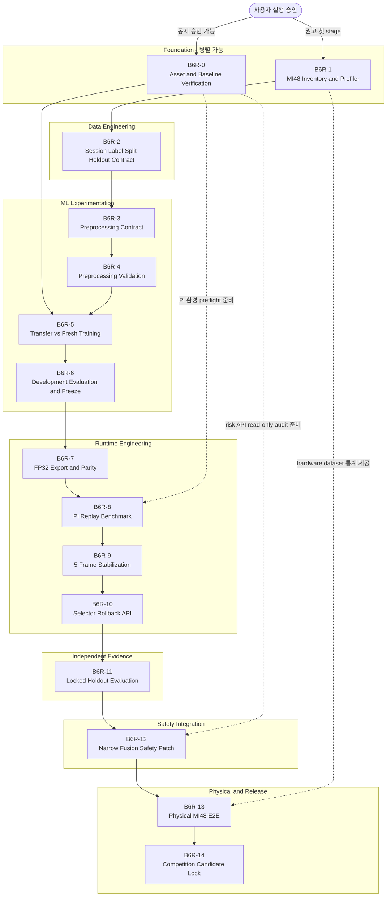

# SafeNest Thermal B6-R robust-relative FP32 병렬 개발 로드맵

문서 상태: **B6R-0~14 설계·승인용 로드맵 + B6R-P2 실행 + B6R-RC0/RC1 실제 capture evidence·보완 계획 + 현재 환경 gate 재조정 반영**

대상 후보: `B6-R robust-relative FP32`

문서 기준 증거 commit: `bc072eb7bb997d9a07aedccefe2f30273bef5648`

작성일: `2026-08-22`

실행 개정일: `2026-08-27` (`B6R-P0~P2` 완료; `B6R-RC0` assessment와 `B6R-RC1` Thermal-90 remediation plan 반영)

> 이 문서는 코드, 모델, 데이터, 임계값 또는 runtime을 구현하거나 변경하지 않는다. 향후 실행은 사용자가 명시적으로 승인한 **한 stage 또는 한 parallel wave**만 수행하고, 검증·증거 요약 후 반드시 멈춘다.

### 2026-08-27 실행 개정 — `B6R-RC1` Thermal-90 capture remediation plan

사용자는 현재 external evidence가 `Desktop/sessions`뿐임을 확인하고 B6R-1보다 먼저 Thermal-90 identity 승인 절차와 다인 capture·unit/orientation/FPS·label·holdout 보완 계획을 명시적으로 승인했다. 이에 정식 B6R-0~14를 대체하지 않는 비게이팅 package `B6R-RC1`을 추가했다.

- Thermal-90을 MI48로 재명명하지 않고 `DISTINCT_TARGET_SENSOR_CANDIDATE`로 관리한다.
- identity 절차는 동결했지만 vendor/part/revision/raw mapping과 owner decision이 없어 실제 승인 상태는 `EVIDENCE_PENDING_OWNER_ACCEPTANCE`다.
- Wave A는 T-C0 operational floor인 독립 subject 3명, subject당 2 session, empty 2 session을 상속하되 통계적 충분성으로 주장하지 않는다.
- unit은 문서+reference measurement, orientation은 known-position marker+mount record, FPS는 counter/device-host clock과 packet accounting으로 검증한다.
- labels는 operator+independent reviewer를 요구하고 `LYING`을 posture proxy로 제한한다.
- locked holdout은 protocol freeze 뒤 새 subject 최소 2명, subject-isolated, custodian 분리, checksum seal/access log, B6R-11 one-time access로 고정한다. 기존 `S000`은 holdout이 될 수 없다.
- machine-readable contract validator와 focused unittest `6/6`가 통과했다. 실제 capture·model/runtime 변경은 수행하지 않았다.

현재 순서는 다음과 같다.

```text
B6R-RC0 pilot review
  → B6R-RC1 plan frozen (현재)
  → identity evidence + Wave A multi-subject capture
  → B6R-RC1 capture evidence review
  → exit criteria 충족 시 B6R-1 새 revision
  → usable inventory일 때만 B6R-2 재검토
```

상세 계약은 `docs/thermal/20260827_SafeNest_Thermal_B6R_RC1_Thermal90_Capture_Remediation_Plan_KO_01.md`, 실행 결과는 `docs/reports/20260827_Codex_Thermal_B6R_RC1_Thermal90_Capture_Remediation_Report_KO_01.md`를 따른다. 본선 판정은 B6R-0 `FAIL`, B6R-1 `INCONCLUSIVE`, B6R-2 `BLOCKED`, B6R-3~14 `NOT_STARTED`를 유지한다.

### 2026-08-26 실행 개정 — public-data 보조 흐름을 추가한 이유

권위 있는 `RP-X0_O2.6_MI48_FIELD_SNAPSHOT`을 현재 저장소·workspace·Git 원격에서 찾지 못해 `B6R-1`은 `INCONCLUSIVE`, `B6R-2`는 `BLOCKED` 상태다. 반면 현재 PC의 `C:\Users\KIMTAEGYUN\Documents\ChatGPT\Thermal_AI\열화상_dataset`에는 public SDT archive 6개가 있고 P0 source registry의 size·SHA-256과 `6/6` 일치한다. 사용자는 physical/MI48 C 계열을 당장 수행하지 않고 public data로 모델을 먼저 만드는 별도 경로를 명시적으로 승인했다.

이에 기존 `B6R-0`~`B6R-14`의 순서·gate·판정을 변경하지 않고 `B6R-P*` 보조 흐름을 추가한다. 이 흐름의 성공은 MI48 gate를 통과시키지 않으며, physical 성능·competition lock·기본 runtime 교체·안전 권한의 근거가 되지 않는다.

```text
MI48 본선: B6R-1 INCONCLUSIVE → B6R-2 BLOCKED → 신규 MI48 근거 필요

public 보조: B6R-P0 dataset materialization/split lock
             → B6R-P1 controlled training
             → B6R-P2 FP32 TFLite export/offline parity
             → offline/shadow-only deployment-format 후보
```

`B6R-P0`에서 실제 수행된 내용은 다음과 같다.

- archive를 압축 해제하거나 수정하지 않고 read-only stream으로 `image_t`와 label만 처리했다.
- 원본 split을 섞지 않고 train `32,000`, validation `8,000`, test `8,000`을 각각 `TRAIN`, `DEVELOPMENT`, `LOCKED_PUBLIC_TEST`로 고정했다.
- `480×640` 16-bit PNG를 PIL bilinear로 `(62,80)`에 resize하고 frame-wise min-max `[0,1]` float32 tensor를 materialize했다.
- 48,000개 모두에 source archive/member, label record, source PNG SHA-256, derived tensor SHA-256을 연결했다.
- 전수 재실행 stream hash 일치와 원본 archive 6개의 처리 전·후 size·mtime·SHA-256 불변을 확인했다.
- test는 materialization·무결성·provenance 확인에만 접근했고 모델 선택·튜닝·metric 계산에는 사용하지 않았다.

앞으로 public-data 모델 작업은 반드시 `B6R-P0`의 dataset/preprocessing/label/split identity를 상속해야 한다. 기존 `thermal_prep.py`처럼 세 split을 병합하거나 `thermal_train.py`처럼 재무작위 분할해서는 안 되며, 기존 legacy model·manifest를 덮어쓰면 안 된다.

### 2026-08-26 실행 개정 — 외부 `Desktop/sessions` 실제 센서 파일럿 evidence 반영

외부 `Desktop/sessions/`에는 `Thermal-90` 센서의 실제 UDP capture 5세션이 있다. raw UDP chunks, 재조립 raw, `62×80` `uint16` native decode, `session.json`, `frames.jsonl`, `annotations.jsonl`, checksum과 validation JSON이 보존되어 있어 “실제 수집 파일이 전혀 없음”이라는 판단은 갱신한다. 그러나 이 자료는 B6R 본선용 권위 MI48 snapshot으로 승격되지 않았다.

- 모든 세션의 `subject_id`는 `S000` 하나다.
- labels는 operator-declared static `EMPTY`, `STANDING`, `SITTING`, `LYING` posture proxy이며 fall event/독립 ground truth가 아니다.
- `S000_004`는 `129/130`, `S000_013`은 `174/175` frame이 구조 검증에 제한적으로 성공했다.
- `S000_011`, `S000_012`, `S000_014`는 packet/counter gap으로 각각 `171/810`, `173/1882`, `173/787`만 유효하고 `CAPTURE_INVALID`다.
- `raw_unit_claim`, unit verification, orientation은 미검증이고 FPS는 `CONFIGURED_ONLY`다.
- 모든 validation JSON은 `model_use_eligibility=NOT_AUTHORIZED_BY_CAPTURE_VALIDATOR`, `locked_test_status=NOT_LOCKED_TEST`, `split_frozen_at=null`이다.

이 결과를 문서상 비게이팅 `B6R-RC0 — Real-Capture Pilot Evidence Review`로 기록한다. `B6R-RC0`은 B6R-1/2를 대체하지 않으며, 이 폴더만으로 학습·final holdout·실제 낙상·MI48 physical 성능·Pi runtime을 주장할 수 없다. 현재 본선 상태는 `B6R-1=INCONCLUSIVE`, `B6R-2=BLOCKED`, `B6R-3~14=NOT_STARTED`를 유지한다.

```text
Desktop sessions evidence
  → B6R-RC0 (non-gating, recorded)
  → sensor identity/unit/quality 보완 및 다인 재수집 또는 권위 MI48 payload 확보
  → B6R-1 MI48 inventory (새 evidence가 있을 때만)
  → B6R-2 group split/holdout
  → B6R-3 이후
```

현재 자료로 다음 에이전트가 바로 실행할 수 있는 것은 read-only capture-contract remediation/acquisition plan 작성뿐이다. B6R-2 이후 학습이나 holdout을 자동 실행하지 않는다. 자세한 수치와 판정은 `docs/reports/20260826_Codex_Thermal_B6R_Desktop_Sessions_Real_Capture_Pilot_Gate_Assessment_Report_KO_01.md`를 기준으로 한다.

### 2026-08-26 실행 개정 — 현재 validation capability와 B6R-0 blocker 재조정

이번 `CURRENT_STATE_AND_GATE_RECONCILIATION`에서 historical B6R-0 실행 당시 환경과 현재 active checkout의 실행 환경이 달라진 사실을 확인했다.

- 이전 가정: B6R-0 당시 environment evidence는 TensorFlow, `ai_edge_litert`, `tflite_runtime`이 없어 desktop model load/parity를 검증할 수 없다고 기록했다.
- 새 evidence: 현재 저장소 `.venv`에는 Python `3.12.13`, NumPy `2.5.2`, TensorFlow `2.20.0`, Pillow `12.3.0`이 있다. 이 환경에서 B6R-P2 validator `16/16` checks와 focused unittest `5/5`를 재실행해 통과했다.
- 여전히 미충족: `ai_edge_litert`, `tflite_runtime`, `pytest`, Raspberry Pi evidence, B5 exact checkpoint/FP32/FULL INT8 bytes, 권위 MI48 snapshot과 group/holdout evidence.
- 해석: desktop TensorFlow validation capability는 보완되었지만 historical B6R-0 `FAIL`은 소급 변경하지 않는다. B5 asset identity, LiteRT/Pi capability와 hardware measurement, MI48 data gate는 별도 조건이다.
- 영향: B6R-0 blocker 문구와 current index를 정교화했지만 B6R-1 `INCONCLUSIVE`, B6R-2 `BLOCKED`, B6R-3 이후 `NOT_STARTED`, RC0 non-gating, P0/P1/P2 claim boundary는 변경하지 않았다. 새 `B6R-P3`도 정의하거나 실행하지 않았다.

이 개정은 환경 capability drift를 기록하기 위한 문서 변경이며 model, runtime, dataset, split, holdout을 변경하지 않는다. 상세 근거는 `docs/reports/20260826_Codex_Thermal_B6R_CURRENT_STATE_AND_GATE_RECONCILIATION_Report_KO_01.md`를 따른다.

### 현재 작업 PC의 Thermal 데이터 위치 (사람용 참고)

아래 절대 경로는 현재 PC에서 다음 에이전트가 source와 derived payload를 찾을 때만 사용한다. JSON contract·manifest에는 portability를 위해 절대 경로를 기록하지 않고 `WORKSPACE_THERMAL_DATASET_ARCHIVES`와 저장소 상대 경로를 사용한다.

| 역할 | 현재 PC 위치 | 역할·주의 |
|---|---|---|
| 실제 센서 capture | `C:\Users\KIMTAEGYUN\Desktop\sessions` | `Thermal-90` 5세션 pilot; B6R-RC0 non-gating evidence, 학습·holdout 금지 |
| public SDT source | `C:\Users\KIMTAEGYUN\Documents\ChatGPT\Thermal_AI\열화상_dataset` | `test.zip`, `train.zip.001~.004`, `validation.zip`; 6개 size/SHA registry 일치 |
| active B6R checkout | `C:\Users\KIM TAEGYUN\Documents\ChatGPT\Thermal_AI\test` | 현재 `feature/thermal-b6r-development` 작업 root |
| P0 local materialized payload | `<active B6R checkout>\datasets\thermal\materialized\B6R-P0_public_sdt_v1` | 48,000개 derived float32; local-only/ignored, source archive가 아님 |
| P0 tracked evidence | `<active B6R checkout>\datasets\thermal\manifests\B6R-P0_public_sdt_materialization` | split·provenance·source immutability·validation evidence |
| P0 contract | `<active B6R checkout>\config\thermal\b6r_p0_public_sdt_contract.json` | archive names/hash, split role, `PUBLIC_SDT_ONLY_NOT_MI48` 경계 |

현재 Codex 환경에서는 사용자 profile 표기가 `KIMTAEGYUN`과 `KIM TAEGYUN` 두 형태로 노출된다. 위 source/capture 경로의 space 표기 variant도 `Test-Path`로 확인되므로, 다음 agent는 문자열을 추측해 바꾸지 말고 현재 process에서 존재하는 경로를 사용한다.

`열화상_dataset`은 P0/P1/P2의 public SDT source이고 `sessions`는 별도의 실제 `Thermal-90` capture pilot이다. 두 폴더를 합치거나 어느 하나를 MI48로 재명명하지 않는다. 경로가 없는 환경에서는 추측하지 말고 path existence와 source hash를 먼저 확인한다.

## A. Executive Roadmap

### A.1 목표와 현재 출발점

B6-R의 목표는 가장 복잡한 AI를 만드는 것이 아니다. 목표는 검증된 MI48 근거를 사용하여 재현 가능하고 rollback할 수 있으며 Raspberry Pi에서 안정적으로 동작하는 **thermal posture-support classifier**를 만드는 것이다.

현재 출발점에는 서로 다른 두 계보가 있다.

```text
Offline B-stage
P1 TRAIN-global z-score
→ SMALL_CNN_BASELINE_V1
→ Keras FLOAT / FP32 TFLite / FULL INT8
→ B5 offline-only candidate lock

현재 Raspberry Pi runtime
[0,1] 기대 또는 frame-wise min-max
→ legacy thermal_fall_int8_v0.1.0.tflite 계열
```

두 계보를 같다고 간주하면 안 된다. B6-R은 새 preprocessing identity, 새 model identity, 새 manifest, 명시적 model selector와 rollback 경로를 사용하여 두 계보를 안전하게 연결한다. 역사적 B1~B5 산출물과 legacy model은 읽기 전용 증거 및 rollback 기준으로 보존한다.

출력 의미는 다음처럼 고정한다.

| Runtime label | 의미 | 금지되는 주장 |
|---|---|---|
| `NOT_HUMAN` | 사람 열 패턴이 관찰되지 않음 | 센서 입력이 유효하지 않은 상태를 이 class로 대체 |
| `HUMAN_NORMAL` | 비-lying 사람 자세 proxy | 사람의 안전이 확인됨 |
| `HUMAN_FALL_PROXY` | lying / fall-suspected posture proxy | 실제 낙상 사건 검출, 인증된 낙상 판정 |
| `INPUT_UNAVAILABLE` 또는 동등 fail-closed 상태 | frame을 신뢰하여 추론할 수 없음 | `NOT_HUMAN`으로 묵시적 변환 |

### A.2 전체 개발 흐름

1. **기준 자산과 실제 데이터를 각각 확인한다.** B5 checkpoint와 binary의 hash·경로를 확인하는 작업은 MI48 snapshot inventory와 독립적이므로 병렬 수행할 수 있다. 데이터 inventory가 먼저 필요한 이유는 p2/p98, thermal span, sentinel, dead-pixel 정책을 추측으로 정할 수 없기 때문이다.
2. **session·label·split 계약을 동결한다.** subject가 있으면 subject-level, 없으면 session-level로 분리하며 adjacent-frame random split을 금지한다. `REAL_EVAL_DEVELOPMENT`는 이미 개발에 사용되었으므로 최종 holdout이 아니다.
3. **robust-relative preprocessing을 데이터 근거로 정의한다.** 시작 가설은 p2/p98 clipping 후 상대 `[0,1]` 정규화지만, percentile·최소 span·이상 pixel 처리 기준은 TRAIN/DEVELOPMENT 통계로 비교한 뒤 별도 identity로 동결한다.
4. **동일 architecture로 공정하게 학습한다.** `SMALL_CNN_BASELINE_V1`을 유지하고 B5 initialization fine-tuning과 fresh initialization을 같은 데이터·seed·학습 예산으로 비교한다. checkpoint가 없으면 fresh arm만으로 진행할 수 있으나 그 제한을 기록한다.
5. **개발 평가로 frame candidate를 고정한다.** group-isolated DEVELOPMENT/VALIDATION만 사용하여 후보와 임계값을 선택한다. 최종 독립 holdout은 이때 열지 않는다.
6. **FP32 TFLite와 runtime을 검증한다.** Keras↔FP32 TFLite parity, Raspberry Pi replay latency·메모리·안정성, 5-frame stabilization, model selector·rollback·telemetry 순으로 검증한다. Pi p95 `<= 20 ms`는 provisional target이며 실측 전 보장값이 아니다.
7. **최종 pipeline을 동결한 뒤 독립 holdout을 한 번만 평가한다.** preprocessing, model, class map, temporal rule, threshold가 모두 고정된 뒤에만 holdout을 개방한다. 표본이 부족하면 결과는 `INCONCLUSIVE`로 보고한다.
8. **안전 통합은 좁게 수행한다.** 검증된 B6-R 출력은 supporting evidence로 취급한다. thermal-only `HUMAN_FALL_PROXY`가 strongest danger를 단독 발생시키는 경로가 확인되면 mmWave presence/motion 및 temporal/risk rule을 요구하는 최소 patch만 수행한다.
9. **physical MI48와 전체 system을 분리 검증하고 candidate를 잠근다.** offline replay, Pi replay, physical sensor-to-runtime, full risk-engine validation을 서로 다른 증거 수준으로 기록한다. 모든 hash·rollback·미검증 항목이 명시된 경우에만 competition candidate를 lock한다.

### A.3 병렬화 원칙

병렬화는 stage gate를 없애는 것이 아니라 독립적인 대기 시간을 겹치는 방법이다.

- 같은 원시 데이터를 쓰더라도 **read-only inventory package**는 schema, pixel statistics, metadata discovery로 나누어 병렬 실행할 수 있다.
- B5 asset recovery와 MI48 inventory는 서로의 결과를 바꾸지 않으므로 병렬 가능하다.
- 같은 frozen dataset contract 아래에서 transfer arm, fresh arm, seed별 training은 병렬 가능하다.
- Pi environment preflight와 safety API read-only audit은 ML training을 기다리지 않고 준비할 수 있지만, 실제 model benchmark나 safety patch는 frozen B6-R artifact를 기다려야 한다.
- 서로 다른 작업흐름은 별도 branch/PR과 산출물 경로를 사용한다. 병렬 결과는 공통 merge gate에서 hash, contract, test evidence를 대조한 뒤에만 결합한다.
- 사용자가 한 stage만 지시하면 그 stage만 실행한다. 여러 stage를 병렬 실행하려면 사용자가 정확한 **parallel wave 범위**를 새로 승인해야 한다.

## B. Stage Map

| Stage | 목적 | 핵심 질문 | 선행 조건 | 주요 산출물 | 다음 단계 진입 조건 |
|---|---|---|---|---|---|
| `B6R-0` Asset & Baseline Verification | B5 자산, 역사적 hash, 실제 runtime lineage, 실행 환경을 확인 | B5 FLOAT checkpoint가 존재하며 identity가 맞는가? 현재 Pi는 정확히 무엇을 실행하는가? | 깨끗한 stage branch, B1~B5 read-only 원칙 | `B6R-0_asset_baseline_verification`, hash registry, lineage map, environment capability report | 확인된 자산만 usable로 분류; 불명확한 자산은 격리; fresh path 가능 여부 기록 |
| `B6R-1` MI48 Snapshot Inventory & Abnormal-Pixel Profiler | 실제 snapshot의 schema·규모·품질을 추측 없이 파악 | readable/corrupt 수, key, dtype, shape, frame 수, p2/p98/span, extreme·반복 좌표 후보는 무엇인가? | read-only snapshot 경로, 최소 Python/numpy | `B6R-1_mi48_inventory`, file/frame inventory, anomaly-candidate profile, exception registry, checksums | schema family와 데이터 가용성 판정 가능; corrupt/unknown이 모두 계수됨 |
| `B6R-2` Session / Label / Split / Holdout Contract | 누수 없는 학습·평가 역할을 고정 | subject/session/label을 신뢰할 수 있는가? 독립 holdout을 만들 수 있는가? | `B6R-1` 결과 | `B6R-2_dataset_contract`, provenance map, group split, contamination report, holdout seal | group isolation 검증 PASS; holdout이 tuning 경로에서 봉인됨; 부족 시 acquisition plan 승인 |
| `B6R-3` Robust-Relative Preprocessing Contract | B6-R 입력 변환과 invalid semantics를 명시 | 어느 percentile·span·pixel 정책이 sensor offset과 extreme pixel에 강건한가? | `B6R-1`, `B6R-2`; TRAIN/DEVELOPMENT 역할 고정 | `B6R-3_preprocessing_contract`, candidate matrix, reference vectors, 새 preprocessing ID | 모든 parameter가 TRAIN/DEVELOPMENT 근거로 결정되고 holdout 미사용 확인 |
| `B6R-4` Preprocessing Offline Validation | 새 preprocessing이 domain gap과 입력 안정성을 실제로 개선하는지 검증 | P0/P1/legacy P2 대비 robust-relative가 정보 보존·분포 정렬·downstream 개발 성능을 개선하는가? | `B6R-3` 구현·reference vectors, group split | `B6R-4_preprocessing_validation`, ablation, slice report, parity fixtures | 개선 또는 명확한 trade-off 증거; failure semantics와 parity PASS |
| `B6R-5` Controlled Training / Transfer Diagnostic | 동일 architecture에서 transfer와 fresh를 공정 비교 | P1에서 학습된 B5 feature가 robust-relative 입력에도 유용한가? | `B6R-0`, `B6R-4`; training env 명시 | `B6R-5_training_runs`, A/B run manifests, seed 결과, checkpoints, checksums | 최소 seed 정책 충족; 동일 데이터·architecture·budget 검증; run 재현 가능 |
| `B6R-6` Development Evaluation & Frame Candidate Freeze | 최종 holdout 없이 frame candidate를 선택 | transfer/fresh 중 어떤 후보가 group-isolated DEVELOPMENT에서 더 안정적인가? | `B6R-5` | `B6R-6_development_eval`, error slices, selection decision, frozen frame contract | 후보·class map·threshold·preprocessing checksum 동결; holdout 미접근 확인 |
| `B6R-7` FP32 Export & Offline Parity | 첫 배포 artifact를 FP32 TFLite로 만들고 수치 동등성 확인 | Keras와 FP32 TFLite가 같은 입력에서 허용 오차 내 같은 판단을 하는가? | `B6R-6` frozen candidate | `B6R-7_fp32_export`, `.tflite`, tensor metadata, parity report, hashes | Keras↔TFLite parity gate PASS; artifact identity 명확 |
| `B6R-8` Raspberry Pi Replay Benchmark | 실제 Pi에서 latency·memory·안정성을 측정 | FP32 p95가 thermal frame rate에 충분하고 30분 replay가 안정적인가? | `B6R-7`; Pi와 runtime dependency 준비 | `B6R-8_pi_replay_benchmark`, latency distribution, resource/health log | crash 없음; memory growth 해석 가능; latency gate 판정 |
| `B6R-9` 5-Frame Temporal Stabilization | frame jitter를 줄이는 최소 시간 규칙을 개발 데이터로 선택 | 5-frame rule이 recall을 과도하게 낮추지 않고 switching을 줄이는가? | `B6R-6`; ordered DEVELOPMENT sessions; `B6R-8` timing budget | `B6R-9_temporal_stabilization`, rule config, sequence replay report | temporal parameter 동결; stable-session switching target 판정; holdout 미사용 |
| `B6R-10` Model Selector / Rollback / Thermal API Integration | B6-R을 legacy runtime과 명시적으로 공존시키고 fail-closed telemetry 제공 | 새 후보를 선택·비활성화·rollback할 수 있으며 invalid input이 보존되는가? | `B6R-7`, `B6R-8`, `B6R-9` | `B6R-10_runtime_integration`, selector config, rollback procedure, API/telemetry contract | deterministic replay PASS; rollback PASS; `INPUT_UNAVAILABLE` propagation PASS |
| `B6R-11` Independent Holdout Evaluation | 완전히 동결된 classifier+temporal pipeline을 한 번 평가 | 독립 MI48 holdout에서 HUMAN, empty, FALL_PROXY 성능이 충분한가? | `B6R-10`; holdout seal intact; 평가 계획 preregistered | `B6R-11_holdout_eval`, confusion matrix, group CI, slice results, access log | PASS/PASS_WITH_LIMITATIONS 또는 `INCONCLUSIVE` 판정; tuning 재개 시 새 holdout 필요 |
| `B6R-12` Sensor-Fusion Safety Narrow Patch | thermal-only emergency authority를 필요한 만큼만 제한 | 현재 risk path가 `HUMAN_FALL_PROXY` 하나로 strongest danger를 만들 수 있는가? | `B6R-11` usable 판정; read-only risk/API audit | `B6R-12_safety_integration`, narrow patch, fusion truth table, regression evidence | thermal supporting-evidence 원칙, mmWave/temporal 조건, fail-closed 회귀 검증 PASS |
| `B6R-13` Physical MI48 End-to-End Validation | physical sensor, Pi, B6-R, temporal, risk 경계를 실제로 검증 | raw capture부터 telemetry/risk까지 장시간 안정적이며 fault injection에 안전한가? | Thermal44 backend usable; `B6R-10`~`B6R-12` | `B6R-13_physical_e2e`, session manifests, latency/health logs, fault results | scenario accounting 완료; crash/memory/fail-closed gate 판정; hardware 미검증 없음 또는 제한 명시 |
| `B6R-14` Competition Candidate Lock | 재현·rollback 가능한 최종 후보를 고정 | 모든 artifact와 증거가 하나의 release identity로 연결되는가? | `B6R-11`~`B6R-13` 승인 결과 | `B6R-14_candidate_lock`, release manifest, checksums, rollback bundle, limitations | 모든 필수 gate PASS 또는 승인된 제한; legacy rollback 보존; owner 승인 |

### B.0 Real-capture evidence and remediation packages (non-gating)

`B6R-RC0`은 외부 실제 capture 폴더의 구조·무결성·provenance·B6R gate 영향을 정리하는 evidence package다. 정식 B6R-0~14 stage 번호와 선행 조건을 바꾸지 않는다.

| Package | 상태 | 목적 | 현재 결과 | 다음 진입 조건 |
|---|---|---|---|---|
| `B6R-RC0` Real-Capture Pilot Evidence Review | `INCONCLUSIVE / NON-GATING` | 실제 세션의 raw/native/annotation/quality와 B6R 적합성을 read-only로 판단 | 5 sessions, all `S000`, 약 820 validator-valid frame; 3 sessions invalid; Thermal-90 identity·unit·orientation·holdout 미충족 | owner가 Thermal-90/MI48 관계를 승인하고 보완된 다인 capture 또는 권위 MI48 payload를 제공할 때 B6R-1 재판정 |
| `B6R-RC1` Thermal-90 Capture Remediation Plan | `PASS_WITH_LIMITATIONS / NON-GATING` | identity 승인 evidence와 다인 capture·unit/orientation/FPS·label·holdout 통제를 동결 | plan/contract/validator 동결, focused unittest `6/6`와 validator PASS; identity evidence와 실제 capture는 미완료 | identity owner decision과 Wave A capture를 검증하고 RC1 exit criteria를 모두 충족한 뒤 B6R-1 새 revision |

**금지:** `B6R-RC0/RC1` 결과로 B6R-2 split을 만들거나, model training/locked test 평가/실제 낙상/physical MI48 성능을 주장하거나, raw를 저장소에 복사하지 않는다.

### B.1 Public-data 전용 보조 Stage Map

아래 stage는 본선 `B6R-0`~`B6R-14`의 번호, 선행 조건 또는 gate를 대체하지 않는다.

| Stage | 상태 | 목적 | 선행 조건 | 주요 산출물 | 다음 단계 진입 조건 |
|---|---|---|---|---|---|
| `B6R-P0` Public SDT Dataset Materialization & Split Contract | `PASS_WITH_LIMITATIONS` | 공개 SDT thermal frame을 재현 가능한 학습 입력으로 만들고 source split 역할을 잠금 | archive 6개 read-only 접근, 승인된 public-data 보조 흐름 | `PUBLIC_SDT_48000_THERMAL_ONLY_V1`, split별 NPY/provenance, contract, source/determinism audit | validator 통과; test tuning 금지; public-only claim boundary 고정 |
| `B6R-P1` Public SDT Controlled Training | `PASS_WITH_LIMITATIONS` | P0의 TRAIN/DEVELOPMENT만으로 별도 실험 모델을 학습하고 후보 identity를 생성 | 사용자의 2026-08-26 별도 승인, P0 exact contract/checksum | `thermal_public_sdt_pooled_mlp_v1` NumPy model, metadata, run/history/validation manifest | development-only 결과와 limitation 기록; test·MI48 미사용; default activation `false`; TFLite/Pi는 새 stage |
| `B6R-P2` Public SDT FP32 TFLite Export & Offline Parity | `PASS` | P1 NumPy 후보의 identity와 parameter를 그대로 FP32 TFLite로 변환하고 DEVELOPMENT에서 NumPy↔TensorFlow↔TFLite 구현 동등성을 검증 | P1 `PASS_WITH_LIMITATIONS`, exact model/metadata hash, TensorFlow/TFLite export capability, DEVELOPMENT fixture | 별도 FP32 `.tflite`, export/tensor/parity/determinism/locked-test/legacy audit manifest, validator와 보고서 | 사전 tolerance 내 3단계 parity, argmax 100%, locked test read 0, legacy/default/runtime 불변, shadow-only 경계 확인 |

#### `B6R-P0` — Public SDT Dataset Materialization & Split Contract

- **Entry Conditions:** source archive 6개가 registry checksum과 일치하고 read-only로 접근 가능하며, public-data 보조 흐름이 사용자에게 승인됨.
- **Tasks:** multipart ZIP stream 처리, `image_t`·label 정렬, source split 보존, `(62,80)` resize와 normalization identity 동결, sample-level provenance 생성.
- **Artifacts:** `config/thermal/b6r_p0_public_sdt_contract.json`, `datasets/thermal/manifests/B6R-P0_public_sdt_materialization/`, local-only `datasets/thermal/materialized/B6R-P0_public_sdt_v1/`.
- **Validation:** 48,000 sample 전수 accounting, tensor↔provenance hash 1:1, split sample ID 비중복, deterministic 전수 재실행, source 전후 불변, machine artifact 절대경로 미포함.
- **Exit Criteria:** public-data materialization validator `PASS_WITH_LIMITATIONS`; test role이 `LOCKED_PUBLIC_TEST`; `PUBLIC_SDT_ONLY_NOT_MI48` claim boundary가 명시됨.
- **STOP Condition:** archive hash 변경, source/target label 불일치, random resplit, test tuning/selection 사용, MI48/physical/safety 성능으로의 승격.

#### `B6R-P1` — Public SDT Controlled Training

- **Entry Conditions:** 사용자가 2026-08-26 이 stage를 별도로 승인했고 exact P0 contract/checksum이 일치한다.
- **Required Inheritance:** train만 parameter fitting, validation만 개발 선택, test 접근 금지. `PUBLIC_SDT_BILINEAR_62X80_FRAME_MINMAX_V1`과 `SDT_POSTURE_TO_SAFENEST_3CLASS_PROXY_V1`을 변경하려면 새 public-data preprocessing stage가 필요하다.
- **2026-08-26 Result:** TensorFlow/PyTorch가 없는 환경에서 NumPy-only `PUBLIC_SDT_ADAPTIVE_POOL_MLP_V1`을 학습했다. adaptive mean pool `(8,10)` → 32-unit ReLU → 3-class softmax, parameter `2,691`, best epoch `40`, DEVELOPMENT accuracy `0.9070`, macro-F1 `0.9013`이다. seed `42`로 두 번 학습한 weight/history가 일치했고 test read count는 `0`이다.
- **Deployment Boundary:** 새 model ID와 artifact 경로를 사용하고 legacy model·`models/model_manifest.json` default를 덮어쓰지 않는다. 생성 후보는 offline/shadow-only이며 `default_activation=false`, `safety_authority=false`다. TFLite export, Pi benchmark, runtime selector 변경은 이 stage의 결과가 아니다.
- **STOP Condition:** 기존 `thermal_train.py`의 combined random split 또는 legacy model overwrite 경로 사용, test metric으로 epoch/threshold/model 선택, MI48·실제 낙상·physical 검증 주장.

#### `B6R-P2` — Public SDT FP32 TFLite Export & Offline Parity

- **Status:** `PASS` — 2026-08-26 실제 FP32 TFLite export, interpreter load, 3단계 parity 및 독립 validator가 통과했다.
- **Purpose:** P1의 NumPy-only public-SDT candidate를 다시 학습하거나 architecture를 바꾸지 않고 기능적으로 동일한 TensorFlow/Keras graph로 재구성하고, 별도 FP32 TFLite deployment-format artifact를 만든 뒤 offline implementation parity를 검증한다.
- **Entry Conditions:** P0/P1 contract와 보고서 접근 가능, P1 status `PASS_WITH_LIMITATIONS`, model/metadata exact SHA-256 일치, weight shape·dtype·parameter count 검증 가능, P0 DEVELOPMENT materialization 접근 가능, 프로젝트 격리 TensorFlow/TFLite export 환경.
- **Required Inheritance:** `PUBLIC_SDT_48000_THERMAL_ONLY_V1`, `PUBLIC_SDT_BILINEAR_62X80_FRAME_MINMAX_V1`, `SDT_POSTURE_TO_SAFENEST_3CLASS_PROXY_V1`, class order `NOT_HUMAN/HUMAN_NORMAL/HUMAN_FALL_PROXY`, P1 architecture·trained parameter·seed·DEVELOPMENT 선택 결과를 그대로 유지한다. `LOCKED_PUBLIC_TEST`는 path를 구성하지 않고 read count `0`을 요구한다.
- **Tasks:** P1 artifact integrity 재검증, integer-linspace `(62,80)→(8,10)` adaptive mean pool을 TensorFlow로 동등 재구성, trained weight 무손실 주입, DEVELOPMENT-only deterministic fixture 생성, NumPy↔TensorFlow intermediate parity, built-in-op FP32 TFLite export, interpreter tensor metadata 확인, TensorFlow↔TFLite 및 NumPy↔TFLite parity, 2회 export byte determinism과 legacy/default 불변 audit.
- **Artifacts:** `config/thermal/b6r_p2_public_sdt_fp32_tflite_contract.json`, `models/thermal/public_sdt/public_sdt_pooled_mlp_fp32_tflite_v1.tflite`, `datasets/thermal/manifests/B6R-P2_public_sdt_fp32_tflite_export/`, export/validator/focused test, 한국어 stage 보고서.
- **Validation:** 결과 확인 전에 고정한 max absolute probability tolerance `1e-5`, mean absolute probability tolerance `1e-6`, intermediate max absolute tolerance `1e-5`, prediction agreement `100%`, mismatch `0`; FP32 input/output와 quantization 없음; P1/P0 identity·artifact hash; locked test read `0`; legacy model·default manifest·runtime selector·safety authority 불변.
- **Exit Criteria:** P1 parameter 그대로 구성한 NumPy↔TensorFlow representation parity PASS, 실제 FP32 `.tflite` 생성·load 성공, predefined tolerance 내 TensorFlow↔TFLite·NumPy↔TFLite PASS, tensor metadata·artifact SHA-256·재현 절차 기록, `default_activation=false`, `safety_authority=false`, public-only/shadow-only claim boundary 유지.
- **Deployment Boundary:** artifact 생성은 Raspberry Pi, MI48 physical input, 실제 낙상, latency·memory·장시간 안정성, runtime integration 또는 competition readiness 검증이 아니다. legacy model, `models/model_manifest.json` default, runtime selector를 바꾸지 않는다.
- **STOP Condition:** P1 hash/weight/contract 불일치, adaptive pooling 또는 output parity gate 실패, TensorFlow/TFLite 변환 불가, 예상치 못한 quantization, locked test 접근, legacy/default/runtime 변경. 성공하더라도 Pi benchmark·runtime integration·후속 public stage를 같은 실행에서 시작하지 않는다.
- **2026-08-26 Result:** P1 SHA-256 `35680056...25677`, metadata·4개 FP32 weight shape·2,691 parameters를 재검증했다. 48개 DEVELOPMENT fixture에서 NumPy↔TensorFlow probability max abs `1.4901161e-7`, TensorFlow↔TFLite `2.9802322e-7`, NumPy↔TFLite `3.5762787e-7`, 최종 mean abs `3.8006313e-8`, prediction agreement `100%`, mismatch `0`이었다. FP32 artifact는 `70,592 bytes`, SHA-256 `f88d65d7...c52ff`이며 2회 export byte hash가 일치했다. locked test read `0`, legacy/default/runtime/safety authority 변경 `false`다.

### B.1 Stage별 실행 계약

각 stage는 아래 여섯 항목을 모두 채워야 한다. 표의 요약만으로 stage 완료를 선언할 수 없다.

#### `B6R-0` — Asset & Baseline Verification

- **Entry Conditions:** stage 전용 branch, 깨끗한 worktree, 역사적 artifact read-only 정책, 외부 storage 후보 경로.
- **Tasks:** B5 Keras/FP32/INT8 path·size·SHA-256 확인, 누락/불일치 분류, 현재 `models/model_manifest.json`과 `inference/thermal_interpreter.py` lineage 기록, TensorFlow/TFLite/Pi 의존성 inventory.
- **Artifacts:** 새 asset registry, lineage diagram, environment capability matrix. binary 자체는 Git에 추가하지 않는다.
- **Validation:** registry hash 재계산, repository-relative logical path 검사, historical manifest 무변경 확인.
- **Exit Criteria:** transfer arm 가능/불가와 fresh arm 준비 상태가 증거로 판정됨.
- **STOP Condition:** hash mismatch, checkpoint provenance 불명, 외부 storage 미확인 상태에서 artifact 사용 시도.

#### `B6R-1` — MI48 Snapshot Inventory & Abnormal-Pixel Profiler

- **Entry Conditions:** 권위 MI48 snapshot의 read-only 접근, 출력용 새 artifact 경로, standard Python/numpy 범위. 외부 `Desktop/sessions`만 존재하면 먼저 `B6R-RC0` evidence를 읽고, sensor identity가 승인되기 전에는 MI48 inventory로 승격하지 않는다.
- **Tasks:** NPZ key·dtype·shape·readability·frame 수 조사, per-frame p2/p98/span, exact `0`/`65535`, non-finite 가능성, repeated-coordinate anomaly candidate, filename/session/label metadata 후보 조사.
- **Artifacts:** inventory summary, file ledger, schema families, corrupt exception registry, coordinate-frequency profile, checksums.
- **Validation:** 같은 입력에서 deterministic 재실행, readable+corrupt+excluded 전체 accounting, 원본 mtime/hash 불변 확인.
- **Exit Criteria:** 실제 schema와 품질 분포를 설명할 수 있고 `USABLE`, `PARTIALLY_USABLE`, `UNUSABLE`, `INCONCLUSIVE` 중 하나로 판정 가능. `Thermal-90` pilot 결과는 `PARTIALLY_USABLE` evidence일 수 있지만 MI48 gate PASS가 아니다.
- **STOP Condition:** snapshot 없음, 원본 변경 감지, schema를 guessing해야만 진행 가능, sensor identity/unit/orientation 불명, extreme value를 근거 없이 invalid로 분류하려는 경우.

#### `B6R-2` — Session / Label / Split / Holdout Contract

- **Entry Conditions:** `B6R-1`의 전체 accounting과 schema family.
- **Tasks:** subject/session/recording identity 신뢰도 분류, label provenance 확인, class mapping 정의, group split 생성, near-duplicate/adjacent-frame contamination 검사, final holdout 봉인.
- **Artifacts:** dataset contract, provenance table, split manifest, contamination report, holdout access policy.
- **Validation:** 한 group은 한 role에만 존재, hash 중복·near-duplicate 교차 검사, 모든 sample role accounting.
- **Exit Criteria:** subject-level 또는 정당화된 session-level split PASS; independent holdout 존재 또는 acquisition 필요 판정.
- **STOP Condition:** random frame split, label source 불명, train/holdout contamination, holdout 표본 부족을 숨긴 진행, 모든 sample이 한 subject(`S000`)이거나 `NOT_LOCKED_TEST`인 상태에서 일반화·최종 성능을 주장하는 경우.

#### `B6R-3` — Robust-Relative Preprocessing Contract

- **Entry Conditions:** split이 고정되고 final holdout이 봉인됨.
- **Tasks:** p2/p98를 포함한 candidate percentile 비교 계획, clipping·zero-span·small-span·extreme pixel·sentinel candidate·orientation·dtype 처리, `INPUT_UNAVAILABLE` 조건, output range/shape 정의.
- **Artifacts:** `ROBUST_PERCENTILE_RELATIVE_*_V1` 계열의 최종 identity, parameter rationale, pseudocode/reference vectors, invalid-state truth table.
- **Validation:** TRAIN/DEVELOPMENT만 사용했는지 audit, reference vector 수동/독립 계산 일치, P0/P1/legacy P2와 이름 충돌 없음.
- **Exit Criteria:** 구현자가 추측 없이 동일 tensor를 만들 수 있고 unusable frame이 `NOT_HUMAN`으로 변환되지 않음.
- **STOP Condition:** percentile·span·invalid threshold를 MI48 통계 없이 고정, final holdout로 parameter 선택.

#### `B6R-4` — Preprocessing Offline Validation

- **Entry Conditions:** preprocessing contract와 group split validator 준비.
- **Tasks:** P0/P1/legacy P2/robust candidates 비교, offset·hot-object·candidate anomaly·low-span slice, 정보 손실과 domain overlap 측정, CPU cost 측정, training/runtime implementation parity 확인.
- **Artifacts:** ablation report, distribution plots/tables, failure registry, selected preprocessing decision.
- **Validation:** group-aware DEVELOPMENT 평가, 동일 frame reference parity, holdout access log zero.
- **Exit Criteria:** robust-relative 채택 근거 또는 재설계 근거가 명확하고 domain behavior Gate 4 판정 완료.
- **STOP Condition:** 개선 주장이 unlabeled 154 frames의 accuracy/F1로 표현됨, parity failure, holdout tuning.

#### `B6R-5` — Controlled Training / Transfer Diagnostic

- **Entry Conditions:** preprocessing frozen, eligible TRAIN/DEVELOPMENT roles, training dependencies 승인.
- **Tasks:** Experiment A(B5 init→fine-tune)와 Experiment B(fresh init)를 동일 `SMALL_CNN_BASELINE_V1`, seed, data, budget으로 실행; checkpoint 없으면 A를 `NOT_RUN_ASSET_UNAVAILABLE`로 기록; seed 병렬 실행.
- **Artifacts:** run configs, histories, checkpoints, seed matrix, reproducibility commands, hashes.
- **Validation:** parameter count `312,131`, input `(62,80,1)`, class order와 split identity 일치, seed accounting, no holdout access.
- **Exit Criteria:** 비교 가능한 runs가 완결되고 실패 run도 exception registry에 남음.
- **STOP Condition:** architecture/budget/data가 arm마다 다름, seed cherry-picking, B5 hash 불일치, 자동으로 larger architecture로 확장.

#### `B6R-6` — Development Evaluation & Frame Candidate Freeze

- **Entry Conditions:** `B6R-5` run registry와 모든 예측 artifact.
- **Tasks:** macro-F1, HUMAN recall, empty false-human, FALL_PROXY recall, subject/session slice, calibration·stability 비교; transfer 유용성 판정; frame candidate와 threshold preregistration.
- **Artifacts:** development evaluation, selection rationale, frozen frame manifest, rejected-run registry.
- **Validation:** selection code가 모든 declared run을 포함, metric 재계산, holdout access zero.
- **Exit Criteria:** 한 candidate가 선택되거나 결과 `INCONCLUSIVE`; 선택 시 preprocessing/model/class/threshold hash 동결.
- **STOP Condition:** final holdout를 후보 선택에 사용, 작은 sample로 과장, `HUMAN_FALL_PROXY`를 실제 낙상으로 표현.

#### `B6R-7` — FP32 Export & Offline Parity

- **Entry Conditions:** frozen Keras candidate와 export environment.
- **Tasks:** FP32 TFLite export, tensor metadata 생성, representative DEVELOPMENT replay에서 Keras↔TFLite probabilities·argmax 비교, artifact registry 작성.
- **Artifacts:** FP32 `.tflite`, metadata, parity predictions/summary, SHA-256.
- **Validation:** input/output shape·dtype·class map, numerical tolerance, argmax agreement, deterministic load.
- **Exit Criteria:** parity PASS와 artifact identity 고정.
- **STOP Condition:** conversion warning 미해결, Keras/TFLite parity failure, 다른 preprocessing으로 replay.

#### `B6R-8` — Raspberry Pi Replay Benchmark

- **Entry Conditions:** exact FP32 hash, target Pi/runtime version, fixed replay input.
- **Tasks:** warm-up 분리, preprocess/inference/total latency p50/p95/p99, CPU·RSS·temperature, 30-minute stability, repeated load/rollback preflight.
- **Artifacts:** benchmark JSON/CSV, environment manifest, health log, summary.
- **Validation:** monotonic timing, sample count, warm-up 정책, exact model hash, crash/memory trend 분석.
- **Exit Criteria:** p95 `<= 20 ms` provisional target 판정과 runtime stability 판정. 실패 시 원인별 최적화 gate로 이동.
- **STOP Condition:** runtime crash, unexplained memory growth, model hash mismatch, Mac latency를 Pi latency로 대체.

#### `B6R-9` — 5-Frame Temporal Stabilization

- **Entry Conditions:** ordered DEVELOPMENT sessions와 Pi timing budget. 순서가 검증되지 않은 synthetic frame에는 적용하지 않는다.
- **Tasks:** 5-frame majority/weighted/hysteresis 후보, missing/invalid frame 처리, transition delay·switching·recall trade-off 비교. parameter grid는 병렬 가능.
- **Artifacts:** selected temporal config, replay outputs, transition/switching report, state-machine contract.
- **Validation:** session boundary reset, invalid input propagation, deterministic replay, final holdout 미사용.
- **Exit Criteria:** stable-session switching provisional `<= 10%` 판정 또는 limitation; temporal config freeze.
- **STOP Condition:** frame order 불명, session boundary 혼합, 실제 temporal fall-event 학습으로 과장.

#### `B6R-10` — Model Selector / Rollback / Thermal API Integration

- **Entry Conditions:** exact FP32 artifact, temporal config, 기존 legacy model/manifest 보존.
- **Tasks:** opt-in selector, startup identity check, legacy rollback, B6-R preprocessing routing, semantic alias, `valid=false`/missing/shape/inference error telemetry 연결.
- **Artifacts:** selector config, model manifest entry, rollback runbook, API schema, replay/fault evidence.
- **Validation:** legacy와 B6-R 각각 deterministic boot, rollback round-trip, missing/invalid/stale/failure가 `INPUT_UNAVAILABLE`로 노출, default activation 정책 확인.
- **Exit Criteria:** runtime lineage가 명시되고 한 명령/설정 변경으로 rollback 가능하며 API compatibility PASS.
- **STOP Condition:** legacy deletion, silent default switch, artifact identity 불명, invalid frame이 `NOT_HUMAN`으로 변환.

#### `B6R-11` — Independent Holdout Evaluation

- **Entry Conditions:** B6-R preprocessing/model/FP32/temporal/threshold hash freeze, holdout seal audit PASS, 평가 스크립트 preregistered.
- **Tasks:** holdout를 한 번 개방하여 frame+session metric, confidence interval, error slice, unusable-frame rate 기록; provisional targets를 판정하되 표본 적정성도 함께 판정.
- **Artifacts:** immutable evaluation report, predictions, access log, metric recomputation evidence.
- **Validation:** group independence, no tuning after access, full sample accounting, confidence interval/denominator 표시.
- **Exit Criteria:** `PASS`, `PASS_WITH_LIMITATIONS`, `FAIL`, `INCONCLUSIVE` 중 하나. FAIL 후 재학습하면 기존 holdout은 development evidence로 강등하고 새 holdout이 필요.
- **STOP Condition:** contamination, access log 불명, threshold 재조정 후 같은 holdout 결과를 final로 재사용.

#### `B6R-12` — Sensor-Fusion Safety Narrow Patch

- **Entry Conditions:** B6-R usable 판정, 현재 risk contract와 ownership 확인, 변경 범위 사전 승인.
- **Tasks:** thermal-only emergency path 재현, `HUMAN_FALL_PROXY + mmWave presence/motion + temporal/risk rule` truth table 설계, 최소 코드 변경, 기존 non-thermal emergency 회귀 검증.
- **Artifacts:** safety decision, narrow patch, truth table, unit/integration/fault tests.
- **Validation:** thermal supporting evidence 원칙, missing mmWave 처리, false-normal 금지, 기존 apnea 등 독립 safety path 회귀.
- **Exit Criteria:** 위험한 thermal-only authority 제거 또는 현 계약 보존의 근거가 테스트로 증명됨.
- **STOP Condition:** risk API 의미 불명, mmWave contract 미확정, 대규모 fusion refactor 필요, 다른 sensor owner 범위 침범.

#### `B6R-13` — Physical MI48 End-to-End Validation

- **Entry Conditions:** working Thermal44 backend, consented scenario/session plan, exact release-candidate hashes, Pi와 sensor 접근.
- **Tasks:** raw sanity→preprocess→FP32→temporal→API→risk flow, disconnect/partial/stale/extreme/low-span fault, 30분 이상 health, restart/rollback 시험.
- **Artifacts:** physical session manifests, raw provenance/checksums, E2E latency, fault matrix, health report.
- **Validation:** offline replay·Pi replay·physical 결과를 분리 보고, 모든 scenario accounting, hardware/firmware version 기록.
- **Exit Criteria:** end-to-end gate 판정과 미검증 hardware 항목 명시.
- **STOP Condition:** `HardwareBackendUnavailable`, 센서 단위/orientation 불명, runtime crash, memory growth, raw provenance 누락.

#### `B6R-14` — Competition Candidate Lock

- **Entry Conditions:** final holdout, Pi, safety, physical evidence의 상태가 모두 명시됨.
- **Tasks:** release manifest, artifact chain, checksum, rollback bundle, limitations/claim boundary, reviewer/owner 승인, optional demo configuration 고정.
- **Artifacts:** candidate lock, release notes, model card, rollback verification, evidence index.
- **Validation:** clean rebuild/load, checksums, repository-relative paths, legacy preservation, docs↔manifest consistency.
- **Exit Criteria:** reproducible and rollback-capable candidate; 미충족 필수 gate가 있으면 lock 금지.
- **STOP Condition:** hash 누락, untracked external dependency, unsupported accuracy/fall claim, rollback failure.

## C. Dependency Graph

### C.1 Mermaid stage dependency graph



실선은 반드시 충족해야 하는 merge gate이고 점선은 결과를 미리 바꾸지 않는 **준비 작업만** 병렬 가능하다는 뜻이다. 예를 들어 Pi에 dependency를 확인하는 일은 training과 병렬 가능하지만, 최종 FP32 hash 없이 latency를 측정하여 B6-R 결과라고 부를 수는 없다.

### C.2 권장 parallel waves

| Wave | 병렬 가능한 work package | 공통 merge gate | 병렬 금지 사항 |
|---|---|---|---|
| `Wave F` | `B6R-0` asset/runtime baseline audit ∥ `B6R-1` schema/pixel/metadata inventory | B5 asset status와 MI48 usability가 각각 독립적으로 보고됨 | 한쪽 결과를 추측하여 다른 쪽 산출물에 기록 금지 |
| `Wave D1` | `B6R-1A` file/schema ∥ `B6R-1B` percentile/extreme profile ∥ `B6R-1C` metadata/session discovery | 전체 file/frame accounting과 checksum 일치 | 원본 dataset 쓰기·변환 금지 |
| `Wave M1` | `B6R-4`의 preprocessing candidate별 ablation | 동일 split·input ledger·metric code | holdout 병렬 평가 금지 |
| `Wave M2` | B5 transfer arm ∥ fresh arm; 각 arm의 seed runs | `B6R-5` run registry와 동일 budget 검증 | 서로 다른 architecture/data budget 사용 금지 |
| `Wave R1` | FP32 parity slice별 replay ∥ Pi environment preflight ∥ risk API read-only audit | exact artifact hash가 모든 결과에 일치 | final model 전 Pi latency claim, 조기 safety patch 금지 |
| `Wave R2` | temporal candidate config별 DEVELOPMENT replay | 한 temporal config 동결 | session 경계 혼합, final holdout 사용 금지 |
| `Wave I1` | selector/rollback tests ∥ API/telemetry fault tests | `B6R-10` deterministic integration gate | legacy model 삭제·default 강제 전환 금지 |
| `Wave P1` | physical scenario별 capture는 독립 subject/session 장비가 있을 때만 병렬 가능 | 공통 hardware/firmware/model manifest와 scenario accounting | 같은 subject/session을 train과 holdout으로 분할 금지 |

병렬 wave도 하나의 큰 PR로 섞지 않는다. Data Engineering, ML Experimentation, Runtime Engineering, Safety Integration은 별도 branch/PR을 기본으로 하며, 선행 contract의 commit SHA를 각 PR에 기록한다.

## D. Decision Gates

### Gate 1 — MI48 dataset이 usable한가?

```text
YES
→ B6R-2 dataset construction/split contract로 진행

PARTIAL
→ usable schema/session만 격리하고 부족 class·holdout acquisition 계획 승인

NO 또는 INCONCLUSIVE
→ snapshot 복구 또는 신규 MI48 수집; training 금지
```

### Gate 2 — B5 FLOAT checkpoint가 사용 가능한가?

```text
YES + SHA/provenance 일치
→ B6R-5 transfer arm 허용

NO
→ 동일 SMALL_CNN_BASELINE_V1 fresh arm만 준비

파일 존재 + hash 불일치
→ 격리 후 STOP; B5로 간주 금지
```

### Gate 3 — split과 holdout이 과학적으로 유효한가?

```text
subject-level group isolation PASS
→ 진행

subject 없음 + session-level isolation PASS
→ limitation을 기록하고 진행 가능

adjacent-frame/random split 또는 contamination
→ STOP; split 재구성 및 새 holdout 필요
```

### Gate 4 — robust-relative preprocessing이 domain behavior를 개선하는가?

```text
YES
→ preprocessing identity 동결 후 B6R-5

TRADE-OFF ACCEPTABLE
→ slice limitation과 fail-closed 조건을 명시하고 owner 승인

NO
→ B6R-3로 돌아가 percentile/span/pixel policy 재검토
```

개선은 unlabeled MI48의 accuracy/F1이 아니라 분포 안정성, 정보 보존, labeled DEVELOPMENT 성능, failure rate, runtime parity의 결합 근거로 판정한다.

### Gate 5 — B5 transfer가 실제로 유용한가?

```text
동일 조건에서 transfer가 seed 안정성·개발 metric·slice를 개선
→ transfer candidate 유지

fresh가 동등 이상 또는 transfer 불안정
→ fresh SMALL_CNN_BASELINE_V1 선택

둘 다 부족
→ 데이터·preprocessing·label을 먼저 재검토; larger architecture로 즉시 확장 금지
```

### Gate 6 — frame candidate가 개발 평가를 통과하는가?

```text
YES
→ candidate freeze 및 FP32 export

PASS_WITH_LIMITATIONS
→ 제한과 보완 계획 owner 승인 후 진행 가능

FAIL/INCONCLUSIVE
→ training 결과 과장 금지; 원인 stage로 복귀
```

### Gate 7 — Keras↔FP32 TFLite parity가 성립하는가?

```text
YES
→ Pi replay benchmark

NO
→ export/tensor/preprocessing contract 수정 전 STOP
```

### Gate 8 — FP32 Raspberry Pi latency와 health가 허용 가능한가?

```text
p95 <= 20 ms, crash 없음, memory 안정
→ FP32 유지

latency 초과, 정확성/parity는 유지
→ thread/delegate/runtime 설정 등 좁은 optimization 검토

FP32가 thermal frame rate를 충족할 수 없음
→ 별도 승인 후 INT8 또는 구조 최적화 stage 제안
```

### Gate 9 — 최종 독립 holdout가 목표를 지지하는가?

```text
충분한 group/sample과 metric 충족
→ safety integration

small sample 또는 CI가 지나치게 넓음
→ INCONCLUSIVE; 추가 독립 수집

성능 실패
→ candidate reject; 같은 holdout로 재튜닝한 결과를 final로 재사용 금지
```

### Gate 10 — thermal-only risk path가 안전하지 않은가?

```text
YES
→ mmWave presence/motion + temporal/risk rule을 요구하는 narrow patch

NO
→ 현재 fusion contract 보존, 근거 테스트 추가

계약 불명
→ STOP; risk/device owner와 API 의미 확인
```

### Gate 11 — physical MI48 end-to-end evidence가 충분한가?

```text
YES
→ B6R-14 candidate lock

backend unavailable 또는 scenario 부족
→ offline/Pi candidate 상태만 유지; production/physical claim 금지

crash, memory growth, fail-open
→ release 금지 및 원인 stage로 복귀
```

## E. Stage Completion Report Template

향후 모든 stage 또는 승인된 parallel wave 완료 후 아래 형식을 그대로 사용한다.

```markdown
# B6-R Stage 완료 보고서

## 1. Stage ID
- Stage: `<B6R-N 또는 승인된 Wave ID>`
- 상태: `PASS | PASS_WITH_LIMITATIONS | FAIL | INCONCLUSIVE`

## 2. 목표
- 이번 stage가 답하려던 핵심 질문:
- 명시적으로 제외한 범위:

## 3. Git branch / HEAD
- Branch:
- Start HEAD:
- End HEAD:
- Base branch / SHA:
- Dirty worktree 여부:

## 4. 변경한 파일
- `<repository-relative path>` — 변경 이유
- 없음이면 `NONE`

## 5. 생성한 파일
- `<repository-relative path>` — artifact identity
- 외부 artifact는 logical path, size, SHA-256만 기록

## 6. 실행한 명령
1. `<exact command>` — 목적 / exit code

## 7. 실행한 테스트
- Test/validator:
- 결과: passed / failed / skipped 수
- 실행하지 못한 테스트와 이유:

## 8. 생성한 증거
- Manifest/report/checksum:
- 원본 데이터 불변 증거:
- 사용한 dataset/model/config identity:

## 9. 결과
- 정량 결과:
- 정성 결과:
- 사전 정의 acceptance target과의 비교:
- 주장 가능한 범위:
- 주장할 수 없는 범위:

## 10. 예상하지 못한 발견
- 발견:
- 영향:

## 11. 위험 / blocker
- 위험 또는 blocker:
- 심각도:
- 해소에 필요한 증거 또는 조치:

## 12. 아직 해소되지 않은 가정
- 가정:
- 검증 예정 stage:

## 13. Exit Criteria
- 최종 판정: `PASS | PASS_WITH_LIMITATIONS | FAIL | INCONCLUSIVE`
- 각 기준별 evidence:
- 미충족 기준:

## 14. 권고 다음 stage
- 정확히 한 stage 또는 승인 가능한 parallel wave:
- 권고 이유:

## 15. STOP
`DO NOT PROCEED WITHOUT NEW USER INSTRUCTION`

**새 사용자 지시 없이 다음 stage로 진행하지 않음.**
```

## F. Stop Rules

| Stop trigger | 계속하면 안 되는 이유 | 재개에 필요한 증거 또는 수정 |
|---|---|---|
| required MI48 data unavailable | schema·품질·domain을 추측하게 됨 | snapshot mount/read 증거 또는 승인된 acquisition 결과 |
| external capture가 `DEVICE_CONTRACT_PILOT`뿐임 | capture 구조가 보존되어도 B6R 학습·holdout 권한이 생기지 않음 | owner 승인, sensor identity mapping, clean multi-subject capture와 별도 eligibility 판정 |
| 모든 capture subject가 하나(`S000`)임 | subject-level 일반화와 독립 holdout을 계산할 수 없음 | 추가 subject/session 수집 및 group split/holdout seal |
| capture validator가 `NOT_AUTHORIZED_BY_CAPTURE_VALIDATOR`임 | 구조 검증 성공을 model-use 승인으로 오해할 수 있음 | validator가 요구한 quality/contract 보완 후 명시적 model-use 승인 |
| packet/counter gap으로 `CAPTURE_INVALID`임 | 인접 frame·시간 순서·학습 표본 수가 왜곡됨 | 재수집 또는 원인 분석·제외 accounting·재검증 |
| checkpoint hash mismatch | 다른 모델을 B5로 잘못 계승할 위험 | authoritative registry와 일치하는 SHA 또는 provenance 재승인 |
| dataset schema unknown | 잘못된 key/shape/unit 해석으로 모든 후속 결과가 무효 | schema family inventory와 readable/corrupt accounting |
| dtype/shape/unit/orientation 불명 | percentile과 모델 입력 의미가 달라짐 | device/capture contract 및 reference frame 검증 |
| static posture proxy만 있고 event/independent label이 없음 | posture frame을 실제 낙상·일반화 성능으로 과장할 수 있음 | label provenance review, 안전한 ordered proxy protocol, 독립 검토 |
| label provenance 불명 또는 label leakage | metric이 실제 일반화를 나타내지 않음 | 독립 label 근거, provenance audit, 새 split |
| train/validation/holdout contamination | 선택 정보가 최종 평가에 유입됨 | group/hash/near-duplicate audit PASS, 필요하면 새 holdout |
| final holdout 조기 접근 | temporal/threshold 튜닝이 final evidence를 오염 | access log 조사, 해당 holdout 개발용 강등, 새 독립 holdout |
| artifact identity unclear | 어느 preprocessing/model/config 결과인지 재현 불가 | explicit ID, logical path, size, SHA-256, parent commit |
| historical B1~B5 또는 legacy artifact 변경 | 재현·rollback 기준이 사라짐 | 변경 중단, diff 조사, owner 승인 하의 비파괴 복원 계획 |
| preprocessing parity failure | training과 runtime이 다른 tensor를 보게 됨 | reference vectors와 양쪽 implementation의 exact/tolerance parity |
| unusable input이 `NOT_HUMAN`으로 변환 | 센서 fault를 안전 상태처럼 보이게 함 | `INPUT_UNAVAILABLE` fail-closed propagation test PASS |
| Keras/TFLite parity failure | 배포 artifact가 선택된 모델을 재현하지 않음 | export/tensor contract 수정과 parity rerun PASS |
| Pi runtime crash | demo/competition 운용 안정성 없음 | crash log, 원인 수정, 동일 soak test PASS |
| unexpected memory growth | 장시간 실행 실패 가능성 | RSS trend 분석, leak 수정, 동일 길이 재검증 |
| p95 latency 초과 | thermal frame cadence를 안정적으로 처리하지 못할 수 있음 | profiling evidence와 승인된 optimization 결과 |
| temporal session order/boundary 불명 | 5-frame 결과와 detection delay가 무의미 | verified ordered session IDs/timestamps와 boundary reset test |
| risk API contract unclear | safety patch가 다른 sensor 의미를 훼손할 수 있음 | API owner 확인, truth table, ownership 승인 |
| thermal-only emergency가 미검증 상태로 활성화 | posture proxy가 strongest danger의 단독 권한이 됨 | narrow fusion gate 또는 명시적 안전 근거 |
| `HardwareBackendUnavailable` | physical E2E를 수행했다는 주장이 거짓이 됨 | working backend와 real capture/read evidence |
| main branch에서 우발적 수정 | 리뷰·rollback 가능한 Git 절차 위반 | 즉시 중단, status/diff 보존, 사용자 승인 후 안전한 branch 이전; destructive reset 금지 |
| unrelated ESP32/mmWave/CO2 변경 발견 | stage scope와 ownership을 침범 | 관련 변경 제외 또는 별도 owner 승인·PR |
| broad dependency 설치가 early audit에서 필요 | 환경 변동이 데이터 audit 결과와 섞임 | 최소 dependency 대안 확인 또는 후속 ML/runtime stage에서 별도 승인 |
| unsupported claim 발견 | unlabeled/small-sample/posture-proxy 결과를 안전 성능으로 오해 | claim 수정, denominator·CI·evidence scope 명시 |

어떤 stop rule이든 발생하면 해당 stage 보고서를 작성하고 `FAIL` 또는 `INCONCLUSIVE`로 끝낸다. 같은 turn에서 원인 stage나 다음 stage를 자동 실행하지 않는다.

## G. Recommended Immediate Next Stage

### 현재 결론: RC1 현장 evidence 대기, 정식 B6R stage는 조건부로만 `B6R-1`

`B6R-RC1` capture remediation plan은 2026-08-27 동결·검증됐다. 현재 저장소에서 추가 stage를 실행할 근거는 없고, 현장 identity evidence와 Wave A 다인 capture가 다음 입력이다. 이 자료만으로 `B6R-2` 또는 training을 시작할 수 없다. 따라서 다음 에이전트는 아래 결정 규칙을 따른다.

| 입력 상태 | 허용되는 다음 작업 | 금지되는 작업 |
|---|---|---|
| 권위 MI48 snapshot이 read-only로 확보됨 | `B6R-1 — MI48 Snapshot Inventory & Abnormal-Pixel Profiler` 새 revision | 바로 B6R-2, preprocessing, training |
| `Desktop/sessions`만 있고 RC1 plan 외 새 evidence 없음 | 저장소 변경 중단; RC1 identity evidence packet과 Wave A 다인 capture를 현장에서 준비 | 계획 중복 작성, B6R-1/2, model training, final/locked holdout, safety/physical claim |
| RC1 evidence 또는 capture가 일부 전달됨 | `B6R-RC1 CAPTURE EVIDENCE REVIEW`로 identity/unit/orientation/FPS/subject/label/holdout accounting | 부분 evidence를 sensor approval 또는 model-use eligibility로 승격 |
| RC1 exit criteria를 충족한 다인 capture와 owner identity decision이 확보됨 | `B6R-1` inventory 새 revision 후 조건 충족 시 B6R-2 | 한 subject frame-random split, 조기 holdout 개방 |

즉, **권위 MI48 payload가 있으면 정확히 하나의 권고는 `B6R-1`**이고, 현재 Desktop 폴더만으로는 RC1 계획에 따른 evidence·capture 실행이 다음 행동이다. B6R-0은 기술적으로 병렬 가능하지만, 사용자가 별도로 `Wave F`를 승인할 때만 허용한다.

이 stage가 반드시 밝혀야 하는 항목은 다음과 같다.

- snapshot의 실제 위치와 read-only 접근 가능 여부
- NPZ 전체 수, readable/corrupt/unsupported 수, total frame 수
- key schema family, dtype, shape, unit 관련 metadata
- frame별 p2, p98, span 분포
- exact `0`, exact `65535`, non-finite 또는 dtype 변환 이상 후보
- 같은 coordinate에서 반복되는 extreme/anomaly candidate 빈도
- subject/session/recording/label metadata의 존재와 신뢰도
- empty, standing, sitting, lying, hot-object 등 관찰 가능한 class/scenario count
- 모든 file의 accounting, exception, checksum과 원본 불변 증거

이 stage에서 **결정하면 안 되는 것**은 다음과 같다.

- p2/p98가 최종 optimal이라는 결론
- minimum thermal span 숫자
- invalid-pixel fraction threshold
- `0` 또는 `65535`를 sentinel/invalid로 확정
- dead-pixel correction/imputation 정책
- 학습 class balance, model threshold, augmentation
- unlabeled 154 frames에 대한 accuracy, recall, F1 주장

필수 출력은 `datasets/thermal/manifests/B6R-1_mi48_inventory/`와 같은 새 identity 아래의 inventory summary, file/frame ledger, schema report, anomaly-candidate profile, exception registry, checksum registry, standalone validation result이다. 원시 snapshot은 변환하거나 Git에 추가하지 않는다.

`B6R-2`로 진입하려면 전체 snapshot이 readable/corrupt/unsupported로 계수되고, schema family·frame geometry·metadata availability를 설명할 수 있으며, 원본이 변경되지 않았다는 검증이 통과해야 한다. 데이터가 없거나 holdout 구성이 불가능한 경우 다음 단계는 training이 아니라 asset recovery 또는 acquisition 계획이다.

## H. Scope Boundary

### Included

- MI48 snapshot read-only inventory, schema, abnormal/extreme pixel candidate profiling
- subject/session/label provenance와 group-aware split/holdout
- 독립 identity의 robust-relative preprocessing
- `SMALL_CNN_BASELINE_V1` transfer-vs-fresh 비교와 multi-seed 재현성
- `NOT_HUMAN`, `HUMAN_NORMAL`, `HUMAN_FALL_PROXY` semantic contract
- FP32 TFLite export와 Keras/TFLite parity
- Raspberry Pi replay latency·memory·stability benchmark
- ordered real session에 대한 5-frame temporal stabilization
- explicit model selector, legacy rollback, thermal API/telemetry
- `INPUT_UNAVAILABLE` fail-closed 처리
- 검증 후의 제한된 sensor-fusion safety patch
- physical MI48 end-to-end validation과 competition candidate lock

### Excluded for the Current Competition Path

- ConvLSTM, 3D CNN, Transformer, 대형 CNN
- full temporal fall-event modeling 또는 실제 낙상 사건 검출 주장
- 위험한 실제 낙상 연출과 임상/인증 성능 주장
- TF-66 중심 redesign
- 대규모 sensor-fusion refactor 또는 learned fusion
- unrelated ESP32, mmWave, CO2 code 변경
- historical B1~B5 artifact/report/manifest 덮어쓰기
- legacy model 삭제
- 초기 competition candidate의 INT8 최적화
- 전체 신규 Thermal44 hardware driver 개발

### POST-COMPETITION

- FP32 p95가 목표를 만족하지 못할 때만 승인된 INT8 calibration/optimization
- 충분한 ordered fall-event data를 새로 확보한 뒤 lightweight temporal model 비교
- multi-sensor synchronized dataset 기반 learned fusion 연구
- 장기 drift, 계절/방/센서 개체별 calibration과 monitoring
- 추가 subject·session·hard-negative를 포함한 external validation

## 최종 실행 원칙

우선순위는 data reliability → split integrity → preprocessing clarity → real MI48 domain performance → reproducibility → FP32 runtime stability → temporal stabilization → sensor-fusion safety → optimization 순서다.

**권고 다음 작업:** 권위 MI48 payload가 확보된 경우에만 `B6R-1 — MI48 Snapshot Inventory & Abnormal-Pixel Profiler`; 현재 `Desktop/sessions`만으로는 동결된 RC1에 따른 identity evidence packet과 Wave A 다인 capture 준비.

**사용자가 별도의 실행 지시를 제공하기 전에는 저장소를 더 변경하거나 B6R-1을 구현하지 않는다.**
