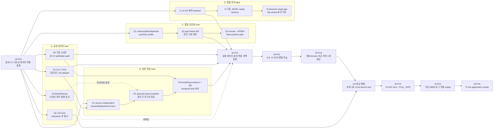
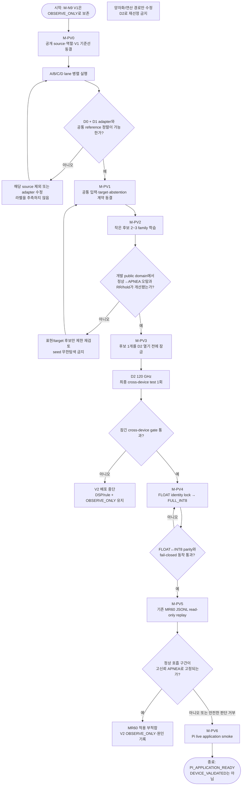

# SafeNest mmWave 공개 멀티도메인 V2 모델 개발 로드맵

- 작성일: 2026-08-22
- 상태: `ACTIVE_CHILD_ROADMAP`
- 상위 문서: `docs/20260817_SafeNest_mmWave_MR60_Compatible_Model_Development_Roadmap_01.md`
- 적용 시점: M-N9 `MMWAVE_M_N9_FULL_INT8_V1`의 실제 MR60 적용 관측 이후
- 범위: 공개 인터넷 데이터 기반 mmWave V2 모델 개발, 공개 cross-device 검증, INT8, 기존 MR60 로그 재생, Pi 적용 smoke
- 비범위: 신규 SafeNest 실측 수집, MR60 실측을 이용한 지도학습·튜닝, 임상 무호흡 주장, 펌웨어/센서 임계값 변경

이 문서는 완료된 M-N0–M-N9 역사를 되돌리지 않는다. 기존 M-N9 V1은 재현 가능한 비교 기준과 `OBSERVE_ONLY` 아티팩트로 보존한다. 이 문서는 **새 SafeNest 실측을 학습 데이터로 쌓지 않고**, 공개 데이터로 센서 간 일반화가 가능한 V2를 만든 뒤 현재 MR60에 적용해 보는 후속 실행 경로다.

---

## 0. 한 줄 결정

```text
기존 110명 공개 데이터만 더 세게 학습하지 않는다.
여러 공개 radar domain을 사용해 호흡 증거·호흡수·판단 거부를 학습하고,
한 공개 radar 전체를 잠근 cross-device test로 남긴 뒤,
통과한 모델만 새 V2 identity로 MR60에 적용한다.
```

공개 데이터는 총 네 계열을 조사하지만, 네 계열을 무조건 한 학습 배열로 합치지는 않는다.

```text
필수 개발/학습     기존 110명 60 GHz + 24.17 GHz 공개 데이터
잠긴 최종 시험     120 GHz 24명 공개 데이터 전체
비차단 선택 입력   BreathSense 77 GHz 108명 processed phase
```

BreathSense는 motion/quality/RR 일반화에 도움이 되고 준비가 끝나면 개발 풀에 들어간다. 대용량 raw ADC 처리나 라이선스 확인이 늦어져도 V2 핵심 경로를 막지 않는다. 숨참기 라벨이 없는 조건은 APNEA-proxy 지도학습에 사용하지 않는다.

---

## 1. 왜 M-N 단계를 했는데도 다시 모델을 만드는가

M-N은 이미 “공개 raw radar phase와 MR60 vendor `breath_phase`가 같은 신호가 아니다”라는 문제를 인지하고 새 모델을 만든 단계다. 따라서 이 문서는 그 사실을 새로 발견했다고 주장하지 않는다.

M-N2–M-N4가 적용한 해결은 다음과 같았다.

```text
offset 차이        → 시간 미분 R2로 제거
amplitude 차이     → 30초 창의 MAD로 나눔
sampling 차이      → 8 Hz / 240 samples로 재구성
```

그런데 실제 적용에서 이 정도의 정규화만으로는 충분하지 않았다는 증거가 생겼다. 문제는 단순히 “두 phase가 다르다”가 아니라, **현재 정규화가 조용한 정상 호흡과 숨참기의 차이까지 약화시킬 수 있다**는 것이다.

### 1.1 MAD 문제를 가장 쉽게 설명하면

MAD 나눗셈은 녹음기의 자동 볼륨과 비슷하다.

```text
작게 들리는 정상 호흡  ±0.02  ÷ 0.02  → 약 ±1
숨참기 중 작은 잡음    ±0.002 ÷ 0.002 → 약 ±1
```

원래는 정상 호흡이 숨참기 잡음보다 10배 컸는데, 각각 자기 크기로 나누면 둘 다 비슷한 크기로 커진다. 즉 **속삭임과 거의 무음인 방의 잡음을 각각 최대 볼륨으로 키워 놓은 것**과 같다.

MAD 정규화 자체가 항상 잘못된 것은 아니다. 다만 현재처럼 각 30초 창이 자기 MAD를 사용하면 다음 정보가 약해진다.

- 이 창의 실제 움직임이 충분히 컸는가
- 이전 정상 호흡보다 움직임이 실제로 감소했는가
- 저진폭 정상 호흡인가, 숨참기인가, 단순 잡음인가

실제 MR60 정상 호흡 창에서 `MAD≈0.02`가 관측됐고, M-N7의 저진폭 occupied 창도 APNEA-proxy에 높은 확률을 냈다. 따라서 V2는 작은 MAD를 무조건 정상 크기로 확대하지 않고, 원래 신호 크기·주기성·품질을 별도 정보로 보존해야 한다.

### 1.2 30초 한 라벨 문제

현재 계약은 30초 창에 일정 길이의 자발적 숨참기 proxy가 겹치면 창 전체를 APNEA-proxy로 만들 수 있다. 이 방식에서는 다음 두 창이 비슷한 라벨 특징을 만들 수 있다.

```text
정상 호흡이 대부분이고 마지막 일부만 숨참기
30초 전체가 약하고 조용한 정상 호흡
```

V2는 30초 파형을 즉시 세 클래스 중 하나로 강제하지 않는다. 먼저 호흡 증거, 호흡수, 품질, 시간에 따른 호흡 소실을 추정하고 최종 상태를 조합한다.

---

## 2. 변경하지 않는 안전 원칙

1. M-N9 V1을 덮어쓰거나 같은 artifact ID로 재발행하지 않는다.
2. 기존 M-A/M-B frozen live gate를 다시 열지 않는다.
3. 현재 MR60 로그를 supervised TRAIN/VAL/TEST로 사용하지 않는다.
4. 현재 MR60 로그의 cadence, gap, 재발행, freeze 통계는 synthetic corruption 설계와 적용 smoke에만 사용할 수 있다.
5. `human_detected_raw` presence gate를 유지한다.
6. large-gap이 있는 창을 보간해 정상 입력으로 위장하지 않는다.
7. flat, low-quality, stale, motion-contaminated 신호는 APNEA-proxy가 아니라 `INPUT_UNAVAILABLE` 또는 동등한 판단 거부로 보낸다.
8. APNEA는 자발적 숨참기 기반 SafeNest proxy이며 임상 무호흡이 아니다.
9. subject split은 공개 데이터셋별로 유지하며 한 사람의 모든 recording/window를 한 split에 둔다.
10. 120 GHz 잠긴 cross-device test는 모델·표현·threshold 선택에 사용하지 않는다.

---

## 3. 공개 데이터 역할

### 3.1 D0 — 기존 110명 60 GHz 데이터: 필수 주 학습

- 프로젝트 canonical source: 현재 manifest에 잠긴 Zenodo dataset/version
- 공개 안내: `https://zenodo.org/records/16760684`
- 센서: 두 종류의 60 GHz FMCW radar
- 참조: Movesense ECG/가슴 ACC, non-breathing timestamp
- 조건: 자세, rest/post-exercise, 자발적 숨참기
- 역할: subject-diverse 주 학습, 호흡수/호흡 증거/숨참기 proxy supervision
- 금지: M-N6에서 이미 소비한 heldout subject를 V2 학습·선택에 재사용하지 않는다. V2용 subject split은 나머지 비소비 subject pool에서 새 identity로 한 번 동결한다.

### 3.2 D1 — 24.17 GHz 11명 데이터: 필수 보조 개발 domain

- 논문/데이터: `https://doi.org/10.1038/s41597-020-0390-1`
- 데이터: `https://doi.org/10.6084/m9.figshare.c.4633958.v1`
- 입력: radar I/Q에서 복원한 phase/displacement
- 참조: 동기화된 respiration sensor
- 조건: default, breath-hold, post-exercise, distance, angle, speech 등
- 역할: 다른 주파수·다른 radar 처리계에서 feature/모델 선택, 거리·각도·artifact 강건성
- 주의: 11명 전체를 110명과 동일 가중치로 반복 oversampling하지 않는다.

### 3.3 D2 — 120 GHz 24명 데이터: 잠긴 최종 cross-device test

- 논문/데이터 안내: `https://doi.org/10.1038/s41597-026-07016-6`
- 데이터: `https://doi.org/10.21227/wq68-sv85`
- 입력: radar displacement/vital signal
- 참조: 동기화된 respiration reference
- 조건: resting, normal→breath-hold→normal
- 역할: **최종 공개 cross-device test 전용**
- 금지: 입력 표현, 모델 family, threshold, calibration, augmentation 선택에 사용하지 않는다.

### 3.4 D3 — BreathSense 77 GHz 108명: 비차단 선택 개발 domain

- 데이터 안내: `https://huggingface.co/datasets/BreathSense/BreathSense`
- 입력 후보: 공개 processed phase 우선; raw ADC 전체 다운로드는 별도 필요성 검토
- 참조: respiratory belt waveform
- 조건: rest, walk, run, stairs
- 역할: motion contamination, quality/abstention, RR reconstruction 일반화
- 비역할: 숨참기 라벨이 없는 조건을 APNEA-proxy supervision에 사용하지 않는다.
- 비차단 규칙: 라이선스·용량·형식 감사가 늦어져도 D0+D1 핵심 학습과 D2 잠긴 시험은 진행한다.

### 3.5 “총 4개를 합쳐 재학습하는가?”에 대한 정확한 답

```text
공개 데이터 계열은 총 4개를 관리한다.
그러나 학습에는 D0 + D1을 필수로 사용한다.
D3는 준비되면 quality/RR 개발에 합류한다.
D2는 학습에 넣지 않고 마지막 cross-device test로 잠근다.
```

네 데이터셋을 모두 학습에 넣으면 “처음 보는 radar 전체”가 남지 않는다. 따라서 D2를 잠가 두는 것이 실제 MR60처럼 새로운 radar에 적용할 가능성을 평가하는 데 더 중요하다.

---

## 4. 병렬 실행 구조

아래 네 작업 lane은 M-PV0 범위 동결 직후 동시에 시작할 수 있다. 각 공개 데이터 adapter도 서로 독립이므로 병렬 실행한다. 오직 공통 계약 동결, 모델 선정, 최종 시험에서만 합류한다.



병렬화의 핵심은 다음과 같다.

- D1 다운로드/adapter가 진행되는 동안 기존 D0로 표현·target 후보를 만들 수 있다.
- D2는 다운로드·checksum·schema audit까지만 병렬로 끝내고 데이터 내용은 최종 시험 전 열지 않는다.
- D3가 늦어져도 핵심 경로를 멈추지 않는다.
- 모델 코드가 완성되기 전에 INT8 입출력 계약 skeleton과 replay harness를 준비할 수 있다.
- 펌웨어 telemetry queue 문제는 별도 device lane에서 병렬로 다루며 V2 학습의 선행조건으로 두지 않는다.

---

## 5. 전체 순서도와 의사결정



---

## 6. V2가 풀 문제와 출력 구조

### 6.1 직접 3-class 분류를 기본안으로 두지 않는다

V2의 기본 학습 문제는 다음 세 가지다.

1. **호흡 증거**: 이 구간에서 참조와 대응되는 주기적 호흡이 존재하는가
2. **호흡수**: 호흡 증거와 품질이 유효할 때 RR은 얼마인가
3. **판단 가능성**: flat, motion, gap, freeze, 비주기성 때문에 추론을 거부해야 하는가

temporal hold/APNEA-proxy는 단일 flat 창의 클래스가 아니라 다음 조건의 시간 조합으로 만든다.

```text
presence=true
+ 직전 구간에서 유효한 호흡 baseline 존재
+ 현재 구간에서 호흡 증거가 지속적으로 소실
+ timing/quality gate 통과
= APNEA-proxy 후보
```

이 조건을 neural head로 둘지, reference-supervised breathing evidence와 deterministic persistence를 조합할지는 M-PV1에서 동결한다. 후보를 무제한 늘리지 않는다.

### 6.2 비교할 표현은 소수만 둔다

| 후보 | 입력 | 장점 | 위험 |
|---|---|---|---|
| `F1_NORMALIZED_SPECTRAL` | 호흡 대역 정규화 power spectrum + 총 에너지/원 MAD 별도 보존 | 부호·offset·sampling 차이에 비교적 강함 | 짧은 숨참기 onset 위치 손실 |
| `F2_SPECTRAL_AUTOCORR` | F1 + autocorrelation peak/periodicity/entropy | 주기적 정상 호흡과 잡음 구분 | feature 구현 증가 |
| `F3_TRACE_PLUS_QUALITY` | robust trace + 별도 amplitude/quality mask | 시간 변화와 hold onset 보존 | sensor waveform에 다시 과적합 가능 |

현재 M-N4 `R2 + window-local MAD divide-only`는 V1 baseline으로만 비교한다. V2 기본안은 MAD가 작은 창을 자동으로 정상 크기까지 증폭하지 않고, 원 MAD 또는 log-energy를 별도 입력/품질 정보로 보존한다.

### 6.3 synthetic MR60-like corruption

실제 MR60 로그는 라벨로 사용하지 않고 다음 범위의 변형 profile을 정하는 데만 사용한다.

- 7–10 Hz 비균일 cadence 후 8 Hz canonical 변환
- scale/offset/sign 변화
- 저진폭과 amplitude compression
- 같은 phase 재발행
- timestamp jitter
- phase freeze
- telemetry sequence loss
- 0.5초 이상 gap

gap/freeze가 있는 샘플의 목표는 생리 클래스가 아니라 `ABSTAIN/INVALID`다. 합성 gap을 부드럽게 보간해 정상 학습 예제로 만들지 않는다.

---

## 7. 단계별 상세 로드맵

## M-PV0 — 범위·기준선·공개 source 역할 동결

### 핵심 질문

무엇을 보존하고 무엇을 새로 비교하며, 각 공개 데이터가 학습·개발·잠긴 시험 중 어디에 속하는가?

### 병렬 작업

- V1 artifact, contract, 공개 heldout 결과, M-N7/MR60 replay 결과를 read-only baseline으로 등록
- D0–D3 URL, DOI, license, version, expected size, checksum source, reference modality 조사
- D2 전체를 `LOCKED_PUBLIC_CROSS_DEVICE_TEST`로 지정
- MR60 실측 supervised use 금지를 기계가 읽을 수 있는 policy로 기록

### 산출물

- `datasets/mmwave/manifests/M-PV0_public_multidomain_registry/`
- source registry
- role/lock policy
- license/access audit
- V1 failure baseline
- exception registry
- checksums

### Exit gate

- D0/D1/D2 역할이 모호하지 않다.
- D3가 비차단임이 명시돼 있다.
- D2 content access 전 lock audit가 존재한다.
- 기존 M-N6 heldout 또는 M-N9 test를 새 selection에 재사용하지 않는다.

---

## M-PV1 — 공개 멀티도메인 공통 계약 동결

### 핵심 질문

다른 radar의 phase/IQ/displacement를 어떤 공통 표현과 target으로 바꿔야 하나?

### 병렬 작업

#### Dataset adapter lane

- D0: 기존 decoder 재사용, M-N6 소비 heldout을 제외한 pool에서 V2 전용 subject split 생성
- D1: I/Q → ellipse correction 필요성 확인 → unwrap/displacement adapter
- D2: checksum/schema/subject identity만 검증하고 target/model 개발에서는 봉인
- D3: processed phase와 belt timestamp 정합성, license, 실제 필요한 다운로드 크기 확인

#### Representation lane

- F1/F2/F3를 D0 TRAIN + D1 development에서만 비교
- absolute scale, original MAD/log-energy, periodicity 정보를 보존
- sensor별 임의 gain matching 금지

#### Target lane

- reference waveform 기반 breathing evidence
- reference 기반 RR target
- 공개 non-breathing timestamp/reference 기반 temporal hold target
- motion/gap/freeze synthetic quality target
- 30초 전체에 단일 APNEA label을 강제로 붙이는 방식을 기본안에서 제외

#### Integration lane

- 예상 V2 입력/출력 tensor 후보
- `presence`, `gap`, `stale` 선행 gate
- 기존 JSONL replay adapter skeleton

### 산출물

- `config/mmwave/m_pv1_public_multidomain_contract.json`
- dataset-specific adapter manifests
- V2 subject splits
- common feature schema
- target mapping profile
- abstention/fail-closed contract
- D2 access audit: inference 0

### Exit gate

- D0와 D1에서 같은 의미의 feature/target을 재현한다.
- train-only statistics만 사용한다.
- 원 amplitude/quality 정보가 MAD 정규화로 사라지지 않는다.
- D2는 열리지 않았다.
- D3 미완료가 핵심 gate를 막지 않는다.

---

## M-PV2 — 소수 후보 병렬 학습

### 핵심 질문

작은 모델이 여러 공개 radar domain에서 호흡 증거·RR·판단 거부를 함께 학습할 수 있는가?

### 후보 제한

기본 2–3 family만 허용한다.

- small feature MLP baseline
- small Conv1D/TCN multi-task
- 필요할 때만 trace+feature hybrid

각 family는 고정된 소수 seed만 실행한다. D1의 11명을 D0의 110명과 균형 없이 반복 복제하지 않고 source-balanced sampling을 사용한다. D3가 합류하면 quality/RR loss에만 적합한 샘플 역할을 보존한다.

### 핵심 metric

- reference NORMAL에서 APNEA/hold 고신뢰 false positive
- breathing evidence precision/recall
- RR MAE와 허용 오차 내 비율
- breath-hold onset/offset 또는 event F1
- invalid/gap/freeze false acceptance
- source별 metric 편차
- calibration/overconfidence

### 산출물

- `datasets/mmwave/manifests/M-PV2_candidate_training/`
- candidate artifacts
- source-balanced training evidence
- per-source and pooled metrics
- determinism audit
- D2 inference 0 증거

### Exit gate

- 적어도 한 후보가 V1보다 정상→APNEA 오탐을 줄인다.
- 하나의 source만 좋아지고 다른 source에서 붕괴하는 후보를 선택하지 않는다.
- 판단 거부가 생리 클래스보다 먼저 동작한다.

---

## M-PV3 — 개발 domain 평가와 후보 잠금

### 핵심 질문

D2를 보기 전에 하나의 FLOAT identity를 잠글 수 있는가?

### 작업

- D0 subject-heldout과 D1 cross-domain 결과로 family/seed 선택
- D3가 합류했다면 motion/quality 결과를 보조 근거로 사용
- threshold/persistence/calibration을 D2 없이 동결
- exact model SHA, feature contract, preprocessing identity 기록
- 후보 잠금 commit 이후에만 D2 test 승인

### 산출물

- `config/mmwave/m_pv3_selected_float_lock.json`
- candidate ranking
- pre-D2 selection evidence
- D2 access authorization record

### Exit gate

- 선택이 D2 결과와 무관하게 완료돼 있다.
- 후보 identity와 모든 threshold가 잠겨 있다.
- 정상→APNEA false-positive gate가 1순위로 적용됐다.

---

## M-PV3X — D2 잠긴 공개 cross-device test

### 핵심 질문

학습과 선택에서 보지 않은 120 GHz radar에서도 V2의 생리적 의미가 유지되는가?

### 작업

- 잠긴 FLOAT 후보 하나만 D2에 1회 실행
- subject-level metric
- resting false hold/APNEA
- apnea-proxy event detection
- RR/respiration evidence
- calibration/abstention
- D2 결과로 다른 후보를 열거나 threshold를 조정하지 않음

### 판정

- `PASS_WITH_LIMITATIONS`: 새 공개 radar에서도 비붕괴, 정상 고신뢰 APNEA 오탐이 허용 gate 안, hold/RR이 유효
- `FAIL_PUBLIC_CROSS_DEVICE_GENERALIZATION`: 정상 고신뢰 APNEA, class collapse, quality gate 실패, timing/reference 정합 실패

FAIL이면 M-PV4로 가지 않는다. 결과를 이용한 무한 재튜닝 대신 표현/target 가설을 명시적으로 한 번 재개정할지, V2를 중단할지 결정한다.

---

## M-PV4 — FLOAT lock, FULL_INT8, Pi inference readiness

### 핵심 질문

잠긴 cross-device 통과 후보를 정확히 같은 의미의 FULL_INT8로 만들 수 있는가?

### 작업

- FLOAT SHA 검증
- 공개 TRAIN 유래 representative calibration
- FULL_INT8 only 변환
- FLOAT↔INT8 output parity
- quality/abstention과 temporal hold parity
- saturation audit
- ARM/Pi isolated load/invoke

### 산출물

- `models/mmwave/m_pv4/` 아래 새 V2 identity
- artifact lock
- tensor contract
- INT8 parity report
- Pi isolated smoke report

### Exit gate

- V1 artifact를 덮어쓰지 않는다.
- FLOAT와 INT8의 생리 상태 및 판단 거부 결정이 허용 범위에서 일치한다.
- 이 단계 이름은 `PI_INFERENCE_READY_V2`이며 `DEVICE_VALIDATED`가 아니다.

---

## M-PV5 — 기존 MR60 로그 적용 replay

### 핵심 질문

공개 데이터만으로 만든 V2가 이미 관측된 MR60 정상 호흡을 고신뢰 APNEA로 고정하는 문제를 줄였는가?

### 입력 역할

- `20260817_08`, `20260817_09`, `20260821_16` 등 기존 실제 로그
- supervised label/accuracy 계산 금지
- runtime application behavior, availability, class collapse, abstention만 관측

### 판정 기준

- gap/freeze 창은 `INPUT_UNAVAILABLE`
- presence=false/null은 추론 억제
- 주기적 정상 호흡 증거가 있는 창을 고신뢰 APNEA로 고정하지 않음
- low-amplitude 비주기 창은 APNEA보다 판단 거부 우선
- V1과 V2를 동일 창에서 비교하되 V1 결과를 label로 사용하지 않음

### Exit gate

- `MR60_REPLAY_NON_COLLAPSE = YES`
- `NORMAL_BREATHING_FIXED_HIGH_CONF_APNEA = NO` 또는 안전한 판단 거부
- 이 단계는 실제 정확도 검증이 아니라 적용 적합성 smoke다.

---

## M-PV6 — Pi live application smoke

### 핵심 질문

V2가 실제 Pi runtime에서 presence·freshness·large-gap 계약을 지키며 지속 실행되는가?

### 작업

- 팀 배포 workflow와 PR을 통한 반영
- artifact SHA와 selector 확인
- 실제 wire-rate ingest
- `presence`, `canonical_window_status`, V2 quality/abstention, RR, temporal hold 관측
- latency, memory, invoke failure, stale behavior 기록
- telemetry queue/drop 문제는 별도 device evidence로 함께 표시하되 모델 정확도와 합치지 않음

### Exit gate

```text
PI_APPLICATION_READY_V2 = YES
DEVICE_VALIDATED = NO
NEURAL_TRUST = OBSERVE_ONLY
```

실제 MR60에서 반복 적용됐다는 사실만으로 neural trust를 올리지 않는다. 다만 공개 cross-device test와 live non-collapse가 모두 통과하면 V1보다 강한 공개데이터 기반 통합 후보로 채택할 수 있다.

---

## 8. 병목 방지 운영 규칙

1. 공개 dataset 하나의 다운로드·adapter가 다른 dataset 작업을 막지 않는다.
2. D3 BreathSense는 비차단이다. 완료 시점에 맞춰 합류하고, 늦으면 V2 core에서 제외한다.
3. D2는 다운로드와 checksum까지만 일찍 끝내고 내용 사용은 후보 잠금 후로 미룬다.
4. representation, quality corruption, integration replay harness는 dataset adapter와 병렬 진행한다.
5. 후보 family/seed 수를 늘려 계산 병목을 만들지 않는다.
6. 각 lane은 독립 branch/commit으로 작업하고 공통 계약 gate에서만 병합한다.
7. 공개 raw archive는 git에 커밋하지 않는다. manifest와 checksum만 추적한다.
8. 원본 다운로드 실패나 라이선스 불명확은 fail-open하지 않고 해당 source를 제외·기록한다.
9. 데이터셋별 parser/adapter test를 공통 모델 학습보다 먼저 끝내되, 다른 source lane을 기다리지 않는다.
10. 단계별 실행지시 프롬프트는 해당 단계 시작 직전에 이 문서와 직전 산출물을 읽고 별도로 작성한다. 이 문서에 미래 실행 프롬프트를 미리 복제하지 않는다.

---

## 9. 저장소와 provenance 규칙

- 모든 machine-readable path는 repository-relative POSIX path다.
- 원본 공개 파일은 `datasets/raw_archives/external_datasets/` 계열의 기존 ignore 정책을 따른다.
- 각 source는 URL, DOI/version, license, download time, byte size, checksum을 기록한다.
- 파생 window는 source dataset, subject, recording, condition, time span, reference alignment, split, feature profile, corruption profile을 보존한다.
- source 간 동일 subject라고 추측해 합치지 않는다.
- 각 source의 units와 physical meaning을 adapter manifest에 기록한다.
- D2 잠긴 test 접근은 실행 횟수와 호출 identity를 남긴다.
- archive/version_snapshots는 입력 검색이나 manifest 자동발견에 사용하지 않는다.

---

## 10. 성공/중단 기준

### 성공

- 공개 데이터만으로 선정·학습·평가했다.
- 최소 두 개발 radar domain에서 학습하고, 세 번째 잠긴 radar domain에서 1회 시험했다.
- 정상 호흡의 고신뢰 APNEA false positive가 V1 대비 명확히 줄었다.
- flat/low-quality/gap/freeze가 APNEA가 아니라 판단 거부로 간다.
- FULL_INT8와 FLOAT가 같은 결정을 낸다.
- 기존 MR60 replay에서 V1의 APNEA 고정 현상이 재현되지 않거나 안전한 판단 거부로 바뀐다.
- Pi에서 fail-closed 계약을 지키며 실행된다.

### 중단 또는 rule-only 유지

- 잠긴 D2에서 정상 호흡이 다시 고신뢰 APNEA로 붕괴한다.
- 공개 radar domain마다 서로 반대되는 판단을 해 공통 표현이 성립하지 않는다.
- 품질 불량을 생리 클래스와 분리하지 못한다.
- INT8에서 abstention/hold 의미가 깨진다.
- 기존 MR60 replay에서 V2도 APNEA 고정으로 붕괴한다.

중단은 프로젝트 실패가 아니다. 이 경우 mmWave 운영 경로는 presence + freshness + spectral/rule 호흡 성분을 유지하고 neural class는 `OBSERVE_ONLY` 또는 비활성 후보로 남긴다.

---

## 11. 지금 허가되는 다음 실행

이 로드맵에 따라 가장 먼저 시작할 수 있는 것은 M-PV0이며, M-PV0의 짧은 scope freeze가 끝나면 다음을 병렬로 시작한다.

```text
D0 기존 110명 V2 split/label audit
D1 24.17 GHz license/download/schema/adapter
D2 120 GHz license/download/checksum/LOCKED 등록
D3 BreathSense 비차단 license/processed-phase audit
R1 표현 후보 구현 설계
Q1 MR60-like synthetic corruption profile
I1 V2 runtime I/O + replay harness skeleton
```

각 단계의 실제 실행지시 프롬프트는 그 단계 시작 시 이 문서, 직전 gate 산출물, 현재 worktree 상태를 다시 확인한 뒤 별도 문서로 요청·작성한다.

---

## 12. 참조

- 기존 MR60 호환 로드맵: `docs/20260817_SafeNest_mmWave_MR60_Compatible_Model_Development_Roadmap_01.md`
- M-N2 공통 표현: `docs/mmwave/20260818_SafeNest_mmWave_M-N2_Common_Representation_01.md`
- M-N4 계약: `docs/mmwave/20260818_SafeNest_mmWave_M-N4_Canonical_Input_Dataset_Freeze_01.md`
- M-N7 device-domain check: `docs/mmwave/20260818_SafeNest_mmWave_M-N7_Existing_MR60_Device_Domain_Check_01.md`
- M-N9 INT8: `docs/mmwave/20260818_SafeNest_mmWave_M-N9_FULL_INT8_Pi_Readiness_01.md`
- 110명 60 GHz 공개 데이터: `https://zenodo.org/records/16760684`
- 24.17 GHz 공개 데이터: `https://doi.org/10.1038/s41597-020-0390-1`
- 120 GHz 공개 데이터: `https://doi.org/10.1038/s41597-026-07016-6`
- BreathSense 공개 데이터: `https://huggingface.co/datasets/BreathSense/BreathSense`
