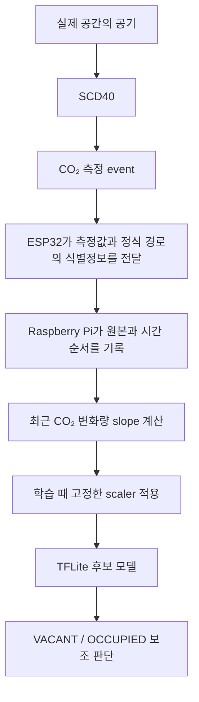

# SafeNest CO₂ 인수인계 문서

SafeNest의 CO₂ 파트는 SCD40에서 측정한 이산화탄소 농도를 이용해 공간에 사람이 있는지 없는지를 보조적으로 판단하기 위한 기능입니다.

현재는 모델을 처음부터 새로 만들어야 하는 상태가 아닙니다. 공개 데이터로 진행한 오프라인 개발에서 사용할 입력값, 전처리 방법, 모델 후보와 임계값까지 정리되어 있습니다. 이제 더 중요한 일은 실제 SafeNest 장치에서 데이터를 충분히 모으고, 이 모델이 실제 환경에서도 같은 의미의 입력을 받아 쓸 만하게 작동하는지 확인하는 것입니다.

이 문서는 CO₂ 개발 과정에 참여하지 않았던 팀원이 처음 읽어도 다음 질문에 답할 수 있도록 작성했습니다.

- CO₂ AI가 무엇을 보고 무엇을 출력하는가?
- ESP32와 Raspberry Pi는 각각 어떤 일을 맡는가?
- 이 모델을 믿고 어디까지 할 수 있고, 무엇을 판단하면 안 되는가?
- 지금 바로 할 수 있는 실측은 무엇이며, 정식 검증은 왜 기다려야 하는가?
- 나중에 모델을 개선하거나 교체하려면 어디서부터 시작해야 하는가?

문서 작성일은 `2026-08-16`이며, 작성 에이전트는 `Codex (CO2 Human-First Documentation Agent)`입니다. 이 문서는 모델·펌웨어·runtime을 변경하지 않는 documentation-only handoff입니다. 정확한 phase 이름과 artifact ID는 본문을 읽은 뒤 부록에서 확인하면 됩니다.

## 1. 먼저 알아야 할 결론

CO₂ 파트는 “아무것도 없는 상태”를 지났습니다. 학습용 데이터의 계보와 오프라인 전처리 계약을 정리했고, 입력을 CO₂와 CO₂ 변화량 두 가지로 줄인 모델 후보도 고정했습니다. Raspberry Pi에서 후속 검증에 사용할 모델 파일과 입력 계약도 보존되어 있습니다. 다만 실제 Pi 배포와 장시간 동작은 아직 별도로 검증하지 않았습니다.

다만 오프라인 모델을 실제 SCD40에 연결해 성능을 확인하는 일은 아직 끝나지 않았습니다. 지금 할 수 있는 것은 실제 센서의 값 범위와 변화, 통신 상태, 오류, 수집 절차를 확인하는 1차 탐색 실측입니다. 정식 모델 성능평가용 실측은 ESP32가 보내는 값이 “새로운 SCD40 측정”인지 “이전 값을 다시 보낸 것”인지 구분하는 기능이 실제 장치에 반영되고 live 검증을 통과한 뒤에 시작합니다.

| 지금 궁금한 것 | 현재 답 |
|---|---|
| 오프라인 모델 후보가 있는가? | 있다. 입력과 임계값까지 고정되어 있다. |
| 오늘 실제 센서를 켜고 관찰해도 되는가? | 된다. 1차 탐색 실측으로 진행한다. |
| 오늘 수집한 데이터로 공식 Accuracy/F1을 발표해도 되는가? | 아직 안 된다. |
| 정식 검증 실측을 시작해도 되는가? | fresh measurement event 기능의 배포와 live 확인을 기다린다. |
| 실제 장치에서 모델 성능이 증명됐는가? | 아직 아니다. |

## 2. 센서에서 AI 결과까지 어떻게 흐르는가

SafeNest에서 CO₂ 정보는 다음 순서로 흘러가는 것을 목표로 합니다.



이 그림은 최종 배포가 이미 끝났다는 뜻이 아니라, 현재 입력 계약과 후속 검증이 확인해야 할 책임 분담을 보여 줍니다.

### SCD40과 ESP32가 하는 일

SCD40은 공기 중 CO₂ 농도를 측정합니다. ESP32는 센서에서 값을 읽고, 그 값을 Raspberry Pi 쪽으로 전달하는 역할을 맡습니다. 정식 경로에서는 어느 값이 새로 성공한 SCD40 읽기인지 알아볼 수 있도록 측정 event 식별정보와 관련 시각도 함께 전달해야 합니다.

여기서 “패킷이 새로 도착했다”는 것과 “센서가 새로 측정했다”는 것은 다릅니다. 현재 팀 경로는 transport 상태와 수신 시각은 보존하지만, 실제 센서 event를 완전히 구분하는 기능은 아직 배포·검증 대기 상태입니다. 이 차이가 정식 실측을 바로 시작하지 않는 이유입니다.

### Raspberry Pi가 하는 일

Pi는 들어온 원본 payload와 수신 상태를 기록하고, 새 센서 측정이 실제로 이어지는지 시간 순서를 확인하는 곳입니다. 승인된 processing path에서는 과거 측정 history를 유지하고, 그 history에서 `CO2_slope`를 계산하며, 학습 때 고정한 scaler와 모델을 적용합니다. 여기서 scaler는 CO₂와 slope 숫자의 범위를 학습 때 보던 기준에 맞추는 변환값이며, 실제 수집을 시작했다고 다시 fit하지 않습니다.

운영자가 slope를 손으로 계산하거나, ESP32에 AI를 추가하거나, 60초 간격에 맞춰 숫자를 만들어 넣는 구조가 아닙니다. 센서 노드는 측정과 전달에 집중하고, 시간 history·파생 feature·추론은 Pi 또는 이후 승인된 downstream processing이 맡습니다.

### 모델이 받는 것과 내보내는 것

현재 후보 모델이 받는 입력은 현재 CO₂ 값과 최근 CO₂ 변화량입니다. 모델은 이를 바탕으로 `VACANT` 또는 `OCCUPIED`에 가까운 점유 상태와 점유 확률을 출력하도록 만들어졌습니다. TFLite는 이 후보를 Raspberry Pi 같은 장치에서 실행할 수 있도록 변환한 모델 파일 형식입니다.

이 출력은 CO₂ 기반 재실 보조 evidence입니다. 위험도, 의료 상태, 환기 안전판정의 확률이 아닙니다. 실제 장치에서 이 의미가 유지되는지는 정식 device-domain validation에서 별도로 확인해야 합니다.

## 3. 이 모델은 무엇을 보고 판단하는가

### CO₂는 현재 공기 상태를 보여 준다

CO₂ 값은 현재 측정된 공기 중 이산화탄소 농도입니다. 단일 값은 지금 공기가 어느 정도인지 알려 주지만, 그 값만으로 사람이 있는지 없는지를 항상 구분할 수는 없습니다. 환기, 방 크기, 문과 창문, 이전에 사람이 있었는지, 다른 CO₂ 발생원이 있는지에 따라 같은 농도도 다른 의미를 가질 수 있습니다.

### CO₂ slope는 변화의 방향과 속도를 보여 준다

`CO2_slope`는 별도의 센서가 아닙니다. 최근 일정 시간 동안 CO₂가 얼마나 빠르게 올라가거나 내려가고 있는지를 나타내는 파생값입니다.

예를 들어 지금 CO₂가 700 ppm이라는 사실만 보는 것과, 500 ppm 부근에서 시작해 짧은 시간 동안 계속 올라와 700 ppm이 되었다는 사실을 함께 보는 것은 다릅니다. 반대로 환기가 끝난 뒤 천천히 내려와 700 ppm이 된 경우도 있을 수 있습니다. 현재 값과 변화 방향을 함께 보려는 이유가 여기에 있습니다.

### 최근 약 150초의 과거만 사용한다

현재 모델은 최근 약 150초 동안 검증된 측정 event의 양 끝을 비교해 slope를 만듭니다. 앞으로 일어날 값을 미리 보지 않으며, 아직 발생하지 않은 값을 이용하지 않습니다.

센서가 정상적으로 이어지는 동안에는 history가 쌓입니다. 측정 시작 직후에는 과거 자료가 충분하지 않아 slope가 잠시 없을 수 있는데, 이것은 버그가 아니라 warm-up 상태입니다. 유효한 센서 event 사이의 간격이 90초를 넘으면 현재 계약상 history를 다시 시작하고, 그 사이 값을 복사하거나 보간해 빈 구간을 숨기지 않습니다.

내부 문서를 찾다 보면 이 방식이 `ENDPOINT_H150` 또는 `ENDPOINT_DIFFERENCE`라고 적혀 있을 수 있습니다. 현재 두 이름은 `CO2_SLOPE_FEATURE_PROFILE_001`의 “과거 150초 endpoint difference”를 가리키는 계보상의 표현입니다. 이름을 바꾸거나 다른 slope 계산법을 쓰는 것은 단순한 구현 세부 변경이 아니라 새 입력 계약과 검증이 필요한 변경입니다.

### 60초는 센서가 60초마다만 측정한다는 뜻이 아니다

SafeNest에는 서로 다른 세 가지 시간이 함께 존재할 수 있습니다.

1. SCD40이 실제로 새로운 측정을 만드는 시간.
2. ESP32와 Pi가 통신하거나 `/health`를 확인하는 시간.
3. AI가 새 입력을 내보낼 기회로 정한 명목상 약 60초 간격.

따라서 Pi가 1초마다 화면을 확인한다고 해서 SCD40이 1초마다 새 CO₂를 측정한 것은 아닙니다. 같은 센서 값이 여러 packet에 반복될 수 있고, packet의 수신 시각이 바뀌어도 physical measurement event는 하나일 수 있습니다.

모델 입력을 60초에 맞추려고 이전 값을 복사하거나, 실제로 없던 시각과 값을 만들어서는 안 됩니다. raw 기록은 실제 발생한 시간과 상태 그대로 남기고, 후처리에서 유효한 chronology를 기준으로 모델 입력 가능 여부를 판단합니다.

## 4. 이 모델로 무엇을 알 수 있는가

이 모델이 제공하려는 것은 **CO₂ 패턴을 근거로 한 `VACANT` / `OCCUPIED` 보조 추정**입니다. 한 시점의 출력은 “현재 입력이 학습된 점유 상태의 어느 쪽에 가까운가”를 보여 주는 신호로 사용할 수 있습니다.

SafeNest 전체에서는 이 신호가 다른 센서가 주는 정보와 함께 환경 상태를 이해하는 데 도움을 줄 수 있습니다. 예를 들어 Thermal은 열 분포와 자세에 가까운 정보를, mmWave는 호흡·미세 움직임에 가까운 정보를, CO₂는 공간의 공기 변화와 재실에 가까운 정보를 제공할 수 있습니다. 이 문서는 그 신호들을 최종 위험도로 합치는 fusion 규칙을 새로 정하지 않습니다.

`OCCUPIED`가 나왔다면 “사람이 있을 가능성을 지지하는 CO₂ evidence가 있다” 정도로 읽습니다. `VACANT`도 같은 방식의 보조 관찰값입니다. 실제 장치에서 이 출력이 얼마나 자주 맞는지는 아직 정식 실측으로 확인하지 않았습니다.

## 5. 이 모델에 기대하면 안 되는 것

CO₂는 공간의 환경 신호입니다. 이 모델은 사람의 신원, 정확한 인원수, 위치, 자세, 넘어짐, 호흡수, 심박수, 의식 상태를 직접 보지 않습니다. CO₂만으로 누가 있는지, 몇 명인지, 사람이 어디에 있는지 알아낼 수 없습니다.

특히 `OCCUPIED`는 위험 상황이라는 뜻이 아닙니다. 반대로 `VACANT`는 공간이 안전하다는 보장도 아닙니다. 이 모델은 안전 판정기나 의료 진단기가 아니라 CO₂ 기반 재실 보조 센서입니다. 질식, 사망, 임상적 apnea, 의식 저하 같은 결론을 이 모델의 출력에서 끌어내면 안 됩니다.

방의 부피, 환기 장치와 공기 흐름, 문·창문의 상태, 이전 재실자의 CO₂가 남아 있는 정도, 사람이 아닌 다른 CO₂ 발생원도 결과에 영향을 줄 수 있습니다. 이런 요인은 모델이 센서값만 보고 구분할 수 없는 실제 환경 변수입니다. 그래서 실측 데이터가 쌓이기 전에는 “오프라인 점수가 좋으니 실제 방에서도 안전하게 쓸 수 있다”고 말하지 않습니다.

## 6. 온도와 습도는 왜 최종 필수 입력에서 빠졌는가

처음 CO₂ 모델 방향은 CO₂, 온도, 습도, CO₂ 변화량을 함께 사용하는 네 feature였습니다. 오프라인 비교에서 네 feature 모델이 일부 지표에서 더 좋은 결과를 보인 적도 있습니다. 따라서 온도와 습도가 쓸모없다고 결론 낸 것은 아닙니다.

문제는 SafeNest의 실제 CO₂ 경로가 온도와 습도를 항상 보존하고 전달하는 계약으로 시작하지 않았다는 점입니다. 과거 팀 실측에서는 producer 쪽에서 T/RH를 읽은 흔적이 있어도 telemetry에 끝까지 남아 있지 않았고, 없는 값을 나중에 채워 넣으면 실제 측정의 의미와 학습 데이터의 의미가 달라질 수 있었습니다.

그래서 “지표가 조금 좋아질 수 있다”는 이유만으로 센서와 runtime에 새로운 필수 field를 추가해도 되는지 별도로 검토했습니다. 그 결과 T/RH가 reduced model보다 본질적으로 우월하다고 증명된 것도 아니고, 반대로 전혀 가치가 없다고 증명된 것도 아니므로, 현재 후보의 mandatory model input에서는 제외했습니다. 현재 방향은 CO₂와 CO₂ slope를 사용하고, T/RH가 들어오면 optional diagnostic evidence로 보존하는 것입니다.

나중에 실제 장치 데이터에서 T/RH가 반복적으로 유용하고, 값의 의미·단위·누락 정책까지 방어할 수 있다면 새 sensor contract와 새 모델 decision으로 다시 검토할 수 있습니다. 지금 모델의 입력을 몰래 네 feature로 바꾸지는 않습니다.

## 7. 지금 어디까지 와 있는가

개발 과정은 다음 순서로 진행됐습니다.

1. 공개 CO₂ 데이터의 출처, 원본 계보, canonical materialization과 label 의미를 확인했습니다.
2. 학습·검증에 사용할 split, scaler, slope 계산, target 의미를 고정했습니다.
3. 역사적인 네 feature B5 후보를 보존한 채 T/RH 필요성을 별도로 비교했습니다.
4. 시스템 계약의 부담과 실제 입력 가용성을 고려해 CO₂ + CO₂ slope 방향을 선택했습니다.
5. 두 feature용 scaler, threshold, Float/TFLite/INT8 후보와 lock을 보존했습니다.
6. 실제 SCD40 수집을 위한 측정 절차와 capture tooling을 준비했습니다.
7. 지금은 실제 장치의 범위와 동작을 보는 탐색 실측을 시작할 수 있습니다.
8. 정식 실측은 fresh-event 관찰 기능이 팀 장치에 배포되고 live 검증된 뒤에 시작합니다.
9. 정식 데이터가 protocol compliance를 통과한 뒤에야 실제 장치 성능평가를 시작합니다.

현재 상태를 사람 말로 요약하면 다음과 같습니다.

| 항목 | 현재 상태 |
|---|---|
| 오프라인 모델 후보 | 입력·scaler·threshold·artifact가 고정된 상태 |
| 실제 장치 탐색 실측 | 지금 가능. 실제 범위·변화·오류·수집 흐름을 확인 |
| 정식 protocol-controlled 실측 | 새 센서 event와 재전송을 구분하는 기능 확인 대기 |
| 실제 장치 모델 성능평가 | 아직 시작 전 |
| 실제 장치 formal validation | 아직 시작하지 않음 |

탐색 실측은 정식 평가보다 낮은 가치의 “버리는 데이터”가 아닙니다. 실제 장치가 어떤 범위로 움직이는지, 통신이 언제 끊기는지, 수집 절차가 어디에서 불편한지 알아내는 데 필요한 프로젝트 evidence입니다. 다만 fresh physical event가 검증되지 않은 상태에서는 그것만으로 정확도나 F1을 확정하지 않습니다.

## 8. 현재 남아 있는 가장 중요한 장치 쪽 확인사항

정식 검증을 위해서는 Pi가 받은 CO₂ 값이 새 SCD40 측정인지, 센서의 마지막 값을 다시 보낸 것인지 구분할 수 있어야 합니다. 예를 들어 다음과 같은 기록을 생각해 보십시오.

```text
실제 SCD40 새 측정       → CO₂ 620 ppm / event 10
같은 측정값 재전송        → CO₂ 620 ppm / event 10
한 번 더 재전송           → CO₂ 620 ppm / event 10
다음 실제 새 측정         → CO₂ 625 ppm / event 11
```

이 경우 packet sequence가 달라졌다는 사실만으로는 네 줄을 모두 네 번의 센서 측정이라고 셀 수 없습니다. 새 physical read가 일어날 때 event ID가 증가하고, cached retransmission에서는 같은 event ID가 유지되어야 합니다. 그 event와 연결된 measurement chronology도 함께 있어야 합니다.

현재 `/health`의 `fresh`나 `age`는 전송·수신 상태를 이해하는 데 유용하지만, 그것만으로 새로운 SCD40 변환을 증명하지는 않습니다. 이 구분이 없으면 Pi가 1초마다 받은 같은 값을 slope의 서로 다른 endpoint처럼 사용할 위험이 있습니다.

팀 저장소에서는 이 관찰 기능을 PR #19에서 검토하고 있습니다. 앞으로 구현 방식이나 PR 번호가 바뀌더라도 필요한 기능은 “새 측정 event와 cached retransmission을 구분하고, 그 chronology를 보존하는 것”입니다. 이 변경이 team `main`에 실제 배포되고 장치에서 live 확인되기 전까지 정식 측정은 시작하지 않습니다. 현재도 탐색 실측은 별도로 진행할 수 있습니다.

## 9. 그럼 지금 실측해도 되는가

네. **1차 탐색 실측은 지금 시작해도 됩니다.**

이 단계에서는 실제 CO₂ 범위와 상승·회복 양상, 센서와 Pi 사이의 통신 안정성, stale·missing·error가 어떻게 기록되는지, 운영자가 capture 절차를 따라갈 수 있는지를 확인합니다. 현장 조건을 알아야 나중에 정식 protocol을 실행할 때 무엇을 주의해야 하는지도 알 수 있습니다.

탐색 실측의 ground truth는 CO₂ 값이나 모델 출력에서 만들지 않습니다. 세션 동안 실제로 사람이 없었는지(`VACANT`), 사람이 있었는지(`OCCUPIED`)를 운영자가 관찰해 기록합니다. 사람이 있는데 CO₂가 낮을 수도 있고, 사람이 없는데 이전 CO₂가 아직 높을 수도 있으므로, 라벨은 공기값이 아니라 실제 장면을 기준으로 합니다.

처음 실측하는 팀원은 복잡한 전환 세션보다 처음부터 끝까지 상태가 일정한 세션을 먼저 모으는 편이 좋습니다. 구체적인 준비물, 명령, 기록 방법, 오류 처리와 제출물은 함께 제공하는 [SCD40 실측 안내서](../prompts/20260815_SafeNest_CO2_SCD40_Physical_Measurement_Guide_KO_01.md)를 따라가면 됩니다.

정식 실측은 별도의 단계입니다. producer event 정보가 실제 장치에 들어오고, live payload가 확인되고, capture bundle이 protocol·candidate·ground truth·checksum을 함께 보존할 수 있을 때 시작합니다. 그 뒤에도 먼저 protocol compliance를 확인하고, 별도 승인 후에야 실제 장치의 formal validation으로 넘어갑니다.

## 10. 현재 모델을 넘겨받을 때 꼭 알아야 할 한계

### 오프라인 결과가 실제 장치 일반화를 보장하지 않는다

현재 후보는 공개 데이터의 학습·검증 구조에서 만들어진 오프라인 후보입니다. SCD40이 설치될 실제 방의 크기, 환기, 사람의 움직임, 센서 위치, 통신 지연과 missing pattern은 학습 데이터와 다를 수 있습니다. 따라서 오프라인 validation 숫자는 “후보를 재현하고 비교하기 위한 evidence”이지 “SafeNest 실제 환경의 정확도”가 아닙니다.

또한 기존 validation 자료는 개발 과정에서 사용된 자료이므로, 아직 보지 않은 최종 장치 holdout으로 취급하지 않습니다. 모델을 실제 환경에 맞춘다고 하면서 같은 실측을 반복해 보고 threshold를 조정하면, 검증 자료가 다시 개발 자료로 바뀔 수 있습니다.

### INT8에서는 slope 값 일부가 표현 범위 끝에 걸릴 수 있다

INT8은 모델 계산을 가벼운 정수 표현으로 바꾼 후보입니다. 오프라인 진단에서 일부 큰 `CO2_slope` 입력이 INT8 표현 범위의 끝에 걸리는 현상이 낮은 빈도로 관찰되었습니다. 이것은 실제 장치에서 반드시 실패한다는 뜻은 아니지만, 실제 protocol-compliant session에서 saturation 빈도와 prediction effect를 확인해야 한다는 제한입니다.

이 문서는 이 현상을 이유로 모델을 몰래 바꾸지 않습니다. 실제 장치 evidence가 쌓인 뒤에야 quantization range나 새 후보가 필요한지 판단합니다.

### 환경이 바뀌면 같은 값의 의미도 바뀔 수 있다

환기 장치, 방의 부피, 문과 창문, 사람의 체류 시간, 센서 위치가 달라지면 CO₂의 증가·감소 속도가 달라질 수 있습니다. 방마다 같은 threshold를 적용할 수 있는지는 실제 데이터를 보기 전에는 알 수 없습니다. 이 차이가 관찰되더라도 바로 재학습하거나 T/RH를 추가하지 말고, 먼저 어느 조건에서 어떤 failure mode가 생겼는지 기록합니다.

## 11. 실제 시스템에서 이 모델을 사용할 때의 원칙

첫째, 새로 확인된 유효 측정만 사용합니다. 수신 packet이 새로 생겼다는 이유만으로 fresh sensor event라고 부르지 않습니다. 확인되지 않은 값은 raw evidence로 남기되, formal model input으로 조용히 승격하지 않습니다.

둘째, 실제 시간 순서를 보존합니다. 150초 history에 들어갈 event의 순서를 확인하고, 90초를 넘는 유효 event gap이 있으면 history를 다시 시작합니다. stale 값 forward-fill, raw event interpolation, synthetic timestamp는 허용하지 않습니다.

셋째, slope는 Pi 또는 승인된 downstream processing이 계산합니다. 현장 운영자는 slope, scaler, threshold를 수정하지 않습니다. 현재 후보의 feature order는 `CO2` 다음 `CO2_slope`이고, 이 후보의 threshold는 `0.43`으로 고정되어 있습니다.

넷째, 모델 출력과 정답을 섞지 않습니다. `OCCUPIED`가 나왔다고 ground truth를 바꾸지 않고, CO₂가 올라갔다고 사람이 들어온 시각을 추정하지 않습니다. 모델 output은 관찰값이고, ground truth는 독립적인 운영 기록입니다.

다섯째, 오류와 결측은 실패한 evidence도 포함해 보존합니다. 모델이 값을 내도록 만들기 위해 이전 숫자로 채우거나, 보기 싫은 row를 삭제하지 않습니다. 이 원칙이 지켜져야 나중에 모델의 실패인지 센서·통신의 실패인지 구분할 수 있습니다.

## 12. 나중에 이 모델을 개선하거나 새 모델을 만든다면

가장 먼저 해야 할 일은 더 복잡한 AI를 만드는 것이 아닙니다. 먼저 protocol-controlled real SCD40 데이터를 모으고, 실제 환경에서 어떤 문제가 반복되는지 확인해야 합니다.

예를 들어 다음을 구분해 기록할 수 있습니다.

- 환기가 강한 방과 약한 방의 차이
- 사람이 들어오고 나가는 전환 구간
- 오래 사람이 머문 뒤 퇴실했을 때의 회복 양상
- 방과 센서 설치 위치별 차이
- stale·missing·reconnect가 발생하는 조건
- CO₂ slope saturation과 false `VACANT`/false `OCCUPIED` 패턴

그 evidence를 본 뒤에야 개선 방향을 선택합니다. gap이 많은 조건의 실측을 더 모을 수도 있고, 실제 분포를 반영해 재학습·재보정을 검토할 수도 있습니다. 충분한 순차 데이터가 있다면 작은 비선형 모델이나 temporal model을 비교할 수도 있고, 실제 문제가 quantization 범위라면 그 부분을 별도로 검토할 수 있습니다. T/RH를 다시 mandatory input으로 만들 수 있는지도 새로운 센서 계약과 독립적인 근거가 있을 때만 판단합니다.

새 후보를 만들 때는 현재 후보를 덮어쓰지 않습니다. 새 candidate ID를 만들고, feature order·scaler·threshold·slope window·missing policy를 새 계약으로 기록합니다. 기존 subject-level split을 상속하고 preprocessing은 TRAIN만으로 fit하며, model selection 중 LOCKED_TEST를 열지 않습니다. 후보를 lock한 뒤에야 기존 후보와 offline 비교를 하고, runtime이나 팀 계약을 바꾸는 일은 별도 검토와 승인 뒤에 진행합니다.

복잡한 모델이 항상 더 좋은 모델은 아닙니다. 실제 SCD40에서 어떤 실패를 해결하려는지 설명할 수 있을 때만 모델 구조나 입력을 바꾸는 것이 안전합니다.

## 13. 다음 담당자가 실제로 하면 되는 일

당장 해야 할 일은 모델을 다시 학습하는 것이 아닙니다.

1. 이 문서와 함께 전달된 [SCD40 실측 안내서](../prompts/20260815_SafeNest_CO2_SCD40_Physical_Measurement_Guide_KO_01.md)를 읽습니다.
2. 장치와 Pi `/health`가 준비되었는지 확인하고, stable `VACANT`와 stable `OCCUPIED` 탐색 세션부터 수집합니다.
3. raw capture, 실제 장면 기록, 오류·중단 메모와 checksum을 함께 보존합니다.
4. 팀 쪽 fresh-event 기능이 실제 장치에 반영되면 짧은 live 검증을 확인합니다.
5. 정식 protocol-controlled data를 모으고, 먼저 compliance를 확인합니다.
6. 충분한 evidence와 별도 승인이 있을 때 실제 장치의 formal validation을 시작합니다.
7. 그 결과를 보고서로 검토한 뒤에야 재학습·재보정·새 모델이 필요한지 결정합니다.

질문이 생기면 먼저 “이 값이 새 센서 측정인가, 단순히 새로 도착한 packet인가?”, “이 라벨은 독립적인 장면 기록에서 왔는가?”, “이 결과는 점유 evidence인가, 안전 판정인가?”를 구분하면 됩니다. 이 세 가지를 구분하는 것이 CO₂ track을 안전하게 이어가는 핵심입니다.

## 부록 A. 개발 이력과 기술 추적 정보

본문을 읽은 뒤 정확한 계보나 validator 상태를 확인할 때 사용하는 정보입니다. 이 부록의 식별자는 문서를 읽기 위한 선행지식이 아니라, 기존 artifact를 찾아가기 위한 주소입니다.

### A.1 주요 단계와 의미

| 기술 이름 | 사람이 이해할 의미 |
|---|---|
| `C-A0`–`C-A6` | 공개 CO₂ 데이터의 원본·정합성·전처리·label·split을 고정한 역사적 데이터 단계 |
| `C-B5` | CO₂·Temperature·Humidity·CO₂ slope 네 feature를 사용했던 역사적 오프라인 후보 |
| T/RH audit | 온도·습도를 mandatory input으로 유지할 근거가 충분한지 검토한 단계 |
| `C-B6` | CO₂ + CO₂ slope reduced candidate를 만들고 lock한 오프라인 단계 |
| `C-C1R` | reduced-feature SCD40 수집 계약을 동결한 단계 |
| `C-C1T` | 수집 도구와 fresh-event observability를 확인하는 단계 |
| `C-C2` | protocol-controlled 데이터의 compliance 후 실제 장치 성능을 평가하는 단계. 아직 시작하지 않음 |

### A.2 현재 후보의 정확한 계약

| 항목 | 값 |
|---|---|
| candidate ID | `C_B6_REDUCED_CO2_SLOPE_CANDIDATE_001` |
| feature order | `CO2`, `CO2_slope` |
| scaler | TRAIN-only fit |
| threshold | `0.43` |
| threshold source | `TRAIN_INTERNAL_ONLY` |
| slope profile | `CO2_SLOPE_FEATURE_PROFILE_001` |
| slope meaning | 과거 150초 endpoint difference, past-only |
| 허용되지 않는 내부 gap | 유효 event gap `>90 s`이면 history reset |
| nominal effective input/export interval | 약 60초 |
| T/RH | mandatory input 아님, optional diagnostic evidence |
| 모델 실행 위치 | Raspberry Pi 또는 승인된 downstream processing |
| C-C2 | `NOT_STARTED` |
| C-D | `NOT_AUTHORIZED` |

`ENDPOINT_DIFFERENCE`는 C-B6 offline input contract의 method 이름이고, `ENDPOINT_H150`은 C-C1R/C-C1T protocol에서 사용하는 profile 이름입니다. 두 이름을 보고 서로 다른 slope를 구현하지 않도록 profile ID와 history/gap 계약을 함께 확인합니다.

### A.3 오프라인 결과를 읽는 주의점

C-B6 reference validation 결과에는 Accuracy `0.892938`, Macro F1 `0.888875`, OCCUPIED precision `0.788851`, OCCUPIED recall `0.963880`이 기록되어 있습니다. 이 수치는 C-B6의 frozen-threshold offline validation evidence이며 실제 SCD40 성능이나 안전 metric이 아닙니다. 이 validation population은 최종 untouched holdout으로 취급하지 않습니다.

INT8 진단에서는 TRAIN representative population의 `CO2_slope` saturation count `12`, VALIDATION count `3`이 기록되었습니다. 이 관찰은 실제 device-domain saturation을 확정하지 않지만, C-C2에서 확인해야 할 제한으로 남아 있습니다.

### A.4 보존된 역사적 B5와 T/RH decision

역사적 B5 입력은 다음 네 가지였습니다.

```text
CO2, Temperature, Humidity, CO2_slope
```

T/RH audit의 결론은 `T_RH_FEATURE_DEPENDENCE_INCONCLUSIVE`였습니다. 네 feature가 일부 지표에서 더 좋은 방향을 보였지만, reduced model이 본질적으로 우월하다는 뜻도 아니고 T/RH가 무가치하다는 뜻도 아닙니다. 현재 system contract의 burden of proof를 고려해 reduced 방향을 채택했고, B5 artifact는 수정하지 않고 역사적 기준으로 보존했습니다.

### A.5 evidence class와 현재 상태 이름

사람에게는 “탐색 실측”과 “정식 검증 실측”이라고 설명하면 됩니다. machine-readable manifest에서는 다음 문자열을 사용합니다.

| 사람에게 설명하는 말 | machine-readable 이름 |
|---|---|
| 1차 탐색 실측 | `PRE_DEPLOYMENT_EXPLORATORY_REAL_DEVICE_EVIDENCE` |
| 정식 protocol-controlled 실측 | `PROTOCOL_CONTROLLED_REAL_DEVICE_EVIDENCE` |
| 탐색 실측은 가능하지만 fresh event 식별은 미확인 | `UNVERIFIED_ALLOWED_AS_EXPLICIT_LIMITATION` |
| 정식 수집 대기 | `HOLD_PENDING_PRODUCER_DEPLOYMENT_AND_LIVE_C_C1T_VERIFICATION` |

현재 machine-readable status는 `datasets/co2/manifests/c_c1t_acquisition_tooling/human_handoff_status.json`에 있고, 측정 도구 계약과 checksum은 같은 `c_c1t_acquisition_tooling` directory에 있습니다. 기계가 읽는 상태를 사람 문서의 제목처럼 사용하지는 않지만, audit나 후속 자동검증에서는 이 값을 권위 있는 상태로 사용합니다.

### A.6 주요 artifact 경로

```text
candidate lock:
datasets/co2/manifests/c_b6_reduced_feature_candidate/candidate_lock.json

candidate input contract:
models/co2/candidates/c_b6/input_contract.json

Float reference:
models/co2/candidates/c_b6/float_reference.tflite

INT8 candidate:
models/co2/candidates/c_b6/full_integer_int8.tflite

reduced measurement protocol:
datasets/co2/manifests/c_c1r_reduced_measurement_protocol/protocol.json

acquisition contract:
datasets/co2/manifests/c_c1t_acquisition_tooling/capture_contract.json

machine-readable handoff status:
datasets/co2/manifests/c_c1t_acquisition_tooling/human_handoff_status.json

human measurement guide:
docs/prompts/20260815_SafeNest_CO2_SCD40_Physical_Measurement_Guide_KO_01.md
```

### A.7 문서 경계

이 문서와 측정 안내서는 CO₂ track의 현재 기술 내용을 설명하고 운영자가 evidence를 올바르게 남기도록 돕습니다. 모델 파일 재생성, threshold 조정, 새로운 physical measurement, team firmware/runtime 수정, formal validation 시작, C-D 승인을 대신하지 않습니다.
