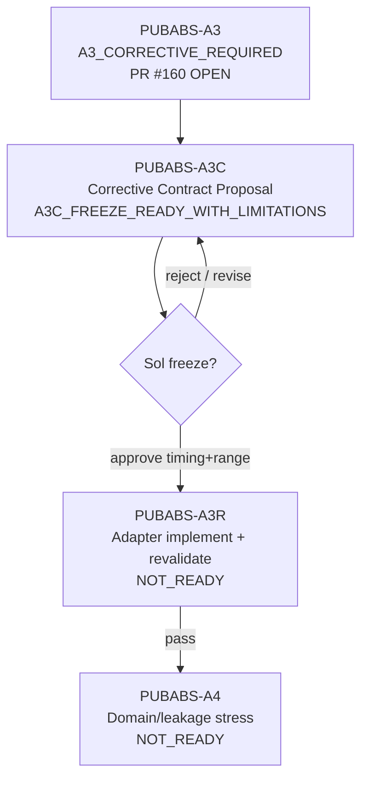

# SafeNest mmWave V2 — PUBABS-A3C C1 Canonical Adapter Corrective Contract Proposal

- Phase: **PUBABS-A3C — corrective contract design (proposal only)**
- Date: 2026-08-26
- Agent role: **Roadmap / signal-contract** (no adapter implementation, no model inference)
- `origin/main` at proposal: `eae5948f3359079dc4dc0135e6ffd11793e88910`
- Reviewed A3 head (PR #160, **not merged**): `e1ffdd63608fd5732d46d890b3e1dcba1b04c8c5`
- Verdict: **`A3C_FREEZE_READY_WITH_LIMITATIONS`**
- Manifest: `datasets/mmwave/manifests/PUBABS_A3C_corrective_contract_proposal/`

This document is a **Sol-facing freeze proposal**. It is **not** an activated adapter contract and does **not** authorize PUBABS-A3R / A4 / membership / M-PV3.8 reopen.

---

## A. Canonical A3 evidence check

| Item | Status |
|---|---|
| PR #160 | **OPEN / not merged** |
| Reviewed head | `e1ffdd63608fd5732d46d890b3e1dcba1b04c8c5` |
| A3 gate on branch | `A3_CORRECTIVE_REQUIRED` |
| Timing | `TIMING_CONTRACT_INCOMPATIBLE` / R1 `UNRESOLVABLE_TIME_GAP` |
| Range | `MULTIPLE_NONLABEL_ADAPTERS_REMAIN` |
| Model inference in A3 | `NOT_EXECUTED` |

**Prerequisite:** merge #160 (or explicitly accept branch evidence) before treating A3 artifacts as `origin/main` canon.

---

## B. Exact cause of A3 failure

1. **Timing:** C1 measured irregular ~18.8 Hz timestamps are not a regular integer-rate grid; frozen R1 `resample_poly` path + 2.5-sample gap rule reject ingress (`UNRESOLVABLE_TIME_GAP`). Linear→10 Hz worked only as **noncanonical probe**.
2. **Range:** No unique Sol-frozen C1 180-bin→1-trace rule; D0 `[0.3,2.0]` m ROI does not transfer; unconstrained dynamic-energy probes often hit ~0.5 m near-field.

Not a failure of C1 “having no data”; a failure of **missing pre-registered ingress contracts**.

---

## C. Existing R1 authority boundary

| Decision | Recommendation |
|---|---|
| Modify frozen R1? | **No** |
| Preserve historical R1? | **Yes** |
| New ingress identity | **`R1T_MEASURED_TIMESTAMP_10HZ_V1`** |

R1 remains the authority for **already-regular native 1-D phase-like traces** (D0 exact 10 Hz; D1 integer-multiple polyphase). Measured irregular streams get a **separately named** R1T ingress whose output may then enter R1 only on the `source already at 10 Hz` median-centering path.

---

## D. Timing corrective options

| ID | Idea | Assessment |
|---|---|---|
| T1 | Linear interp → 10 Hz only | Structurally easy; **aliasing under-specified**; matches A3 probe but weak as freeze |
| T2 | Fixed anti-alias + reconstruction | Needed for downsample integrity; parameters must come from **target Nyquist / R2 band**, not C1 labels |
| T3 | Regularize then frozen R1 resample_poly | Redundant if already building 10 Hz; still needs irregular→regular stage |
| **T4** | **New R1T measured-timestamp ingress** | **Preferred authority model**; keeps R1 immutable |

---

## E. Recommended timestamp contract

```text
RECOMMENDED_TIMESTAMP_RULE = R1T_MEASURED_TIMESTAMP_10HZ_V1
```

**Frozen pipeline (proposal):**

1. Validate finite, monotonic timestamps (ns→s); duplicates → `KEEP_FIRST`.
2. `median_dt`; require `1/median_dt >= 12 Hz` (headroom vs 5 Hz Nyquist of 10 Hz output).
3. Fail-closed if any gap `> max(0.25 s, 2.5*median_dt)` → `INPUT_UNAVAILABLE_UNRESOLVABLE_TIME_GAP`.
4. Linear interpolate onto fixed **20 Hz** intermediate grid from `t0`.
5. Zero-phase **Butterworth N=4, fc=4.0 Hz** (`filtfilt`) on intermediate series.
6. Decimate 2:1 → exact **10.0 Hz** grid `t0 + k/10`.
7. Hand to frozen R1 for **median centering only** (no second resample).

**Anti-alias parameter justification (no C1 labels):** R2/ROLE_L respiration band ≤0.7 Hz; 10 Hz Nyquist=5 Hz; fc=4 Hz is a fixed margin; 20 Hz intermediate is a fixed integer multiple of 10 and ≥ documented ~19 fps.

---

## F. C1 geometry evidence (documentation-backed)

| Fact | Evidence | Status |
|---|---|---|
| Sensor | SLMX4 / Novelda X4 UWB | VERIFIED (SciData/Zenodo lineage) |
| Bins / resolution | 180 bins × **0.0512 m** (~9.2 m) | VERIFIED |
| Wall | 27 cm YTONG | VERIFIED |
| Subject distances | 1 m and 2 m behind wall | VERIFIED (docs); this Data.zip subset is `1_Meter` |
| P0 total radar–subject distance | **1.57 m** | VERIFIED (SciData) |
| Robot positions | −5…+5, 20 cm steps, **stationary per session** | VERIFIED |
| Absence | same setup/positions, no subject (N0 / Empty_space) | VERIFIED |
| Author near-field cut | **drop first 28 range columns** (direct-path / near-field) | VERIFIED (SciData) |
| Through-wall permittivity mapping bin↔meters | — | **UNVERIFIED** |
| Exact Scenario_A optical path vs electrical range | — | **UNVERIFIED** beyond published offsets |

---

## G. Range extraction alternatives

| ID | Idea | Assessment |
|---|---|---|
| RGE1 | Pure fixed geometric bin from 1.57 m | Fragile under −5…+5 path elongation; ABSENT has no target meter truth |
| **RGE2** | **Documented near-field ROI + static-reduced dynamic-energy argmax** | **Recommended**; label-independent; identical both classes |
| RGE3 | Fixed ROI mean/coherent reducer | Defensible alternate; less aligned with D0 PROFILE_001 single-bin canon |
| RGE4 | Metadata distance only for PRESENT | **Reject** — class-dependent / ABSENT undefined |

---

## H. Recommended range contract

```text
RECOMMENDED_RANGE_RULE = C1_ROI_EXCLUDE_NEARFIELD28_DYNENERGY_UNWRAP_V1
```

1. ROI bins **`[28, 179]`** inclusive (SciData near-field exclusion of first 28 columns; ~1.43 m free-space-equivalent cut; same for Empty_space).
2. Per-bin subtract temporal complex mean (static suppression).
3. Select `argmax mean(|dyn|^2)` inside ROI; tie → lowest bin index.
4. `phase = unwrap(angle(z_selected))`.
5. **No class label, subject-label logic, or model score input.**

ABSENT semantics: selected bin is the most dynamic in-ROI radar observation (background/clutter dynamics) supplied to a future false-positive gate — **not** a hidden “human bin.”

---

## I. Phase / preprocessing compatibility

| Step | Rule |
|---|---|
| Complex→phase | `angle` + `unwrap` (D0/R1-compatible; no derivative) |
| Polarity | **Preserve** (R1: sign preserved; cross-source alignment unverified) |
| Centering | Frozen R1 full-recording median after R1T |
| TRAIN z-score | Frozen constants only | class: **`SCALE_RISK_REMAINS`** |

---

## J. Anti-contamination proof

**Not used:**

- PRESENT vs ABSENT metrics, AUC/F1/accuracy
- breathing-peak / RR agreement maximization
- Family B/C logits or confidences
- C1-fitted cutoffs, ROI edges, or z-score refits

**Used only:** repository R1/R2/PROFILE_001 contracts; SciData/Zenodo geometry text; A3 structural failure codes.

---

## K. Corrective verdict

```text
A3C_FREEZE_READY_WITH_LIMITATIONS
```

Limitations: through-wall electrical vs geometric range; angular path variation; HIGH cross-sensor domain risk; TRAIN z-score scale risk.

Not `A3C_MORE_EVIDENCE_REQUIRED`: near-field cut and timing science are sufficient to **pre-register** unique rules. Residual risks are domain limitations, not missing decision keys.

---

## L. Proposed A3R acceptance contract (not executed)

Phase name: **`PUBABS-A3R`** — implement frozen proposal exactly; re-validate A3 structurally.

Acceptance gates (proposal):

1. All **77** C1 `plot_data.csv` sessions parse under the frozen rules (or fail-closed with coded reasons).
2. Identical adapter path for Empty_space and N1–N6 (no class branch).
3. Output cadence exactly **10 Hz**; windows exactly **300** samples / 30 s where VALID.
4. Deterministic replay: same inputs → identical hashes within stated numeric tolerance.
5. No labels/models loaded; no forbidden fitting.
6. Frozen TRAIN preprocessing applied structurally only (no refit).
7. Report remaining domain limitations without claiming membership readiness.

`PUBABS-A3R` / `PUBABS-A4` remain **NOT_READY** until Sol freezes this proposal.

---

## M. Sol Master decisions required

1. **Merge PR #160?** (A3 evidence onto `main`)
2. **Freeze** `R1T_MEASURED_TIMESTAMP_10HZ_V1` as proposed? (do not modify historical R1)
3. **Freeze** `C1_ROI_EXCLUDE_NEARFIELD28_DYNENERGY_UNWRAP_V1`?
4. **Authorize PUBABS-A3R** implementation/revalidation only after (2)+(3)?
5. Confirm A4 stays blocked until A3R gate passes.

---

## N. Lane update (conceptual)



---

## Explicit non-actions

- No adapter code activation beyond proposal text
- No model inference / membership / M-PV3.8 mutation
- No A3R/A4 execution
- No silent R1 rewrite
