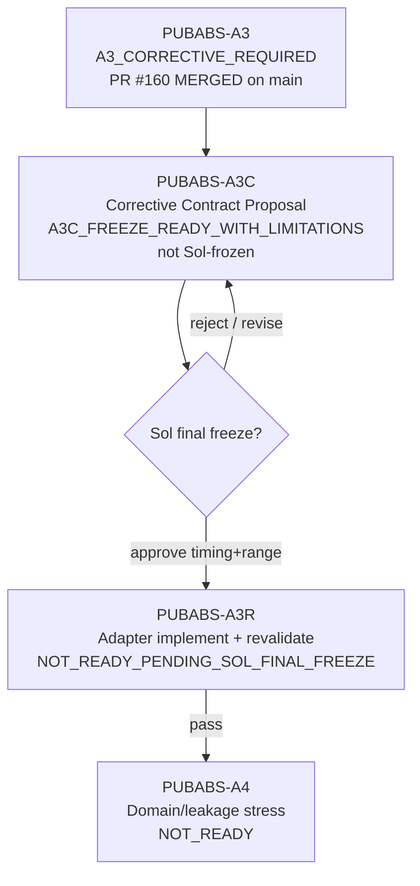

# SafeNest mmWave V2 — PUBABS-A3C C1 Canonical Adapter Corrective Contract Proposal

- Phase: **PUBABS-A3C — corrective contract design (proposal only)**
- Date: 2026-08-26
- Correction: Sol Master review of PR #161 (range scope, R1T temporal scope, numeric provenance, post-#160 base)
- Agent role: **Roadmap / signal-contract** (no adapter implementation, no model inference)
- `origin/main` at this corrected proposal: `78c7d741f5f8d6b1cf0e7f08952e9810b2bf1d8d`
- Merged A3 evidence (PR #160): reviewed head `e1ffdd63608fd5732d46d890b3e1dcba1b04c8c5` = merge commit above
- Verdict: **`A3C_FREEZE_READY_WITH_LIMITATIONS`**
- `proposal_status`: **`PROPOSAL_ONLY_NOT_AUTHORITATIVE`** until Sol final freeze
- `pubabs_a3r_status`: **`NOT_READY_PENDING_SOL_FINAL_FREEZE`**
- Manifest: `datasets/mmwave/manifests/PUBABS_A3C_corrective_contract_proposal/`

This document is a **Sol-facing freeze proposal**. It is **not** an activated adapter contract and does **not** authorize PUBABS-A3R / A4 / membership / M-PV3.8 reopen.

---

## A. Canonical A3 evidence check

| Item | Status |
|---|---|
| PR #160 | **MERGED** |
| Reviewed head | `e1ffdd63608fd5732d46d890b3e1dcba1b04c8c5` |
| Merge commit / `origin/main` | `78c7d741f5f8d6b1cf0e7f08952e9810b2bf1d8d` |
| A3 gate on main | `A3_CORRECTIVE_REQUIRED` |
| Timing | `TIMING_CONTRACT_INCOMPATIBLE` / R1 `UNRESOLVABLE_TIME_GAP` |
| Range | `MULTIPLE_NONLABEL_ADAPTERS_REMAIN` |
| Model inference in A3 | `NOT_EXECUTED` |

**Prerequisite satisfied:** A3 artifacts are canonical on `origin/main` via merged PR #160. This A3C text is still a proposal, not a freeze.

---

## B. Exact cause of A3 failure

1. **Timing:** C1 measured irregular ~18.8 Hz timestamps are not a regular integer-rate grid; frozen R1 `resample_poly` path + 2.5-sample gap rule reject ingress (`UNRESOLVABLE_TIME_GAP`). Linear→10 Hz worked only as **noncanonical probe**.
2. **Range:** No unique Sol-frozen C1 180-bin→1-trace rule; D0 `[0.3,2.0]` m ROI does not transfer; unconstrained dynamic-energy probes often hit ~0.5 m near-field.

Not a failure of C1 “having no data”; a failure of **missing pre-registered ingress contracts**.

C1 duration asymmetry (structural observation only, **not** a fitted parameter): A3 probes show ABSENT ≈900 s and PRESENT ≈180 s. Whole-record operators would therefore observe class-correlated duration. All frozen observation scopes below are the **identical first 30.0 s** for both classes.

---

## C. Existing R1 authority boundary

| Decision | Frozen recommendation |
|---|---|
| Modify frozen R1? | **No** |
| Preserve historical R1? | **Yes** (`R1-A_NATIVE_CENTERED_RELATIVE_MOTION_10HZ_V1`) |
| New ingress identity | **`R1T_MEASURED_TIMESTAMP_10HZ_V1`** |

R1 remains the authority for **already-regular native 1-D phase-like traces** (D0 exact 10 Hz; D1 integer-multiple polyphase). Measured irregular streams get a **separately named** R1T ingress whose output enters R1 only on the `NONE_SOURCE_ALREADY_AT_TARGET_RATE` median-centering path.

---

## D. Timing corrective options

| ID | Idea | Assessment |
|---|---|---|
| T1 | Linear interp → 10 Hz only | Structurally easy; **aliasing under-specified** |
| T2 | Fixed anti-alias + reconstruction | Required for downsample integrity; parameters from **target Nyquist / R2 band**, not C1 labels |
| T3 | Regularize then frozen R1 `resample_poly` | Redundant if already building 10 Hz |
| **T4** | **New R1T measured-timestamp ingress** | **Selected**; keeps R1 immutable |

---

## E. Exact timestamp contract

```text
RECOMMENDED_TIMESTAMP_RULE = R1T_MEASURED_TIMESTAMP_10HZ_V1
R1T_TEMPORAL_SCOPE         = WINDOW_LOCAL
```

Single-valued pipeline:

1. Finite timestamps; duplicates **`KEEP_FIRST`**; remaining timestamps must **strictly increase**.
2. `t0` = first remaining timestamp. Observation interval = **`[t0, t0+30.0]`**. **No later-interval search.**
3. `median_dt` from observation-interval deltas only. Require `1/median_dt >= 12.0` Hz → else `SOURCE_INVALID_MEDIAN_RATE_TOO_LOW`.
4. Any observation-interval gap `> 2.5 * median_dt` → `INPUT_UNAVAILABLE_UNRESOLVABLE_TIME_GAP`.
5. After range lock, `phase = unwrap(angle(z_selected))` on observation-interval native samples (no derivative).
6. Linear-interpolate that phase onto the frozen 20 Hz grid `tau[m] = t0 + m/20`, `m=0..598` (599 points, span `[t0, t0+29.9]`). **No extrapolation.** Every `tau[m]` must lie in `[t_obs_first, t_obs_last]`.
7. Zero-phase Butterworth **order 4, fc=4.0 Hz, fs=20.0 Hz**, `filtfilt` **`padtype=odd`, `padlen=15`, `method=pad`**. **Guard interval of real samples after 30.0 s = 0.0 s.**
8. Decimate even indices → exactly **300** samples `t[k] = t0 + k/10`, `k=0..299`. Exclusive end `t0+30.0`.
9. Hand to frozen R1 for **median centering only** (already-at-10 Hz). R1 median is therefore the median of these 300 samples.

Gaps, rate, coverage, and interpolation are evaluated **only** on the 30.0 s observation interval, not on unused later samples.

---

## F. Timing parameter provenance

No value was chosen because it lets more C1 files pass.

| Parameter | Value | Classification | Authority |
|---|---|---|---|
| Minimum median source rate | **12.0 Hz** | `CONSERVATIVE_GOVERNANCE_CHOICE` | R1 already fails below 10 Hz; `fc=4` Hz requires source rate > 8 Hz. 12.0 Hz is a fixed floor above both. Not fitted on C1. |
| 0.25 s token | **not a source-gap threshold** | `FROM_EXISTING_FROZEN_CONTRACT` | R1 gap = 2.5 source samples; at 10 Hz target that identity is 0.25 s. Documented only to explain the previous token. **Not applied** as `max(0.25 s, ·)`. |
| Gap limit | **`2.5 * median_dt`** | `FROM_EXISTING_FROZEN_CONTRACT` | Frozen R1: fail if `max(delta) > expected_dt * 2.5`. Irregular measured time uses `median_dt` in place of `expected_dt`. Replaces `max(0.25 s, 2.5*median_dt)`, which relaxed R1 for sources faster than 10 Hz. **Not tuned** against any C1 worst-gap statistic. Fail-closed: large gaps are not interpolated. |
| Intermediate grid | **20.0 Hz** | `FROM_TARGET_10HZ_NYQUIST` | Smallest integer multiple of 10 Hz that allows exact 2:1 decimation onto the frozen ROLE_L 10 Hz grid. C1 ~18.8 Hz is `C1_STRUCTURAL_OBSERVATION_ONLY` that 20 Hz is near native; it is not the selection reason. |
| Butterworth order | **4** | `CONSERVATIVE_GOVERNANCE_CHOICE` | R1 anti-alias is Kaiser `resample_poly`, not Butterworth, so order cannot be inherited from R1. Fixed conventional IIR order. Not fitted. |
| Cutoff | **4.0 Hz** | `FROM_TARGET_10HZ_NYQUIST` | 10 Hz Nyquist = 5 Hz; cutoff must be < 5 Hz. 4.0 Hz = 0.8 × Nyquist. R2/ROLE_L band ≤ 0.7 Hz only proves 4.0 Hz does not invade the physiological band; 4.0 Hz is not a respiratory-isolation cutoff. |

---

## G. C1 geometry evidence (documentation-backed)

| Fact | Evidence | Status |
|---|---|---|
| Sensor | SLMX4 / Novelda X4 UWB | VERIFIED (SciData/Zenodo lineage) |
| Bins / resolution | 180 bins × **0.0512 m** (~9.2 m) | VERIFIED |
| Wall | 27 cm YTONG | VERIFIED |
| Subject distances | 1 m and 2 m behind wall | VERIFIED (docs); this Data.zip subset is `1_Meter` |
| P0 total radar–subject distance | **1.57 m** | VERIFIED (SciData) |
| Robot positions | −5…+5, 20 cm steps, **stationary per session** | VERIFIED |
| Absence | same setup/positions, no subject (N0 / Empty_space) | VERIFIED |
| Author near-field cut | **drop first 28 range columns** | VERIFIED (SciData) |
| Through-wall permittivity mapping bin↔meters | — | **UNVERIFIED** |

---

## H. Range extraction alternatives

| ID | Idea | Assessment |
|---|---|---|
| RGE1 | Pure fixed geometric bin from 1.57 m | Fragile under −5…+5 path elongation; ABSENT has no target meter truth |
| **RGE2 + RG-S1** | **Documented near-field ROI + 30.0 s static-reduced dynamic-energy argmax, session lock** | **Selected** |
| RGE2 + RG-S2 | Same ROI/argmax, but **window-local** re-selection | Rejected (duration-asymmetric re-selection count; see §I) |
| RGE3 | Fixed ROI mean/coherent reducer | Defensible alternate; less aligned with D0 PROFILE_001 single-bin canon |
| RGE4 | Metadata distance only for PRESENT | **Reject** — class-dependent / ABSENT undefined |

---

## I. Exact range contract

```text
RECOMMENDED_RANGE_RULE                 = C1_ROI_EXCLUDE_NEARFIELD28_DYNENERGY_UNWRAP_V1
RANGE_SELECTION_OBSERVATION_DURATION   = 30.0 seconds
RANGE_SELECTION_POLICY                 = RG-S1
BIN_LOCK                               = SESSION
ROI                                    = bins [28, 179] inclusive
TIE                                    = lowest bin index
COMPLEX_TO_PHASE                       = unwrap(angle(z_selected))
UNWRAP                                 = numpy.unwrap default; no derivative
POLARITY                               = preserve
```

Identical for PRESENT and ABSENT.

### RG-S1 (selected)

1. Take the **first** source interval `[t0, t0+30.0]`. If it is not valid under the timestamp contract, **fail-closed**. Do not search a later 30 s interval.
2. Use **only** that identical-duration interval for per-bin complex static mean, dynamic residual, `mean(|dyn|^2)`, and ROI argmax.
3. Lock `selected_bin` for the remainder of the session. Do not re-run argmax per window.
4. Tie → lowest bin index.

Formula:

```text
for b in [28, 179]:
    mu_b   = mean(z_b(t)) for t in [t0, t0+30.0]
    dyn_b  = z_b(t) - mu_b
    E_b    = mean(|dyn_b|^2)
selected_bin = min{ b : E_b = max_c E_c }
```

ABSENT semantics: selected bin is the most dynamic in-ROI radar observation (background/clutter dynamics) supplied to a future false-positive gate — **not** a hidden “human bin.”

### RG-S1 versus RG-S2 (no model metrics)

| | RG-S1 (session, first 30.0 s) | RG-S2 (window-local) |
|---|---|---|
| Observation duration | identical 30.0 s both classes | each window 30.0 s, but ABSENT can emit ~30 windows vs PRESENT ~6 |
| Session stationarity | matches SciData “stationary per session” | re-selects even though the robot does not move |
| ROLE_L first-300 consumption | identical to RG-S2 on the consumed window | diverges only on unused later windows |
| Class-correlated extra freedom | none | ABSENT-side extra argmax opportunities |

**RG-S2 is not selected.** It is not shown superior on any non-model criterion. Whole-record energy (a third option) is rejected because ABSENT averaging would span ~5× longer than PRESENT.

30.0 s is **ROLE_L frozen context**, not a C1-label duration.

---

## J. Filter temporal-scope decision

```text
R1T_TEMPORAL_SCOPE = WINDOW_LOCAL
```

**Not** `FULL_RECORD_ALLOWED_BY_EXISTING_R1`.

Existing R1/ROLE_L **does** process a full native recording (Kaiser `resample_poly` on the whole series, then full-recording median, then `trace[:300]`). That does **not** authorize a new IIR `filtfilt` over C1’s unused tail:

- `filtfilt` backward IIR carries the entire remaining series into the first 30 s.
- C1 ABSENT ≈900 s vs PRESENT ≈180 s would then leak **class-correlated future context** into the ROLE_L window.
- Frozen R1 anti-alias is FIR polyphase, not Butterworth IIR. The new operator cannot inherit R1’s full-record FIR scope.
- ROLE_L consumes only 30.0 s / 300 samples.

WINDOW_LOCAL freeze:

| Item | Value |
|---|---|
| Window start | `t0` after KEEP_FIRST |
| Source interval | `[t0, t0+30.0]` |
| Interpolation support | no point outside `[t_obs_first, t_obs_last]` |
| Extrapolation | forbidden |
| 20 Hz grid | `t0 + m/20`, m=0..598 |
| 10 Hz grid | `t0 + k/10`, k=0..299 (300 points) |
| filtfilt pad | `odd`, `padlen=15` (synthetic; not real post-30 s samples) |
| Real guard interval | **0.0 s** |
| Later samples | not consumed by R1T or by R1 median |

Correspondence limitation (not a missing decision): historical D0 R1 median used the full native recording (typically 40–60 s). This proposal’s R1 median is the median of the 30.0 s emitted series. That is accepted to keep IIR filtering and the median duration-invariant across C1 classes.

---

## K. Phase / preprocessing compatibility

| Step | Rule |
|---|---|
| Complex→phase | `angle` + `unwrap` (D0/R1-compatible; **no derivative**) |
| Polarity | **Preserve** (R1: sign preserved; cross-source alignment unverified) |
| Centering | Frozen R1 median of the 300-sample R1T output |
| TRAIN z-score | Frozen constants only | class: **`SCALE_RISK_REMAINS`** |

---

## L. Anti-contamination proof

**Not used:**

- PRESENT vs ABSENT metrics, AUC/F1/accuracy
- breathing-peak / RR agreement maximization
- Family B/C logits or confidences
- C1-fitted cutoffs, ROI edges, gap thresholds, or z-score refits
- C1 file-pass-rate as a parameter objective
- Whole-record energy or whole-record IIR as a hidden class-duration feature

**Used only:**

- Frozen R1/R2/ROLE_L contracts (10 Hz, 30 s / 300, 2.5-sample gap, median centering, 0.7 Hz band as a non-invasion check)
- SciData/Zenodo near-field 28-column exclusion and session stationarity
- A3 structural failure codes
- C1 900 s vs 180 s **only** as an anti-contamination constraint that forbids whole-record operators, **not** as a fitted duration

---

## M. Corrective verdict

```text
A3C_FREEZE_READY_WITH_LIMITATIONS
```

Freeze-ready items now single-valued: post-#160 main, 30.0 s range observation, session lock, RG-S1, WINDOW_LOCAL R1T, numeric provenance, identical PRESENT/ABSENT rules.

Remaining limitations are domain/correspondence limits, not missing decision keys:

- through-wall electrical vs geometric range
- angular path variation across robot positions
- WINDOW_LOCAL 30 s median vs historical D0 full-record median
- HIGH cross-sensor domain risk
- TRAIN z-score scale risk

---

## N. Proposed A3R acceptance contract (not executed, not authorized)

Phase name: **`PUBABS-A3R`** — implement this proposal exactly, only after Sol final freeze.

`PUBABS-A3R` / `PUBABS-A4` remain **`NOT_READY_PENDING_SOL_FINAL_FREEZE`**.

Conceptual acceptance gates (still non-authoritative):

1. All **77** C1 `plot_data.csv` sessions parse under the frozen rules (or fail-closed with coded reasons).
2. Identical adapter path for Empty_space and N1–N6 (no class branch).
3. Output cadence exactly **10 Hz**; ROLE_L windows exactly **300** samples / 30.0 s where VALID.
4. Deterministic replay: same inputs → identical hashes within stated numeric tolerance.
5. No labels/models loaded; no forbidden fitting.
6. Frozen TRAIN preprocessing applied structurally only (no refit).
7. Report remaining domain limitations without claiming membership readiness.

---

## O. Sol Master decisions required

1. **Freeze** `R1T_MEASURED_TIMESTAMP_10HZ_V1` as specified (`WINDOW_LOCAL`)? Do not modify historical R1.
2. **Freeze** `C1_ROI_EXCLUDE_NEARFIELD28_DYNENERGY_UNWRAP_V1` as specified (`RG-S1`, 30.0 s, session lock)?
3. **Authorize PUBABS-A3R** only after (1)+(2)?
4. Confirm A4 stays blocked until A3R gate passes.

PR #160 merge is complete and is no longer an open Sol question.

---

## P. Lane update (conceptual)



---

## Explicit non-actions

- No adapter code activation beyond proposal text
- No model inference / membership / M-PV3.8 mutation
- No A3R/A4 execution
- No silent R1 rewrite
- No merge of PR #161
