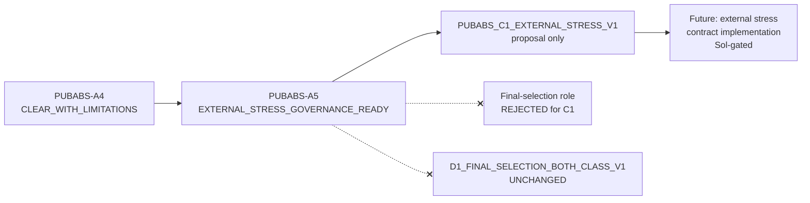

# SafeNest mmWave V2 — PUBABS-A5 C1 Public Membership Governance Design

- Phase: **PUBABS-A5**
- Date: 2026-08-26
- Base SHA (post-PR #163): `70886357a859bd46b8b1cd77da1c9d0837188975`
- Branch: `docs/mmwave-pubabs-a5-membership-governance`
- Role: **governance / contract design only** — membership **not** constructed
- Selected route: **`A5_ROUTE_EXTERNAL_SAFETY_STRESS_ONLY`**
- Proposed identity (if later constructed): **`PUBABS_C1_EXTERNAL_STRESS_V1`**
- A5 verdict: **`A5_EXTERNAL_STRESS_GOVERNANCE_READY`**
- Next-phase recommendation: **`RECOMMEND_EXTERNAL_STRESS_CONTRACT_IMPLEMENTATION`**
- Manifest: `datasets/mmwave/manifests/PUBABS_A5_c1_membership_governance/`

M-PV3.8 remains `RESOURCE_BLOCKED_CLOSED`. D1 unchanged. No model inference. No adapter retune.

---

## Accepted A4 limitations (not downgraded)

| Axis | Value |
|---|---|
| AVAILABILITY_CLASS_NEUTRALITY | NOT_SUPPORTED |
| VALID_SUBSET_REPRESENTATIVENESS | NOT_SUPPORTED |
| TEMPORAL_ACQUISITION_COMPARABILITY | NOT_SUPPORTED |
| ADAPTER_AVAILABILITY_LEAKAGE | HIGH_RISK |
| PATH_METADATA_LEAKAGE | LOW_RISK |
| SELECTED_BIN_CONFOUND_RISK | MEDIUM_RISK |
| TRAIN_ZSCORE_SCALE_RISK | HIGH |
| CROSS_SENSOR_DOMAIN_RISK | HIGH_RISK |

VALID PRESENT counts: N1=1, N2=1, N3=9, N4=8, N5=6, **N6=0**.  
`VALID_34 ≠` neutral random subset of C1.

---

## Route comparison

### Route A — Final-selection both-class membership
**REJECTED.** Class-correlated availability, non-representative VALID subset, N6=0, N1/N2 singletons, HIGH scale risk, and HIGH UWB↔MR60 domain risk cannot be shown non-blocking for model-selection membership. Silent D1 substitution is forbidden.

### Route B — External safety / domain stress
**SELECTED.** Preserve **ALL 77** as availability denominator; use VALID-34 only under `CONDITIONAL_ON_ADAPTER_VALID`. Separately named identity `PUBABS_C1_EXTERNAL_STRESS_V1`. Does not replace `D1_FINAL_SELECTION_BOTH_CLASS_V1`.

### Route C — Research-only / reject
**Not selected** as primary. Full reject would discard actionable availability-stress evidence; research-only understates the need for a governed fail-closed external contract. Research use remains permitted as non-decision evidence.

---

## Selected primary route

```text
A5_ROUTE_EXTERNAL_SAFETY_STRESS_ONLY
```

### Two-layer external contract (proposal only; not executed)

1. **Layer 1 — ALL 77:** availability / ingress safety (VALID + FAIL_CLOSED retained in denominator).
2. **Layer 2 — VALID 34:** conditional structural/domain evaluation only; **must not** be generalized to all C1 sessions.

Forbidden: silent drop of 43 FAIL_CLOSED; UNAVAILABLE→ABSENT/NORMAL; corpus-wide metrics from VALID-only.

---

## Availability governance

- Denominator default: **ALL_77**
- Bias classification: **`BLOCKING_FOR_FINAL_SELECTION_BUT_ALLOWED_FOR_EXTERNAL_STRESS`**
- Hard rule: adapter_status never maps to PRESENT/ABSENT/NORMAL/RAPID/APNEA/quality±

---

## Subject / position / class policies

- **Subject:** N6=0 and N1/N2 singleton VALID are **blocking for final-selection**; for external stress they are **mandatory disclosed limitations** (no repair via later windows / adapter retune).
- **Position:** report strata for −5…+5; do not require fabricated matched balance for external stress; matched PRESENT/ABSENT identity would be required only if final-selection were ever reconsidered (it is not).
- **Class balance:** preserve natural ALL_77 / VALID_34 compositions; forced 1:1 discard forbidden without separate Sol authorization (would hide PRESENT failure mass).

---

## Scale / domain / D1

- Scale policy: **`EXTERNAL_STRESS_ALLOWED_WITH_SCALE_LIMITATION`** (no C1 scaler refit).
- Domain: eligible for **availability stress** and **limited external/negative-control** evidence; **not** final-selection / in-domain MR60 equivalence.
- D1: **`C1 DOES NOT silently populate D1_FINAL_SELECTION_BOTH_CLASS_V1`**. No D1+C1 mix without separate governance.

---

## Future authority (A5 does not execute)

| Authority | Classification |
|---|---|
| Model inference | `MODEL_INFERENCE_ELIGIBLE_FOR_FUTURE_SEPARATE_PHASE` (external-stress scope only; Sol must authorize) |
| Membership construction | `MEMBERSHIP_CONSTRUCTION_ELIGIBLE_FOR_SEPARATE_PHASE` (`PUBABS_C1_EXTERNAL_STRESS_V1` two-layer only; not D1) |

---

## Terminal guards

`UNAVAILABLE_NEVER_CLASS_LABEL` · `VALID_SUBSET_NOT_CORPUS_REPRESENTATIVE` · `NO_D1_SUBSTITUTION` · `NO_MODEL_SELECTION_CLAIM_FROM_EXTERNAL_STRESS` · `NO_THRESHOLD_TUNING_ON_C1` · `NO_SCALER_REFIT_ON_C1` · `NO_ADAPTER_RETUNING` · `NO_POSTHOC_SUBJECT_OR_POSITION_SELECTION_BY_MODEL_RESULTS` · `NO_LATER_WINDOW_RESCUE` · `NO_SILENT_DROP_OF_FAIL_CLOSED` · `NO_M_PV38_REOPEN_FROM_A5` · `LAYER2_RESULTS_CONDITIONAL_ON_ADAPTER_VALID_ONLY` · `PRE_REGISTER_QUOTAS_BEFORE_ANY_INFERENCE`

---

## A5 governance verdict

```text
A5_EXTERNAL_STRESS_GOVERNANCE_READY
```

Next-phase recommendation:

```text
RECOMMEND_EXTERNAL_STRESS_CONTRACT_IMPLEMENTATION
```

Does **not** authorize membership construction, inference, M-PV3.8 reopen, or M-PV4.

---

## Affected-lane Mermaid (proposed continuation)



Candidate Master Execution Map is **not** on `origin/main`; not imported into this branch.

---

## Explicit non-actions

- MODEL_INFERENCE = NOT_EXECUTED
- MEMBERSHIP = NOT_CONSTRUCTED
- ADAPTER_RULES = UNCHANGED
- HISTORICAL_R1 = UNCHANGED
- D1 = UNCHANGED
- M-PV3.8 = RESOURCE_BLOCKED_CLOSED
- M-PV4 = UNAUTHORIZED
- D2 = LOCKED
- NEXT_PHASE = NOT_EXECUTED
