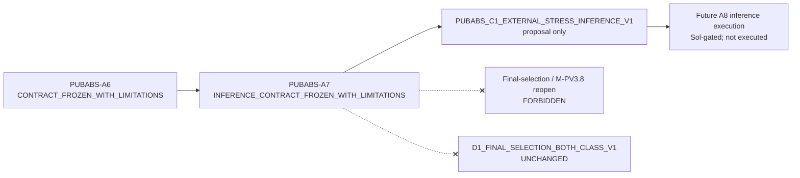

# SafeNest mmWave V2 — PUBABS-A7 C1 External Stress Inference Contract Design

- Phase: **PUBABS-A7**
- Date: 2026-08-27
- Base SHA (post-PR #165 `origin/main`): `c25ea9bf8343fe1d382f2af781edf48a02398f4a`
- Branch: `docs/mmwave-pubabs-a7-external-stress-inference-contract`
- Role: **roadmap / inference-contract design only** — no model execution
- Parent contract: **`PUBABS_C1_EXTERNAL_STRESS_V1`**
- Parent SHA-256: `d0353c9bf7837a2520364903b53075bde44cddf10b88c3fef58aa4054bbb3310`
- Proposed inference identity: **`PUBABS_C1_EXTERNAL_STRESS_INFERENCE_V1`**
- A7 gate: **`A7_INFERENCE_CONTRACT_FROZEN_WITH_LIMITATIONS`**
- Next-phase recommendation: **`RECOMMEND_A8_EXTERNAL_STRESS_INFERENCE_EXECUTION`**
- Manifest: `datasets/mmwave/manifests/PUBABS_A7_c1_external_stress_inference_contract/`

Model inference: **not** executed. Candidate outputs: **not** inspected. Winner / ranking: **forbidden**. M-PV3.8 remains `RESOURCE_BLOCKED_CLOSED`. D1 unchanged.

---

## Objective

Pre-register the external-stress inference contract so a later Sol-gated A8 can run the frozen six-member ROLE_L panel on C1 without inventing metrics, thresholds, adapters, or a winner.

```text
PUBABS_C1_EXTERNAL_STRESS_INFERENCE_V1
  parent: PUBABS_C1_EXTERNAL_STRESS_V1
  panel:  B11, B23, B47, C11, C23, C47
  Layer1: AVAILABILITY / INGRESS over ALL77
  Layer2: CONDITIONAL_ON_ADAPTER_VALID metrics over VALID34
```

---

## PR #165 merge receipt

| Field | Value |
|---|---|
| PR | https://github.com/sheepmeat/test/pull/165 |
| State at A7 start | `MERGED` (already merged; A7 did not re-merge) |
| Reviewed head | `0e06f6ba1d69154585dc9a41fefac9ea517df520` — exact match |
| Reviewed base | `e794c00cf8e13effc9ca89dbb1f6c34e5ddc397e` — exact match |
| `PR165_MERGE_COMMIT` | `c25ea9bf8343fe1d382f2af781edf48a02398f4a` |
| `POST_MERGE_ORIGIN_MAIN` | `c25ea9bf8343fe1d382f2af781edf48a02398f4a` |
| Head drift | none |

---

## Parent external-stress contract integrity

Required A6 identities are unchanged:

| Identity | SHA-256 / value |
|---|---|
| `PUBABS_C1_EXTERNAL_STRESS_V1` | `d0353c9bf7837a2520364903b53075bde44cddf10b88c3fef58aa4054bbb3310` |
| adapter contract hash | `cfce866f659658e772e833f64e881549a4244b8c9daaa85423b343f34c424446` |
| Layer1 manifest | `cefc7a3820ebb644a9553b3eaad9f4ec600ea555bc25ed891f236cc50c6632f5` |
| Layer2 manifest | `01a1db3ef56e1071896f054a5baad397035ca6d989f42f2d1129d250b6867c7c` |

Layer1 ALL77: 11 ABSENT, 66 PRESENT, 34 VALID, 43 FAIL_CLOSED.

Layer2 VALID34: 9 ABSENT, 25 PRESENT; subjects N1=1 N2=1 N3=9 N4=8 N5=6 **N6=0**. Never generalize to 77.

---

## Frozen candidate panel

All six ROLE_L Family B/C seeds, fixed order, no cherry-pick:

| Panel | Key | Candidate id | Input dim | Bytes | Checkpoint SHA-256 |
|---|---|---|---:|---:|---|
| B11 | `family_b/seed_11` | `M-PV2_FAMILY_B_TRACE_TCN_BREATHING_RR_QUALITY` | 621 | 76473 | `5633a7ee…aa8b1a6` |
| B23 | `family_b/seed_23` | same | 621 | 76473 | `8f7de6f5…e251a2c` |
| B47 | `family_b/seed_47` | same | 621 | 76473 | `ed3da35a…f4db280` |
| C11 | `family_c/seed_11` | `M-PV2_FAMILY_C_HYBRID_TRACE_F2_BREATHING_RR_QUALITY` | 671 | 89337 | `539bd602…82f7768` |
| C23 | `family_c/seed_23` | same | 671 | 89337 | `ce99a653…d6d70de` |
| C47 | `family_c/seed_47` | same | 671 | 89337 | `2f1b446c…34cb5a1` |

Full hashes and parameter SHAs are in `candidate_artifact_receipts.json`. A7 verified **file SHA-256 and byte counts only**; models were not loaded and outputs were not inspected.

Excluded: Family A (`ROLE_L_RR_QUALITY`), M-PV3.5 isolation CNN, ROLE_S 15 s.

---

## Runtime / I/O recovered (not invented)

- Format: **PyTorch float32 state dict** (`.pt`). Torch 2.8.0, deterministic CPU, 1 thread.
- **TFLite / INT8:** not present and explicitly forbidden in M-PV2 (`INT8_QUANTIZATION`, `TFLITE_CONVERSION`). Not a missing-identity gap; substitution in A8 is an abort.
- Heads (B and C): `breathing` logit → sigmoid; `rr` linear inverse-z; `quality` logit → sigmoid.
- Frozen breathing threshold: **0.5** (`USE_FROZEN_THRESHOLD_ONLY`).
- TRAIN scaler SHA-256: `5a2583b5b5064be5480b0cf56f2a2c12d40a4a2d005eb087dc8e12106881159c`. Trace mean `0.5681105335535223`, std `10.976509586515288`. C1 refit **FORBIDDEN**.

Conceptual ROLE_L shape remains `[B,300,1]`. Actual Family B/C inputs are **621 / 671** concatenations of z-scored trace, mask, scale (12), quality (9), and Family C F2 (25+25). A6 tensors freeze `r1_centered` / `train_zscore_trace` hashes; they do **not** pre-materialize 621/671 vectors.

A8 must reconstruct those vectors with **frozen R2 F2/F3** on Layer2 `r1_centered`, then apply the frozen M-PV2 `_feature_matrix` **once**. Feeding `train_zscore_trace` into the trace z-score step is `A8_ABORT_DOUBLE_TRACE_ZSCORE`. If R2 cannot run without a C1-specific change: `A8_ABORT_FEATURE_VECTOR_CONTRACT_GAP`.

---

## Layer-1 reporting

ALL77 is availability / ingress only. FAIL_CLOSED (43) stays in the denominator as `UNAVAILABLE`. A8 must not fabricate predictions for FAIL_CLOSED. `UNAVAILABLE ≠ ABSENT ≠ NORMAL`.

---

## Layer-2 metric registry (pre-registered)

Population: VALID34, label **`CONDITIONAL_ON_ADAPTER_VALID`**. ABSENT n=9 remains visible in every denominator.

**PRIMARY (frozen before any inference):**

1. `L2_ABSENT_EMISSION_COUNT` — ABSENT sessions with breathing ≥ 0.5
2. `L2_ABSENT_EMISSION_RATE` — count / 9
3. `L2_PRESENT_RECALL` — PRESENT n=25 at the same frozen threshold

**SECONDARY:** confusion counts, precision/F1/Brier where defined (`NOT_APPLICABLE` if undefined; never zero-imputed), six-seed table in fixed order, subject/position strata, Layer1 availability table.

**FORBIDDEN:** RR accuracy / within-k-bpm, clinical apnea, quality AUROC without C1 Q2 GT, winner/composite/ranking, M-PV3.8 utility guards as C1 pass/fail, threshold sweep, VALID34 labeled as all-77.

Interpretation default: **`DESCRIPTIVE_ONLY`**. No canonical external-stress safety threshold exists in repo evidence; A7 does not mint one.

---

## Physiology / quality semantics

C1 ABSENT is `NO_HUMAN_TARGET` empty-space (A2), not apnea or breath-hold. PRESENT RR accuracy is forbidden without GT. Quality head remains unscored (no Q2 synthetic overlay on C1). I1 fail-closed: unavailable input must not emit PRESENT/ABSENT/NORMAL/APNEA.

---

## Anti-ranking / anti-tuning

`NO_WINNER` · `NO_RANKING` · `NO_COMPOSITE` · `NO_SEED_OR_FAMILY_SELECTION` · `USE_FROZEN_THRESHOLD_ONLY` · `C1_SCALER_REFIT FORBIDDEN` · `FINAL_SELECTION_USE = FORBIDDEN`.

Panel-level reporting is side-by-side in order B11…C47. Agreement counts are descriptive only.

---

## Preserved global state

```text
D1_FINAL_SELECTION_BOTH_CLASS_V1 = UNCHANGED
M-PV3.8 = RESOURCE_BLOCKED_CLOSED
membership = BLOCKED_INVALID_FINAL_MEMBERSHIP
evaluation = NOT_EXECUTED
M-PV4 = UNAUTHORIZED
D2 = LOCKED
PV4↔PV3X = ORDER_UNRESOLVED
```

M-PV3.8 gates are **not applicable** to C1 by default. A8 cannot reopen M-PV3.8 or select/drop candidates.

---

## A7 gate

```text
A7_INFERENCE_CONTRACT_FROZEN_WITH_LIMITATIONS
```

Limitations retained (not downgraded): HIGH TRAIN-zscore scale mismatch; HIGH UWB↔MR60 domain risk; VALID34 not corpus-representative; ABSENT n=9; N6=0; F2/F3 vectors not pre-materialized on A6 tensors; RR/quality unscored; no canonical C1 safety threshold.

Allowed A7 vocabulary (one of six): `A7_INFERENCE_CONTRACT_FROZEN` · `A7_INFERENCE_CONTRACT_FROZEN_WITH_LIMITATIONS` · `A7_BLOCKED_MODEL_CONTRACT_GAP` · `A7_BLOCKED_PARENT_CONTRACT_DRIFT` · `A7_BLOCKED_LAYER_OR_PANEL_IDENTITY_DRIFT` · `A7_BLOCKED_INSUFFICIENT_RUNTIME_CONTRACT`.

---

## A8 recommendation

```text
RECOMMEND_A8_EXTERNAL_STRESS_INFERENCE_EXECUTION
```

Recommendation only. A8 is **not** executed and is **not** authorized by this PR. Allowed A8 vocabulary (one of four): `RECOMMEND_A8_EXTERNAL_STRESS_INFERENCE_EXECUTION` · `RECOMMEND_A8_HOLD` · `DO_NOT_AUTHORIZE_A8` · `RECOMMEND_A8_ONLY_AFTER_CONTRACT_REPAIR`.

A8 integrity abort codes include A6/layer/panel/artifact/trace/scaler drift, double z-score, FAIL_CLOSED fabrication, winner selection, TFLite substitution, and feature-vector contract gap.

---

## Affected-lane Mermaid



---

## Explicit non-actions

- MODEL_INFERENCE = NOT_EXECUTED
- CANDIDATE_OUTPUTS = NOT_INSPECTED
- WINNER / RANKING / COMPOSITE = NOT_CREATED
- THRESHOLDS = UNCHANGED (frozen 0.5)
- ADAPTER_RULES = UNCHANGED
- HISTORICAL_R1 = UNCHANGED
- D1 = UNCHANGED
- M-PV3.8 = RESOURCE_BLOCKED_CLOSED
- M-PV4 = UNAUTHORIZED
- D2 = LOCKED
- A8 = NOT_EXECUTED
- A7 PR = NOT_MERGED_BY_THIS_PHASE
