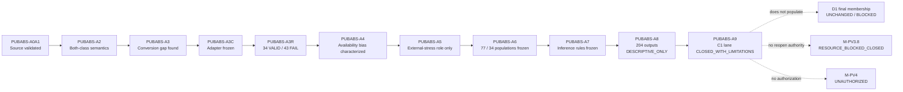

# SafeNest mmWave V2 — PUBABS-A9 C1 External-Stress Evidence Terminal Closure

- Phase: **PUBABS-A9**
- Date: 2026-08-27
- Base SHA (post-PR #167 `origin/main`): `cc84f10edfb49b0dc22effbfca7b80f84335cdc1`
- Branch: `docs/mmwave-pubabs-a9-c1-terminal-closure`
- Role: **roadmap / evidence interpretation / C1 lane closure** — no model execution
- Closure identity: **`PUBABS_C1_EXTERNAL_STRESS_TERMINAL_CLOSURE_V1`**
- Terminal verdict: **`A9_C1_EXTERNAL_STRESS_LANE_CLOSED_WITH_LIMITATIONS`**
- Next action: **`NO_NEXT_C1_PHASE_REQUIRED`**
- Manifest: `datasets/mmwave/manifests/PUBABS_A9_c1_external_stress_terminal_closure/`

A9 closes the **PUBABS C1 public external-stress lane**. It does **not** close SafeNest mmWave V2, does **not** populate D1, and does **not** reopen M-PV3.8.

---

## Objective

Answer, from the frozen A0A1→A8 evidence universe only:

1. What did the complete C1 public-data investigation establish?
2. What scientific role may this evidence have from now on?
3. What must future docs never claim?

Not answered: which model SafeNest should deploy.

---

## PR #167 merge receipt

| Field | Value |
|---|---|
| PR | https://github.com/sheepmeat/test/pull/167 |
| Reviewed head | `c5ac1aa20a71218f129e2b505912a6f9f68ad017` — exact match |
| Reviewed base | `aa4d55f8b2fcb49d17a03d229ead5c4dd638f475` — exact match |
| Head drift | none |
| `PR167_MERGE_COMMIT` | `cc84f10edfb49b0dc22effbfca7b80f84335cdc1` |
| `POST_MERGE_ORIGIN_MAIN` | `cc84f10edfb49b0dc22effbfca7b80f84335cdc1` |

A8 core execution commit: `b992b740268040c27a6beefc5452a6368c93489a`.
Korean reporting summary commit: `c5ac1aa20a71218f129e2b505912a6f9f68ad017`.

---

## Lineage (closed lane)

```text
PUBABS-A0A1 → A2 → A3 → A3C → A3R → A4 → A5 → A6 → A7 → A8 → A9 CLOSED_WITH_LIMITATIONS
```

Separate and unchanged:

```text
D1_FINAL_SELECTION_BOTH_CLASS_V1 = UNCHANGED
Membership                       = BLOCKED_INVALID_FINAL_MEMBERSHIP
M-PV3.8                          = RESOURCE_BLOCKED_CLOSED
Evaluation                       = NOT_EXECUTED
M-PV4                            = UNAUTHORIZED
D2                               = LOCKED
```

C1 did **not** repair the missing governed ABSENT membership for final selection (~57/57 both-class requirement).

---

## Canonical findings

### Source

- DOI `10.5281/zenodo.15032859` — robot-mounted through-wall UWB.
- Same-dataset both-class: 66 PRESENT / 11 ABSENT.
- Target domain is MR60-derived ROLE_L → `CROSS_SENSOR_DOMAIN_RISK = HIGH_RISK`.
- No MR60 equivalence claim.

### Adapter (A3C / A3R)

- Frozen proposal SHA-256: `cfce866f659658e772e833f64e881549a4244b8c9daaa85423b343f34c424446`
- Timing `R1T_MEASURED_TIMESTAMP_10HZ_V1`; range `C1_ROI_EXCLUDE_NEARFIELD28_DYNENERGY_UNWRAP_V1`; policy `RG-S1`.
- ALL77: **34 VALID / 43 FAIL_CLOSED** (ABSENT 9/2; PRESENT 25/41).
- Fail reasons: 42 `UNRESOLVABLE_TIME_GAP`, 1 `TOO_SHORT_FOR_30S`.
- `FAIL_CLOSED ≠ ABSENT ≠ NORMAL ≠ negative physiology`.

### Availability / representation (A4)

Preserved without downgrade after A8:

```text
AVAILABILITY_CLASS_NEUTRALITY        = NOT_SUPPORTED
VALID_SUBSET_REPRESENTATIVENESS      = NOT_SUPPORTED
TEMPORAL_ACQUISITION_COMPARABILITY   = NOT_SUPPORTED
ADAPTER_AVAILABILITY_LEAKAGE         = HIGH_RISK
TRAIN_ZSCORE_SCALE_RISK              = HIGH
CROSS_SENSOR_DOMAIN_RISK             = HIGH_RISK
ABSENT VALID ≈ 81.8% ; PRESENT VALID ≈ 37.9%
PRESENT VALID subjects: N1=1 N2=1 N3=9 N4=8 N5=6 N6=0
```

### Role (A5)

- Rejected: `A5_ROUTE_FINAL_SELECTION_MEMBERSHIP`
- Selected and retained after A8: `A5_ROUTE_EXTERNAL_SAFETY_STRESS_ONLY`
- Identity: `PUBABS_C1_EXTERNAL_STRESS_V1`
- Final-selection role: **REJECTED**

### Populations (A6)

| Layer | Identity | SHA-256 | N |
|---|---|---|---:|
| Parent | `PUBABS_C1_EXTERNAL_STRESS_V1` | `d0353c9b…bbb3310` | — |
| L1 | `…__L1_AVAILABILITY_ALL77` | `cefc7a38…6632f5` | 77 |
| L2 | `…__L2_CONDITIONAL_VALID34` | `01a1db3e…867c7c` | 34 (9 ABSENT / 25 PRESENT) |

### Inference contract (A7)

- `PUBABS_C1_EXTERNAL_STRESS_INFERENCE_V1`
- Panel fixed order: B11, B23, B47, C11, C23, C47 — `ALL_SIX_NO_CHERRY_PICK`
- Hard rules: no winner / ranking / composite / seed or family selection / threshold retune / calibration / C1 scaler refit / M-PV3.8 gates on C1

### External inference (A8)

```text
EXECUTION_COMPLETE ; abort_status = NONE
204 / 204 outputs ; non-finite = 0 ; two deterministic runs matched
full output SHA-256 = 13e4d85591300dda5619630608e49477cd989e05095925ac9d68706147aa626c
```

Primary (fixed order; DESCRIPTIVE_ONLY; CONDITIONAL_ON_ADAPTER_VALID):

| Candidate | ABSENT emission / 9 | PRESENT recall / 25 |
|---|---:|---:|
| B11 | 0 / 9 | 0 / 25 |
| B23 | 0 / 9 | 0 / 25 |
| B47 | 2 / 9 | 0 / 25 |
| C11 | 9 / 9 | 25 / 25 |
| C23 | 7 / 9 | 18 / 25 |
| C47 | 0 / 9 | 0 / 25 |

RR / quality / apnea: **NOT_SCORED** (no trusted C1 ground truth).

Accepted execution note (not an adapter change):
`A8_R2_TIME_ORIGIN_NORMALIZATION = ACCEPTED_EQUIVALENT_IMPLEMENTATION`.

---

## A8 interpretation (allowed vs forbidden)

**Supported observation**

> The frozen six-candidate panel exhibits substantially different decision behavior on the C1 external OOD domain.

**Safe summary**

> Divergent candidate behavior is **consistent with** the already documented HIGH scale and cross-sensor domain mismatch and shows that C1 is a meaningful external stress domain. It does **not** isolate which mismatch caused each candidate’s pattern, and it does **not** estimate MR60 deployment performance.

**Forbidden conversions**

- C11 best / C23 second / B11 worst / Family C beats Family B
- validated / invalidated any named candidate
- intrinsically unstable SafeNest models (overbroad)

A8 does **not** change A5’s external-stress-only role.
A8 does **not** change M-PV3.8.
A8 does **not** drop candidates or authorize a new model.

---

## Allowed claims

See `allowed_claims.json` (AC-01 … AC-11). Summary: C1 is a verified external both-class UWB source; adapter feasibility and class-correlated availability are characterized; VALID34 is non-representative; C1 is unsuitable for D1 substitution; external descriptive OOD stress across all six frozen candidates is supported; Layer-2 results remain conditional / OOD / descriptive-only.

## Forbidden claims

See `forbidden_claims.json` (FC-01 … FC-18). Summary: no D1 replacement, no missing-ABSENT fill, no M-PV3.8 completion, no winner/seed/family selection, no MR60 deployment accuracy/safety, no RR/apnea/quality accuracy, no VALID34=all77, no FAIL_CLOSED=ABSENT, no A8→M-PV4, no “C1 test accuracy” shorthand.

## Evidence role matrix

| Evidence use | C1 status |
|---|---|
| Source identity / provenance | SUPPORTED |
| Empty-scene / ABSENT semantics | SUPPORTED |
| Adapter feasibility | SUPPORTED_WITH_LIMITATIONS |
| Availability stress | SUPPORTED |
| External OOD breathing-decision stress | SUPPORTED_WITH_LIMITATIONS |
| RR / quality / apnea performance | NOT_SUPPORTED |
| MR60 deployment equivalence | NOT_SUPPORTED |
| Final-selection membership | REJECTED |
| D1 substitution | FORBIDDEN |
| Candidate ranking | FORBIDDEN |
| M-PV3.8 / M-PV4 authority | NONE |

## Persistent limitations

Do not downgrade after closure:

```text
HIGH_SCALE_MISMATCH_LIMITATION
HIGH_CROSS_SENSOR_DOMAIN_RISK
AVAILABILITY_CLASS_NEUTRALITY_NOT_SUPPORTED
VALID34_NOT_CORPUS_REPRESENTATIVE
TEMPORAL_ACQUISITION_COMPARABILITY_NOT_SUPPORTED
ADAPTER_AVAILABILITY_LEAKAGE_HIGH_RISK
LAYER2_ABSENT_N9_SMALL
N6_ZERO_VALID_PRESENT
RR_UNSCORED / QUALITY_UNSCORED / APNEA_UNSCORED
NO_CANONICAL_EXTERNAL_STRESS_SAFETY_THRESHOLD
M_PV38_GATES_NOT_APPLICABLE_TO_C1
```

## Lifecycle authority

```text
candidate_lifecycle_authority = NONE
d1_authority                  = NONE
m_pv38_authority              = NONE
m_pv4_authority               = NONE
```

## Future reopen policy

Reopen only for material C1 semantics change, A6/A7/A8 integrity defects, confirmed frozen-output bugs, or a separately Sol-approved new research question.

Not justified: more metrics, interesting candidate, threshold tune, seed pick, subset search.

**PUBABS-A10 is not created.**

## Citation policy

- Layer 1: always `ALL77` + availability / fail-closed.
- Layer 2 model results: always `external` + `out-of-domain` + `conditional-on-adapter-valid` + `descriptive-only`.
- Forbidden shorthand: `C1 test accuracy`.

---

## Meaning of CLOSED_WITH_LIMITATIONS

The intended C1 investigation completed: source identity, adapter behavior, availability bias, governed role, frozen populations, frozen inference rules, reproducible external inference, and interpretation boundaries are all fixed. No further C1 phase is required merely to continue this lane.

It does **not** mean the sensor problem is solved, a final model is selected, deployment is ready, or M-PV3.8 is complete.

---

## Terminal verdict

```text
A9_C1_EXTERNAL_STRESS_LANE_CLOSED_WITH_LIMITATIONS
```

## Next action

```text
NO_NEXT_C1_PHASE_REQUIRED
```

---

## Affected-lane Mermaid



---

## Explicit non-actions

```text
NEW_MODEL_INFERENCE       = NOT_EXECUTED
POSTHOC_METRICS           = NOT_EXECUTED
CANDIDATE_RANKING         = NOT_EXECUTED
WINNER_SELECTION          = NOT_EXECUTED
CANDIDATE_DROP            = NOT_EXECUTED
THRESHOLD_TUNING          = NOT_EXECUTED
CALIBRATION_FIT           = NOT_EXECUTED
SCALER_REFIT              = NOT_EXECUTED
D1                        = UNCHANGED
FINAL_MEMBERSHIP          = BLOCKED_INVALID_FINAL_MEMBERSHIP
M-PV3.8                   = RESOURCE_BLOCKED_CLOSED
M-PV4                     = UNAUTHORIZED
D2                        = LOCKED
NEXT_C1_PHASE             = NOT_EXECUTED
PUBABS-A10                = NOT_CREATED
A9_PR_MERGE               = NOT_EXECUTED_BY_THIS_PHASE
```
