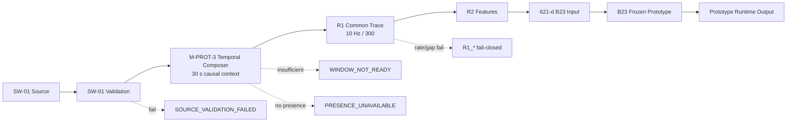

# SafeNest mmWave V2 — M-PROT-3 Integration Runtime Wiring

- Phase: **M-PROT-3**
- Date: 2026-08-27
- Base SHA (post-PR #176 / M-PROT-2): `97b742dbc9c23d02cf3a74e0d4134ab76b2d0eaa`
- Branch: `research/mmwave-m-prot-3-integration-runtime-wiring`
- Worker terminal: **`M_PROT_3_INTEGRATION_RUNTIME_WIRING_COMPLETE`**
- Sol review: **required** (`M-PROT-4 = NOT_AUTHORIZED_PENDING_SOL_REVIEW`)
- Manifest: `datasets/mmwave/manifests/M_PROT_3_integration_runtime_wiring/`

## Provisional freeze ≠ final scientific selection

```text
PROVISIONAL INTEGRATION / DEPLOYMENT FREEZE
!=
FINAL SCIENTIFIC MODEL SELECTION
```

B23 remains:

```text
PROTOTYPE_INTEGRATION_ONLY
NOT_FINAL_SELECTED_MODEL
NOT_DEPLOYMENT_VALIDATED
NOT_SAFETY_VALIDATED
NOT_CLINICAL_VALIDATION
SUBJECT_TO_REPLACEMENT
PROVISIONAL_INTEGRATION_FREEZE = true
REPLACEMENT_REQUIRES_CONTROL_TOWER_DECISION = true
```

No winner / best-model / M-PV3.8-selected language.

## What was wired



Module: `adapters/mmwave_m_prot_3_integration_runtime.py`

Reuses:

- SW-01 `evaluate_stream` / `Sample` / `StreamBundle`
- R1 `adapt_native_trace` (`R1-A_NATIVE_CENTERED_RELATIVE_MOTION_10HZ_V1`)
- M-PROT-2 `run_prototype_inference` / `resolve_verified_runtime` (R2 → Stage0/1 → B23)

Does **not** reimplement B23, R1 resampling, R2 formulas, or invent MR60 UART framing.

## Window contract

| Field | Value |
|---|---|
| Duration | 30 s conceptual / 300 samples @ 10 Hz (span 29.9 s) |
| Causal | past-only |
| Session change | flush |
| Reset | flush |
| Large gap | flush, no bridge / no silent interpolation |
| Insufficient history | `WINDOW_NOT_READY` (not ABSENT/APNEA) |
| Production cadence | `NOT_GOVERNED_IN_M_PROT_3` (caller-triggered) |

## Presence

SW-01 does not provide a governed human-presence signal. M-PROT-3 therefore:

- does **not** infer presence from breathing/RR/amplitude,
- defaults to `PRESENCE_UNAVAILABLE`,
- requires an **explicit** caller `presence_available=True` for physiology.

## Fail-closed precedence

```text
SOURCE / SW-01
→ WINDOW readiness
→ PRESENCE (explicit)
→ R1 admissibility
→ M-PROT-2 QUALITY / PHYSIOLOGY
```

`scalar_rr` is never a B23 waveform substitute. No M-N9 fallback.

## Integration-repo read-only audit

| Field | Value |
|---|---|
| Repo | `https://github.com/yuname121/integration.git` |
| Branch | `main` |
| Commit | `c759205bfae0adbbd3a33235718801a8e476b28c` |
| Modified | **NO** |

Future seam documented; Pi torch remains **not live verified**.

## Frozen identities

| Item | Value |
|---|---|
| B23 artifact SHA-256 | `8f7de6f50d6ff62ff9b0ebfaed0b1fccd8d194c7e33781bc5b93366fae251a2c` |
| Parameter SHA-256 | `6db949c242e25888dd20c3fc8e2305af03448aa229e3ca73e4159216a266d78e` |
| Scaler content SHA-256 | `5a2583b5b5064be5480b0cf56f2a2c12d40a4a2d005eb087dc8e12106881159c` |
| Assembled dim | 621 |

## Not executed

- Live hardware / MR60 UART capture
- M-PROT-4 system smoke
- Training / threshold retune / TFLite / INT8
- Final selection / M-PV3.8 reopen / M-PV4
- Model replacement

## Known limitations

- `MR60_UART_PROTOCOL_UNPROVEN`
- Pi torch / latency not live verified
- Live presence source not proven
- Production inference cadence not governed
- Fixture lineage only (`FIXTURE_NON_CAMPAIGN`)

## Track F unchanged

```text
D1 PRESENT=57 ABSENT=0
MEMBERSHIP=BLOCKED_INVALID_FINAL_MEMBERSHIP
M-PV3.8=RESOURCE_BLOCKED_CLOSED
M-PV4=UNAUTHORIZED
D2=LOCKED
```

ROLE_L panel unchanged: B11 B23 B47 C11 C23 C47.

## Next

Sol review of this PR. **Do not start M-PROT-4** until authorized.
