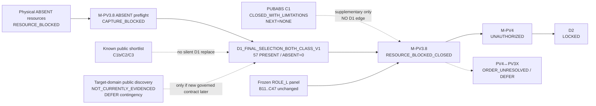

# SafeNest mmWave V2 — Post-PUBABS Critical-Path Reconciliation

- Phase: **MMWAVE-V2-POSTPUBABS-R0**
- Date: 2026-08-27
- Base SHA (post-PR #168 `origin/main`): `d7f2421808a79e75afccb8f08b3a29c0f5a1f1fa`
- Branch: `docs/mmwave-v2-post-pubabs-critical-path`
- Role: **roadmap / dependency reconciliation only** — no capture, download, inference, or training
- Verdict: **`POSTPUBABS_ONLY_RESOURCE_BLOCKED_PATHS`**
- Primary recommendation: **`RECOMMEND_PHYSICAL_D1_RESOURCE_RECOVERY`**
- Manifest: `datasets/mmwave/manifests/MMWAVE_V2_post_pubabs_critical_path/`

---

## Objective

After terminal closure of the PUBABS C1 public-data lane, recompute the global mmWave V2 critical path.

Not answered: “what busywork can agents do next?”

Answered: what still blocks `M-PV3.8`, and which next action is scientifically valid.

---

## PR #168 merge receipt

| Field | Value |
|---|---|
| PR | https://github.com/sheepmeat/test/pull/168 |
| Reviewed head | `4ffe42fdd4c2b1e9017e89962ddf88daf14c8248` — exact match |
| Reviewed base | `cc84f10edfb49b0dc22effbfca7b80f84335cdc1` — exact match |
| `PR168_MERGE_COMMIT` | `d7f2421808a79e75afccb8f08b3a29c0f5a1f1fa` |
| `POST_PUBABS_ORIGIN_MAIN` | `d7f2421808a79e75afccb8f08b3a29c0f5a1f1fa` |

---

## Confirmed terminal C1 state

```text
PUBABS_C1     = CLOSED_WITH_LIMITATIONS
NEXT_C1_PHASE = NONE
PUBABS-A10    = NOT_CREATED
```

C1 authority remains NONE for candidate lifecycle, D1, M-PV3.8, and M-PV4.

C1 may only reopen under frozen A9 reopen policy. Retroactive C1→D1 use remains forbidden.

---

## Exact M-PV3.8 blocker

```text
M-PV3.8              = RESOURCE_BLOCKED_CLOSED
reason               = ACQUISITION_REQUIRES_RESOURCE_ACCESS
Final membership     = BLOCKED_INVALID_FINAL_MEMBERSHIP
Evaluation           = NOT_EXECUTED
M-PV4                = UNAUTHORIZED
```

Membership identity:

```text
D1_FINAL_SELECTION_BOTH_CLASS_V1
expected: 57 PRESENT / 57 ABSENT
observed governed: PRESENT exists / ABSENT = 0
```

This is **not** a model-performance failure. The frozen ROLE_L panel (B11/B23/B47/C11/C23/C47) was never evaluated on valid final both-class membership. C1 A8 outputs must not rank or drop any candidate.

---

## Lesson retained from C1

Public same-dataset PRESENT/ABSENT radar can support:

- external availability stress
- external OOD domain stress
- adapter robustness characterization

C1 was **rejected** for D1 final-selection replacement because of class-correlated adapter availability, VALID-subset non-representativeness, N6=0, HIGH scale mismatch, HIGH sensor/domain mismatch, and temporal acquisition mismatch.

Do not discard that lesson when considering C1b/C2/C3.

---

## Route comparison

| Task / Route | Status | Dependency | Unblocks M-PV3.8? | Recommended now? |
|---|---|---|---|---|
| A. Physical D1 ABSENT (frozen 3×3 → 57) | RESOURCE_BLOCKED | live sensor, occupancy proof, preflight PASS | YES | YES — as **resource recovery** (not capture) |
| B. Existing public as silent D1 replacement | UNAUTHORIZED | new membership contract + Sol | NO (forbidden as silent mutate) | NO |
| C. Another UWB external-stress lane (e.g. C2) | OFF_CRITICAL_PATH | Sol auth | NO | NO |
| D. Target-domain (MR60/60GHz/FMCW) public | NOT_CURRENTLY_EVIDENCED | new discovery if Sol authorizes | conditional only | DEFER contingency |
| E. M-PV4 / D2 | UNAUTHORIZED / LOCKED | M-PV3.8 selection | NO | NO |
| F. PV4↔PV3X ordering | DEFER | post-selection | NO | NO |
| Model train / select on current membership | BLOCKED | valid both-class membership | NO | NO |
| D3 / Q3 / M-N10 | DEFER / KEEP_BLOCKED | — | NO | NO |

---

## Physical acquisition route (Route A)

```text
STATUS:            RESOURCE_BLOCKED
CAN_START_NOW:     NO (capture unauthorized; preflight CAPTURE_BLOCKED)
PLAN:              MMWAVE_V2_M_PV38_ABSENT_ACQUISITION_PLAN_V1 — UNCHANGED
                   3 lineage groups × 3 fixed slots → 57 ABSENT
                   no replacement / no top-up / no reallocation / no second attempt
                   Stage1 identity freeze + Stage2 SHA receipts
```

### Must-have / missing

| Item | Class | Status |
|---|---|---|
| Supported mmWave + raw/timestamp/health interface | must-have | MISSING |
| Rigid mount + measured target zone | must-have | MISSING |
| Authoritative occupancy + sealed-zone proof | must-have | MISSING |
| Host storage + clock for receipts | must-have | not live-evidenced |
| Non-campaign interface checker | must-have | tooling defined; live check missing |
| Nine-slot lock + SHA receipt demo readiness | must-have | schemas defined; campaign not ready |
| PP-01..PP-04 roles assigned | must-have | MISSING |

### Already available

- Frozen acquisition gate / plan / checklist / preflight schemas
- PRESENT path for final membership (57)
- Frozen ROLE_L six-candidate panel
- Lifecycle closure state `RESOURCE_BLOCKED_CLOSED`

No evidence after C1 changes `ACQUISITION_REQUIRES_RESOURCE_ACCESS`.

---

## Alternative public evidence (no download / no new inspection)

| ID | Prior role | Post-C1 critical-path judgment |
|---|---|---|
| C1 | CLOSED external-stress | No further C1 phase |
| C1b (`16533267`) | REFERENCE_ONLY_EXTENDED_LINEAGE | Same UWB family as C1 — **not independent**; DEFER |
| C2 (`7679165`) | B_USABLE_WITH_LIMITATIONS | UWB X4M200; OFF_CRITICAL_PATH; do **not** deep-validate by default |
| C3 (`10815247`) | C_RESEARCH_ONLY | Foliage/wind confound; DEFER |
| C4 (`3824534`) | D_REJECT | Stay rejected |
| MR60-like public | — | **NOT_CURRENTLY_EVIDENCED** (do not invent) |

If C2 were later authorized, pre-classify likely role as **external stress only** or **research only**. Final-membership investigation would require a **new** governed contract and is unlikely without target-domain fit. This phase does **not** authorize C2 work.

---

## Model work readiness

```text
MODEL_READY_WORK: NO
```

Reason: selection/evaluation prerequisites require valid both-class membership; membership is blocked; C1 cannot mutate the candidate panel.

`NO_MODEL_READY_WORK` ≠ roadmap finished. It means agents must not train/select/evaluate as if READY.

---

## Critical-path verdict

```text
POSTPUBABS_ONLY_RESOURCE_BLOCKED_PATHS
```

The only scientifically valid critical-path unblocker is physical governed ABSENT acquisition under the frozen M-PV3.8.4 plan. That path remains resource-blocked. No existing public shortlist source unblocks M-PV3.8.

### Primary next recommendation

```text
RECOMMEND_PHYSICAL_D1_RESOURCE_RECOVERY
```

Meaning: recover/access the must-have resources and re-run preflight — **not** start capture, **not** construct membership, **not** evaluate models.

### Secondary / deferred

```text
TARGET_DOMAIN_PUBLIC_SOURCE_DISCOVERY = DEFER (contingency only; Sol-gated)
C2 deep validation                     = NOT recommended now
C1b / C3                               = DEFER
D3 / Q3                                = DEFER
M-N10                                  = KEEP_BLOCKED / OFF_V2_CRITICAL_PATH
PV4↔PV3X                               = DEFER until selection exists
```

Discovery criteria, if later authorized, must prioritize same-system PRESENT + true empty ABSENT, respiration-relevant waveform, raw/phase/IQ, ≥30 s, timing evidence, preferably ~10 Hz or convertible, preferably FMCW/60 GHz/MR60-like, multiple subjects, comparable negatives, license/provenance, low class/domain confounding — objective = improve **final-membership** feasibility, not more OOD stress.

---

## Global Mermaid



---

## Explicit non-actions

```text
C1_REOPEN                = NOT_EXECUTED
PUBABS_A10               = NOT_CREATED
NEW_PUBLIC_DOWNLOAD      = NOT_EXECUTED
NEW_MODEL_INFERENCE      = NOT_EXECUTED
MODEL_TRAINING           = NOT_EXECUTED
MODEL_SELECTION          = NOT_EXECUTED
D1                       = UNCHANGED
FINAL_MEMBERSHIP         = BLOCKED_INVALID_FINAL_MEMBERSHIP
M-PV3.8                  = RESOURCE_BLOCKED_CLOSED
M-PV4                    = UNAUTHORIZED
D2                       = LOCKED
RESOURCE_RECOVERY_EXEC   = NOT_EXECUTED (recommendation only)
```
