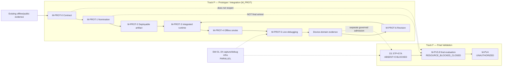

# SafeNest mmWave V2 — Prototype Integration Lane (M-PROT-0)

- Phase: **M-PROT-0**
- Date: 2026-08-27
- Base SHA (`origin/main`): `13a56b7e41e9519ad61238a74861ef4ad6ea16ab`
- Branch: `docs/mmwave-v2-prototype-integration-lane`
- Role: **roadmap / lifecycle design only** — no training, inference, nomination execution, or runtime code changes
- Lane ID: **`M_PROT`**
- Terminal verdict: **`PROTOTYPE_MODEL_LANE_READY`**
- Next agent: **`RECOMMEND_EXECUTION_GROK_PROTOTYPE_CANDIDATE_NOMINATION`** (after Sol freeze of this PR)
- Manifest: `datasets/mmwave/manifests/M_PROT_0_prototype_integration_lane/`

---

## Owner constraint

> The integrated system must exist before sufficient real-device measurement and debugging evidence can be accumulated.

Therefore lack of final governed physical ABSENT membership **must not** block creation, nomination, packaging, or integration of a first prototype model.

Intended loop:

```text
offline/public evidence
→ prototype model
→ integrated runtime
→ real-device debugging / capture
→ device-domain validation
→ prototype revision
→ later final scientific validation
```

Not:

```text
complete all physical final validation → only then build/integrate the first model
```

---

## A. Interpretation correction

Post-PUBABS phrase `MODEL_READY_WORK=NO` remains historically true **for final selection**.

Clarified split (additive; does not rewrite post-PUBABS files):

```text
FINAL_SELECTION_MODEL_WORK        = BLOCKED
PROTOTYPE_INTEGRATION_MODEL_WORK  = READY
```

`MODEL_READY_WORK=NO` referred to final-selection work under M-PV3.8 / D1 gates, **not** to owner-authorized prototype integration development.

Track F support work (physical D1 ABSENT resource recovery) remains valid in parallel and is **not** cancelled by Track P.

---

## B. Track P — Prototype / Integration (`M_PROT`)

Purpose: functional first model → install → debug sensor→window→preprocess→model→output → collect device-domain evidence → iterate.

Does **not** require completed `D1_FINAL_SELECTION_BOTH_CLASS_V1`.

Lifecycle:

| ID | Name | Status |
|---|---|---|
| M-PROT-0 | Prototype Integration Contract | this PR (proposal) |
| M-PROT-1 | Prototype Candidate Nomination | next executable after Sol freeze |
| M-PROT-2 | Deployable Artifact / Runtime Contract Freeze | after nomination |
| M-PROT-3 | Integration Runtime Wiring | after artifact freeze |
| M-PROT-4 | Offline / Replay / Synthetic Smoke | after wiring |
| M-PROT-5 | Live Device Debug & Capture | hardware-dependent |
| M-PROT-6 | Device-Domain Evaluation / Revision Decision | after live evidence |

Mandatory artifact semantics:

```text
PROTOTYPE_INTEGRATION_ONLY
NOT_FINAL_SELECTED_MODEL
NOT_DEPLOYMENT_VALIDATED
NOT_SAFETY_VALIDATED
NOT_CLINICAL_VALIDATION
SUBJECT_TO_REPLACEMENT
```

Forbidden namespace aliases: `M-PV3.8_SELECTED`, `M-PV4`, `FINAL_SELECTED_MODEL`.

---

## C. Track F — Final Validation (unchanged)

```text
D1_FINAL_SELECTION_BOTH_CLASS_V1 = incomplete (57 PRESENT / 0 ABSENT)
M-PV3.8                          = RESOURCE_BLOCKED_CLOSED
M-PV3.8 evaluation               = NOT_EXECUTED
M-PV4                            = UNAUTHORIZED
```

These continue to govern final scientific selection / promotion. Track P does not weaken them.

---

## D. Prototype nomination rules (for M-PROT-1)

Goal: choose a **technically coherent provisional baseline** for runtime integration and debugging — not prove the globally best candidate.

Allowed vocabulary: `PROTOTYPE_NOMINATED` · `INTEGRATION_BASELINE` · `PROVISIONAL`
Forbidden: winner / final-selected / M-PV3.8 passed / best seed / deployment ready

Minimum eligible panel (do not auto-choose in this phase):

```text
ROLE_L: B11, B23, B47, C11, C23, C47
```

Other deployable mmWave artifacts may be considered only if canonical repository lineage supports them.

M-PROT-1 comparison dimensions:

- offline validation behavior
- architecture stability across seeds
- artifact completeness (path + SHA)
- input-contract clarity
- runtime feasibility (PyTorch float32 first)
- determinism receipts
- resource footprint
- packaging/conversion path availability

Must not decide by: C1 A8 ranking, D1 final test, live-debug scores as final score.

This roadmap phase does **not** nominate a candidate.

---

## E. Required deployable contract (M-PROT-2 template)

Reproducibility freeze (replaceable by later prototype version), not final scientific freeze:

- prototype version id
- artifact path + SHA-256
- runtime format
- input shape / dtype
- window duration / sample rate
- preprocessing identity
- feature order / tensor layout
- output mapping
- prototype threshold
- fail-closed behavior
- mandatory semantics tags

Threshold may freeze from existing non-final dev/val evidence. D1 final not required. Live retune on the same debug samples as “validation” is forbidden; live-driven changes require a **new prototype version**.

---

## F. Live debug / data-lineage policy

| Class | Use | Final eval |
|---|---|---|
| `DEBUG_CAPTURE` | transport, timing, windowing, preprocess, load, latency, fail-closed, sanity, gap discovery | silent promotion forbidden |
| `DEVICE_DOMAIN_DEVELOPMENT` | prototype revision evidence | train/val only via separate governed admission |
| `FINAL_GOVERNED_EVALUATION` | D1 / M-PV3.8 | Sol + membership; Track P has no authority |

Live sessions that modify model/preprocess/threshold/windowing must not silently become locked final-test evidence.

---

## G. SW-01..04 relationship

SW-01..04 remain valid parallel infrastructure for prototype live debugging, capture provenance, and future final validation.

They do **not** need to complete before offline M-PROT-1 nomination.
This PR does **not** modify running SW branches.

---

## H. Immediate next executable phase

```text
This PR:     M-PROT-0 contract proposal
After Sol:   M-PROT-1 Prototype Candidate Nomination (Execution Grok)
```

Smallest justified next model task after freeze: **M-PROT-1** (existing contracts suffice; avoid extra paperwork).

---

## Readiness matrix

| Work | Prototype lane | Final-validation lane |
|---|---|---|
| model nomination | READY | BLOCKED |
| model packaging | READY after nomination | N/A |
| integration wiring | READY after artifact | N/A |
| offline smoke | READY after wiring | N/A |
| live debugging | hardware-dependent | not final eval |
| D1 ABSENT capture | optional parallel | REQUIRED |
| final candidate selection | FORBIDDEN | BLOCKED |
| M-PV4 | FORBIDDEN | UNAUTHORIZED |

---

## I. Terminal verdict

```text
PROTOTYPE_MODEL_LANE_READY
```

## J. Next agent

```text
RECOMMEND_EXECUTION_GROK_PROTOTYPE_CANDIDATE_NOMINATION
```

(Sol freeze of this M-PROT-0 PR required before Execution starts M-PROT-1.)

---

## K. Mermaid



---

## L. Explicit non-actions

```text
FINAL_MODEL_SELECTED = NO
D1_CHANGED           = NO
M-PV3.8_REOPENED     = NO
M-PV4_AUTHORIZED     = NO
MODEL_INFERENCE      = NOT_EXECUTED
MODEL_TRAINING       = NOT_EXECUTED
CANDIDATE_NOMINATED  = NO
SW_BRANCHES_MODIFIED = NO
```
