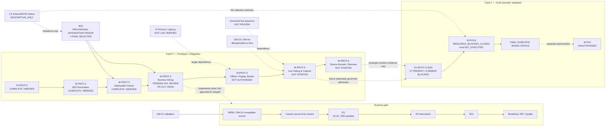

# SafeNest mmWave V2 — Track P / Track F Roadmap Reconciliation

- Date: 2026-08-27
- Phase: **Roadmap reconciliation after M-PROT-3 corrective work**
- Base SHA (`origin/main`): `97b742dbc9c23d02cf3a74e0d4134ab76b2d0eaa` (merge of PR #176 / M-PROT-2)
- Branch: `docs/mmwave-v2-roadmap-post-m-prot3-reconcile`
- Role: **roadmap / lifecycle / DAG only** — no runtime, model, training, live hardware, or M-PROT-4 execution
- Machine-readable: `datasets/mmwave/manifests/MMWAVE_V2_track_p_track_f_roadmap_state/`

This document is the **current Track P / Track F execution authority overlay**.
It does not rewrite historical M-PROT-0/1/2 evidence files. Those remain historical packages.

---

## Verified PR #177 discovery (do not invent)

| Field | Value |
|---|---|
| PR | https://github.com/sheepmeat/test/pull/177 |
| State | **OPEN** |
| Base | `main` @ `97b742db…` |
| Exact head | `59c6fad0e5d3efd591b2daeab006d77760c98d58` |
| Prior Sol-reviewed head (initial) | `f6101abb76e2f6980565daf845b56804980978c6` |
| Corrective commits | `99a83673…`, `59c6fad0…` |
| Merged | **NO** |
| Merge commit | **none** |
| Worker claim | correctives CLOSED; wiring complete |
| Sol review (repo-visible) | **PENDING** (no PASS / MERGE_AUTHORIZED recorded on the PR) |

Therefore:

```text
worker complete ≠ lifecycle complete
M-PROT-3 = IMPLEMENTED / PENDING_SOL_REVIEW
M-PROT-4 = NOT_AUTHORIZED
```

---

## Three layers (how to read the project)

### Layer A — Sensor / model runtime path

```text
MR60 / SW-01-compatible source
  → SW-01 validation (must PASS; no bypass)
  → causal source-time context (duration coverage, not “300 arbitrary source samples”)
  → R1 (owns 10 Hz resampling → exactly 300 canonical samples)
  → R2 / Stage0 / Stage1 descriptors
  → frozen B23 (621 float32)
  → breathing / RR / quality
  → prototype SafeNest usage
```

Window ownership: source-domain causal time → R1 resampling → 300 R1 samples → B23.
At 10 Hz, 300 source samples ≈ 30 s; at 20 Hz, ~600 source samples over the same context before R1 downsampling.

### Layer B — Track P development lifecycle

| Phase | Purpose | Status (verified now) |
|---|---|---|
| M-PROT-0 | Prototype integration contract | COMPLETE / MERGED (#172) |
| M-PROT-1 | Nominate provisional baseline | COMPLETE / MERGED (#175) → B23 |
| M-PROT-2 | Freeze deployable artifact/runtime contract | COMPLETE / MERGED (#176 @ `97b742db`) |
| M-PROT-3 | Wire SW-01 → window → R1/R2 → B23 | **IMPLEMENTED / PENDING_SOL_REVIEW** (#177 @ `59c6fad0`) |
| M-PROT-4 | Offline / replay / synthetic system smoke | **NOT_AUTHORIZED** |
| M-PROT-5 | Live device debug & capture | HARDWARE_DEPENDENT / NOT_STARTED |
| M-PROT-6 | Device-domain eval / revision decision | NOT_STARTED |

### Layer C — Final scientific validation (Track F)

```text
real physical evidence
→ D1 BOTH CLASS (57 PRESENT + 57 ABSENT)  [ABSENT currently 0]
→ M-PV3.8 final scientific evaluation
→ final candidate decision
→ M-PV4 only if separately authorized
```

Track P has **zero** authority to grant final scientific status.

---

## Fundamental distinction

```text
PROVISIONAL INTEGRATION / DEPLOYMENT FREEZE
≠
FINAL SCIENTIFIC MODEL SELECTION
```

B23 is frozen so SafeNest can finish integration without model churn. Acceptable labels:

- `PROVISIONAL_INTEGRATION_FREEZE`
- `PROVISIONAL_DEPLOYMENT_FREEZE`
- `INTEGRATION_BASELINE`
- `PROTOTYPE_INTEGRATION_ONLY`

Not allowed for B23 today:

- `FINAL_SELECTED_MODEL`
- `SCIENTIFIC_WINNER`
- `M-PV3.8_SELECTED`
- `DEPLOYMENT_VALIDATED`
- `SAFETY_VALIDATED`

A later final evaluation may select a different ROLE_L seed/family. That does not make the provisional freeze wrong — they answer different questions.

---

## B23 provisional freeze identity

| Field | Value |
|---|---|
| Panel | B23 |
| Family / seed | Family B / 23 |
| Candidate id | `M-PV2_FAMILY_B_TRACE_TCN_BREATHING_RR_QUALITY` |
| Artifact | `models/mmwave/m_pv2/family_b/candidate_seed_23.pt` |
| Artifact SHA-256 | `8f7de6f50d6ff62ff9b0ebfaed0b1fccd8d194c7e33781bc5b93366fae251a2c` |
| Parameter SHA-256 | `6db949c242e25888dd20c3fc8e2305af03448aa229e3ca73e4159216a266d78e` |
| Runtime | `PYTORCH_FLOAT32_STATE_DICT` |
| Input | 30 s / 10 Hz / 300 R1 → 621 float32 |

### Model churn policy

After provisional freeze, replacement is **not** an ordinary worker decision.

Allowed only for evidence-backed reasons (e.g. runtime incompatibility, corrupt artifact, deterministic inference failure, verified serious safety-relevant regression, invalidated contract) and only after:

```text
worker discovers issue → reports blocker → Sol decision → then replacement
```

Do **not** put candidate re-ranking in the normal M-PROT-3/4/5 loop.
Do **not** use C1 outputs to pick a different provisional candidate.

---

## Why D1 must not block Track P

D1 is scientifically required for **final** selection.
D1 is **not** required before a first integrated prototype can exist.

Owner/control-tower order:

```text
freeze provisional candidate (B23)
→ finish runtime integration (M-PROT-3…)
→ offline/replay smoke (M-PROT-4)
→ live debug/capture (M-PROT-5)
→ accumulate device-domain evidence
→ eventually construct valid D1 both-class
→ M-PV3.8 final evaluation
→ only then final model status
```

Rejected order: complete final D1 first → only then integrate the first usable model.

---

## Track F frozen state (unchanged)

```text
D1 PRESENT = 57
D1 ABSENT  = 0
D1_FINAL_SELECTION_BOTH_CLASS_V1 = incomplete
MEMBERSHIP = BLOCKED_INVALID_FINAL_MEMBERSHIP
M-PV3.8 = RESOURCE_BLOCKED_CLOSED
evaluation = NOT_EXECUTED
M-PV4 = UNAUTHORIZED
D2 = LOCKED
Frozen panel = B11 B23 B47 C11 C23 C47
```

---

## C1 role (secondary branch)

```text
PUBABS_C1_EXTERNAL_STRESS_V1
= EXTERNAL_SAFETY_DOMAIN_STRESS
= DESCRIPTIVE_ONLY
= OUT_OF_DOMAIN
selection authority = NONE
```

C1 may inform limitations; it must not select best model/family/seed, provisional deployment candidate, M-PV3.8 winner, or final selected model. B23 freeze rests on pre-existing internal ROLE_L evidence (M-PROT-1/2), not C1 ranking.

---

## SW infrastructure

| ID | Role |
|---|---|
| SW-01 | Source/interface validation — **required** on routine prototype inference admission |
| SW-02 | Governed capture campaign binding — **not** a node on every inference |
| SW-03 / SW-04 | Sync / evidence / registry — future live debug/capture support |

---

## Explicit integration dependencies (not B23 failure)

| Dependency | Status |
|---|---|
| Governed live human-presence source | `LIVE_PRESENCE_SOURCE_NOT_PROVEN` |
| Pi PyTorch availability | `NOT LIVE VERIFIED` |
| Pi B23 latency | `NOT MEASURED` |
| TFLite conversion | `NOT_EXECUTED` |
| INT8 | `NOT_AUTHORIZED` |

Do not invent a TFLite/INT8 phase as already authorized. Target-runtime incompatibility later requires Sol decision, not silent conversion/replacement.

---

## Phase Q&A (human-readable)

### M-PROT-3 (current gate)

- **For:** Wire provisional B23 into the SafeNest software path with fail-closed admissions.
- **Enters:** SW-01-validated source, M-PROT-2 frozen contract.
- **Out:** Integration wiring receipts / software path (on PR #177 until merged).
- **Blocks next:** Sol exact-head review + merge of #177.
- **Does not prove:** live MR60 validation, final scientific selection, Pi latency, presence truth.
- **Next if approved:** M-PROT-4 offline/replay/synthetic smoke (**proposed purpose only; not authorized here**).

### M-PROT-4 (purpose only; NOT authorized)

System-level offline / replay / synthetic smoke of source → window → R1/R2 → B23 without claiming live hardware validation. Exact execution requirements remain **PROPOSED / TO BE FROZEN BY SOL**.

### M-PROT-5 / M-PROT-6

Live debug & capture; then device-domain evaluation / revision. Evidence classes stay separated:

```text
DEBUG_CAPTURE
DEVICE_DOMAIN_DEVELOPMENT
FINAL_GOVERNED_EVALUATION
```

No silent promotion into final test. M-PROT-6 may keep provisional candidate or **propose** revision; Sol still owns replacement.

---

## Master Mermaid



---

## Stale pointers corrected by this reconciliation

| Stale claim (on `origin/main` before this PR) | Corrected current authority |
|---|---|
| M-PROT-2 still awaiting Sol #176 / M-PROT-3 NOT_AUTHORIZED pending M-PROT-2 | M-PROT-2 COMPLETE/MERGED; gate is M-PROT-3 Sol review of #177 |
| `MODEL_READY_WORK=NO` read as “no model work at all” | Means final-selection blocked; provisional integration continues |
| D1 block shown as blocking first integration | D1 blocks Track F only |
| C1 as primary model-selection path | C1 is secondary stress branch; selection authority NONE |
| Historical M-PROT-2 JSON `PENDING_REVIEW` treated as current | Leave historical JSON; AGENTS/README carry current authority |

---

## Explicit non-actions (this PR)

```text
RUNTIME_CODE_CHANGED = NO
MODEL_CHANGED        = NO
TRAINING_EXECUTED    = NO
LIVE_HARDWARE        = NO
M_PROT_4_EXECUTED    = NO
PR_177_MERGED        = NO
FINAL_MODEL_SELECTED = NO
M-PV3.8_REOPENED     = NO
M-PV4_AUTHORIZED     = NO
```

---

## Sol review required

This roadmap PR updates current-state pointers and Mermaid only.
It does **not** approve PR #177 and does **not** authorize M-PROT-4.
