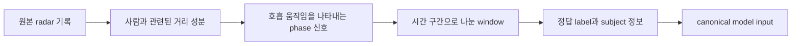
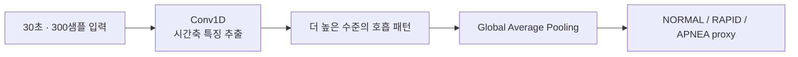

# SafeNest 멀티센서 중간배포 기술 맥락 및 인수인계

검토 기준일은 2026-08-13이며, 이 문서는 팀 시스템에 넣기 전에 AI 부분을 독립적으로 개발하는 standalone 저장소를 기준으로 작성되었다. 파일 변경 이력을 관리하는 Git에서 기본 작업선은 `main`이고, 검토 시점의 정확한 저장 상태인 commit은 `f56809cd2df1eb55c3272ff5455a10260e76ff74`이다. 수치와 상태는 사람이 쓴 설명보다 자동 검증 프로그램인 validator를 통과한 JSON 구조화 기록, 파일 내용이 같은지 확인하는 SHA-256 checksum, 실제 모델 파일을 우선하여 확인했다. 팀 저장소 자료는 아직 기본 작업선에 합쳐지지 않은 변경 제안인 PR(Pull Request)과 별도 작업선인 branch까지 확인했다. 다만 팀 저장소의 구형 `ondevice_ai/`는 이번 새 데이터·모델 절차의 성능이나 방향을 입증하는 자료로 사용하지 않았다. 이 문서에서 코드 글꼴로 표시한 영문 상태명과 경로는 프로그램이 실제로 사용하는 고유 이름이므로 번역하지 않고, 그 앞뒤에 한국어 의미를 설명한다.

## 1. 한눈에 보는 센서별 현재 단계와 남은 작업

이 문서의 mmWave는 MR60 계열 밀리미터파 레이더로 사람 몸의 미세 움직임에서 호흡 관련 신호를 얻는 트랙이고, CO₂는 SCD40 계열 센서로 실내 이산화탄소를 측정하는 트랙이며, Thermal은 온도를 화면 형태로 측정하는 열화상 트랙이다. 센서별 표기의 A는 원본과 데이터 처리 기준을 확정하는 단계, B는 저장된 데이터만으로 전처리와 모델을 비교해 offline 후보를 고르는 단계, C는 실제 센서와 목표 실행 장치에서 입력과 성능을 확인하는 단계이다. 여기서 offline 후보는 아직 센서에 연결하지 않고 저장된 데이터로만 검증한 모델을 뜻한다. D는 C에서 실제 차이가 발견된 센서에만 데이터 추가 수집과 재학습을 수행하는 조건부 단계이고, E는 최종 산출물인 artifact와 입력·출력 규칙을 더는 임의로 바꾸지 못하도록 고정해 통합 준비 상태로 만드는 단계이다. 그 뒤 공통 I-0~I-6은 세 센서를 같은 전송 데이터 묶음(packet), 시간, 값의 유효성, 위험 판단 규칙에 연결하고 소형 실행 컴퓨터인 Raspberry Pi와 팀 저장소에서 검증하는 통합 단계이다. 표에 나오는 INT8 모델은 숫자를 8비트 정수로 줄여 저장하고 계산하는 경량 모델이며, occupancy는 방에 사람이 있는지 없는지를 뜻한다. 각 단계의 작업량이 같지 않으므로 진행률을 단순 백분율로 표시하지 않고, 완료한 증거 층과 앞으로 통과해야 할 필수 관문으로 남은 양을 설명한다.

| 센서 | 현재 위치 | 현재까지 완료된 의미 | 앞으로 남은 필수 관문 | 조건에 따라 추가되는 작업 |
| --- | --- | --- | --- | --- |
| mmWave | A0~A6와 M-B0~M-B12 완료 | 실제 공개 레이더 데이터의 표준화, 한 사람의 자료가 학습과 평가에 동시에 들어가지 않는 분할, 저장 데이터 기반 경량 모델 비교와 후보 고정까지 완료 | M-C 실제 MR60 검증과 장치 결과를 반영한 최종 산출물 고정·통합 준비, 이후 공통 I단계 | MR60과 공개 데이터의 차이가 크면 M-D에서 필요한 조건의 데이터를 더 모아 재학습 |
| CO₂ | C-A0~C-A6와 C-B0~C-B5 완료 | 실제 UCI 원본의 시간 계보, 모델에 넣는 측정 항목, 저장 데이터 기반 경량 재실 판단 모델 비교와 후보 고정까지 완료 | C-C 실제 SCD40 검증과 C-E 최종 산출물 고정·통합 준비, 이후 공통 I단계 | SCD40의 측정 범위·주기·환경 차이가 크면 C-D에서 확인된 차이를 채우는 데이터 확장과 재학습 |
| Thermal | 중간배포 기준 T-A0~T-A6 완료, 별도 개발선 T-B0 완료 | 48,000장 원본의 온도 단위, 62×80 변환, 라벨 의미, 공식 데이터 분할과 중복 한계를 확정했고, 별도 PR #57에서 후속 모델 비교 규칙까지 마련 | 중간배포 고정 후 T-B0 개발선 재검토·병합, T-B1부터 저장 데이터 기반 모델 비교, T-C 실제 열화상 센서 검증, T-E 최종 고정, 이후 공통 I단계 | 실제 장치나 평가 데이터의 빈틈이 확인되면 T-D에서 새 데이터 확보와 재학습 |

**mmWave — 현재 위치.** 데이터 기반인 A단계와 저장 데이터 기반 모델 단계인 B단계가 모두 끝났으므로, 세 가지 증거 층 중 데이터 계보와 offline 후보의 두 층이 마련되었다. **완료의 의미.** 지금 모델은 같은 공개 데이터와 고정 규칙으로 다시 만들고 비교할 수 있지만 MR60에서 같은 신호가 들어오는지는 아직 증명되지 않았다. **남은 양.** 센서 자체의 필수 큰 관문은 M-C 실센서 검증과 그 결과를 반영한 최종 산출물 고정·통합 준비이며, 이후 세 센서 공통 I단계가 남아 있다. M-D는 반드시 수행하는 단계가 아니라 M-C에서 domain gap, 즉 공개 데이터와 MR60 신호의 의미나 수치 분포 차이가 확인될 때만 추가된다. **바로 다음 작업.** 약 20 rpm, 즉 분당 약 20회 호흡으로 관측된 현상을 포함해 MR60의 원시값(raw), 파동 위상값(phase), 사람 감지 여부(presence), 측정 시각(timestamp)을 확인해야 한다. 그리고 이를 초당 10회 측정한 값 300개로 구성한 30초 입력과, 호흡 주파수만 남긴 뒤 값의 크기를 표준화하는 `BPF_ZSCORE` 규칙에 맞춰 비교해야 한다. 일정한 조건에서 계획대로 자료를 모으는 controlled capture와 Raspberry Pi 실행 검증도 이때 수행한다.

**CO₂ — 현재 위치.** 실제 원본을 복원한 C-A와 offline 후보를 고정한 C-B가 끝났으므로, CO₂도 데이터 계보와 저장 데이터 기반 모델의 두 증거 층이 마련되었다. **완료의 의미.** UCI 재실 데이터에서는 같은 입력 항목(feature), 값의 크기를 맞추는 변환(scaler), 재실 판정 경계값(threshold)과 모델을 재현할 수 있다. 그러나 이 결과는 SCD40의 실제 측정 특성이나 CO₂ 안전 경보를 증명하지 않는다. **남은 양.** 필수 큰 관문은 C-C SCD40 검증과 C-E 최종 산출물 고정·통합 준비이며, 그 뒤 공통 I단계가 남아 있다. C-D는 C-C에서 측정 범위, 측정 주기(cadence), 값 누락 또는 환경 차이가 실제로 확인될 때만 수행한다. **바로 다음 작업.** 현재 팀 PR #14의 부분 검증 자료를 출발점으로 센서 전원을 켠 직후 값이 안정되는 시간, 측정 간격, 새 측정 없이 과거 값이 남는 stale 상태, 값 누락과 재연결을 확인해야 한다. CO₂가 시간에 따라 변하는 속도인 `CO2_slope`를 실제 SCD40에서도 같은 방식으로 계산할 수 있는지와 UCI 데이터 대비 값의 분포 차이도 검증해야 한다.

**Thermal — 현재 위치.** 중간배포 기준선인 `main`에서는 T-A0~T-A6 데이터 기반이 끝났고 A6의 `t_b_authorized: false`가 유지된다. 별도 개발선과 열린 PR #57에서는 T-B0 모델 비교 프로토콜이 완료되어 그 개발선 안에서만 제한사항을 전제로 T-B1이 허용되지만, 새 모델 학습은 아직 수행하지 않았다. **완료의 의미.** 원본 열화상을 섭씨값을 가진 62×80 한 장면(frame)과 추적 가능한 정답 이름(label)·용도별 분할(split)로 다시 만들 수 있고, 후속 개발선에서는 Celsius 직접 입력·TRAIN 전용 z-score·기존 장면별 min-max를 공정하게 비교할 규칙까지 마련했다. 그러나 기존 `HUMAN_FALL` 모델이 새 데이터에 맞거나 실제 낙상을 잘 찾는다는 것은 증명하지 않았다. **남은 양.** 중간배포를 먼저 고정한 뒤 T-B0 개발선을 최신 기준에서 재검토·병합하고, T-B1 모델 학습과 후속 경량 모델·TFLite/INT8 비교, T-C 실제 장치 검증, T-E 최종 산출물 고정·통합 준비를 차례로 통과해야 한다. T-D는 앞 단계에서 확인된 데이터 빈틈이 있을 때만 추가한다. **바로 다음 작업.** T-B1에서 세 전처리를 같은 조건으로 비교하되 TRAIN↔VALIDATION near-duplicate 한계와 독립 LOCKED_TEST 부재를 그대로 공개하고, 선택된 후보 하나만 실제 촬영 개발 평가 자료에서 확인해야 한다.

세 트랙은 독립 파일과 장비를 사용하는 범위에서 병렬로 진행할 수 있다. 즉 mmWave M-C와 CO₂ C-C를 진행하는 동안 Thermal T-B0 개발선을 재검토한 뒤 T-B1 이후를 진행하고, 공용 계약을 읽기 전용으로 대조하는 I-0도 함께 수행할 수 있다. 다만 같은 센서 안에서는 B보다 C를 먼저 하거나, C에서 차이가 확인되지 않았는데 D 재학습을 시작하거나, 실센서 검증 없이 E와 I의 완료를 선언해서는 안 된다.

## 2. 이 중간배포의 목적과 의미

SafeNest가 해결하려는 문제는 센서마다 별도의 값을 얻는 데서 끝나지 않는다. 실제 mmWave 레이더, CO₂ 센서, 열화상 센서가 보내는 데이터를 같은 기준으로 해석하고, 어떤 원본에서 어떤 전처리와 학습을 거쳐 결과가 나왔는지 나중에도 추적할 수 있어야 한다. 기존에는 실행 가능한 모델과 예제 코드가 일부 존재했지만 학습 원본, 데이터 분할, 전처리 통계, 모델 선택 이유가 서로 충분히 연결되지 않았거나 합성 데이터만으로 확인된 경우가 있었다. 이 상태에서는 새 실센서 데이터가 들어올 때 기존 모델과 동일한 기준으로 처리했는지 판단하기 어렵고, 다른 개발자가 같은 모델을 다시 만들거나 결과를 공정하게 검증하기도 어렵다.

이번 작업은 이 문제를 센서별로 나누어 정비했다. 각 트랙의 A단계는 원본의 신원과 사용 조건을 확인하고, 원본을 일정한 형태로 바꾸며, 각 샘플이 어디서 왔는지를 기록하는 데이터 기반 단계이다. 여기서 canonical data는 서로 다른 원본을 후속 코드가 일관되게 읽도록 정한 표준 데이터 형태이고, provenance는 각 샘플의 원본·구간·라벨·분할·변환 과정을 거꾸로 추적할 수 있게 하는 계보 기록이다. B단계는 이 고정된 데이터 기준 위에서 여러 전처리와 모델을 비교하고, 선택 결과를 작은 장치에서도 실행하기 쉬운 형식으로 변환한 뒤 최종 평가와 파일 식별값을 고정하는 offline 모델 단계이다. C단계는 저장된 공개 데이터가 아니라 실제 MR60, SCD40, 열화상 장치와 목표 실행 환경에서 입력 의미와 성능을 다시 확인하는 device-domain, 즉 실제 장치 환경 검증 단계이다. 이후 I단계는 이렇게 독립적으로 확인된 센서 결과를 공용 입력·출력 규칙과 위험 판단 흐름에 연결하는 통합 단계이다.

따라서 이 중간배포는 세 센서가 모두 제품 수준에 도달했다는 선언이 아니다. 현재까지 재현 가능한 데이터·실험·모델 증거를 고정하고, 담당자가 바뀌어도 다음 검증을 같은 출발점에서 계속할 수 있게 만든 중간 기준점이다. mmWave와 CO₂는 실제 공개 데이터에 대한 offline 후보까지 도달했지만 아직 팀의 물리 센서로 검증하지 않았다. Thermal은 실제·합성 원본을 표준화하고 한계를 확인한 A단계까지 끝났으며, 기존 열화상 모델을 새 canonical 데이터에 맞춰 재학습하거나 선택하는 B단계는 아직 승인되지 않았다.

## 3. 시스템 구조와 증거의 경계

세 트랙은 모두 `원본 → 안전한 판독 → 표준 데이터(canonical) → 용도별 고정 분할 → 저장 데이터 기반 모델 비교 → 물리 센서 검증 → 멀티센서 통합`이라는 같은 구조를 따른다. Manifest는 어떤 데이터·모델·설정을 사용했는지 기계가 읽을 수 있게 적은 명세 파일이고, checksum은 파일 내용이 한 바이트라도 바뀌면 달라지는 SHA-256 식별값이다. 이 둘을 함께 보존하면 같은 이름의 파일이 몰래 교체되거나 학습과 평가 대상이 달라지는 문제를 잡아낼 수 있다. Validator는 이 규칙을 독립적으로 다시 확인하는 검사 프로그램이다. 필수 자료가 없거나 값이 잘못되었을 때 임의의 정상값으로 대신하지 않고 오류로 중단하는 방식을 fail-closed라고 하며, 센서 오류가 정상 상황으로 오인되는 일을 막기 위해 사용한다.

증거는 다음 세 종류를 서로 대신할 수 없다. Offline evidence는 실제 센서를 연결하지 않고 저장된 데이터셋, 표준 데이터 파일, 경량 모델, 입력 변형 시험 또는 모의 실행에서 얻은 결과이다. 여기서 TFLite는 Raspberry Pi 같은 비교적 성능이 낮은 장치에서 실행하기 위한 TensorFlow Lite 모델 형식이고, mock은 실제 센서 대신 정해진 가짜 입력을 넣어 프로그램 연결이 작동하는지만 보는 모의 실행이다. Device-domain evidence는 실제 센서와 목표 장치에서 신호 단위, 측정 주기, 누락, 보정, 전처리, 처리 시간을 확인한 결과이다. Integration evidence는 각 센서 결과가 전체 SafeNest 통신·위험 판단·표시 흐름에 연결된 뒤에도 올바른 측정 시각과 유효성 상태를 유지하는지 확인한 결과이다. 저장 데이터 정확도가 좋아도 실제 센서 신호가 학습 입력과 다르면 실제 장치 검증을 통과한 것이 아니며, 한 센서가 장치에서 동작해도 전체 시스템 통합을 증명한 것은 아니다.

독립 개발용 standalone 저장소는 AI 데이터, 전처리, 모델, 평가와 위험 판단 코드를 정비하는 작업장이다. 팀 저장소에서는 센서와 직접 통신하는 프로그램인 driver가 `devices/<device>/src/`, 여러 구성요소가 함께 따라야 하는 공용 입력·출력 규칙인 interface가 `shared/contracts/`, AI 구성요소가 `ondevice_ai/`에 속한다. 팀 저장소의 열린 CO₂ PR #14, Thermal PR #15, 여러 센서값을 모아 전달하는 소형 제어 보드인 ESP32 통합 PR #12, 실행 패키지 PR #11과 MR60 원격 분석 branch는 C단계와 I단계에서 사용할 중요한 실제 장치 자료이다. 그러나 아직 standalone A/B 데이터에 자동으로 합쳐진 학습 자료는 아니다. 특히 팀의 구형 `ondevice_ai/`는 이번 모델 계보를 입증하는 근거가 아니며, 이관할 때에도 실제 센서와 통신하는 driver를 AI 폴더에 중복 복사해서는 안 된다.

## 4. 센서별 개발 과정과 현재 상태

### mmWave 트랙: 실제 레이더 데이터의 의미를 고정한 뒤 offline 후보 모델까지 만든 과정

SafeNest의 mmWave 트랙은 사람이 착용물을 달지 않아도 레이더가 감지하는 미세한 몸 움직임을 이용해 호흡 상태를 판단하려는 부분이다. 여기서 사용하려는 신호는 카메라 이미지처럼 처음부터 모델 입력 형태로 주어지는 것이 아니다. 레이더가 측정한 원본에는 거리 방향의 여러 반사 성분이 섞여 있고, 그중 사람의 흉곽 움직임을 잘 나타내는 구간을 골라 시간에 따른 위상 변화를 꺼낸 다음 일정 길이로 잘라야 비로소 AI 모델이 사용할 수 있는 입력이 된다.

이 때문에 mmWave 개선에서 가장 먼저 해결해야 했던 문제는 “모델을 어떤 구조로 만들 것인가”보다 **모델이 보고 있는 숫자가 정확히 무엇인지 설명할 수 있는가**였다. 기존에 TFLite 모델과 실행 코드는 존재했지만, 어떤 실제 원본 데이터에서 시작해 어떤 거리 구간과 신호 표현을 사용했고, 어느 사람의 데이터를 학습과 평가에 넣었으며, 그 과정이 현재 모델 파일까지 어떻게 이어지는지를 다시 추적하기에는 근거가 부족했다. 특히 레이더 신호는 사람마다 호흡 패턴이나 신체 조건에 따른 특징이 남을 수 있어, 같은 사람의 일부 기록을 학습에 넣고 다른 기록을 평가에 넣으면 새로운 사람에게 일반화한 것처럼 성능이 부풀려질 수 있다. 그래서 A단계에서는 모델을 다시 만드는 것보다 먼저 **데이터의 의미와 계보를 고정하는 작업**을 수행했다. 현재 중간배포 문서도 이 작업을 mmWave A0~A6의 핵심으로 설명하고 있다.

| 작업한 단계 | 현재 단계 | 무엇을 해결한 단계인가 | 다음에 남은 의미 |
|---|---|---|---|
| **M-A / A0~A6** | 완료 | 실제 공개 레이더 원본에서 모델이 사용하는 30초·300샘플 입력까지의 의미와 사람 단위 분할을 고정했다. | 이 데이터 정의는 이후 모델 성능이 마음에 들더라도 임의로 다시 바꾸지 않는다. |
| **M-B0~M-B12** | 완료 | 고정된 실제 데이터 위에서 전처리, 학습 방법, 모델 구조, INT8 변환, 안정성, runtime, 최종평가를 비교하고 하나의 offline 후보를 잠갔다. | 최종 후보는 더 이상 B단계 성능 개선을 위해 수정하지 않는다. |
| **M-C** | 아직 개발 전 | 실제 MR60BHA2와 목표 실행 환경에서도 A/B에서 고정한 입력 의미가 그대로 성립하는지 확인하는 단계다. | 실제 센서의 신호, 주기, 전처리 대응, Raspberry Pi 실행을 확인해야 한다. |
| **M-D** | 조건부 단계 | M-C에서 공개 데이터와 실제 MR60 사이의 의미 있는 차이가 확인될 때 그 차이를 채울 데이터를 추가하는 단계다. | 실센서 차이가 실제로 확인될 때만 수집·재학습을 검토한다. |

즉 현재 mmWave는 **저장된 실제 데이터로 할 수 있는 모델 개발은 끝났고, 이제 실제 센서가 그 모델이 기대하는 입력을 만들어주는지를 확인해야 하는 경계**에 있다.

---

#### A단계에서는 원본 데이터를 바로 학습시키지 않고, 먼저 “이 신호가 무엇인가”를 고정했다

mmWave A단계의 출발점은 공개된 실제 레이더 데이터셋을 하나의 기준 원본으로 정하는 일이었다. 여기서 Zenodo는 기술적으로 특별한 처리 방식이라기보다 **이번 mmWave 학습에 사용한 실제 레이더 데이터의 출처**다. 원본은 `datasets/raw_archives/external_datasets/db_records.zip`에 보존되어 있고, 파일 내용이 바뀌었는지를 확인할 수 있는 checksum도 함께 관리한다. 중요한 것은 긴 SHA-256 문자열 자체를 외우는 것이 아니라, **현재 모델이 어느 원본 자료에서 출발했는지를 파일 단위로 다시 확인할 수 있다는 점**이다. 현재 문서에서도 원본 archive와 표준 데이터, 사람 단위 분할 파일을 각각 별도의 근거로 보존하고 있다.

원본을 정한 다음에는 데이터 파일을 단순히 읽어 배열로 합치는 것이 아니라, 어떤 recording이 어떤 참가자에게서 왔는지와 예상한 구조가 실제 원본에 존재하는지를 확인하는 판독 규칙을 만들었다. 이렇게 한 이유는 처리 결과인 숫자만 남기고 원본과의 연결이 끊기면, 나중에 특정 sample에서 문제가 발견됐을 때 “이 값이 원본의 어느 기록에서 만들어졌는가”를 역추적할 수 없기 때문이다. 그래서 이후 단계에서 생성되는 window와 label은 가능한 한 원본 recording과 subject까지 다시 찾아갈 수 있도록 계보를 유지한다.

그다음에는 레이더 원본에서 실제 호흡과 관련된 시간 신호를 어떻게 만들 것인지를 정했다. 레이더는 사람까지의 거리를 여러 구간으로 나누어 반사 신호를 관찰하는데, 이때 특정 거리 구간을 흔히 **range bin**, 즉 레이더가 거리축을 나눈 한 칸이라고 부른다. 사람과 무관한 거리의 반사를 사용하면 모델 입력 자체가 잘못되므로, 사람이 존재하는 거리 성분에서 호흡으로 인한 미세 움직임을 나타낼 신호를 선택해야 한다.

그 과정에서 사용하는 **phase는 복소 레이더 신호의 위상으로, 흉곽처럼 수 mm 수준으로 움직이는 대상의 변화에도 민감하게 반응하는 값**이다. 따라서 이번 A단계가 고정한 중요한 계보는 단순히 “radar 파일을 numpy로 바꿨다”가 아니라, 개념적으로 다음 연결을 보존하는 것이었다.



이 연결이 중요한 이유는 이후 실제 MR60에서 모델이 이상한 결과를 내더라도 곧바로 “AI 모델 성능이 나쁘다”고 결론내리지 않고, **실제 센서에서 거리 성분을 같은 의미로 선택했는지, phase가 같은 단위와 방향으로 만들어졌는지, 시간축이 같은 속도로 구성됐는지부터 확인할 수 있기 때문**이다.

---

##### 연속적인 호흡 신호는 30초 동안의 300개 값으로 통일했다

호흡은 한 순간의 값으로 상태를 판단하기 어려운 시간 현상이므로, 연속된 phase 신호를 일정한 길이의 구간으로 잘라 모델 입력으로 사용한다. 현재 canonical 입력은 초당 10개의 값을 사용하는 10 Hz 신호를 30초 동안 모은 형태이므로, 한 window는 300개의 값으로 구성된다. 현재 문서에서도 이를 “초당 10회인 10 Hz 신호를 30초씩 잘라 값 300개로 이루어진 분석 구간”이라고 설명하고 있다.

따라서 현재 TFLite 모델의 `[1, 300, 1]`이라는 입력 모양에서 `300`은 신경망 구조를 맞추기 위해 임의로 선택한 배열 길이가 아니다. **30초 동안 관찰한 하나의 호흡 관련 시계열이라는 물리적 의미가 붙어 있는 숫자**다. 이 차이는 앞으로 실센서 검증에서 중요하다. MR60이 다른 속도로 값을 내보내는데 단순히 숫자 300개만 모아서 넣는다면 배열 크기는 맞더라도 관찰 시간이 달라져 A단계에서 정의한 입력과 다른 데이터가 되기 때문이다.

---

##### 라벨은 NORMAL, RAPID_OR_ABNORMAL, APNEA proxy로 사용하되 애매한 window는 억지로 학습시키지 않았다

각 30초 window에는 모델이 배워야 할 호흡 상태가 연결된다. 현재 지도학습에서 사용하는 세 가지 class는 `NORMAL`, `RAPID_OR_ABNORMAL`, `APNEA`이며, 여기서 **지도학습은 모델에 입력뿐 아니라 정답 class도 함께 주어 입력과 정답의 관계를 학습시키는 방식**이다.

다만 `APNEA`라는 이름은 실제 의료적 수면무호흡 진단 결과를 뜻하지 않는다. 이번 데이터의 숨참 구간을 실제 무호흡과 비슷한 상태로 이용하는 **proxy, 즉 실제 임상 사건을 직접 측정한 것이 아니라 유사한 현상을 대신 나타내는 대리 class**다. 따라서 최종 모델에서 APNEA recall이 높게 나왔더라도 “수면무호흡을 93% 검출한다”처럼 설명하면 안 되고, **숨참 기반 APNEA-like 상태를 구분하는 offline 결과**라고 해석해야 한다. 이 제한은 현재 중간배포 문서에도 명시되어 있다.

또 모든 30초 구간이 세 class 중 하나로 명확하게 떨어지지는 않았다. 이런 경우를 `AMBIGUOUS`로 남겼는데, 애매한 데이터를 성능을 높이기 위해 NORMAL이나 APNEA 중 하나로 억지로 넣지 않고 **원본 계보에는 보존하지만 순수한 3-class 학습과 평가에서는 제외**했다. 이렇게 해야 이후 누군가 label 정책을 다시 확인할 수 있으면서도 불확실한 정답이 supervised model을 흐리는 문제를 줄일 수 있다.

---

##### 사람 단위 분할을 사용한 이유는 같은 사람을 외운 성능을 일반화 성능으로 착각하지 않기 위해서다

A단계에서 특히 중요한 선택은 데이터를 무작위 window 단위로 섞지 않고 사람 단위로 나눈 것이다. 한 사람이 여러 recording을 가지고 있다면 그 사람의 모든 recording과 거기서 만들어진 window를 같은 용도에 배치했다. 이 방식을 **subject-wise split, 즉 한 사람의 데이터가 학습과 평가 양쪽에 동시에 등장하지 않도록 하는 사람 단위 분할**이라고 한다. 현재 데이터에서는 110명 중 77명을 TRAIN, 17명을 VALIDATION, 16명을 LOCKED_TEST에 배치했다.

TRAIN은 실제 모델 weight와 전처리에 필요한 통계를 배우는 데이터이고, VALIDATION은 여러 전처리나 모델 중 무엇을 선택할지 비교하는 데이터다. 반면 LOCKED_TEST는 선택을 모두 끝낸 뒤 마지막에만 사용하는 holdout이다. **holdout은 모델 개발 과정에서 보지 않고 남겨두는 독립 평가용 데이터**라는 의미인데, 이 데이터를 보고 다시 모델을 수정하면 더 이상 독립적인 최종 시험 역할을 하지 못한다.

A6에서는 이러한 규칙을 실제 파일로 물질화했다. 표준화된 신호는 `datasets/mmwave/processed/mmwave_canonical_real_v1.npy`, 사람 단위 분할은 `datasets/mmwave/splits/mmwave_real_subject_split_v1.json`에 고정되어 있다. 전체 canonical window는 530개이고 TRAIN/VALIDATION/LOCKED_TEST에는 각각 358/84/88개의 구조적 window가 있다. 이 중 AMBIGUOUS 등을 제외해 순수한 3-class supervised 학습이나 평가에 사용할 수 있는 것은 각각 327/79/75개다. 현재 중간배포 문서도 같은 구분을 사용하고 있다.

여기서 **LOCKED_TEST 88개와 실제 평가 대상 75개가 서로 다른 숫자라는 사실**이 이후 B10에서 중요한 문제가 된다. 88개는 계보상 존재하는 전체 구조적 window 수이고, 75개는 그중 정답 class가 명확해 실제 3-class 평가에 사용할 수 있는 window 수다.

---

#### B단계에서는 A에서 고정한 데이터를 건드리지 않고 모델 선택 문제만 다뤘다

A단계가 끝난 시점부터 질문은 “데이터를 어떻게 만들 것인가”에서 “이 고정된 데이터를 어떤 방식으로 처리하고 어떤 모델에 넣을 것인가”로 바뀌었다. 이 경계를 지킨 이유는 성능이 마음에 들지 않을 때 split이나 label까지 다시 손대기 시작하면, 어떤 변경 때문에 성능이 바뀌었는지를 알 수 없고 최종평가 데이터에도 간접적으로 맞춰갈 위험이 있기 때문이다.

그래서 B단계에서는 A5의 사람 단위 분할과 A6의 canonical window를 그대로 사용하면서 **평가 규칙 → 전처리 → 학습 전략 → 신경망 구조 → seed 안정성 → INT8 변환 → robustness → runtime → 최종평가 → artifact lock** 순서로 범위를 좁혀 갔다. 현재 문서 역시 M-B0부터 M-B12가 고정된 A단계 데이터를 사용해 이 항목들을 순차적으로 비교했다고 설명한다.

---

##### B0에서는 모델을 보기 전에 먼저 어떤 성능을 좋은 성능으로 볼지 정했다

분류 모델은 전체 정답률인 accuracy만 보면 특정 class에 치우친 모델을 놓칠 수 있다. 예를 들어 NORMAL이 많다고 가정하면 모든 입력을 NORMAL이라고 답하는 모델도 accuracy가 어느 정도 나올 수 있지만, RAPID나 APNEA는 전혀 찾지 못할 수 있다.

그래서 주요 평가 기준으로 사용한 **Macro F1은 각 class의 F1을 따로 계산한 뒤 세 class에 같은 비중을 주어 평균하는 지표**다. F1은 모델이 해당 class라고 판단한 결과가 얼마나 맞았는지를 나타내는 precision과, 실제 해당 class를 얼마나 놓치지 않았는지를 나타내는 recall을 함께 반영한다. 따라서 Macro F1을 사용하면 표본 수가 많은 class 하나가 전체 점수를 지배하는 문제를 줄일 수 있다. 현재 문서도 최종 성능을 설명할 때 같은 이유로 Macro F1을 풀어서 설명하고 있다.

B0에서는 이런 평가 규칙뿐 아니라 LOCKED_TEST를 개발 중에 실수로 열지 못하도록 access guard도 만들었다. 즉 모델을 많이 만들어본 뒤 자신에게 유리한 시험 방법을 고른 것이 아니라 **시험을 보기 전에 채점 규칙과 시험지 접근 규칙부터 고정한 것**이다.

---

##### B1에서는 호흡에 필요한 대역을 남기고 신호 크기를 통일하는 `BPF_ZSCORE`를 선택했다

A단계에서 얻은 phase 기반 시계열에는 호흡 외에도 천천히 움직이는 baseline이나 다른 잡음이 섞일 수 있다. 그래서 B1에서는 여러 전처리 조합을 동일한 TRAIN/VALIDATION 조건에서 비교했고 최종적으로 `M-B1_D0_B1_Z1`, 의미상 `BPF_ZSCORE`라고 부르는 방식을 선택했다.

여기서 **BPF는 band-pass filter로, 원하는 주파수 범위의 변화는 남기고 그보다 너무 느리거나 빠른 변화는 줄이는 필터**다. 현재 선택된 범위는 약 0.1~0.5 Hz로, 분당 약 6~30회의 호흡 변화에 해당한다. 그 뒤 사용하는 z-score는 각 값을 평균에서 얼마나 떨어져 있는지를 표준편차 기준으로 표현해 신호의 중심과 크기를 맞추는 정규화 방식이다. 현재 문서도 이를 “호흡 대역만 통과시키고 TRAIN에서 계산한 평균·표준편차를 기준으로 값의 중심과 크기를 맞추는 방식”으로 설명한다.

중요한 것은 이 평균과 표준편차를 TRAIN에서만 계산했다는 점이다. VALIDATION이나 LOCKED_TEST까지 포함해 통계를 계산하면 아직 보지 않아야 할 평가 데이터의 분포가 preprocessing에 반영되어 leakage가 발생하기 때문이다.

---

##### B2에서는 불균형 데이터라고 해서 무조건 보정 기법을 쓰지 않고 실제 비교로 결정했다

TRAIN의 세 class 수는 완전히 같지 않았기 때문에 class imbalance를 어떻게 처리할지 비교했다. **Class imbalance는 일부 class의 표본이 다른 class보다 많거나 적어 학습이 많은 class 쪽으로 기울 수 있는 상황**을 뜻한다.

이때 기본 cross-entropy, class weight, oversampling, focal loss 등을 같은 조건에서 비교했다. Class weight는 적은 class의 오류에 더 큰 가중치를 주는 방법이고, oversampling은 적은 class의 기존 sample을 반복 사용해 학습 횟수를 맞추는 방법이며, focal loss는 맞히기 어려운 sample에 학습을 더 집중시키는 방식이다.

결과적으로 이번 데이터에서는 추가 가중치를 주지 않은 `M-B2_CE_UNWEIGHTED`가 VALIDATION에서 가장 좋았다. 이 결과의 의미는 “불균형이 없었다”가 아니라 **불균형이 있다고 해서 복잡한 보정 방법이 자동으로 더 좋은 것은 아니므로 실제 validation evidence로 선택했다**는 데 있다.

---

##### B3에서는 성능뿐 아니라 나중에 edge에서 실행할 수 있는지까지 보고 Conv1D/GAP 구조를 골랐다

모델 구조도 하나만 학습한 것이 아니라 Conv1D 기반 모델, separable convolution 모델, BiLSTM 등을 같은 데이터 조건에서 비교했다. 최종 선택된 `M-B3_CONV1D_GAP_BASELINE`에서 **Conv1D는 시간 순서대로 이어진 1차원 신호를 훑으며 짧은 시간 구간의 반복 패턴을 찾는 연산**이고, GAP인 global average pooling은 그렇게 찾은 특징을 시간축 전체에서 평균내어 최종 분류에 사용할 고정 길이 정보로 만드는 방식이다.



BiLSTM처럼 시계열 처리에 적합한 다른 구조도 있었지만, 최종 목표가 PC에서 TensorFlow 모델을 돌리는 것이 아니라 이후 소형 장치에서 TFLite로 실행하는 것이므로 변환 호환성도 함께 봤다. 일부 구조는 Select TF Ops처럼 기본 경량 runtime 외의 추가 연산 지원이 필요했기 때문에 최종 후보에서 제외됐다.

선택된 모델은 이후 **strict INT8 TFLite**로 변환됐다. INT8은 모델의 값과 계산을 주로 8비트 정수로 표현해 메모리와 계산량을 줄이는 양자화 방식이고, strict INT8은 입력과 출력까지 INT8 계약을 유지해 float runtime 의존성을 최소화한 형태라고 이해하면 된다. 현재 최종 파일은 `models/mmwave/experiments/M-B6_stage_equivalence/` 아래의 seed42 INT8 TFLite이며 입력은 `[1, 300, 1]`, 출력은 세 class다.

---

##### B4에서는 “좋은 구조”와 “한 번 운 좋게 잘 나온 모델”을 구분하려고 seed를 바꿔 봤다

Neural network는 학습 시작 시 weight를 무작위로 초기화하므로 같은 구조와 같은 데이터라도 시작점에 따라 결과가 달라질 수 있다. 여기서 **seed는 이 무작위 초기화를 재현할 수 있게 고정하는 번호**다.

seed 42, 43, 44를 같은 조건으로 비교했을 때 VALIDATION Macro F1은 각각 약 0.664, 0.451, 0.329로 꽤 큰 차이를 보였다. 따라서 seed42가 최종 후보로 이어졌지만, 동시에 **모델 구조 자체가 초기값 변화에 충분히 안정적이지 않다는 initialization-seed sensitivity가 확인된 것**이다. 현재 문서에서도 seed44의 성능 저하를 사람 간 편차와 함께 중요한 limitation으로 남기고 있다.

따라서 seed42의 높은 validation score를 보고 “Conv1D 모델은 안정적으로 0.66을 낸다”고 해석하면 안 된다. 더 정확한 해석은 **고정된 후보군 중 seed42 실행이 가장 좋은 validation 결과를 보였고, 다른 초기화에서는 성능이 크게 떨어질 수 있음도 함께 확인했다**는 것이다.

---

##### B5와 B6에서는 INT8 파일이 만들어졌다는 사실보다, 어떤 데이터로 양자화했고 실제 runtime에서도 같은 후보인지 확인했다

Float 모델을 INT8로 바꿀 때는 신경망 내부 값이 어느 정도 범위에서 움직이는지 정해야 하므로 대표 입력을 사용한다. 이 **representative dataset은 양자화가 실제 입력 분포를 기준으로 숫자 범위를 정하도록 제공하는 sample 집합**이다. 여러 구성을 비교해 세 class가 한쪽으로 과도하게 치우치지 않도록 120개를 사용한 `M-B5_CAL_CLASS_BALANCED_120`을 선택했다.

그다음 B6에서는 개발 과정에서 본 후보와 실제 생성된 strict-INT8 TFLite가 같은 입력·출력 의미와 기대한 동작을 유지하는지를 확인했다. 이를 stage equivalence라고 했는데, 쉽게 말하면 **학습 코드 안의 모델과 실제 배포 후보 파일 사이에서 모델의 정체성이 바뀌지 않았는지를 확인한 단계**다.

이 과정을 거쳐 현재 seed42 TFLite artifact가 단순한 변환 결과물이 아니라 실제 Phase B runtime 후보로 고정됐다.

---

##### B7~B9에서는 깨끗한 데이터의 점수만 보는 대신 입력 변화와 실행 경로를 확인했다

B7에서는 새로운 MR60을 사용한 것이 아니라 저장된 신호에 noise, amplitude 변화, drift, dropout, missing 값, motion과 비슷한 변형을 의도적으로 적용해 결과가 얼마나 흔들리는지를 확인했다. 이를 **offline perturbation robustness**, 즉 실제 환경을 직접 측정한 것은 아니지만 저장 데이터에 통제된 변형을 넣어 민감도를 확인하는 시험이라고 이해하면 된다.

이 결과에서도 seed42와 seed43은 정해진 moderate perturbation에서 주요 class collapse 없이 버틴 반면 seed44는 일부 조건에서 collapse가 나타났다. 따라서 B7의 의미는 “실제 MR60에서도 잡음에 강하다”가 아니라 **현재 선택 후보가 저장 데이터 안에서 어떤 종류의 변화에 민감한지 미리 확인했다**는 것이다.

B8에서는 Mac M2 환경에서 inference pipeline의 latency와 model footprint를 측정했다. 이 값은 edge 실행 가능성을 검토하는 참고 자료지만 **Raspberry Pi에서 직접 측정한 latency는 아니다**. 따라서 B8을 RPi 성능 검증이라고 부르면 안 된다.

B9에서는 실제 센서 대신 정해진 입력을 사용하는 mock runtime에서 preprocessing, TFLite inference, 결과 전달과 fail-closed 동작을 이어 보았다. 여기서 **mock은 실제 장비를 쓰지 않고 프로그램 연결과 예외 처리가 예상대로 동작하는지를 시험하는 모의 실행**이다. 따라서 B9 역시 physical MR60 integration과는 구분해야 한다.

---

#### B10에서는 최종 시험을 보기 전에 후보를 고정했고, 그 뒤 평가 절차에서 중요한 사고가 발생했다

B1~B9의 validation evidence를 모두 본 뒤 B10A에서 최종 candidate를 먼저 고정했다. 최종 선택은 seed42의 Conv1D/GAP strict-INT8 모델이었고, 이 선택은 LOCKED_TEST 결과를 보기 전에 이루어졌다. 이것이 중요한 이유는 최종 test 결과를 본 뒤 다른 seed나 모델로 바꾸면 test data가 사실상 또 하나의 validation set으로 변하기 때문이다.

그다음 B10B에서 최종평가를 실행하려 했지만 A6의 두 population을 잘못 해석한 문제가 발견됐다. LOCKED_TEST에는 계보상 88개의 구조적 window가 있었지만, 그중 AMBIGUOUS를 제외해 실제 3-class 평가에 사용할 수 있는 것은 75개였다. 평가 데이터를 전달하는 accessor는 원래 설계대로 75개만 반환했는데, 실행 harness가 88개가 돌아올 것이라고 예상하면서 검사가 실패했다. 현재 문서도 이 사건을 **88 structural과 75 supervised eligible의 의미를 혼동한 문제**로 설명하고 있다.

이때 중요한 것은 모델 inference가 시작되기 전에 중단됐다는 점이다. 실제 상태는 payload release 1회, 모델 inference 0회, prediction 0회, metric 계산 0회였다. 그러나 평가 데이터 묶음 자체는 프로그램에 한 번 전달되었으므로, 이후 이 LOCKED_TEST를 “아무도 본 적 없는 pristine holdout”이라고 부를 수는 없게 됐다.

---

##### B10R0과 R1에서는 사고가 났다고 바로 재실행하지 않고, 재사용이 정당한지부터 별도 검증했다

B10B가 inference 전에 멈췄다고 해서 단순히 명령을 한 번 더 실행하지 않았다. 먼저 B10R0에서 110명의 subject가 이미 TRAIN, VALIDATION, LOCKED_TEST에 모두 배정되어 새로운 완전 독립 holdout을 만들 수 있는지 확인했고, 새 holdout을 대체할 untouched subject가 남아 있지 않다는 사실을 확인했다.

한편 첫 접근에서 prediction이나 metric은 전혀 만들어지지 않았다는 점을 근거로, **완전히 pristine한 test라는 표현은 포기하되 제한적인 1회 재사용은 허용하는 예외 정책**을 정했다. 최종 결과에 이 사실을 숨기지 않기 위해 결과 designation을 `REUSED_LOCKED_TEST_AFTER_PREINFERENCE_STRUCTURAL_ABORT`, 즉 “추론 전에 구조 검사에서 중단된 뒤 재사용한 잠금 시험”으로 고정했다.

그다음 R1-A에서는 실제 평가를 실행하기 전에 recovery 절차 자체를 먼저 freeze했다. 75개 sample을 정확히 세 모델에 적용해 총 225개의 sample-model pair가 생겨야 하고, 한 번 payload가 release된 뒤 실패하더라도 두 번째 recovery는 하지 않으며, 실행 결과는 별도 machine-readable ledger와 audit에 남도록 만들었다.

R1-B에서야 이 고정된 절차를 한 번 실행했고, 75개 sample에 seed42 후보와 두 개의 기존 compatibility baseline을 각각 적용해 225회의 inference를 수행했다. 각 sample-model pair가 정확히 한 번씩 존재하는지도 확인했기 때문에 단순히 “총 225줄이 있다”는 것보다 강하게 **75 × 3의 Cartesian 조합이 빠짐없이 한 번씩 존재한다는 것**까지 검증했다.

---

#### 최종 성능은 validation의 0.66이 아니라 recovery evaluation의 Macro F1 0.494836이다

seed42는 개발 과정의 VALIDATION에서 Macro F1 약 0.663708을 기록했지만, 최종적으로 보고해야 하는 값은 별도 recovery evaluation에서 얻은 Macro F1 0.494836과 accuracy 0.56이다. 현재 중간배포 문서도 두 숫자를 명확히 구분해, validation 점수를 최종 일반화 성능으로 오인하지 않도록 설명하고 있다.

최종 confusion matrix를 보면 모델의 성향이 더 명확하다.

| 실제 상태 | NORMAL 예측 | RAPID 예측 | APNEA proxy 예측 |
|---|---:|---:|---:|
| NORMAL | 5 | 5 | 15 |
| RAPID_OR_ABNORMAL | 3 | 8 | 8 |
| APNEA proxy | 2 | 0 | 29 |

NORMAL의 recall은 0.20이므로 실제 NORMAL 25개 중 5개만 정상으로 판단했고, RAPID_OR_ABNORMAL recall은 약 0.421로 19개 중 8개를 맞혔다. 반면 APNEA proxy recall은 약 0.935로 높았지만, 실제 APNEA가 아닌 sample을 APNEA라고 잘못 판단한 **false-positive rate, 즉 오탐률도 약 0.523**이었다. 전체 75개 중 52개를 APNEA로 예측했기 때문에 이 모델은 APNEA-like 상태를 놓치는 경우는 적은 대신 APNEA 방향으로 과대 판정하는 성향을 보인다. 현재 문서도 이를 “숨참 proxy를 놓치는 비율은 낮았지만 정상 또는 다른 이상을 APNEA로 과다 판정하는 문제가 컸다”고 설명한다.

사람별 성능의 중앙값과 최저값도 낮아 subject 간 편차가 크다. 따라서 최종 candidate를 “성능이 충분히 좋아서 완성된 모델”로 잠근 것이 아니라, **현재까지 정해진 평가 규칙과 frozen 후보군 안에서 두 기존 baseline보다 가장 타당했던 모델을 그대로 보존한 것**이라고 이해하는 편이 정확하다.

기존 v0.1은 최종평가에서 75개를 모두 NORMAL로 예측하는 class collapse를 보였고 Macro F1은 약 0.167이었다. 합성 데이터 기반의 v0.2는 Macro F1 약 0.391이었지만 RAPID_OR_ABNORMAL을 사실상 예측하지 못했다. seed42는 Macro F1 약 0.495로 이 둘보다 높고 세 class 모두를 실제로 예측했지만, NORMAL recall과 APNEA 오탐률을 보면 아직 실제 장치 적용 가능성을 말할 수준의 증거는 아니다.

---

#### B11과 B12는 성능을 더 올린 단계가 아니라, 지금 결과를 더 이상 편의대로 바꾸지 못하게 만든 단계다

최종평가 결과를 본 뒤 NORMAL recall을 올리려고 threshold를 바꾸거나 다른 seed를 다시 선택하면 LOCKED_TEST를 이용한 사후 튜닝이 된다. 그래서 B11에서는 모델 binary만 잠근 것이 아니라 원본 데이터, canonical dataset, subject split, preprocessing, training strategy, architecture, seed, calibration, class map, final evaluation과 recovery history를 서로 checksum과 machine-readable manifest로 연결했다.

이때 최종 상태를 `REAL_DATA_OFFLINE_CANDIDATE`라고 부른다. **실제 공개 데이터로 offline 개발과 최종 후보 고정까지 끝났다는 뜻이지 MR60BHA2나 Raspberry Pi에서 검증됐다는 뜻은 아니다.** 현재 중간배포 문서 역시 M-B11 artifact lock과 M-B12 closure를 그 상태의 근거로 연결하고 있다.

B12에서는 새로운 모델을 만들거나 다시 평가하지 않고, A단계부터 B11까지의 계보와 최종 수치, known limitation, 다음 단계의 경계를 하나의 closure로 정리했다. 마지막 human-readable report도 machine evidence와 연결해 성능 숫자나 claim이 나중에 임의로 변경되면 validator가 잡을 수 있도록 만들었다.

그래서 **Phase B가 끝났다는 말은 “mmWave 제품 개발이 끝났다”는 뜻이 아니라 “저장된 실제 데이터에서 수행할 모델 개발·선택·평가 cycle을 닫고 그 결과를 변경 불가능한 기준점으로 만들었다”는 뜻**이다.

---

#### 이제 M-C에서 확인해야 하는 것은 모델 점수가 아니라 “실제 MR60의 입력이 같은 의미인가”이다

앞으로 M-C에서 가장 먼저 물어야 할 질문은 “이 모델이 MR60에서 몇 % 정확한가”가 아니다. 그보다 먼저 **실제 MR60BHA2가 A/B에서 고정한 30초·300샘플 입력과 같은 물리적 의미의 신호를 제공하는가**를 확인해야 한다.

- **신호 의미**

  실제 MR60에서 얻는 `breath_phase` 또는 대응 신호가 A단계에서 사용한 phase-derived signal과 같은 의미와 방향을 갖는지 확인해야 한다. 단순히 값이 숫자 배열이라는 이유만으로 동일한 입력이라고 보면 안 된다.

- **시간축**

  실제 센서의 측정 주기와 누락이 10 Hz 기반 30초 window를 만들기에 적합한지 확인해야 한다. 센서가 다른 cadence로 데이터를 내는데 임의로 300개씩 묶으면 같은 입력 계약이 아니다.

- **전처리 대응**

  실센서 신호에 현재 frozen `BPF_ZSCORE`를 그대로 적용했을 때 값의 범위와 분포가 offline 데이터와 어느 정도 대응되는지 확인해야 한다. 특히 TRAIN 통계로 정의된 normalization과 INT8 입력 범위를 실센서가 심하게 벗어나는지 봐야 한다.

- **팀의 약 20 rpm 관측**

  팀에서 관찰한 약 20 rpm 결과는 새 모델이 해결했다고 보는 것이 아니라 M-C에서 원인을 분리해야 할 출발점이다. 실제 사람의 호흡이 그 정도였는지, MR60 내부 계산이 특정 값으로 편향됐는지, 우리가 취급하는 phase나 sampling 방식이 공개 데이터와 달랐는지를 나누어 확인해야 한다. 현재 문서도 이 현상을 새 후보가 이미 해결한 문제가 아니라 M-C의 조사 입력으로 남기고 있다.

여기서 **domain gap은 학습에 사용한 공개 데이터와 실제 사용하려는 센서에서 얻는 데이터의 의미나 수치 분포가 달라지는 현상**이다. M-C에서 이 차이가 실제로 작다면 frozen candidate를 그대로 다음 통합 단계로 가져갈 수 있고, 차이가 크고 모델 성능에 영향을 준다는 증거가 생길 때만 M-D에서 그 차이에 맞춘 실제 데이터 추가와 재학습을 검토하게 된다.

따라서 M-D는 “B 다음에 무조건 새 데이터로 다시 학습하는 단계”가 아니다. **실제 센서에서 문제가 무엇인지 먼저 확인한 뒤, 그 원인이 모델 학습 데이터의 부족으로 확인됐을 때만 여는 조건부 보완 단계**다.

---

#### 지금까지 mmWave에서 한 일을 한 문장으로 설명하면

처음에는 **기존 모델이 어떤 실제 radar 신호를 어떤 과정으로 학습했는지 끝까지 설명하기 어려웠기 때문에**, A단계에서 원본 → 거리·phase 의미 → 30초 window → label → 사람 단위 split → canonical dataset의 계보를 고정했고, B단계에서는 그 고정 데이터를 바꾸지 않은 채 전처리·학습 전략·Conv1D 모델·INT8 변환·robustness·runtime을 비교한 뒤 LOCKED_TEST와 recovery 이력까지 포함한 최종 offline 결과를 잠갔다.

그 결과 지금 가지고 있는 것은 **실제 공개 데이터에서 출처와 실험 조건을 다시 추적할 수 있고, 두 기존 baseline보다 나은 성능을 보였으며, 입력부터 출력까지 strict-INT8인 `REAL_DATA_OFFLINE_CANDIDATE`**다. 반대로 아직 가지고 있지 않은 것은 **실제 MR60BHA2가 같은 입력 신호를 제공한다는 증거와 Raspberry Pi에서 실제 센서를 연결했을 때의 성능**이다.

그래서 A와 B의 작업이 “AI 모델을 완성한 것”이라기보다, **앞으로 실제 장치에서 문제가 생겼을 때 데이터·신호·전처리·모델 중 어느 부분에서 차이가 생겼는지를 추적할 수 있는 기준선을 만든 것**이라고 이해하면 전체 흐름이 가장 잘 잡힌다.


### CO₂: UCI 원본에서 방의 재실 여부를 판단하는 후보까지의 계보

기존 CO₂ 실행용(runtime) 모델과 입력 크기 변환기(scaler)는 어떤 원본과 데이터 분할로 학습되었는지 충분히 확인되지 않았고, manifest에 기록된 검증 범위도 컴퓨터로 만든 합성 데이터에 머물렀다. Scaler는 CO₂ 농도, 온도, 습도처럼 단위와 숫자 범위가 다른 값을 모델이 함께 비교할 수 있도록 크기를 맞추는 변환이다. 어느 데이터로 평균과 범위를 계산했는지가 기록되지 않으면 최종평가 데이터의 정보가 학습에 미리 섞였는지 확인하기 어렵다. 새 C-A0~C-A6은 University of California, Irvine이 운영하는 공개 머신러닝 자료 모음인 UCI의 Occupancy Detection Dataset, DOI `10.24432/C5X01N` 원본 압축 파일에서 20,560개 관측을 재구성했다. 원본 측정 시각·파일·행·정답과 후속 입력 항목(feature)도 1:1로 추적하게 만들었다. 원본 archive는 `datasets/raw_archives/external_datasets/occupancy+detection.zip`에 있으나 Git에 포함하지 않으며, SHA-256은 `4ae3f46aa98eedff564a9f6924d1635173e2fd2c816004342a9be93076d3a81a`이다. 원작자 표시를 요구하는 CC BY 4.0 이용 조건과 파일 동일성의 근거는 `datasets/co2/manifests/c_a6_final_integrity_lock/full_chain_integrity_summary.json`에 고정되어 있다.

무작위로 행을 섞어 나누는 대신 서로 떨어진 원본 시간 구간을 보존했다. `datatraining.txt`는 모델 학습용 TRAIN, `datatest.txt`는 모델 선택용 VALIDATION, `datatest2.txt`는 선택 완료 후 한 번만 확인하는 LOCKED_TEST이고, 변화 속도 계산에 필요한 초기 3행씩을 제외한 사용 가능 표본은 각각 8,140, 2,662, 9,749개이다. Temporal block split은 시간상 분리된 덩어리를 통째로 학습·검증·최종시험에 배정하는 방법으로, 바로 옆 시간대의 거의 같은 실내 환경값이 여러 용도에 함께 섞이는 위험을 줄인다. 다만 원본에는 사람이나 독립 측정 회차를 식별할 정보가 없어 group independence, 즉 평가 자료가 학습 자료와 다른 사람·측정 회차에서 나왔다고 증명할 수는 없다. 표준 표본과 각 표본의 용도는 `datasets/co2/manifests/c_a5_canonical_samples/canonical_source_samples.jsonl`과 `split_membership_manifest.json`에 기록되고, A단계 전체가 끊김 없이 연결되는지는 `scripts/validate_co2_final_integrity.py`가 확인한다.

#### C-A3 — 현재 CO₂ 농도만으로는 알 수 없는 “변화 방향”을 입력에 추가한 단계

C-A2까지 진행하면서 CO₂ 데이터가 어느 시간에 측정되었는지, 어떤 시간 구간을 학습과 검증에 사용할지까지는 정리되었다. 그러나 이 상태에서 모델이 볼 수 있는 `CO2` 값은 특정 시점의 농도 하나일 뿐이다. 예를 들어 두 방의 현재 농도가 모두 800 ppm이라면 입력값만 놓고 보았을 때 두 상황은 동일하다. 하지만 한쪽은 500→600→700→800 ppm처럼 계속 상승 중일 수 있고, 다른 한쪽은 1000→930→860→800 ppm처럼 하강 중일 수 있다. 즉 현재 농도 하나만으로는 “지금 CO₂가 쌓이고 있는지, 빠지고 있는지”를 구별할 수 없다.

이 문제를 보완하기 위해 C-A3에서는 `CO2_slope`라는 추가 입력을 정의했다. 여기서 slope는 수학에서 말하는 기울기이며, 이 경우에는 **시간에 따라 CO₂ 농도가 얼마나 빠르게 변하는지**를 뜻한다. 예를 들어 3분 전 600 ppm이었던 값이 현재 750 ppm이라면 3분 동안 150 ppm 증가했으므로 변화 속도는 분당 50 ppm이다. 이를 `+50 ppm/min`이라고 표현한다. 반대로 같은 시간 동안 농도가 150 ppm 감소했다면 slope는 음수가 된다. 이렇게 현재 농도와 변화 속도를 함께 사용하면 모델은 “현재 800 ppm인 상태”뿐 아니라 “800 ppm까지 빠르게 상승한 상태인지, 하락해서 도달한 상태인지”까지 구별할 수 있다. 현재 CO₂ 자체가 센서가 직접 측정한 값이라면, `CO2_slope`는 여러 측정값에서 새로 계산한 **파생 입력(feature)**이다.

다만 변화율을 계산할 때 단순히 “세 샘플 전과 비교한다”는 방식으로 처리하면 또 다른 문제가 생긴다. UCI 데이터는 대략 60초마다 측정되지만 실제 간격은 59초, 60초, 61초처럼 조금씩 달라진다. 측정 간격을 뜻하는 `cadence`가 정확히 일정하지 않은 것이다. 만약 세 샘플 전이면 항상 180초 전이라고 가정한다면 실제 경과 시간과 계산에 사용한 시간이 달라질 수 있고, 그러면 `ppm/min`이라는 물리 단위의 의미도 약해진다. 그래서 C-A3에서는 샘플 개수로 시간을 추정하지 않고 원본 `timestamp`, 즉 실제 측정 시각의 차이를 사용해 변화율을 계산한다. 이 덕분에 slope는 데이터 파일의 배열 위치가 아니라 실제 시간에 기반한 값이 된다.

변화율 계산 방식은 `ENDPOINT_DIFFERENCE`로 정했다. 이는 일정한 과거 구간에서 선택한 과거 끝점과 현재 값을 비교하고, 두 시점 사이 실제 경과 시간으로 나누는 방식이다. 여러 중간값 전체에 복잡한 수학 모델을 맞추는 것이 아니라 과거와 현재의 차이를 직접 사용하므로 계산 과정이 단순하고, 나중에 실제 센서에서도 같은 원리를 구현하기 쉽다. 다만 과거를 얼마나 길게 볼지는 별도로 정해야 한다. 너무 짧은 구간을 보면 순간적인 흔들림에 지나치게 민감해질 수 있고, 지나치게 긴 구간을 보면 현재 변화가 오래된 정보에 묻힐 수 있다. C-A3에서는 먼저 재현 가능한 기준을 만들기 위해 약 150초의 과거 이력을 요구하는 baseline을 정했고, 이후 이를 `ENDPOINT_H150`이라고 부르게 되었다. 여기서 `H`는 history, 즉 과거 이력을 뜻한다.

`H150`은 “정확히 150초 전 측정값을 반드시 사용한다”는 뜻은 아니다. UCI 데이터가 약 60초 간격이기 때문에 현재 시점에서 정확히 150초 전에 해당하는 샘플 자체가 없을 수 있다. 따라서 150초는 정확한 두 점의 거리라기보다 **slope를 계산하기 전에 충분한 과거 이력이 확보되어 있어야 한다는 기준**으로 이해하는 편이 정확하다. 이 구분이 중요한 이유는 나중에 실제 SCD40과 비교할 때 “150초 변화율”이라는 표현을 너무 단순하게 사용하면 실제 계산 방식과 다른 설명이 될 수 있기 때문이다.

또한 데이터 중간에 긴 공백이 생긴 경우 이전 값을 계속 이어서 사용할 수 없다. 예를 들어 10시 2분에 650 ppm을 측정한 뒤 18분 동안 데이터가 없고 10시 20분에 900 ppm이 기록되었다면, 두 값만 연결해서 변화율을 만들 수는 있지만 중간 18분 동안 어떤 일이 있었는지는 알 수 없다. 센서 수집이 끊긴 것인지, 환경이 실제로 천천히 변한 것인지 판단할 근거가 없는데 이를 연속된 측정처럼 처리하면 잘못된 feature가 만들어질 수 있다. 그래서 C-A3에서는 측정 간격이 90초를 넘으면 과거 이력을 끊고 새로 시작하도록 했다. 이를 `gap restart`라고 한다. 같은 이유로 C-A2에서 서로 다른 시간 구간으로 나눈 block 사이에서도 이전 history를 이어 사용하지 않는다. 앞 단계에서 만든 시간 경계를 후속 feature 계산이 다시 무너뜨리지 않도록 한 것이다.

실제 장치에서 사용할 수 있는 feature를 만들기 위해 미래 값도 사용하지 않는다. 저장된 데이터 파일을 offline에서 처리할 때는 현재 시점 이후의 값도 이미 파일에 존재하기 때문에, 개발자가 원한다면 미래 측정값까지 이용해 더 매끄러운 변화율을 만들 수 있다. 그러나 실제 Raspberry Pi가 현재 시점에서 추론할 때는 미래 데이터가 아직 존재하지 않는다. 학습할 때만 미래 정보를 보고 실제 실행에서는 보지 못한다면 offline 성능은 좋아 보여도 runtime에서 같은 입력을 재현할 수 없다. 그래서 C-A3의 slope는 현재와 과거 값만 사용하는 `PAST_ONLY`, 즉 **causal한 feature**로 정의했다. 여기서 causal은 현재 결과를 만들 때 미래 정보를 사용하지 않는다는 뜻이다.

이 규칙을 지키면 각 시간 block의 시작 부분에서는 새로운 문제가 생긴다. slope를 계산하려면 일정량의 과거 데이터가 필요하지만 첫 번째, 두 번째, 세 번째 측정 시점에는 아직 그만큼 history가 쌓이지 않았기 때문이다. 이때 값을 억지로 0으로 채우면 안 된다. `slope=0`은 실제로 CO₂ 변화가 거의 없다는 의미인데, “과거 데이터가 부족해서 계산할 수 없음”과는 완전히 다른 상태이기 때문이다. 그래서 이 초기 구간은 `FEATURE_UNAVAILABLE_WARMUP`으로 남겼다. 세 개의 시간 block마다 3개씩, 총 9개의 warm-up 샘플이 생겼고, 전체 20,560개 관측 중 slope를 포함한 모델 입력에 사용할 수 있는 샘플은 20,551개가 되었다. warm-up 9개는 삭제한 것이 아니라 원본 계보에는 그대로 남겨 두되 현재 slope-dependent 모델에는 사용하지 않는 방식이다.

따라서 C-A3의 핵심 성과는 단순히 `CO2_slope`라는 열 하나를 추가한 것이 아니다. 이전에는 “CO₂ 변화 속도를 사용한다”는 설명만 있었지만, 이후에는 **어떤 시간 기준으로 계산하는지, 미래 데이터를 쓰는지, 측정이 끊겼을 때 어떻게 처리하는지, 초기 history가 부족하면 어떻게 하는지까지 동일한 규칙으로 다시 계산할 수 있게 되었다.** 즉 하나의 아이디어가 재현 가능한 입력 계약으로 바뀐 것이다.

다만 이 단계에서 `ENDPOINT_H150`이 최적이라고 결론낸 것은 아니다. C-A3는 우선 비교 가능한 기준을 만든 단계이며, 60초·120초·150초 history 중 어느 것이 더 좋은지, endpoint 방식과 다른 slope 방식 중 무엇이 더 좋은지는 뒤의 C-B1에서 실제 성능을 비교해 결정했다. 또한 UCI는 약 60초 간격의 저장 데이터이므로 이 slope가 실제 SCD40의 더 빠르거나 다른 sampling cadence에서도 같은 의미를 유지하는지는 아직 확인되지 않았다. 이 부분이 이후 C-C 실제 센서 검증으로 남은 이유이다.

---

#### C-A4 — 모델이 맞힌다는 `1`이 정확히 무엇을 의미하는지 고정한 단계

C-A3까지 진행하면 모델에 넣을 입력은 점점 구체화되지만, 모델 학습에는 입력뿐 아니라 정답도 필요하다. 머신러닝에서 모델이 맞혀야 하는 값을 `target` 또는 `label`이라고 부른다. UCI Occupancy 데이터에는 정답이 `0`과 `1`로 기록되어 있는데, 숫자 자체만 보면 단순하지만 SafeNest 전체 시스템 안에서는 이 숫자의 의미를 명확히 하지 않으면 문제가 생길 수 있다.

SafeNest에는 “방에 사람이 있는가”, “CO₂ 농도가 위험한가”, “작업자가 쓰러졌는가”, “센서가 고장났는가”, “전체 시스템 위험도가 높은가”처럼 서로 다른 상태가 존재한다. 이 상태들은 모두 프로그램상 0과 1로 표현할 수 있기 때문에 `Occupancy=1`이라는 값의 의미를 명시하지 않으면 나중에 모델 출력이 사람 재실 확률인지, CO₂ 위험 확률인지, 전체 위험도인지 혼동될 수 있다. 특히 추론 결과가 0.9처럼 확률 형태로 나오면 숫자가 크다는 이유만으로 “위험도 90%”라고 잘못 해석할 가능성이 있다.

이를 막기 위해 C-A4에서는 원본 label을 `0 → VACANT`, `1 → OCCUPIED`로 고정했다. `VACANT`는 방이 비어 있음을, `OCCUPIED`는 사람이 방에 있음을 뜻한다. 또한 binary classification에서 기준이 되는 positive class를 `OCCUPIED`로 정했다. 따라서 후속 모델이 0.8이라는 확률을 출력한다면 그 값은 정확히 `P(OCCUPIED)=0.8`, 즉 사람이 방에 있을 가능성이 80%라는 뜻이다. **CO₂ 농도가 위험할 확률이나 SafeNest 전체 위험도가 80%라는 뜻은 아니다.** 실제 문서도 재실 판단과 CO₂ 안전 경보를 별개의 의미로 구분하고 있다.

이 의미 구분은 단순한 문서 표현 문제가 아니라 학습 자체와도 관련된다. 예를 들어 개발자가 `CO2 > 1000 ppm`이면 `OCCUPIED=1`이라는 새로운 규칙을 만들어 정답으로 사용하고, 동시에 CO₂ 농도를 모델 입력으로 넣는다면 모델은 실제 재실 상태를 학습하는 것이 아니라 개발자가 만든 CO₂ threshold 규칙을 다시 흉내 내게 된다. 그래서 C-A4에서는 CO₂ 농도로 새로운 label을 만들지 않고 UCI 원본에 존재하는 Occupancy annotation을 그대로 보존했다. 전체 20,560개 관측의 원본 label 분포는 VACANT 15,810개, OCCUPIED 4,750개이며, 이 차이는 이후 클래스 불균형 문제로 이어져 C-B2에서 별도로 다루게 된다.

따라서 C-A4가 끝난 뒤에는 모델 출력의 의미가 명확해졌다. 이제 후속 단계에서 precision, recall, threshold 같은 수치를 계산할 때도 “어떤 class를 positive로 보고 있는지”를 동일하게 해석할 수 있다. 동시에 Occupancy 모델과 안전 규칙을 분리했기 때문에 나중에 CO₂ 농도 자체를 이용한 safety rule이나 mmWave·Thermal과의 multisensor risk 판단을 별도의 층으로 설계할 수 있게 되었다.

---

#### C-A5 — “TRAIN 8,140개”가 정말 같은 8,140개인지 증명할 수 있게 만든 단계

C-A4까지 진행하면 원본 row의 시간, feature, label 의미는 정리된다. 하지만 여러 모델을 비교하려면 또 하나의 문제가 남는다. 실험 A와 실험 B가 모두 “TRAIN 8,140개를 사용했다”고 기록되어 있어도, 실제로 두 실험이 같은 8,140개의 샘플을 사용했다고 단정할 수는 없다. 한쪽은 원본 row 1~8,140을 사용하고 다른 쪽은 4~8,143을 사용해도 개수는 동일하다. 이런 상태에서 두 모델의 성능이 다르면 그 차이가 모델 때문인지 학습 데이터 구성 때문인지 구분하기 어렵다.

이를 해결하기 위해 C-A5에서는 각 원본 row를 하나의 **canonical sample**, 즉 SafeNest CO₂ 파이프라인에서 표준적으로 추적할 샘플로 만들고 고유한 sample ID를 부여했다. ID는 단순히 `sample_1`, `sample_2`처럼 처리 순서를 사용하지 않는다. 처리 순서는 sorting 방식이나 코드가 조금만 바뀌어도 달라질 수 있기 때문이다. 대신 어느 raw archive에서 왔는지, ZIP 내부의 어떤 파일인지, 어떤 source row인지, 실제 몇 번째 physical line인지 같은 `provenance` 정보를 기반으로 deterministic한 ID를 만든다. Provenance는 **이 샘플이 원본의 어디에서 왔는지를 거꾸로 추적할 수 있게 하는 계보 정보**이고, deterministic하다는 말은 같은 원본 row를 다시 처리하면 언제나 같은 ID가 나온다는 뜻이다.

C-A2에서 `datatraining.txt`는 TRAIN, `datatest.txt`는 VALIDATION, `datatest2.txt`는 LOCKED_TEST라는 규칙을 이미 정했지만, C-A5에서는 이 규칙을 실제 sample ID 목록으로 만들어 고정했다. 이렇게 정책을 실제 데이터 목록으로 구체화하는 것을 `materialization`이라고 볼 수 있다. 어떤 sample이 어느 split에 들어가는지 기록한 목록은 `manifest` 형태로 남는다. Manifest는 사람이 읽는 설명문이 아니라 프로그램도 직접 읽어 확인할 수 있는 **구성 목록 또는 명세 파일**이다. 실제 canonical sample과 split membership은 `datasets/co2/manifests/c_a5_canonical_samples/` 아래에 기록되어 있다.

이 단계에서는 전체 20,560개 source row를 모두 canonical sample로 남겼다. 그중 C-A3의 warm-up 9개는 slope를 계산할 수 없기 때문에 현재 B-series의 4-feature 모델에는 들어갈 수 없지만, 원본 계보에서 삭제하지는 않았다. 따라서 **canonical population은 20,560개이고, slope-dependent model에서 사용할 수 있는 eligible population은 20,551개**로 서로 구분된다. TRAIN 8,140개, VALIDATION 2,662개, LOCKED_TEST 9,749개라는 숫자는 이 eligible population을 split별로 나눈 결과이다.

여기서 중요한 것은 sample 수만 저장한 것이 아니라 실제 ID 목록 자체를 고정했다는 점이다. 수천 개의 ID를 매번 하나씩 비교하는 것은 번거롭기 때문에 이 ordered sample ID 목록 전체에도 SHA-256 같은 hash를 계산해 `fingerprint`를 만들 수 있다. Fingerprint는 말 그대로 데이터 목록의 지문으로, 두 실험의 TRAIN fingerprint가 같다면 단순히 둘 다 8,140개라는 것보다 훨씬 강하게 “같은 sample universe를 사용했다”는 사실을 확인할 수 있다.

따라서 C-A5 이후부터는 “두 모델이 같은 데이터로 비교되었다”는 말을 숫자만으로 주장하는 것이 아니라 실제 sample identity로 검증할 수 있게 되었다. 이 기반이 있었기 때문에 뒤의 B-series에서 slope 방식, imbalance 처리, architecture를 바꿀 때 **실험 대상 데이터는 그대로 두고 비교하려는 요소만 바꾸는 공정한 비교**가 가능해졌다.

---

#### C-A6 — A0부터 A5까지 각각 맞는 것과, 전체가 서로 맞게 연결되는 것은 다른 문제이기 때문에 수행한 단계

C-A0부터 C-A5까지 각각 validator를 통과했다면 얼핏 보면 데이터 준비가 끝난 것처럼 보인다. 그러나 각 단계가 개별적으로 맞는다고 해서 전체 chain까지 반드시 맞는 것은 아니다. 예를 들어 A1에서 20,560개 row를 읽었고, A3에서 20,551개의 slope-eligible sample을 만들었고, A5에서도 20,560개의 canonical sample이 존재한다고 하더라도, 특정 canonical sample의 provenance가 실수로 다른 source row를 가리키거나 특정 row의 slope가 옆 row에서 계산되었다면 개수 검사만으로는 발견할 수 없다.

이 때문에 C-A6에서는 앞 단계의 결과를 단순히 다시 나열하지 않고 **raw source에서 canonical sample까지 전체 연결을 다시 검사하는 integrity audit**을 수행했다. Integrity는 무결성, 즉 데이터가 누락되거나 다른 데이터와 잘못 연결되거나 의도하지 않게 변형되지 않은 상태를 뜻한다. Audit은 기존 보고서의 숫자를 믿는 것이 아니라 실제 파일과 machine-readable evidence를 다시 읽어 그 주장이 맞는지 재검증하는 과정이다. 따라서 C-A6가 확인하는 대상은 단순 count가 아니라 `raw archive → source row → timestamp/split → slope → target → canonical sample/provenance` 전체 계보다. A-series 전체 연결 검사는 `scripts/validate_co2_final_integrity.py` 같은 validator가 담당한다.

이 과정을 통해 canonical sample 하나에서 출발해 원본 ZIP 내부의 어느 파일, 어느 row까지 거꾸로 찾아갈 수 있어야 하고, 반대로 원본 row 하나에서도 대응하는 canonical sample을 찾을 수 있어야 한다. 이런 성질을 `traceability`, 즉 **추적 가능성**이라고 한다. 모델에서 이상한 결과가 나온 경우 단순히 “전처리 데이터의 512번째 row”에서 멈추는 것이 아니라 실제 원본의 어느 측정값이었는지까지 확인할 수 있어야 나중에 오류 원인을 찾을 수 있다.

A6에서 또 하나 해결해야 할 문제는 **검증이 끝난 뒤 파일이 바뀌는 상황**이다. 오늘 모든 manifest와 split이 올바르다고 검사했더라도 내일 누군가 slope profile이나 split membership 파일을 수정하면 B-series는 더 이상 A6에서 검증한 기준과 같은 데이터를 사용하지 않게 된다. 파일 이름이 그대로여도 내용은 달라질 수 있기 때문에 이름만 확인해서는 이런 변화를 알아낼 수 없다.

그래서 A6에서는 중요한 A-series 산출물의 SHA-256을 저장해 `artifact lock`을 만들었다. Artifact는 manifest, registry, profile처럼 작업 과정에서 생성된 공식 산출물을 뜻한다. 각 artifact의 hash를 기준 상태로 저장해 두면 나중에 같은 이름의 파일이더라도 내용이 한 바이트라도 달라질 경우 checksum mismatch를 통해 변화를 발견할 수 있다. 현재 A-series 최종 integrity evidence는 `datasets/co2/manifests/c_a6_final_integrity_lock/`에 고정되어 있다.

또 같은 raw source와 같은 코드로 다시 처리했을 때 sample ID나 manifest ordering이 매번 달라진다면 후속 실험을 재현할 수 없다. 그래서 동일 입력으로 같은 산출물이 나오는 `determinism`, 즉 결정성도 중요한 검사 대상이 된다. 데이터 준비 과정은 학습 모델처럼 seed에 따라 일부 결과가 달라지는 작업이 아니라, 같은 원본을 넣으면 항상 같은 canonical data가 나오는 것이 정상이다.

C-A6가 완료되었다는 의미는 **좋은 CO₂ 모델을 만들었다는 뜻이 아니다.** 이 시점에서 얻은 것은 “실제 UCI 원본에서 출발해 어떤 데이터를 어떤 규칙으로 모델 실험에 사용할지 믿고 반복할 수 있는 baseline”이다. 이후 B-series에서 특정 slope가 좋다거나 특정 architecture가 좋다고 주장할 수 있는 이유도 먼저 A-series에서 데이터와 의미를 고정했기 때문이다. 모델 A와 모델 B의 성능 차이를 보았을 때, 적어도 원본 데이터가 몰래 바뀌었거나 split이 달라졌거나 label 의미가 달라져서 생긴 차이는 아니라는 근거가 생긴 것이다.

---

#### A3부터 A6까지를 하나의 흐름으로 이해하면

C-A3에서 해결한 문제는 **“현재 CO₂ 숫자 하나만으로는 시간에 따른 변화 상태를 알 수 없다”**는 것이었다. 그래서 실제 timestamp와 과거 데이터만 이용하는 `ENDPOINT_H150` slope를 정의했다. 그 결과 현재 농도와 최근 변화 방향을 함께 표현할 수 있게 되었지만, 이 계산이 실제 SCD40 cadence에서도 동일한 의미를 가지는지는 아직 남았다.

C-A4에서는 **“모델이 맞히는 0과 1의 의미가 시스템 내 다른 위험 상태와 섞일 수 있다”**는 문제를 해결했다. `VACANT/OCCUPIED`와 positive class를 고정해 재실 판단과 안전 판단을 분리했다.

C-A5에서는 **“sample 수가 같다는 것만으로는 같은 데이터를 썼다고 증명할 수 없다”**는 문제를 해결했다. 모든 원본 row에 provenance 기반 canonical sample ID를 부여하고 split membership을 실제 ID 목록으로 고정했다. 그 결과 이후 B-series에서 동일한 데이터 위에서 한 변수씩 바꾸어 비교할 수 있게 되었다.

마지막 C-A6에서는 **“각 단계가 따로 맞더라도 전체 연결이 틀릴 수 있고, 검증 후 산출물이 바뀔 수도 있다”**는 문제를 해결했다. Raw-to-canonical 전체 계보를 다시 감사하고 핵심 artifact의 checksum을 잠가, B-series가 항상 동일한 A-series 기준에서 시작하도록 했다.

그래서 A-series 전체를 한 문장으로 요약하면, **CO₂ 모델을 학습하기 전에 ‘어느 원본의 어느 샘플을, 어떤 시간 규칙과 feature 의미와 label 의미로, 어느 split에서 사용할 것인지’를 나중에도 다시 증명할 수 있게 만든 과정**이라고 이해하면 됩니다.


#### CO₂ B-Series — 이제부터는 “무엇을 쓸 것인가”를 고르는 단계

A-series가 끝났을 때 우리는 모델 실험에 사용할 데이터 자체는 믿을 수 있는 상태가 되었습니다. 어느 raw row가 어느 canonical sample로 이어지는지, TRAIN·VALIDATION·LOCKED_TEST가 어떻게 나뉘는지, `CO2_slope`가 어떤 규칙으로 만들어지는지, `Occupancy=1`이 무엇을 의미하는지까지 모두 고정되었습니다.

하지만 이것만으로는 아직 실제 모델을 만들 수 없습니다. A3에서 정한 slope 방식이 정말 가장 좋은지, VACANT가 훨씬 많은 불균형 데이터에서 어떤 학습전략을 써야 하는지, Logistic Regression과 MLP 중 무엇이 더 적합한지, 선택한 모델을 Raspberry Pi 계열에서 쓰기 좋은 TFLite INT8로 바꿔도 성능이 유지되는지, 그리고 Validation에서 좋았던 모델이 완전히 잠가둔 test에서도 실제로 잘 일반화되는지를 차례로 검증해야 합니다.

그래서 B-series는 다음과 같은 흐름으로 진행되었습니다.

| 작업한 단계 | 현재 단계에서 해결한 핵심 문제 |
|---|---|
| C-B0 | 후보마다 서로 다른 데이터·평가지표를 쓰면 비교 자체가 무의미하므로 모든 실험이 따를 공통 규칙을 먼저 고정 |
| C-B1 | A3의 `ENDPOINT_H150`이 단지 임의 baseline인지 실제로 다른 slope 방식보다 좋은지 비교 |
| C-B2 | VACANT가 많은 class imbalance 때문에 OCCUPIED를 놓칠 수 있으므로 imbalance 처리방식과 threshold를 비교 |
| C-B3 | 동일한 feature와 학습조건에서 어떤 architecture가 가장 안정적인지 multi-seed로 비교 |
| C-B4 | 선택된 float 모델을 TFLite 및 INT8로 변환했을 때 예측이 실질적으로 유지되는지 검증 |
| C-B5 | 고정된 최종 후보가 perturbation과 unseen LOCKED_TEST에서도 얼마나 견디는지 확인하고 offline candidate를 최종 잠금 |

---

#### C-B0 — 모델을 비교하기 전에 “비교 규칙”부터 고정한 단계

A-series까지 끝나면 여러 모델을 시험해볼 수 있지만, 아무 규칙 없이 바로 실험을 시작하면 결과를 비교하기 어렵습니다. 예를 들어 모델 A는 TRAIN 8,140개로 학습하고 모델 B는 warm-up row까지 포함한 다른 데이터를 사용하거나, 모델 A는 macro F1을 기준으로 선택하고 모델 B는 accuracy만 보고 선택한다면 어느 모델이 더 좋은지 공정하게 말하기 어렵습니다.

또 하나의 위험은 실험을 반복하면서 Validation이나 LOCKED_TEST를 조금씩 다르게 사용하는 것입니다. 모델마다 사용한 sample이 다르거나, scaler를 Validation까지 포함해서 fit하거나, 특정 모델에서만 test 결과를 보며 threshold를 조정하면 비교 결과가 모델의 차이인지 실험 절차의 차이인지 알 수 없습니다. 이런 문제를 일반적으로 `data leakage` 또는 `evaluation leakage`라고 부릅니다. 여기서 leakage는 평가에 사용되어야 할 정보가 학습이나 선택 과정으로 흘러 들어가 성능이 실제보다 좋아 보이는 상황을 뜻합니다.

그래서 C-B0에서는 어떤 모델을 만들기 전에 모든 B-series가 따라야 하는 **공통 experiment contract**를 먼저 만들었습니다. B-series에서 사용할 sample universe는 A5에서 고정된 그대로 TRAIN 8,140개, VALIDATION 2,662개, LOCKED_TEST 9,749개로 유지했고, LOCKED_TEST는 마지막 단계까지 봉인했습니다. 이 덕분에 이후 B1에서 slope를 비교하든 B3에서 architecture를 비교하든 항상 같은 사람이 시험문제를 푸는 것처럼 동일한 데이터 조건에서 비교할 수 있게 되었습니다.

또 어떤 feature 조합을 비교할 수 있는지도 미리 구분했습니다. UCI 데이터에는 CO₂, Temperature, Humidity뿐 아니라 Light와 HumidityRatio도 존재하지만 실제 SCD40이 직접 제공하는 센서값은 CO₂, Temperature, Humidity입니다. Light는 SCD40 자체에서 나오지 않고, HumidityRatio 역시 원본 UCI 환경에서 계산된 값입니다. 따라서 최종 SafeNest 후보를 만들 때는 **실제 SCD40에서 얻을 수 있는 값 또는 그 값에서 계산 가능한 파생 feature를 우선해야 한다**는 방향을 잡았습니다.

이 단계에서 `StandardScaler`도 중요한 역할을 합니다. 머신러닝 모델은 CO₂처럼 수백 단위의 값과 slope처럼 훨씬 작은 범위의 값이 동시에 들어오면 각 feature의 숫자 크기 차이에 영향을 받을 수 있습니다. StandardScaler는 각 feature를 대략 평균 0, 표준편차 1 수준으로 맞춰 서로 비슷한 수치 범위로 변환하는 도구입니다. 하지만 scaler 자체도 데이터에서 평균과 표준편차를 학습하기 때문에 반드시 TRAIN만 사용해야 합니다. Validation까지 사용해 scaler를 만들면 Validation 분포를 이미 일부 알고 모델을 평가하게 됩니다. B0에서는 이 원칙을 명시적으로 고정했습니다.

평가지표도 이 단계에서 통일했습니다. Accuracy는 전체 샘플 중 맞힌 비율이지만 VACANT가 훨씬 많은 데이터에서는 VACANT만 잘 맞혀도 높게 나올 수 있습니다. 그래서 class별 F1을 각각 계산한 뒤 평균내는 `macro F1`과, 두 class의 recall을 균등하게 보는 `balanced accuracy`를 함께 사용했습니다. 이렇게 하면 다수 class인 VACANT에만 유리한 모델을 단순 accuracy 때문에 선택하는 문제를 줄일 수 있습니다.

##### F1과 Macro F1은 무엇을 측정하는가

F1은 **precision인 정밀도와 recall인 재현율을 한 점수로 묶어, 오탐과 놓침을 함께 보는 지표**입니다. CO₂ 재실 판단에서 precision은 모델이 `OCCUPIED`라고 판단한 사례 중 실제로 사람이 있었던 비율이고, recall은 실제로 사람이 있었던 사례 중 모델이 `OCCUPIED`로 찾아낸 비율입니다.

예를 들어 실제 `OCCUPIED`가 100개이고 모델이 그중 80개를 찾아냈다면 recall은 0.80입니다. 모델이 전체적으로 `OCCUPIED`라고 판단한 사례도 100개이고 그중 실제 `OCCUPIED`가 80개였다면 precision 역시 0.80입니다. 이때 F1도 0.80이 됩니다.

F1은 다음처럼 계산합니다.

$$
F1 = 2 \times \frac{Precision \times Recall}{Precision + Recall}
$$

단순한 산술평균 대신 둘 중 낮은 값의 영향을 더 크게 받는 harmonic mean, 즉 조화평균을 사용합니다. 거의 모든 상황을 `OCCUPIED`라고 판단하면 실제 재실을 잘 찾아 recall은 높아질 수 있지만 빈방까지 재실로 잘못 판단해 precision이 낮아집니다. 반대로 확실한 경우에만 `OCCUPIED`라고 판단하면 precision은 높아도 실제 재실을 많이 놓쳐 recall이 낮아질 수 있습니다. F1은 두 값이 모두 어느 정도 높아야 높은 점수가 나오도록 이 두 문제를 함께 반영합니다.

| Precision | Recall | F1 약값 | 의미 |
| ---: | ---: | ---: | --- |
| 0.90 | 0.90 | 0.90 | 오탐과 놓침이 모두 비교적 적음 |
| 0.95 | 0.50 | 0.66 | 판단할 때는 정확하지만 실제 재실을 많이 놓침 |
| 0.50 | 0.95 | 0.66 | 실제 재실은 잘 찾지만 빈방을 재실로 보는 오탐이 많음 |
| 1.00 | 0.10 | 0.18 | 한쪽만 높아 종합적인 판별 성능은 낮음 |

Macro F1은 이 F1을 `VACANT`와 `OCCUPIED`에 대해 각각 계산한 뒤 두 class에 같은 비중을 주어 평균한 값입니다.

$$
\text{Macro F1} = \frac{F1_{\text{VACANT}} + F1_{\text{OCCUPIED}}}{2}
$$

예를 들어 `VACANT` F1이 0.95이고 `OCCUPIED` F1이 0.55라면 Macro F1은 `(0.95 + 0.55) / 2 = 0.75`입니다. `VACANT`가 900개이고 `OCCUPIED`가 100개처럼 데이터 수가 크게 달라도 두 class의 F1은 각각 50%의 비중을 갖습니다. 따라서 자료가 많은 `VACANT`만 잘 맞혀 Accuracy가 높아 보이는 모델을 걸러내고, 두 상태를 얼마나 균형 있게 구분하는지 확인할 수 있습니다.

실제 C-B5에서 Validation Macro F1은 약 0.909였지만 LOCKED_TEST에서는 약 0.686으로 내려갔습니다. 이는 단순히 전체 정답률이 낮아졌다는 뜻보다 강한 결과입니다. 모델 선택에 사용하지 않은 새로운 시간 구간에서는 `VACANT`와 `OCCUPIED`를 균형 있게 구분하는 능력이 상당히 떨어졌다는 의미입니다.

한 문장으로 정리하면, **Macro F1은 각 class를 동등하게 취급하여 모든 class를 얼마나 균형 있게 맞히는지 보는 점수**입니다.

따라서 C-B0의 핵심은 모델을 하나 만든 것이 아니라, **이후 모든 모델이 같은 시험지·같은 채점규칙·같은 데이터 경계를 사용하도록 경기 규칙을 먼저 고정한 것**입니다. 이 단계가 있었기 때문에 뒤에서 어떤 후보가 우승했는지를 비교적 설득력 있게 설명할 수 있습니다.

---

#### C-B1 — A3에서 정한 slope가 실제로 좋은지 검증한 단계

C-A3에서는 우선 재현 가능한 slope baseline으로 `ENDPOINT_H150`을 정의했습니다. 하지만 그 단계에서는 이것이 최적이라고 증명하지 않았습니다. 단지 “이 방식이라면 명확하고 causal하게 계산할 수 있다”는 기준을 만든 것입니다.

문제는 slope를 만드는 방법이 여러 가지라는 점입니다. 가장 간단하게는 과거 endpoint와 현재 값을 빼는 방식이 있지만, 최근 여러 CO₂ 값에 직선을 맞춰 그 직선의 기울기를 사용할 수도 있습니다. 또한 과거를 60초 볼지, 120초 볼지, 150초 볼지에 따라서도 값이 달라집니다. 만약 A3에서 정한 150초를 아무 검증 없이 그대로 최종 모델에 사용한다면, 그 값은 단지 처음 선택한 값일 뿐 성능적으로 근거 있는 선택이라고 말하기 어렵습니다.

그래서 C-B1에서는 slope 계산법만 바꾸고 나머지 조건은 최대한 동일하게 유지하는 **controlled ablation**을 수행했습니다. `Ablation`은 어떤 한 요소가 실제 성능에 얼마나 영향을 주는지 보기 위해 그 요소만 바꿔 비교하는 실험입니다. 여기서는 두 가지 slope 방식과 세 가지 history 길이를 조합했습니다.

비교한 방식은 `ENDPOINT_DIFFERENCE`와 `CAUSAL_LINEAR_REGRESSION`이었습니다. Endpoint 방식은 앞서 설명한 것처럼 과거 한 지점과 현재 값을 이용하고, causal linear regression은 과거 여러 측정값에 직선을 맞춘 뒤 그 직선의 기울기를 slope로 사용하는 방식입니다. 두 방식 모두 미래값을 보지 않는 causal 조건을 유지했습니다.

History는 60초, 120초, 150초를 비교했습니다. 따라서 총 6개 후보가 만들어졌고, 여기에 slope 자체를 사용하지 않는 control도 함께 두었습니다. 중요한 점은 모든 후보가 같은 TRAIN 8,140개와 VALIDATION 2,662개를 사용하고, 동일한 고정 probe model로 평가되었다는 것입니다. 여기서 `probe model`은 최종 모델을 고르기 위한 것이 아니라 **feature 자체의 유용성을 비교하기 위해 일부러 단순하고 동일하게 유지하는 시험용 모델**입니다. 모델까지 매번 바꾸면 성능 차이가 slope 때문인지 모델 때문인지 알기 어렵기 때문에 이 단계에서는 모델을 고정한 것입니다.

결과적으로 순위는 `ENDPOINT_H150`이 가장 높았고, 그 다음이 `LINEAR_REGRESSION_H150`, 이후 120초와 60초 계열이 뒤를 이었습니다. `ENDPOINT_H150`의 Validation macro F1은 약 0.852였고 slope를 사용하지 않은 control은 약 0.844였습니다. 차이는 약 0.0084로 매우 크지는 않지만, 적어도 slope feature가 없는 경우보다 성능이 조금 더 좋아졌다는 근거가 생겼습니다.

이 결과에서 중요한 점은 “150초가 엄청나게 압도적으로 좋았다”가 아닙니다. 오히려 **A3에서 임시 baseline으로 잡았던 ENDPOINT_H150이 controlled comparison에서도 가장 좋은 후보로 남았다**는 데 의미가 있습니다. 따라서 이후 단계에서는 slope 방식을 계속 바꾸지 않고 ENDPOINT_H150을 고정할 수 있게 되었습니다.

다만 이 결과는 여전히 UCI 데이터 환경에서의 비교입니다. 실제 SCD40은 sampling cadence와 센서 noise 특성이 다를 수 있기 때문에 `ENDPOINT_H150`이 실제 장치에서도 최적이라는 뜻은 아닙니다. B1에서 확정한 것은 **offline UCI baseline으로서의 선택**입니다.

---

#### C-B2 — 데이터 수가 많은 VACANT에 모델이 치우치는 문제를 다룬 단계

B1까지 진행하면 입력 feature는 사실상 정리됩니다. 하지만 target 분포를 보면 새로운 문제가 나타납니다. TRAIN에서 slope를 사용할 수 있는 sample은 8,140개인데, 그중 VACANT는 6,414개, OCCUPIED는 1,726개입니다. 대략 4배 가까운 차이가 있습니다.

이런 상태를 `class imbalance`, 즉 클래스 불균형이라고 합니다. 단순하게 학습하면 모델은 많이 등장하는 VACANT를 더 잘 맞히는 방향으로 최적화되기 쉽습니다. 예를 들어 애매한 상황을 전부 VACANT로 판단해도 전체 accuracy는 어느 정도 높게 유지될 수 있지만, 우리가 관심을 갖는 OCCUPIED를 많이 놓칠 수 있습니다. 따라서 accuracy만 좋다고 좋은 occupancy model이라고 말할 수 없습니다.

이를 해결하기 위해 C-B2에서는 세 가지 학습전략을 비교했습니다.

첫 번째는 아무 보정도 하지 않는 `NATURAL`입니다. 원래 TRAIN 분포 그대로 학습합니다.

두 번째는 `CLASS_WEIGHT_BALANCED`입니다. 실제 sample 수는 그대로 두되 OCCUPIED sample을 틀렸을 때 loss에 더 큰 벌점을 주는 방식입니다. 쉽게 말하면 적게 등장하는 class의 실수를 더 무겁게 계산해 학습 과정에서 균형을 맞추는 것입니다.

세 번째는 `BALANCED_RANDOM_OVERSAMPLE`입니다. OCCUPIED sample을 무작위로 다시 뽑아 VACANT와 같은 6,414개 수준까지 학습 데이터상 빈도를 맞춥니다. 새로운 실제 데이터를 만드는 것은 아니고 기존 OCCUPIED sample을 반복해서 보여주는 방식입니다.

이 세 방식은 모두 같은 feature, 같은 TRAIN-only scaler, 같은 Logistic Regression probe를 사용했습니다. 즉 이 단계에서는 imbalance 처리방법만 비교하려고 나머지를 고정했습니다.

기본 threshold 0.5에서 NATURAL의 macro F1은 약 0.891이었고, class weight 방식은 약 0.903, oversampling 방식은 약 0.905였습니다. 특히 OCCUPIED recall은 NATURAL에서 약 0.804였지만 class weight와 oversampling에서는 약 0.942까지 올라갔습니다. `Recall`은 실제 OCCUPIED 중 모델이 얼마나 많이 찾아냈는지를 의미합니다. 따라서 불균형을 보정하면 사람 있음 상태를 놓치는 비율이 크게 줄어든다는 것을 확인할 수 있었습니다.

다만 recall을 높이면 대체로 false positive가 증가합니다. 실제로 NATURAL보다 imbalance 보정 방식에서 VACANT를 OCCUPIED로 잘못 판단하는 FP가 증가했습니다. 즉 좋은 모델을 선택할 때는 무조건 recall이 가장 높은 것을 고르는 게 아니라, **OCCUPIED를 놓치는 문제와 불필요하게 OCCUPIED라고 판단하는 문제 사이의 trade-off**를 봐야 합니다.

세 후보 중 최종적으로 `BALANCED_RANDOM_OVERSAMPLE`이 가장 좋은 macro F1과 balanced accuracy를 보여 B2의 winner가 되었습니다.

---

##### Threshold 0.58은 왜 따로 정했는가

Logistic Regression은 단순히 0이나 1을 바로 출력하는 것이 아니라 `P(OCCUPIED)`에 가까운 확률값을 출력합니다.

예를 들어:

```text
P(OCCUPIED) = 0.54
```

라고 할 때 기본 threshold 0.5를 사용하면 OCCUPIED로 판정합니다. 하지만 threshold를 0.6으로 높이면 같은 sample은 VACANT로 판정됩니다.

즉 `threshold`는 **확률을 실제 class 판단으로 바꾸는 경계값**입니다.

문제는 모델을 먼저 평가한 뒤 test 결과에 맞춰 threshold를 바꾸면 test leakage가 생긴다는 것입니다. 그래서 B2에서는 threshold 조정을 오직 VALIDATION에서만 수행했습니다. 0.05부터 0.95까지 미리 정해진 grid를 검사했고, 그중 0.58이 reference threshold로 선택되었습니다.

0.58을 사용하면 macro F1이 약 0.9055에서 0.9081로 조금 올라갔지만 OCCUPIED recall은 약 0.942에서 0.920으로 낮아졌습니다. 대신 false positive는 183개에서 152개로 감소했습니다.

이 결과가 보여주는 것은 threshold에도 trade-off가 있다는 점입니다. 0.58은 **안전 기준상 최적 threshold**가 아니라 B2의 Validation 성능 기준에서 선택된 offline model threshold입니다. 실제 안전 시스템에서 어느 수준의 false negative와 false positive를 허용해야 하는지는 별도의 safety contract가 필요합니다.

따라서 이후 B3·B4·B5에서는 0.58을 다시 조정하지 않고 그대로 유지했습니다. 그래야 후속 성능을 보고 threshold를 계속 맞추는 일을 막을 수 있기 때문입니다.

---

#### C-B3 — Logistic Regression, Random Forest, MLP 중 무엇을 사용할지 고른 단계

B2까지 끝나면 feature, scaler, imbalance strategy, threshold까지 사실상 고정됩니다. 이제 남는 큰 질문은 **어떤 모델 architecture를 사용할 것인가**입니다.

복잡한 모델이 항상 더 좋은 것은 아닙니다. MLP 같은 신경망은 비선형 관계를 더 잘 표현할 수 있지만 학습 seed에 따라 결과가 흔들릴 수 있고, 모델 크기와 runtime 비용도 커질 수 있습니다. 반대로 Logistic Regression은 구조가 단순하지만 데이터 관계가 비교적 선형적이라면 오히려 안정적이고 충분히 좋은 성능을 낼 수 있습니다.

그래서 C-B3에서는 동일한 데이터와 동일한 전처리 조건에서 네 가지 architecture를 비교했습니다.

`LINEAR_LOGISTIC`은 선형 Logistic Regression, `TREE_RANDOM_FOREST`는 여러 decision tree를 조합하는 Random Forest, `TINY_MLP`와 `SMALL_MLP`는 크기가 다른 작은 신경망입니다.

여기서는 단일 학습 결과 하나만 비교하지 않았습니다. 신경망은 초기 weight와 데이터 처리 순서 같은 randomness 때문에 seed가 바뀌면 성능도 달라질 수 있기 때문입니다. `seed`는 이러한 난수를 재현 가능하게 만드는 시작값입니다.

C-B3에서는 5개의 seed를 사용해 각 architecture의 평균 성능, 표준편차, 최악의 seed 성능을 비교했습니다. 이를 `multi-seed evaluation`이라고 합니다. 한 번 운 좋게 높은 점수가 나온 모델보다 여러 번 돌려도 안정적으로 좋은 모델을 고르기 위한 것입니다.

결과는 의외로 가장 단순한 `LINEAR_LOGISTIC`이 우승했습니다. 순위는 대체로 Logistic Regression, Tiny MLP, Small MLP, Random Forest 순이었습니다. Logistic 후보의 calibrated Validation macro F1은 약 0.9081이었고 seed가 바뀌어도 결과가 사실상 변하지 않았습니다.

이 결과의 의미는 “MLP가 나쁜 모델이다”가 아닙니다. 현재 UCI 데이터와 선택된 네 가지 feature에서는 복잡한 비선형 모델을 사용할 만큼 추가적인 이득이 확인되지 않았다는 뜻입니다. 단순한 Logistic Regression이 동일 조건에서 가장 안정적이고 성능도 좋았기 때문에 굳이 복잡한 모델을 사용할 이유가 없었습니다.

그래서 B3 이후 최종 offline architecture는:

```text
LINEAR_LOGISTIC
```

으로 고정되었습니다.

---

#### C-B4 — PC에서 잘 동작하는 모델을 실제 edge 배포형태로 바꿔도 같은 모델인가를 확인한 단계

B3에서 선택된 Logistic Regression은 일반 Python/Scikit-learn 환경에서 사용하는 모델입니다. 하지만 SafeNest 최종 대상은 Raspberry Pi 계열의 edge 환경이므로 Python sklearn 객체를 그대로 배포하는 것보다 TFLite 같은 경량 inference format을 사용하는 편이 적합합니다.

여기서 새로운 문제가 생깁니다.

> “Logistic Regression을 TFLite로 바꾸면 정말 같은 결과가 나오는가?”

그리고 더 나아가:

> “Float32 모델을 INT8로 양자화해도 성능이 유지되는가?”

를 확인해야 합니다.

`Quantization`, 즉 양자화는 모델이 사용하는 숫자의 정밀도를 줄이는 과정입니다. Float32는 하나의 값을 32-bit 부동소수점으로 표현하지만 INT8은 -128~127 범위의 8-bit 정수로 표현합니다. INT8을 사용하면 모델 크기와 연산 비용을 줄일 수 있어 edge device에 유리하지만 숫자를 더 거칠게 표현하기 때문에 prediction이 달라질 수 있습니다.

---

##### sklearn Logistic Regression을 왜 Keras Dense로 옮겼는가

Logistic Regression의 계산은 구조적으로 매우 단순합니다.

입력 feature에 weight를 곱해 더하고 bias를 더한 뒤 sigmoid를 적용합니다.

즉:

```text
Logistic Regression
≈
Dense(1) + sigmoid
```

로 표현할 수 있습니다.

그래서 B4에서는 B3 모델을 새로 학습하지 않고, 이미 선택된 sklearn Logistic Regression의 **weight와 bias를 그대로 Keras의 Dense(1, sigmoid) layer로 옮겼습니다.**

이것이 중요한 이유는 “비슷한 모델을 다시 학습했다”가 아니라 **같은 수학적 모델을 TFLite로 변환 가능한 표현으로 옮겼다**는 데 있습니다.

실제로 sklearn reference와 Keras bridge 사이의 확률 차이는 극히 작았고 Validation label disagreement는 0개였습니다.

---

##### Float TFLite를 먼저 만든 이유

바로 INT8로 변환하면 문제가 생겼을 때 원인이:

```text
sklearn → Keras 변환 문제인지
Keras → TFLite 문제인지
Float → INT8 quantization 문제인지
```

구분하기 어렵습니다.

그래서 먼저 Float TFLite를 만들었습니다.

흐름은:

```text
sklearn Logistic
→
Keras equivalent
→
Float TFLite
```

입니다.

Float TFLite와 원래 모델의 Validation prediction은 사실상 동일했고 label disagreement도 0이었습니다.

즉 이 시점에서 **TFLite format으로 옮기는 과정 자체는 모델 의미를 깨뜨리지 않았다**고 볼 수 있습니다.

---

##### 그 다음 INT8로 바꾸었다

그 다음 Float TFLite를 full-integer INT8 모델로 quantization했습니다.

INT8 변환에서는 어떤 실수 값 범위를 -128~127에 대응시킬지 정해야 하므로 실제 TRAIN 데이터 분포가 필요합니다. 이를 `representative dataset`이라고 합니다.

B4에서는 Validation이나 LOCKED_TEST를 사용하지 않고 **TRAIN 8,140개 전체를 representative dataset으로 사용**했습니다.

이 역시 leakage를 막기 위한 선택입니다.

최종 INT8 후보는 현재:

```text
models/co2/candidates/c_b4/full_integer_int8.tflite
```

에 존재합니다.

---

##### INT8로 바뀌면서 성능은 얼마나 변했는가

Validation에서 Float reference의 macro F1은 약 0.90812였고, INT8은 약 0.90861이었습니다.

즉 quantization 때문에 성능이 의미 있게 무너지지 않았습니다.

확률 자체에는 약간의 차이가 있었지만 전체 2,662개 Validation sample 중 class label이 달라진 것은 7개, 약 0.26%였습니다.

그래서 B4에서:

```text
INT8 equivalence = PASS
```

가 되었습니다.

여기서 equivalence는 모든 floating-point 숫자가 완전히 똑같다는 뜻이 아니라, **quantization 이후에도 모델 판단과 성능이 사전에 정한 허용범위 안에서 유지된다**는 뜻입니다.

---

##### 그런데 INT8 Saturation이라는 새로운 문제가 발견되었다

INT8은 표현 가능한 범위가 제한되어 있습니다.

예를 들어 scaler를 거친 어떤 feature가 quantization range보다 커지면 더 큰 값을 표현하지 못하고 최대값인 127 근처에 붙게 됩니다.

이를 `saturation`, 즉 포화라고 합니다.

Validation에서는 전체 10,648개 feature element 중 3개에서 saturation이 관찰되었고 모두 slope 쪽이었습니다.

비율은 매우 작았기 때문에 B4를 막는 blocker는 아니었지만:

```text
INT8_INPUT_SATURATION_OBSERVED
```

warning으로 남겼습니다.

중요한 것은 이것을 숨기기 위해 quantization range를 다시 맞추지 않았다는 점입니다. 그렇게 하면 B4에서 고정한 candidate가 다시 바뀌기 때문입니다.

따라서 B4 이후에는 “현재 INT8 모델은 Validation에서는 충분히 원본 모델과 유사하지만 일부 extreme slope 입력에서 saturation 가능성이 있다”는 상태가 되었습니다.

---

#### C-B5 — 최종 후보를 흔들어보고, 마지막으로 LOCKED_TEST를 연 단계

B4까지 오면 사실상 최종 후보가 만들어집니다.

- feature: CO₂, Temperature, Humidity, CO2_slope
- slope: ENDPOINT_H150
- scaler: TRAIN-only StandardScaler
- imbalance: balanced random oversampling
- architecture: Linear Logistic
- threshold: 0.58
- model representation: full INT8 TFLite

하지만 여기서 바로 “완성됐다”고 할 수는 없습니다.

Validation에서 잘 동작했다는 것은 우리가 반복적으로 선택에 사용한 Validation distribution에서 좋았다는 뜻입니다. 실제 센서 환경에서는 CO₂ baseline이 조금 달라질 수도 있고, 센서 값에 noise가 생길 수도 있고, 측정 row가 누락되거나 timestamp가 흔들릴 수도 있습니다.

그래서 B5에서는 모델을 더 고치는 것이 아니라:

> **이미 선택된 후보가 얼마나 쉽게 흔들리는가**

를 확인했습니다.

---

##### Robustness test를 왜 raw-level에서 했는가

예를 들어 CO₂ drift를 시험한다고 해서 최종 feature matrix의 `CO2_slope` 숫자에 임의 값을 더하면 실제 sensor pipeline과 다른 검사가 됩니다.

CO₂ raw 값이 변하면:

```text
CO2 자체가 변하고
↓
과거와 현재 차이가 변하고
↓
CO2_slope도 변하고
↓
scaler 출력도 변하고
↓
INT8 quantization 결과도 변한다
```

는 chain 전체가 영향을 받기 때문입니다.

그래서 B5 robustness는 가능한 한 chronological raw source 단계에서 perturbation을 가한 뒤 C-A3/B1에서 고정한 slope를 다시 계산했습니다.

`Perturbation`은 정상 입력에 의도적으로 작은 변화나 오류를 넣어 시스템이 얼마나 견디는지 보는 실험입니다.

---

##### 어떤 상황을 흔들어봤는가

B5에서는 다음 종류의 offline stress를 수행했습니다.

CO₂에는 일정 offset을 더하거나 빼는 경우와 시간에 따라 점점 변하는 linear drift를 넣었습니다. Humidity에는 noise를 추가했고, 일부 row를 누락시키거나 history가 stale한 경우도 시험했습니다. Timestamp도 ±1초, ±5초, ±10초 정도 흔들어 실제 elapsed time을 사용하는 slope가 얼마나 영향을 받는지 확인했습니다.

이 값들은 실제 SCD40의 제조사 specification을 흉내낸 것이 아닙니다.

따라서 결과의 의미는:

> “SCD40이 실제로 이 정도 오차를 가진다.”

가 아니라:

> **“현재 모델이 특정 종류의 input distribution shift에 얼마나 민감한가.”**

를 보는 기술적 stress test입니다.

---

##### Missing row에서는 성능뿐 아니라 feature availability도 봐야 했다

예를 들어 데이터 한 row가 빠지면 원래 60초였던 gap이 120초가 될 수 있습니다.

A3에서는 90초보다 큰 gap이 생기면 history를 restart합니다.

그러면 일정 시간 동안 `CO2_slope` 자체를 계산할 수 없습니다.

이 상황에서 unavailable sample을 그냥 평가 데이터에서 제거한 뒤 남은 sample의 F1만 보고하면 모델이 robust한 것처럼 보일 수 있습니다.

하지만 실제 시스템에서는:

> **“모델 성능이 낮다”**

뿐 아니라

> **“애초에 입력 feature를 만들 수 없다”**

도 중요한 failure mode입니다.

그래서 B5에서는 classification metric과 함께 feature availability도 별도로 기록했습니다.

가장 나쁜 missing-row scenario에서도 2,662개 중 2,594개, 약 97.45%에서 feature를 사용할 수 있었습니다.

---

##### Robustness 결과에서 가장 중요한 것은 drift 민감성이었다

결과를 보면 일부 CO₂ drift scenario에서 성능이 매우 크게 떨어졌습니다.

예를 들어 +1 ppm/min의 synthetic drift에서는 macro F1이 약 0.266까지 내려갔고, -2 ppm/min에서는 OCCUPIED recall이 약 0.112까지 떨어졌습니다.

또 -2 ppm/min 조건에서는 INT8 saturation도 크게 증가했습니다.

이 결과는 실제 SCD40이 이 정도 drift를 가진다는 의미는 아닙니다.

오히려:

> **현재 scaler와 logistic model이 UCI TRAIN에서 학습한 feature distribution이 체계적으로 이동하면 prediction이 크게 흔들릴 수 있다.**

는 경고입니다.

이 때문에 실제 SCD40에서 feature distribution을 확인하는 C-C가 더 중요해졌습니다.

---

##### Mac latency는 왜 측정했는가

B5에서는 INT8 모델의 inference latency도 측정했습니다.

하지만 현재 개발환경은 Mac이므로 이 숫자를 Raspberry Pi 5 성능이라고 부를 수 없습니다.

Mac arm64에서 한 번 inference하는 데 평균 약 0.002 ms 수준이 나왔지만, 이것은:

```text
HOST_MAC_LATENCY_SANITY_ONLY
```

입니다.

목적은 “이 모델이 적어도 비정상적으로 느리지는 않다”는 기술적 sanity check일 뿐, 실제 Raspberry Pi 실시간 성능 인증이 아닙니다.

실제 deployment latency는 device-domain 단계에서 별도로 봐야 합니다.

---

##### 왜 LOCKED_TEST는 맨 마지막에 한 번만 열었는가

B5의 가장 중요한 부분은 robustness보다 오히려 LOCKED_TEST discipline입니다.

VALIDATION은 B1에서 slope를 고를 때도 봤고, B2에서 imbalance strategy와 threshold를 고를 때도 봤고, B3에서 architecture를 고를 때도 봤습니다.

즉 여러 의사결정에 사용된 데이터입니다.

반대로 LOCKED_TEST는 그동안 전혀 사용하지 않았습니다.

그래서 마지막에:

```text
model
feature
slope
scaler
imbalance strategy
threshold
INT8 artifact
```

를 모두 먼저 고정했습니다.

이 상태를 `pre-LOCKED_TEST candidate freeze`라고 할 수 있습니다.

그 뒤에야 처음으로 LOCKED_TEST의 실제 prediction과 metric을 계산했습니다.

---

##### LOCKED_TEST 결과가 왜 중요했는가

Validation에서는 최종 INT8 candidate의 macro F1이 약:

```text
0.909
```

였습니다.

하지만 LOCKED_TEST에서는:

```text
0.686
```

정도로 크게 떨어졌습니다.

Balanced accuracy도 약 0.916에서 0.729로 내려갔고 OCCUPIED recall은 약 0.923에서 0.685로 감소했습니다.

이를:

```text
LOCKED_TEST_GENERALIZATION_GAP_OBSERVED
```

라고 기록했습니다.

`Generalization`은 모델이 학습·선택 과정에서 직접 보지 않은 새로운 데이터에서도 잘 동작하는 능력입니다.

따라서 이 결과는:

> Validation에서는 잘했지만 시간적으로 분리된 unseen block에서는 동일한 수준의 성능을 유지하지 못했다.

는 의미입니다.

---

##### Test 성능이 떨어졌는데 왜 모델을 다시 고치지 않았는가

여기서 가장 중요한 실험 원칙이 나옵니다.

LOCKED_TEST 결과를 보고:

```text
threshold 0.58 → 0.45
slope 변경
MLP 다시 선택
scaler 다시 fit
```

하면 test가 더 이상 test가 아닙니다.

한 번 성능을 보고 모델을 고치면 test 정보가 model selection 과정에 들어가 버립니다.

그러면 다음 test 결과는 사실상 Validation처럼 됩니다.

그래서 성능이 낮게 나왔음에도:

```text
model change      없음
scaler change     없음
feature change    없음
slope change      없음
threshold change  없음
LOCKED_TEST rerun 없음
```

으로 끝냈습니다.

이것이 B5에서 가장 중요한 신뢰성 포인트입니다.

좋지 않은 결과를 숨기지 않고 그대로 받아들였기 때문에 현재 모델의 실제 한계를 더 명확하게 알 수 있게 되었습니다.

---

##### INT8 saturation도 LOCKED_TEST에서 증가했다

Validation에서는 saturation이:

```text
3 / 10,648 feature elements
```

이었지만 LOCKED_TEST에서는:

```text
159 / 38,996
```

으로 증가했습니다.

159개 중 156개가 `CO2_slope`였습니다.

따라서 LOCKED_TEST에서는 slope feature distribution이 Validation보다 quantization range 바깥으로 더 자주 벗어난다는 것을 알 수 있습니다.

이 결과만으로 “saturation 때문에 성능이 떨어졌다”고 단정할 수는 없습니다. 전체 FP와 FN 수를 보면 saturation sample보다 훨씬 많은 prediction error가 존재하기 때문입니다.

하지만:

> **LOCKED_TEST의 feature distribution이 TRAIN/VALIDATION과 다르다는 추가적인 신호**

로 볼 수 있습니다.

---

##### B5가 끝났다는 의미

B5가 끝난 뒤 현재 CO₂ 모델의 공식 상태는:

```text
FINAL_OFFLINE_UCI_CANDIDATE_LOCKED
```

입니다.

즉:

> **UCI 데이터를 기준으로 feature 선택, imbalance 전략, architecture, threshold, TFLite INT8 변환, robustness, one-time test까지 끝낸 최종 offline candidate**

입니다.

하지만 이것은:

```text
Final production model
SCD40 device validated model
Safety-certified model
```

을 의미하지 않습니다.

---

#### B0부터 B5까지를 하나의 흐름으로 이해하면

C-B0에서는 **모델마다 시험방법이 달라지면 공정한 비교가 불가능하다**는 문제를 해결했습니다. 모든 후보가 동일한 sample universe, scaler 원칙, metric, LOCKED_TEST 규칙을 따르게 만들었습니다.

C-B1에서는 **A3에서 정한 slope가 단지 처음 만든 방식일 뿐 최적이라는 근거가 없었다**는 문제를 해결했습니다. 여섯 slope 후보를 같은 조건에서 비교했고 ENDPOINT_H150을 유지할 근거를 만들었습니다.

C-B2에서는 **VACANT가 훨씬 많아 모델이 다수 class에 치우칠 수 있다**는 문제를 해결했습니다. Natural, class weighting, oversampling을 비교했고 balanced random oversampling을 선택했으며, threshold도 VALIDATION에서 0.58로 고정했습니다.

C-B3에서는 **복잡한 모델이 실제로 더 좋은지 알 수 없다**는 문제를 해결했습니다. Logistic, Random Forest, Tiny MLP, Small MLP를 multi-seed로 비교했고 가장 단순한 Logistic Regression이 가장 안정적인 후보로 남았습니다.

C-B4에서는 **PC에서 선택한 모델이 TFLite INT8로 변환된 뒤에도 같은 판단을 유지하는지 알 수 없다**는 문제를 해결했습니다. sklearn→Keras→Float TFLite→INT8 변환을 단계별로 검증해 edge 배포형 candidate를 만들었습니다.

마지막 C-B5에서는 **Validation에서 좋았던 후보가 input perturbation과 완전히 unseen한 test에서도 견딜지 알 수 없다**는 문제를 해결했습니다. Robustness stress를 수행하고 모든 결정을 freeze한 뒤 LOCKED_TEST를 단 한 번 열었으며, 실제로 큰 generalization gap이 있음을 확인했습니다. 그 결과를 보고도 모델을 다시 tuning하지 않았기 때문에 최종 test의 독립성을 보존했습니다.

---

#### 결국 B-series 전체에서 한 일은 무엇인가

A-series가:

> **“어떤 데이터를 믿고 사용할 것인가?”**

를 결정했다면,

B-series는:

> **“그 데이터를 가지고 어떤 방식과 모델을 선택해야 하는가?”**

를 결정한 과정입니다.

전체 흐름은 이렇게 볼 수 있습니다.

```text
A-Series
실제 raw data의 신원과 계보를 고정
        ↓
같은 sample / 같은 split / 같은 feature 의미 보장
        ↓
B0
공정한 비교 규칙 고정
        ↓
B1
slope 선택
        ↓
B2
imbalance strategy + threshold 선택
        ↓
B3
architecture 선택
        ↓
B4
TFLite / INT8 배포형태 검증
        ↓
B5
robustness + unseen LOCKED_TEST
        ↓
FINAL_OFFLINE_UCI_CANDIDATE_LOCKED
```

그리고 B-series를 거치면서 얻은 가장 중요한 결론은 단순히 **“Macro F1이 얼마다”**가 아닙니다.

Validation에서는 상당히 좋은 성능을 얻었지만 완전히 독립적으로 보존한 LOCKED_TEST에서 성능이 크게 떨어졌고, synthetic drift에서도 민감성이 확인되었습니다. 따라서 현재 후보가 UCI offline 환경에서는 가장 체계적으로 선택된 후보라는 점과, **실제 SCD40 환경에서도 그대로 잘 동작할 것이라는 주장은 아직 할 수 없다는 점을 동시에 알게 되었습니다.**

그래서 다음 C-C가 자연스럽게 이어집니다.

C-C에서 물어야 할 질문은 이제:

> 실제 SCD40이 내는 CO₂·온도·습도 분포가 UCI TRAIN 분포와 얼마나 비슷한가?

> 실제 SCD40 cadence에서 ENDPOINT_H150을 같은 의미로 구현할 수 있는가?

> 실제 sensor 데이터가 scaler와 INT8 quantization range 안에 들어오는가?

> UCI에서 관찰된 generalization gap과 drift sensitivity가 실제 센서에서도 나타나는가?

입니다.

즉 B-series가 끝난 것은 **모델 개발이 완전히 끝났다는 의미가 아니라, 실제 장치 검증에 가져갈 하나의 offline 후보를 이제야 제대로 고정했다는 의미**라고 이해하면 가장 정확합니다.

### Thermal: A단계 데이터 기반 확립부터 B단계 모델 재학습 준비까지

이 문서는 SafeNest의 Thermal, 즉 열화상 AI 트랙에서 기존 실행 모델을 바로 재학습하지 않고 T-A0부터 T-A6까지 데이터 기반을 다시 확립한 이유와, 그 결과를 바탕으로 현재 T-B0까지 어떤 모델 개발 규칙을 확정했는지를 설명한다. 단순히 완료한 파일과 단계 이름을 나열하는 것이 아니라, 기존 상태에서 어떤 문제가 발생할 수 있었고 이를 어떤 방법으로 막았는지, 그 결과 앞으로 어떤 성능을 주장할 수 있고 어떤 것은 아직 주장할 수 없는지를 이해하는 데 목적이 있다.

현재 중간배포의 Thermal 기준선은 T-A6까지 완료된 A단계이다. A6 기계 증거의 `t_b_authorized: false`는 이 기준선에서 B단계가 아직 승인·병합되지 않았다는 뜻이다. 한편 별도 개발 브랜치 `feature/thermal-t-b0-offline-model-protocol`과 열린 PR #57에는 T-B0 프로토콜이 완료되어 있으며, 해당 개발선 안에서만 제한사항을 전제로 T-B1이 허용되어 있다. 따라서 현재 `main`은 재현 가능한 데이터 기반을 나타내고, 별도 B개발선은 그 데이터를 이용해 새 모델을 공정하게 재학습하기 위한 후속 연구선으로 구분한다.

#### Thermal 트랙의 전체 단계와 현재 위치

Thermal 개발을 A부터 E까지 나눈 이유는 데이터 문제와 모델 문제, 실제 센서 문제를 한꺼번에 해결하려 하면 결과가 좋아지거나 나빠진 원인을 구분하기 어렵기 때문이다. A단계에서는 모델이 학습할 숫자의 출처와 물리적 의미부터 확정하고, B단계에서는 그 고정된 데이터 위에서 전처리와 모델을 비교한다. C단계는 저장된 데이터가 아니라 실제 Thermal 센서에서 같은 입력 의미가 성립하는지를 검증하고, D단계는 그 과정에서 실제 부족한 데이터가 확인됐을 때만 데이터를 추가한다. 마지막 E단계에서는 최종적으로 선택된 모델·전처리·입출력 규칙을 임의로 바꾸지 못하도록 고정하여 시스템 통합에 넘긴다.

| 구분 | 작업한 단계 | 현재 단계 | 지금까지 해결한 문제와 의미 | 앞으로 남은 필수 관문 |
|---|---|---|---|---|
| 데이터 기반 구축 | T-A0~T-A6 | **완료 및 중간배포 기준선** | 기존 가공 NPZ와 모델의 불명확한 계보를 대신해 원본 출처, 온도 단위, 62×80 변환, 라벨 의미, 공식 split, provenance, 중복·누수·재현성을 고정했다. 이제 같은 원본으로 같은 학습 데이터를 다시 만들 수 있다. | A단계 자체의 추가 필수 작업은 없다. 이 상태가 이번 중간배포의 Thermal 기준선이다. |
| 저장 데이터 기반 모델 개발 | 별도 개발선 T-B0 완료 | **T-B1 개발 준비** | 새 canonical 데이터를 어떤 전처리와 평가 규칙으로 재학습할지 먼저 고정했다. 기존 TFLite는 비교용 legacy reference로 남기고, P0/P1/P2 전처리와 두 개의 재학습 가능 CNN 후보를 사전 등록했다. | T-B1에서 같은 조건의 전처리 비교를 시작하고, 사전 등록한 경량 구조·최적화·TFLite/양자화 후보를 순차적으로 비교해 offline 후보를 고정해야 한다. |
| 실제 센서 환경 검증 | 미개발 | **개발 전** | 아직 SDT 저장 데이터에서의 입력과 모델만 다루었다. | 실제 Thermal 센서가 보내는 원시값의 단위·byte order·화면 방향·invalid pixel·packet 구조와 offline 입력의 일치 여부를 확인하고 실제 장치 실행을 검증해야 한다. |
| 부족 데이터 보강 | 미개발 | **조건부 단계** | 현재 데이터의 한계는 파악했지만 어떤 추가 수집이 가장 필요한지는 B/C 결과가 더 필요하다. | 실제 낙상 transition, 다양한 사람·환경, sensor-domain gap 등 측정된 부족분이 있을 때만 추가 수집과 재학습을 수행한다. |
| 최종 artifact 고정 및 통합 준비 | 미개발 | **최종 단계** | 아직 새 최종 모델이 선택되지 않았으므로 고정할 deployment artifact도 없다. | 최종 TFLite, 전처리, class order, checksum, runtime contract를 하나의 세트로 잠그고 Integration 단계에 넘긴다. |

Thermal에서 현재 가장 중요한 구분은 **A단계가 끝났다는 사실과 새 모델 개발이 끝났다는 사실은 전혀 같지 않다**는 점이다. A단계가 끝났다는 것은 학습 데이터와 그 의미를 신뢰할 수 있게 됐다는 뜻이고, 새 모델의 성능은 B단계에서 이제부터 다시 만들어야 한다.

#### A단계를 왜 모델 학습보다 먼저 수행했는가

기존 SafeNest에는 이미 `models/thermal/thermal_fall_int8_v0.1.0.tflite`와 이를 실행하는 Thermal inference 코드가 있었다. 따라서 겉으로 보면 기존 모델을 그대로 쓰거나 데이터를 조금 추가해 재학습하면 되는 상태처럼 보일 수 있었다. 그러나 모델 파일이 존재한다는 것과 그 모델이 어떤 원본 데이터, 어떤 전처리, 어떤 학습·평가 분할을 거쳐 만들어졌는지를 다시 설명하고 재현할 수 있다는 것은 다른 문제이다.

기존 가공 데이터인 `datasets/thermal/processed_thermal_80x62.npz` 역시 이미 62×80 형태를 갖추고 있었지만, 새 canonical chain과 비교하면 각 행이 정확히 어떤 원본 source와 공식 partition에서 왔는지, 어떤 물리 단위와 변환을 거쳤는지에 대한 계보가 충분하지 않았다. 이런 상태에서 곧바로 모델을 학습하면 높은 정확도가 나오더라도 그 정확도가 실제 열화상 온도 정보를 학습한 결과인지, 과거 전처리 과정에서 train과 validation이 섞인 결과인지, 또는 비슷한 프레임을 기억한 결과인지 구분하기 어려워진다.

그래서 A단계는 성능을 높이는 작업보다 먼저 **“학습에 들어가는 숫자가 정확히 무엇인가”를 증명하는 작업**으로 설계되었다. T-A0에서 원본의 신원을 정하고, T-A1에서 픽셀의 물리 단위를 확인한 뒤, T-A2에서 모델에 넣을 화면 geometry를 고정했다. 이후 T-A3과 T-A4에서 한 장의 이미지가 가진 시간적·라벨 의미를 과장하지 않도록 제한했고, T-A5에서 데이터 역할을 고정한 뒤 T-A6에서 실제 48,000장을 모두 표준 형태로 변환하고 무결성을 감사했다.

이 과정을 거친 결과 지금은 모델이 잘못됐을 때 “모델 구조가 문제인지, 원본 데이터가 문제인지, 전처리가 문제인지”를 이전보다 훨씬 명확하게 분리해서 조사할 수 있다.

#### T-A0 — 학습의 기준이 될 원본을 먼저 확정

Thermal 작업공간에는 여러 형태의 열화상 자료와 과거 전처리 결과가 존재했기 때문에, 어떤 파일이 새 학습의 원본이고 어떤 것이 과거 실험의 부산물인지 먼저 구분해야 했다. 이미 62×80으로 가공된 NPZ를 편하다는 이유로 기준으로 삼으면 원본 source와 공식 train/validation/test 구성이 사라진 채 학습을 시작할 위험이 있었다.

T-A0에서는 새 Thermal 데이터 기반의 기준으로 **SDT Dataset**을 선택했다. 이 데이터는 synthetic train 32,000장, synthetic validation 8,000장, 실제 촬영 test 8,000장으로 구성되어 있으며, 이후 단계에서는 이 제작자가 정한 원래 구분을 임의로 다시 섞지 않는 것을 원칙으로 삼았다. 데이터 출처 자체의 세부 서비스 구조보다 중요한 것은 **SafeNest가 앞으로 어떤 원본을 공식 기준으로 삼는지가 하나로 고정됐다는 점**이다.

기존 `datasets/thermal/processed_thermal_80x62.npz`는 삭제하지 않았지만 `LEGACY_NON_AUTHORITATIVE` 성격의 과거 자산으로 분리했다. 이는 “파일이 잘못됐다”는 뜻이 아니라, 현재 A단계에서 새로 만든 provenance와 split 계약보다 학습 계보가 약하므로 앞으로의 공식 재학습 기준으로 삼지 않는다는 뜻이다.

이 작업을 하지 않았다면 과거 가공 데이터와 새 원본을 섞어 사용하거나, 데이터 제작자가 분리해 둔 synthetic과 real domain을 다시 랜덤하게 섞는 일이 생길 수 있었다.

#### T-A1 — 열화상 픽셀의 숫자를 실제 온도로 해석할 수 있게 함

일반 이미지에서는 픽셀값이 밝기나 색을 나타내지만, radiometric thermal data에서는 픽셀값으로 실제 온도를 복원할 수 있다. Thermal 모델이 이 둘 중 무엇을 받고 있는지 모른다면, 동일한 `30000`이라는 숫자를 온도 30000도로 착각하거나 단순 grayscale 값처럼 정규화할 수도 있다.

T-A1에서는 SDT real Thermal frame의 원본이 가로 640, 세로 480의 단일 채널 `uint16` 이미지이며, 각 픽셀이 Kelvin 온도의 100분의 1 단위를 나타낸다는 계약을 확인했다. `uint16`은 음수가 없는 16비트 정수 형식이고, 원본 값에서 27315를 뺀 뒤 100으로 나누면 섭씨온도로 변환할 수 있다. 예를 들어 원본 값 30000은 300.00 K이고 약 26.85℃에 해당한다.

이 확인은 이후 모든 Thermal 처리의 기준이 되었다. 이제 모델에 들어가는 숫자를 단순 밝기 배열이 아니라 **물리적인 섭씨온도를 가진 2차원 장면**으로 설명할 수 있다.

또한 reader는 원본 형태나 dtype이 계약과 다를 때 임의로 정상값을 만들어 계속 진행하지 않고 중단하도록 설계했다. 이런 방식을 fail-closed라고 한다. 센서나 데이터가 잘못됐는데도 정상 입력처럼 모델에 들어가는 일을 막기 위한 것이다.

#### T-A2 — 640×480을 62×80으로 줄이되 사람과 온도장의 의미를 가능한 한 유지

기존 모델의 입력은 62×80인데 원본 SDT frame은 480×640이므로 공간 크기를 줄여야 했다. 문제는 단순한 resize도 하나의 모델 설계 결정이라는 점이다. 원본과 목표 화면의 종횡비가 정확히 같지 않기 때문에 전체 화면을 그대로 62×80으로 눌러버리면 사람의 형상이 변형되고, 반대로 과도한 crop은 사람 몸이나 주변 온도 정보를 제거할 수 있다.

T-A2에서는 stretch, crop, padding과 여러 보간법을 후보로 비교한 뒤 `G1_FIXED_ASPECT_CROP_BILINEAR` 규칙을 선택했다. 원본 640×480 화면에서 좌우 10 pixel씩만 제거하여 620×480 영역을 만든 뒤 이를 bilinear 방식으로 62×80으로 줄인다. Bilinear interpolation은 새 pixel 위치 주변의 네 원본 값을 거리 비율에 따라 섞어 계산하는 방법으로, 단순히 가장 가까운 한 pixel만 복사하는 것보다 연속적인 온도장의 형태를 부드럽게 보존할 수 있다.

이 과정에서 중요한 결정은 **canonical 단계에서는 per-frame min-max를 적용하지 않는 것**이었다. 변환 결과는 `float32 Celsius`로 유지한다. `float32`는 소수점이 있는 온도를 표현하기 위한 32비트 실수 형식이다.

기존 방식처럼 한 장마다 가장 차가운 pixel을 0, 가장 뜨거운 pixel을 1로 만들면 5~20℃ 환경과 20~35℃ 환경이 모두 0~1 범위로 바뀌어 절대적인 온도 차이가 사라질 수 있다. A단계에서 이 정보를 없애면 나중에 모델이 절대온도를 이용하는 것이 더 좋은지 다시 확인할 방법이 없다. 따라서 **물리 데이터 표현과 모델용 normalization을 분리**했고, 어떤 normalization이 좋은지는 B단계에서 공정하게 비교하도록 넘겼다.

#### T-A3 — 누워 있는 한 장면을 실제 낙상 사건으로 과장하지 않음

SDT 데이터에는 `LYING`, `SITTING`, `STANDING`, `EMPTY_ROOM` 라벨이 있다. 여기서 `LYING`을 바로 `FALL`이라고 부르면 편하지만, 실제 낙상은 사람이 서 있다가 균형을 잃고 내려가 바닥에 눕는 **시간에 따른 사건(event)**이다. 한 장의 열화상에서 누워 있다는 사실만으로 그 사람이 방금 넘어졌다고 판단할 수는 없다.

원본에는 검증 가능한 timestamp, FPS, sequence ID, event ID, session ID가 없다. 파일 번호가 연속되어 있다는 이유로 번호 100과 101을 시간적으로 연속된 frame이라고 가정해서도 안 된다.

그래서 T-A3에서는 이 데이터가 지원하는 증거 범위를 frame-level로 제한했다. 한 장면에서 사람이 누워 있거나 앉아 있거나 서 있다는 것은 말할 수 있지만, 낙상 transition이나 낙상 전·중·후 구간을 만들지는 않았다.

이 제한을 두지 않았다면 실제로 존재하지 않는 시간 관계를 파일 번호만으로 만들어 모델에게 학습시키고, 나중에 이를 “낙상 동작을 학습했다”고 잘못 설명할 수 있었다.

#### T-A4 — 원본 라벨과 SafeNest용 호환 라벨을 별도 계층으로 유지

SafeNest의 기존 Thermal runtime은 `NOT_HUMAN`, `HUMAN_NORMAL`, `HUMAN_FALL`이라는 세 출력을 사용한다. 반면 SDT 원본 정답은 `EMPTY_ROOM`, `SITTING`, `STANDING`, `LYING`이다. 따라서 기존 실행 구조와 연결하려면 두 체계 사이의 대응이 필요하다.

현재 compatibility mapping은 빈방을 `NOT_HUMAN`, 앉음과 섬을 `HUMAN_NORMAL`, 누움을 `HUMAN_FALL`에 대응시킨다. 그러나 원본 label 자체를 이 세 이름으로 덮어쓰지 않았다.

특히 `LYING → HUMAN_FALL`은 `DERIVED_POSTURE_PROXY`로 분류한다. Proxy는 직접 측정한 정답이 아니라 다른 현상을 대신 표현하기 위해 사용하는 대리 지표를 뜻한다. 즉 여기의 `HUMAN_FALL`은 “실제로 넘어지는 사건을 관측했다”는 뜻이 아니라, 기존 SafeNest class와 호환하기 위해 “누워 있는 자세”를 낙상 유사 상태의 대리값으로 사용한다는 의미이다.

이 구분 때문에 향후 모델의 HUMAN_FALL recall이나 F1이 높더라도 이를 곧바로 실제 낙상 감지 성능이라고 설명해서는 안 된다. 현재 데이터로 직접 평가할 수 있는 것은 **posture-proxy classification**, 즉 자세 대리 라벨 분류 성능이다.

#### T-A5 — 공식 데이터 역할을 유지하고 real test를 가짜 최종시험으로 만들지 않음

모델 개발에서 TRAIN은 가중치를 학습하는 데이터, VALIDATION은 전처리와 모델을 선택하는 데이터, TEST는 모든 선택이 끝난 뒤 최종 성능을 확인하는 데이터이다. 그런데 기존 자료를 모두 합쳐 랜덤하게 다시 나누면 synthetic과 real domain이 각 역할에 섞일 수 있고, 서로 매우 비슷한 frame이 학습과 평가 양쪽으로 들어갈 수도 있다.

그래서 T-A5에서는 SDT가 원래 제공한 partition을 유지했다. Synthetic train 32,000장은 `TRAIN`, synthetic validation 8,000장은 `VALIDATION`으로 사용하고, real test 8,000장은 `REAL_EVAL_DEVELOPMENT`로 정의했다.

Real test를 그대로 `LOCKED_TEST`라고 부르지 않은 이유도 중요하다. A단계에서 geometry 후보를 비교하고 label semantics를 확인하는 과정에서 이 실제 촬영 데이터를 이미 사용했기 때문이다. 한 번 개발 결정에 영향을 준 데이터를 나중에 이름만 바꿔 “한 번도 보지 않은 최종시험”으로 되돌릴 수는 없다.

따라서 현재 Thermal에는 pristine, 즉 개발 과정에서 전혀 열어보지 않은 독립 최종평가 자료가 없다. REAL 데이터는 실제 센서 domain에서 후보가 어떤 특성을 보이는지 확인하는 **개발 평가 자료**로만 사용한다.

#### T-A6 — 앞에서 정한 모든 규칙을 48,000장 전체에 적용

T-A0부터 T-A5까지가 “어떤 규칙으로 만들어야 하는가”를 정한 단계라면, T-A6는 그 규칙을 실제 전체 dataset에 적용한 단계이다.

Synthetic TRAIN 32,000장, synthetic VALIDATION 8,000장, REAL_EVAL_DEVELOPMENT 8,000장, 총 48,000장이 62×80 `little-endian float32 Celsius` 형태로 canonical 변환되었고, 실패·제외·무음 건너뛰기는 없었다. Little-endian은 여러 byte로 이루어진 숫자를 저장하는 순서를 뜻하며, 이를 dtype과 함께 고정한 이유는 나중에 동일한 array가 정확히 같은 byte 표현으로 다시 만들어졌는지 확인하기 위해서이다.

Canonical data는 특정 모델에 맞춘 최종 입력이 아니라 **SafeNest가 앞으로 Thermal 학습의 기준으로 삼는 물리적 표준 표현**이다. 따라서 이후 P0, P1, P2 같은 모델 전처리가 바뀌더라도 원본 canonical Celsius는 수정하지 않는다.

- **Provenance와 재현성**

각 canonical sample은 어느 source partition과 원본 frame에서 왔는지, 원본 label이 무엇인지, 어떤 A단계 규칙을 거쳤고 어떤 역할에 배정됐는지를 추적할 수 있게 했다. 이를 provenance, 즉 데이터 계보라고 한다.

대용량 canonical array와 전체 provenance는 Git에 직접 넣지 않고 외부 저장소에 보존하며, Git에는 그 파일의 논리적 identity와 checksum, 요약 evidence를 남긴다. Checksum은 파일 내용이 달라졌는지 확인하는 지문과 같은 값이다. 긴 SHA-256 문자열 자체를 외울 필요는 없으며, 중요한 것은 TRAIN·VALIDATION·REAL 각각의 기준 파일 identity가 고정되어 있다는 점이다.

또한 같은 변환을 다시 수행했을 때 같은 canonical artifact와 provenance checksum이 만들어지는 것을 확인했다. 이를 determinism이라고 한다. 같은 코드와 같은 원본을 사용했는데 실행할 때마다 다른 학습 데이터가 생성되면 이후 모델 성능 비교에서 무엇이 달라졌는지 알 수 없기 때문이다.

- **Exact duplicate와 near-duplicate 감사**

TRAIN과 VALIDATION에 완전히 같은 frame이 동시에 들어 있으면 모델이 새로운 장면을 일반화한 것이 아니라 학습에서 본 이미지를 다시 맞히는 문제가 생길 수 있다. Byte, decoded frame, canonical frame 수준에서 완전히 동일한 cross-role exact duplicate는 발견되지 않았다.

하지만 온도와 모양이 매우 비슷한 near-duplicate는 존재했다. 특히 TRAIN 내부에서는 58,467 pair, TRAIN과 VALIDATION 사이에서는 14,514 pair가 확인됐다. 이 near-duplicate 검사는 정해진 규칙으로 항상 같은 방식으로 수행되지만 가능한 모든 이미지 쌍을 완전히 탐색한 것은 아니므로 `DETERMINISTIC_SCREENING_NOT_EXHAUSTIVE`라는 제한을 유지한다.

이 결과는 VALIDATION이 쓸 수 없다는 의미가 아니다. 대신 향후 validation 점수가 완전히 독립적인 새로운 장면에 대한 성능이라고 과장해서는 안 된다는 뜻이다. 공식 split을 임의로 다시 만드는 것보다 원본 역할을 유지하고 이 contamination을 평가 제한으로 공개하는 쪽을 선택했다.

- **A단계 최종 의미**

T-A6의 최종 상태는 `T_A6_FULL_COMPLETE_WITH_LIMITATIONS`이다. `WITH_LIMITATIONS`는 변환이 실패했다는 뜻이 아니다. 48,000장은 모두 성공적으로 변환되었다. 제한은 원본 데이터에 subject, session, sequence, event 정보가 없고 pristine LOCKED_TEST가 없으며, LYING이 실제 낙상 event가 아니고 TRAIN과 VALIDATION 사이에 near-duplicate가 존재한다는 데이터 자체의 한계에서 나온다.

따라서 A단계를 마친 뒤에는 “학습할 데이터를 재현할 수 있는가?”에는 그렇다고 답할 수 있지만, “새로운 사람의 실제 낙상을 잘 검출하는가?”에는 아직 답할 수 없다.

#### 현재 Git에 있는 기존 Thermal 모델의 위치

현재 저장소에는 `models/thermal/thermal_fall_int8_v0.1.0.tflite`라는 기존 INT8 모델이 있다. 입력은 62×80 단일 채널이고 출력은 `NOT_HUMAN`, `HUMAN_NORMAL`, `HUMAN_FALL` 세 클래스이다.

그러나 T-B0 검토에서는 이 모델을 `LEGACY_DEPLOYED_REFERENCE`로 분류했다. 기존 시스템에서 실제 실행해 온 reference artifact라는 뜻이지, T-A6 canonical dataset에서 현재 규칙대로 새로 학습된 모델이라는 뜻은 아니다.

가장 큰 이유는 현재 모델 파일까지 이어지는 완전한 training lineage가 검증되지 않았기 때문이다. 정확히 어떤 source dataset을 어떤 split과 preprocessing, optimizer, seed로 학습하고 어떤 checkpoint를 어떤 quantization 설정으로 변환해 현재 TFLite가 됐는지를 A단계 수준의 provenance로 재현할 수 없다.

기존 interpreter의 입력 처리 역시 새 canonical contract와 다르다. `inference/thermal_interpreter.py`에는 각 frame의 최솟값과 최댓값을 기준으로 0~1 범위로 바꾸는 legacy per-frame min-max 동작이 있다. 반면 새 canonical frame은 장면 사이의 절대적인 온도 차이를 보존하기 위해 Celsius 값을 그대로 유지한다.

따라서 기존 TFLite가 있다는 사실은 “새 데이터에서도 이미 최적 모델이 존재한다”는 증거가 아니다. 이 모델은 B단계에서 새 모델의 계보를 다시 구축할 때 비교할 **기존 시스템 reference**로 남긴다.

#### T-B0 — 모델을 학습하기 전에 실험 규칙을 먼저 고정

A단계가 완료된 뒤 바로 여러 모델을 임의로 학습하지 않고 T-B0에서 offline model comparison protocol을 먼저 만들었다. 결과를 본 뒤 평가 기준이나 전처리 방법을 바꾸면 원하는 후보가 유리하도록 실험을 조정할 수 있기 때문이다.

T-B0의 상태는 `T_B0_COMPLETE_WITH_LIMITATIONS`이며 T-B1은 제한사항을 유지하는 조건으로 진행할 수 있는 상태이다. T-B0에서는 새 모델 전체 학습을 수행하지 않았고, 앞으로 무엇을 어떻게 비교할지를 먼저 정했다.

- **전처리 비교**

새 canonical Celsius가 만들어졌지만 기존 runtime은 per-frame min-max를 사용한다. 둘 중 어느 쪽이 실제 모델에 더 적합한지는 아직 실험으로 확인하지 않았다. 그래서 T-B1에서는 세 preprocessing profile을 동일한 모델에서 비교한다.

`P0 — CANONICAL_CELSIUS_DIRECT`는 62×80 Celsius 값을 그대로 사용하여 절대온도를 보존한다.

`P1 — TRAIN_FITTED_GLOBAL_ZSCORE`는 TRAIN에서만 평균과 표준편차를 계산해 값의 중심과 크기를 맞춘다. Validation이나 REAL에서 통계를 계산하면 평가 데이터의 정보가 학습 전처리에 섞이므로 허용하지 않는다.

`P2 — LEGACY_PER_FRAME_MINMAX`는 기존 interpreter의 입력 방식을 재현해 호환성 기준으로 사용한다. 각 장면 자체의 최저·최고값을 기준으로 변환하므로 절대적인 온도 수준은 사라진다.

이 세 가지를 분리해서 비교하는 이유는 모델 구조와 전처리를 동시에 바꾸면 성능 차이가 어디서 발생했는지 알 수 없기 때문이다.

- **통제된 baseline 모델**

첫 preprocessing 비교에서는 `SMALL_CNN_BASELINE_V1` 한 구조를 통제 기준으로 사용한다. 이 모델이 최종적으로 가장 좋다고 판단한 것이 아니라 전처리 차이만 먼저 분리해 보기 위한 기준이다. T-B0에는 이후 경량 구조 비교를 위한 `DEPTHWISE_SEPARABLE_CNN_V1`도 사전 등록되어 있지만 아직 어느 후보도 학습되지 않았다.

P0·P1·P2는 같은 TRAIN, 같은 VALIDATION, 같은 architecture, 같은 초기 가중치, 같은 seed, 같은 optimizer와 학습 budget에서 시작해야 한다. 이렇게 해야 결과 차이를 가능한 한 preprocessing의 영향으로 해석할 수 있다.

- **모델 선택 기준**

Primary metric은 VALIDATION Macro F1으로 고정했다. Macro F1은 각 class의 F1을 같은 비중으로 평균하기 때문에 자료가 많은 한 class만 잘 맞혀서 전체 성능이 좋아 보이는 문제를 줄인다.

Balanced accuracy와 class별 precision·recall·F1, confusion matrix도 함께 본다. `HUMAN_FALL` recall은 특히 확인하지만, 이것 역시 실제 낙상 사건 recall이 아니라 **HUMAN_FALL posture-proxy recall**이다.

Winner는 REAL 결과를 보고 고르지 않는다. 먼저 공식 VALIDATION으로 P0·P1·P2 중 winner를 결정한 다음 그 checkpoint 하나만 `REAL_EVAL_DEVELOPMENT`에서 평가한다. 이렇게 해야 REAL이 또 하나의 validation set으로 변하는 일을 막을 수 있다.

- **Near-duplicate 제한 유지**

TRAIN과 VALIDATION 사이에 확인된 14,514 near-duplicate pair는 B단계에서도 숨기지 않는다. 현재 official VALIDATION 8,000장은 그대로 유지하고 임의의 random/hash resplit을 하지 않는다.

T-B0 compact evidence만으로는 모든 near-duplicate sample을 안전하게 떼어낸 “clean validation subset”을 바로 만드는 것이 충분히 뒷받침되지 않았으므로, 그런 subset을 임의로 만들어 primary metric으로 사용하지 않는다. 이후 sample-level evidence가 충분히 연결되면 sensitivity analysis를 추가할 수 있지만 official split을 바꾸지는 않는다.

#### 현재 Thermal 개발선과 중간배포선은 의도적으로 분리되어 있음

현재 Thermal A단계는 이번 multisensor intermediate release의 기준선이다. 따라서 `main`에는 T-A6까지의 데이터 기반을 유지하고, T-B0는 열린 PR #57에 **중간배포 이후 합치기 위한 별도 개발선**으로 보존한다. 이 구조는 다른 센서가 각자의 중간배포 기준선에 도달할 때까지 Thermal 후속 설계를 멈추지 않으면서도, 이번 중간배포에서 Thermal의 의미를 **A단계 data-foundation complete**로 명확하게 고정한다.

다른 센서가 release 기준선에 도달하면 현재 `main`을 전체 검증하고 tag를 만들어 중간배포 상태를 영구적으로 고정한다. 그 뒤 최신 release baseline 위에서 Thermal B개발 commit을 다시 검토해 가져오고 B단계를 이어간다.

따라서 나중에 main이 B와 C까지 발전하더라도 “중간배포 당시 Thermal은 정확히 어떤 상태였는가?”를 release tag를 통해 다시 복원할 수 있다.

#### T-B1 — 처음으로 새 canonical dataset에서 재학습하게 될 단계

현재까지 A단계에서는 새 모델을 학습하지 않았고, B0에서도 학습 규칙만 정했기 때문에 **T-A6 canonical dataset으로 새로 재현 가능하게 학습한 Thermal 모델은 아직 없다.**

실제 첫 신규 재학습은 T-B1 full experiment에서 시작된다.

T-B1은 먼저 Stage 1에서 P0/P1/P2 preprocessing, `SMALL_CNN_BASELINE_V1`, 동일 초기 가중치, metric 계산, winner selection, training runner와 validator를 구현한다. 이 단계는 full canonical 데이터를 연결하지 않아도 작은 fixture로 코드가 규칙대로 동작하는지 확인할 수 있다.

이후 full experiment에서는 외장 저장장치에 보관한 T-A6 canonical TRAIN 32,000장과 VALIDATION 8,000장을 이용해 동일 CNN을 세 번 학습한다. P0, P1, P2 이외의 조건은 같게 유지한다. VALIDATION에서 preprocessing winner를 먼저 고정한 뒤 선택된 checkpoint만 REAL_EVAL_DEVELOPMENT 8,000장에서 평가한다.

이 단계가 끝나야 처음으로:

> “새 T-A6 데이터 계보를 사용해 같은 조건에서 재학습한 모델 중 어떤 전처리가 더 적합했다.”

라고 말할 수 있다.

아직 이 결과만으로 최종 deployment 모델이 결정되는 것은 아니다. 이후 B단계에서 다른 경량 architecture, 최적화와 TFLite/INT8 변환을 비교해 offline 후보를 고정해야 한다.

#### 왜 B단계 실행 환경을 외장 저장장치 + Mac으로 바꾸려 하는가

T-A6에서는 원본 archive가 매우 커서 Google Drive와 Colab을 사용한 대용량 변환이 필요했다. 그러나 B단계에서는 원본 ZIP을 다시 읽을 이유가 없다. 모델이 사용할 공식 입력은 이미 만들어진 T-A6 canonical TRAIN·VALIDATION·REAL이다.

Canonical tensor 전체는 원본 archive보다 훨씬 작으므로 외장 USB SSD에 보존하고 Mac에서 TensorFlow 학습을 실행하는 방식이 현실적이다. 외장 장치는 데이터와 최종 결과를 보관하고, 반복적인 cache나 임시 checkpoint 쓰기는 가능하면 Mac 내부 저장장치를 사용하면 된다.

USB-C나 USB 3.x로 연결된 SSD면 충분하고, 일반 USB flash memory도 읽기 가능한 canonical 저장소로는 사용할 수 있다. 다만 flash memory는 지속 쓰기 성능과 내구성이 SSD보다 떨어질 수 있으므로 active cache와 checkpoint는 Mac 내부에 두는 편이 낫다.

이 변경은 학습 과학적 규칙을 바꾸는 것이 아니다. Dataset checksum, P0/P1/P2, seed, 초기 가중치, training budget과 metric은 실행 장치가 Mac이든 Colab이든 동일해야 한다. 실행환경은 편의성과 계산 속도의 문제이고, 실험 계약은 별도로 고정한다.

#### 아직 Thermal에서 증명하지 못한 것

- **새 모델 성능**

현재 Git의 기존 TFLite는 legacy reference이다. T-A6 canonical data에서 새로 학습된 모델의 성능은 아직 없다. 따라서 현재 중간배포를 “Thermal model accuracy 개선 release”라고 설명해서는 안 된다.

- **새로운 사람과 촬영 회차에 대한 일반화**

SDT에는 검증 가능한 subject와 session ID가 없다. 따라서 subject-independent 또는 session-independent generalization을 증명할 수 없다.

- **실제 낙상 사건 감지**

`LYING → HUMAN_FALL`은 posture proxy이다. 실제 서 있던 사람이 넘어지는 transition을 시간적으로 검증한 것이 아니므로 temporal fall detection 성능이라고 부를 수 없다.

- **독립 최종시험 성능**

현재 REAL 데이터는 A단계에서 이미 개발에 사용된 `REAL_EVAL_DEVELOPMENT`이다. 완전히 새 `LOCKED_TEST`가 없으므로 unbiased final-test performance도 현재는 존재하지 않는다.

- **실제 Thermal 장치와의 동일성**

SDT의 `uint16 Kelvin-centiunit → Celsius` 계약이 실제 SafeNest Thermal 장치에도 그대로 적용된다고 아직 증명하지 않았다. 실제 sensor model, raw packet, dtype, endianness, orientation, calibration, invalid pixel과 temperature distribution은 T-C에서 검증해야 한다.

#### C단계 이후에 확인해야 할 실제 장치 문제

Offline model이 validation과 REAL development에서 좋아도 실제 장치가 같은 입력을 만들지 못하면 모델을 바로 사용할 수 없다.

Thermal 장치 자료에는 full-frame을 전달하는 경로와 `thermal_max_c`처럼 최고 온도 하나만 전달하는 경로가 함께 존재한다. Full-frame은 사람의 형태와 공간적 온도 분포를 CNN에 전달할 수 있지만 scalar 최고 온도는 화면 geometry를 잃기 때문에 현재 62×80 image model의 직접 대체 입력이 아니다.

따라서 T-C에서는 실제 사용 센서의 정확한 모델명부터 확정하고, raw packet이 어떤 온도 단위를 나타내는지, 62×80 frame의 방향이 canonical과 같은지, 고장난 pixel을 어떻게 표시하는지, 실제 온도 범위와 noise가 SDT와 얼마나 다른지를 확인해야 한다.

여기서 domain gap, 즉 저장 데이터와 실제 센서 환경 사이의 차이가 크게 측정되면 그때 T-D에서 필요한 환경의 데이터를 추가하고 재학습한다. 단순히 “데이터가 많으면 좋다”는 이유로 무작정 D단계부터 시작하지 않는다.

#### 현재 Thermal 상태의 핵심

현재 Thermal은 **중간배포 기준선에서는 T-A6 데이터 기반이 완성되었고, 별도 개발선에서는 T-B0 실험 규칙까지 준비됐지만, 새 canonical 데이터로 재학습한 모델 성능과 실제 Thermal 센서 성능은 아직 없는 상태**다. 따라서 이번 결과는 모델 정확도 개선 완료가 아니라, 같은 원본에서 같은 데이터를 다시 만들고 다음 재학습을 공정하게 비교할 수 있는 기준이 마련됐다는 의미다.


## 5. 센서 간 상태와 현재 모델·산출물 목록

세 센서는 동일한 A/B/C 절차를 따르지만 현재 성숙도는 다르다. 아래 표의 “고정”은 해당 파일과 선택 규칙의 checksum을 보존해 임의 변경을 찾아낼 수 있다는 뜻이며, 실제 장치나 제품 검증을 뜻하지 않는다.

| 센서 | 데이터·계보 상태 | 모델·알고리즘 상태 | 저장 데이터 평가와 고정 상태 | 실제 장치 상태 | 통합 상태 | 허용된 다음 단계 |
| --- | --- | --- | --- | --- | --- | --- |
| mmWave | A0~A6 완료, 사람 단위 77/17/16 분할 고정 | M-B0~M-B12 완료, seed 42의 전체 INT8 후보 선택 | `REAL_DATA_OFFLINE_CANDIDATE`; 최종 Macro F1 0.494836, 완전히 새 시험이 아닌 제한적 재사용 예외 포함 | MR60 미검증, 팀 약 20 rpm 자료는 원인 조사 입력 | 가짜 입력으로 코드 연결만 확인했으며 실제 통합 미검증 | M-C 장치 신호·전처리·실행 검증 |
| CO₂ | C-A0~C-A6 완료, UCI의 서로 다른 시간 구간과 20,560개 계보 고정 | C-B0~C-B5 완료, 선형 재실 판단 INT8 후보 선택 | `FINAL_OFFLINE_UCI_CANDIDATE_LOCKED`; LOCKED_TEST 1회, Macro F1 0.685658 | SCD40 미검증, 팀 PR #14는 일부만 확인됨 | 재실 확률을 전체 위험 판단에 연결하는 공용 규칙 미검증 | C-C SCD40 측정 주기·결측·변화 속도·분포 검증 |
| Thermal | 중간배포 기준 T-A0~T-A6 완료, 48,000장 변환과 한계 감사 | 새 T-B 모델은 없음; 별도 PR #57에서 T-B0 비교 프로토콜 완료, 기존 실행 모델은 새 섭씨 데이터와 계보·전처리가 불일치 | 중간배포 기준에는 `t_b_authorized: false`; 별도 개발선에서만 T-B1 제한부 허용, 완전히 새 LOCKED_TEST 없음 | 전체 화면·단일 최고 온도 경로와 센서 명칭 미조정 | 열화상 입력 규칙과 AI에 값을 공급하는 공용 연결 규칙 미조정 | 중간배포 고정 후 T-B0 개발선 재검토·병합, T-B1 이후 모델 비교와 T-C |

현재 모델 파일의 역할도 구분해야 한다. 새 mmWave와 CO₂ 파일은 저장 데이터 비교가 끝난 선택 후보이지만 아직 `models/model_manifest.json`의 실제 운영 모델 항목으로 승격되지 않았다. Thermal에는 새 A단계에서 만든 모델이 없고 기존 자산만 있다.

| 모델·산출물 | 입력과 출력 | 현재 역할 |
| --- | --- | --- |
| `models/mmwave/experiments/M-B6_stage_equivalence/M-B3_CONV1D_GAP_BASELINE_seed42_M-B5_CAL_CLASS_BALANCED_120_int8.tflite` | 300개 호흡 신호 → 정상/빠르거나 비정상/숨참 기반 무호흡 유사 상태 | 선택·고정된 실제 공개 데이터 기반 후보. MR60에 바로 배포할 모델은 아님 |
| `models/mmwave/mmwave_resp_int8_v0.1.0.tflite` | 300개 호흡 신호 → 3클래스 | 과거 모델과의 비교 기준. 모든 사례를 한 클래스로만 예측하는 class collapse가 확인되어 선택 후보와 동등하지 않음 |
| `models/mmwave/mmwave_resp_int8_v0.2.0_candidate.tflite` | 300개 호흡 신호 → 3클래스 | 합성 데이터로 학습한 비교 기준. 실제 장치 성능 근거가 아님 |
| `models/co2/candidates/c_b4/full_integer_int8.tflite` | CO₂·온도·습도·과거 기반 변화 속도 4개 → 재실 확률 | 선택·고정된 UCI 저장 데이터 기반 후보. SCD40와 안전경보 검증 전 |
| `models/co2/co2_occupancy_int8_v0.1.0.tflite` | 과거 세 입력값 → 빈방/재실 | 학습 계보가 확인되지 않은 기존 실행용 자산. 새 B5 후보로 자동 교체되지 않음 |
| `models/thermal/thermal_fall_int8_v0.1.0.tflite` | 0~1로 정규화된 62×80 열화상 → 사람 없음/정상 자세/낙상 유사 자세 | 합성 데이터만 확인된 기존 실행용 자산. 섭씨 표준 입력과의 전처리 일치 및 실제 낙상 성능 미검증 |

## 6. 알려진 한계와 변경하면 안 되는 인수인계 경계

중간배포 이후 담당자는 성능 숫자보다 먼저 그 숫자가 허용하는 주장의 범위를 보존해야 한다. mmWave의 APNEA는 임상 라벨이 아니고, CO₂의 OCCUPIED는 위험 농도가 아니며, Thermal의 LYING은 낙상 사건이 아니다. Mock 실행 성공은 코드 연결을 증명할 뿐 실제 센서 정확도를 증명하지 않는다. Mac에서 측정한 짧은 지연 시간도 Raspberry Pi 지연 시간으로 바꾸어 보고할 수 없다.

데이터 경계도 고정되어야 한다. mmWave의 사람 단위 분할과 선택 전처리는 다시 섞지 않고, 완전히 새 시험이 아니게 된 최종평가의 명칭과 접근 이력을 숨기지 않는다. CO₂의 LOCKED_TEST는 이미 한 번 평가되었으므로 모델·판정 경계값·입력 항목을 그 결과에 맞춰 다시 선택하지 않는다. Thermal은 공식 TRAIN/VALIDATION/REAL_EVAL_DEVELOPMENT 역할을 무작위로 다시 나누거나 실제 개발 평가를 LOCKED_TEST로 이름만 바꾸지 않는다. 확인된 TRAIN↔VALIDATION 유사 장면과 사람·촬영 회차 계보가 없다는 한계도 계속 보고해야 한다. 새로운 독립 평가가 필요하면 기존 파일의 이름을 바꾸는 대신 출처와 분리 기준이 검증된 새 데이터를 확보해야 한다.

산출물 경계에서는 선택 모델만 보지 않고 입력 크기 변환기, 입력 항목 순서, 숫자와 클래스 이름의 대응표(class map), checksum, 전처리 설정과 결과 manifest를 하나의 묶음으로 다룬다. 모델 파일만 복사하면 같은 입력과 결과를 재현할 수 없다. `models/model_manifest.json`에 과거부터 남아 있는 `deployment_allowed` 값은 현재 A/B/C 증거보다 우선하지 않는다. 새 후보를 프로그램이 기본으로 불러오는 실행 모델로 승격하려면 별도 통합 변경과, 기존 기능이 깨지지 않았는지 다시 확인하는 회귀검증이 필요하다. 용량이 큰 원본 압축 파일과 Thermal 표준 배열은 Git에서 제외된 것이 정상이며, 소형 manifest에 적힌 논리적 저장 위치와 checksum으로 존재와 동일성을 확인한다. `archive/version_snapshots/`는 과거 상태를 보관한 자료이므로 현재 코드나 모델을 자동으로 찾는 경로가 아니다.

팀 저장소로 이관할 때에는 검토된 standalone commit, 즉 특정 시점의 변경 묶음에 포함되고 Git이 추적하는 현재 파일만 `ondevice_ai/`에 옮긴다. Git 자체 이력인 `.git/`, 원본 데이터셋, 개인 장비 자료, 임시 저장 cache, 배포 압축 파일, standalone `archive/`는 함께 보내지 않는다. 팀의 `devices/`와 `shared/contracts/`를 AI 폴더의 가짜 센서(mock)나 입력 변환 코드(adapter)로 덮어쓰지 않는다. 같은 경로에 파일이 있으면 교체(replace), 내용 결합(merge), 기존 유지(preserve), 위치 이동(relocate), 사용 종료(retire) 중 무엇을 할지 먼저 정한다. 입력이 없거나 오래되었거나(stale), 계산 불가능값(NaN)이거나, 유효하지 않은 상황(invalid)을 정상값 0으로 바꾸지 않는 fail-closed 의미를 유지해야 한다. 실제 센서 driver나 팀 판정 경계값을 바꾸려면 해당 영역 담당자의 별도 검토를 받아야 한다.

## 7. 다음 개발 절차와 중간배포 준비 판정

세 트랙의 다음 일은 서로 다른 파일과 장비를 사용하는 범위에서 동시에 진행할 수 있지만, 각 센서 안에서는 증거 순서를 건너뛰면 안 된다. mmWave는 M-C에서 MR60의 원시값과 위상값을 고정된 offline 입력에 대응시키고, 일정한 조건의 계획 수집, 공개 데이터와 장치 데이터의 차이 분석, Raspberry Pi 실행을 수행한다. CO₂는 C-C에서 SCD40의 측정 주기, 전원을 켠 뒤 값이 안정되기 전의 warmup, 센서 보정, 값 누락·stale·재연결, 변화 속도 계산과 UCI 값 분포의 차이를 측정한다. Thermal은 중간배포를 고정한 뒤 별도 PR #57의 T-B0 프로토콜을 최신 기준에서 재검토·병합하고 T-B1을 시작한다. T-B1에서는 표준 섭씨 직접 입력, TRAIN 전용 z-score, 기존 장면별 min-max를 동일 조건에서 비교하고, 후보를 고정한 후 실제 장치 T-C로 간다.

동시에 I-0에서는 standalone에서 AI에 센서값을 공급하는 코드(provider), 팀의 실제 장치 코드 `devices/`, 공용 입력·출력 규칙 `shared/contracts/`, 전송 묶음의 측정 시각(timestamp)과 값의 유효 여부(validity)가 같은 의미인지 읽기 전용으로 대조할 수 있다. 다만 센서별 C단계가 끝나기 전에 전체 위험 판단의 정확도를 주장하거나, 열린 팀 PR의 일부 결과를 기본 작업선 병합 완료 또는 장치 검증 완료로 간주해서는 안 된다. 추가 데이터셋과 재학습은 단순히 데이터가 많으면 좋다는 이유가 아니라, M-C/C-C/T-C에서 확인된 신호 범위, 사람 다양성, 환경, 값 누락, 자세 또는 실제 사건 라벨의 구체적 빈틈을 채우는 방향으로 결정한다.

현재 판정은 다음과 같다. mmWave는 M-B12 저장 데이터 기반 중간배포의 기준점으로 사용할 수 있다. 그러나 제한 없는 B단계 배포 준비를 뜻하는 `Phase_B_release_ready`와 제품 배포 여부는 거짓(false)이며, 공식 버전 표식인 Git tag나 GitHub 배포본(Release)도 없다. CO₂는 B5 UCI offline 후보가 변경되지 않도록 잠겼지만 SCD40·안전·통합 검증 전이다. Thermal A6 데이터 기반은 “전체 감사를 끝냈지만 알려진 제약이 있음”을 뜻하는 `FULL_AUDIT_COMPLETE_WITH_LIMITATIONS`로 완료되었고, 중간배포 기준선의 validator는 `t_b_authorized: false`를 유지한다. 이와 별도로 열린 PR #57의 T-B0 개발선은 `T_B0_COMPLETE_WITH_LIMITATIONS`이며 그 개발선 안에서만 T-B1을 `YES_WITH_LIMITATIONS`로 허용한다. 두 상태는 서로 다른 기준선의 판정이므로 하나가 다른 하나를 덮어쓰지 않는다. 세 트랙을 함께 묶은 이번 산출물은 다른 사람이 같은 과정을 재현할 수 있는 중간 인수인계에는 적합하지만, 실센서 배포, Raspberry Pi 성능, 임상·안전 성능 또는 멀티센서 통합 완료를 선언하는 공식 배포본은 아니다.
