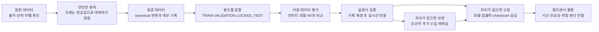

# SafeNest 멀티센서 중간배포 기술 맥락 및 인수인계

검토 기준일은 2026-08-13이며, 이 문서는 AI 부분을 독립적으로 정비하는 standalone 저장소의 `main` 기준점(`77b1695`)을 설명한다. 수치와 상태는 사람이 쓴 요약보다 validator(규칙을 자동으로 다시 확인하는 검사 프로그램), manifest(데이터·모델·설정을 기록한 명세 파일), checksum(파일이 바뀌었는지 확인하는 식별값)을 우선하여 정리했다. 경로는 다른 컴퓨터에서도 읽을 수 있도록 저장소 안의 상대경로로 적었다. 문서에 나오는 영문 상태명은 프로그램이 실제로 사용하는 이름이므로 그대로 두고, 바로 뒤에 한국어 의미를 설명한다.

## 1. 한눈에 보는 센서별 현재 단계와 남은 작업

### 먼저 알아둘 공통 단계

세 센서의 공통 문제는 “실행되는 모델은 있지만 어떤 원본을 어떤 기준으로 처리했는지, 실제 센서에서도 같은 입력이 들어오는지 설명하기 어렵다”는 것이다. 그래서 아래 순서로 근거를 쌓는다.

- **A단계 — 데이터와 처리 기준을 고정하는 단계**

  원본 데이터의 출처·단위·라벨(정답 이름)·시간 정보를 확인하고, 안전하게 읽은 뒤 canonical data(후속 코드가 항상 같은 모양으로 읽는 표준 데이터)로 변환한다. 한 사람 또는 한 시간 구간의 자료가 학습과 평가에 동시에 들어가지 않도록 분할하고, 각 샘플이 어느 원본에서 왔는지 provenance(데이터 계보)로 기록한다. 이 과정을 거치면 데이터가 섞이거나 라벨이 임의로 바뀌는 문제를 찾을 수 있고, 다른 사람이 같은 원본으로 같은 입력을 다시 만들 수 있다.

- **B단계 — 저장 데이터에서 모델을 공정하게 비교하는 단계**

  A단계에서 고정한 데이터만 사용해 전처리(모델에 넣기 전 신호를 정리하는 작업), 모델 구조, 학습 방법, 초기값을 비교한다. 전처리 통계는 TRAIN에서만 계산하고, VALIDATION으로 모델을 고르며, LOCKED_TEST는 선택이 끝난 뒤 한 번만 확인한다. 여러 조건의 입력 변화, 모델 변환 전후 결과, 실행 시간과 메모리도 확인한 뒤 작은 장치에서 실행하기 쉬운 INT8 모델(8비트 정수로 줄인 경량 모델)과 그 근거를 잠근다. 이렇게 하면 특정 시험을 외워 성능이 부풀거나, 변환 과정에서 모델이 몰래 달라지는 일을 줄일 수 있다. 다만 B 결과는 저장 데이터 기반 offline 후보일 뿐 실제 센서 성능을 뜻하지 않는다.

- **C단계 — 실제 센서와 목표 장치에서 입력을 확인하는 단계**

  공개 데이터와 실제 MR60·SCD40·열화상 센서의 값이 다를 수 있고, 측정 주기·초기 안정화·누락·stale(새 값이 오지 않았는데 과거 값이 계속 남는 상태)·통신 지연도 발생할 수 있다. 따라서 실제 센서를 반드시 사용해 원시값, 측정 시각, 유효 여부를 먼저 기록하고, 저장한 기록을 반복 재생해 B단계 전처리와 모델에 넣어 비교한다. 그 다음 센서에서 AI까지 실시간으로 연결하고 Raspberry Pi 처리 시간과 오류 대응을 확인한다. 이 순서를 통과해야 “실제 장치 입력이 모델 입력 계약과 맞는다”고 말할 수 있다.

- **D단계 — 실제 센서와 공개 데이터의 차이를 보완하는 조건부 단계**

  C단계에서 실제 센서의 범위·잡음·환경·사람 특성이 공개 데이터와 달라 성능이 떨어지거나 필요한 조건이 비어 있으면 시작한다. 부족한 조건을 정해 실센서 데이터를 추가 수집하고, A단계와 같은 기록·라벨·분할 기준을 적용한 뒤 B단계와 같은 비교·검증 절차로 재학습한다. 단순히 데이터를 많이 섞는 작업이 아니라, C에서 확인한 구체적인 차이를 메우는 재학습이다. C에서 의미 있는 차이가 발견되지 않으면 D단계는 수행하지 않는다.

- **E단계 — 검증된 결과를 통합 가능한 묶음으로 고정하는 단계**

  모델 파일만 고정하는 것이 아니라 입력 크기, 전처리 설정, 라벨 순서, 출력 의미, checksum, 예외 처리 규칙을 함께 잠근다. 이 묶음이 있어야 통합 과정에서 모델 파일만 바뀌거나 입력 순서가 달라지는 일을 막을 수 있다.

- **I단계 — 여러 센서를 하나의 시스템으로 연결하는 단계**

  각 센서의 결과를 공통 packet(전송 데이터 묶음), timestamp(측정 시각), validity(값이 유효한지 나타내는 상태), 위험 판단 규칙으로 연결한다. 센서별 결과가 각각 맞더라도 전체 시스템에서 시간과 오류 상태가 섞이면 잘못된 판단이 나올 수 있으므로, 마지막에 팀 코드와 Raspberry Pi에서 함께 확인한다.

### 센서별 현재 위치

| 센서 | 작업한 단계 | 현재 단계 | 작업한 단계에서 해결한 문제와 얻은 결과 | 앞으로 남은 필수 관문과 그 의미 | D단계가 필요한 경우 |
| --- | --- | --- | --- | --- | --- |
| mmWave | M-A0~M-A6, M-B0~M-B12 | **M-C 시작 전**. 공개 데이터 기반 offline 후보는 있으나 MR60 실센서 검증은 아직 없음 | 원본 레이더 신호를 표준화하고 사람 단위로 분할한 뒤, 여러 전처리·모델·INT8 변환을 비교해 재현 가능한 후보와 제한사항을 고정함 | **M-C:** MR60 원시값을 기록·재생하고 실시간 입력과 Raspberry Pi 실행을 확인함. 그 결과를 반영해 **M-E:** 최종 모델·입력·출력 묶음을 고정한 뒤 공통 I단계로 연결함 | MR60 신호와 공개 데이터의 주파수·크기·잡음·사람별 차이가 커서 후보 성능이 유지되지 않을 때, 그 조건의 실측 자료를 추가해 재학습함 |
| CO₂ | C-A0~C-A6, C-B0~C-B5 | **C-C 시작 전**. UCI 데이터 기반 재실 판단 offline 후보는 있으나 SCD40 검증은 아직 없음 | 원본 시간 구간과 입력 항목을 보존하고, 시간 블록을 분리해 전처리·경계값·모델·INT8 변환을 비교한 뒤 후보를 고정함 | **C-C:** SCD40의 측정 주기, warm-up(전원을 켠 뒤 안정되는 시간), 결측·stale·재연결과 실제 값 분포를 기록·재생·실시간으로 확인함. 그 결과를 반영해 **C-E:** CO₂ 모델과 입력 계약을 고정하고 공통 I단계로 연결함 | SCD40의 측정 범위·주기·환경 또는 결측 패턴이 UCI와 달라 재실 판단이 흔들릴 때, 그 조건의 실측 자료를 추가해 재학습함 |
| Thermal | T-A0~T-A6 | **T-B 개발 전**. 표준 열화상 데이터는 준비됐지만 새 모델 비교는 아직 시작하지 않음 | 온도 단위, 화면 변환, 라벨 의미, 원본 분할과 중복 한계를 확인해 재학습에 사용할 데이터 기준을 고정함 | **T-B0:** 섭씨 입력을 모델에 넣는 방법과 유사 장면 처리·독립 평가 방법을 정함. **T-B:** 여러 모델을 비교하고 후보를 고정함. 이후 **T-C:** 실제 열화상 센서와 장치 입력을 확인하고, **T-E**와 공통 I단계로 진행함 | 실제 센서의 화면·온도 범위·고장 pixel·환경 또는 실제 사건 라벨이 현재 자료로 설명되지 않을 때, 부족한 조건의 데이터를 추가해 재학습함 |

### mmWave 세부 진행

- **문제 상황**

  기존 실행 모델은 실제 데이터에서 어떤 학습 계보를 거쳤는지 충분히 연결되지 않았거나 합성 데이터에 의존했다. 같은 사람의 기록이 학습과 평가에 섞이면 사람을 새로 만났을 때의 실력보다 성능이 높게 보일 수 있다.

- **A단계에서 한 일**

  110명, 440개 recording(측정 기록)을 안전하게 읽어 30초 단위 window(분석 구간)로 만들고, 한 사람의 모든 기록이 TRAIN·VALIDATION·LOCKED_TEST 중 한 곳에만 들어가도록 77명·17명·16명으로 나눴다. 라벨이 애매한 `AMBIGUOUS` 구간은 학습에서 빼되 삭제하지 않고 계보에 남겼다. 표준 신호와 사람 단위 분할은 `datasets/mmwave/processed/mmwave_canonical_real_v1.npy`, `datasets/mmwave/splits/mmwave_real_subject_split_v1.json`에 고정되어 있으며, 변환 결과는 `datasets/mmwave/manifests/a6_full_conversion/`에서 확인한다. `APNEA`는 자발적 숨참 구간으로 만든 SafeNest용 대리 라벨이며 의료 진단 라벨이 아니다.

- **B단계에서 한 일**

  고정된 자료에서 전처리, 클래스 불균형 처리, 모델 구조, seed(같은 실험을 다시 시작하기 위한 초기값), 입력 흔들림, 실행 경로와 INT8 변환을 비교했다. 최종 후보는 호흡 대역만 남기고 TRAIN 통계로 크기를 맞추는 `BPF_ZSCORE`와 `Conv1D/GAP` 구조를 사용하며, 후보 파일과 선택 근거는 `models/mmwave/experiments/M-B6_stage_equivalence/`와 `datasets/mmwave/manifests/M-B11_artifact_lock/`, `M-B12_phase_b_offline_final/`에 있다.

- **현재 의미**

  같은 공개 데이터와 같은 규칙으로 후보를 다시 만들고 비교할 수 있다는 뜻이다. MR60에서 같은 호흡 신호가 들어오는지, Raspberry Pi에서 충분히 빠른지는 아직 확인하지 않았다. 최종평가에는 제한적인 재사용 이력이 있으므로 새롭고 완전히 독립된 시험이라고 과장해서는 안 된다.

- **남은 작업**

  M-C에서 MR60의 원시값·위상값·사람 감지 상태·측정 시각을 기록하고, 기록 재생과 실시간 연결을 모두 확인한다. 초당 10회 측정되는 30초 입력과 `BPF_ZSCORE` 처리가 실제 센서에도 같은 의미인지 비교하고, Raspberry Pi 처리 시간과 fail-closed(잘못된 입력을 정상값으로 바꾸지 않고 중단하는 방식)를 확인한다. 이후 M-E에서 모델과 입력·출력 계약을 함께 고정한다.

- **D단계가 필요한 경우**

  MR60의 신호 분포가 공개 자료와 달라 모델이 특정 호흡 상태를 놓치거나, 실제 장치의 잡음·거리·자세 조건에서 성능이 떨어질 때만 해당 조건의 실측 자료를 추가해 재학습한다.

### CO₂ 세부 진행

- **문제 상황**

  기존 CO₂ 모델은 원본, 시간 분할, scaler(서로 다른 단위의 값을 비교 가능한 크기로 바꾸는 변환), 경계값이 한 묶음으로 추적되지 않았다. 그러면 새 SCD40 자료를 같은 기준으로 처리하기 어렵고, 평가 자료가 학습에 미리 섞였는지도 확인하기 어렵다.

- **A단계에서 한 일**

  UCI Occupancy Detection Dataset의 20,560개 관측을 원본 시각·파일·행·정답과 연결하고, 시간 구간을 보존해 TRAIN·VALIDATION·LOCKED_TEST를 나눴다. 표준 표본과 분할은 `datasets/co2/manifests/c_a5_canonical_samples/`와 `c_a6_final_integrity_lock/`에서 확인한다. 이 자료의 `OCCUPIED`는 방에 사람이 있었는지를 나타내는 라벨이지 CO₂ 안전 농도 판정이 아니다.

- **B단계에서 한 일**

  CO₂, 온도, 습도와 `CO2_slope`(시간에 따른 CO₂ 변화 속도)를 어떤 입력 조합으로 사용할지 비교하고, 전처리 통계·불균형 보정·경계값·선형 모델·INT8 변환을 고정했다. 후보와 C-B0~C-B5 근거는 `datasets/co2/manifests/c_b0_offline_experiment_contract/`부터 `c_b5_robustness_final_lock/`, 모델은 `models/co2/candidates/`에 있다. 변환 전후 판단 차이와 INT8 saturation(표현 가능한 범위를 넘어 값의 차이를 구분하지 못하는 현상)은 기록되어 있다.

- **현재 의미**

  UCI 시간 자료에서는 같은 입력 항목, 전처리, 경계값과 후보를 다시 만들 수 있다는 뜻이다. SCD40의 실제 측정 주기·warm-up·결측·환경 분포가 UCI와 같은지는 아직 확인하지 않았으므로 CO₂ 안전경보나 실제 장치 배포 모델이라고 부를 수 없다.

- **남은 작업**

  C-C에서 SCD40 데이터를 원시값·측정 시각·유효 상태와 함께 기록하고, 기록 재생으로 `CO2_slope`와 scaler가 같은 방식으로 계산되는지 확인한다. 이후 센서에서 AI까지 실시간 연결해 stale·재연결·누락을 fail-closed로 처리하고, SCD40과 Raspberry Pi의 처리 시간을 확인한 뒤 C-E에서 후보와 입력 계약을 고정한다.

- **D단계가 필요한 경우**

  SCD40의 실제 값 범위, 측정 간격, 설치 환경 또는 결측 패턴이 UCI와 달라 재실 판단이 흔들릴 때만 그 조건의 실측 자료를 추가해 재학습한다.

### Thermal 세부 진행

- **문제 상황**

  기존 열화상 모델은 입력 배열의 온도 단위·화면 방향·라벨 의미·데이터 분할이 충분히 연결되지 않았다. `LYING`을 실제 낙상 사건으로 해석하거나, 학습과 평가에 거의 같은 장면이 함께 들어가면 성능을 실제보다 높게 말할 수 있다.

- **A단계에서 한 일**

  SDT Dataset을 기준으로 640×480 `uint16`(16비트 정수) 원본을 섭씨 온도로 복원하고, 정해진 crop·bilinear(주변 pixel을 비율로 섞는 축소 방식) 규칙으로 62×80 표준 frame(한 장면)으로 만들었다. 원본이 제공한 TRAIN·VALIDATION·REAL_EVAL_DEVELOPMENT 역할을 유지해 총 48,000장을 변환하고, 중복·계보·품질 한계를 기록했다. 변환 규칙은 `datasets/thermal/manifests/T-A2_geometry_calibration_canonical_frame/`, 전체 결과는 `datasets/thermal/manifests/T-A6_execution_result/`와 `T-A6_full_conversion_integrity/`에서 확인한다.

- **현재 의미**

  섭씨값을 가진 표준 열화상과 그 출처를 다시 만들 수 있다는 뜻이다. 실제 촬영 자료는 개발 중 참고 평가에 사용되어 pristine LOCKED_TEST(한 번도 선택에 쓰지 않은 최종시험 자료)로 되돌릴 수 없고, 원본에 사람·촬영 회차·실제 낙상 사건 정보가 없어 새 사람이나 시간상의 낙상을 검증할 수 없다. TRAIN과 VALIDATION 사이의 near-duplicate(내용이 거의 같은 장면)도 확인되어, 향후 성능을 해석할 때 중복 구조를 계속 반영해야 한다.

- **현재 개발 전인 부분**

  T-B는 아직 시작하지 않았다. 섭씨 표준 입력과 기존 모델의 0~1 입력 변환을 어떻게 맞출지, near-duplicate를 어떻게 통제할지, 독립적인 최종평가 자료를 어떻게 마련할지 먼저 정해야 한다. 따라서 새 Thermal 모델 후보나 실제 낙상 성능은 아직 없다.

- **남은 작업**

  T-B0에서 입력·라벨·평가 계약을 정한 뒤 여러 모델을 비교하고, 선택 결과와 전처리·checksum을 함께 고정한다. 그 다음 T-C에서 실제 열화상 센서의 센서명, 화면 형태, 온도 변환, 고장 pixel 처리, 전송 방식을 기록·재생·실시간으로 확인하고 T-E와 공통 I단계로 진행한다.

- **D단계가 필요한 경우**

  실제 센서의 온도 범위·화면 방향·환경 변화 또는 실제 사건 라벨이 현재 자료와 달라 모델이 불안정할 때만 그 조건에 맞는 자료를 추가해 재학습한다.

세 센서는 서로 독립적인 파일과 장비를 사용하는 범위에서 병렬로 진행할 수 있다. 예를 들어 mmWave M-C와 CO₂ C-C를 측정하는 동안 Thermal T-B0를 준비하고, I-0에서 공용 계약을 읽기 전용으로 대조할 수 있다. 다만 한 센서 안에서는 A, B, C 순서를 지키고, C에서 구체적인 차이가 확인되기 전에 D 재학습을 시작하지 않는다.

## 2. 이 중간배포의 목적과 의미

SafeNest의 목표는 센서별 값을 한 번 읽는 것이 아니라, 실제 센서가 보내는 데이터를 같은 기준으로 해석하고 그 결과를 다른 사람이 다시 확인할 수 있게 만드는 것이다. 이 기준이 없으면 새 실센서 자료가 들어왔을 때 처리 방식이 달라지고, 기존 모델이 어떤 데이터와 규칙으로 만들어졌는지 알 수 없어 재학습이나 공정한 비교를 처음부터 다시 해야 한다.

이번 중간배포는 세 센서의 데이터·실험·모델 근거를 한 시점에 고정한 인수인계 기준점이다. mmWave와 CO₂는 저장 데이터 기반 후보까지 만들었고, Thermal은 재학습 전 데이터 기준을 정리했다. 아직 어느 센서도 실센서·Raspberry Pi·멀티센서 통합·임상 또는 제품 안전 성능을 완료했다고 말하지 않는다. 1번에서 설명한 단계는 센서별 증거가 어느 순서로 쌓였고 앞으로 어떤 확인이 필요한지를 보여준다.

## 3. 시스템 구조와 증거의 경계

GitHub Markdown은 Mermaid 흐름도를 지원하므로, 세 센서가 공통으로 따르는 흐름을 다음과 같이 표시한다.

- **Offline evidence(저장 데이터 증거)**

  실제 센서를 연결하지 않고 데이터셋, 표준 파일, 모델, 입력 변화 시험 또는 mock(정해진 가짜 입력으로 연결만 확인하는 모의 실행)에서 얻은 결과다. TFLite는 Raspberry Pi처럼 자원이 제한된 장치에서 실행하기 위한 모델 형식이다.

- **Device-domain evidence(실제 장치 환경 증거)**

  실제 센서와 목표 장치에서 측정 단위, 주기, 초기 안정화, 누락, 보정, 전처리와 처리 시간을 확인한 결과다. 실제 센서 데이터를 저장해 반복 재생하는 검증도 이 단계의 일부지만, 최종적으로는 실시간 연결까지 확인해야 한다.

- **Integration evidence(통합 증거)**

  센서 결과가 SafeNest 통신·위험 판단·표시 흐름에 연결된 뒤에도 측정 시각과 유효 상태를 보존하는지 확인한 결과다. 한 센서의 모델이 잘 작동했다는 사실만으로 전체 통합이 끝난 것은 아니다.

standalone 저장소는 AI 데이터·전처리·모델·평가 코드를 정비하는 작업장이다. 팀 저장소에서는 실제 센서와 통신하는 driver(장치 구동 코드)가 `devices/<device>/src/`, 여러 구성요소가 함께 쓰는 공용 계약이 `shared/contracts/`, AI 전처리·추론·모델·검증이 `ondevice_ai/`에 속한다. 따라서 실제 장치 driver를 AI 폴더에 중복 복사하지 않고, C단계에서 입력 계약을 대조한 뒤 필요한 연결만 명시적으로 만든다.

## 4. 센서별 개발 결과와 현재 산출물

### mmWave: 호흡 레이더 데이터 기반 후보

mmWave의 표준 입력은 초당 10회 측정되는 신호를 30초 단위로 묶은 300개 값이다. 후보 모델은 정상 호흡, 빠르거나 비정상적인 호흡, 자발적 숨참 기반 `APNEA` proxy를 구분하며, 이 proxy는 의료 진단이 아니다. 최종 후보 파일과 전처리·라벨·실행 정보는 `models/mmwave/experiments/M-B6_stage_equivalence/`와 `datasets/mmwave/manifests/M-B12_phase_b_offline_final/`에 있다. 현재 결과는 `REAL_DATA_OFFLINE_CANDIDATE`(실제 공개 데이터에서 고정한 저장 데이터 기반 후보)이며, MR60 실센서와 Raspberry Pi 결과는 아직 없다.

M-C에서는 MR60의 raw(센서가 처음 내보내는 값), phase(파동 위상 정보), presence(사람 감지 상태), timestamp를 기록하고, 그 기록을 기존 전처리로 재생한 뒤 실시간 연결을 확인한다. 공개 데이터와 MR60의 신호 차이가 확인될 때만 M-D에서 해당 조건을 추가 수집하고 재학습한다.

### CO₂: 실내 재실 판단 후보

CO₂의 표준 입력은 CO₂·온도·습도와 시간에 따른 CO₂ 변화 속도다. C-A에서 원본 시간 구간과 정답을 보존했고, C-B에서 입력 조합·scaler·경계값·선형 모델·INT8 변환을 비교했다. 후보와 근거는 `models/co2/candidates/`와 `datasets/co2/manifests/c_b5_robustness_final_lock/`에 있다. 현재 후보는 UCI 저장 데이터의 `OCCUPIED`(사람이 있었는지) 판단용이며, CO₂ 농도 안전경보 모델이나 SCD40 배포 완료 모델은 아니다.

C-C에서는 SCD40을 실제로 연결해 raw 값, 측정 주기, warm-up, stale, 누락, 재연결과 환경 변화 반응을 기록한다. 기록 재생으로 `CO2_slope`와 전처리가 같은지 확인한 뒤 실시간 센서에서 AI로 이어지는 경로와 Raspberry Pi 실행을 확인한다. SCD40 분포가 UCI와 달라 성능이 흔들릴 때만 C-D에서 해당 조건의 자료를 추가하고 재학습한다.

### Thermal: 열화상 표준 입력 정비

Thermal의 표준 입력은 원본의 온도 단위를 섭씨로 복원한 뒤 정해진 영역을 62×80으로 줄인 한 장의 frame이다. T-A에서 원본 분할·라벨·변환·중복 한계를 고정했고, 전체 변환 근거는 `datasets/thermal/manifests/T-A6_execution_result/`에 있다. `EMPTY_ROOM`, `SITTING`, `STANDING`, `LYING`은 장면·자세 라벨이며, `LYING`을 실제 낙상 사건으로 해석할 수 없다.

현재 Thermal은 T-A0~T-A6까지만 끝났고 T-B 모델 개발은 시작 전이다. 기존 모델이 합성 데이터에서만 확인되었고 입력도 새 섭씨 표준 데이터와 다르므로, T-B0에서 입력 정규화·중복 통제·독립 평가 방법을 먼저 정해야 한다. 이후 T-B 모델 비교, T-C 실제 열화상 센서 기록·재생·실시간 연결, T-E 산출물 고정 순서로 진행한다. 실제 센서의 온도 범위나 화면·사건 정보가 현재 기준과 다를 때만 T-D를 수행한다.

## 5. 현재 모델과 산출물의 역할

새 모델 후보는 바로 운영 기본값으로 교체하지 않고, 입력 계약·전처리·라벨 순서·모델 파일·검증 결과를 함께 검토한 뒤 승격한다.

| 산출물 | 입력과 출력 | 현재 역할 |
| --- | --- | --- |
| `models/mmwave/experiments/M-B6_stage_equivalence/M-B3_CONV1D_GAP_BASELINE_seed42_M-B5_CAL_CLASS_BALANCED_120_int8.tflite` | 300개 호흡 신호 → 3개 호흡 상태 | 공개 데이터 기반으로 고정한 mmWave offline 후보이며 MR60 배포 모델은 아님 |
| `models/mmwave/mmwave_resp_int8_v0.1.0.tflite` | 300개 호흡 신호 → 3개 상태 | 과거 비교 기준. 한 클래스에 치우치는 문제가 있어 새 후보와 동등하지 않음 |
| `models/co2/candidates/c_b4/full_integer_int8.tflite` | CO₂·온도·습도·변화 속도 → 재실 확률 | UCI 기반 CO₂ offline 후보이며 SCD40 검증 전임 |
| `models/co2/co2_occupancy_int8_v0.1.0.tflite` | 과거 세 입력값 → 빈방·재실 | 이전 실행용 자산이며 새 C-B5 후보로 자동 교체하지 않음 |
| `models/thermal/thermal_fall_int8_v0.1.0.tflite` | 62×80 열화상 → 사람 없음·정상 자세·낙상 유사 자세 | 합성 데이터 기반 과거 자산이며 새 Thermal 표준 입력에서 성능 미확인 |

## 6. 알려진 한계와 인수인계 경계

- **라벨이 뜻하는 범위**

  mmWave `APNEA`는 의료진의 무호흡 진단이 아니고, CO₂ `OCCUPIED`는 위험 농도 판정이 아니며, Thermal `LYING`은 실제 낙상 사건 라벨이 아니다.

- **평가가 뜻하는 범위**

  mock 성공은 코드 연결만 확인한다. Mac에서 잰 지연 시간은 Raspberry Pi 성능으로 바꾸어 말할 수 없다. 저장 데이터 후보는 실센서 검증이나 제품·임상 안전 성능을 대신하지 않는다.

- **데이터를 다시 나누면 안 되는 이유**

  mmWave 사람 단위 분할과 CO₂ 시간 블록을 다시 섞지 않는다. CO₂ LOCKED_TEST는 이미 확인했으므로 그 결과를 보고 모델을 다시 고르지 않는다. Thermal의 개발용 실제 자료를 파일명만 바꾸어 새로운 LOCKED_TEST라고 부르지 않는다.

- **모델을 옮길 때 함께 보존할 것**

  모델 파일뿐 아니라 입력 크기, 입력 항목 순서, 라벨 대응표, 전처리 설정, checksum, 결과 manifest를 함께 다룬다. 하나라도 빠지면 같은 모델을 다시 실행했다고 보기 어렵다.

- **팀 저장소 이관 경계**

  Git이 추적하는 active 파일만 `ondevice_ai/`로 옮기고, raw archive·개인 장비 자료·cache·가상환경·standalone `archive/`는 옮기지 않는다. `devices/`와 `shared/contracts/`는 AI 코드로 덮어쓰지 않으며, 실제 driver나 팀 threshold를 바꾸는 작업은 별도 검토가 필요하다.

## 7. 다음 개발 절차와 중간배포 판정

- **mmWave 다음 작업**

  M-C에서 MR60 원시값을 기록·재생·실시간 검증하고 Raspberry Pi 실행을 측정한다. 공개 데이터와 실제 신호 차이가 발견되면 M-D 재학습을 수행하고, 차이가 없으면 M-E에서 후보와 입력 계약을 고정한다.

- **CO₂ 다음 작업**

  C-C에서 SCD40 warm-up, 주기, 결측, stale, 재연결, `CO2_slope`와 UCI 분포 차이를 측정한다. 차이가 확인될 때만 C-D 재학습을 하고, 그 다음 C-E에서 모델과 경계값을 고정한다.

- **Thermal 다음 작업**

  T-B0에서 섭씨 표준 입력과 기존 실행 코드의 변환 관계, near-duplicate 처리, 독립 평가 자료를 정한다. T-B 모델 비교를 끝낸 뒤 T-C 실센서 검증과 T-E 산출물 고정을 진행한다. 현재 T-B 모델 개발은 아직 시작 전이다.

- **공통 통합 작업**

  I-0에서 AI provider(센서값을 AI에 공급하는 코드), `devices/`, `shared/contracts/`의 입력 의미·timestamp·validity를 읽기 전용으로 대조한다. 센서별 C단계가 끝나기 전에는 전체 위험 판단 성능이나 멀티센서 통합 완료를 주장하지 않는다.

- **현재 판정**

  mmWave는 저장 데이터 기반 M-B12 후보까지, CO₂는 저장 데이터 기반 C-B5 후보까지, Thermal은 데이터 기준을 정리하는 T-A6까지 완료했다. 세 센서 모두 실제 센서·Raspberry Pi·통합 검증은 남아 있다. 이 문서는 담당자가 바뀌어도 같은 기준으로 다음 데이터를 기록하고, 필요한 경우에만 D 재학습을 수행하도록 만든 중간 인수인계 자료다.
