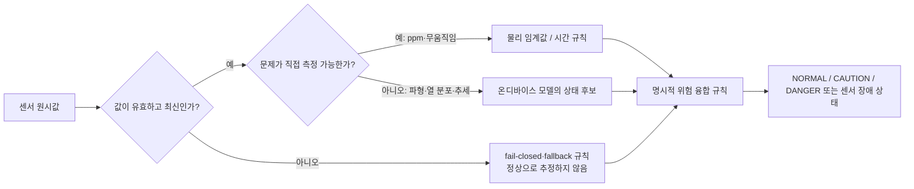

# SafeNest에서 AI와 Rule/Threshold를 함께 사용하는 이유

**문서 성격:** 기술 근거 종합 보고서
**검토 기준 커밋:** `efc7e2e` (`main`, 2026-08-16 확인)
**결론 한 줄:** SafeNest는 AI를 모든 판단의 대체재로 쓰지 않는다. 물리적으로 직접 측정되는 위험은 명시적인 규칙과 임계값으로 처리하고, 시간에 따른 변화·열 분포·여러 값의 관계처럼 단일 숫자로 안전하게 설명하기 어려운 부분에만 모델을 사용하며, 최종 알림은 다시 명시적인 위험 규칙과 센서 상태 확인으로 결정한다.

## 1. 이 문서가 답하는 질문

“CO₂ 수치나 호흡수에 임계값을 정하면 되는데 왜 온디바이스 AI가 필요한가?”라는 질문은 타당하다. 임계값은 계산이 빠르고, 사람이 이해하기 쉽고, 기준을 검토하거나 바꾸기 쉽다. 특히 사람이 없는 상태, 센서 연결 해제, 비정상적으로 높은 CO₂처럼 **측정값 자체가 행동 기준인 문제**에서는 임계값이 우선이어야 한다.

반면 SafeNest가 다루는 일부 입력은 한 순간의 숫자만으로 의미가 고정되지 않는다. mmWave는 30초간의 호흡 위상 신호가 시간에 따라 어떻게 변했는지를, Thermal은 한 장의 80×62 열 분포에서 사람의 자세와 공간적 형태를, CO₂ 점유 추정은 현재 농도와 최근 농도 변화가 함께 어떤 상태를 시사하는지를 본다. 이 문서는 이러한 구분이 실제 저장소의 데이터 계약, 모델 계약, 오프라인 평가 결과, 위험 규칙과 맞는지 점검한다.

이 문서는 “AI가 항상 임계값보다 좋다”는 주장을 하지 않는다. 현재 저장소에는 각 센서의 **직접적인 raw threshold 대 AI 비교 실험**이 없으며, 그 부재와 앞으로 필요한 비교 방법도 함께 기록한다.

## 2. SafeNest의 책임 분리 원칙

| 입력 또는 판단 | 주된 방식 | 이유 | 현재 근거 |
|---|---|---|---|
| 센서 누락, 오래된 값, NaN/무한대, 모델 파일 불일치 | 명시적 fail-closed 규칙 | 이 경우에는 “정상”을 추정하지 말고 데이터가 신뢰할 수 없음을 드러내야 한다. | `inference/validator.py`, `risk/fallback.py`, 각 센서 adapter |
| CO₂ 환기·밀폐 위험의 ppm 경보 | 물리 임계값 | ppm은 직접 측정되는 농도이므로 경보 기준을 사람이 검토할 수 있다. | `risk/risk_config.json`의 warning/danger ppm |
| PIR 움직임/장시간 무움직임 | 시간 규칙 | PIR은 움직임 유무 이벤트가 핵심이므로 별도 AI보다 마지막 움직임 시각과 유예 시간이 더 직접적이다. | `sensors/pir/pir_adapter.py` |
| mmWave 호흡 상태 후보 | 시간 신호 모델 | 단일 순간 값이 아니라 전처리된 30초 파형의 패턴을 입력으로 쓴다. | `models/mmwave/mmwave_offline_candidate_lock_v1.json` |
| CO₂ 점유 상태 후보 | 작은 통계 모델 | 현재 CO₂와 과거 150초의 변화율을 함께 사용한다. 이는 CO₂ ppm 경보와 다른 질문이다. | `models/co2/candidates/c_b6/input_contract.json` |
| Thermal 자세 후보 | 공간 영상 모델 | 80×62 열 분포의 위치·형태를 함께 보므로 한 개 온도 임계값으로 대체하기 어렵다. | `models/model_manifest.json`, `inference/thermal_interpreter.py` |
| 최종 위험 등급·강제 경보 | 명시적 위험 규칙 | 모델 점수만으로 알림을 확정하지 않고, 가중치·경보 구간·긴급 조건·센서 건강 상태를 규칙으로 적용한다. | `risk/risk_engine.py`, `config/risk_rules.yaml` |

즉, 모델은 **상황 해석 후보를 내는 구성요소**이고, 안전 동작의 마지막 결정권자는 명시적 규칙과 건강 상태 검사다.

## 3. 단순 임계값이 우선인 이유와 한계

임계값은 다음 장점이 있어 SafeNest에서 계속 필요하다.

- **설명 가능성:** 예를 들어 “CO₂가 정한 ppm을 넘었다”는 판단은 현장 운영자가 즉시 확인할 수 있다.
- **예측 가능한 동작:** 규칙은 입력이 같으면 언제나 같은 결과를 내며, 모델 재학습 여부와 무관하다.
- **고장 대응:** 센서 값이 없거나 비정상일 때 모델에게 정상 상태를 추정시키지 않고, 장애·degraded 상태로 전환할 수 있다.
- **안전 경계 설정:** `risk/risk_engine.py`는 위험 점수 구간과 thermal 긴급 override 같은 최종 행동 조건을 규칙으로 보유한다.

그러나 하나의 값만 보는 규칙에는 한계도 있다. CO₂가 낮더라도 막 입실한 상태일 수 있고, 높더라도 사람 수·환기·측정 위치에 따라 원인이 다를 수 있다. mmWave의 한 시점 진폭이나 추정 rpm도 움직임·노이즈·센서 도메인 차이에 영향을 받는다. Thermal의 평균 온도는 사람이 바닥에 누운 모양인지, 서 있는 사람인지, 배경 열원인지 구분하지 못한다. 이러한 한계가 곧 AI 채택의 근거이지만, 아직 이 저장소는 해당 한계를 **동일 분할에서 규칙과 수치로 겨룬 실험**으로 완전히 증명하지는 않았다.

## 4. 현재 평가 근거를 읽는 방법

이 보고서의 결과는 다음 세 종류를 구분한다.

| 표기 | 뜻 | 이 문서에서의 사용 |
|---|---|---|
| **ML↔ML 비교** | 같은 데이터 역할에서 두 모델 구조·전처리·후보를 비교한 결과 | 존재하는 경우 수치로 인용한다. |
| **Threshold↔AI 직접 비교** | 같은 분할·같은 목표에서 고정 규칙 기준선과 모델을 함께 평가한 결과 | 현재 세 AI 센서 모두 `NOT_TESTED`다. |
| **구현 규칙** | 실제 위험 엔진·fallback에 있는 운영 규칙 | 존재 사실은 설명하지만, 그것을 모델 성능 기준선으로 오해하지 않는다. |

CO₂의 `0.43`은 모델이 계산한 **점유 확률**의 판정선이다. 이는 raw CO₂ ppm 임계값이 아니며, 따라서 “CO₂ 임계값이 모델과 비교돼서 0.43이 선택됐다”는 뜻도 아니다. 이 판정선은 B6에서 TRAIN 내부 절차로 고정됐고, physical acquisition은 아직 시작되지 않았다.

## 5. mmWave: 시간 파형을 모델로 해석하는 부분

### 5.1 입력과 목표의 범위

현재 오프라인 후보의 입력은 전처리된 `resp_phase_model_ready_bpf_zscore` 신호 30초이며, 10 Hz로 300개 표본을 갖는 `[1, 300, 1]` INT8 텐서다. Band-pass filter와 train-only z-score 정규화가 포함되어 있다. 후보의 세 클래스는 `NORMAL`, `RAPID_OR_ABNORMAL`, `APNEA`지만, `APNEA`는 자발적 breath-hold에서 파생된 **SafeNest proxy**로서 임상 수면무호흡 진단이 아니다.

이처럼 모델 입력이 시간 창 전체인 이유는 파형의 반복성·변화 속도·형태가 필요한 문제이기 때문이다. 다만 이 사실만으로 모델이 rpm 기반 규칙보다 낫다고 결론 내릴 수는 없다.

### 5.2 실제 오프라인 모델 비교 근거

M-B4에서는 동일한 Conv1D 계열과 separable Conv1D 계열을 여러 초기값(seed)에서 비교했다. 일반 Conv1D 후보의 validation Macro F1 평균은 0.481275, 범위는 0.329107~0.663708이었고, separable 후보는 평균 0.438177이었다. 따라서 선택된 Conv1D도 초기화에 민감하며 안정적인 우월성을 주장할 수 없다.

후속 복구 평가(M-B10R1B)의 75개 재사용 locked-test 행에서는 선택 후보가 Macro F1 0.494836, 정확도 0.56을 기록했다. 과거 두 **신경망** baseline은 Macro F1 0.166667과 0.391074였으므로, 이 비교에서는 선택 후보가 두 역사적 모델보다 높았다. 그러나 이 평가는 최초 locked-test 평가가 pre-inference 구조 오류로 중단된 뒤 재사용된 결과이므로 pristine final test가 아니며, 이를 최종 일반화 성능으로 부를 수 없다.

선택 후보의 약점도 명확하다. 같은 평가에서 NORMAL recall은 0.20, RAPID_OR_ABNORMAL recall은 0.421053이었고, APNEA proxy recall은 0.935484인 반면 proxy false-positive rate는 0.522727이었다. 즉 특정 proxy를 놓치지 않는 방향의 성질은 보였지만 오경보 부담이 크며, 임상·MR60 실센서·Raspberry Pi 성능은 검증되지 않았다.

### 5.3 mmWave의 threshold 비교 상태

`NOT_TESTED`다. 현재 저장소에는 고정된 rpm 범위, 무호흡 지속시간, 또는 신호 품질 규칙을 동일 subject split·동일 window에서 평가한 raw rule baseline 결과가 없다. `risk/risk_config.json`의 rpm 및 apnea confirm 설정은 운영 규칙이며, 모델과의 공정 성능 비교 결과가 아니다.

## 6. CO₂: 점유 추정과 공기질 경보를 분리하는 부분

### 6.1 현재 후보의 실제 계약

현재 C-B6 후보는 역사적 C-B5의 4특성(`CO2`, `Temperature`, `Humidity`, `CO2_slope`)을 수정한 것이 아니라, 별도로 잠근 2특성 logistic 모델이다. 특성 순서는 정확히 `CO2`, `CO2_slope`이고, slope는 과거 150초에서 endpoint difference 방식으로 계산한다. Temperature와 Humidity는 이 후보에 포함되지 않으며 추가 입력으로 금지되어 있다. scaler는 TRAIN만으로 적합됐다.

이는 “온도·습도가 절대 필요 없다”는 일반 명제가 아니다. 현 기획의 burden-of-proof 판단에 따라 실제 SCD40 현장 측정 전에는 입력 계약을 작게 유지하고, 새 데이터에서 필요성이 확인될 때만 확대하겠다는 선택이다. B6의 float TFLite validation Macro F1은 0.888875, INT8 TFLite는 0.887788(2,662개 validation 행)이었다. INT8 변환의 Macro F1 차이는 약 0.00109로 변환 등가성 gate를 통과했지만, CO₂ slope INT8 saturation이 일부 관측됐다는 제한도 남아 있다.

역사적 4특성 C-B5 후보의 validation Macro F1은 0.908609였지만 locked-test Macro F1은 0.685658으로 낮아졌다. 이 수치는 보지 못한 시간·환경에서의 약화를 드러내며, 높은 validation만 보고 점유 모델을 확정하면 안 된다는 근거다. C-B6은 locked-test에 접근하지 않았고, 따라서 B6을 C-B5보다 성능상 우수하다고 주장해서는 안 된다.

### 6.2 CO₂에서 규칙과 모델의 역할

CO₂ ppm은 공기질·밀폐 위험을 직접 나타내므로 `risk/risk_config.json`의 warning/danger ppm 및 slope 경보 같은 규칙이 필요하다. 반면 C-B6 모델이 내는 것은 `VACANT`/`OCCUPIED` 점유 상태 후보다. “사람이 있는가”와 “공기질이 위험한가”는 다른 질문이므로, occupancy probability를 ppm 안전 기준으로 대체하면 안 된다.

### 6.3 CO₂의 threshold 비교 상태

`NOT_TESTED`다. raw CO₂ ppm 하나의 고정 경계, ppm+slope 사람이 작성한 규칙, 2특성 logistic 모델을 같은 그룹 분할에서 직접 비교한 산출물은 없다. C-B6의 0.43은 모델 확률 판정선일 뿐 raw threshold baseline이 아니다. 따라서 향후 실측 C 단계에서는 이 세 방법을 공통 holdout과 공통 오류 비용으로 비교해야 한다.

## 7. Thermal: 열 분포의 자세 proxy를 모델로 해석하는 부분

### 7.1 입력과 레이블의 범위

현재 runtime 계약은 62×80 단일 채널 열 프레임을 `[1, 62, 80, 1]` INT8 텐서로 넣고, `NOT_HUMAN`, `HUMAN_NORMAL`, `HUMAN_FALL` 세 클래스를 낸다. `thermal_interpreter.py`는 입력 모양·유한값을 검사하고, 필요 시 프레임별 min-max 정규화를 적용한 뒤 INT8로 변환한다.

여기서 `HUMAN_FALL`은 데이터셋에서 정의된 **누운 사람/낙상 자세 proxy**다. 실제 낙상 사건, 낙상 시점, 임상적 낙상 탐지를 뜻하지 않는다. 한 장의 열 프레임은 사건 전후의 움직임을 갖지 않으므로, 실제 낙상 판단에는 향후 시간 순서 실측과 다른 센서의 맥락이 필요하다.

### 7.2 실제 오프라인 모델 비교 근거

T-B2에서는 312,131 parameter의 small CNN baseline과 347 parameter의 depthwise-separable CNN을 같은 frame validation에서 비교했다. Macro F1은 각각 0.995130, 0.921233이었고, `HUMAN_FALL` posture-proxy recall은 각각 0.994, 0.842였다. 이는 **두 CNN 구조의 비교**이지 열 임계값과의 비교가 아니다.

T-B5는 float, FP32 TFLite, full-INT8 후보를 비교·잠그고 robustness/latency 절차를 정리했다. 그러나 제한 등록부는 pristine locked test 부재, train-validation near-duplicate 14,514쌍, subject/session/event 일반화 검증 불가, synthetic perturbation, Pi 지연시간 미측정을 명시한다. 따라서 높은 frame 수치는 실제 Thermal-44 낙상 성능이나 Raspberry Pi 지연시간으로 해석할 수 없다.

### 7.3 Thermal의 threshold 비교 상태

`NOT_TESTED`다. 평균 온도, 최고 온도, hot-pixel 면적, bounding box 높이 같은 단순 특징 규칙을 같은 frame split에서 모델과 비교한 결과는 없다. 특히 단일 온도 임계값은 자세의 공간 모양을 버리므로 유용한 baseline은 될 수 있어도 실제 낙상 검증의 대체물이 되지는 않는다.

## 8. PIR: AI를 넣지 않는 것이 더 적절한 부분

PIR adapter의 책임은 GPIO 움직임 이벤트를 읽고, 마지막 움직임 이후 시간이 `no_motion_threshold_sec`를 넘는지를 판단하는 것이다. 이 신호는 사람의 자세나 호흡 패턴을 복원하는 센서가 아니므로, 현재 목적에서는 AI 모델을 추가하는 것보다 연결 상태·startup grace period·stale 판정을 명확히 하는 편이 적절하다. 실제 GPIO backend는 아직 설치되지 않았다고 adapter가 명시하므로, 이 문서는 PIR 실기기 검증을 주장하지 않는다.

## 9. 모델 결과가 곧 최종 알림이 아닌 이유

위 세 모델은 모두 **상태 후보 또는 위험 점수의 입력**이다. 현재 위험 엔진은 mmWave, CO₂, PIR, Thermal 채널을 가중 합산하고, NORMAL/CAUTION/DANGER 구간을 명시적으로 정한다. 또한 thermal high-confidence 조건 같은 긴급 override와 센서가 유효하지 않을 때의 last-good/fallback 규칙을 둔다.

이 구조의 장점은 세 가지다. 첫째, ppm과 무움직임처럼 직접 검토 가능한 신호를 모델이 가리지 않는다. 둘째, 모델 파일·tensor 계약·센서 값이 깨졌을 때 정상이라는 합성 값을 만들지 않는다. 셋째, 최종 경보 정책은 학습 데이터가 바뀌어도 별도 규칙으로 검토할 수 있다. 다만 `risk/risk_config.json`, `config/risk_rules.yaml`, legacy V4 경로에는 서로 다른 ppm 경계가 공존하므로, 실통합 전에 단일 운영 계약으로 정리하고 HIL(hardware-in-the-loop) 시험으로 확인해야 한다.

## 10. 현재 근거 요약 표

| 센서 | 현재 모델/규칙 역할 | 실제 ML 근거 | 직접 Threshold↔AI 결과 | 핵심 제한 |
|---|---|---|---|---|
| mmWave | 30초 호흡 파형의 3-class proxy 후보 | 선택 후보 Macro F1 0.494836, 과거 ML baseline 0.166667/0.391074보다 높음 | `NOT_TESTED` | 재사용 locked-test, seed 민감성, APNEA proxy FPR 0.522727, MR60/Pi 미검증 |
| CO₂ | 2특성 점유 후보 + 별도 ppm/slope 경보 | B6 validation Macro F1 float 0.888875, INT8 0.887788 | `NOT_TESTED` | B6 locked-test 미접근, 실 SCD40 acquisition 전, slope saturation 관측 |
| Thermal | 80×62 자세 proxy 후보 | CNN 구조 비교: Macro F1 0.995130 vs 0.921233 | `NOT_TESTED` | frame-level proxy, near-duplicate, pristine test/Pi/실낙상 미검증 |
| PIR | 무움직임 시간 규칙 | 해당 없음; AI 대상 아님 | 해당 없음 | 실제 GPIO backend 미설치 |

## 11. 주장별 근거 상태

| 주장 | 상태 | 근거 또는 이유 |
|---|---|---|
| 직접 측정되는 CO₂ 위험에는 명시적 ppm 규칙이 필요하다 | **SUPPORTED_BY_IMPLEMENTATION** | `risk/risk_config.json`과 `risk/risk_engine.py`에 ppm fallback/경보 규칙이 있다. |
| CO₂ 점유 추정은 ppm 경보와 다른 문제다 | **SUPPORTED_BY_CONTRACT** | C-B6은 `VACANT/OCCUPIED`를 예측하고, 입력은 CO₂와 slope다. |
| mmWave는 시간 맥락을 사용하는 모델 문제다 | **SUPPORTED_BY_CONTRACT** | 10 Hz, 30초, 300 표본 파형 계약이 잠겨 있다. |
| Thermal은 공간적 열 분포를 쓰므로 한 숫자 온도만으로 같은 정보를 갖지 않는다 | **SUPPORTED_BY_CONTRACT** | 62×80 프레임 입력과 CNN 후보가 기록돼 있다. |
| AI가 단순 threshold보다 성능이 높다 | **NOT_TESTED** | 같은 split의 raw rule baseline 비교 산출물이 없다. |
| 현 모델이 실센서·Raspberry Pi에서 동작 성능을 입증했다 | **NOT_SUPPORTED** | mmWave/Thermal/CO₂ 각 문서가 실기기 또는 Pi 제한을 남긴다. |
| Thermal `HUMAN_FALL`이 실제 낙상 탐지다 | **NOT_SUPPORTED** | 현재 레이블은 posture proxy다. |
| mmWave `APNEA`가 임상 무호흡 진단이다 | **NOT_SUPPORTED** | SafeNest proxy이며 clinical validation이 없다. |

## 12. 앞으로 필요한 최소 threshold baseline

AI 채택 여부를 공정하게 판단하려면, 모델을 다시 고르기 전에 아래 baseline을 미리 고정하고 같은 데이터 역할에서 평가해야 한다. 모든 baseline은 현행 subject/group split을 유지하고, TRAIN에서만 파라미터를 정하며, LOCKED_TEST는 마지막 한 번의 확인에만 사용해야 한다.

| 센서 | 제안 baseline | 입력 | 보고 지표 |
|---|---|---|---|
| mmWave | (a) rpm 범위+무호흡 지속시간 규칙, (b) 파형 품질 fail-closed 규칙 | 현재 호흡수/연속 무변화 시간/품질 flag | Macro F1, class별 recall·precision·FPR·FNR, 연속 세션 false alarms/hour |
| CO₂ | (a) single ppm threshold, (b) ppm+slope 사람이 작성한 규칙 | 현재 CO₂, C-B6과 같은 150초 slope | Macro F1, balanced accuracy, OCCUPIED recall/precision, FPR/FNR, calibration; 공기질 경보와 점유 결과는 별도 보고 |
| Thermal | 평균·최대 온도, hot-pixel 면적, 단순 형상 비율 규칙 | 같은 정규화 전/후 frame 특징 | Macro F1, `HUMAN_FALL` proxy recall/FPR, subject/session 분리 결과; 실제 낙상 claim 금지 |
| PIR | baseline 추가 대신 현 시간 규칙 검증 | motion event와 마지막 motion 시간 | false inactivity alert, stale/boot/connector fault 처리율 |

각 비교에는 반드시 confusion matrix와 실패 사례를 포함해야 한다. 정확도만 쓰면 다수 클래스에 치우친 규칙이나 모델이 좋아 보일 수 있기 때문이다. Macro F1은 클래스별 F1을 같은 비중으로 평균내므로, `VACANT`와 `OCCUPIED`처럼 수가 다른 클래스의 균형을 확인하는 데 유용하다.

## 13. 실센서 C 단계에서 확인할 질문

오프라인 B 단계는 데이터 계약과 모델 후보를 재현 가능하게 잠그는 단계이며, 실제 센서가 연결된 환경에서 성능을 보장하지 않는다. 다음 C 단계에서는 최소한 아래를 분리해 기록해야 한다.

- mmWave: MR60BHA2 원시 신호가 오프라인 `resp_phase_model_ready_bpf_zscore` 계약과 실제로 호환되는지, 수집 위치·움직임·약 20 rpm 상황에서 rule과 모델이 각각 어떻게 실패하는지 확인한다.
- CO₂: SCD40의 CO₂·온도·습도 원시값, timestamp, 환기·입실·퇴실 ground truth를 기록하고, 2특성 계약이 현장에서도 충분한지 평가한다. 온·습도는 기록하되 B6 후보에 자동으로 재도입하지 않는다.
- Thermal: 실제 Thermal-44 프레임·시간순 annotation·센서 위치·가림·배경 열원을 저장하고, 자세 proxy와 실제 사건을 구분한다. 프레임 단위 평가와 사건 단위 평가를 섞지 않는다.
- 공통: 센서 health, stale, 결측, calibration, 모델 버전, 전처리 버전, rule version, 최종 risk decision을 함께 남겨 실패 원인을 재현 가능하게 한다.

## 14. 통합 전 확인해야 할 구현 간격

이 보고서는 최신 오프라인 후보와 현재 runtime manifest가 완전히 같은 배포 상태라고 가정하지 않는다. `models/model_manifest.json`의 CO₂ runtime은 3특성 `co2_slope_humidity_co2_ppm` candidate를 가리키는 반면, C-B6의 새 후보는 `CO2`, `CO2_slope` 2특성이다. mmWave runtime manifest도 이전 `mmwave_resp_int8_v0.1.0`을 기본 항목으로 두며, M-B11 잠금 후보는 별도 위치에 있다. Thermal runtime manifest는 3-class INT8 후보를 가리키지만 T-B5의 offline candidate lock에는 별도 외부 실험 출력과 제한이 있다.

따라서 다음 통합 작업은 단순 파일 교체가 아니라, 선택된 후보·입력 순서·scaler·threshold·checksum·fallback 의미를 하나의 runtime contract로 명시적으로 맞추는 작업이어야 한다. 이 문서는 그 변경을 수행하지 않는다.

## 15. 판단

현재 근거로 정당화할 수 있는 선택은 “AI를 쓰되, 필요한 곳에만 쓰고 안전 규칙을 없애지 않는다”이다. mmWave와 Thermal은 시간·공간 구조를 입력으로 쓰기 때문에 단일 숫자 임계값만으로는 같은 정보를 표현하기 어렵다. CO₂는 점유 맥락에 모델을 사용할 수 있지만, ppm 기반 공기질 위험은 계속 규칙으로 유지해야 한다. PIR은 현 목적에서 AI가 아니라 시간 규칙이 적합하다.

현재 근거만으로 정당화할 수 없는 선택은 “AI가 이미 threshold보다 낫다”, “모델이 실센서에서 검증됐다”, “Thermal이 실제 낙상을 검출한다”, “mmWave가 임상 apnea를 진단한다”는 주장이다. 이 차이를 명시하면, 이후 C 단계의 실측과 threshold baseline 비교가 어떤 질문을 해결해야 하는지도 분명해진다.

## 16. 주요 근거 파일

- mmWave 후보·제한: `models/mmwave/mmwave_offline_candidate_lock_v1.json`, `datasets/mmwave/manifests/M-B12_phase_b_offline_final/`
- mmWave 모델 비교: `datasets/mmwave/manifests/M-B4_multiseed_stability/multi_seed_results.json`, `datasets/mmwave/manifests/M-B10R1B_recovery_execution/`
- CO₂ B6 계약·지표: `models/co2/candidates/c_b6/`, `datasets/co2/manifests/c_b6_reduced_feature_candidate/c_b6_result.json`
- CO₂ 역사적 B5 지표: `models/co2/candidates/c_b5/final_candidate_metadata.json`
- Thermal 모델 비교·제한: `datasets/thermal/manifests/T-B2_architecture_comparison/training_result.json`, `datasets/thermal/manifests/T-B5_robustness_latency_candidate_lock/`
- runtime·위험 규칙: `models/model_manifest.json`, `inference/thermal_interpreter.py`, `risk/risk_engine.py`, `risk/risk_config.json`, `config/risk_rules.yaml`, `sensors/pir/pir_adapter.py`

## 17. 보고서 요약

- **왜 AI인가:** 단일 수치가 아니라 시간 파형·CO₂ 추세·열 분포의 맥락을 해석해야 하는 센서에서만 상태 후보를 만들기 위해 사용한다.
- **왜 threshold인가:** ppm, 무움직임, 센서 장애, 최종 위험 등급처럼 직접 측정·검토 가능한 안전 조건은 명시적 규칙으로 유지한다.
- **현재 근거:** mmWave·CO₂·Thermal에는 재현 가능한 오프라인 ML 평가와 후보 계약이 있으나, 각 센서의 raw threshold 대 AI 직접 비교는 아직 없다.
- **운영 원칙:** 모델 출력은 최종 알림이 아니며, 센서 health와 deterministic risk logic을 거쳐야 한다.
- **다음 증거:** 동일 분할의 threshold baseline, 실센서 로그, 시간/사건 단위 ground truth, 그리고 실제 하드웨어에서의 fail-closed 검증이 필요하다.
