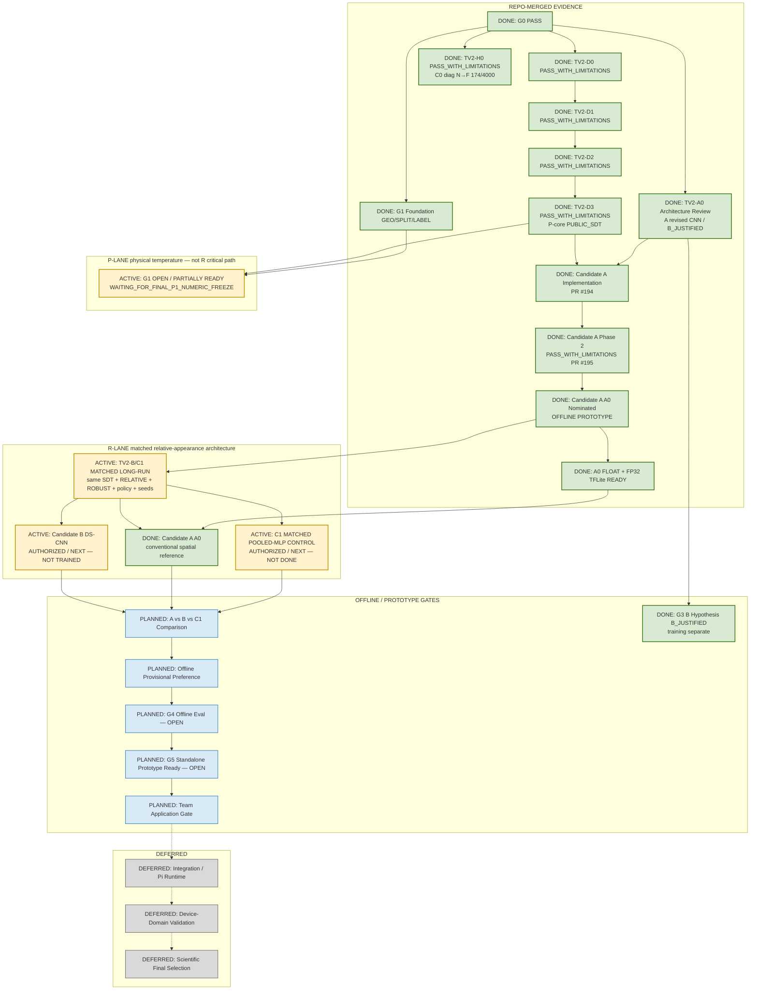

# SafeNest Thermal V2 — Master Execution Map

- Document ID: `THERMAL_V2_MASTER_EXECUTION_MAP_01`
- Date: `2026-08-30` (status sync `2026-08-31`)
- Authority: Thermal Control Tower living execution map
- Scope: documentation-only status synchronization
- Synced to `origin/main`: `625b4a6e4e0e0eef01afa24b3245ecf6416dae5a`
  (through merged `#186`–`#195`; Candidate A Phase 2 merge)

## 1. Purpose

Living Control-Tower map for Thermal V2 prototype development.

```text
merged evidence
→ R-lane Candidate A A0 nominated + FLOAT ready
→ matched architecture long-run: C1 + Candidate B (ACTIVE FRONTIER)
→ A vs B vs C1 → G4 → G5 → later Team application
→ Integration / Pi / device-domain deferred
```

Evidence labeling:

| Label | Meaning |
|---|---|
| `REPO-MERGED` | Supported by current `origin/main` / Control-Tower-accepted PR |
| `LOCAL EXECUTION` | Owner/worker local result; use only when not yet merged |

Current Candidate A Phase 2 / nomination / artifacts are **REPO-MERGED** (`#195`).

## 2. Repository Boundary

| Role | Repository | Current use |
|---|---|---|
| Primary development | `https://github.com/sheepmeat/test.git` | R-lane Candidate A + matched B/C1; separate P-lane G1/P1 |
| Team later application | `https://github.com/jinsu1011/safenest-embedded-competition` | Active baseline remains B6R-P2; Candidate A **not** Team-active |
| Integration | `https://github.com/yuname121/integration.git` | Deferred |

## 3. Status Legend

| Status | Meaning | Mermaid class | Color |
|---|---|---|---|
| DONE / PASS | Merged / Control-Tower-accepted | `done` | green `#D9EAD3` / `#38761D` |
| ACTIVE / NEXT | Current authorized frontier | `active` | amber `#FFF2CC` / `#BF9000` |
| PLANNED | Authorized later work | `planned` | blue `#D9EAF7` / `#3D85C6` |
| CONDITIONAL | Decision-dependent | `conditional` | neutral `#F3F3F3` / `#666666` |
| BLOCKED | Cannot proceed | `blocked` | red `#F4CCCC` / `#990000` |
| DEFERRED | Out of current prototype scope | `deferred` | gray `#D9D9D9` / `#777777` |

## 4. Current Authoritative State

### 4.1 Control-Tower policy

```text
LOCKED_PUBLIC_TEST: CLOSED DURING DEVELOPMENT (access = 0)
Scientific final selection: NOT PERMITTED
Device-domain validation: DEFERRED
Candidate A nomination: A0 DONE (offline prototype; PR #195)
Candidate B training: AUTHORIZED (matched R-lane long-run; NOT DONE)
C1 matched control: AUTHORIZED (matched R-lane long-run; NOT DONE)
Team active baseline: still B6R-P2 (unchanged by Candidate A)
```

### 4.2 REPO-MERGED milestones

| ID | Status | Evidence |
|---|---|---|
| G0 | `PASS` / DONE | Current-state reconstruction |
| TV2-H0 | `PASS_WITH_LIMITATIONS` / DONE | PR `#187`; historical C0 DEVELOPMENT NORMAL→FALL_PROXY **174/4000 = 4.35%** |
| TV2-D0 | `PASS_WITH_LIMITATIONS` / DONE | PR `#188` |
| G1 foundation GEO/SPLIT/LABEL | each `READY_WITH_LIMITATIONS` / DONE | PR `#186` — **G1 gate itself remains OPEN** |
| TV2-A0 architecture | `PASS_WITH_LIMITATIONS` / DONE | PR `#189`; A = REVISED COMPACT CONVENTIONAL CNN; B = `B_JUSTIFIED` |
| TV2-D1 | `PASS_WITH_LIMITATIONS` / DONE | PR `#191` |
| TV2-D2 | `PASS_WITH_LIMITATIONS` / DONE | PR `#192` |
| TV2-D3 | `PASS_WITH_LIMITATIONS` / DONE | PR `#193` — P-lane supervised core remained **PUBLIC_SDT**; Thermal-IM was not admitted to that physical TRAIN contract |
| Candidate A implementation | DONE | PR `#194` — `RELATIVE_THERMAL_APPEARANCE_V1`, A0/A1/A0R, GAP/SPATIAL heads |
| Candidate A Phase 2 | `PASS_WITH_LIMITATIONS` / DONE | PR `#195` — Stage1–3 complete; A0 nominated; FLOAT + FP32 TFLite |

### 4.3 Current standalone Candidate A (REPO-MERGED)

```text
nominated prototype: A0  (OFFLINE PROTOTYPE NOMINATION — not production / not scientific final)
representation:      RELATIVE_THERMAL_APPEARANCE_V1
normalization:       FRAME_ROBUST_P2_P98_V1
head:                COARSE_SPATIAL_RETAIN_FLATTEN_V1
params:              64,387
TRAIN:               PUBLIC_SDT only (no Thermal-IM TRAIN contribution)
3-seed DEVELOPMENT NORMAL→FALL: 16, 14, 21 → mean 17/4000 = 0.425%
FALL_PROXY recall mean: 0.9920
macro F1 mean: ≈ 0.9949
vs historical C0 anchor 174/4000 = 4.35%: strong offline DEVELOPMENT prototype result;
  C0 vs A0 = NOT LIKE-FOR-LIKE (architecture / representation / regime differ)
```

Artifacts (READY / DONE):

```text
Keras:
  models/thermal/candidates/tv2_candidate_a/
    A0_hn000_FRAME_ROBUST_P2_P98_V1_COARSE_SPATIAL_RETAIN_FLATTEN_V1_seed42.keras
  SHA-256: 6a8fd53c815bb29ac42b25fd45c0fe5e0cdad86e4caf359ae37a752d2e2e20ee

FP32 TFLite:
  ..._seed42_fp32.tflite
  SHA-256: a158a70c4735e28eec70b5a996f82c91f452b94bcc24c040838143f4a55b1985

Contract: input [1,62,80,1] float32 → output [1,3] float32; invoke smoke PASS

Lineage (corrected before #195 merge; not a blocker):
  nomination basis = 3-seed A0 family metrics
  committed seed-42 Keras = SAME_POLICY_SEED42_REEXPORT_AFTER_NOMINATION
  exact_final_9run_weight_instance = false
  TFLite converted from that re-exported Keras
```

Thermal-IM seated-HN data-corrective finding (primary metric):

```text
A0 mean NORMAL→FALL = 17.00
A1 +10% Thermal-IM HN mean = 17.67
A0R duplicated SDT NORMAL mean = 8.67
→ Thermal-IM content-specific benefit NOT DEMONSTRATED on PUBLIC_SDT
  DEVELOPMENT NORMAL→FALL under this Candidate A experiment
→ A1 did not beat A0; A1 did not beat A0R
→ nomination = A0
(Does not prove additional data are never useful.)
```

Phase 1 HN pool (historical / completed before Phase 2):

```text
Thermal-IM 50/50 archives; identity VERIFIED_AGAINST_D1_ANCHORS
admitted 20,994; HN TRAIN 17,322 / HN HOLDOUT 3,672
recording-group disjoint PASS; seated → HUMAN_NORMAL only
```

### 4.4 Dual lanes (do not conflate)

**Lane P — physical-temperature** (not critical path for current R-lane B/C1)

```text
PUBLIC_SDT Celsius
→ G1 GEO
→ P1 TRAIN-fitted global z-score   [PENDING / NOT MERGED]
→ physical-temperature matched experiments if resumed
G1: OPEN / PARTIALLY READY — NOT PASS / NOT CLOSED
blocker: WAITING_FOR_FINAL_P1_NUMERIC_FREEZE
```

**Lane R — relative-appearance architecture comparison** (current critical path)

```text
PUBLIC_SDT
→ RELATIVE_THERMAL_APPEARANCE_V1
→ FRAME_ROBUST_P2_P98_V1
→ matched training policy / seeds 42,7,1337
     ├─ C1 pooled MLP              [AUTHORIZED / NEXT]
     ├─ Candidate A conventional   [DONE — A0 nominated]
     └─ Candidate B DS-CNN         [AUTHORIZED / NEXT]
```

G1/P1 does **not** block this R-lane matched experiment.

### 4.5 Team active baseline (unchanged)

```text
Team active baseline: B6R-P2 Public SDT pooled MLP FP32
Candidate A A0 = standalone nominated offline prototype — NOT Team-active replacement
```

## 5. Master Execution Map



## 6. Gate Ledger

| Gate / item | Current Status |
|---|---|
| G0 | `PASS` / DONE |
| TV2-H0 | `PASS_WITH_LIMITATIONS` / DONE |
| TV2-D0 / D1 / D2 / D3 | each `PASS_WITH_LIMITATIONS` / DONE |
| TV2-A0 architecture review | `PASS_WITH_LIMITATIONS` / DONE |
| G1 foundation GEO/SPLIT/LABEL | each `READY_WITH_LIMITATIONS` / DONE |
| Candidate A implementation (`#194`) | DONE |
| Candidate A Phase 2 (`#195`) | `PASS_WITH_LIMITATIONS` / DONE |
| Candidate A nomination | **A0** / DONE (offline prototype) |
| Candidate A FLOAT + FP32 TFLite | READY / DONE |
| Thermal-IM HN benefit (primary metric) | **NOT DEMONSTRATED** |
| G1 physical-temp contract | **OPEN** — P1 numeric pending — **not PASS** |
| G3 Candidate B hypothesis | `B_JUSTIFIED` / PASS_WITH_LIMITATIONS (justification ≠ trained) |
| C1 matched pooled-MLP | **AUTHORIZED / NEXT** — not trained |
| Candidate B execution | **AUTHORIZED / NEXT** — not trained |
| TV2-B/C1 matched long-run | **ACTIVE FRONTIER** |
| G4 offline evaluation | OPEN (needs A + C1 + B comparison) |
| G5 standalone prototype ready | OPEN / NOT CLOSED |
| Team application | PLANNED / NOT STARTED |
| Device-domain scientific validation | DEFERRED |
| `LOCKED_PUBLIC_TEST` | CLOSED (access 0) |

## 7. Current Active Frontier

```text
DONE:
  Candidate A A0 nominated (PR #195)
  FLOAT Keras + FP32 TFLite ready
  Thermal-IM seated-HN tested → content benefit not demonstrated on primary metric

NOW — ACTIVE FRONTIER:
  TV2-B/C1 MATCHED LONG-RUN
    C1  MATCHED_POOLED_MLP_CONTROL
        62x80 → adaptive mean pool 8x10 → 80 feat → Dense32 → Dense3
    Candidate B CAPACITY_MATCHED_DEPTHWISE_SEPARABLE_CNN
        Conv16→MaxPool → SepConv32→MaxPool → SepConv48→GAP → Dense32→Dense3
    SAME: PUBLIC_SDT only
          RELATIVE_THERMAL_APPEARANCE_V1
          FRAME_ROBUST_P2_P98_V1
          training policy
          seeds 42 / 7 / 1337
    THEN: A vs B vs C1 → offline provisional preference → G4 → G5

NOT BLOCKING CURRENT R-LANE:
  G1 / P1 physical-temperature numeric freeze (P-lane remains OPEN)

NOT CLAIMED:
  C1 / B execution started or complete on main
  G4 / G5 closed
  Team production replacement
```

## 8. Deferred Scope

- Integration repository / Pi runtime
- Controlled SafeNest device-domain validation
- Scientific final model selection
- Production replacement of Team active baseline (B6R-P2)

## 9. Update Rules

1. Prefer status/color updates over full DAG rewrites; preserve stable IDs when practical.
2. Label REPO-MERGED vs LOCAL EXECUTION explicitly.
3. Keep G1 open until final P1 numeric freeze is merged and Control Tower closes it.
4. Keep R-lane matched A/B/C1 work independent of G1 close.
5. Do not treat Candidate A offline nomination as Team-active or scientific final selection.
6. Do not mark Candidate B / C1 DONE until a result PR merges.
7. Keep Integration / Pi / device validation deferred and gray.
8. `LOCKED_PUBLIC_TEST` stays closed (access 0).

---

End of document. Map sync does not train models, does not close G1, does not
claim C1/B completion, and does not authorize Team / Integration / Pi work.
