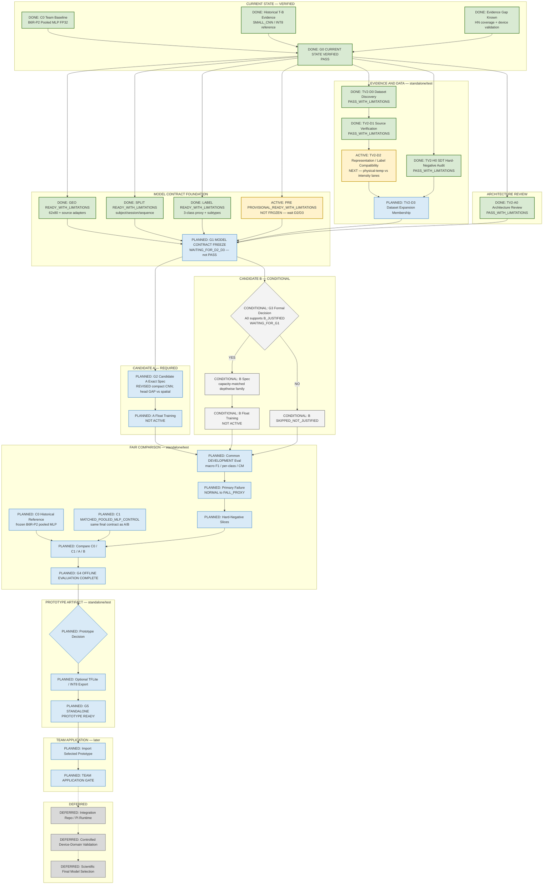

# SafeNest Thermal V2 — Master Execution Map

- Document ID: `THERMAL_V2_MASTER_EXECUTION_MAP_01`
- Date: `2026-08-30`
- Authority: Thermal Control Tower living execution map
- Scope: documentation-only status synchronization; no training, binary,
  manifest, or runtime changes
- Last map sync: post PR `#184` / `#186` / `#187` / `#188` / `#189` / `#191` on `origin/main`

## 1. Purpose

Canonical Control-Tower execution map for Thermal V2 prototype development.

```text
current evidence
→ technically defensible prototype candidate(s)
→ offline comparison (incl. matched controls)
→ standalone prototype gate
→ Team repository import/application later
→ Integration / Pi / device-domain validation later
```

Not permitted by this map: scientific final selection, production replacement
of the Team active baseline, or treating device-domain validation as a
prerequisite for Candidate A/B float work.

## 2. Repository Boundary

| Role | Repository | Current use |
|---|---|---|
| Primary development | `https://github.com/sheepmeat/test.git` | Data, contracts, Candidate A/B, offline eval, prototypes |
| Team reference / later application | `https://github.com/jinsu1011/safenest-embedded-competition` | Active baseline identity now; import destination later |
| Integration | `https://github.com/yuname121/integration.git` | Deferred |

Do **not** develop Candidate A/B inside the Team repository.

## 3. Status Legend

| Status | Meaning | Mermaid class | Color |
|---|---|---|---|
| DONE / PASS | Completed and Control-Tower verified | `done` | green `#D9EAD3` / `#38761D` |
| ACTIVE / NEXT | Immediate executable frontier | `active` | amber `#FFF2CC` / `#BF9000` |
| PLANNED | Authorized later work, not started | `planned` | blue `#D9EAF7` / `#3D85C6` |
| CONDITIONAL | Decision-dependent path | `conditional` | neutral `#F3F3F3` / `#666666` |
| BLOCKED | Failed or cannot proceed | `blocked` | red `#F4CCCC` / `#990000` |
| DEFERRED | Out of current prototype scope | `deferred` | gray `#D9D9D9` / `#777777` |

Node labels also carry status text for color-independent reading.

## 4. Current Authoritative State

### 4.1 Control-Tower policy

```text
Development repo: sheepmeat/test
Team repo: reference now, application target later
Integration repo: DEFERRED
Candidate A: REQUIRED — REVISED COMPACT CONVENTIONAL CNN (exact head NOT FROZEN; G2)
Candidate B: CONDITIONAL — TV2-A0 evidence supports B_JUSTIFIED; G3 NOT PASSED; B training NOT AUTHORIZED
Device-domain validation: DEFERRED
Scientific final selection: NOT PERMITTED
LOCKED_PUBLIC_TEST: CLOSED DURING DEVELOPMENT (access = 0)
```

### 4.2 Operational historical reference (C0)

```text
C0 = PUBLIC_SDT_ADAPTIVE_POOL_MLP_V1 / B6R-P2 FP32
input [1,62,80,1] float32
classes NOT_HUMAN / HUMAN_NORMAL / HUMAN_FALL_PROXY
DEVELOPMENT diagnostic:
  accuracy ≈ 0.907
  macro F1 ≈ 0.901
  NORMAL → FALL_PROXY = 174 / 4000 ≈ 4.35%
```

C0 is the frozen historical operational reference. It is **not** automatically
architecture-factor-only comparable to future A/B if data/PRE contracts change.
A future `C1 MATCHED_POOLED_MLP_CONTROL` (planned) must share the final frozen
D3/GEO/PRE/LABEL/TRAIN-DEVELOPMENT/aug/optimizer/seed contract with A/B.

### 4.3 Evidence completed on main

| ID | Status | Evidence |
|---|---|---|
| G0 | `PASS` / DONE | Current-state reconstruction |
| TV2-D0 | `PASS_WITH_LIMITATIONS` / DONE | PR `#188`; serious candidates TF-66, IPHPDT/IPHD, Thermal-IM, QUIDA, eHomeSeniors; **no training approval** |
| TV2-H0 | `PASS_WITH_LIMITATIONS` / DONE | PR `#187`; `NORMAL→FALL_PROXY=174/4000`; `CURRENT_SDT_HARD_NEGATIVE_SUBSET_NOT_DEFENSIBLE`; root cause unresolved (pooling not proven causal) |
| GEO | `READY_WITH_LIMITATIONS` / DONE | PR `#186`; future input `[1,62,80,1]`; SDT software geometry `G1_FIXED_ASPECT_CROP_BILINEAR`; **source-specific adapters required** (SDT crop is not universal) |
| SPLIT | `READY_WITH_LIMITATIONS` / DONE | strongest available key: subject→session→sequence/video→scene; no random correlated-frame split |
| LABEL | `READY_WITH_LIMITATIONS` / DONE | 3-class proxy; standing/sitting/walking/crouch/bend/kneel → `HUMAN_NORMAL`+subtype; static lying vs temporal fall remain separate FALL_PROXY evidence slices |
| PRE | `PROVISIONAL_READY_WITH_LIMITATIONS` / NOT FROZEN | Leading hypothesis `P1_TRAIN_FITTED_GLOBAL_ZSCORE` **not frozen**; D1 confirmed physical-temperature vs non-radiometric intensity split → waits D2/D3 → G1 freeze |
| TV2-D1 | `PASS_WITH_LIMITATIONS` / DONE | PR `#191`; see §4.6 source outcomes; **no training approval** |

### 4.4 Architecture review

| ID | Status | Notes |
|---|---|---|
| TV2-A0 | `PASS_WITH_LIMITATIONS` / DONE | Merged PR `#189`; Control-Tower architecture hypothesis review complete |
| Candidate A family | Direction accepted | `A_RECOMMEND_REVISED_SMALL_CNN` — **REVISED COMPACT CONVENTIONAL CNN**; historical exact 312,131 Flatten model **not** frozen; exact head **NOT FROZEN** — G2 decides `A_HEAD_GAP` vs `A_HEAD_SPATIAL_RETAIN` |
| Candidate B family | Evidence supports `B_JUSTIFIED` | Preferred `CAPACITY_MATCHED_DEPTHWISE_SEPARABLE_CNN`; historical exact 347-param depthwise is **not** B; formal **G3 NOT PASSED**; Candidate B training **NOT AUTHORIZED** |

### 4.5 TV2-D1 source outcomes (no training membership)

| Source | D1 outcome |
|---|---|
| TF-66 | `HOLD_PENDING_ACCESS` |
| IPHD | `REFERENCE_ONLY` |
| IPHPDT | `HOLD_PENDING_ACCESS` |
| Thermal-IM | `ADMIT_TO_D2_WITH_LIMITATIONS` |
| QUIDA | `ADMIT_TO_D2_WITH_LIMITATIONS` |
| eHomeSeniors | `ADMIT_TO_D2_WITH_LIMITATIONS` |

Representation boundary (D1):

```text
PHYSICAL-TEMPERATURE LANE
  QUIDA — calibrated MLX90640 numeric temperature
  eHomeSeniors — calibrated MLX90640 temperature fields (raw MLX fields separate)

INTENSITY LANE
  Thermal-IM — NON_RADIOMETRIC_THERMAL_INTENSITY
  (no intensity → Celsius conversion allowed)

HOLD / REFERENCE
  TF-66 / IPHPDT — HOLD_PENDING_ACCESS
  IPHD — REFERENCE_ONLY
```

### 4.6 Primary failure metric

Retain **NORMAL → FALL_PROXY** as the primary target failure mode (anchor 174/4000),
while still reporting macro F1, per-class P/R/F1, full confusion matrix,
FALL_PROXY→NORMAL, and NOT_HUMAN→FALL_PROXY.

## 5. Master Execution Map



## 6. Gate Ledger

| Gate | Meaning | Current Status |
|---|---|---|
| G0 Current State Verified | Baseline + evidence-gap reconstruction | `PASS` / DONE |
| TV2-D0 Dataset Discovery | Additional thermal candidate triage | `PASS_WITH_LIMITATIONS` / DONE |
| TV2-H0 Hard-Negative Audit | SDT NORMAL→FALL_PROXY analysis | `PASS_WITH_LIMITATIONS` / DONE |
| GEO / SPLIT / LABEL foundation | Contract foundation (PR `#186`) | each `READY_WITH_LIMITATIONS` / DONE |
| PRE foundation | Shared preprocess proposal | `PROVISIONAL_READY_WITH_LIMITATIONS` / ACTIVE / NOT FROZEN |
| TV2-D1 Source Verification | Access, license, representation, grouping | `PASS_WITH_LIMITATIONS` / DONE (PR `#191`) |
| TV2-D2 Representation / Label Compatibility | Physical-temp vs intensity lanes; D3 admission prep | `NEXT` / `READY` / ACTIVE |
| TV2-D3 Dataset Expansion Membership | Actual expansion membership decision | `PLANNED` / waits D2 |
| TV2-A0 Architecture Review | Family hypotheses | `PASS_WITH_LIMITATIONS` / DONE (PR `#189`) |
| G1 Model Contract Freeze | Final GEO/PRE/SPLIT/LABEL + D3 membership freeze | `PLANNED` / `WAITING_FOR_D2_D3` — **not PASS** |
| G2 Candidate A Ready | Exact revised compact CNN + head decision (`A_HEAD_GAP` vs `A_HEAD_SPATIAL_RETAIN`) | `NOT_STARTED` |
| G3 Candidate B Justified | Formal second-hypothesis decision | `CONDITIONAL` / `WAITING_FOR_G1` (A0 supports `B_JUSTIFIED`; G3 **NOT PASSED**; B training **NOT AUTHORIZED**) |
| G4 Offline Evaluation Complete | C0/C1/A/(B) DEVELOPMENT comparison | `NOT_STARTED` |
| G5 Standalone Prototype Ready | Prototype artifact; no production overwrite | `NOT_STARTED` |
| Team Application Gate | Team import/verification | `NOT_STARTED` |
| Device-Domain Scientific Validation | Controlled SafeNest measurement / final selection | `DEFERRED` |

Do not mark any closed gate without Control-Tower evidence.

## 7. Current Active Frontier

```text
DONE: G0, D0, H0, D1, GEO, SPLIT, LABEL, TV2-A0
ACTIVE / NEXT:
  TV2-D2  (representation / label compatibility; physical-temp vs intensity)
  PRE     (provisional; NOT FROZEN; waits D2/D3 → G1)
PLANNED: D3 → G1 → G2 / G3 → training → fair comparison → G4/G5
```

```text
D1 DONE
  ↓
D2 NEXT
  ↓
D3 PLANNED
  ↓
G1 MODEL CONTRACT FREEZE  (NOT CLOSED)
```

TV2-D1 is DONE (`PASS_WITH_LIMITATIONS`, PR `#191`). D2 admits only
Thermal-IM / QUIDA / eHomeSeniors with limitations; TF-66 and IPHPDT remain
hold; IPHD is reference-only. **No source is training-approved.**

TV2-A0 remains DONE. Candidate A family remains **REVISED COMPACT CONVENTIONAL
CNN** (exact head NOT FROZEN; G2). Candidate B remains `B_JUSTIFIED` /
`CAPACITY_MATCHED_DEPTHWISE_SEPARABLE_CNN` with **G3 NOT PASSED** and B
training **NOT AUTHORIZED**.

No training is authorized by this map sync.

## 8. Deferred Scope

GRAY / not prerequisites for offline prototypes:

- Integration repository work
- Pi runtime / deployment
- Controlled SafeNest device-domain validation
- Scientific final model selection
- Production replacement of the Team active Thermal baseline

## 9. Update Rules

1. Preserve stable IDs (`G0`–`G5`, `TV2-D*`, `TV2-H0`, `TV2-A0`, C0/C1, Candidate A/B).
2. Change status text and Mermaid classes as work progresses; avoid full DAG rewrites for minor status moves.
3. Keep G1 open until D2→D3 and Control-Tower freeze (`WAITING_FOR_D2_D3`).
4. Keep Candidate A exact head and Candidate B formal G3 unfrozen until their gates.
5. Distinguish C0 historical reference from C1 matched pooled-MLP control.
6. Keep Integration / Pi / device validation visually separate and deferred.
7. Mark rejected paths `BLOCKED` / `SKIPPED`; do not delete evidence nodes.
8. `LOCKED_PUBLIC_TEST` stays closed during development (access 0).

---

End of document. No Thermal development worker is authorized by this file alone.
