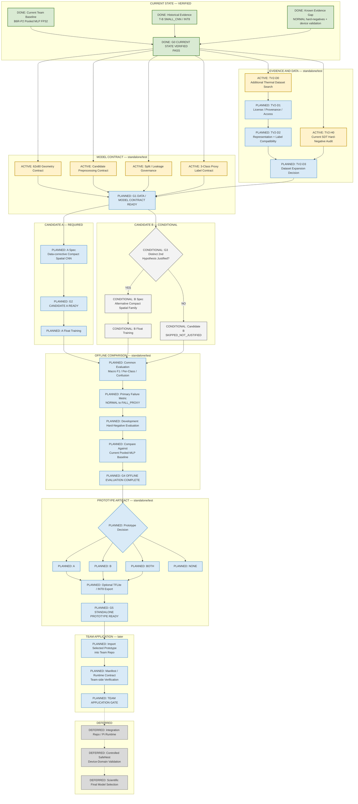

# SafeNest Thermal V2 — Master Execution Map

- Document ID: `THERMAL_V2_MASTER_EXECUTION_MAP_01`
- Date: `2026-08-30`
- Authority: Thermal Control Tower living execution map
- Scope: documentation-only; no training, binary, manifest, or runtime changes
- G0 status: `PASS` (`T-V2-G0 CURRENT STATE VERIFIED`)

## 1. Purpose

This document is the canonical Control-Tower execution map for Thermal V2
prototype development.

Objective:

```text
current evidence
→ technically defensible prototype candidate(s)
→ offline comparison
→ standalone prototype gate
→ Team repository import/application later
→ Integration / Pi / device-domain validation later
```

Not permitted by this map:

- scientific final model selection
- production replacement of the Team active Thermal baseline
- treating device-domain validation as a prerequisite for Candidate A/B float work

## 2. Repository Boundary

| Role | Repository | Current use |
|---|---|---|
| Primary development | `https://github.com/sheepmeat/test.git` | Data, contracts, Candidate A/B, offline eval, prototype artifacts |
| Team reference / later application | `https://github.com/jinsu1011/safenest-embedded-competition` | Active baseline identity now; prototype import destination later |
| Integration | `https://github.com/yuname121/integration.git` | Deferred; not a Thermal V2 development prerequisite |

Lifecycle:

```text
sheepmeat/test
  → data / model development
  → offline comparison
  → prototype artifact ready
  → Team repository import/application
  → future Integration / Pi validation
```

Do **not** develop Candidate A/B inside the Team repository.
Do **not** invert the standalone → Team relationship.

## 3. Status Legend

| Status | Meaning | Mermaid class | Color |
|---|---|---|---|
| DONE / PASS | Completed and Control-Tower verified | `done` | green `#D9EAD3` / `#38761D` |
| ACTIVE / NEXT | Immediate executable frontier | `active` | amber `#FFF2CC` / `#BF9000` |
| PLANNED | Authorized later work, not started | `planned` | blue `#D9EAF7` / `#3D85C6` |
| CONDITIONAL | Decision-dependent path | `conditional` | neutral `#F3F3F3` / `#666666` |
| BLOCKED | Failed or cannot proceed | `blocked` | red `#F4CCCC` / `#990000` |
| DEFERRED | Out of current Thermal V2 prototype scope | `deferred` | gray `#D9D9D9` / `#777777` |

Node labels also carry status text so the map remains readable without color.

## 4. Current Authoritative State

### 4.1 Control-Tower policy

```text
Development repo: sheepmeat/test
Team repo: reference now, application target later
Integration repo: DEFERRED
Candidate A: REQUIRED
Candidate B: CONDITIONAL / OPTIONAL_BUT_PREFERRED
Device-domain validation: DEFERRED
Scientific final selection: NOT PERMITTED
```

### 4.2 Current Team active baseline (existing evidence, not new work)

```text
B6R-P2 Public SDT pooled MLP FP32
model_id: thermal_public_sdt_pooled_mlp_fp32_tflite_v1
architecture: PUBLIC_SDT_ADAPTIVE_POOL_MLP_V1
input: [1, 62, 80, 1] float32
classes: NOT_HUMAN / HUMAN_NORMAL / HUMAN_FALL_PROXY
dataset: PUBLIC_SDT_48000_THERMAL_ONLY_V1
preprocessing: 480x640 → bilinear 62x80 → per-frame min-max
              → adaptive pool 8x10 → MLP
```

Development diagnostic evidence (not locked-test performance):

```text
DEVELOPMENT accuracy ≈ 0.907
DEVELOPMENT macro F1 ≈ 0.901
NORMAL → FALL_PROXY = 174 / 4000 ≈ 4.35%
LOCKED_PUBLIC_TEST access = 0
```

Historical `SMALL_CNN_BASELINE_V1` / T-B FULL_INT8 remains useful reference
evidence. It is **not** the currently active Team baseline and is **not** yet a
frozen Candidate A architecture.

### 4.3 Contract notes

- Geometry compatibility should normally remain `62 × 80` for SafeNest Thermal
  runtime alignment.
- Active-baseline per-frame min-max does **not** automatically freeze every
  future candidate to min-max. Each candidate needs an explicit preprocessing
  contract.
- Prefer shared preprocessing for Candidate A and Candidate B unless a
  scientific reason requires separate contracts.
- Candidate A concept: **DATA-CORRECTIVE COMPACT SPATIAL CNN**.
  Historical `SMALL_CNN_BASELINE_V1` is a leading reference architecture, not a
  mandatory freeze until G1/G2 review.

## 5. Master Execution Map



## 6. Gate Ledger

| Gate | Meaning | Current Status |
|---|---|---|
| G0 Current State Verified | Baseline, historical evidence, and evidence-gap reconstruction accepted | `PASS` |
| G1 Data / Model Contract Ready | Geometry, preprocessing, split/leakage, label, and expansion plan ready | `NOT_STARTED` / `NEXT` |
| G2 Candidate A Ready | Required data-corrective compact spatial CNN specified and train-ready | `NOT_STARTED` |
| G3 Candidate B Justified | Distinct second hypothesis approved, or explicitly skipped | `NOT_EVALUATED` |
| G4 Offline Evaluation Complete | Macro F1, per-class, confusion, NORMAL→FALL_PROXY, hard-negative eval | `NOT_STARTED` |
| G5 Standalone Prototype Ready | Standalone prototype artifact ready; no production overwrite | `NOT_STARTED` |
| Team Application Gate | Selected prototype imported and verified in Team repo | `NOT_STARTED` |
| Device-Domain Scientific Validation | Controlled SafeNest measurement / scientific final selection | `DEFERRED` |

Do not mark any gate complete without corresponding repository evidence.

## 7. Current Active Frontier

```text
G0 PASS
  ↓
parallel evidence / contract work  (NO TRAINING AUTHORIZED)
```

Immediate parallel frontier after G0:

| Task ID | Work | Status |
|---|---|---|
| TV2-D0 | Additional Thermal dataset discovery | ACTIVE |
| TV2-H0 | Current SDT hard-negative analysis | ACTIVE |
| GEO | 62×80 geometry contract review | ACTIVE |
| PRE | Candidate preprocessing contract design | ACTIVE |
| SPLIT | Split / leakage governance | ACTIVE |
| LABEL | 3-class proxy label contract review | ACTIVE |

Downstream planned after that frontier:

```text
TV2-D1 → TV2-D2 → TV2-D3 → G1
→ Candidate A (required)
→ Candidate B (conditional)
→ G4 offline comparison
→ G5 standalone prototype
→ Team application
```

This documentation update does **not** authorize training, dataset mutation,
manifest changes, or runtime selector changes.

## 8. Deferred Scope

Explicitly deferred / out of current Thermal V2 prototype prerequisites:

- Integration repository audit or wiring
- Raspberry Pi runtime / deployment
- New controlled SafeNest device-domain measurement campaign
- Scientific final model selection
- Production replacement of the Team active Thermal baseline
- B6R MI48 mainline unblocking as a Candidate A/B training gate

These remain visible as gray deferred nodes after Team application.

## 9. Update Rules

This is a living map. Future updates should:

1. Preserve stable task/gate IDs (`G0`–`G5`, `TV2-D*`, `TV2-H0`, Candidate A/B).
2. Change node status text and Mermaid class colors as work progresses.
3. Add nodes only when genuinely needed.
4. Avoid rewriting the entire DAG for minor status changes.
5. Preserve historical completed nodes.
6. Mark rejected paths as `BLOCKED` / `SKIPPED` rather than deleting evidence.
7. Keep Integration, Pi, and device-domain validation visually separate from
   current standalone development.
8. Keep Candidate A architecture unfrozen until G1/G2 evidence review; treat
   `SMALL_CNN_BASELINE_V1` as a leading reference, not an automatic freeze.
9. Keep geometry (`62×80`) and preprocessing contracts separate.
10. End standalone development at G5 before Team application; do not jump from
    prototype readiness to Integration.

---

End of document. No Thermal development worker is authorized by this file alone.
