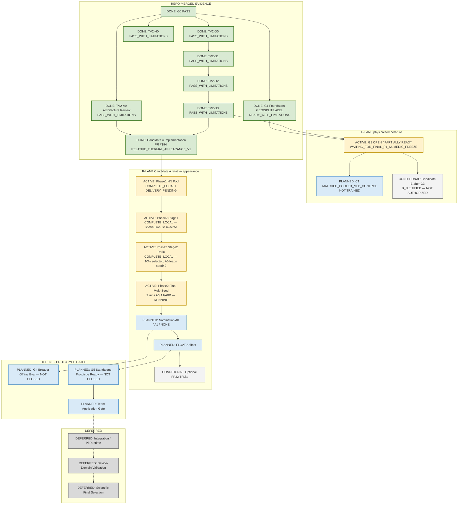

# SafeNest Thermal V2 — Master Execution Map

- Document ID: `THERMAL_V2_MASTER_EXECUTION_MAP_01`
- Date: `2026-08-30` (status sync `2026-08-31`)
- Authority: Thermal Control Tower living execution map
- Scope: documentation-only status synchronization
- Synced to `origin/main`: `80b70d564677d3e36939b89b00fa2ef5bfd59497`
  (through merged `#186`–`#194`)

## 1. Purpose

Living Control-Tower map for Thermal V2 prototype development.

```text
merged evidence
→ dual-lane execution (P physical-temp vs R relative-appearance)
→ Candidate A Phase 2 final multi-seed (ACTIVE)
→ later nomination / artifact / Team application
→ Integration / Pi / device-domain later
```

Evidence labeling (mandatory):

| Label | Meaning |
|---|---|
| `REPO-MERGED` | Supported by current `origin/main` / Control-Tower-accepted PR |
| `LOCAL EXECUTION` | Owner/worker result exists locally; **not** yet a merged result PR |

Do not treat LOCAL EXECUTION numbers as merged-main scientific truth.

## 2. Repository Boundary

| Role | Repository | Current use |
|---|---|---|
| Primary development | `https://github.com/sheepmeat/test.git` | Contracts, Candidate A R-lane prototype, later P-lane matched experiment |
| Team later application | `https://github.com/jinsu1011/safenest-embedded-competition` | Active baseline reference now; import later |
| Integration | `https://github.com/yuname121/integration.git` | Deferred |

## 3. Status Legend

| Status | Meaning | Mermaid class | Color |
|---|---|---|---|
| DONE / PASS | Merged / Control-Tower-accepted | `done` | green `#D9EAD3` / `#38761D` |
| ACTIVE / LOCAL / NEXT | Current frontier or local-complete pending delivery | `active` | amber `#FFF2CC` / `#BF9000` |
| PLANNED | Authorized later work | `planned` | blue `#D9EAF7` / `#3D85C6` |
| CONDITIONAL | Decision-dependent | `conditional` | neutral `#F3F3F3` / `#666666` |
| BLOCKED | Cannot proceed | `blocked` | red `#F4CCCC` / `#990000` |
| DEFERRED | Out of current prototype scope | `deferred` | gray `#D9D9D9` / `#777777` |

## 4. Current Authoritative State

### 4.1 Control-Tower policy

```text
LOCKED_PUBLIC_TEST: CLOSED DURING DEVELOPMENT (access = 0)
Scientific final selection: NOT PERMITTED
Device-domain validation: DEFERRED
Candidate A nomination: PENDING (final multi-seed required)
Candidate B training: NOT AUTHORIZED (G3 not closed)
C1 training: NOT STARTED
```

### 4.2 REPO-MERGED milestones

| ID | Status | Evidence |
|---|---|---|
| G0 | `PASS` / DONE | Current-state reconstruction |
| TV2-D0 | `PASS_WITH_LIMITATIONS` / DONE | PR `#188` |
| TV2-H0 | `PASS_WITH_LIMITATIONS` / DONE | PR `#187`; NORMAL→FALL_PROXY **174/4000 = 4.35%** C0 diagnostic anchor |
| G1 foundation GEO/SPLIT/LABEL | each `READY_WITH_LIMITATIONS` / DONE | PR `#186` — **G1 gate itself remains OPEN** |
| TV2-A0 architecture | `PASS_WITH_LIMITATIONS` / DONE | PR `#189`; A = REVISED COMPACT CONVENTIONAL CNN; B evidence `B_JUSTIFIED` |
| TV2-D1 | `PASS_WITH_LIMITATIONS` / DONE | PR `#191` |
| TV2-D2 | `PASS_WITH_LIMITATIONS` / DONE | PR `#192` |
| TV2-D3 | `PASS_WITH_LIMITATIONS` / DONE | PR `#193` — P-lane SDT membership; I-lane HN supplemental only |
| Candidate A implementation foundation | DONE | PR `#194` — `RELATIVE_THERMAL_APPEARANCE_V1`, A0/A1/A0R runners, adapters, HN builder, metrics; **no completed training results in `#194`** |

### 4.3 G1 — OPEN (not PASS)

```text
G1 MODEL CONTRACT = OPEN / PARTIALLY READY
  GEO:   READY_WITH_LIMITATIONS
  LABEL: READY_WITH_LIMITATIONS
  SPLIT: READY_WITH_LIMITATIONS
  P1 numeric TRAIN fit: PENDING / NOT MERGED
  G1: NOT CLOSED
  blocker: WAITING_FOR_FINAL_P1_NUMERIC_FREEZE
```

Stale `WAITING_FOR_D0_D3` is obsolete — D0–D3 are DONE.

### 4.4 Dual lanes (do not conflate)

**Lane P — physical-temperature matched experiment**

```text
PUBLIC_SDT physical °C
→ G1 GEO
→ future/final P1 TRAIN-fitted global z-score   [PENDING]
→ C1 / physical A/B matched experiment          [PLANNED]
```

**Lane R — owner-authorized relative-appearance prototype** (not Celsius; not P1)

```text
PUBLIC_SDT + Thermal-IM intensity HN
→ RELATIVE_THERMAL_APPEARANCE_V1
→ Candidate A Phase 1–2 prototype               [ACTIVE]
```

Lane R does **not** modify D3’s P-lane contract and does **not** require G1 close
before continuing owner-authorized Candidate A prototype work.

### 4.5 Candidate A — LOCAL EXECUTION (not merged result PR)

**Phase 1 HN pool** — `COMPLETE_LOCAL / DELIVERY_PENDING`

```text
Thermal-IM archives 50/50; identity VERIFIED_AGAINST_D1_ANCHORS
decoded 29,866 → admitted 20,994
HN_TRAIN_POOL 17,322 / HN_HOLDOUT_EVAL 3,672
recording-group disjoint PASS; actor-disjoint NOT VERIFIABLE
actions: sit sofa/chair/stool/desk → HUMAN_NORMAL / NORMAL_SEATED only
no FALL_PROXY / NOT_HUMAN from Thermal-IM; no random frame split; locked-test 0
```

**Phase 2 Stage 1** (PUBLIC_SDT DEVELOPMENT) — `COMPLETE_LOCAL`

| Variant | NORMAL→FALL | FALL recall | macro F1 |
|---|---:|---:|---:|
| MINMAX + GAP | 85/4000 = 2.12% | 0.9840 | 0.9839 |
| MINMAX + SPATIAL | 20/4000 = 0.50% | 0.9925 | 0.9951 |
| ROBUST + GAP | 95/4000 = 2.38% | 0.9650 | 0.9761 |
| ROBUST + SPATIAL | **8/4000 = 0.20%** | 0.9890 | 0.9957 |

**Phase 2 Stage 2 ratio** (seed 42, selected config) — `COMPLETE_LOCAL`

| Arm | NORMAL→FALL | FALL recall | macro F1 |
|---|---:|---:|---:|
| A0 SDT-only | **8** | 0.9890 | 0.9957 |
| A1 +10% Thermal-IM HN | 11 | 0.9900 | 0.9956 |
| A1 +25% Thermal-IM HN | 22 | 0.9975 | 0.9956 |

Selected local config (not yet formal merged nomination):

```text
FRAME_ROBUST_P2_P98_V1 + COARSE_SPATIAL_RETAIN_FLATTEN_V1
params = 64,387
HN ratio for final = 10%
```

Interpretation (LOCAL only):

- Spatial relative-appearance A0 shows much lower SDT DEVELOPMENT NORMAL→FALL
  than historical C0 diagnostic anchor **174/4000 = 4.35%** (A0 seed-42: **8/4000 = 0.20%**).
- C0 is **not** like-for-like.
- Thermal-IM content benefit is **NOT YET DEMONSTRATED** (A0 leads seed-42 primary metric).
- **Do not nominate A0 yet.** Final multi-seed required.
- Do **not** claim “beat production” or “false falls solved.”

### 4.6 Current ACTIVE frontier

```text
Candidate A Phase 2 Final Multi-Seed — ACTIVE / RUNNING
  normalization: FRAME_ROBUST_P2_P98_V1
  head:          COARSE_SPATIAL_RETAIN_FLATTEN_V1
  ratio:         10%
  seeds:         42, 7, 1337
  arms:          A0 | A1 | A0R   (9 runs total)
  A0  = SDT-only
  A1  = SDT + 1,600 Thermal-IM seated HN
  A0R = SDT + 1,600 duplicated SDT NORMAL (class-prior control; cannot be nominated)
```

Downstream (PLANNED, not DONE): final results → A0/A1/NONE interpretation →
float artifact → optional FP32 TFLite → result PR.

### 4.7 C0 / C1 / Candidate B

| Item | Status |
|---|---|
| C0 historical B6R-P2 pooled MLP | Frozen operational reference; DEVELOPMENT NORMAL→FALL **174/4000** |
| C1 `MATCHED_POOLED_MLP_CONTROL` | PLANNED / NOT TRAINED — P-lane matched experiment |
| Candidate B | A0 evidence `B_JUSTIFIED`; family `CAPACITY_MATCHED_DEPTHWISE_SEPARABLE_CNN`; **G3 NOT CLOSED**; not trained |

## 5. Master Execution Map



## 6. Gate Ledger

| Gate / item | Current Status |
|---|---|
| G0 | `PASS` / DONE |
| TV2-D0 / H0 / D1 / D2 / D3 | each `PASS_WITH_LIMITATIONS` / DONE |
| TV2-A0 architecture review | `PASS_WITH_LIMITATIONS` / DONE |
| G1 foundation GEO/SPLIT/LABEL | each `READY_WITH_LIMITATIONS` / DONE |
| Candidate A implementation (`#194`) | DONE (code/contract foundation; no training results in PR) |
| G1 model contract freeze | **OPEN** — `WAITING_FOR_FINAL_P1_NUMERIC_FREEZE` — **not PASS** |
| Candidate A Phase 1 HN | `COMPLETE_LOCAL` / delivery pending |
| Candidate A Phase 2 Stage1/Stage2 | `COMPLETE_LOCAL` |
| Candidate A Phase 2 Final Multi-Seed | **ACTIVE / RUNNING** (9 runs) |
| Candidate A nomination | **PENDING** |
| G3 Candidate B | NOT CLOSED / CONDITIONAL |
| C1 matched pooled-MLP | PLANNED / NOT TRAINED |
| G4 / G5 | NOT CLOSED |
| Team application | NOT STARTED |
| Device-domain scientific validation | DEFERRED |
| `LOCKED_PUBLIC_TEST` | CLOSED (access 0) |

## 7. Current Active Frontier

```text
REPO-MERGED DONE: G0, D0, H0, D1, D2, D3, A0 review, G1 foundation, PR#194 CA impl
ACTIVE:
  G1 P1 numeric freeze pending          (P-lane)
  Candidate A Phase2 Final Multi-Seed   (R-lane; PRIMARY FRONTIER)
LOCAL COMPLETE (not merged result PR):
  Phase1 HN pool, Stage1 head/norm select, Stage2 10% ratio
PENDING AFTER FINAL:
  A0 / A1 / NONE nomination → float → optional TFLite → result PR
```

## 8. Deferred Scope

- Integration repository / Pi runtime
- Controlled SafeNest device-domain validation
- Scientific final model selection
- Production replacement of Team active baseline

## 9. Update Rules

1. Preserve stable IDs; prefer status/color updates over full DAG rewrites.
2. Label `REPO-MERGED` vs `LOCAL EXECUTION` explicitly.
3. Keep G1 open until final P1 numeric freeze is merged and Control Tower closes it.
4. Keep R-lane Candidate A progress independent of G1 close (owner-authorized).
5. Do not nominate Candidate A until final multi-seed is interpreted.
6. Do not authorize Candidate B / C1 training from this map alone.
7. Keep Integration / Pi / device validation deferred and gray.
8. `LOCKED_PUBLIC_TEST` stays closed (access 0).

---

End of document. Map sync does not authorize training, nomination, G1 PASS,
Candidate B, C1, Team, Integration, or Pi work.
