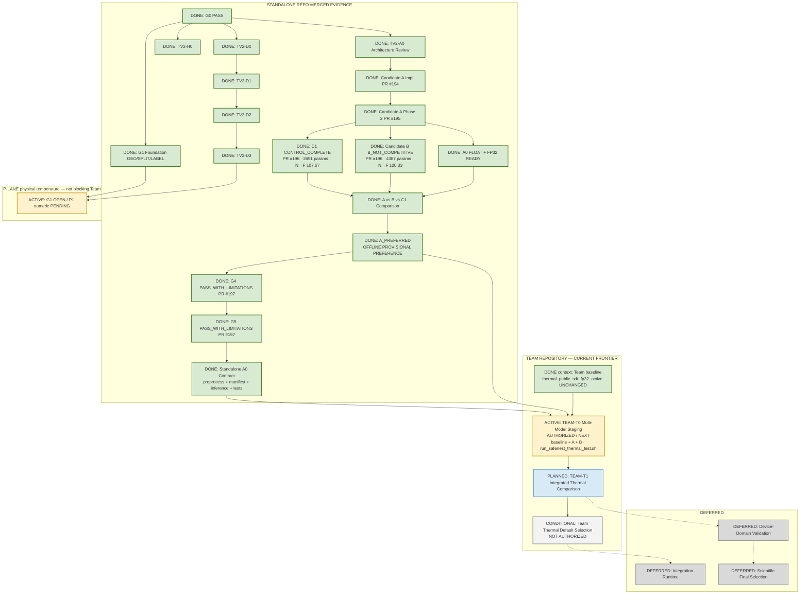

# SafeNest Thermal V2 — Master Execution Map

- Document ID: `THERMAL_V2_MASTER_EXECUTION_MAP_01`
- Date: `2026-08-30` (status sync `2026-08-31`)
- Authority: Thermal Control Tower living execution map
- Scope: documentation-only status synchronization
- Synced to `origin/main`: `4dccd25205af8994d29d03d75ebd0d7a7d6263e2`
  (through merged `#186`–`#197`; G4/G5 standalone closure)

## 1. Purpose

Living Control-Tower map for Thermal V2.

```text
standalone R-lane prototype CLOSED (G4/G5 DONE)
→ Team multi-model controlled staging (CURRENT FRONTIER)
→ integrated baseline/A/B comparison
→ later device observation / conditional default choice
```

Evidence labeling:

| Label | Meaning |
|---|---|
| `REPO-MERGED` | Supported by current standalone `origin/main` |
| `TEAM-PENDING` | Authorized Team-repo work; not yet evidenced as complete |

## 2. Repository Boundary

| Role | Repository | Current use |
|---|---|---|
| Standalone development | `https://github.com/sheepmeat/test.git` | R-lane G4/G5 **COMPLETE**; P-lane G1/P1 remains separate |
| Team application | `https://github.com/jinsu1011/safenest-embedded-competition` | **CURRENT FRONTIER:** baseline / A / B controlled multi-model staging |
| Integration | `https://github.com/yuname121/integration.git` | Later runtime/device integration; not current staging repo |

## 3. Status Legend

| Status | Meaning | Mermaid class | Color |
|---|---|---|---|
| DONE / PASS | Merged / Control-Tower-accepted | `done` | green `#D9EAD3` / `#38761D` |
| ACTIVE / NEXT | Current authorized frontier | `active` | amber `#FFF2CC` / `#BF9000` |
| PLANNED | Authorized later work | `planned` | blue `#D9EAF7` / `#3D85C6` |
| CONDITIONAL | Decision-dependent | `conditional` | neutral `#F3F3F3` / `#666666` |
| BLOCKED | Cannot proceed | `blocked` | red `#F4CCCC` / `#990000` |
| DEFERRED | Out of current prototype scope | `deferred` | gray `#D9D9D9` / `#777777` |

## 4. Current Authoritative State

### 4.1 Control-Tower policy

```text
LOCKED_PUBLIC_TEST_ACCESS = 0
Scientific final selection: NOT CLAIMED
Device-domain validation: DEFERRED
Standalone R-lane current prototype: CLOSED / COMPLETE
G4 / G5: PASS_WITH_LIMITATIONS / DONE (#197)
STANDALONE_PROTOTYPE_READY = YES
READY_FOR_CONTROLLED_TEAM_APPLICATION = YES
Team Multi-Model Staging: AUTHORIZED / NEXT
Team default replacement: NOT AUTHORIZED / CONDITIONAL
Team active baseline: thermal_public_sdt_fp32_active (B6R-P2) — UNCHANGED
```

### 4.2 REPO-MERGED milestones

| ID | Status | Evidence |
|---|---|---|
| G0 | `PASS` / DONE | Current-state reconstruction |
| TV2-H0 | `PASS_WITH_LIMITATIONS` / DONE | PR `#187`; C0 diag N→F **174/4000** |
| TV2-D0 | `PASS_WITH_LIMITATIONS` / DONE | PR `#188` |
| G1 foundation GEO/SPLIT/LABEL | READY_WITH_LIMITATIONS / DONE | PR `#186` — **G1 gate itself OPEN** |
| TV2-A0 architecture | `PASS_WITH_LIMITATIONS` / DONE | PR `#189` |
| TV2-D1 / D2 / D3 | each `PASS_WITH_LIMITATIONS` / DONE | `#191` / `#192` / `#193` |
| Candidate A implementation | DONE | PR `#194` |
| Candidate A Phase 2 | `PASS_WITH_LIMITATIONS` / DONE | PR `#195` — A0 nominated + FLOAT |
| C1 + Candidate B matched long-run | DONE | PR `#196` |
| Offline provisional preference | `A_PREFERRED` / DONE | PR `#196` |
| G4 / G5 standalone closure | `PASS_WITH_LIMITATIONS` / DONE | PR `#197` |

### 4.3 Candidate A — A_PREFERRED (standalone closed)

```text
status: OFFLINE PROVISIONAL PREFERENCE / A_PREFERRED
standalone prototype: READY
representation: RELATIVE_THERMAL_APPEARANCE_V1
normalization:  FRAME_ROBUST_P2_P98_V1
architecture:   COARSE_SPATIAL_RETAIN_FLATTEN_V1
params:         64,387

Family 3-seed DEVELOPMENT (nomination basis):
  NORMAL→FALL_PROXY: 16 / 14 / 21 → mean 17/4000 = 0.425%
  FALL recall mean: 0.9920
  macro F1 mean: ≈ 0.9949

Exact committed FP32 TFLite (#197 characterization — NOT a substitute for family mean):
  SHA-256: a158a70c4735e28eec70b5a996f82c91f452b94bcc24c040838143f4a55b1985
  size: 264704 bytes
  input [1,62,80,1] float32 → output [1,3] float32
  DEVELOPMENT n=8000 confusion [[2000,0,0],[4,3982,14],[0,17,1983]]
  NORMAL→FALL: 14/4000 = 0.35%
  FALL recall: 0.9915
  macro F1: 0.995623
  nonfinite 0 / inference failures 0

Keras ↔ TFLite parity: 8000/8000 argmax = 100% PASS
  max abs diff 6.258e-06 / mean abs diff 1.202e-08

Standalone contract (#197): preprocess JSON + manifest + inference + runner + 10 tests PASS
```

**Not** Team-active default. Team default remains B6R-P2 baseline.

### 4.4 C1 / Candidate B — matched experiment DONE (`#196`)

| Model | Role | Params | N→F mean | FALL recall | macro F1 | Decision |
|---|---|---:|---:|---:|---:|---|
| C1 | `MATCHED_POOLED_MLP_CONTROL` | 2,691 | 107.67 | 0.9472 | 0.9687 | `CONTROL_COMPLETE` |
| Candidate A | conventional spatial | 64,387 | 17.00 | 0.9920 | 0.9949 | `A_PREFERRED` |
| Candidate B | DS-CNN | 4,387 | 120.33 | 0.9253 | 0.9593 | `B_NOT_COMPETITIVE` |

C1 architecture: adaptive mean pool `[8,10]` → Flatten 80 → Dense32 → Dense3.

Bounded interpretation: matched pooled-MLP result supports that Candidate A’s spatial-retaining architecture contributes useful benefit beyond the matched relative-appearance representation **in this offline experiment** — not a universal architecture claim.

Candidate B:

```text
offline decision: B_NOT_COMPETITIVE
Team test role:   CONTROLLED_COMPARISON_ONLY (authorized later packaging)
standalone B seed42 Keras SHA-256:
  42563c3316e9e8511ab897aaa4dfd9a154887f3a0270d5dfb77a7a344cd3ff35
standalone FP32 TFLite: SKIPPED (B_NOT_COMPETITIVE)
Team may convert frozen seed42 Keras → ordinary FP32 TFLite for comparison only
  (packaging — not retraining / renomination)
C1 is NOT a Team user-facing selector option
```

### 4.5 Dual lanes

**R-LANE current prototype development = CLOSED / DONE**

```text
PUBLIC_SDT → RELATIVE_THERMAL_APPEARANCE_V1 → FRAME_ROBUST_P2_P98_V1
→ A0 / C1 / B matched experiment → A_PREFERRED → G4 → G5 → READY
```

**P-LANE physical temperature — OPEN, not blocking Team staging**

```text
PUBLIC_SDT Celsius → G1 GEO → P1 TRAIN-fitted global z-score [PENDING / NOT MERGED]
G1: OPEN / PARTIALLY READY — NOT PASS
blocker: WAITING_FOR_FINAL_P1_NUMERIC_FREEZE
```

### 4.6 Team baseline vs standalone preference (both true)

```text
Standalone preferred: Candidate A A0 (A_PREFERRED)
Team current default: thermal_public_sdt_fp32_active (B6R-P2 pooled MLP FP32) — UNCHANGED
A_PREFERRED ≠ A Team-active
```

### 4.7 Limitations (remain after G4/G5)

```text
LOCKED_PUBLIC_TEST_ACCESS = 0
DEVICE_DOMAIN_VALIDATION = DEFERRED
MI48 physical-source validation = NOT COMPLETE
Pi live comparison = NOT COMPLETE
scientific final selection = NOT CLAIMED
production model replacement = NOT AUTHORIZED
G5 = standalone reproducible prototype ready for controlled downstream application
     — NOT production-ready
```

## 5. Master Execution Map



## 6. Gate Ledger

| Gate / item | Current Status |
|---|---|
| G0 | `PASS` / DONE |
| TV2-H0 / D0 / D1 / D2 / D3 | each `PASS_WITH_LIMITATIONS` / DONE |
| TV2-A0 architecture review | `PASS_WITH_LIMITATIONS` / DONE |
| Candidate A implementation (`#194`) | DONE |
| Candidate A Phase 2 (`#195`) | `PASS_WITH_LIMITATIONS` / DONE |
| C1 matched control (`#196`) | `CONTROL_COMPLETE` / DONE |
| Candidate B matched experiment (`#196`) | `B_NOT_COMPETITIVE` / DONE |
| A vs B vs C1 | DONE |
| Offline provisional preference | `A_PREFERRED` / DONE |
| Exact A FP32 characterization + parity (`#197`) | DONE |
| Standalone A0 contract (`#197`) | DONE |
| G4 | `PASS_WITH_LIMITATIONS` / DONE (`#197`) |
| G5 | `PASS_WITH_LIMITATIONS` / DONE (`#197`) |
| Standalone Prototype Ready | **YES** |
| Ready For Controlled Team Application | **YES** |
| Standalone R-lane current prototype | **CLOSED / COMPLETE** |
| G1 physical P-lane | **OPEN** — P1 numeric pending |
| TEAM-T0 Multi-Model Staging | **AUTHORIZED / NEXT** |
| TEAM-T1 Integrated Comparison | PLANNED |
| Team Thermal Default Selection | CONDITIONAL / **NOT AUTHORIZED** |
| Device-domain validation | DEFERRED |
| Scientific final selection | NOT CLAIMED |
| `LOCKED_PUBLIC_TEST_ACCESS` | **0** |

## 7. Current Active Frontier

```text
DONE — STANDALONE R-LANE:
  Candidate A A0 nominated + FLOAT
  C1 CONTROL_COMPLETE
  Candidate B B_NOT_COMPETITIVE
  A vs B vs C1 → A_PREFERRED
  exact Candidate A FP32 characterization + Keras↔TFLite parity
  G4 / G5 PASS_WITH_LIMITATIONS
  standalone A0 contract package
  STANDALONE_PROTOTYPE_READY = YES

NOW — AUTHORIZED / NEXT:
  TEAM-T0 MULTI-MODEL CONTROLLED STAGING
    sync Team repo
    import exact A FP32 TFLite
    convert/import B FP32 test artifact (comparison-only)
    register baseline / A / B
    controlled-test allowlist
    model-specific preprocessing dispatch
      baseline → existing Team preprocessing
      A/B → RELATIVE_THERMAL_APPEARANCE_V1 + FRAME_ROBUST_P2_P98_V1
    new launcher:
      ./run_safenest_thermal_test.sh baseline
      ./run_safenest_thermal_test.sh a
      ./run_safenest_thermal_test.sh b
    ordinary ./run_safenest.sh remains unchanged baseline
    software tests → Team PR

  Team model roles:
    baseline → thermal_public_sdt_fp32_active     CURRENT DEFAULT
    Candidate A → thermal_tv2_candidate_a_a0_fp32_v1   CONTROLLED_TEAM_TEST
    Candidate B → thermal_tv2_candidate_b_seed42_fp32_test_v1
                  CONTROLLED_COMPARISON_ONLY
    C1 not user-facing

THEN:
  TEAM-T1 integrated full-SafeNest baseline/A/B comparison
  → real runtime observations
  → later CONDITIONAL Team default decision

SEPARATE OPEN LANE:
  G1/P1 physical-temperature (not blocking Team R-lane staging)

DEFERRED:
  formal device-domain validation
  scientific final selection
  production replacement
```

## 8. Deferred Scope

- Formal device-domain / MI48 / Pi scientific validation
- Scientific final model selection
- Production/default replacement of Team baseline
- Integration-repo runtime ownership (separate from Team staging)

## 9. Update Rules

1. Prefer status/color updates; preserve stable IDs when practical.
2. Standalone R-lane current prototype is closed at G4/G5; do not reopen as ACTIVE without new Control-Tower authorization.
3. Keep G1/P1 open and visually separate; it does not block Team R-lane staging.
4. Do not equate `A_PREFERRED` with Team-active default.
5. Do not mark TEAM-T0 DONE until Team-repo PR evidence exists.
6. Do not treat software staging as device-domain validation.
7. `LOCKED_PUBLIC_TEST_ACCESS` stays 0.

---

End of document. Map sync does not train models, does not modify Team/Integration,
does not claim Team staging complete, and does not authorize production replacement.
